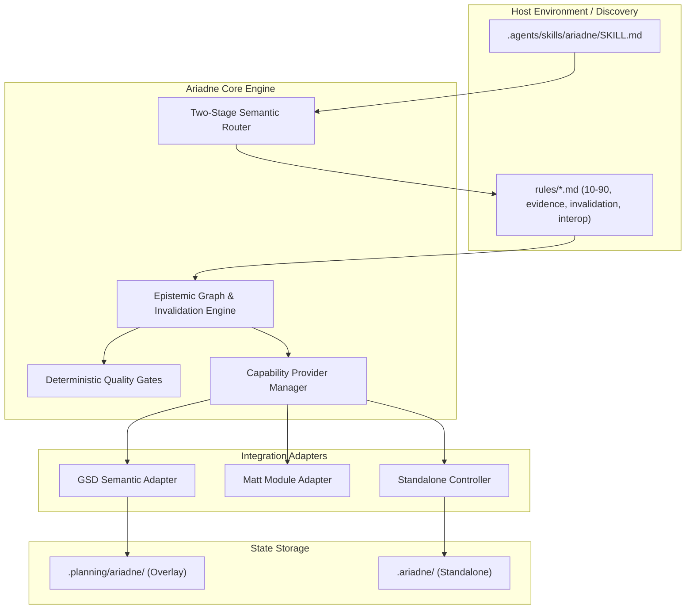
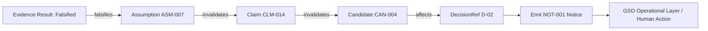

# Specification: Ariadne Software Reasoning Layer

**Status:** Ready for Agent  
**Triage Label:** `ready-for-agent`  
**Input Source:** `ariadne_software_reasoning_harness_spec_v4.md`  
**Writing Standard:** ASD-STE100 Simplified Technical English / RFC 2119  

---

## Problem Statement

When AI coding agents and human engineers tackle complex software challenges, they frequently jump to premature implementation mechanisms before isolating true engineering requirements, exploring candidate solution spaces, or verifying architectural assumptions.

Existing frameworks solve adjacent problems but leave a critical reasoning gap:
- **Operational / Delivery Frameworks (e.g., GSD - `get-shit-done`)** manage project roadmaps, milestones, phase state, execution waves, and verifications, but treat architectural reasoning as an informal black box. They lack first-class semantics for engineering uncertainty, causal hypotheses, candidate mechanisms, and assumption dependencies.
- **Local Engineering Module Skills (e.g., Matt Pocock Skills)** provide battle-tested local disciplines (such as TDD, bug diagnosis, prototyping, domain modeling, and codebase design), but do not maintain a persistent epistemic graph across multi-session builds or track transitive invalidation when foundational assumptions fail.
- **Context Loss & Invalidation Failures:** When runtime evidence or post-execution verification disproves a design assumption, agents frequently hallucinate consistency, silently rewrite operational history, or fail to propagate the invalidation to dependent architectural decisions. Furthermore, permanently loading multiple reasoning prompts causes severe context window bloat and degrades model performance.

There is no dedicated software reasoning layer that provides formal epistemic tracking, progressive rule loading, and systematic inventive thinking operations without duplicating project management or local engineering tools.

---

## Solution

The Ariadne Software Reasoning Layer provides a lightweight, model-invoked reasoning and epistemic harness that integrates cleanly between operational orchestrators (like GSD) and local engineering disciplines (like Matt Pocock Skills), while also functioning as a self-sufficient standalone runtime.

Key solution pillars:
1. **Nine Systematic Inventive Thinking (SIT) Operations:** Implements structured reasoning semantics for `frame`, `diagnose`, `transform`, `explore`, `knowledge`, `dependencies`, `dynamics`, `value`, and `validate`.
2. **Persistent Epistemic Graph & Invalidation Engine:** Explicitly models claims, assumptions, hypotheses, contradictions, unknowns, candidate mechanisms, evidence requests, and evidence results with strict provenance tracking (`FACT`, `MEASURED`, `DERIVED`, `ASSUMED`, `PROPOSED`, `UNKNOWN`, `DECIDED`). Falsified assumptions deterministically cascade transitive invalidation to dependent nodes.
3. **Zero-Shadow State & Layer Ownership:** When GSD is active, Ariadne never creates parallel `PROJECT.md`, `ROADMAP.md`, `REQUIREMENTS.md`, or `STATE.md` files. Ariadne projects its semantics directly onto GSD artifacts and stores only non-redundant epistemic state in `.planning/ariadne/`.
4. **Non-Invasive Operational Signaling (`OperationalNotice`):** When verification or runtime evidence invalidates a prior decision basis, Ariadne emits structured operational notices rather than mutating completed phase history, allowing GSD or the human to orchestrate the response.
5. **Two-Stage Progressive Disclosure:** One concise model-invoked root skill (`.agents/skills/ariadne/SKILL.md`) discovers task signals and dynamically loads only the required operational rules (`rules/*.md`), minimizing permanent context overhead.
6. **Provider-Neutral Capability Adaptation:** Reuses model-invoked Matt skills and GSD agents/spikes as capability providers, while strictly enforcing boundaries against auto-invoking human-only delivery skills (`to-spec`, `to-tickets`, `implement`).
7. **Deterministic Code Gates:** Implements structural, semantic, and epistemic quality gates in deterministic code rather than burning LLM tokens on schema and referential integrity checks.
8. **Multi-Mode Support & Resilient Standalone Runtime:** Operates seamlessly across Mode A (GSD + Matt + Ariadne), Mode B (GSD + Ariadne), Mode C (Matt + Ariadne), and Mode D (Standalone Ariadne with `.ariadne/` state surviving context resets).

---

## User Stories

### Epistemic State & Invalidation
1. As a GSD planner, I want to record engineering assumptions (`ASM-*`) and their dependencies on claims (`CLM-*`), so that the basis of my architectural choices is explicitly documented.
2. As a GSD verifier, I want runtime test evidence to automatically evaluate associated `EvidenceRequest` objects, so that unverified claims cannot pass verification gates.
3. As an autonomous agent, I want the epistemic engine to transitively flag all dependent candidates and decisions as `needs-review` when an underlying assumption is falsified, so that invalid architectures are not implemented.
4. As a GSD executor, I want Ariadne to emit an `OperationalNotice` when an assumption is invalidated rather than mutating GSD historical state, so that operational lifecycle integrity is preserved.
5. As an engineering agent, I want every claim and node to maintain explicit provenance (`FACT`, `MEASURED`, `DERIVED`, `ASSUMED`, `PROPOSED`, `UNKNOWN`, `DECIDED`), so that unverified assumptions are never mistaken for proven facts.

### Two-Stage Routing & Progressive Loading
6. As an autonomous agent, I want Ariadne to be implicitly model-invoked via a concise root `SKILL.md`, so that I reach for reasoning tools without requiring explicit user invocation.
7. As an agent with limited context capacity, I want Ariadne to load only the specific `rules/*.md` file relevant to my immediate uncertainty, so that token consumption remains minimal.
8. As a developer configuring the repo, I want Ariadne to discoverable via `.agents/skills/ariadne/` or standard agent skill paths, so that no custom harness patches are required.

### Deployment Modes & Zero-Shadow State
9. As a GSD planner in Mode A, I want Ariadne to read constraints directly from `.planning/PROJECT.md` and phase `CONTEXT.md`, so that project requirements are not duplicated in shadow files.
10. As a GSD plan checker, I want Ariadne to treat locked decisions in phase `CONTEXT.md` as immutable `DECIDED` provenance, so that agents cannot silently reopen settled human decisions without invalidating evidence.
11. As a GSD executor in Mode B (GSD without Matt Skills), I want Ariadne to fall back to GSD-native agents or native tool actions for research and diagnosis, so that reasoning does not fail when Matt Skills are absent.
12. As an engineer working in Mode C (Matt Skills without GSD), I want Ariadne to provide a thin file-based controller while delegating local tasks to Matt skills, so that engineering rigor is maintained without full GSD overhead.
13. As an engineer working in Mode D (Standalone Ariadne), I want Ariadne to persist reasoning state in `.ariadne/` and survive complete context resets, so that multi-session reasoning remains continuous.
14. As an engineer migrating a project from Standalone Ariadne to GSD, I want Ariadne to map `.ariadne/` semantics cleanly into `.planning/` and `.planning/ariadne/` without duplicating records, so that historical epistemic context is preserved.

### Systematic Inventive Thinking (SIT) Operations
15. As a GSD planner facing a request that specifies an implementation mechanism upfront, I want the `frame` operation to separate the required system behavior from the proposed mechanism, so that alternative architectures can be explored.
16. As a debugging agent investigating a complex defect, I want the `diagnose` operation to generate falsifiable causal hypotheses and contrast them against alternative hypotheses, so that root causes are proven before fixes are applied.
17. As an architect facing an unsatisfactory design mechanism, I want the `transform` operation to systematically evaluate removal, separation, function combination, mechanism replacement, and ordering shifts, so that high-leverage architectural alternatives are generated.
18. As a designer with a narrow set of proposals, I want the `explore` operation to categorize candidates by mechanism class rather than superficial vendor or configuration differences, so that true architectural diversity is achieved.
19. As a planner facing an unknown technical fact, I want the `knowledge` operation to select the lowest-cost discriminating method (such as primary-source research or a disposable prototype), so that decisions are unblocked efficiently.
20. As an engineer modifying a core component, I want the `dependencies` operation to evaluate data ownership, schema coupling, deployment coupling, event coupling, and migration coupling, so that systemic blast radius is identified prior to implementation.
21. As a systems architect, I want the `dynamics` operation to evaluate behavior under load, retries, queues, failure modes, and version skew, so that tail-latency and resilience risks are not masked by average-case metrics.
22. As an agent evaluating competing valid candidates, I want the `value` operation to enforce hard requirements without allowing score compensation, so that non-negotiable constraints are never violated by weighted averages.
23. As an engineer executing a high-risk architectural migration, I want the `validate` operation to treat transition architecture (expansion, dual-running, migration, cutover, and temporary mechanism removal) as a distinct engineering object, so that operational cutover risks are minimized.

### Module Integration & Boundary Enforcement
24. As an autonomous agent executing a runnable bug diagnosis, I want Ariadne to delegate the feedback loop to Matt `diagnosing-bugs`, so that proven diagnostic procedures are reused without method duplication.
25. As an agent resolving domain vocabulary conflicts, I want Ariadne to reference Matt `domain-modeling` vocabulary, so that duplicate glossaries are avoided.
26. As an agent designing module boundaries and test seams, I want Ariadne to reuse Matt `codebase-design` concepts (`seam`, `module depth`, `locality`, `adapter`), so that design terminology remains consistent across the repo.
27. As an autonomous agent that has reached a stable architectural candidate, I want Ariadne to create a concise handoff and recommend the human run `/to-spec` or `/to-tickets` rather than attempting to auto-invoke human-only skills, so that human-in-the-loop boundaries are respected.
28. As a code reviewer, I want Ariadne to provide an independent Epistemic Evidence review axis alongside Standards and Spec axes in Matt `code-review`, so that diff verification evaluates assumption validity without blending distinct review dimensions into a single score.

### Deterministic Quality Gates & Evidence Matching
29. As a CI/CD or harness gatekeeper, I want the Structural Gate to deterministically validate node IDs, edge schemas, and reference bindings in code, so that LLM tokens are not wasted on syntax verification.
30. As a quality gatekeeper, I want the Epistemic Gate to reject any candidate that presents an unverified assumption as a fact, so that epistemic rigor is strictly enforced.
31. As a verification engine, I want Ariadne to reject unit test evidence when presented as proof for throughput or concurrency claims, so that evidence class strictly matches claim class.
32. As an engineer managing temporary transition code, I want Ariadne quality gates to verify that every temporary mechanism defines an owner, a removal condition, and a review deadline, so that technical debt is systematically cleaned up.

---

## Implementation Decisions

### 1. Architectural Model and Subsystem Decomposition
The Ariadne harness is structured into decoupled components:
- **Root Skill & Rule Router:** The model-invoked entry point providing two-stage progressive disclosure.
- **Epistemic Graph Engine:** The state machine managing nodes, edges, provenance, and transitive invalidation.
- **Capability Provider Manager:** The provider-neutral abstraction mapping abstract engineering needs to concrete tools (Matt skills, GSD agents, native tools).
- **GSD Semantic Adapter:** The projection layer that interfaces with GSD files (`.planning/*`) and the GSD SDK without creating shadow state.
- **Matt Module Adapter:** The integration layer that invokes model-accessible Matt skills and prepares structured handoffs for human-only skills.
- **Standalone Fallback Controller:** The lightweight runtime that manages `.ariadne/` state and multi-session resumption when GSD is absent.
- **Deterministic Quality Gates:** Fast code-based validators for structural, semantic, and epistemic correctness.



### 2. Epistemic Graph Data Model & Provenance Algebra
- **Node Types:** `Claim` (`CLM-*`), `Assumption` (`ASM-*`), `Hypothesis` (`HYP-*`), `Contradiction` (`CTR-*`), `Unknown` (`UNK-*`), `Candidate` (`CAN-*`), `EvidenceRequest` (`EVDREQ-*`), `EvidenceResult` (`EVD-*`), `Transition` (`TRANS-*`), `OperationalNotice` (`NOT-*`), `Experiment` (`EXP-*`), `DecisionRef`, `ArtifactRef`, `RepositoryFactRef`.
- **Edge Types:** `supports`, `contradicts`, `depends_on`, `derived_from`, `answers`, `tests`, `falsifies`, `invalidates`, `satisfies`, `violates`, `supersedes`, `references`.
- **Topological Invariant:** Deductive edges (`derived_from`, `depends_on`) MUST strictly form a Directed Acyclic Graph (DAG), validated at node registration time. Cyclic domain tensions MUST be modeled via `CTR-*` or `HYP-*` nodes rather than circular premise derivations (ADR 0009).
- **Provenance Lattice & Meet Algebra:**
  $$\mathbf{U} \sqsubset \mathbf{A} \sqsubset \mathbf{P} \sqsubset \mathbf{D} \sqsubset \mathbf{M} \sqsubset \mathbf{F} \sqsubset \mathbf{L}$$
  ($\text{Unknown} \sqsubset \text{Assumed} \sqsubset \text{Proposed} \sqsubset \text{Derived} \sqsubset \text{Measured} \sqsubset \text{Fact} \sqsubset \text{Decided/Locked}$).
  - For any multi-premise derivation, provenance is mechanically clamped by the meet operator: $\operatorname{prov}(C) = \bigsqcap_{i=1}^n \operatorname{prov}(P_i)$ (ADR 0007).

### 3. Transitive Invalidation Mechanics & Operational Notices
- When an `EvidenceResult` returns a falsifying verdict for an `Assumption` (`ASM-*`) or `Hypothesis` (`HYP-*`):
  1. The epistemic engine marks the antecedent node as `FALSIFIED`.
  2. The engine executes a single-pass linear-time reverse topological traversal ($\mathcal{O}(V + E)$) along `depends_on`, `derived_from`, and `supports` edges.
  3. All dependent `Claim`, `Candidate`, and `DecisionRef` nodes are deterministically marked as `NEEDS_REVIEW`.
  4. In GSD mode, Ariadne constructs an `OperationalNotice` (`NOT-*`), appends it to `.planning/ariadne/NOTICES.jsonl`, registers it in `STATE.yaml` (`active_notices`), and renders an alert banner to stdout without mutating GSD historical phase records (`.planning/phases/*/SUMMARY.md`) (ADR 0010).



### 4. Zero-Shadow State Layout and GSD Semantic Projection
- **GSD Mode Active:**
  - Ariadne reads project purpose from `.planning/PROJECT.md`, requirements from `.planning/REQUIREMENTS.md`, phase context from `.planning/phases/*/CONTEXT.md`, and roadmap from `.planning/ROADMAP.md`.
  - Ariadne writes only epistemic overlay data under `.planning/ariadne/`:
    - `STATE.yaml`: Capability mode, active depth mode, active notices, and open reasoning state.
    - `GRAPH.jsonl`: Epistemic nodes and edges (Problem State $\mathcal{S}_t$ view dynamically projected).
    - `NOTICES.jsonl`: Invalidation notices.
    - `INDEX.md`: Human-readable summary index.
    - `candidates/`, `evidence/`, `runs/`: Detailed candidate and evidence records.
- **Standalone Mode Active:**
  - Ariadne writes self-contained state under `.ariadne/`:
    - `PROJECT.md`, `REQUIREMENTS.md`, `CONTEXT.md`, `STATE.yaml`, `GRAPH.jsonl`, `NOTICES.jsonl`, `artifacts/`, `candidates/`, `evidence/`, `runs/`, `HANDOFF.md`.

### 5. Two-Stage Rule Organization & Ephemeral Subagents
- **Stage 1 (Root Skill):** `.agents/skills/ariadne/SKILL.md` containing a concise model-facing description with explicit trigger branches and a routing table.
- **Stage 2 (Targeted Rules):** Loaded dynamically based on the identified uncertainty:
  - `rules/00-core.md`: Core invariants, lattice definitions, and provenance algebra.
  - `rules/10-frame.md`: Separating requirement from mechanism.
  - `rules/20-diagnose.md`: Falsifiable causal hypotheses.
  - `rules/30-transform.md`: Mechanism transformations and trimming.
  - `rules/40-explore.md`: Mechanism class expansion.
  - `rules/50-knowledge.md`: Discriminating tests for unknowns.
  - `rules/60-dependencies.md`: Systemic coupling analysis.
  - `rules/70-dynamics.md`: Runtime timing, load, and queue dynamics.
  - `rules/80-value.md`: Non-compensatory requirement evaluation.
  - `rules/90-validate.md`: Evidence matching and transition architecture.
  - `rules/evidence.md`: Evidence request lifecycle and revision binding.
  - `rules/invalidation.md`: Transitive dependency invalidation.
  - `rules/gsd-interop.md`: GSD projection and operational notice rules.
  - `rules/matt-modules.md`: Matt skill integration and boundary contracts.
  - `rules/standalone.md`: Standalone controller execution and handoffs.
- **Ephemeral Subagent Envelopes:** When Deep Mode triggers adversarial reviews or empirical spikes, worker subagents communicate exclusively through schema-validated `EpistemicDelta` JSON envelopes (` ```json ariadne-delta ... ``` `) merged directly into `GRAPH.jsonl` (ADR 0008, ADR 0009).

### 6. Orthogonal Depth Modes & Transition Architecture Lifecycle
- **Depth Modes (Fast, Standard, Deep):** Orthogonal execution parameter independent of Deployment Modes (A, B, C, D) (ADR 0008).
- **Separation Diversity Rule:** In Standard/Deep modes, any active `CTR-*` node requires $\ge 3$ distinct `CAN-*` candidate mechanisms spanning different Separation Principles before locking decisions (ADR 0010).
- **Transition Architecture (`TRANS-*`) Lifecycle:**
  $$\text{PROPOSED} \longrightarrow \text{EXPANDED} \longrightarrow \text{DUAL\_RUNNING} \longrightarrow \text{MIGRATING} \longrightarrow \text{CONTRACTED} \longrightarrow \text{RETIRED}$$
  - Mandatory fields: `target_mechanism_ref`, `retirement_predicate`, `expiration_deadline`, and `cleanup_verification_test` (ADR 0008, ADR 0010).

### 7. Deterministic Quality Gates in Code
- **Structural Gate:** Deterministically validates Zod schemas, entity ID prefixes (`CLM-`, `ASM-`, `CAN-`, `TRANS-`, `NOT-`), DAG cycle-freedom on derivation edges, edge referential integrity, and revision hashes.
- **Semantic Gate:** Enforces operation-specific semantic rules (e.g., verifying that `frame` outputs separate requirement from mechanism; verifying that `value` contains no weighted score compensating a failed hard requirement; enforcing Separation Diversity on `CTR-*`).
- **Claim-Class Compatibility Gate:** Rejects `EvidenceResult` submissions whose Evidentiary Ladder rung is lower than the minimum required for the specified claim category (ADR 0007).
- **Epistemic Gate:** Verifies that no node with `ASSUMED` provenance is tagged as `FACT`, and rejects candidates whose dependencies are in an unresolved `NEEDS_REVIEW` or `FALSIFIED` state.

---

## Testing Decisions

### What Makes a Good Test
Tests must strictly verify external behavior, invariant enforcement, and state transitions at the harness boundary. Tests must not assert against private helper methods or transient internal variables. A good test sets up a task context and repository environment, runs the harness/controller, and verifies:
1. Correct operation selection and rule routing.
2. Accurate epistemic graph mutations and provenance tagging.
3. Proper transitive invalidation and generation of `OperationalNotice` events.
4. Correct capability provider dispatch without violating module boundaries.
5. Strict adherence to Zero-Shadow State rules.
6. Seamless resumption across simulated context resets.

### Modules Tested
- `AriadneHarnessController` / Standalone Engine.
- `EpistemicGraph` and Invalidation Engine.
- `GsdSemanticAdapter` and `MattSkillAdapter`.
- `DeterministicGates` (Structural, Semantic, Epistemic).
- `CapabilityProviderManager`.

### Prior Art & Test Suite Structure
The test suite implements the 10 normative acceptance scenarios defined in the v4.0 specification:
- **Scenario A (Implicit Activation in GSD Planner):** Verifying that a GSD planner automatically discovers Ariadne and invokes `frame` to separate a queue mechanism from required behavior.
- **Scenario B (Locked Decision Preservation):** Verifying that a locked GSD decision (`D-03`) is assigned `DECIDED` provenance and cannot be reopened without falsifying evidence or human instruction.
- **Scenario C (Matt Skill Module Delegation):** Verifying that an observed defect delegates to Matt `diagnosing-bugs` and normalizes the resulting feedback loop into an Ariadne `EvidenceRequest`.
- **Scenario D (User-Invoked Skill Boundary):** Verifying that Ariadne generates a structured handoff recommending `/to-spec` or `/to-tickets` rather than attempting to execute human-only skills automatically.
- **Scenario E (Verification Falsification Cascade):** Verifying that post-execution falsification of an assumption marks dependent candidates as `needs-review` and emits an `OperationalNotice` without mutating GSD history.
- **Scenario F (Standalone Mode Cold-Start & Recovery):** Verifying that standalone Ariadne initializes `.ariadne/`, executes operations, and recovers complete state following a context reset.
- **Scenario G (Matt Skills Absent Fallback):** Verifying that Ariadne gracefully falls back to native/GSD capabilities when Matt Skills are not installed.
- **Scenario H (Zero-Shadow State Verification):** Verifying that in GSD mode, no duplicate `PROJECT.md`, `ROADMAP.md`, or `STATE.md` files are created.
- **Scenario I (Systemic Coupling Analysis):** Verifying that changes with large blast radius trigger `dependencies` analysis across schema, deployment, and event coupling.
- **Scenario J (Standalone to GSD Migration):** Verifying that an existing `.ariadne/` workspace cleanly projects its entities into `.planning/` and `.planning/ariadne/` upon GSD initialization.

---

## Out of Scope

The following areas are explicitly out of scope for this specification and must not be implemented by Ariadne:
- **Project Delivery & Workflow Orchestration:** Ariadne does not manage sprint roadmaps, milestone planning, phase dispatch, or task execution waves when GSD is present.
- **Reinventing Local Engineering Modules:** Ariadne does not reimplement the internal logic of Matt Pocock skills (such as TDD workflows, AST-based code transforms, or bug diagnosis loops) when those skills are available.
- **Permanent Nine-Skill Context Pollution:** Ariadne will not install nine separate model-invoked skills that clutter permanent agent context.
- **Auto-Invoking Human-Only Skills:** Ariadne will never attempt to autonomously invoke user-controlled skills (`grill-with-docs`, `to-spec`, `to-tickets`, `implement`).
- **Direct Mutation of External Operational History:** Ariadne will never directly alter or rewrite completed GSD phase records upon assumption invalidation.
- **Shadow Project State:** Ariadne will never maintain a parallel copy of GSD `PROJECT.md`, `ROADMAP.md`, `REQUIREMENTS.md`, or `STATE.md`.
- **Reopening Locked Decisions Arbitrarily:** Ariadne will not reopen settled human decisions simply because an alternative candidate appears mathematically superior.
- **Blended Review Scoring:** Ariadne will not merge independent review dimensions (Standards, Spec, Epistemic Evidence) into a single composite quality score.

---

## Further Notes

- **Documentation Standards:** All human-facing documentation, rule files, and skill instructions must conform to ASD-STE100 Simplified Technical English (Issue 9) and RFC 2119 requirement keyword semantics.
- **Diagrams:** All architecture, workflow, and lifecycle diagrams must use standard Mermaid.js syntax.
- **Conformance Levels:** Conformance is evaluated at Core Ariadne, GSD-Integrated, Matt-Integrated, or Full Ariadne level according to the Final Build Checklist.
- **Build Sequence:** Implementation must follow integration-first order: Root Skill & Rule Routing $\rightarrow$ Standalone Epistemic State $\rightarrow$ GSD Adapter & Zero-Shadow Enforcement $\rightarrow$ Matt Module Discovery $\rightarrow$ Vertical Slice (`frame`, `diagnose`, `validate`) $\rightarrow$ Evidence & Invalidation $\rightarrow$ Integration Tests $\rightarrow$ Remaining Operations $\rightarrow$ Resumption & Migration.
