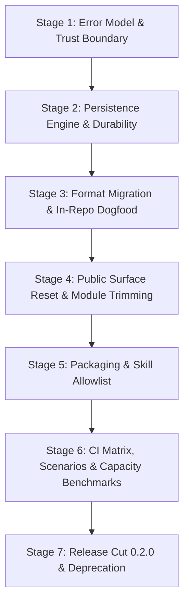

# Decide the implementation rollout and backport sequence

Type: grilling
Status: resolved
Blocked by: 06, 08, 09, 10
Parent: [Ariadne production readiness](../map.md)

## Question

Once the public interface, error model, capacity envelope, and CI/release gates are settled, what dependency-ordered implementation rollout and backport sequence takes the production-hardening changes from the current code to the release contract? Decide which changes land together, which compatibility or migration bridge must ship first, how legacy workspaces are protected during rollout, and what evidence permits each transition.

## Comments

- 2026-09-07 — Grilling round 1: the user accepted the recommended 6-stage dependency-ordered implementation rollout to `0.2.0`, immediate fail-closed legacy protection in Stage 2 (`MIGRATION_REQUIRED`), Stage 3 in-repo dogfood migration of `.ariadne/`, zero backports to `0.1.x` with single forward migration and npm deprecation advisory, progressive linear staging directly to `main` without runtime feature flags, and cumulative stage exit gates.
- 2026-09-07 — Grilling round 2: the user accepted committing migrated V1 canonical state while gitignoring `.ariadne/backups/`, Ponytail deletion/trimming of speculative modules (`src/capabilities/`, `src/teach-harness/`, `src/teach-methodology/`, duplicate binary `ariadne-reasoning`, `methodize-harness` skill), linear squash PR integration into `main`, and clean git revert / `ariadne migrate --rollback` for in-flight recovery.
- 2026-09-07 — Grilling round 3: the user accepted bumping `package.json` version to `0.2.0` in Stage 5 alongside packaging changes, and synchronizing user documentation and READMEs in Stage 4 with automated validation (`npm run docs:test`) gating Stage 6.

## Answer

### Rollout phasing and dependency ordering

The production-hardening transition from `0.1.0` to the `0.2.0` release contract is partitioned into six dependency-ordered implementation stages merged linearly into `main`, followed by the final release cut. Runtime feature flags are prohibited; each stage cleanly replaces or evolves code in place.



1. **Stage 1 — Error Model, Diagnostics & Trust Boundary**:
   - **Scope**: Define `DiagnosticCode` (19 screaming-snake string constants), `AriadneError` base class (code, message, repair, detail), exit classes (0: success/help, 1: domain continuation, 2: full stop), and structured JSON stderr formatting.
   - **Security**: Implement canonical path resolution, containment boundary validation (rejection of paths and symlinks escaping the storage root or repository), and direct explicit command execution (vectorized execution, zero shell interpolation, argument bounding, timeout, and 1 MB output capture limit).
   - **Deliverables**: `src/core/errors.ts`, `src/core/containment.ts`, `src/core/exec.ts`, unit tests in isolated temporary directories.

2. **Stage 2 — Persistence Engine, Root Locking & Durability**:
   - **Scope**: Implement the single root lock (`.ariadne/.lock`) with process-crash detection (PID verification, owner token, 60s timeout, non-stealing age policy). Implement append-only framed journal persistence with `FileHandle.sync()`, per-attempt pointer ledgers (`.orchestration/attempts/<id>.jsonl`), idempotency key verification, explicit 4-discriminant outcomes (`not_committed`, `commit_unknown`, `committed`, `committed_with_recovery_needed`), incomplete-tail truncation recovery, and rebuildable derived projections (`STATE.yaml`, `INDEX.md`, `cards/`).
   - **Legacy Protection Gate**: Storage engine immediately detects unversioned legacy v0 files (`GRAPH.jsonl`, `NOTICES.jsonl`). Read-only inspection is permitted; all mutation operations fail closed with `AriadneError(MIGRATION_REQUIRED)`.
   - **Deliverables**: `src/graph/storage.ts`, `src/graph/lock.ts`, `src/graph/journal.ts`, crash recovery tests, multi-process lock contention tests.

3. **Stage 3 — Persisted-Format Migration & Workspace Protection**:
   - **Scope**: Implement `ariadne migrate` CLI command and programmatic migration API. Implement legacy v0 parser and v1 framed record emitter. Implement staging-area migration, immutable digest-verified backups in `.ariadne/backups/<migration-id>/`, pre/post migration invariant checks, rollback via `ariadne migrate --rollback`, dry-run inspection, and resume after interruption.
   - **Dogfood Migration Gate**: Run `ariadne migrate` against this repository's own active `.ariadne/` directory (880+ nodes/edges). Commit the migrated v1 canonical history and projections to Git; add `.ariadne/backups/` to `.gitignore`.
   - **Deliverables**: `src/graph/migration.ts`, `src/cli/migrate.ts`, `.gitignore` update, migration verification fixture suite.

4. **Stage 4 — Public Surface Reset, Module Trimming & Doc Sync**:
   - **Scope**: Re-export only the explicit Release Compatibility Contract from `src/index.ts` (ESM root entrypoint). Expose unified `EpistemicGraph` and `EpistemicGateEngine`. Standardize CLI to single `ariadne` binary with `--format json` and exit codes 0/1/2.
   - **Trimming (Ponytail)**: Delete dead speculative modules: `src/capabilities/`, `src/teach-harness/`, `src/teach-methodology/`, and the duplicate binary `ariadne-reasoning`.
   - **Documentation**: Synchronize all READMEs, examples, and manuals to reference `ariadne` exclusively.
   - **Deliverables**: `src/index.ts`, `src/cli/index.ts`, deleted speculative files, updated documentation.

5. **Stage 5 — Packaging, Manifest Realignment & Skill Allowlist**:
   - **Scope**: Package the 4 canonical skills (`ariadne`, `codebase-design`, `grilling`, `domain-modeling`); remove `.agents/skills/methodize-harness`.
   - **Manifest**: Update `package.json` to bump version to `"0.2.0"`, configure `"engines": { "node": ">=22" }`, restrict `"bin": { "ariadne": "dist/cli/index.js" }`, and lock `"files": ["dist", ".agents/skills/ariadne", ".agents/skills/codebase-design", ".agents/skills/grilling", ".agents/skills/domain-modeling", "README.md", "LICENSE"]`.
   - **Deliverables**: `package.json`, packaged skills, pack smoke tests (`npm run pack:smoke`).

6. **Stage 6 — CI Matrix, Specialized Verification Suites & Capacity Benchmarks**:
   - **Scope**: Implement `.github/workflows/ci.yml` and `.github/workflows/release.yml`. Set up the 4-platform matrix (Linux x64 Node 22, Linux x64 Node 24, Windows x64 Node 24, macOS arm64 Node 24).
   - **Verification**: Implement the 4 specialized scenario suites (persistence crash/corruption, migration edge cases, security containment, multi-process concurrency). Implement the dedicated 10K-node ceiling benchmark on Linux Node 24 (<100ms/<1s/<10s, peak RSS $\le$ 256 MB). Implement clean-consumer smoke tests across npm, pnpm, and Yarn. Enforce `npm run docs:test`.
   - **Deliverables**: `.github/workflows/*`, `tests/scenarios/*`, `tests/benchmarks/*`.

7. **Stage 7 — Release Cut `0.2.0` & Deprecation Playbook**:
   - **Scope**: Tag and publish `v0.2.0` via GitHub Actions OIDC trusted publishing with automatic provenance. Verify registry availability and package integrity. Execute the deprecation advisory for `0.1.0` on npm:
     ```bash
     npm deprecate ariadne-reasoning@0.1.0 "0.1.0 is an unhardened experimental prototype with accidental API exposure. Please upgrade to 0.2.0 and run 'ariadne migrate'."
     ```

---

### Backport and maintenance policy

- **Zero Backports to `0.1.x`**: `0.1.0` was an unhardened pre-1.0 prototype with accidental surface exposure. No `0.1.x` branch will be maintained, and no backports will be issued.
- **Strict Forward Evolution**: After `0.2.0`, Semantic Versioning is strictly enforced per the Release Compatibility Contract (minor = compatible additions, patch = bug fixes, major = breaking changes).
- **Format Independence**: Persisted-Format Version (v1) and Merge Protocol Version (v1) evolve independently from package releases.

---

### In-flight recovery and rollback playbook

- **Main Branch Regressions (Pre-Release)**: If a regression is discovered on `main` before `0.2.0` is tagged, the offending stage PR is reverted via `git revert`.
- **Workspace State Rollback**: If a workspace migration needs reversal during development or testing, `ariadne migrate --rollback <backup-id>` atomically restores the immutable backup created prior to migration.
- **Fail-Closed Boundary**: At all times, unmigrated legacy workspaces encountering mutating commands produce `MIGRATION_REQUIRED` without modifying existing disk state.
