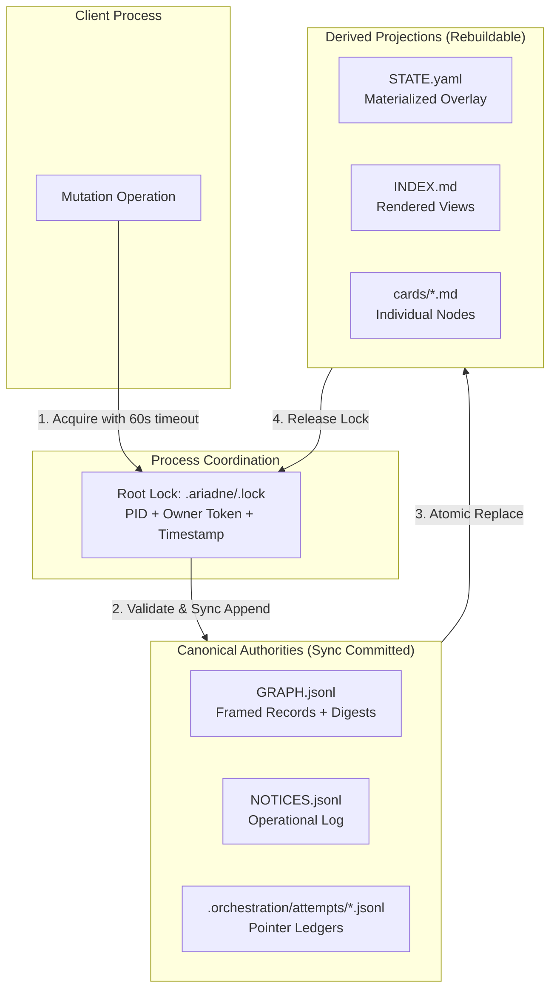
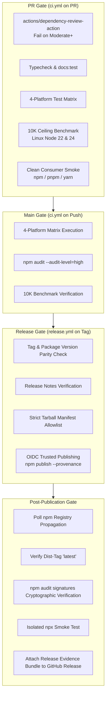
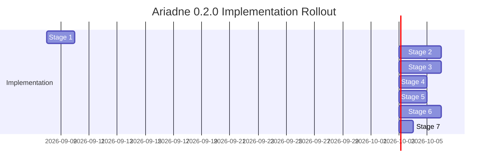

# Production Hardening Specification: Ariadne 0.2.0

Status: Approved / Implementation-Ready  
Release Target: `0.2.0` (Contract Reset)  
Preceding Release: `0.1.0` (Experimental Prototype)  
Repository: `elchupanebrej/ariadne`  
Scope: Public TypeScript API, `ariadne` CLI, `.ariadne` persistence, packaged agent skills, Merge Protocol, Git integration, and ecosystem adapters.

---

## 1. Executive Summary, Scope & Non-Goals

### 1.1 Purpose and Intent
This document specifies the complete production hardening contract for the Ariadne software reasoning layer and epistemic substrate. It consolidates all twelve architectural investigations and grilling decisions from the Wayfinder production-readiness roadmap into a single, normative, implementation-ready blueprint. 

Ariadne `0.1.0` was an unhardened pre-1.0 prototype characterized by accidental public surface exposure, unversioned file formats, race-prone file operations, unconstrained process execution, and unbounded resource consumption. Ariadne `0.2.0` executes a one-time pre-1.0 contract reset that replaces accidental exposures with a minimal, deep, verified, fail-closed production contract.

### 1.2 In-Scope Surfaces
The normative guarantees in this specification govern:
1. **Public Library API**: The root ESM entrypoint (`"."`) of the `ariadne-reasoning` npm package and its generated TypeScript declarations.
2. **CLI Binary**: The single installed executable `ariadne`, its commands, argument syntax, exit codes, and structured JSON output.
3. **Persisted Storage (`.ariadne/`)**: The local-filesystem storage engine, canonical journal logs, derived projections, process locks, and format migrations.
4. **Packaged Agent Skills**: The four canonical skills bundled within the npm package (`ariadne`, `codebase-design`, `grilling`, `domain-modeling`).
5. **Git Integration & Merge Protocol**: Repository-local hooks, the three-way epistemic merge driver, and Merge Receipts.
6. **Ecosystem Seam**: The CLI-based `ingest` boundary for foreign artifacts and workflows.

### 1.3 Explicit Non-Goals (Out of Scope)
The following capabilities are explicitly ruled out of the `0.2.0` release and its operational model:
- **Network Filesystems & Distributed Coordination**: NFS, SMB, CIFS, SSHFS, cloud-synced folders (Dropbox, iCloud, Google Drive), and distributed lock managers. The operational model strictly assumes cooperating processes on a single physical machine accessing a local POSIX/Windows filesystem.
- **External Database Storage**: PostgreSQL, SQLite, Redis, or embedded database engines. Persisted state remains human-readable JSONL/YAML/Markdown files under `.ariadne/`.
- **Arbitrary Command Sandboxing**: Ariadne does not provide kernel-level cgroups, namespaces, containers, or hypervisors. Explicit external commands configured by users are spawned directly on the host with input bounding and output redaction only.
- **Browser & CommonJS Runtimes**: Client-side web execution, React Native, Electron renderer environments, and Node CommonJS (`require()`) loaders.
- **Speculative Harness & Methodology Modules**: Autonomous agent harness controllers, dynamic methodology teaching frameworks, and complex runtime capability probes.
- **Backports to `0.1.x`**: No patch releases or security backports will be produced for `0.1.0`. All users must migrate forward to `0.2.0`.

---

## 2. Supported Environments & Runtime Matrix

### 2.1 Node.js Engine Policy
Ariadne targets active and maintenance Node.js Long-Term Support (LTS) releases. The `package.json` declares an explicit engine range:
```json
{
  "engines": {
    "node": "^22.0.0 || ^24.0.0"
  }
}
```
Odd-numbered versions (e.g., Node 23, Node 25) and End-of-Life (EOL) lines (Node 18, Node 20) are unsupported in production. The engine boundary advances strictly in synchronization with official Node.js LTS transitions.

### 2.2 Operating Systems and CPU Architectures
Production support covers standard operating systems within Node.js Tier-1/Tier-2 support definitions:
- **Linux**: glibc 2.31+ on `x64` and `arm64` (Alpine/musl is untracked for release-blocking CI).
- **Windows**: Windows 11 / Windows Server 2022 on `x64`.
- **macOS**: macOS 13 (Ventura) or later on `arm64` (Apple Silicon) and `x64`.

### 2.3 Package Manager Compatibility
Ariadne supports installation and dependency resolution across modern package managers:
- **npm**: v10.0.0 through v12.x
- **pnpm**: v10.0.0 through v12.x
- **Yarn (Modern)**: v4.14.1 through current v4.x releases when configured with `nodeLinker: node-modules`. (PnP / zero-install is unsupported).

### 2.4 Minimal Release-Blocking CI Matrix
To guarantee platform parity without redundant runner overhead, release-blocking CI enforces a 4-job matrix:
1. `linux-x64-node22`: Ubuntu Latest, Node.js 22 LTS (Unit, recovery, and security suites).
2. `linux-x64-node24`: Ubuntu Latest, Node.js 24 LTS (Full test suite, 10K ceiling benchmark, clean-consumer multi-manager verification).
3. `windows-x64-node24`: Windows Latest, Node.js 24 LTS (Platform path containment, NTFS case sensitivity, and file locking semantics).
4. `macos-arm64-node24`: macOS Latest (M-series runner), Node.js 24 LTS (APFS filesystem semantics and architecture validation).

---

## 3. Normative Storage, Durability & Process Coordination



### 3.1 Authority vs. Derived Projections
Storage architecture enforces a strict separation between authoritative append-only ledgers and rebuildable materialized views:

1. **Canonical Authorities**:
   - `GRAPH.jsonl`: The single canonical history of all graph mutations, node transitions, and edge assertions.
   - `NOTICES.jsonl`: The single canonical operational log of adapter notices and broadcast events.
   - `.orchestration/attempts/<id>.jsonl`: Dedicated pointer-only event ledgers for individual orchestration attempts. Attempt states are never intermixed with domain graph nodes.
2. **Derived Projections**:
   - `STATE.yaml`: Fast-lookup cache of materialized graph status, active notice projections, and adapter overlays.
   - `INDEX.md`: Markdown summary of epistemic state, frontier nodes, and open unknowns.
   - `cards/<id>.md`: Individual human-readable node cards.

*Normative Rule*: Projections are entirely secondary. If any projection is missing, out of sync, or corrupt, it must be regenerated from the canonical authorities. A projection can never be used to overwrite, heal, or reconcile a canonical ledger.

### 3.2 Mutual Exclusion and Root Locking
Coordination across concurrent processes on the local machine uses a single root lock:
- **Lock Path**: `.ariadne/.lock`
- **Acquisition Protocol**: Atomic directory creation via `fs.mkdir(lockPath)` (`O_EXCL` semantics).
- **Lock Payload**: Inside the lock directory, an owner record `.ariadne/.lock/owner.json` is written containing:
  ```json
  {
    "schemaVersion": 1,
    "pid": 12345,
    "ownerToken": "7f9a8b1c-4d2e-4a3f-9e1b-8c7d6e5f4a3b",
    "acquiredAt": "2026-09-07T18:00:00.000Z"
  }
  ```
- **Lock Stale Timeout**: `LOCK_STALE_MS = 60000` (60 seconds).
- **Ownership Verification & Crash Recovery**:
  - *PID-Absent Fast-Path*: If `.ariadne/.lock` exists, the candidate process reads `owner.json`. It queries the OS process table (`process.kill(pid, 0)`). If the process is definitively absent (`ESRCH`), the lock is classified as abandoned by a crashed process and is safely reaped and reclaimed immediately.
  - *PID-Alive / Ambiguous*: If the process exists, or if permission is denied (`EPERM`), or if `owner.json` is unreadable, the candidate process waits and retries until `LOCK_STALE_MS` expires.
  - *No Lock Stealing*: Lock age alone never authorizes stealing. If the timeout expires and the PID remains alive or ambiguous, the operation fails closed with `AriadneError(LOCK_OWNERSHIP_UNCERTAIN)`.
- **Release Protocol**: The releasing process verifies its `ownerToken` matches `owner.json` before deleting `owner.json` and removing the lock directory.

### 3.3 Transaction Framing & Write Cycle
Every logical mutation follows an explicit 5-phase transaction protocol:
1. **Lock Acquisition**: Acquire `.ariadne/.lock`.
2. **Read & Pre-Validate**: Ingest current canonical records, validate schema compliance, and verify state invariants.
3. **Framed Canonical Append**:
   - Format mutation as a length-prefixed and CRC32/SHA-256 digested frame.
   - Write frame to `GRAPH.jsonl`.
   - Issue `FileHandle.sync()` to flush data and file metadata to physical storage. The completion of `sync()` constitutes the irrevocable **Commit Point**.
4. **Projection Staging & Atomic Replace**:
   - Write updated `STATE.yaml`, `INDEX.md`, and affected cards to temporary sibling files (`.tmp.<file>.<pid>`).
   - Atomically rename temporary files over current projections via `fs.rename()`.
5. **Lock Release**: Release `.ariadne/.lock`.

### 3.4 Explicit Persistence Outcomes
Persistence operations return one of four explicit outcomes (no ambiguous booleans):
- `not_committed`: Operation aborted prior to canonical write (e.g., validation failure, lock contention). State is pristine.
- `commit_unknown`: An I/O error or abnormal interruption occurred during the canonical append or `sync()`. The ledger state is indeterminate and requires inspection.
- `committed`: Canonical append and all derived projections successfully synchronized.
- `committed_with_recovery_needed`: Canonical append successfully synchronized, but projection staging or atomic replace failed. The mutation is permanent; projections must be rebuilt via `ariadne status` or background repair.

### 3.5 Crash Recovery & Incomplete Tail Truncation
On initialization and lock acquisition, Ariadne inspects the tail of `GRAPH.jsonl`:
- **Incomplete Final Frame**: If the last frame in `GRAPH.jsonl` is partially written (truncated JSON, torn write, or mismatched frame length/CRC), the recovery engine automatically truncates `GRAPH.jsonl` back to the last valid frame offset, logs an audit warning, and emits `INCOMPLETE_TAIL`.
- **Committed History Corruption**: Any corruption, invalid checksum, schema invalidity, or sequence break located *prior* to the final frame is catastrophic. Automatic truncation is strictly prohibited. The storage engine fails closed immediately with `AriadneError(CORRUPT_PERSISTED_HISTORY)`.

---

## 4. Persisted-Format Evolution & Migration

### 4.1 Independent Format Versioning
Persisted data formats are decoupled from the npm package version, Merge Protocol version, and skill bundle versions. Every canonical authority and derived projection tracks an independent positive integer format version:

| Entity | Legacy Version | Target V1 Specification |
|---|---|---|
| `GRAPH.jsonl` | `v0` (unversioned, naked JSON) | `v1` (framed envelope, schema version, idempotency key, SHA-256 payload digest) |
| `NOTICES.jsonl` | `v0` (unversioned, naked JSON) | `v1` (framed envelope, schema version, monotonic sequence ID) |
| `STATE.yaml` | `v0` (unversioned YAML) | `v1` (version header, overlay dictionary, canonical projection hashes) |
| `INDEX.md` / `cards/*.md` | `v0` (unversioned Markdown) | `v1` (frontmatter metadata, deterministic card layout) |
| `.orchestration/attempts/` | `v0` (unversioned event files) | `v1` (pointer-only framed ledgers) |

### 4.2 Legacy Workspace Protection
Any existing `.ariadne` workspace lacking version metadata or containing `v0` structures is classified as a legacy workspace:
- **Read-Only Inspection**: Legacy workspaces may be inspected using read-only CLI commands (`ariadne status`, `ariadne report`).
- **Mutation Prohibition**: Any command that modifies state (`ariadne node`, `ariadne edge`, `ariadne gate`) immediately aborts without touching the filesystem, throwing `AriadneError(MIGRATION_REQUIRED)`.

### 4.3 Explicit Migration Protocol (`ariadne migrate`)
Migration is explicitly user-invoked and executes under full mutual exclusion:

```mermaid
flowchart LR
    Start([ariadne migrate]) --> Lock[Acquire Root Lock]
    Lock --> ValidateSrc[Full Source Validation & Digest]
    ValidateSrc --> Backup[Create Immutable Backup<br/>.ariadne/backups/MIG-ID/]
    Backup --> Stage[Build V1 in Staging Area<br/>.ariadne/staging/MIG-ID/]
    Stage --> VerifyInvariants[Verify Invariants & Entity Counts]
    VerifyInvariants --> CommitManifest[Mark Manifest COMPLETE]
    CommitManifest --> AtomicSwap[Atomic Swap Staging -> Live]
    AtomicSwap --> ReleaseLock[Release Lock & Return 0]
```



1. **Pre-Flight Dry Run (`ariadne migrate --dry-run`)**: Inspects the workspace, validates source integrity, reports entity counts, target versions, and required storage, without writing to disk.
2. **Locking & Validation**: Acquires `.ariadne/.lock` and verifies all legacy records against legacy parsing schemas.
3. **Immutable Digest Backup**: Creates an immutable backup in `.ariadne/backups/<migration-id>/` containing verbatim copies of all source files and a signed `manifest.json` recording SHA-256 digests. `.ariadne/backups/` is automatically added to `.gitignore`.
4. **Staging Generation**: Successor V1 files are synthesized in `.ariadne/staging/<migration-id>/`. Every legacy record is migrated in exact original order.
5. **Zero-Loss Guarantee**:
   - Every node ID, label, type, timestamp, and metadata payload is preserved byte-for-byte.
   - Every edge source, target, type, and weight is preserved.
   - Valid adapter-owned overlay attributes in `STATE.yaml` are copied into the V1 overlay dictionary.
   - Orchestration attempt pointers and timestamps remain invariant.
6. **Integrity Gate & Atomic Commit**: Successor files are validated against V1 Zod schemas. The migration manifest status transitions to `COMMITTED`. Sibling directories are atomically swapped.
7. **Interruption Recovery**: If migration crashes mid-flight, a subsequent run reads the manifest. If source files match the backup digest, migration resumes from staging; if source files were altered, it aborts with `CORRUPT_PERSISTED_HISTORY`.
8. **Rollback (`ariadne migrate --rollback <migration-id>`)**: Replaces the active workspace with the verified backup snapshot.

---

## 5. Public Compatibility & Surface Reset

### 5.1 The `0.2.0` Contract Reset
Ariadne `0.2.0` is the single permitted pre-1.0 breaking change. All internal structures, experimental commands, and prototype APIs exposed in `0.1.0` are pruned. Following `0.2.0`, Ariadne strictly adheres to Semantic Versioning:
- **Patch (`0.2.x`)**: Bug fixes, performance optimizations, documentation updates. No schema or CLI changes.
- **Minor (`0.x.0`)**: Backwards-compatible additions to the public API, new optional schema fields, new CLI flags, or new diagnostic codes.
- **Major (`1.0.0`+)**: Any removal, breaking behavioral change, required schema field addition, or closed-union expansion.
- **Deprecation**: Deprecated public APIs must remain functional and emit warnings for at least one minor release prior to removal.

### 5.2 Package Module Interface (`src/index.ts`)
The npm package is **ESM-only** and **Node-only**. It exposes exactly one root export condition (`"."`) with bundled TypeScript declarations (`dist/index.d.ts`). Subpath imports (e.g., `ariadne-reasoning/storage`) are forbidden.

#### 5.2.1 Runtime Exports (Exactly 24 Values)
```typescript
// Schemas & Vocabularies
export {
  NODE_TYPES, PROVENANCE_TYPES, TRANSITION_LIFECYCLE,
  NodeIdSchema, NodeTypeSchema, ProvenanceTypeSchema,
  TransitionLifecycleSchema, NodeSchemas, NodeSchema,
  EDGE_TYPES, EdgeTypeSchema, EdgeSchema,
  AriadneEpistemicEnvelopeSchema, exportEnvelopeJsonSchema,
  StateSchema
};

// Deep Module Classes
export { EpistemicGraph, EpistemicGateEngine };

// Method Contract & Profile Utilities
export {
  MethodContractSchema,
  validateMethodContract, resolveMethodContract,
  resolveProfile, checkProfileCompletion
};

// CLI Embedding Seam
export { runCli };

// Canonical operational error
export { AriadneError };
```

The 24-value count includes the canonical `AriadneError` class. The three
schema/vocabulary groups above contain 15 values, the graph and gate classes
add 2, the method-contract group adds 5, `runCli` adds 1, and the error class
adds 1.

#### 5.2.2 Type-Only Exports (Exactly 32 Types)
```typescript
export type {
  Node, NodeId, NodeType, ProvenanceType, TransitionLifecycle,
  EdgeType, EpistemicEdge, AriadneEpistemicEnvelope,
  AriadneState, MaterializedGraph,
  NodeFilter, EdgeFilter, InvalidationTraceEntry,
  ReportOptions, ReportOutput, ReportSummary,
  GateName, GateCommand, GateDiagnostic, GateResult, GateReceipt,
  GateVerificationOptions,
  MethodContract, MethodContractPin,
  ValidateMethodContractOptions, MethodContractValidationResult,
  ResolvedProfile, ProfileCompletionState, ProfileCompletionResult,
  RunCliOptions,
  DiagnosticCode, DiagnosticPayload
};
```

The 32 type-only exports are the supported graph, gate, method-contract,
profile, CLI, and diagnostic payload vocabulary. `DiagnosticCode` makes the
closed operational error catalog usable in TypeScript, while
`DiagnosticPayload` describes the stable structured error shape. Error
formatters, storage drivers, command handlers, and other implementation
helpers remain internal.

#### 5.2.3 Internalized Seams (Explicitly Non-Exported)
The following modules and types are strictly internal implementation details:
- Concrete storage drivers (`FileStorageDriver`, `JournalWriter`, `LockManager`).
- Command dispatchers and internal handlers (`src/cli/commands/*`).
- `AriadneHarnessController`, `createHarnessController`, and harness types.
- `WorktreeManager` and git worktree manipulation utilities.
- Raw filesystem and path utilities (`src/core/containment.ts`, `src/core/exec.ts`).

### 5.3 CLI Interface Specification

#### 5.3.1 Installed Executable
The package installs exactly one binary named `ariadne`. The redundant `ariadne-reasoning` binary alias is removed.

#### 5.3.2 Canonical Command Grammar (18 Commands)
```text
ariadne init [--root <path>]
ariadne status [--format json]
ariadne node (add|update|get|list|remove) [options]
ariadne edge (add|remove|list) [options]
ariadne invalidate <node-id> [--reason <text>]
ariadne gate <name> [--format json]
ariadne verify [--format json]
ariadne ingest <file> [--type <type>]
ariadne report [--format (json|markdown)] [--out <path>]
ariadne viz [--format (dot|svg|mermaid)]
ariadne template (init|apply|list) [options]
ariadne migrate [--dry-run] [--rollback <id>]
ariadne merge-driver <ancestor> <current> <other> <result>
ariadne merge-resolve [--auto]
ariadne merge-setup [--hooks]
ariadne merge-doctor
ariadne merge-check
ariadne merge-sync
```
*Note*: The experimental `op` command and transport-free `envelope` commands from `0.1.0` are deleted.

#### 5.3.3 Standard Exit Status Classes
Every CLI command exits with one of three deterministic status classes:
- **`0` (Success / Help)**: Command completed successfully, or `--help` / `--version` was displayed.
- **`1` (Negative Domain Verdict / Continuation)**: Command syntax and infrastructure succeeded, but the business logic returned a negative verdict (e.g., gate check failed, verification failed, epistemic merge diverged).
- **`2` (Fatal Infrastructure / Validation / Integrity Stop)**: Fatal failure preventing command execution (invalid CLI syntax, schema validation failure, lock contention, corrupted history, permission denied, or capacity ceiling exceeded).

### 5.4 Packaged Agent Skills
The npm tarball bundles exactly four canonical skills under `.agents/skills/`:
1. `ariadne`: Epistemic reasoning, frontier tracking, and decision validation.
2. `codebase-design`: Deep module interface design and seam placement.
3. `grilling`: Socratic requirements stress-testing and decision refinement.
4. `domain-modeling`: Ubiquitous language definition and architectural decision records.

*Packaging Rules*:
- Every skill is self-contained. Path traversal (`../`) escaping the skill folder is prohibited.
- Speculative harness skills (`methodize-harness`) and experimental teach skills are removed.
- Each skill includes an executable `example/check.mjs` test that exits `0` and prints `All verification checks passed!` when verified against installed artifacts.

### 5.5 Git Integration & Merge Protocol
- **Merge Protocol Version**: `v1` (tracked independently from npm package version).
- **Driver**: Implements three-way epistemic conflict resolution on `GRAPH.jsonl`.
- **Receipts**: Deterministic Merge Receipts (`MERGE_RECEIPT.json`) document base, ours, theirs, and resolved states.
- **Hook Configuration**: `ariadne merge-setup` configures repository-local hooks under `.git/hooks/` only; modifying global Git configuration is prohibited. If the `ariadne` binary is missing during hook execution, the hook logs an advisory warning and exits `0` (non-blocking fallback).

---

## 6. Security & Trust-Boundary Contract

### 6.1 Threat Model and Operating Assumptions
- **Host Model**: Ariadne executes in a trusted host environment with single-user or cooperating-group privileges.
- **Untrusted Inputs**: Repository files, `.ariadne/` state directories, foreign ingested files, Git metadata, command-line arguments, and environment variables are untrusted inputs.
- **Non-Claims**: Ariadne does **not** claim to provide an OS-level sandbox, caller authentication, secret confidentiality, or defense against local hostile processes with write access to the same storage files.

### 6.2 Path Containment and Filesystem Boundary
To prevent directory traversal and unauthorized filesystem tampering:
- **Storage Root Canonicalization**: Every storage path is resolved using `fs.realpathSync()` before access.
- **Boundary Containment**: All reads, writes, temporary files, and locks must reside strictly beneath the designated workspace root (`.ariadne` or `.planning/ariadne`).
- **Symlink Policy**: Symlinks are dereferenced; if a symlink points outside the canonical storage boundary, operations abort immediately with `AriadneError(PATH_ESCAPE)`.
- **File Type Constraints**: Storage targets must be regular files or directories. FIFOs, sockets, character devices, and block devices fail validation with `AriadneError(INVALID_INPUT)`.
- **Safe Overwrite (`--force`)**: The `--force` flag is restricted to known managed Ariadne files (`STATE.yaml`, `INDEX.md`, cards). It can never be used to overwrite unmanaged user files or external code.

### 6.3 Command Execution Guardrails
When invoking external tools (Git, formatters, verify commands):
- **Direct Argv Invocation**: All processes are spawned directly using `child_process.spawn()` with `shell: false`. Shell interpolation, shell expansion, and shell metacharacters are prevented by design.
- **Resource Constraints**:
  - Combined `stdout` + `stderr` output capture is bounded at **1 MB**. Excess output is truncated with an explicit warning banner before persistence.
  - Execution timeout is enforced (default 30 seconds); processes exceeding timeout are terminated via `SIGTERM` followed by `SIGKILL`.
- **Environment Isolation**: Child processes inherit the host environment for binary execution, but environment variables are never persisted to disk or included in receipts.

### 6.4 Secret Handling and Output Redaction
- **No Secret Storage**: Ariadne never persists credentials, API keys, or security tokens.
- **Best-Effort Diagnostic Redaction**: Any external command output or file excerpt included in diagnostic `detail` payloads is scrubbed through regex sanitizers targeting common secret patterns (JWT tokens, SSH keys, bearer tokens, AWS/GitHub keys).

---

## 7. Errors, Diagnostics, and Repair Behavior

### 7.1 Complete Diagnostic Code Catalog (19 Codes)
Ariadne standardizes on 19 stable, screaming-snake `DiagnosticCode` constants. Each code maps deterministically to an exit class, failure mode, and repair tier:

| DiagnosticCode | Exit | Trigger & Description | Mode | Repair Tier |
|---|---|---|---|---|
| `INVALID_INPUT` | 2 | Schema validation failure, type mismatch, malformed CLI flags | Stop | Optional |
| `MISSING_DATA` | 2 | Referenced node ID, edge target, or required file not found | Stop | Optional |
| `CORRUPT_PERSISTED_HISTORY` | 2 | Checksum mismatch, revision gap, or middle corruption in canonical ledger | Stop | Mandatory |
| `INCOMPLETE_TAIL` | 2 | Incomplete final record tail detected and automatically truncated | Stop | Mandatory |
| `UNSUPPORTED_FORMAT` | 2 | Storage file format version is newer than current binary capabilities | Stop | Mandatory |
| `MIGRATION_REQUIRED` | 2 | Legacy (v0) workspace detected; mutation prohibited until migration | Stop | Mandatory |
| `LOCK_CONTENTION` | 2 | Could not acquire `.ariadne/.lock` within the 60s timeout | Stop | Mandatory |
| `LOCK_OWNERSHIP_UNCERTAIN` | 2 | Lock held by indeterminate or alive external PID after timeout | Stop | Mandatory |
| `PERMISSION_DENIED` | 2 | Operating system filesystem permissions prevent read/write | Stop | Optional |
| `PATH_ESCAPE` | 2 | Resolved path or symlink target escapes storage containment boundary | Stop | Optional |
| `INVARIANT_VIOLATION` | 2 | Internal graph invariant broken (cycle in DAG, invalid state transition) | Stop | None |
| `IDEMPOTENCY_CONFLICT` | 2 | Reused idempotency key submitted with a different payload digest | Stop | None |
| `COMMIT_UNKNOWN` | 2 | Write or sync outcome indeterminate after I/O error | Stop | Mandatory |
| `TIMEOUT` | 2 | External command or internal operation exceeded allocated time budget | Stop | Optional |
| `CAPACITY_EXCEEDED` | 2 | Graph exceeded 10K nodes, 25K edges, 50K events, or 640 MB attributable RSS | Stop | Mandatory |
| `PROJECTION_RECOVERY_NEEDED` | 1 | Canonical write committed, but derived projection update failed | Degrade | Mandatory |
| `COMMAND_FAILED` | 1 | Explicit user verification or hook command exited with nonzero status | Degrade | None |
| `GATE_FAILED` | 1 | Epistemic gate evaluation yielded a negative domain verdict | Degrade | None |
| `MERGE_DIVERGED` | 1 | Three-way merge completed with unresolved epistemic divergence | Degrade | None |

### 7.2 Programmatic Error Representation (`AriadneError`)
In TypeScript, all operational and infrastructure failures throw a single unified error class:
```typescript
export class AriadneError extends Error {
  public readonly code: DiagnosticCode;
  public readonly repair?: string;
  public readonly detail?: Record<string, unknown>;

  constructor(options: {
    code: DiagnosticCode;
    message: string;
    repair?: string;
    detail?: Record<string, unknown>;
  }) {
    super(options.message);
    this.name = "AriadneError";
    this.code = options.code;
    this.repair = options.repair;
    this.detail = options.detail;
  }
}
```

### 7.3 Structured CLI Diagnostics
When invoked with `--format json` or upon encountering an error, structured diagnostics are emitted to `stderr`:
- **Exit Class 2 (Single Fatal Error Object)**:
  ```json
  {
    "code": "LOCK_CONTENTION",
    "message": "Failed to acquire root lock within 60000ms timeout.",
    "repair": "Check for running ariadne processes or inspect .ariadne/.lock/owner.json.",
    "detail": {
      "lockPath": ".ariadne/.lock",
      "timeoutMs": 60000,
      "ownerPid": 4821
    }
  }
  ```
- **Exit Class 1 (Domain Verdict Diagnostics Array)**:
  ```json
  [
    {
      "code": "GATE_FAILED",
      "message": "Epistemic gate 'production-ready' failed verification.",
      "detail": {
        "gate": "production-ready",
        "failures": [
          { "nodeId": "HYP-001", "reason": "Unverified claim requires empirical test receipt." }
        ]
      }
    }
  ]
  ```

### 7.4 Two-Tier Diagnostic Separation
- **Operational Level (`DiagnosticCode`)**: 19 top-level codes representing infrastructure, execution, and storage states.
- **Domain Level (`GateDiagnostic`, `MergeDiagnostic`)**: Rich domain diagnostics (e.g., `UNVERIFIED_CLAIM`, `TRANSITION_BLOCKED`, `CIRCULAR_DEPENDENCY`) reside strictly inside the `detail.diagnostics` payload. Adding domain checks never alters the 19 core codes.

---

## 8. Capacity Envelope & Performance Budgets

### 8.1 Declared Capacity Ceilings
The `0.2.0` implementation is designed, benchmarked, and verified to operate smoothly within the following capacity envelope:
- **Graph Nodes**: Up to **10,000** nodes.
- **Graph Edges**: Up to **25,000** edges.
- **Canonical Events**: Up to **50,000** journal records in `GRAPH.jsonl`.
- **Card Files**: Up to **10,000** files under `.ariadne/cards/`.
- **Retained Reports**: Capped at **50** files under `.ariadne/reports/` (oldest-first automatic pruning).
- **Process Concurrency**: Up to **2** concurrent processes (1 active writer + 1 contending reader/writer).
- **Command Output Bound**: **1 MB** maximum captured output per external execution.

### 8.2 Memory Ceiling
- **Attributable RSS Budget**: The valid increase in high-water Resident Set Size (RSS) attributable to the measured Ariadne process after its fixture baseline, excluding unrelated child-process memory, must not exceed **640 MB** when operating on a graph at the full 10,000-node ceiling.

### 8.3 Latency Classes (Uniform Wherever Executed)
All latency thresholds use the same values without platform-specific multipliers. The authoritative ceiling gate runs on Linux x64 Node 22 and Node 24; Windows and macOS smoke/mid evidence uses the same thresholds but does not establish the full ceiling envelope:

| Latency Tier | Maximum Duration | Permitted Operations |
|---|---|---|
| **Fast** | `< 100 ms` | In-memory queries: `getNode()`, `listNodes()`, `listEdges()`, `getFrontier()`, `getOpenUnknowns()`, state filters. |
| **Standard** | `< 1.5 s` | Single disk operations: `open()` (full cold disk materialization), `addNode()`, `updateNode()`, `addEdge()`, `gate()`, `verify()`, individual card render. |
| **Batch** | `< 10 s` | Heavy operations at 10K ceiling: `report()` (full decision-tree synthesis), `threeWayMerge()`, full projection rebuild (`STATE.yaml` + `INDEX.md` + 10K cards), migration dry-run. |

### 8.4 Advisory Compaction Trigger
To prevent unbounded journal growth while keeping `0.2.0` minimal:
- **Trigger Conditions**: When canonical events in `GRAPH.jsonl` exceed **3×** the materialized entity count (nodes + edges), OR when `GRAPH.jsonl` exceeds **10 MB** on disk.
- **Behavior**: Ariadne emits a non-blocking diagnostic to `stderr` advising compaction:
  `"Advisory: GRAPH.jsonl exceeds compaction threshold (10 MB or 3x entity count). Run 'ariadne report' to archive old trees."`
- *Note*: Automated online compaction is deferred to `0.3.0`.

---

## 9. Verification, CI, and Release Evidence



### 9.1 Gating Lifecycle Overview
The verification pipeline comprises four sequential gates across `.github/workflows/ci.yml` and `.github/workflows/release.yml`:

1. **Pull Request Gate (`ci.yml`)**:
   - Runs `actions/dependency-review-action` (blocks vulnerabilities $\ge$ `moderate`).
   - Runs `npm run typecheck` and documentation tests (`npm run docs:test`).
   - Executes unit and specialized scenario tests across the full 4-platform matrix.
   - Executes five independent seed-42 10,000-node ceiling benchmark runs on each of `linux-x64-node22` and `linux-x64-node24` (<100ms/<1.5s/<10s, attributable RSS $\le$ 640 MB).
   - Packs the candidate tarball and runs clean-consumer installation smokes across npm, pnpm, and Yarn.
2. **Merge-to-Main Gate (`ci.yml`)**:
   - Re-runs matrix tests and ceiling benchmarks.
   - Enforces `npm audit --audit-level=high`.
   - Guarantees `main` remains continuously releasable.
3. **Tagged Release Gate (`release.yml`)**:
   - Triggers exclusively on signed tag push `vX.Y.Z`.
   - Verifies Git tag strictly matches `package.json` `"version"`.
   - Validates reviewed release notes exist in `CHANGELOG.md`.
   - Enforces the strict tarball manifest allowlist.
   - Publishes to npm via GitHub Actions OIDC trusted publishing with cryptographic provenance.
4. **Post-Publication Gate (`release.yml`)**:
   - Polls the npm registry with exponential backoff (up to 180s) until `ariadne-reasoning@X.Y.Z` is available.
   - Validates `npm dist-tag ls` points `latest` to the new version.
   - Installs package in an ephemeral environment and verifies signatures via `npm audit signatures`.
   - Runs clean CLI smoke (`npx ariadne-reasoning@X.Y.Z --version`).
   - Generates and attaches the immutable **Release Evidence Bundle** to the GitHub Release.

### 9.2 Specialized Scenario Test Suites
Ariadne requires four dedicated, isolated test suites:
1. **Persistence & Crash Recovery Suite**:
   - Tests two-process lock contention and atomic acquisition.
   - Verifies PID-absent fast-path recovery vs PID-alive stale-lock timeout (60s).
   - Simulates process kill during canonical write, validating tail truncation on restart.
   - Tests middle-file corruption, asserting fail-closed `CORRUPT_PERSISTED_HISTORY`.
   - Verifies full projection reconstruction from canonical records.
2. **Persisted-Format Migration Suite**:
   - Validates golden legacy v0 fixtures for all entities.
   - Verifies pre-flight dry run produces exact predicted digests.
   - Verifies backup snapshot creation and verified rollback.
   - Simulates crashes at every migration checkpoint, confirming safe resumption or fail-closed abort.
   - Confirms rejection of mixed-version directories and newer format versions (`UNSUPPORTED_FORMAT`).
3. **Security & Containment Suite**:
   - Path traversal tests: rejects `../../` escapes and external symlinks (`PATH_ESCAPE`).
   - Verifies rejection of non-regular files (FIFOs, device nodes).
   - Confirms `--force` cannot overwrite unmanaged files.
   - Tests external command execution: enforces `shell: false`, timeout killing, and 1 MB output truncation.
   - Secret redaction test: ensures tokens in command outputs are scrubbed before persistence and diagnostic emission.
4. **Capacity & Performance Benchmark Suite**:
   - Parameterized synthetic benchmark generator checked into source control.
   - Deterministic graph generation using fixed pseudorandom seeds.
   - Smoke tier (100 nodes) and Mid tier (1,000 nodes) executed on all matrix platforms.
   - Ceiling tier (10,000 nodes, 25,000 edges, 50,000 events) executed in five independent seed-42 runs on both Linux Node 22 and Node 24, strictly asserting latency classes, valid attributable high-water RSS $\le$ 640 MB, and exact declared capacities.
   - The repository-local `benchmark:local` preflight repeats the same ceiling corpus in isolated child processes and applies a conservative safety factor (default 75% of each release budget). Its `likely-pass` result is screening-only: a slower local environment may produce a false negative, and a faster local environment cannot certify CI.

### 9.3 Strict Tarball Manifest Allowlist
The release tarball created by `npm pack` must strictly match the following allowlist:
```text
dist/**                             # Bundled ESM code, CLI, and .d.ts declarations
.agents/skills/ariadne/**           # Canonical Ariadne skill
.agents/skills/codebase-design/**   # Canonical Codebase Design skill
.agents/skills/grilling/**          # Canonical Grilling skill
.agents/skills/domain-modeling/**   # Canonical Domain Modeling skill
README.md                           # Documentation
LICENSE                             # MIT License
package.json                        # Manifest
```
*Zero-Leakage Enforcement*: Packaging fails immediately if any TypeScript source file (`src/**`), test file (`test/**`, `*.test.ts`), configuration (`tsconfig*.json`, `vitest.config.ts`), workflow (`.github/**`), or scratch artifact (`.scratch/**`) is included in the tarball.

### 9.4 Release Evidence Bundle Artifacts
Every published release attaches a permanent verification receipt to GitHub Releases:
- `tarball-digest.sha256`: SHA-256 hash of the published `.tgz` file.
- `EVD-CI-PASS.json`: Complete record of the 4 matrix jobs, commit SHA, runner IDs, and timestamps.
- `EVD-BENCH-PASS-*.json`: One Evidence Result per 10K ceiling benchmark run, containing latency percentiles (p50, p95, p99), valid attributable high-water RSS, exact capacities, provenance, and verdict.
- `EVD-BENCH-SUMMARY.json`: The immutable summary containing the worst observed values across all required runtime and run Evidence Results.
- `EVD-PROVENANCE.json`: Verification transcript from `npm audit signatures`.
- `CHANGELOG.md`: Curated release notes.

### 9.5 Bad Immutable Version Remediation Playbook
Because npm registry versions are immutable and cannot be overwritten:
1. **Deprecate Defective Release**:
   ```bash
   npm deprecate ariadne-reasoning@<bad-version> "Critical: <reason>. Please upgrade to <next-version> or pin to <good-version>."
   ```
2. **Redirect Dist-Tag**:
   ```bash
   npm dist-tag add ariadne-reasoning@<good-version> latest
   ```
3. **Publish Corrected Version**: Advance patch version in source (`v0.2.(Z+1)`), run full CI gates, and publish.
4. **Emergency Unpublish**: Strictly limited to verified credential leaks within npm's 72-hour window. Never used for software defects.

---

## 10. Ponytail Trimming & Codebase Simplification

Applying the Ponytail principle (ruthlessly cutting over-engineering to the smallest contract that meets the evidence):

### 10.1 Module Deletion Inventory
The following speculative, dead, or duplicate files must be deleted in Stage 4:
- `src/capabilities/**`: Speculative capability probing and environment inspection.
- `src/teach-harness/**`: Speculative teaching harness controller.
- `src/teach-methodology/**`: Speculative teaching methodology framework.
- `bin/ariadne-reasoning`: Redundant duplicate CLI binary.
- `.agents/skills/methodize-harness/**`: Speculative harness skill bundle.

### 10.2 Seam Internalization
- Concrete storage implementations (`FileStorageDriver`, `JournalWriter`, `LockManager`) are moved to internal directories and stripped from root package exports.
- `WorktreeManager` is treated as an internal Git helper rather than a public API.
- All public graph access flows through the single deep interface `EpistemicGraph`.

---

## 11. Dependency-Ordered Implementation Rollout

Implementation proceeds across six sequential stages merged linearly into `main` via squash pull requests, culminating in the `0.2.0` release cut. No runtime feature flags are permitted.



### 11.1 Stage 1: Error Model, Diagnostics & Trust Boundary
- **Objective**: Establish the unified diagnostic vocabulary, error class, path containment, and secure execution helpers.
- **Key Tasks**:
  1. Implement `DiagnosticCode` (19 screaming-snake constants) and `AriadneError` in `src/core/errors.ts`.
  2. Implement path containment and symlink validation in `src/core/containment.ts`.
  3. Implement direct argv command execution, 1 MB output cap, and redaction in `src/core/exec.ts`.
  4. Implement structured JSON `stderr` formatting.
- **Exit Gate**: 100% unit test coverage for containment escapes, command bounding, redaction, and error serialization in isolated temporary directories.

### 11.2 Stage 2: Persistence Engine, Root Locking & Durability
- **Objective**: Build the single-lock, append-only journal storage engine with process crash detection.
- **Key Tasks**:
  1. Implement `.ariadne/.lock` with `owner.json` payload, PID-absent fast-path recovery, and 60s timeout in `src/graph/lock.ts`.
  2. Implement framed journal append with `FileHandle.sync()` in `src/graph/journal.ts`.
  3. Implement per-attempt pointer ledgers (`.orchestration/attempts/<id>.jsonl`).
  4. Implement incomplete final tail truncation and middle corruption fail-closed logic.
  5. Implement 4-discriminant persistence outcome returns.
  6. **Legacy Protection Gate**: Storage engine immediately detects unversioned v0 files and fails closed on mutating operations with `AriadneError(MIGRATION_REQUIRED)`.
- **Exit Gate**: Multi-process lock contention suite passes; crash recovery suite proves automatic tail truncation and projection rebuild.

### 11.3 Stage 3: Persisted-Format Migration & Workspace Protection
- **Objective**: Deliver `ariadne migrate` CLI, immutable backups, and dogfood migration of repository state.
- **Key Tasks**:
  1. Implement legacy v0 parser and V1 framed serializer in `src/graph/migration.ts`.
  2. Implement immutable backup creation in `.ariadne/backups/<migration-id>/`. Add `.ariadne/backups/` to `.gitignore`.
  3. Implement staging area generation and atomic directory swap.
  4. Implement `ariadne migrate --dry-run` and `ariadne migrate --rollback <id>`.
  5. **Dogfood Migration**: Run `ariadne migrate` against the repository's own active `.ariadne/` directory (880+ entities). Commit the migrated V1 state to Git.
- **Exit Gate**: In-repo `.ariadne` validates under V1 schemas; round-trip migration tests prove zero entity or event loss.

### 11.4 Stage 4: Public Surface Reset, Module Trimming & Doc Sync
- **Objective**: Cleanse root export surface, delete speculative modules, and standardize CLI commands.
- **Key Tasks**:
  1. Refactor `src/index.ts` to export exactly the 24 runtime values and 32 types.
  2. Standardize CLI to single `ariadne` binary; remove `ariadne-reasoning` binary, `op`, and `envelope` commands.
  3. Standardize CLI exit codes: `0` (success/help), `1` (negative domain verdict), `2` (infrastructure/integrity fatal stop).
  4. **Ponytail Deletions**: Delete `src/capabilities/`, `src/teach-harness/`, and `src/teach-methodology/`.
  5. Synchronize all READMEs, documentation, and examples to reference `ariadne` exclusively.
- **Exit Gate**: `npm run docs:test` passes; no internal types or removed commands accessible from package entrypoint.

### 11.5 Stage 5: Packaging, Manifest Realignment & Skill Allowlist
- **Objective**: Finalize package manifest, configure engine floors, bundle canonical skills, and verify tarball.
- **Key Tasks**:
  1. Update `package.json`: bump version to `"0.2.0"`, configure `"engines": { "node": "^22.0.0 || ^24.0.0" }`.
  2. Restrict `"bin": { "ariadne": "dist/cli/index.js" }`.
  3. Lock `"files"` array to `dist`, the 4 canonical skills, `README.md`, and `LICENSE`. Delete `.agents/skills/methodize-harness`.
  4. Ensure all 4 skills include valid `example/check.mjs` test scripts.
  5. Implement `scripts/pack-smoke.mjs` enforcing strict tarball allowlist.
- **Exit Gate**: `npm run pack:smoke` passes cleanly; clean-consumer installation test succeeds.

### 11.6 Stage 6: CI Matrix, Specialized Verification Suites & Capacity Benchmarks
- **Objective**: Establish the complete GitHub Actions verification pipeline, scenario suites, and capacity benchmarks.
- **Key Tasks**:
  1. Implement `.github/workflows/ci.yml` configuring the 4-platform matrix (`linux-x64-node22`, `linux-x64-node24`, `windows-x64-node24`, `macos-arm64-node24`).
  2. Implement the four specialized scenario suites (`test/scenarios/*`).
  3. Implement the parameterized synthetic benchmark generator (`test/benchmarks/*`).
  4. Implement dedicated 10,000-node ceiling benchmark on Linux Node 22 and Node 24 (<100ms/<1.5s/<10s, valid attributable high-water RSS $\le$ 640 MB).
  5. Implement clean-consumer smoke tests across npm, pnpm, and Yarn.
  6. Implement `release.yml` with OIDC trusted publishing and post-publication verification.
- **Exit Gate**: All 4 matrix runners pass in GitHub Actions; 10K ceiling benchmark meets all budgets; dependency review and `npm audit` pass cleanly.

### 11.7 Stage 7: Release Cut `0.2.0` & Deprecation Playbook
- **Objective**: Execute the official production release and deprecate the experimental prototype.
- **Key Tasks**:
  1. Commit final reviewed release notes to `CHANGELOG.md`.
  2. Tag commit `v0.2.0` and push to GitHub.
  3. `release.yml` workflow verifies version parity, builds, inspects tarball, and publishes to npm with provenance.
  4. Post-publication workflow polls registry, verifies cryptographic signatures, and attaches Release Evidence Bundle.
  5. Execute deprecation advisory for `0.1.0` on npm:
     ```bash
     npm deprecate ariadne-reasoning@0.1.0 "0.1.0 was an unhardened experimental prototype. Please upgrade to 0.2.0 and run 'ariadne migrate'."
     ```
- **Exit Gate**: `npx ariadne-reasoning@0.2.0 --version` succeeds from public registry; `latest` dist-tag points to `0.2.0`.

---

## 12. Final Acceptance Sign-Off Criteria

Ariadne `0.2.0` is officially accepted for production release when and only when:
1. **Zero Data Loss Path**: The persistence engine demonstrates deterministic recovery from simulated process crashes, power halts during projection staging, and incomplete frame writes without data loss or silent state corruption.
2. **Legacy Safety**: Every legacy unmigrated workspace is protected from mutation by `AriadneError(MIGRATION_REQUIRED)`, and `ariadne migrate` successfully migrates the repository's own `.ariadne` state with 100% entity and event fidelity.
3. **Strict Surface Parity**: The root package export exposes exactly the 24 runtime values and 32 types; all internal drivers and speculative modules are deleted.
4. **4-Platform Determinism**: CI builds green across Linux x64 Node 22/24, Windows x64 Node 24, and macOS arm64 Node 24 with 0 flaky tests.
5. **Capacity Compliance**: The 10,000-node / 25,000-edge / 50,000-event benchmark meets all latency tiers (<100ms / <1.5s / <10s) and stays under 640 MB attributable RSS.
6. **Supply Chain Security**: No dependencies with vulnerabilities $\ge$ `moderate`; GitHub Actions workflows use 40-character SHA pinning; npm package publishes with SLSA provenance via OIDC.
7. **Multi-Manager Support**: Tarball installs and runs cleanly in isolated consumer projects across npm 10-12, pnpm 10-12, and Yarn 4 (node-modules).
