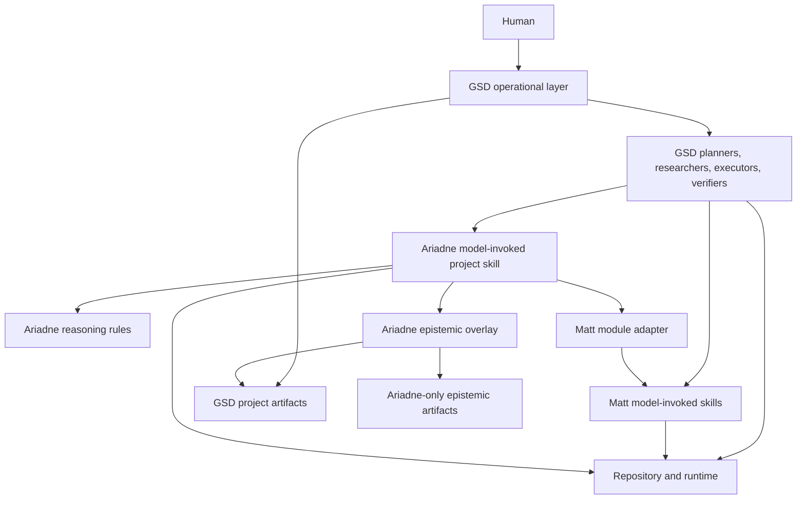
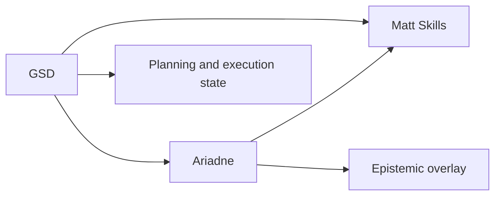
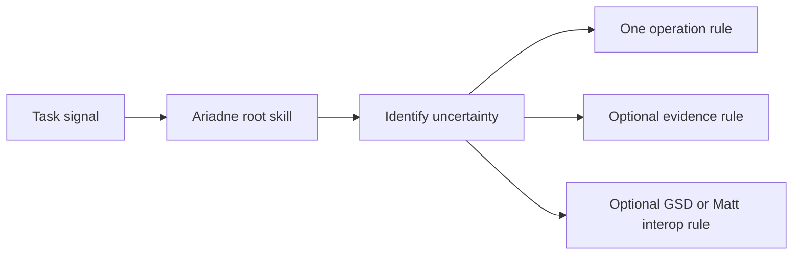
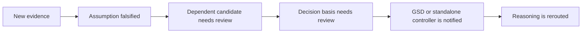
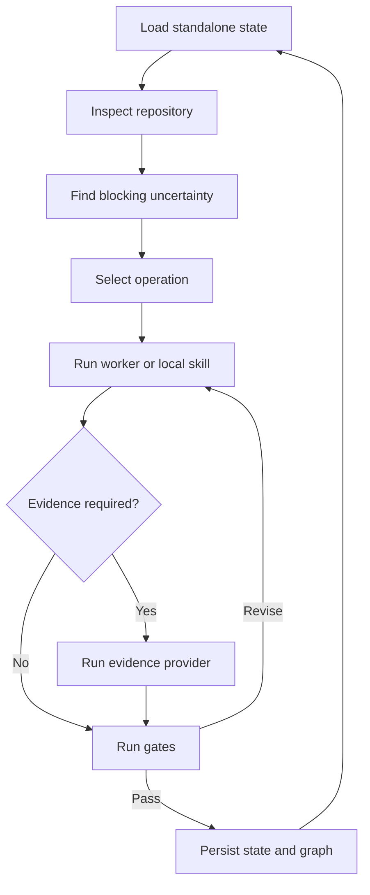
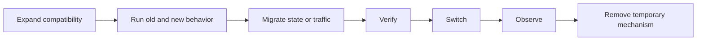
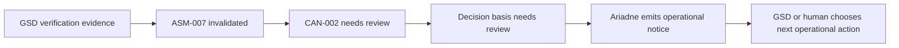

# Ariadne Software Reasoning Layer Specification

**Version:** 4.0  
**Date:** 2026-08-20  
**Status:** Normative input specification  
**Target consumer:** Matt Pocock Skills and an agent that builds the Ariadne harness  
**Source method:** *Nine Operations of Systematic Inventive Thinking for Software Development*  
**Primary operational layer:** GSD (`gsd-build/get-shit-done`) when available  
**Primary module layer:** Matt Pocock Skills when available  
**Writing standard:** ASD-STE100 Simplified Technical English, Issue 9  
**Requirement words:** RFC 2119  

---

# 1. Purpose

Ariadne is a software reasoning layer.

Ariadne MUST NOT become a second project-management or delivery framework when GSD is available.

Ariadne MUST NOT become a copy of Matt Pocock Skills when those skills are available.

Ariadne MUST add the reasoning semantics that are not first-class in either layer.

The core Ariadne semantics are:

- engineering uncertainty;
- causal hypothesis;
- contradiction;
- assumption;
- candidate mechanism;
- evidence request;
- evidence result;
- claim-to-evidence relation;
- falsification;
- transitive invalidation;
- reasoning operation selection;
- transition risk.

Ariadne MUST support the nine reasoning operations from the source method.

Ariadne MUST be usable without GSD.

Ariadne MUST be usable without Matt Pocock Skills.

Ariadne SHOULD use GSD and Matt Pocock Skills when they are present.

Ariadne MUST degrade by capability, not by failure.

---

# 2. System Role

## 2.1. Preferred Layer Model

When all three systems are present, the intended architecture is:



GSD SHOULD remain the primary operational layer.

Matt Pocock Skills SHOULD remain the primary reusable engineering module layer.

Ariadne SHOULD remain the reasoning and epistemic layer.

## 2.2. Ownership Rule

Each semantic object MUST have one primary owner.

Ariadne MUST reuse an existing GSD or Matt semantic object when that object has the required meaning.

Ariadne MUST create a new object only when the existing layers do not provide the required meaning.

Ariadne MUST NOT create a parallel `PROJECT.md`, `REQUIREMENTS.md`, `ROADMAP.md`, or `STATE.md` when GSD owns those files.

Ariadne MUST NOT copy a Matt skill into Ariadne rules when the Matt skill can be used directly.

## 2.3. Control Rule

In GSD mode, GSD MUST control:

- project lifecycle;
- milestone lifecycle;
- phase lifecycle;
- plan creation;
- execution waves;
- execution dispatch;
- GSD operational state;
- GSD verification flow;
- GSD workstreams and workspaces.

In GSD mode, Ariadne MUST control only its epistemic overlay and reasoning contracts.

In standalone mode, Ariadne MUST provide a thin fallback controller for its own reasoning state.

The fallback controller MUST NOT attempt to reproduce all GSD project-management functions.

---

# 3. Normative Language and Writing Rules

## 3.1. RFC 2119

The key words **MUST**, **MUST NOT**, **SHOULD**, **SHOULD NOT**, and **MAY** are to be interpreted as described in RFC 2119.

Normative text SHOULD use these words only with RFC 2119 meanings.

## 3.2. ASD-STE100

Human-readable Ariadne documentation MUST use ASD-STE100 Simplified Technical English as the writing target.

Writers MUST use one stable term for one concept.

Writers SHOULD use short sentences.

Writers SHOULD use active voice when it makes the actor clear.

Writers MUST NOT use unnecessary synonyms for defined Ariadne concepts.

Technical identifiers MAY keep their exact external names.

Examples include:

- `STATE.md`;
- `worktree`;
- `p99`;
- `JSON Schema`;
- `gsd-sdk`;
- `domain-modeling`;
- `tdd`.

## 3.3. Diagrams

Architecture and process diagrams MUST use Mermaid.js.

ASCII architecture diagrams MUST NOT be used.

File paths MAY use normal Markdown lists.

---

# 4. Design Principles

## 4.1. GSD Owns Operations

Ariadne MUST prefer GSD operational primitives to new Ariadne operational primitives.

Examples include:

- GSD phase state;
- GSD workstreams;
- GSD workspaces and worktrees;
- GSD research phases;
- GSD plans;
- GSD execution waves;
- GSD verification;
- GSD UAT;
- GSD state recovery.

## 4.2. Matt Skills Own Local Engineering Disciplines

Ariadne SHOULD use Matt model-invoked skills when their defining constraint matches the local task.

Ariadne MUST NOT restate a complete Matt skill only to make it appear as an Ariadne operation.

## 4.3. Ariadne Owns Epistemic State

Ariadne MUST own the concepts that express why an engineering decision is or is not justified.

These concepts include:

- `Claim`;
- `Assumption`;
- `Hypothesis`;
- `Contradiction`;
- `Unknown`;
- `Candidate`;
- `EvidenceRequest`;
- `EvidenceResult`;
- `supports`;
- `contradicts`;
- `depends_on`;
- `falsifies`;
- `invalidates`.

## 4.4. Repository Before Narrative

Ariadne MUST prefer repository and runtime facts to model memory.

Ariadne SHOULD use GSD codebase mapping when it exists.

Ariadne SHOULD use a Matt skill or native tool when it gives a better local engineering signal.

## 4.5. Evidence Before Confidence

Ariadne MUST NOT use model confidence as a replacement for evidence.

Ariadne MUST distinguish:

- known fact;
- measurement;
- derived claim;
- assumption;
- proposal;
- human decision.

## 4.6. Progressive Disclosure

Ariadne MUST follow the Matt Pocock Skills progressive-disclosure model.

The root Ariadne skill MUST be small.

The root skill MUST point to more detailed rules.

An agent SHOULD load only the rules that match the current engineering situation.

## 4.7. Fresh Context Compatibility

Ariadne MUST support GSD fresh-context agents.

Ariadne MUST NOT require an agent to read a long previous conversation.

Ariadne MUST persist the state required for the next agent.

---

# 5. Deployment Modes

Ariadne MUST support four capability modes.

## 5.1. Mode A: GSD + Matt + Ariadne

This is the preferred mode.

GSD MUST own operational orchestration.

Matt Skills SHOULD provide reusable local disciplines.

Ariadne MUST provide implicit reasoning semantics and epistemic state.



## 5.2. Mode B: GSD + Ariadne

GSD MUST own operational orchestration.

Ariadne MUST provide reasoning semantics.

If a Matt module is not available, Ariadne MAY use:

- a native agent action;
- a GSD-native agent;
- an Ariadne fallback rule.

Ariadne SHOULD NOT reproduce a missing Matt skill as a large permanent prompt.

## 5.3. Mode C: Matt + Ariadne

Ariadne MUST provide a thin file-based reasoning controller.

Matt model-invoked skills SHOULD provide local engineering disciplines.

Matt user-invoked skills MAY provide user-controlled delivery steps.

Ariadne MUST NOT auto-invoke a Matt user-invoked skill that is intentionally human-only.

Ariadne MAY recommend the exact next user-invoked skill and create a handoff for it.

## 5.4. Mode D: Ariadne Standalone

Ariadne MUST support the full nine-operation reasoning loop.

Ariadne MUST support:

- repository inspection;
- persistent reasoning state;
- human decisions;
- executable evidence;
- candidate records;
- falsification;
- invalidation;
- safe resumption after context reset.

Ariadne standalone SHOULD support isolated Git worktrees when Git is available.

Ariadne standalone MAY use one agent sequentially if the host cannot spawn subagents.

Ariadne standalone MAY use host-native subagents when they exist.

Advanced roadmap and execution-wave management is OPTIONAL in standalone mode.

---

# 6. Capability Detection

Ariadne MUST detect available layers before it selects an integration mode.

Ariadne SHOULD detect GSD from a combination of:

- `.planning/PROJECT.md`;
- `.planning/STATE.md`;
- GSD configuration;
- `gsd-sdk` availability;
- GSD command or skill installation.

Ariadne SHOULD detect Matt Skills from:

- `.agents/skills/`;
- `.claude/skills/`;
- global Agent Skills locations supported by the host;
- known Matt skill names.

Ariadne MUST record the selected capability mode.

Example:

```yaml
integration:
  mode: gsd+matt
  gsd:
    available: true
    state_root: .planning
    sdk: true
  matt:
    available: true
    model_invoked:
      - diagnosing-bugs
      - research
      - prototype
      - tdd
      - domain-modeling
      - codebase-design
      - code-review
```

Ariadne MUST NOT fail only because an optional layer is absent.

---

# 7. Ariadne Skill Packaging

## 7.1. One Model-Invoked Root Skill

Ariadne SHOULD install one primary model-invoked project skill.

Recommended path:

- `.agents/skills/ariadne/SKILL.md`

The same skill MAY also be installed in a host-specific compatible skill path.

Ariadne SHOULD NOT install nine separate always-visible skills for the nine operations.

The nine operations have overlapping triggers.

Nine visible skill descriptions would add unnecessary permanent context load.

The root skill SHOULD use rule files for the operation details.

## 7.2. Model-Facing Description

The root skill description MUST support implicit invocation.

It SHOULD include distinct trigger branches.

Recommended semantic form:

```yaml
---
name: ariadne
description: >-
  Reason about unclear software goals, unproven causes, architecture trade-offs,
  competing mechanisms, missing evidence, coupling, load or failure behavior,
  and risky migrations. Use before planning or implementation when the next
  engineering decision is not justified, and during review when new evidence
  can invalidate an assumption.
---
```

The exact text MAY be shorter.

The description MUST name real trigger branches.

The description MUST NOT contain a long summary of the method.

## 7.3. Rule Files

Recommended rule files:

- `rules/00-core.md`
- `rules/10-frame.md`
- `rules/20-diagnose.md`
- `rules/30-transform.md`
- `rules/40-explore.md`
- `rules/50-knowledge.md`
- `rules/60-dependencies.md`
- `rules/70-dynamics.md`
- `rules/80-value.md`
- `rules/90-validate.md`
- `rules/evidence.md`
- `rules/invalidation.md`
- `rules/gsd-interop.md`
- `rules/matt-modules.md`
- `rules/standalone.md`

The root skill SHOULD list these files with short trigger descriptions.

The agent SHOULD load only the files that match its work.

## 7.4. Why `rules/` Is Required

Current GSD agents discover project skills in `.agents/skills/` or `.claude/skills/`.

They read the lightweight `SKILL.md` index.

They load specific `rules/*.md` files as needed.

Ariadne SHOULD use this convention so that GSD agents can consume Ariadne without a custom GSD patch.

## 7.5. Optional Explicit Entry

The model-invoked Ariadne skill MAY also be invoked explicitly by a human.

A separate user-only router is NOT REQUIRED.

Ariadne MAY provide an explicit status command if the host supports commands.

This command MUST be an escape hatch, not the primary activation path.

---


## 7.6. Two-Stage Semantic Routing

Ariadne SHOULD use two-stage routing.

Stage 1 is the small root skill description and index.

Stage 2 is one or more rule files selected from the current uncertainty.

This design reduces permanent context cost.

It also matches the GSD use of small routing surfaces and the Matt rule that model-facing descriptions must contain trigger branches instead of full procedure text.



# 8. Implicit Activation

## 8.1. Activation Goal

A user SHOULD NOT need to say "use Ariadne" for normal engineering work.

The agent SHOULD recognize Ariadne-relevant states from task semantics.

## 8.2. Trigger Table

| Signal | Ariadne operation |
|---|---|
| The request contains a solution before the behavior is clear | `frame` |
| A defect, failure, or regression has no proven mechanism | `diagnose` |
| The cause is known but the change mechanism is weak | `transform` |
| Many proposals use the same mechanism | `explore` |
| A decision depends on an unknown fact | `knowledge` |
| One change touches many independent areas | `dependencies` |
| The result changes under load, retries, time, or failure | `dynamics` |
| More than one valid candidate remains | `value` |
| A candidate has insufficient running evidence | `validate` |
| A migration is riskier than the target steady state | `validate` |

## 8.3. GSD Implicit Activation

In GSD mode, Ariadne MUST use project-skill discovery as the primary zero-patch integration path.

GSD planners, researchers, executors, checkers, verifiers, and reviewers that discover project skills SHOULD read the Ariadne `SKILL.md`.

Ariadne rules MUST be written so these agents can apply them within their existing GSD role.

Ariadne MUST NOT require a GSD agent to change its role name.

Ariadne MUST NOT require GSD to replace its agent types.

## 8.4. Host Fallback Pointer

Some hosts or GSD agents can fail to discover project skills.

Ariadne SHOULD support a short project instruction pointer in `AGENTS.md` or `CLAUDE.md` when needed.

The pointer SHOULD be short.

Example meaning:

> Read `.agents/skills/ariadne/SKILL.md` when a task has unresolved engineering uncertainty, competing mechanisms, missing evidence, or risky transition behavior.

Ariadne MUST NOT copy all Ariadne rules into `AGENTS.md` or `CLAUDE.md`.

---

# 9. GSD Semantic Adapter

## 9.1. Primary Rule

When GSD is active, GSD artifacts are the canonical operational model.

Ariadne MUST project its semantics onto GSD artifacts before it creates new Ariadne artifacts.

## 9.2. GSD Artifact Mapping

| Ariadne meaning | GSD semantic source |
|---|---|
| Project purpose and scope | `.planning/PROJECT.md` |
| Requirement | `.planning/REQUIREMENTS.md` |
| Operational project position | `.planning/STATE.md` |
| Phase scope | `.planning/ROADMAP.md` phase |
| Human locked decision | phase `CONTEXT.md` -> `Decisions` |
| Delegated agent choice | phase `CONTEXT.md` -> `Claude's Discretion` |
| Explicitly deferred work | phase `CONTEXT.md` -> `Deferred Ideas` |
| External or technical knowledge | phase `RESEARCH.md` or project research |
| Executable work plan | `PLAN.md` |
| Execution result | `SUMMARY.md` |
| Goal verification | `VERIFICATION.md` |
| Human acceptance evidence | `UAT.md` |
| Brownfield repository facts | `.planning/codebase/` |
| Disposable feasibility work | `.planning/spikes/` where suitable |
| Isolated implementation | GSD workspace/worktree where suitable |

Ariadne MUST reuse GSD IDs when an equivalent GSD entity has a stable ID.

Examples include:

- `REQ-*` requirement IDs;
- phase numbers;
- plan IDs;
- GSD decision IDs such as `D-01` when present.

Ariadne SHOULD namespace external IDs when ambiguity is possible.

Example:

```text
gsd:REQ-07
gsd:phase-03:D-02
```

## 9.3. GSD Decision Semantics

Ariadne MUST interpret GSD phase `CONTEXT.md` as follows:

- `Decisions` -> `DECIDED` provenance and locked constraint;
- `Claude's Discretion` -> delegated authority range;
- `Deferred Ideas` -> out-of-scope state.

Ariadne MUST NOT convert a locked GSD decision into an assumption.

Ariadne MUST NOT reopen a locked decision only because another candidate looks better.

Ariadne MAY reopen the reasoning around a locked decision only when:

- new evidence shows the decision cannot satisfy a hard requirement;
- the decision depends on a falsified fact or assumption;
- the human explicitly asks to reconsider it.

In these cases, Ariadne MUST report the conflict to the GSD operational layer or human.

Ariadne MUST NOT silently override the decision.

## 9.4. GSD State Ownership

Ariadne MUST NOT write GSD `STATE.md` as its own canonical store.

Ariadne SHOULD use the GSD SDK or supported GSD workflow for GSD-owned state changes.

Ariadne MAY read GSD Markdown artifacts directly for semantic projection.

Ariadne MUST keep Ariadne-only epistemic state outside GSD-owned schema fields.

## 9.5. Ariadne Overlay in GSD Mode

Recommended path:

- `.planning/ariadne/STATE.yaml`
- `.planning/ariadne/GRAPH.jsonl`
- `.planning/ariadne/INDEX.md`
- `.planning/ariadne/candidates/`
- `.planning/ariadne/evidence/`
- `.planning/ariadne/runs/`

The overlay MUST store only semantics that GSD does not already own.

The overlay SHOULD store references to GSD artifacts instead of copies.

Example:

```yaml
claim:
  id: CLM-014
  statement: "The shared schema causes deployment coupling."
  derived_from:
    - gsd:.planning/codebase/ARCHITECTURE.md#schema-coupling
    - gsd:phase-03:RESEARCH.md#deployment
  supports:
    - CAN-004
```

## 9.6. GSD Drift

Ariadne MUST detect when a referenced GSD artifact or repository revision changes.

Ariadne MUST mark dependent epistemic nodes as stale when the change can affect their meaning.

Ariadne SHOULD use GSD state validation and sync functions where they apply.

---


## 9.7. GSD SDK Preference

For new GSD integration code, Ariadne SHOULD use `gsd-sdk query` or the supported GSD SDK when a suitable handler exists.

Ariadne SHOULD NOT build new integration code on the legacy `gsd-tools.cjs` surface when the SDK provides the same function.

Ariadne MAY use read-only file access for semantic projection.

Ariadne MUST use supported GSD state operations for GSD-owned state changes.

# 10. Ariadne Behavior Inside GSD Workflows

Ariadne MUST augment GSD roles.

Ariadne MUST NOT replace them.

## 10.1. New Project and Project Research

Ariadne SHOULD apply:

- `frame` to remove hidden solutions;
- `knowledge` to identify decision-significant unknowns;
- `value` to separate hard requirements from preferences.

Ariadne SHOULD store hypotheses and assumptions in its overlay.

GSD MUST remain the owner of `PROJECT.md`, `REQUIREMENTS.md`, and `ROADMAP.md`.

## 10.2. `discuss-phase`

Ariadne SHOULD use `frame` and `value` rules.

Ariadne MUST preserve the semantic difference between:

- locked decision;
- agent discretion;
- deferred idea.

Ariadne SHOULD create a human question only when the question is a real decision.

## 10.3. `plan-phase`

Ariadne SHOULD augment planning with:

- unresolved-assumption checks;
- candidate mechanism diversity;
- dependency analysis;
- evidence planning;
- transition risk when applicable.

A plan checker SHOULD treat an unresolved high-impact assumption as a plan risk.

A plan checker SHOULD reject a plan when the plan assumes a selected mechanism that has not passed the required decision gate.

## 10.4. `execute-phase`

Ariadne SHOULD augment execution with:

- evidence binding;
- assumption checks;
- transition checks;
- candidate-specific constraints.

An executor MUST NOT reopen a locked architecture decision without evidence.

An executor MUST record new evidence that falsifies a reasoning assumption.

## 10.5. `verify-work`

Ariadne SHOULD augment verification with:

- claim-to-evidence matching;
- invalidated assumption detection;
- contradiction checks;
- transition completion checks;
- temporary mechanism removal checks.

A phase MAY achieve its GSD task list and still fail an Ariadne evidence gate.

## 10.6. Debug Work

For a defect or performance regression, Ariadne SHOULD delegate the local diagnostic loop to a suitable debugger or Matt `diagnosing-bugs` skill when available.

Ariadne MUST retain the larger causal graph when the defect has architecture implications.

## 10.7. Spikes

A GSD spike MAY satisfy an Ariadne `knowledge` or `validate` evidence request.

Ariadne MUST record:

- the design question;
- the candidate or claim;
- the verdict;
- the GSD spike reference.

## 10.8. Review

Ariadne SHOULD add an epistemic review dimension when it is useful.

This dimension asks:

- Does the change still satisfy the original hard requirements?
- Did implementation add a new assumption?
- Did evidence invalidate a prior decision basis?
- Did complexity move to operations or migration?
- Did the candidate change its mechanism during implementation?

This dimension MUST remain separate from normal code-quality findings.

---


## 10.9. GSD Agent Role Mapping

Ariadne SHOULD use the existing GSD agent role as the first routing signal.

| GSD agent role | Ariadne rules that are usually relevant |
|---|---|
| `gsd-phase-researcher` | `knowledge`, `frame`, evidence provenance |
| `gsd-pattern-mapper` | repository facts, `dependencies` |
| `gsd-planner` | `frame`, `explore`, `dependencies`, `value`, transition risk |
| `gsd-plan-checker` | semantic gate, epistemic gate, unresolved assumption check |
| `gsd-executor` | `transform`, `validate`, evidence binding, assumption monitoring |
| `gsd-verifier` | `validate`, claim-to-evidence match, invalidation |
| `gsd-debugger` | `diagnose`, `dynamics` when applicable |
| `gsd-code-reviewer` | contradiction critic, evidence drift, decision-basis review |
| `gsd-integration-checker` | `dependencies`, transition and cross-phase evidence |
| `gsd-codebase-mapper` | repository fact collection only; no unsupported causal claims |

The agent role MUST NOT force an Ariadne operation when the task state does not match it.

The role table is a context hint.

The blocking uncertainty remains the final reasoning selector.

# 11. Matt Skills Semantic Adapter

## 11.1. Primary Rule

Ariadne SHOULD use Matt model-invoked skills as local reasoning modules.

Ariadne MUST preserve the defining constraint of each Matt skill.

Ariadne MUST NOT call a Matt skill only because the names look similar.

## 11.2. Model-Invoked Matt Modules

Recommended mappings:

| Ariadne need | Matt skill | Use condition |
|---|---|---|
| Hard bug or performance regression | `diagnosing-bugs` | A runnable red-capable feedback loop can be built |
| External technical question | `research` | Primary-source research can change the decision |
| One design question | `prototype` | Throwaway executable work can answer it |
| Concrete behavior implementation | `tdd` | The behavior and seam are stable enough |
| Domain vocabulary or model conflict | `domain-modeling` | The problem is semantic or domain-boundary related |
| Interface, seam, depth, locality | `codebase-design` | Module design is the uncertainty |
| Diff verification | `code-review` | A fixed point and diff exist |

Ariadne SHOULD let these skills keep their own internal method.

Ariadne SHOULD normalize their output into Ariadne evidence or graph relations only when needed.

## 11.3. `diagnosing-bugs`

Ariadne `diagnose` is broader than Matt `diagnosing-bugs`.

Ariadne SHOULD use `diagnosing-bugs` for an observed defect or regression.

Ariadne SHOULD NOT force `diagnosing-bugs` for a pure architecture contradiction with no failing behavior.

The red-capable feedback loop produced by `diagnosing-bugs` MAY become an Ariadne `EvidenceRequest` implementation.

## 11.4. `prototype`

Ariadne SHOULD use `prototype` only for one design question.

The prototype MUST remain disposable by default.

Ariadne MUST NOT treat prototype code as a production candidate only because it works.

## 11.5. `tdd`

Ariadne SHOULD use `tdd` when a concrete behavior is already selected.

Ariadne MUST NOT use TDD as a substitute for unresolved architecture selection.

TDD results MAY provide functional evidence.

TDD evidence MUST NOT prove performance or resilience claims by itself.

## 11.6. `domain-modeling`

Ariadne SHOULD use `domain-modeling` as the shared problem-domain vocabulary source.

Ariadne MUST NOT create a second domain glossary.

If Ariadne finds a contradiction between domain language and code, it SHOULD surface the conflict through `domain-modeling` semantics.

## 11.7. `codebase-design`

Ariadne SHOULD use `codebase-design` as the shared module-design vocabulary source.

Ariadne MUST reuse its concepts for:

- seam;
- interface;
- module depth;
- locality;
- adapter;
- leverage.

Ariadne SHOULD NOT introduce alternate synonyms for these concepts without a reason.

## 11.8. `code-review`

Ariadne SHOULD preserve Matt `code-review` independent axes.

Ariadne MAY add a third Ariadne evidence axis.

If it adds this axis, it MUST NOT merge the three verdicts into one score.

Recommended axes:

1. Standards;
2. Spec;
3. Epistemic Evidence.

## 11.9. User-Invoked Matt Skills

Matt user-invoked skills MUST remain human-controlled.

Examples include:

- `grill-with-docs`;
- `to-spec`;
- `to-tickets`;
- `implement`.

In GSD mode, Ariadne SHOULD use GSD-native operational flow instead of trying to nest these skills.

In Matt-only or standalone mode, Ariadne MAY recommend one of these skills.

Ariadne MUST NOT pretend to auto-invoke a user-only skill.

Ariadne SHOULD create a concise handoff when it recommends the next user-only skill.

---

# 12. Semantic Reuse Rules

## 12.1. Reuse Before Create

Before Ariadne creates an entity, it MUST check whether the same semantic object already exists in:

1. repository facts;
2. GSD artifacts;
3. Matt vocabulary artifacts;
4. Ariadne overlay.

Ariadne MUST reference the existing object when possible.

## 12.2. ID Reuse

Ariadne MUST reuse stable external IDs when possible.

Ariadne SHOULD create new IDs only for Ariadne-specific entities.

Recommended Ariadne-only ID prefixes:

```text
CLM-    claim
ASM-    assumption
HYP-    hypothesis
CTR-    contradiction
UNK-    unknown
CAN-    candidate
EVDREQ- evidence request
EVD-    evidence result
EXP-    experiment
```

Ariadne SHOULD NOT create a second `REQ-*` ID when GSD already has a requirement ID.

## 12.3. No Shadow Documents

In GSD mode, Ariadne MUST NOT create:

- a second project vision file;
- a second requirements file;
- a second roadmap;
- a second operational state file with the same meaning as GSD `STATE.md`;
- a second phase-context file.

Ariadne MAY create an epistemic state file because GSD does not provide the same semantic object.

---

# 13. Ariadne Epistemic Model

## 13.1. Node Types

Ariadne MUST support these node types:

```text
Claim
Assumption
Hypothesis
Contradiction
Unknown
Candidate
EvidenceRequest
EvidenceResult
DecisionRef
ArtifactRef
RepositoryFactRef
```

Ariadne MAY support additional node types.

## 13.2. Edge Types

Ariadne MUST support:

```text
supports
contradicts
depends_on
derived_from
answers
tests
falsifies
invalidates
satisfies
violates
supersedes
references
```

## 13.3. Provenance

Each important Ariadne statement MUST use one primary provenance type:

```text
FACT
MEASURED
DERIVED
ASSUMED
PROPOSED
UNKNOWN
DECIDED
```

A GSD locked decision maps to `DECIDED`.

A repository fact maps to `FACT`.

A runtime benchmark maps to `MEASURED`.

A research conclusion can map to `DERIVED` unless the conclusion itself is directly stated by a primary source.

## 13.4. Invalidation

If evidence falsifies an assumption, Ariadne MUST traverse dependent nodes.

Ariadne MUST mark affected claims, candidates, and decision references as `needs-review` when appropriate.

Ariadne MUST NOT delete historical records.



## 13.5. Operational Notification

In GSD mode, Ariadne MUST NOT directly rewrite a completed GSD phase because an assumption changed.

Ariadne MUST create a clear operational signal.

The signal SHOULD identify:

- the invalidated entity;
- affected GSD requirement, phase, plan, or decision references;
- the recommended reasoning operation;
- the required human decision if any.

GSD or the human then controls the operational response.

---

# 14. Nine Ariadne Operations

The nine operations are reasoning semantics.

They are NOT nine GSD workflow stages.

They are NOT nine separate always-visible skills.

## 14.1. `frame`

Use `frame` when required behavior is not separated from the proposed mechanism.

The operation MUST produce or refine:

- required behavior;
- current behavior;
- hard invariants;
- system boundary;
- hidden solution;
- success evidence.

In GSD mode, Ariadne SHOULD project stable results into GSD project, requirement, or phase context semantics through the GSD-owned flow.

## 14.2. `diagnose`

Use `diagnose` when an observed problem has no proven mechanism.

The operation MUST distinguish:

- observation;
- causal hypothesis;
- alternative hypothesis;
- supporting evidence;
- contradicting evidence;
- falsifying check.

For a runnable bug or performance regression, Ariadne SHOULD use Matt `diagnosing-bugs` when available.

## 14.3. `transform`

Use `transform` when the cause is known but the mechanism of change is not satisfactory.

The operation SHOULD check:

1. remove or reduce;
2. separate or localize;
3. combine or transfer a function;
4. replace a mechanism;
5. change quantity, order, time, or location.

The operation MUST produce candidates that state their mechanism.

## 14.4. `explore`

Use `explore` when the candidate set is narrow.

The operation MUST identify architecture dimensions.

The operation MUST distinguish mechanism classes from product choices.

GSD spikes or worktrees MAY represent selected candidate regions.

## 14.5. `knowledge`

Use `knowledge` when a decision depends on an unknown fact.

The operation MUST link each important unknown to an affected decision.

The operation SHOULD use the lowest-cost discriminating method.

Matt `research` or `prototype` SHOULD be used when their local constraints match.

GSD phase research or spikes MAY satisfy the same Ariadne evidence request.

## 14.6. `dependencies`

Use `dependencies` when a change has a large or unclear change radius.

The operation MUST consider more than imports.

It SHOULD consider:

- data ownership;
- schema coupling;
- event coupling;
- configuration coupling;
- deployment coupling;
- migration coupling;
- test coupling.

Ariadne SHOULD use Matt `codebase-design` vocabulary when available.

## 14.7. `dynamics`

Use `dynamics` when behavior depends on time, load, retries, queues, failure, or mixed versions.

The operation SHOULD request runtime evidence when the risk justifies it.

Average latency MUST NOT be sufficient evidence for a tail-latency requirement.

## 14.8. `value`

Use `value` when more than one valid candidate remains.

The operation MUST separate:

- hard requirements;
- preference criteria;
- unknown evaluations.

A hard requirement MUST NOT be compensated by a score.

A human MUST decide a remaining value conflict unless authority explicitly delegates it.

## 14.9. `validate`

Use `validate` when a candidate needs executable evidence or a risky transition.

The operation MUST match claim type to evidence type.

The operation MUST treat transition design as a separate engineering object when the transition has material risk.

---

# 15. Evidence Model

## 15.1. Evidence Request

Ariadne MUST be able to create an evidence request without owning the tool that executes it.

Example:

```yaml
id: EVDREQ-014
claim: CLM-021
candidate: CAN-004
risk: high
preferred_capability: performance-load
pass_condition: "p99 <= 200 ms at 1500 req/s"
fail_condition: "p99 > 200 ms at 1500 req/s"
providers:
  - gsd-native
  - matt-prototype
  - native-shell
```

## 15.2. Evidence Provider

An evidence provider MAY be:

- a GSD verifier;
- a GSD spike;
- a Matt model-invoked skill;
- a test runner;
- a benchmark tool;
- a native agent action;
- a standalone Ariadne worker.

The evidence request semantics MUST remain provider-neutral.

## 15.3. Claim-to-Evidence Match

Ariadne MUST reject an evidence type that cannot support the claim class.

Examples:

| Claim | Suitable evidence |
|---|---|
| A payment MUST NOT execute twice | concurrency property or integration evidence |
| p99 MUST be below a threshold | benchmark or load evidence |
| API compatibility MUST remain | contract or compatibility evidence |
| Recovery MUST complete within a limit | recovery exercise |
| Migration MUST NOT lose data | rehearsal and reconciliation |
| Critical tests MUST detect a known defect | mutation or deliberate-defect evidence |

A unit test MUST NOT be the only evidence for a throughput claim.

## 15.4. Revision Binding

Executable evidence MUST identify the relevant repository revision when code changes can affect the result.

Evidence SHOULD identify the environment when environment changes can affect the result.

Ariadne MUST mark evidence stale when the relevant basis changes.

---

# 16. Candidate Model

## 16.1. Candidate Definition

A candidate is one software mechanism that can be compared and falsified.

A candidate MUST state:

- mechanism;
- changed responsibility;
- new state;
- removed state or mechanism;
- key dependencies;
- required assumptions;
- hard requirements;
- falsifying question.

## 16.2. GSD Candidate Execution

In GSD mode, Ariadne SHOULD use GSD workspaces, worktrees, or spikes for isolated candidate work when they fit.

Ariadne MUST NOT build a second worktree manager only for GSD mode.

## 16.3. Common Acceptance Core

Competing candidate implementations MUST use the same core acceptance properties.

A candidate MUST NOT receive easier acceptance criteria because its implementation is different.

## 16.4. Candidate Diversity

Ariadne SHOULD treat candidates as the same class when they differ only by:

- vendor;
- library;
- configuration;
- small parameter changes.

Candidates SHOULD differ by mechanism, ownership, state, time, or boundary to count as separate architecture classes.

---

# 17. Human Decision Semantics

## 17.1. GSD Human Decisions

When GSD is present, Ariadne MUST reuse GSD human-decision semantics.

Locked GSD decisions are authoritative.

`Claude's Discretion` defines agent authority.

Deferred ideas are out of scope.

## 17.2. Matt Human Interaction Principles

Ariadne MUST ask a human only for a decision the agent cannot get from tools or evidence.

Ariadne SHOULD ask one decision at a time when interaction bandwidth is low.

Ariadne SHOULD keep context and question separate.

Ariadne MUST NOT ask a human to describe code structure that the agent can inspect.

## 17.3. Low-Bandwidth Transport

Standalone Ariadne MUST support:

```text
INFO
QUESTION
```

Each field MUST have an independent size limit.

If the content is too long, Ariadne MUST compress the meaning.

It MUST NOT truncate only by character count.

Allowed responses:

```text
YES
NO
ABSTRACT
CONCRETE
UNCLEAR
UNKNOWN
DEPENDS
INVALID
SKIP
```

## 17.4. Human Blocking

A human question MAY block only the work that depends on it.

Independent work SHOULD continue.

---

# 18. Standalone Ariadne Runtime

## 18.1. Goal

Standalone Ariadne MUST preserve the same reasoning semantics as integrated mode.

It MUST use a smaller operational surface than GSD.

## 18.2. Standalone State

Recommended paths:

- `.ariadne/PROJECT.md`
- `.ariadne/REQUIREMENTS.md`
- `.ariadne/CONTEXT.md`
- `.ariadne/STATE.yaml`
- `.ariadne/GRAPH.jsonl`
- `.ariadne/artifacts/`
- `.ariadne/candidates/`
- `.ariadne/evidence/`
- `.ariadne/runs/`
- `.ariadne/HANDOFF.md`

The meanings of `PROJECT.md`, `REQUIREMENTS.md`, and `CONTEXT.md` SHOULD remain compatible with the GSD meanings where practical.

This compatibility SHOULD make later migration to GSD easier.

Standalone Ariadne MUST NOT implement a full GSD-style roadmap unless the project needs it.

## 18.3. Standalone Controller

The fallback controller MUST:

1. load state;
2. inspect the repository;
3. find the most important unresolved engineering uncertainty;
4. select an Ariadne operation;
5. load only the required rule files;
6. run the operation;
7. create evidence requests when needed;
8. apply gates;
9. update the epistemic graph;
10. request human decisions when required;
11. persist a handoff.



## 18.4. Standalone Delivery

Standalone Ariadne MAY implement a selected candidate with native agent tools.

If Matt user-invoked delivery skills are available, Ariadne MAY hand off to them.

If no delivery layer exists, Ariadne MUST still be able to produce:

- a selected candidate;
- executable evidence;
- a transition plan;
- a decision record;
- an implementation handoff.

---

# 19. State Ownership Matrix

| Semantic object | GSD mode owner | Matt-only mode owner | Standalone owner |
|---|---|---|---|
| Project purpose | GSD `PROJECT.md` | Ariadne | Ariadne |
| Requirements | GSD `REQUIREMENTS.md` | Ariadne | Ariadne |
| Operational position | GSD `STATE.md` | Ariadne | Ariadne |
| Phase scope | GSD `ROADMAP.md` | external or Ariadne | optional Ariadne |
| Human locked decisions | GSD `CONTEXT.md` | Ariadne human state | Ariadne `CONTEXT.md` |
| Domain vocabulary | Matt `domain-modeling` or project source | Matt/project source | project source or Ariadne pointer |
| Module vocabulary | Matt `codebase-design` or project source | Matt/project source | project source or Ariadne pointer |
| Claims and assumptions | Ariadne | Ariadne | Ariadne |
| Candidate mechanism model | Ariadne | Ariadne | Ariadne |
| Evidence relations | Ariadne | Ariadne | Ariadne |
| Execution plan | GSD | Matt/user flow or native | native or optional Ariadne |
| Verification flow | GSD with Ariadne gate | Matt/native with Ariadne gate | Ariadne/native |
| Worktree orchestration | GSD | native Git | native Git |

Ariadne MUST follow this matrix unless project configuration explicitly changes ownership.

---

# 20. Provider and Capability Model

Ariadne MUST select capabilities, not hard-coded skill names, in its core domain model.

Example capability names:

```text
repository-map
bug-diagnosis
primary-source-research
disposable-prototype
module-design
domain-modeling
test-driven-implementation
diff-review
performance-load
failure-injection
migration-rehearsal
human-decision
```

A provider adapter maps a capability to an available tool.

Example:

```yaml
capability: bug-diagnosis
providers:
  - type: matt-skill
    name: diagnosing-bugs
    priority: 10
  - type: gsd-agent
    name: gsd-debugger
    priority: 20
  - type: native-agent
    priority: 30
```

The exact priority MAY depend on mode and project configuration.

Ariadne MUST record which provider produced evidence or an artifact.

---

# 21. Quality Gates

## 21.1. Structural Gate

The Structural Gate SHOULD be deterministic.

It SHOULD check:

- schema;
- IDs;
- references;
- required fields;
- external artifact references;
- revision bindings;
- invalidated dependencies;
- temporary transition removal conditions.

## 21.2. Semantic Gate

The Semantic Gate MUST check the current Ariadne operation contract.

Examples:

- `diagnose` MUST have a falsifiable main hypothesis;
- `explore` MUST distinguish mechanism classes;
- `value` MUST not compensate a hard requirement by score;
- `validate` MUST use suitable evidence.

## 21.3. Epistemic Gate

The Epistemic Gate MUST check provenance and evidence relations.

It MUST reject an assumption presented as fact.

It MUST reject a selected candidate that depends on an invalidated assumption unless the dependency is explicitly resolved.

## 21.4. GSD Gate Integration

Ariadne gates SHOULD augment GSD plan checking and verification.

Ariadne MUST NOT replace GSD goal-backward plan checking.

Ariadne MUST NOT replace GSD post-execution verification.

Ariadne SHOULD add missing epistemic checks to those existing gates.

---

# 22. Transition Semantics

Ariadne MUST treat risky transition work as an engineering object.

A target architecture and transition architecture are different objects.

A transition MAY include:



Each temporary mechanism MUST identify:

- purpose;
- owner;
- removal condition;
- latest review point.

In GSD mode, transition steps SHOULD be expressed in normal GSD plans.

Ariadne SHOULD store only the transition reasoning, risks, and evidence relations that GSD plans do not express.

---

# 23. Context Packaging

## 23.1. GSD Agents

Ariadne MUST respect GSD fresh-context design.

A GSD agent SHOULD receive:

- normal GSD workflow context;
- Ariadne root `SKILL.md` through project skill discovery;
- only relevant Ariadne `rules/*.md`;
- relevant Ariadne graph neighborhood;
- relevant evidence references.

It SHOULD NOT receive the complete Ariadne graph.

## 23.2. Matt Skill Modules

When Ariadne reaches a Matt model-invoked skill, it SHOULD pass only the local question and required context.

Ariadne SHOULD preserve the Matt skill defining constraint.

Examples:

- `prototype` receives one design question;
- `diagnosing-bugs` receives one observed defect and a runnable path;
- `tdd` receives one concrete behavior and seam;
- `code-review` receives a fixed point and spec reference.

## 23.3. Standalone Agents

A standalone worker SHOULD receive:

- operation contract;
- current task summary;
- relevant repository facts;
- relevant graph nodes;
- required output schema;
- evidence policy;
- completion criteria.

---

# 24. GSD and Ariadne Failure Boundaries

Ariadne MUST NOT patch GSD core files or GSD agent prompts as the normal integration method.

Ariadne SHOULD integrate through:

1. project Agent Skills;
2. GSD-readable project instructions;
3. GSD SDK or supported commands;
4. GSD artifact references.

Ariadne MAY use an optional GSD-specific adapter package.

The adapter MUST remain removable.

The Ariadne core MUST remain usable without it.

If a GSD agent does not discover project skills, Ariadne SHOULD fall back to a short project instruction pointer.

Ariadne SHOULD test this behavior in integration tests.

---

# 25. Matt Interaction Principles Adopted by Ariadne

Ariadne MUST adopt these Matt-style interaction principles.

## 25.1. Model Invocation for Autonomous Reach

The main Ariadne skill MUST be model-invoked because the agent must reach it without a user command.

## 25.2. Permanent Context Has a Cost

The Ariadne skill description MUST be concise.

The description MUST carry trigger branches, not method detail.

## 25.3. Progressive Disclosure

Common rules stay in `SKILL.md`.

Branch-specific rules stay behind pointers.

Large examples and schemas SHOULD stay in references or code.

## 25.4. Single Source of Truth

Ariadne MUST define each semantic rule once.

Worker prompts, critic prompts, and router prompts SHOULD be generated from or reference the same rule source.

## 25.5. Deterministic Checks in Code

Ariadne SHOULD implement deterministic validation as code.

It SHOULD NOT spend LLM reasoning on schema or referential-integrity checks that code can perform.

## 25.6. Completion Criteria

Each Ariadne operation MUST define an observable completion criterion.

## 25.7. Tool Before Human

Ariadne SHOULD get facts from tools before it asks the human.

## 25.8. Stable Vocabulary

Ariadne SHOULD use Matt `domain-modeling` and `codebase-design` vocabularies when available.

It MUST NOT create unnecessary alternate terms.

---

# 26. Recommended Ariadne Project Skill

The root `SKILL.md` SHOULD stay small.

A conforming implementation SHOULD be similar to this structure:

```markdown
---
name: ariadne
description: >-
  Reason about unclear software goals, unproven causes, architecture trade-offs,
  competing mechanisms, missing evidence, coupling, load or failure behavior,
  and risky transitions. Use before planning or implementation when the next
  engineering decision is not justified, and during review when evidence can
  invalidate a prior assumption.
---

# Ariadne

Use Ariadne when the engineering uncertainty is not already resolved by the
current GSD plan, project decision, or executable evidence.

1. Read current project decisions and requirements.
2. Do not reopen locked decisions without invalidating evidence.
3. Identify the blocking uncertainty.
4. Load only the matching rule file.
5. Reuse GSD artifacts and Matt skills before you create parallel structures.
6. Record Ariadne-only claims, assumptions, candidates, and evidence relations.
7. Return to the host workflow when the uncertainty is resolved.

## Rule routing

- hidden solution or unclear behavior -> `rules/10-frame.md`
- unproven cause -> `rules/20-diagnose.md`
- weak change mechanism -> `rules/30-transform.md`
- narrow candidate set -> `rules/40-explore.md`
- missing fact -> `rules/50-knowledge.md`
- large change radius -> `rules/60-dependencies.md`
- load, retry, failure, or version timing -> `rules/70-dynamics.md`
- valid candidates need selection -> `rules/80-value.md`
- claim needs running evidence or transition -> `rules/90-validate.md`
```

The final skill MAY be shorter.

---

# 27. Acceptance Scenarios

## 27.1. Scenario A: GSD Planner Implicitly Uses Ariadne

Given:

- GSD is active;
- Ariadne is installed in `.agents/skills/ariadne/`;
- a phase plan assumes a new queue because the request says "add a queue";
- required behavior does not require a queue.

Expected behavior:

1. GSD planner discovers Ariadne as a project skill.
2. Ariadne `frame` rule applies without a user command.
3. The plan separates required behavior from the queue mechanism.
4. The queue becomes one candidate.
5. GSD remains the plan owner.

## 27.2. Scenario B: GSD Locked Decision Is Preserved

Given:

- phase `CONTEXT.md` has `D-03` as a locked decision;
- Ariadne finds a technically better candidate.

Expected behavior:

1. Ariadne maps `D-03` to `DECIDED`.
2. Ariadne does not override it.
3. Ariadne MAY record the alternative as deferred or rejected.
4. Ariadne reopens the decision only if evidence shows that `D-03` cannot satisfy a hard requirement, or if the human asks to reconsider it.

## 27.3. Scenario C: Matt `diagnosing-bugs` Is Used as a Module

Given:

- GSD or standalone work observes a reproducible regression;
- Matt `diagnosing-bugs` is available.

Expected behavior:

1. Ariadne routes to `diagnose`.
2. Ariadne selects `diagnosing-bugs` as the local diagnosis provider.
3. The Matt skill builds its red-capable feedback loop.
4. Ariadne stores the resulting check as evidence.
5. Ariadne does not copy the full Matt diagnosis procedure into its own rule.

## 27.4. Scenario D: Matt User-Invoked Skill Is Not Nested

Given:

- GSD is not active;
- `to-spec` is installed;
- Ariadne reaches a stable engineering decision.

Expected behavior:

1. Ariadne creates a concise spec handoff.
2. Ariadne tells the human that `/to-spec` is the next user-controlled step.
3. Ariadne does not claim that it invoked `/to-spec` automatically.

## 27.5. Scenario E: GSD Verification Finds Falsifying Evidence

Given:

- GSD executes and verifies a phase;
- verification evidence falsifies `ASM-007`;
- `CAN-002` and one prior decision depend on `ASM-007`.

Expected behavior:



Ariadne does not rewrite GSD history.

## 27.6. Scenario F: GSD Absent

Given:

- no GSD project exists;
- Ariadne is installed;
- Matt Skills may or may not exist.

Expected behavior:

1. Ariadne selects standalone mode.
2. Ariadne initializes `.ariadne/` state.
3. Ariadne runs the nine-operation reasoning loop as needed.
4. Ariadne uses available Matt model-invoked modules when present.
5. Ariadne can resume after a context reset.

## 27.7. Scenario G: Matt Absent

Given:

- GSD and Ariadne exist;
- Matt Skills do not exist.

Expected behavior:

1. GSD remains operational owner.
2. Ariadne remains implicitly available as a project skill.
3. Ariadne uses GSD-native or native agent capabilities for research, diagnosis, evidence, and review.
4. Ariadne does not fail because Matt Skills are absent.

## 27.8. Scenario H: No Duplicate State

Given:

- GSD owns `.planning/STATE.md`.

Expected behavior:

1. Ariadne reads GSD operational state.
2. Ariadne writes only `.planning/ariadne/STATE.yaml` for epistemic state.
3. The Ariadne state references GSD objects.
4. Ariadne does not create a second project roadmap.

## 27.9. Scenario I: Implicit Architecture Reasoning

Given:

- a GSD plan change has high change radius;
- no user mentions Ariadne.

Expected behavior:

1. GSD agent discovers Ariadne skill.
2. Ariadne `dependencies` rule applies.
3. The agent checks data, schema, deployment, and migration coupling.
4. Matt `codebase-design` MAY activate if available.
5. The resulting plan stays in GSD format.

## 27.10. Scenario J: Standalone Migration to GSD

Given:

- Ariadne standalone already has project context, requirements, decisions, claims, and evidence;
- GSD is later initialized.

Expected behavior:

1. Ariadne maps compatible project semantics to GSD `PROJECT.md`, `REQUIREMENTS.md`, and phase context through an explicit migration step.
2. Ariadne does not duplicate mapped data in new shadow documents.
3. Ariadne keeps epistemic nodes in `.planning/ariadne/`.
4. Ariadne preserves old IDs through references or mapping records.

---

# 28. Conformance Levels

## 28.1. Core Ariadne

A Core Ariadne implementation MUST provide:

- model-invoked project skill;
- progressive rule loading;
- nine operations;
- provenance;
- candidate model;
- evidence requests;
- evidence results;
- invalidation;
- human decisions;
- context-reset recovery;
- standalone mode.

## 28.2. GSD-Integrated Ariadne

A GSD-integrated implementation MUST additionally provide:

- GSD mode detection;
- GSD semantic projection;
- no-shadow-state enforcement;
- `.planning/ariadne/` overlay;
- GSD artifact references;
- GSD decision semantics;
- GSD workflow augmentation tests;
- GSD SDK use for GSD-owned state changes when supported.

## 28.3. Matt-Integrated Ariadne

A Matt-integrated implementation MUST additionally provide:

- Matt skill discovery;
- model-invoked module mapping;
- user-invoked boundary enforcement;
- Matt vocabulary reuse;
- output normalization without method duplication.

## 28.4. Full Ariadne

A Full Ariadne implementation MUST satisfy all three levels.

---

# 29. Implementation Order

The build skill MUST implement integration before feature breadth.

Recommended order:

1. create the Ariadne root skill and rule-routing model;
2. create standalone epistemic state;
3. implement GSD detection and semantic mapping;
4. implement GSD no-shadow-state rules;
5. implement Matt skill discovery and module mapping;
6. implement `frame`, `diagnose`, and `validate` vertical slice;
7. implement evidence and invalidation;
8. test implicit activation inside a GSD planner and verifier;
9. implement the remaining six operations;
10. implement standalone resumption and mode migration;
11. add candidate worktree support through GSD or Git;
12. add metrics and health checks.

The build skill MUST NOT start by writing nine long prompts.

---

# 30. Required Machine Interfaces

The implementation SHOULD define stable interfaces for:

```text
IntegrationMode
CapabilityProvider
GsdSemanticAdapter
MattSkillAdapter
StandaloneController
OperationContract
OperationResult
EpistemicPatch
GraphNode
GraphEdge
Candidate
EvidenceRequest
EvidenceResult
GateResult
HumanDecisionRequest
OperationalNotice
```

A provider interface MUST NOT expose GSD-specific or Matt-specific details to the Ariadne operation model.

---

# 31. Operational Notice

Ariadne MUST use an `OperationalNotice` to report reasoning changes to GSD or another operational owner.

Example:

```yaml
id: NOTICE-014
severity: blocker
reason: falsified-assumption
source: ASM-007
affected:
  - gsd:REQ-12
  - gsd:phase-03:D-02
  - CAN-004
recommended_operation: diagnose
human_decision_required: false
summary: "New load evidence falsifies the throughput assumption used by CAN-004."
```

An Operational Notice MUST NOT directly mutate external operational state.

---

# 32. Health and Observability

Ariadne SHOULD record:

- implicit activations;
- explicit activations;
- operation selected;
- rule files loaded;
- GSD artifacts referenced;
- Matt skills used;
- fallback providers used;
- assumptions falsified;
- candidates invalidated;
- evidence requests completed;
- human questions avoided by repository inspection;
- GSD decisions reopened due to evidence;
- standalone-to-GSD migrations.

Ariadne MAY use this data to improve trigger descriptions and rule routing.

Ariadne MUST NOT use telemetry to change a human decision without authority.

---

# 33. Non-Goals

Ariadne MUST NOT:

- replace GSD planning when GSD is active;
- replace GSD execution waves;
- replace GSD phase verification;
- copy the full Matt Skills workflow;
- create nine permanently loaded operation skills;
- require the user to invoke Ariadne for normal use;
- ask the human for repository facts that tools can obtain;
- treat all uncertainty as a need for more research;
- reopen locked decisions without a defined reason;
- use a single blended quality score for independent review axes;
- treat prose quality as engineering evidence;
- keep a second copy of GSD project state.

---

# 34. Final Build Checklist

The build skill MUST complete this checklist before it reports conformance.

```text
[ ] Ariadne is model-invoked and can activate without a user command.
[ ] Ariadne uses one small root skill with progressive rule loading.
[ ] GSD is the primary operational owner when GSD is present.
[ ] Ariadne does not create shadow GSD project state.
[ ] GSD PROJECT, REQUIREMENTS, STATE, ROADMAP, CONTEXT, RESEARCH, PLAN, SUMMARY, VERIFICATION, and UAT semantics are mapped where applicable.
[ ] GSD locked decisions map to DECIDED provenance.
[ ] GSD Claude's Discretion maps to delegated authority.
[ ] GSD Deferred Ideas map to out-of-scope work.
[ ] Ariadne can be discovered through .agents/skills or compatible project-skill discovery.
[ ] GSD agents can load only the Ariadne rules relevant to their role.
[ ] Ariadne uses Matt model-invoked skills as modules when available.
[ ] Ariadne does not auto-invoke Matt user-only skills.
[ ] Matt domain-modeling and codebase-design vocabularies are reused when available.
[ ] Ariadne remains functional when Matt Skills are absent.
[ ] Ariadne remains functional when GSD is absent.
[ ] Standalone Ariadne survives a context reset.
[ ] Claims, assumptions, candidates, and evidence relations persist outside chat.
[ ] Falsified assumptions invalidate dependent epistemic nodes.
[ ] Ariadne emits an OperationalNotice instead of directly rewriting GSD operational history.
[ ] Candidate worktrees use GSD workspaces when GSD owns the operation.
[ ] Competing candidates use one common acceptance core.
[ ] Evidence is matched to claim type.
[ ] Evidence is bound to revision and environment when required.
[ ] A unit test cannot prove a throughput claim by itself.
[ ] A locked human decision cannot be silently replaced by an agent.
[ ] Process and architecture diagrams use Mermaid.js.
[ ] Human-readable documentation uses the ASD-STE100 writing target.
[ ] Normative requirements use RFC 2119 meanings.
```

If one REQUIRED item is false, the implementation MUST NOT report full conformance.

---

# Appendix A. GSD Semantic Mapping Summary

| GSD object | Ariadne interpretation |
|---|---|
| `PROJECT.md` | project purpose, scope, constraints |
| `REQUIREMENTS.md` | requirements and hard requirement references |
| `ROADMAP.md` | operational phase structure, not Ariadne reasoning sequence |
| `STATE.md` | operational position, decisions, blockers, metrics |
| phase `CONTEXT.md` / Decisions | locked human decisions |
| phase `CONTEXT.md` / Claude's Discretion | delegated agent authority |
| phase `CONTEXT.md` / Deferred Ideas | explicit out-of-scope items |
| phase `RESEARCH.md` | technical knowledge source and evidence reference |
| `PLAN.md` | executable operational plan |
| `SUMMARY.md` | execution result and new observations |
| `VERIFICATION.md` | post-execution goal evidence |
| `UAT.md` | human acceptance evidence |
| `.planning/codebase/` | repository fact source |
| `.planning/spikes/` | disposable evidence work when applicable |

---

# Appendix B. Matt Module Mapping Summary

| Matt skill | Ariadne use |
|---|---|
| `diagnosing-bugs` | local falsifiable diagnosis loop |
| `research` | primary-source knowledge provider |
| `prototype` | disposable answer to one design question |
| `tdd` | test-first implementation after behavior is selected |
| `domain-modeling` | problem-domain vocabulary source |
| `codebase-design` | module and seam vocabulary source |
| `code-review` | independent diff review provider |
| `grill-with-docs` | optional human-controlled alignment flow |
| `to-spec` | optional human-controlled spec handoff when GSD is absent |
| `to-tickets` | optional human-controlled work decomposition when GSD is absent |
| `implement` | optional human-controlled delivery flow when GSD is absent |

---

# Appendix C. References

The build skill SHOULD verify current upstream behavior before it implements adapters.

- GSD architecture: `https://github.com/gsd-build/get-shit-done/blob/main/docs/ARCHITECTURE.md`
- GSD user guide: `https://github.com/gsd-build/get-shit-done/blob/main/docs/USER-GUIDE.md`
- GSD inventory: `https://github.com/gsd-build/get-shit-done/blob/main/docs/INVENTORY.md`
- GSD planner: `https://github.com/gsd-build/get-shit-done/blob/main/agents/gsd-planner.md`
- GSD plan checker: `https://github.com/gsd-build/get-shit-done/blob/main/agents/gsd-plan-checker.md`
- GSD execute workflow: `https://github.com/gsd-build/get-shit-done/blob/main/get-shit-done/workflows/execute-phase.md`
- Matt Skills repository: `https://github.com/mattpocock/skills`
- Matt skill mechanics: `https://github.com/mattpocock/skills/blob/main/skills/productivity/writing-for-agents/SKILL-MECHANICS.md`
- Matt writing-for-agents: `https://github.com/mattpocock/skills/blob/main/docs/productivity/writing-for-agents.md`
- Matt ask-matt: `https://github.com/mattpocock/skills/blob/main/docs/engineering/ask-matt.md`
- Matt diagnosing-bugs: `https://github.com/mattpocock/skills/blob/main/docs/engineering/diagnosing-bugs.md`
- Matt TDD: `https://github.com/mattpocock/skills/blob/main/docs/engineering/tdd.md`
- Matt domain-modeling: `https://github.com/mattpocock/skills/blob/main/docs/engineering/domain-modeling.md`
- Matt codebase-design: `https://github.com/mattpocock/skills/blob/main/docs/engineering/codebase-design.md`
- Matt code-review: `https://github.com/mattpocock/skills/blob/main/docs/engineering/code-review.md`
- ASD-STE100: `https://www.asd-ste100.org/`
- RFC 2119: `https://www.rfc-editor.org/rfc/rfc2119`
