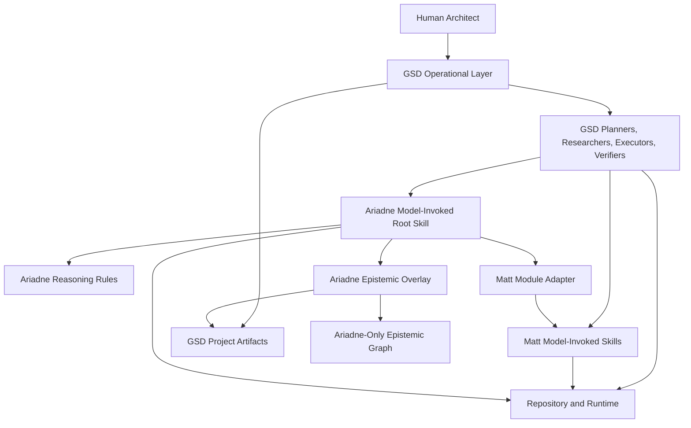
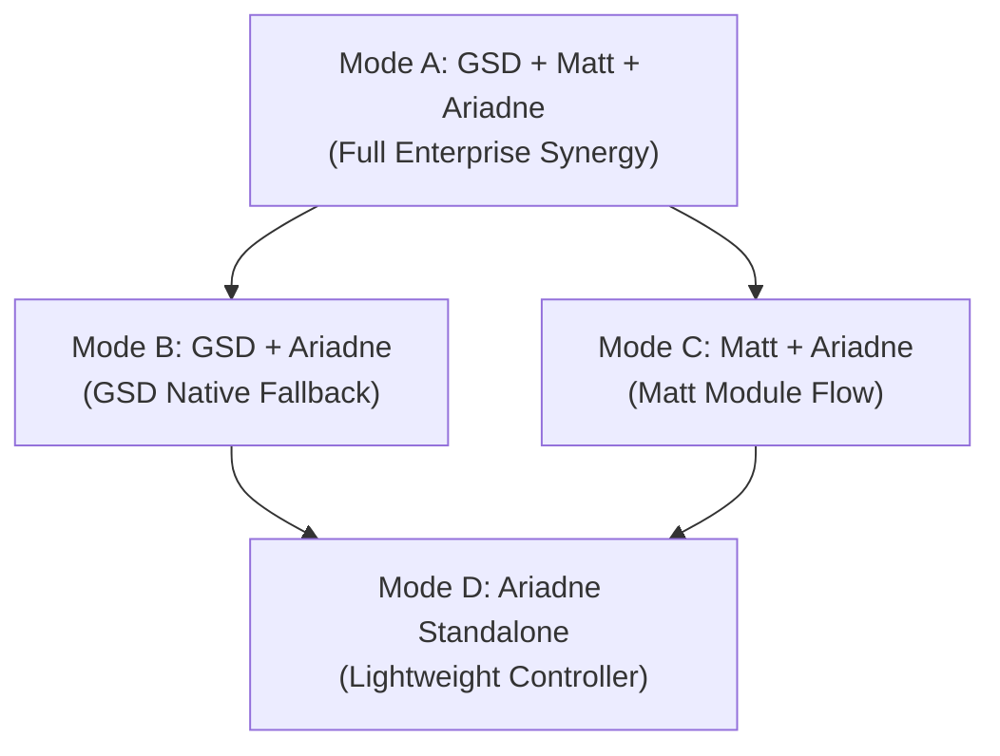
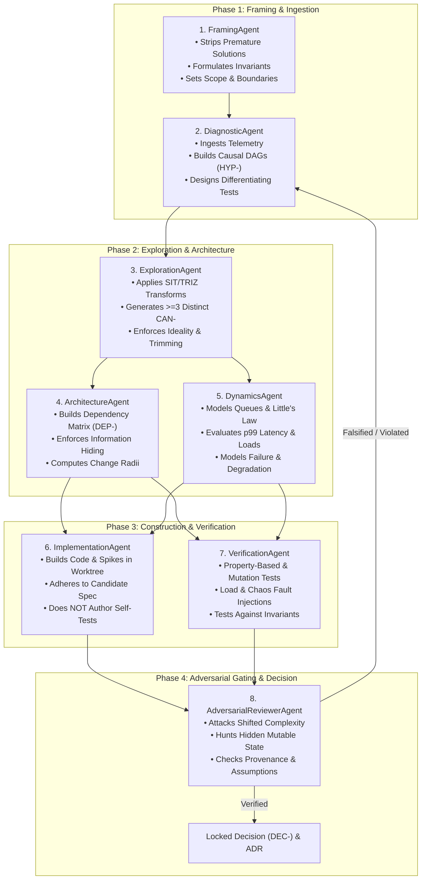
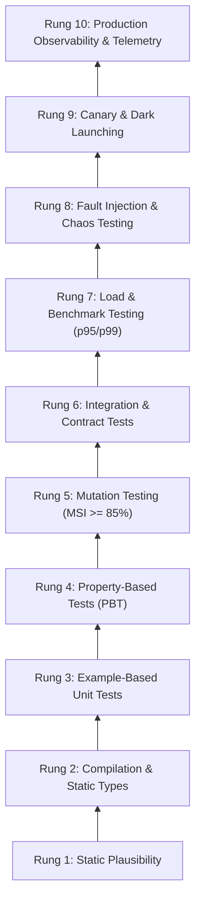
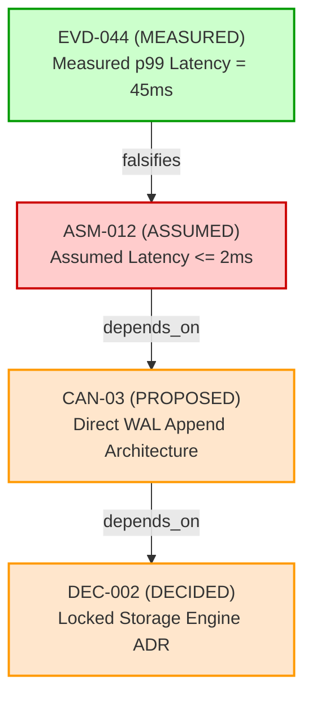
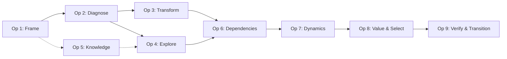
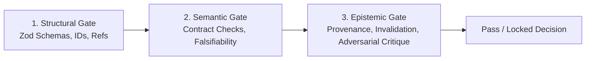

# Ariadne Software Reasoning Layer Specification

**Version:** 5.0  
**Date:** 2026-08-20  
**Status:** Normative Specification  
**Target consumer:** Autonomous AI Agents, GSD Orchestrators, Matt Pocock Skills, and Human Architects  
**Source method:** *Nine Operations of Systematic Inventive Thinking in Software Engineering* (Treatise Comprehensive Edition, August 2026)  
**Primary operational layer:** GSD (`gsd-build/get-shit-done`) when available  
**Primary module layer:** Matt Pocock Skills when available  
**Writing standard:** ASD-STE100 Simplified Technical English, Issue 9  
**Requirement words:** RFC 2119  

---

# 1. Purpose

Ariadne is a software reasoning layer and epistemic harness.

Ariadne MUST NOT duplicate project management or task delivery when GSD is available.

Ariadne MUST NOT duplicate Matt Pocock Skills when those skills are available.

Ariadne MUST add reasoning semantics that are not first-class in either layer.

The core Ariadne semantics are:

- problem state tuple ($\mathcal{S}_t = \langle \mathcal{B}_t, \mathcal{I}_t, \mathcal{C}_t, \mathcal{M}_t, \mathcal{E}_t \rangle$);
- engineering uncertainty;
- causal hypothesis;
- contradiction and separation principles;
- working assumption;
- candidate mechanism;
- decision-significant unknown;
- evidence request and evidence result;
- 10-rung evidentiary ladder;
- claim provenance algebra;
- empirical falsification;
- transitive invalidation;
- 3 epistemic depth modes (Fast, Standard, Deep);
- 8 epistemic agent role contracts;
- 12 developer agent invariant rules;
- typed epistemic message envelopes;
- transition system risk and decommissioning;
- adversarial critique.

Ariadne MUST support the nine reasoning operations from the source method.

Ariadne MUST be usable without GSD.

Ariadne MUST be usable without Matt Pocock Skills.

Ariadne SHOULD use GSD and Matt Pocock Skills when they are present.

Ariadne MUST degrade by capability, not by failure.

---

# 2. System Role and Layer Architecture

## 2.1. Preferred Layer Model

When all three systems are present, the intended architecture is:



GSD SHOULD remain the primary operational layer.

Matt Pocock Skills SHOULD remain the primary reusable engineering module layer.

Ariadne SHOULD remain the reasoning and epistemic layer.

## 2.2. Ownership Rule

Each semantic object MUST have one primary owner.

Ariadne MUST reuse an existing GSD or Matt semantic object when that object has the required meaning.

Ariadne MUST create a new object only when existing layers do not provide the required meaning.

Ariadne MUST NOT create a parallel `PROJECT.md`, `REQUIREMENTS.md`, `ROADMAP.md`, or `STATE.md` when GSD owns those files.

Ariadne MUST NOT copy a Matt skill into Ariadne rules when the Matt skill can be used directly.

## 2.3. Control Rule

In GSD mode, GSD MUST control:

- project lifecycle;
- milestone lifecycle;
- phase lifecycle;
- plan creation;
- execution waves;
- execution dispatch;
- GSD operational state;
- GSD verification flow;
- GSD workstreams and workspaces.

In GSD mode, Ariadne MUST control only its epistemic overlay and reasoning contracts.

In standalone mode, Ariadne MUST provide a lightweight controller for its own reasoning state.

The fallback controller MUST NOT attempt to reproduce all GSD project-management functions.

---

# 3. Normative Standards and Writing Rules

## 3.1. RFC 2119

The key words **MUST**, **MUST NOT**, **SHOULD**, **SHOULD NOT**, and **MAY** are to be interpreted as described in RFC 2119.

Normative text SHOULD use these words only with RFC 2119 meanings.

## 3.2. ASD-STE100

Human-readable Ariadne documentation MUST use ASD-STE100 Simplified Technical English as the writing target.

Writers MUST use one stable term for one concept.

Writers SHOULD use short sentences.

Writers SHOULD use active voice when it makes the actor clear.

Writers MUST NOT use unnecessary synonyms for defined Ariadne concepts.

Technical identifiers MAY keep their exact external names (for example, `STATE.yaml`, `GRAPH.jsonl`, `p99`, `Zod`, `gsd-sdk`, `tdd`).

## 3.3. Diagrams

Architecture and process diagrams MUST use Mermaid.js.

ASCII architecture diagrams MUST NOT be used.

---

# 4. Design Principles

## 4.1. GSD Owns Operations

Ariadne MUST prefer GSD operational primitives to new Ariadne operational primitives.

Examples include GSD phase state, workstreams, workspaces, worktrees, research phases, plans, execution waves, verification, UAT, and state recovery.

## 4.2. Matt Skills Own Local Engineering Disciplines

Ariadne SHOULD use Matt model-invoked skills when their defining constraint matches the local task.

Ariadne MUST NOT restate a complete Matt skill only to make it appear as an Ariadne operation.

## 4.3. Ariadne Owns Epistemic State

Ariadne MUST own the concepts that express why an engineering decision is or is not justified.

These concepts include `ProblemState`, `Claim`, `Assumption`, `Hypothesis`, `Contradiction`, `Unknown`, `Candidate`, `EvidenceRequest`, `EvidenceResult`, `VerificationCard`, `TransitionPlan`, and all typed graph relations.

## 4.4. Repository Before Narrative

Ariadne MUST prefer repository and runtime facts to model memory.

Ariadne SHOULD use GSD codebase mapping when it exists.

Ariadne SHOULD use a Matt skill or native tool when it gives a better local engineering signal.

## 4.5. Evidence Before Confidence

Ariadne MUST NOT use model confidence as a replacement for empirical evidence.

Ariadne MUST distinguish known fact, quantitative measurement, derived claim, working assumption, proposed mechanism, unknown fact, and human decision.

## 4.6. Progressive Disclosure

Ariadne MUST follow the progressive-disclosure model.

The root Ariadne skill MUST be small and token-efficient.

The root skill MUST point to more detailed rule files.

An agent SHOULD load only the rules that match the active engineering uncertainty.

## 4.7. Fresh Context Compatibility

Ariadne MUST support fresh-context agents.

Ariadne MUST NOT require an agent to read a long previous conversation.

Ariadne MUST persist the state required for the next agent turn in deterministic files.

---

# 5. Deployment Modes

Ariadne MUST support four capability deployment modes.



## 5.1. Mode A: GSD + Matt + Ariadne

This is the preferred full-capability mode.

GSD MUST own operational orchestration and lifecycle state.

Matt Skills SHOULD provide reusable local disciplines (`diagnosing-bugs`, `research`, `prototype`, `tdd`, `domain-modeling`, `codebase-design`, `code-review`).

Ariadne MUST provide implicit reasoning semantics, epistemic graph validation, and invalidation routing.

## 5.2. Mode B: GSD + Ariadne

GSD MUST own operational orchestration.

Ariadne MUST provide reasoning semantics.

If a Matt module is not available, Ariadne MAY use a native agent action, a GSD-native agent role, or an Ariadne fallback rule.

Ariadne SHOULD NOT reproduce a missing Matt skill as a large permanent prompt.

## 5.3. Mode C: Matt + Ariadne

Ariadne MUST provide a thin file-based reasoning controller.

Matt model-invoked skills SHOULD provide local engineering disciplines.

Matt user-invoked skills (`to-spec`, `to-tickets`, `implement`, `grill-with-docs`) MAY provide user-controlled delivery steps.

Ariadne MUST NOT auto-invoke a Matt user-invoked skill that is intentionally human-only.

Ariadne MAY recommend the exact next user-invoked skill and create a structured handoff for it.

## 5.4. Mode D: Ariadne Standalone

Ariadne MUST support the full nine-operation reasoning loop.

Ariadne MUST support:

- repository inspection;
- persistent epistemic state (`STATE.yaml`, `GRAPH.jsonl`, `INDEX.md`);
- human decisions;
- executable evidence;
- candidate records;
- empirical falsification;
- transitive invalidation;
- safe resumption after context reset.

Ariadne standalone SHOULD support isolated Git worktrees when Git is available.

Ariadne standalone MAY use one agent sequentially if the host cannot spawn subagents.

Ariadne standalone MAY use host-native subagents when they exist.

---

# 6. Epistemic Depth Modes

Ariadne MUST support three distinct depth modes to balance cognitive rigor against token cost and execution friction.

| Governance Dimension | Fast Mode | Standard Mode | Deep Mode |
|---|---|---|---|
| **Primary Domain** | Bug fixes, local optimizations, non-breaking single-file edits. | Feature additions, architectural refactoring, internal schema changes. | Distributed consensus, financial transactions, irreversible migrations, public APIs. |
| **Reversibility** | Fully reversible ($< 1$ commit, $< 5$ min). | Reversible via feature flag or migration rollback ($< 1$ hour). | Irreversible or high-cost rollback ($> 24$ hours, data migration). |
| **Blast Radius** | Single function, class, or module ($\le 2$ files). | Subsystem or multi-module bounded service. | Enterprise-wide, multi-service, or external client-facing. |
| **Mandatory Artifacts** | `LEAN-TASK-` Card (incorporating invariants, hypothesis, 2 mechanisms, test, decision). | `TASK-`, `FRAME-`, `DIAG-`, `SPACE-`, `DEP-`, `DYN-`, `VAL-`, `TRANS-`, `DEC-`. | Full Epistemic Graph, Formal Invariants, Chaos Receipts, ADR with Review Triggers. |
| **Agent Roles Deployed** | Single Implementation Agent + Invariant Check. | Framing, Diagnostic, Exploration, Architecture, Dynamics, Verification. | Full 8-Agent Epistemic Role Architecture (including Adversarial Reviewer). |
| **Evidentiary Rungs** | Rungs 1–3 (Static, Types, Unit Tests). | Rungs 1–7 (Static through Integration & Load Benchmarks). | Rungs 1–10 (Full ladder including Chaos, Canary & Telemetry). |
| **Token Budget (LLM)** | $\le 4\text{k}$ tokens. | $15\text{k} - 40\text{k}$ tokens. | $\ge 100\text{k}$ tokens (multi-agent distributed runs). |
| **Escalation Triggers** | Discovered hidden state or cross-service dependency. | Discovered distributed race condition or data corruption risk. | Irreversible schema lockup or split-brain anomaly under partition. |

## 6.1. Automatic Escalation Rule

An agent executing in Fast Mode MUST immediately escalate to Standard or Deep Mode if:

1. the change alters shared database schemas, public API contracts, or cross-service boundaries;
2. an unverified unknown is discovered whose resolution requires benchmark infrastructure;
3. the task touches financial ledgers, cryptographic authorization, or data retention invariants;
4. an optimization degrades a secondary quality attribute, exposing an active contradiction.

---

# 7. Epistemic Agent Roles and Responsibility Contracts

Ariadne formalizes 8 specialized epistemic role contracts.



## 7.1. Epistemic Role Mapping to Host Capabilities

Epistemic roles are responsibility contracts, not rigid personae:

1. **In GSD Mode**: Standard GSD agents adopt epistemic roles as operational lenses by loading corresponding `rules/*.md` files (for example, `gsd-planner` applies Framing, Exploration, and Architecture contracts; `gsd-debugger` applies Diagnostic contracts; `gsd-verifier` applies Verification contracts; `gsd-code-reviewer` applies Adversarial Reviewer contracts).
2. **In Multi-Agent Host (Deep Mode)**: The host spawns independent subagent processes in isolated contexts/worktrees exchanging typed JSON Schema Epistemic Envelopes.
3. **In Single-Agent Mode**: The single agent executes the contracts sequentially, enforcing deterministic quality gates between phase transitions.

---

# 8. The 10-Rung Evidentiary Ladder

Ariadne establishes 10 ascending rungs of empirical confidence:



## 8.1. Claim-to-Evidence Matching Rule

Ariadne MUST reject an evidence type that cannot support the target claim class:

| Target Claim Class | Mandatory Minimum Evidentiary Rung | Suitable Evidence Method | Prohibited Insufficient Evidence |
|---|---|---|---|
| Syntactic structure | Rung 2 | Compiler check, type checker, linter | Narrative assertion |
| Algorithmic logic | Rung 3–4 | Unit tests, Property-based tests | Happy-path manual run |
| Test suite quality | Rung 5 | Mutation score ($\text{MSI} \ge 85\%$) | Code line coverage metric |
| Boundary contract | Rung 6 | Ephemeral container / Pact contract test | Mocked in-memory unit test |
| Throughput & Latency | Rung 7 | Synthetic load benchmark ($p99$) | Unit test execution time |
| Distributed safety | Rung 8 | Fault injection / Jepsen partition test | Local sequential test |
| Migration safety | Rung 9 | Shadow traffic comparison, dark launch | Staging smoke test |
| Sustained reliability| Rung 10| Telemetry SLI and error budget | Single synthetic test run |

A unit test MUST NOT be accepted as sufficient evidence for throughput, concurrency, or distributed consensus claims.

---

# 9. Provenance Lattice, Algebra, and Transitive Invalidation

## 9.1. The 7 Canonical Provenance Types

Every proposition, node, and parameter in Ariadne MUST carry an explicit provenance type from the partially ordered lattice $\langle \mathcal{P}, \sqsubseteq \rangle$:

$$\mathbf{U} \sqsubset \mathbf{A} \sqsubset \mathbf{P} \sqsubset \mathbf{D} \sqsubset \mathbf{M} \sqsubset \mathbf{F} \sqsubset \mathbf{L}$$

1. `UNKNOWN` ($\mathbf{U}$): Missing information that must be empirically discovered.
2. `ASSUMED` ($\mathbf{A}$): Unverified working premise accepted provisionally.
3. `PROPOSED` ($\mathbf{P}$): Architectural candidate mechanism under evaluation.
4. `DERIVED` ($\mathbf{D}$): Deduced logically or mathematically from proven antecedents.
5. `MEASURED` ($\mathbf{M}$): Empirically measured quantitative metric under reproducible conditions.
6. `FACT` ($\mathbf{F}$): Directly observed immutable truth in repository AST, code, or active configuration.
7. `DECIDED` ($\mathbf{L}$): Locked architectural decision backed by verified evidence.

## 9.2. Weakest-Precondition Propagation Rule

When a claim $C$ is derived from antecedent premises $A_1, A_2, \dots, A_n$ ($A_1 \land A_2 \land \dots \land A_n \vdash C$):

$$\text{Prov}(C) = \begin{cases} \mathbf{DERIVED}, & \text{if } \forall i, \; \text{Prov}(A_i) \in \{\mathbf{F}, \mathbf{M}, \mathbf{D}\} \\ \mathbf{ASSUMED}, & \text{if } \exists k \text{ such that } \text{Prov}(A_k) = \mathbf{A} \land \forall i, \; \text{Prov}(A_i) \sqsupseteq \mathbf{A} \\ \mathbf{UNKNOWN}, & \text{if } \exists k \text{ such that } \text{Prov}(A_k) = \mathbf{U} \end{cases}$$

An `ASSUMED` node MUST NOT serve as justifying evidence for a locked `DEC-` decision in Standard or Deep mode.

## 9.3. Transitive Invalidation Algorithm

When an empirical evidence node $e$ ($e \xrightarrow{\text{falsifies}} v$) is recorded with $\text{Prov}(e) \in \{\mathbf{M}, \mathbf{F}\}$:

1. Set $\text{State}(v) \leftarrow \text{FALSIFIED}$.
2. Compute downstream reachable set $\text{Reach}(v) = \{ u \in \mathcal{V} \mid u \rightsquigarrow_{\text{depends\_on}} v \}$.
3. For each $u \in \text{Reach}(v)$:
   - If $u$ is a Candidate (`CAN-`), set $\text{State}(u) \leftarrow \text{INVALIDATED}$.
   - If $u$ is a Decision (`DEC-`), set $\text{State}(u) \leftarrow \text{RE-OPENED / INVALIDATED}$ and notify operational owner.
   - If $u$ is a Transition Plan (`TRANS-`), set $\text{State}(u) \leftarrow \text{BLOCKED}$.
4. If an active agent or worktree is executing against an invalidated candidate, emit $\text{SIG\_ABORT}$ and terminate execution on that branch.



---

# 10. Developer Agent Operational Standard (12 Invariant Rules)

Autonomous agents implementing Ariadne MUST adhere to 12 invariant rules:

1. **Rule 1: No Code Before Framing**: Never write code if the prompt contains a premature technology solution. Frame the observable behavioral delta and invariants first.
2. **Rule 2: Inspect Repository Before Causal Claims**: Never speculate about code structure. Cite exact file paths and line ranges (`file:///path#L10-L20`).
3. **Rule 3: Tag Provenance of Every Significant Claim**: Prefix claims with uppercase provenance tags (`[FACT]`, `[MEASURED]`, `[ASSUMED]`).
4. **Rule 4: Separate Hypotheses from Fixes**: Build a failing reproduction test for a causal hypothesis before proposing or applying code fixes.
5. **Rule 5: Diverse Search Breadth**: Ensure $\ge 3$ candidate mechanisms differ by fundamental operating principle, state ownership, or boundary, not vendor.
6. **Rule 6: Exhaust Existing System Resources First**: Leverage DB engines, OS primitives, and runtime type systems before adding new dependencies.
7. **Rule 7: Mandatory Adversarial Critique**: Actively attack proposed decisions for complexity shifts, hidden mutable state, and unverified assumptions.
8. **Rule 8: Match Verification Method to Claim**: Unit tests cannot verify throughput; benchmarks cannot prove distributed safety.
9. **Rule 9: Prefer Falsifying Tests**: Formulate explicit falsification criteria that reject invalid candidates.
10. **Rule 10: Maintain Competing Candidates for High-Cost Decisions**: Use isolated worktrees in Deep Mode.
11. **Rule 11: Explicit Transition Architecture**: Design dual-writing, migrations, and rollback paths for stateful changes.
12. **Rule 12: Conclude with Empirical Proof, Not Narrative**: Base completion on test logs, diff receipts, and locked ADRs.

---

# 11. Typed Epistemic Message Envelopes

Multi-agent communication in Ariadne MUST use structured typed JSON Schema envelopes:

```json
{
  "$schema": "https://json-schema.org/draft/2020-12/schema",
  "title": "AriadneEpistemicEnvelope",
  "type": "object",
  "required": ["envelope_id", "correlation_id", "timestamp", "sender_role", "target_role", "epistemic_mode", "provenance_payload"],
  "properties": {
    "envelope_id": { "type": "string", "format": "uuid" },
    "correlation_id": { "type": "string" },
    "timestamp": { "type": "string", "format": "date-time" },
    "sender_role": {
      "type": "string",
      "enum": [
        "FramingAgent", "DiagnosticAgent", "ExplorationAgent",
        "ArchitectureAgent", "DynamicsAgent", "ImplementationAgent",
        "VerificationAgent", "AdversarialReviewerAgent"
      ]
    },
    "target_role": { "type": "string" },
    "epistemic_mode": { "type": "string", "enum": ["Fast", "Standard", "Deep"] },
    "provenance_payload": {
      "type": "object",
      "required": ["node_id", "provenance_type", "statement", "confidence_level"],
      "properties": {
        "node_id": { "type": "string", "pattern": "^(TASK|FRAME|OBS|HYP|CTR|TRF|SPACE|CAN|UNK|ASM|DEP|DYN|VAL-SELECT|EVDREQ|EVD|VAL|TRANS|DEC|STATE|HANDOFF|LEAN-TASK)-[0-9A-Za-z_-]+$" },
        "provenance_type": { "type": "string", "enum": ["FACT", "MEASURED", "DERIVED", "ASSUMED", "PROPOSED", "UNKNOWN", "DECIDED"] },
        "statement": { "type": "string" },
        "confidence_level": { "type": "number", "minimum": 0.0, "maximum": 1.0 },
        "dependencies": { "type": "array", "items": { "type": "string" } },
        "falsification_conditions": { "type": "array", "items": { "type": "string" } },
        "empirical_evidence": {
          "type": "object",
          "properties": {
            "test_command": { "type": "string" },
            "stdout_digest": { "type": "string" },
            "raw_metric_value": { "type": "number" },
            "reproducible_environment": { "type": "string" }
          }
        }
      }
    }
  }
}
```

---

# 12. GSD Semantic Adapter

## 12.1. Primary Rule

When GSD is active, GSD artifacts are the canonical operational model.

Ariadne MUST project its semantics onto GSD artifacts before creating new Ariadne artifacts.

## 12.2. GSD Artifact Mapping Table

| Ariadne Meaning | GSD Semantic Source |
|---|---|
| Project purpose and scope | `.planning/PROJECT.md` |
| Requirement | `.planning/REQUIREMENTS.md` |
| Operational project position | `.planning/STATE.md` |
| Phase scope | `.planning/ROADMAP.md` phase |
| Human locked decision | phase `CONTEXT.md` -> `Decisions` |
| Delegated agent choice | phase `CONTEXT.md` -> `Claude's Discretion` |
| Explicitly deferred work | phase `CONTEXT.md` -> `Deferred Ideas` |
| Technical knowledge / research | phase `RESEARCH.md` or project research |
| Executable work plan | `PLAN.md` |
| Execution result | `SUMMARY.md` |
| Goal verification | `VERIFICATION.md` |
| Human acceptance evidence | `UAT.md` |
| Brownfield repository facts | `.planning/codebase/` |
| Disposable feasibility work | `.planning/spikes/` |
| Isolated implementation | GSD workspace / worktree |

## 12.3. No-Shadow-State Enforcement

Ariadne MUST NOT create duplicate `PROJECT.md`, `REQUIREMENTS.md`, `ROADMAP.md`, or `STATE.md` files when GSD owns them.

Ariadne MUST store its epistemic overlay in `.planning/ariadne/` (for example, `.planning/ariadne/STATE.yaml` and `.planning/ariadne/GRAPH.jsonl`).

Ariadne MUST reuse external GSD IDs (`REQ-*`, `D-*`, phase numbers) with namespaces (`gsd:REQ-07`).

---

# 13. Matt Pocock Skills Semantic Adapter

Ariadne SHOULD use Matt model-invoked skills as local engineering modules:

| Ariadne Need | Matt Skill | Use Condition |
|---|---|---|
| Observed bug or regression | `diagnosing-bugs` | Runnable red-capable feedback loop can be constructed |
| External technical question | `research` | Primary-source research can alter the architectural decision |
| One design question | `prototype` | Disposable executable probe can answer it |
| Concrete behavior implementation | `tdd` | Behavioral invariants and interfaces are selected |
| Problem domain vocabulary | `domain-modeling` | Semantic or boundary conflict in domain language |
| Module design & seams | `codebase-design` | Module depth, seam, and locality design |
| Diff review | `code-review` | Fixed point and diff exist |

Ariadne MUST preserve Matt user-invoked skill boundaries (`to-spec`, `to-tickets`, `implement`, `grill-with-docs`) and MUST NOT claim automated execution of human-only commands.

---

# 14. The Nine Reasoning Operations



## 14.1. `frame` (Operation 1)
- Trigger: Problem contains a premature solution, or required behavior is ambiguous.
- Input: User request, incident report, or PRD.
- Action: Strip technology nouns, define observable Hoare triples $\{P\}\;C\;\{Q\}$, shift boundary, and evaluate 7 stakeholder perspectives.
- Output: Problem Framing Map (`FRAME-`), System Invariants (`INV-`), Observable Behavioral Delta.

## 14.2. `diagnose` (Operation 2)
- Trigger: System exhibits an undesirable state, bottleneck, or regression without a proven mechanism.
- Input: Observed telemetry, logs, traces (`OBS-`).
- Action: Construct causal DAG, isolate physical bottlenecks (Amdahl's / USL), formulate parameter contradictions ($P_1 \uparrow \implies P_2 \downarrow$).
- Output: Causal Map (`HYP-`), Contradictions (`CTR-`), Differentiating Evidence Requests (`EVDREQ-`).

## 14.3. `transform` (Operation 3)
- Trigger: Root cause is known, but existing structural mechanisms introduce bloat or friction.
- Input: Causal hypotheses, existing component graph.
- Action: Apply 5 software transformations (Trimming/Elimination, Separation in Time/State/Mode/Boundary, Delegation, Mechanism Replacement, Execution Reordering).
- Output: Transformation Specification (`TRF-`), Component Elimination Plan.

## 14.4. `explore` (Operation 4)
- Trigger: Candidate solution set is narrow or biased toward a single vendor stack.
- Input: Functional requirements and invariants.
- Action: Construct morphological matrix across orthogonal architectural axes, formulate $\ge 3$ distinct candidates.
- Output: Solution Space Map (`SPACE-`), Candidate Mechanism Specs (`CAN-01`, `CAN-02`, `CAN-03`).

## 14.5. `knowledge` (Operation 5)
- Trigger: An architectural decision hinges on an unverified metric or missing knowledge.
- Input: Open unknowns (`UNK-`), uncorroborated assumptions (`ASM-`).
- Action: Formulate lowest-cost discriminating empirical spikes, invoke Matt `research` or `prototype`.
- Output: Evidence Requests (`EVDREQ-`), Evidence Results (`EVD-`), Updated Assumption Registry (`ASM-`).

## 14.6. `dependencies` (Operation 6)
- Trigger: Large or unclear change radius across modules or database schemas.
- Input: Candidate structural topologies.
- Action: Build Design Structure Matrix (DSM), compute change radius $R(M)$, distance to Main Sequence $D = |A + I - 1|$, enforce single-service data ownership and Anti-Corruption Layers (ACL).
- Output: Dependency Matrix (`DEP-`), Boundary Contracts (`DEC-DEP-`).

## 14.7. `dynamics` (Operation 7)
- Trigger: Behavior depends on time, load, retries, queues, failure, or dual-version coexistence.
- Input: Static architecture and workload arrival profiles ($\lambda$).
- Action: Model stocks and flows ($dS/dt = \text{Inflow} - \text{Outflow}$), queue utilization cliffs ($\rho \to 1.0$), Little's Law ($L = \lambda W$), feedback loops (CLD), metastable failure modes, tail latency distributions ($p99$).
- Output: Dynamics Map (`DYN-`), Backpressure and Load-Shedding Specs.

## 14.8. `value` (Operation 8)
- Trigger: Multiple viable candidate mechanisms remain.
- Input: Evaluated candidates (`CAN-*`), Invariants (`INV-*`), Evidence Results (`EVD-*`).
- Action: Multi-attribute evaluation separating non-negotiable hard requirements from preferences; execute mandatory Adversarial Critique.
- Output: Value and Selection Table (`VAL-SELECT-`), Architectural Decision Record (`DEC-`).

## 14.9. `validate` (Operation 9)
- Trigger: A candidate requires executable proof, or the migration has stateful transition risk.
- Input: Selected candidate (`CAN-`), Transition Plan (`TRANS-`).
- Action: Execute verification card against 10-rung evidentiary ladder; execute Expand/Contract phased rollout with automated rollback triggers.
- Output: Verification Card Results (`VAL-`), Live Transition Receipts, Decommissioning Verification.

---

# 15. Quality Gates



## 15.1. Structural Gate (Deterministic)
Checks Zod schema conformance, ID formats, referential integrity, revision bindings, and missing mandatory fields.

## 15.2. Semantic Gate
Checks operation contracts:
- `diagnose` MUST have a falsifiable hypothesis;
- `explore` MUST present $\ge 3$ structurally distinct candidate classes;
- `value` MUST NOT compensate a failed hard invariant by scoring;
- `validate` MUST match claim class to evidentiary ladder rung.

## 15.3. Epistemic Gate
Checks provenance and graph integrity:
- Rejects any assumption presented as fact;
- Rejects any deduction that violates the Weakest-Precondition Propagation Rule;
- Rejects any candidate or decision that depends on an invalidated premise;
- Rejects any decision lacking an Adversarial Critique.

---

# 16. Transition Systems and Decommissioning

A target architecture and a transition architecture are distinct engineering objects.

A transition plan MUST specify:
1. Current State ($S_0$) and Target State ($S_1$).
2. Temporary transition mechanisms (dual-writing proxies, CDC backfill pipelines, feature flags).
3. Automated rollback triggers with quantitative thresholds.
4. Mandatory decommissioning checklist with target removal dates.

---

# 17. Machine Interfaces and CLI Specification

The Ariadne TypeScript core (`src/`) MUST implement stable Zod schemas and CLI commands:

```text
ariadne status                         # Show active frontier, depth mode, open unknowns
ariadne node add <type> <json-file>    # Add typed epistemic node
ariadne edge add <src> <rel> <target>  # Add directed graph relation
ariadne invalidate <node> --by <evd>   # Run transitive invalidation traversal
ariadne gate <struct|sem|epistemic>    # Execute deterministic quality gate
ariadne envelope send/receive/verify   # Validate JSON Schema multi-agent messages
ariadne ingest <matt|gsd> <path>       # Normalize external artifacts into EVD- nodes
```

---

# 18. Acceptance Scenarios

1. **Scenario A (GSD Implicit Activation)**: GSD planner discovers Ariadne project skill; `frame` rule separates behavioral requirements from premature technology suggestions.
2. **Scenario B (GSD Locked Decision Preserved)**: `D-03` in GSD `CONTEXT.md` maps to `DECIDED` provenance; Ariadne does not override it without falsifying evidence.
3. **Scenario C (Matt `diagnosing-bugs` Ingestion)**: Reproducible bug triggers `diagnose`; Matt skill builds red-capable test; output normalizes to `EVD-` node.
4. **Scenario D (Matt User-Invoked Boundary)**: Decision handoff generates structured handoff and recommends `/to-spec` without auto-invoking it.
5. **Scenario E (GSD Verification Falsifies Assumption)**: Verification evidence falsifies `ASM-007`; Ariadne propagates invalidation, marking `CAN-002` as `INVALIDATED`, and emits an `OperationalNotice` to GSD.
6. **Scenario F (Standalone Mode D)**: GSD and Matt absent; Ariadne initializes `.ariadne/` state, runs reasoning loop, and survives context resets.
7. **Scenario G (Matt Absent)**: GSD active without Matt; Ariadne utilizes GSD-native capabilities without failure.
8. **Scenario H (No Shadow State)**: Ariadne reads GSD `STATE.md`, writes only `.planning/ariadne/STATE.yaml`, referencing GSD objects without duplication.
9. **Scenario I (High Change Radius Dependency Reasoning)**: High coupling triggers `dependencies` rule; agent performs DSM analysis and Parnas decoupling.
10. **Scenario J (Standalone Migration to GSD)**: Standalone `.ariadne/` state cleanly projects into newly initialized GSD `.planning/` files without data loss.

---

# 19. Build and Conformance Checklist

```text
[ ] Ariadne is model-invoked and activates without user command.
[ ] Ariadne uses a small root skill with two-stage progressive rule loading.
[ ] GSD is primary operational owner when present.
[ ] Ariadne creates no duplicate/shadow GSD state.
[ ] GSD locked decisions map to DECIDED provenance.
[ ] Ariadne uses Matt model-invoked skills as modules when available.
[ ] Ariadne preserves Matt user-invoked skill boundaries.
[ ] Ariadne operates seamlessly in all 4 capability modes (A, B, C, D).
[ ] Ariadne supports 3 depth modes (Fast, Standard, Deep).
[ ] Ariadne formalizes 8 epistemic agent role contracts.
[ ] Ariadne enforces the 10-rung evidentiary ladder and claim matching.
[ ] Ariadne enforces the 7-level provenance lattice and Weakest-Precondition rule.
[ ] Transitive invalidation automatically traverses Reach(v) and blocks invalid branches.
[ ] 12 Developer Agent Invariant Rules are validated by quality gates.
[ ] Typed Epistemic Message Envelopes conform to JSON Schema.
[ ] Competing candidates in Deep Mode maintain common acceptance invariants.
[ ] Transition systems specify automated rollback triggers and decommissioning dates.
[ ] All diagrams use Mermaid.js.
[ ] Documentation uses ASD-STE100 and RFC 2119 standards.
```
