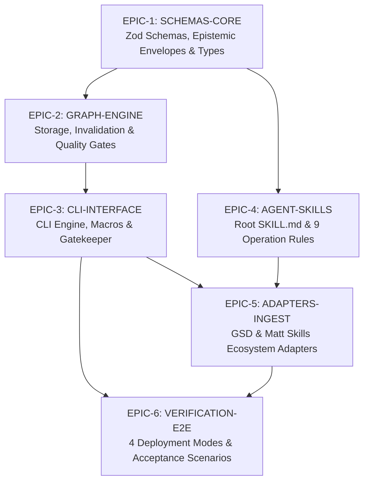

# Ariadne Implementation Tickets and Roadmap

**Specification Reference:** `ariadne_software_reasoning_harness_spec_v5.md`  
**Treatise Reference:** `docs/nine_operations_software_en.md`  
**Status:** Ready for Execution  

---

# Epic Overview & Dependency Graph

---

# Epic 1: Epistemic Core & Schemas (`EPIC-1: SCHEMAS-CORE`)

### `TICKET-101: Define Zod Schemas for Canonical Epistemic Nodes`
- **Objective**: Implement TypeScript definitions and Zod schemas for all 12 epistemic node types: `TASK`, `FRAME`, `OBS`, `HYP`, `CTR`, `TRF`, `SPACE`, `CAN`, `UNK`, `ASM`, `DEP`, `DYN`, `VAL-SELECT`, `EVDREQ`, `EVD`, `VAL`, `TRANS`, `DEC`, `STATE`, `HANDOFF`, `LEAN-TASK`.
- **Preconditions**: Project initialized with `typescript`, `zod`, `vitest`.
- **Deliverables**:
  - `src/core/types/nodes.ts`: TypeScript interfaces.
  - `src/core/schemas/nodes.ts`: Zod validation schemas (`NodeSchema`, `ClaimNodeSchema`, `HypothesisSchema`, etc.).
  - `tests/core/schemas/nodes.test.ts`: Test suite verifying positive and negative validation.
- **Acceptance Criteria**:
  - All node IDs strictly enforce pattern matching `^(TASK|FRAME|OBS|HYP|CTR|TRF|SPACE|CAN|UNK|ASM|DEP|DYN|VAL-SELECT|EVDREQ|EVD|VAL|TRANS|DEC|STATE|HANDOFF|LEAN-TASK)-[0-9A-Za-z_-]+$`.
  - Invariant validation passes on valid sample payloads for all 12 node types.

### `TICKET-102: Define Directed Edge Types and Provenance Lattice`
- **Objective**: Implement Zod schemas for the 7 canonical provenance types ($\mathbf{U} \sqsubset \mathbf{A} \sqsubset \mathbf{P} \sqsubset \mathbf{D} \sqsubset \mathbf{M} \sqsubset \mathbf{F} \sqsubset \mathbf{L}$) and directed relations (`supports`, `contradicts`, `depends_on`, `derived_from`, `falsifies`, `invalidates`, `satisfies`, `violates`, `references`).
- **Preconditions**: `TICKET-101`.
- **Deliverables**:
  - `src/core/types/provenance.ts`: Provenance lattice ordering and lattice comparison utility `isMoreRigorous(p1, p2)`.
  - `src/core/schemas/edges.ts`: Zod validation for directed edges.
  - `tests/core/schemas/provenance.test.ts`: Unit tests for provenance lattice operations.
- **Acceptance Criteria**:
  - Provenance comparator correctly implements $\mathbf{U} \sqsubset \mathbf{A} \sqsubset \mathbf{P} \sqsubset \mathbf{D} \sqsubset \mathbf{M} \sqsubset \mathbf{F} \sqsubset \mathbf{L}$.
  - Edge schema rejects self-referential cycles and invalid source/target relation pairs.

### `TICKET-103: Implement JSON Schema Epistemic Message Envelope`
- **Objective**: Implement the structured message envelope schema for multi-agent communication, including `sender_role`, `target_role`, `epistemic_mode`, and typed `provenance_payload`.
- **Preconditions**: `TICKET-101`, `TICKET-102`.
- **Deliverables**:
  - `src/core/schemas/envelope.ts`: Zod schema for `AriadneEpistemicEnvelope`.
  - `src/core/schemas/json-schema-export.ts`: Utility exporting JSON Schema draft-2020-12 for external agent integration.
  - `tests/core/schemas/envelope.test.ts`: Envelope validation test suite.
- **Acceptance Criteria**:
  - Envelopes with missing `sender_role` or malformed `provenance_payload` are rejected.
  - Generated JSON Schema matches the normative schema in Spec v5 Section 11.

---

# Epic 2: Epistemic Graph & Invalidation Engine (`EPIC-2: GRAPH-ENGINE`)

### `TICKET-201: Implement Hybrid Graph Storage Manager`
- **Objective**: Build the storage driver responsible for managing `.ariadne/STATE.yaml`, `.ariadne/GRAPH.jsonl`, and auto-generating `.ariadne/INDEX.md`.
- **Preconditions**: `EPIC-1`.
- **Deliverables**:
  - `src/graph/storage.ts`: File-based atomic read/write manager for `STATE.yaml` and `GRAPH.jsonl`.
  - `src/graph/index-generator.ts`: Markdown index renderer summarizing the epistemic frontier into a token-efficient format.
  - `tests/graph/storage.test.ts`: Integration test for append-only event logging and concurrent read safety.
- **Acceptance Criteria**:
  - `GRAPH.jsonl` writes are append-only.
  - `INDEX.md` is updated automatically upon node or edge mutation.
  - State survives process restart and context resets.

### `TICKET-202: Implement Transitive Invalidation Algorithm`
- **Objective**: Implement the bread-first reachability search $\text{Reach}(v)$ over directed `depends_on` and `invalidates` edges when an `EVD-` node falsifies an assumption or hypothesis.
- **Preconditions**: `TICKET-201`.
- **Deliverables**:
  - `src/graph/invalidation.ts`: `propagateInvalidation(falsifiedNodeId, evidenceId)`.
  - `tests/graph/invalidation.test.ts`: Test suite verifying multi-hop transitive cascades.
- **Acceptance Criteria**:
  - Falsifying an `ASM-` marks all downstream `CAN-` nodes as `INVALIDATED` and all dependent `DEC-` nodes as `RE-OPENED / INVALIDATED`.
  - Historical graph records are preserved (nodes are marked with invalidation metadata, not deleted).

### `TICKET-203: Implement Weakest-Precondition Derivation Engine`
- **Objective**: Build the derivation engine that automatically computes the resultant provenance of derived claims based on antecedent premises.
- **Preconditions**: `TICKET-102`, `TICKET-201`.
- **Deliverables**:
  - `src/graph/derivation.ts`: `computeDerivedProvenance(antecedentNodeIds)`.
  - `tests/graph/derivation.test.ts`: Test suite for derivation rules.
- **Acceptance Criteria**:
  - If any premise is `ASSUMED`, the derived claim is strictly marked `ASSUMED`.
  - If any premise is `UNKNOWN`, derivation fails with `UNRESOLVED_PREMISE`.
  - Only chains consisting purely of `FACT`, `MEASURED`, or `DERIVED` premises yield `DERIVED` provenance.

### `TICKET-204: Implement Tri-Partite Quality Gates (Structural, Semantic, Epistemic)`
- **Objective**: Build deterministic validation gates enforcing Spec v5 quality rules.
- **Preconditions**: `TICKET-202`, `TICKET-203`.
- **Deliverables**:
  - `src/gates/structural-gate.ts`: Schema conformance and reference integrity.
  - `src/gates/semantic-gate.ts`: Falsifiability checks for `diagnose`, $\ge 3$ mechanism diversity for `explore`, non-compensatory scoring for `value`.
  - `src/gates/epistemic-gate.ts`: 10-rung evidence matching, prohibition of `ASSUMED` nodes in locked `DEC-`, mandatory Adversarial Critique check.
  - `tests/gates/gates.test.ts`: Comprehensive test suite for all three gates.
- **Acceptance Criteria**:
  - Epistemic gate rejects any `DEC-` lacking an adversarial critique.
  - Semantic gate rejects unit tests as proof for throughput claims.

---

# Epic 3: Ariadne CLI & Gatekeeper Interface (`EPIC-3: CLI-INTERFACE`)

### `TICKET-301: Implement CLI Primitive Commands`
- **Objective**: Build the `ariadne` command-line executable with subcommands for node, edge, and state inspection.
- **Preconditions**: `EPIC-2`.
- **Deliverables**:
  - `src/cli/index.ts`: Entrypoint using `commander` or `cac`.
  - `src/cli/commands/status.ts`: `ariadne status` displaying active depth mode, frontier, and open unknowns.
  - `src/cli/commands/node.ts`: `ariadne node add/get/list/remove`.
  - `src/cli/commands/edge.ts`: `ariadne edge add/list/remove`.
- **Acceptance Criteria**:
  - `ariadne status` returns structured JSON when `--json` flag is provided.
  - Invalid node additions are rejected with clear schema error messages.

### `TICKET-302: Implement CLI Invalidation & Quality Gate Commands`
- **Objective**: Expose the invalidation engine and quality gates through CLI commands.
- **Preconditions**: `TICKET-202`, `TICKET-204`, `TICKET-301`.
- **Deliverables**:
  - `src/cli/commands/invalidate.ts`: `ariadne invalidate <node_id> --by <evidence_id>`.
  - `src/cli/commands/gate.ts`: `ariadne gate <structural|semantic|epistemic> [--strict]`.
- **Acceptance Criteria**:
  - `ariadne invalidate` prints the exact cascade trace of affected downstream nodes.
  - `ariadne gate` exits with code 0 on pass and code 1 on gate violation with actionable diagnostic output.

### `TICKET-303: Implement Artifact Generators & Lean Card Scaffolding`
- **Objective**: Provide scaffolding commands for instantiating production-grade markdown artifact templates.
- **Preconditions**: `TICKET-301`.
- **Deliverables**:
  - `src/cli/commands/init.ts`: `ariadne init [--mode=fast|standard|deep]`.
  - `src/cli/commands/template.ts`: `ariadne template <type>` generating markdown templates (`FRAME-`, `DIAG-`, `LEAN-TASK-`, etc.).
- **Acceptance Criteria**:
  - `ariadne init` initializes `.ariadne/` directory with valid `STATE.yaml`, `GRAPH.jsonl`, and `INDEX.md`.

---

# Epic 4: Agent Skills & Progressive Rules (`EPIC-4: AGENT-SKILLS`)

### `TICKET-401: Author Root `SKILL.md` Index & Two-Stage Routing`
- **Objective**: Author the model-invoked root skill `.agents/skills/ariadne/SKILL.md` optimized for progressive disclosure and implicit activation.
- **Preconditions**: `CONTEXT.md`.
- **Deliverables**:
  - `.agents/skills/ariadne/SKILL.md`: Root index with concise trigger branches.
- **Acceptance Criteria**:
  - Total token count of root `SKILL.md` is $< 300$ tokens.
  - Skill carries distinct semantic triggers for all 9 operations.

### `TICKET-402: Author Rules for Operations 1 to 9 (with 36 Techniques & Effects DB)`
- **Objective**: Author detailed rule files in `.agents/skills/ariadne/rules/` for operations 10-frame through 90-validate, incorporating the 36 SIT techniques and contradiction separation principles.
- **Preconditions**: `TICKET-401`, `docs/nine_operations_software_en.md`.
- **Deliverables**:
  - `rules/00-core.md`, `rules/10-frame.md`, `rules/20-diagnose.md`, `rules/30-transform.md`, `rules/40-explore.md`, `rules/50-knowledge.md`, `rules/60-dependencies.md`, `rules/70-dynamics.md`, `rules/80-value.md`, `rules/90-validate.md`.
- **Acceptance Criteria**:
  - Each rule file defines explicit Input Preconditions, Transformation Operators, and Output Deliverables.

### `TICKET-403: Author Governance Rules (Evidence Ladder, Roles, Depth Modes, Agent Rules)`
- **Objective**: Author dedicated rule files for epistemic governance.
- **Preconditions**: `TICKET-401`.
- **Deliverables**:
  - `rules/evidence.md`: 10-rung ladder and claim matching matrix.
  - `rules/invalidation.md`: Transitive invalidation protocol.
  - `rules/roles.md`: 8 epistemic role contracts.
  - `rules/depth-modes.md`: Fast, Standard, and Deep mode rules.
  - `rules/agent-rules.md`: 12 Developer Agent Invariant Rules.
- **Acceptance Criteria**:
  - All rules cite ASD-STE100 standard terms and RFC 2119 requirement words.

---

# Epic 5: Ecosystem Adapters & Ingestion (`EPIC-5: ADAPTERS-INGEST`)

### `TICKET-501: Implement GSD Semantic Adapter & No-Shadow Enforcement`
- **Objective**: Implement GSD auto-detection (`.planning/`), semantic projection, GSD ID reuse, and no-shadow-state validation.
- **Preconditions**: `EPIC-2`, `EPIC-3`.
- **Deliverables**:
  - `src/adapters/gsd/detector.ts`: Detects `.planning/` and `gsd-sdk`.
  - `src/adapters/gsd/projector.ts`: Projects GSD requirements/plans into `.planning/ariadne/STATE.yaml`.
  - `src/adapters/gsd/no-shadow-checker.ts`: Asserts that Ariadne creates no duplicate GSD files.
  - `tests/adapters/gsd.test.ts`: Integration test suite with mock `.planning/` directories.
- **Acceptance Criteria**:
  - GSD locked decisions (`D-*` in `CONTEXT.md`) automatically map to `DECIDED` provenance.
  - No shadow `PROJECT.md` or `STATE.md` is generated in GSD mode.

### `TICKET-502: Implement Matt Pocock Skills Ingestion Engine`
- **Objective**: Implement ingestion and output normalization for Matt model-invoked skills (`diagnosing-bugs`, `research`, `prototype`, `tdd`, `domain-modeling`, `codebase-design`, `code-review`).
- **Preconditions**: `EPIC-2`, `EPIC-3`.
- **Deliverables**:
  - `src/adapters/matt/ingest.ts`: Parser normalizing Matt skill outputs into typed `EVD-` and `EVDREQ-` nodes.
  - `src/cli/commands/ingest.ts`: `ariadne ingest matt <skill-name> <output-file>`.
  - `tests/adapters/matt.test.ts`: Unit test suite for parsing Matt skill outputs.
- **Acceptance Criteria**:
  - Red-capable test scripts from `diagnosing-bugs` are transformed into valid `EvidenceResult` nodes with `MEASURED` provenance.

### `TICKET-503: Implement Adaptive Downstream Handoff Generators`
- **Objective**: Build handoff generators transitioning locked decisions into delivery workflows (`to-spec` -> `to-tickets` -> `implement` for complex tasks, direct `implement` for bounded tasks).
- **Preconditions**: `TICKET-501`, `TICKET-502`.
- **Deliverables**:
  - `src/adapters/handoff/generator.ts`: `generateHandoff(decId)`.
  - `tests/adapters/handoff.test.ts`: Test suite verifying handoff integrity.
- **Acceptance Criteria**:
  - Handoff includes verified facts, active invariants, locked ADR link, and next recommended user command without auto-invoking human-only skills.

---

# Epic 6: Multi-Agent Protocols & End-to-End Test Suite (`EPIC-6: VERIFICATION-E2E`)

### `TICKET-601: Implement Multi-Agent Worktree Isolation for Deep Mode`
- **Objective**: Build Git worktree manager for competing candidate mechanisms (`can-01-raft`, `can-02-crdt`) under Deep Mode.
- **Preconditions**: `EPIC-3`, `EPIC-4`.
- **Deliverables**:
  - `src/multiagent/worktree-manager.ts`: Creates isolated worktrees and binds them to candidate IDs.
  - `tests/multiagent/worktree.test.ts`: Integration test verifying candidate isolation.
- **Acceptance Criteria**:
  - Competing candidates execute in independent worktrees and are evaluated against a shared invariant test suite.

### `TICKET-602: Build End-to-End Suite for 4 Deployment Modes (A, B, C, D)`
- **Objective**: Create automated integration test suite validating full lifecycles across Mode A (GSD+Matt), Mode B (GSD), Mode C (Matt), and Mode D (Standalone).
- **Preconditions**: `EPIC-5`, `TICKET-601`.
- **Deliverables**:
  - `tests/e2e/mode-a.test.ts`: Full GSD+Matt+Ariadne integration.
  - `tests/e2e/mode-b.test.ts`: GSD+Ariadne fallback.
  - `tests/e2e/mode-c.test.ts`: Matt+Ariadne controller.
  - `tests/e2e/mode-d.test.ts`: Standalone execution and context reset recovery.
- **Acceptance Criteria**:
  - All 4 modes execute their respective workflows with zero unhandled exceptions.

### `TICKET-603: Automated Conformance Test for the 10 Acceptance Scenarios`
- **Objective**: Implement automated tests verifying Scenarios A through J from Spec v5 Section 18.
- **Preconditions**: `TICKET-602`.
- **Deliverables**:
  - `tests/e2e/acceptance-scenarios.test.ts`: Test suite covering Scenarios A–J.
- **Acceptance Criteria**:
  - 100% of acceptance scenarios pass deterministically.
