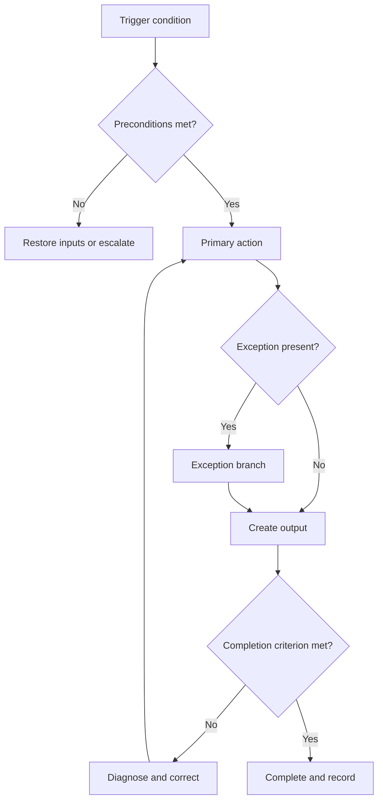

# Designing Methodological Guides

## From a Working Map to a Completeness Basis

**A layered methodology for creating guides that help people act, learn, verify results, and update rules**

---

## Abstract

A methodological guide combines four tasks: it explains the rationale behind recommendations, defines a course of action, helps users master that course of action, and supports the verification of results over time. This book organizes these tasks as a progressive exposition of the same model.

The first layer is the **Guide Working Map** (`A0`): a single concise document that records the user and situation, the action to be mastered, the learning path, the verification method, the rationale, and the nearest next step. The Working Map is used to perform the **initial design cycle**, which consists of four actions:

1. describe the user and situation;
2. define the action to be mastered;
3. build a path to independent performance;
4. verify performance with a representative of the target audience.

The second layer comprises **seven specialized working documents** (`A1–A7`). They elaborate on the Working Map fields that require separate decisions, evidence links, coordination among participants, or a change history.

The third layer is the **7×7 completeness basis for a methodological guide**. It is a system of seven quality areas: purpose, rationale, user, action, learning, verification, and lifecycle. Each area is expanded into seven **verification questions (coordinates)**, each responsible for a distinct class of design decision. The basis is used to systematically verify the completeness of an existing methodology.

The book therefore proceeds cumulatively: **Working Map → initial cycle → specialized documents → completeness basis → self-consistency check**. Here, a **self-consistency check** means applying the system's requirements to the system itself. Each successive layer refines concepts already introduced while preserving the content of the previous layer.

---

<a id="toc"></a>
## Contents

- [Preface](#preface)
- [Core concepts and the order in which they are introduced](#core-concepts)
- [How to read this book](#how-to-read)
- [Part I. The initial design cycle](#part-i)
  - [Chapter 1. The initial design cycle](#quick-path)
  - [Chapter 2. A0 — Guide Working Map](#working-card)
  - [Chapter 3. The first cycle: from concept to user test](#first-cycle)
- [Part II. Foundations of the complete model](#part-ii)
  - [Chapter 4. The four functions of a methodological guide](#problem)
  - [Chapter 5. What the reviewed sources contribute](#sources-review)
  - [Chapter 6. A taxonomy of the origin and strength of knowledge](#epistemology)
- [Part III. The complete development model](#part-iii)
  - [Chapter 7. The 7×7 completeness basis for a methodological guide](#basis)
  - [Chapter 8. The seven-stage development cycle](#full-cycle)
  - [Chapter 9. Expanding the specialized working documents](#expansion-guide)
- [Part IV. Seven specialized working documents](#part-artifacts)
  - [A1 — Methodology Profile](#a1) · [A2 — Rationale Register](#a2) · [A3 — User Map](#a3) · [A4 — Decision Map](#a4)
  - [A5 — Learning Module](#a5) · [A6 — Verification Protocol](#a6) · [A7 — Lifecycle Log](#a7)
- [Part V. Learning, joint application, and audit](#part-learning)
  - [Chapter 17. Seven learning modules](#chapter-14)
  - [Chapter 18. How to use the working documents together](#chapter-15)
  - [Chapter 19. Auditing an existing guide](#chapter-16)
- [Part VI. Verifying the methodology itself](#part-reflexive)
  - [Chapter 20. Self-consistency check](#fixed-point)
- [Conclusion](#conclusion)
- [Appendix A. Idea vectors from the source materials](#appendix-a)
- [Appendix B. Mapping the sources to the completeness basis](#appendix-b)
- [Appendix C. The 49-item audit](#appendix-c)
- [Appendix D. Consolidated project template](#appendix-d)
- [Appendix E. Self-application of A1–A7](#appendix-e)
- [Bibliography](#bibliography)
- [Note on the status of the synthesis](#status-note)

---

<a id="preface"></a>
# Preface

This book builds a methodology from a simple working object into a complete, verifiable system. At each new level, it preserves the structure already learned and adds only the detail required for the next class of decisions.

This method of presentation is called **progressive concept disclosure**. It follows three rules:

1. a new concept first receives a name and definition;
2. its relationship to previously introduced concepts is then shown;
3. it is subsequently used as part of a more complex construction.

This allows the reader to begin practical work with a single Working Map, then master the initial design cycle, later expand the specialized documents, and only then use the completeness basis for a systematic audit.

The book's main principle is:

> **The complete internal model is disclosed to the user progressively, in the order of dependencies among concepts and decisions.**

The completeness of the system is preserved: each simplified layer has an explicit link to a more detailed layer and can be expanded without losing knowledge already recorded.

---

<a id="core-concepts"></a>
# Core Concepts and the Order in Which They Are Introduced

The concepts on which the rest of the text is built are defined below. Their order also establishes the route for learning the methodology.

1. A **methodological guide** is a guide that explains a well-founded way to solve a recurring class of problems and teaches its application.
2. The **Guide Working Map (`A0`)** is a concise, unified document for the first design pass. It records the user, task, action, learning, verification, rationale, and next step.
3. The **initial design cycle** consists of four actions performed with the Working Map: describing the user and situation; defining the action to be mastered; building a path to independence; and testing performance with users.
4. A **specialized working document (`A1–A7`)** is a separate structured record for an area that has become too complex for a single Working Map field. The seven documents cover purpose, rationale, user, actions, learning, verification, and lifecycle.
5. The **complete development cycle** consists of seven stages in which the specialized documents are created, refined, verified, and maintained in a coordinated manner.
6. The **completeness basis for a methodological guide** is a two-level verification system comprising seven quality areas. A **verification coordinate** is an individual question that reveals a distinct class of design decision. Each area contains seven such coordinates; together, they form a 7×7 structure.
7. A **self-consistency check** applies the same requirements to the methodology itself. A **fixed point** is a state of the methodology in which self-application preserves the same set of required structural elements. [Part VI](#part-reflexive) introduces a precise model of these elements and a formal expression of this property.

The relationship among these concepts can be represented as a sequence:

\[
A0 \;\longrightarrow\; \text{initial cycle} \;\longrightarrow\; A1\ldots A7 \;\longrightarrow\; \text{complete cycle} \;\longrightarrow\; \text{7×7 completeness basis} \;\longrightarrow\; \text{self-consistency}.
\]

Each transition adds detail. The Working Map remains a concise representation of the project; the specialized documents preserve details; the completeness basis verifies coverage; and the self-consistency check extends the same requirements to the design system itself.

## Terminology Convention

The main text uses the following terms:

1. **Instructional design** — the systematic construction of objectives, content, exercises, feedback, and verification.
2. **Evidence-based guidelines** — rules with a traceable transition from data and research to a decision.
3. **Development handbook** — a document that explains requirements and how to produce a result.
4. **Worked example** — a demonstrated solution with explanations of its steps and rationale.
5. **Fading** — the transition from a complete example to an incomplete example and then to independent performance.
6. **Chunk** — several elements perceived as a single familiar unit.
7. **Metamethodology** — a methodology concerned with creating and verifying other methodologies; in this book, it also verifies its own structure.

---

<a id="how-to-read"></a>
# How to Read This Book

[Part I](#part-i) produces the first practical result: the Working Map is completed during the initial design cycle and turned into a small, verifiable fragment of the guide.

[Part II](#part-ii) adds the research foundations and a system for classifying claims and their rationales. It shows how to link a recommendation to a source of knowledge and a scope of applicability.

[Part III](#part-iii) introduces the complete development cycle and the 7×7 completeness basis. [Part IV](#part-artifacts) expands the seven specialized working documents. [Part V](#part-learning) shows their joint application, the training of authors, and the auditing of completed guides.

[Part VI](#part-reflexive) adds the self-consistency check: the methodology's requirements are applied to the methodology itself and formalized as a fixed-point condition.

---
<a id="part-i"></a>
# Part I. The Initial Design Cycle

<a id="quick-path"></a>
## Chapter 1. The Initial Design Cycle

The initial design cycle consists of four actions. Each action completes the corresponding section of the Working Map and produces an observable result.

### 1.1. Action 1 — Describe the User and Situation

First, describe a specific role, work situation, and material constraint using this pattern:

> When **who** encounters **what situation**, they must achieve **what result**, despite **what constraints**.

Minimum output:

- one specific role;
- one real task;
- prior knowledge;
- a critical constraint;
- a situation in which the methodology must not be used.

### 1.2. Action 2 — Define the Action to Be Mastered

The action to be mastered is formulated as an observable performance outcome. For example, “review a code change and justify an acceptance decision” defines an observable action and a verifiable output.

Record:

- the trigger condition;
- the inputs;
- the decision or action;
- the verifiable output;
- the primary error;
- the recovery method.

### 1.3. Action 3 — Build a Path to Independence

The path to independence begins with a complete action and gradually transfers control to the user:

1. a meaningful task;
2. a complete worked example;
3. an explanation of the rationale behind decisions;
4. an incomplete example;
5. an independent task;
6. a modified or erroneous case.

### 1.4. Action 4 — Verify Performance in Practice

Verification centers on a representative of the target audience performing the task. Observe whether they:

- started without additional oral explanation;
- found the relevant rule;
- performed the action;
- noticed the error;
- recovered from it;
- could explain the rationale for the decision;
- transferred the rule to a modified case.

### 1.5. Result of the First Pass

The four actions produce a **verifiable pilot version**:

1. one usage scenario;
2. one learning fragment;
3. one observable test;
4. a list of unknowns and the next decision.

This set constitutes the minimum verifiable result of the initial cycle and provides the basis for the next expansion.

---

<a id="working-card"></a>
## Chapter 2. A0 — Guide Working Map

`A0`, the Guide Working Map, is the single initial form used for the first cycle and small projects. Its fields concisely represent the contents of the seven specialized working documents [A1–A7](#part-artifacts).

### 2.1. Template

```markdown
# Guide Working Map

## 1. User and situation
- Role:
- Real task:
- Prior knowledge:
- Constraints:
- When the guide does not apply:

## 2. Action to be mastered
- Trigger condition:
- Inputs:
- Action or decision:
- Verifiable output:
- Primary error:
- Recovery:

## 3. Learning path
- Meaningful opening task:
- Complete worked example:
- What needs a “why” explanation:
- Incomplete example:
- Independent task:
- Transfer case or exception:

## 4. Verification
- Who will test it:
- What task they will perform:
- What is observed:
- Success criterion:
- What results will require the guide to change:

## 5. Rationale and unknowns
- Key rule:
- What it is based on:
- Confidence:
- What remains unknown:

## 6. Next step
- [ ] Revise the Working Map
- [ ] Create or revise the learning fragment
- [ ] Conduct a user test
- [ ] Expand specialized working document A1–A7
- [ ] Record a new version
```

### 2.2. How the Map Relates to the Complete System

| A0 field | Expanded, when complexity increases, into |
|---|---|
| user, situation, constraints | [A3 — User Map](#a3) |
| action to be mastered and boundaries | [A1 — Profile](#a1) and [A4 — Decision Map](#a4) |
| rationale and confidence | [A2 — Rationale Register](#a2) |
| learning path | [A5 — Learning Module](#a5) |
| test and criteria | [A6 — Verification Protocol](#a6) |
| next step and version | [A7 — Lifecycle Log](#a7) |

### 2.3. Completion Rule

The Working Map remains concise: one field contains one primary decision. When a field requires several independent decisions, different owners, traceable evidence, or a change history, it is expanded into the corresponding specialized working document, while A0 retains a brief record and a link.

---

<a id="first-cycle"></a>
## Chapter 3. The First Cycle: From Concept to User Test

### 3.1. Step 1 — Select One Critical Scenario

Select one action that directly expresses the guide's primary function. The first pass covers one role, one typical context, and one level of support.

### 3.2. Step 2 — Complete A0 with Assumptions

Record unknowns explicitly. Mark every material statement as:

- **known** — supported by an observation or reliable source;
- **assumed** — adopted provisionally;
- **unknown** — requires research or testing.

### 3.3. Step 3 — Create a Minimum End-to-End Fragment

A minimum end-to-end fragment covers the entire chain:

1. user task;
2. action rule;
3. example;
4. independent task;
5. observable verification;
6. decision based on the result.

One complete end-to-end path provides an early, verifiable link among the task, rule, learning, and result.

### 3.4. Step 4 — Observe Application

During the test, the author limits intervention to predefined safety measures. Observation records the user's actions, their errors, and the points at which the document's structure directed them toward an incorrect decision.

### 3.5. Step 5 — Make One of Four Decisions

After the test, choose an explicit decision:

1. **retain** — the path works within the stated boundaries;
2. **revise** — the problem is local;
3. **expand** — a Working Map field requires several independent decisions and is moved into a specialized working document;
4. **narrow** — the scope of applicability was stated too broadly.

### 3.6. Example: A Guide to Reviewing a Code Change

**User:** a developer reviewing a pull request for the first time.

**Action:** determine whether the change can be accepted and leave a verifiable rationale.

**Complete example:** a small pull request, the requirements, an identified risk, and the final comment are shown.

**Incomplete example:** the risk is identified, but the user must link it to a requirement and formulate a decision.

**Test:** the user reviews a new pull request without prompting from the author. The order of actions, detection of defects, quality of the rationale, and ability to distinguish a required correction from a preference are observed.

**Expansion condition:** if different classes of risk, conflicting rules, or multiple approval roles emerge, A0 is split into at least [A2](#a2), [A3](#a3), [A4](#a4), and [A6](#a6).

### 3.7. When to Proceed to the Next Part

Proceed to the complete system when at least one of the following occurs:

- a key rule cannot be justified by a single entry;
- users perform different tasks;
- the procedure has dangerous exceptions;
- tests produce conflicting results;
- the guide becomes normative for an organization;
- several people must modify it in a coordinated manner;
- completeness or compliance must be demonstrated.

---
<a id="part-ii"></a>
# Part II. Foundations of the Complete Model
<a id="problem"></a>
<a id="chapter-1"></a>
## Chapter 4. The Four Functions of a Methodological Guide

### 4.1. Four Functions of a Single Genre

A complete methodological guide simultaneously performs four functions.

The first is **justificatory**. The reader must understand the grounds on which a recommendation exists. This requires distinguishing among data, theory, expert consensus, local observation, and the author's inference.

The second is **practical**. The text must make it possible to derive an action. The phrase “consider the context” is almost useless unless it explains which contextual indicators to collect, when they change the decision, and how.

The third is **instructional**. The reader must not only repeat the demonstrated procedure but also acquire a schema that enables them to recognize new cases. This is where worked examples, explanations of subgoals, gradual fading of support, and self-explanation matter [[S11]](#ref-s11).

The fourth is the **lifecycle function**. It connects the methodology to changes in evidence, users, tools, risks, and the application environment. A mechanism for verification and updating turns a published text into a managed system [[S4]](#ref-s4), [[S5]](#ref-s5), [[S6]](#ref-s6), [[S13]](#ref-s13).

### 4.2. Seven Requirements for a Complete Guide

The four functions in Section 4.1 become practical when the guide simultaneously maintains seven quality areas.

1. **Purpose** — defines the observable problem, expected change, and measure of success.
2. **Rationale** — links material rules to sources of knowledge, assumptions, and confidence levels.
3. **User** — describes roles, tasks, prior knowledge, work context, and constraints.
4. **Action** — turns principles into trigger conditions, decisions, steps, branches, outputs, and recovery from errors.
5. **Learning** — builds a path from understanding an example to independent and transferable performance.
6. **Verification** — connects the guide's quality to observable performance of a real task.
7. **Lifecycle** — defines rules for adoption, feedback, updating, replacement, and retirement of a version.

In [Chapter 7](#basis), these seven areas receive a formal structure and form the first level of the **completeness basis for a methodological guide**.

### 4.3. Information Sufficiency and Layered Disclosure

Research on guideline development demonstrates the value of a complete requirement space: Guidelines 2.0 compiles 146 items while emphasizing their interdependence and contextual nature [[S6]](#ref-s6). Research on minimalist instruction shows another side of the same problem: a working path becomes more effective when material is organized around real tasks, user initiative, errors, and recovery [[S7]](#ref-s7), [[S8]](#ref-s8), [[S9]](#ref-s9), [[S10]](#ref-s10), [[S15]](#ref-s15).

These findings are compatible in a layered model. **Completeness** concerns the internal decision space, while **sufficiency** concerns the amount of information a user needs at the current step. The Working Map provides sufficiency for the first pass; specialized documents add detail; the completeness basis verifies coverage across the whole system.

This yields a general principle: **each layer contains enough information for its task and has an explicit path for expansion into the next layer**.

---
<a id="sources-review"></a>
<a id="chapter-2"></a>
## Chapter 5. What the Reviewed Sources Contribute

### 5.1. Instructional Design: The Guide as a Designed Path

Saborío-Taylor and Rojas Ramírez combine four components in the development of educational materials: needs analysis, instructional design, universal design for learning, and graphic design [[S1]](#ref-s1). This matters to our task for two reasons. First, the material must be derived from the audience's real needs rather than from the structure of the author's knowledge. Second, accessibility and visual organization are not post-editing embellishments; they are part of the design itself.

In a systematic review of 34 studies, Wintersberg and Pittich propose understanding instructional design as a “roadmap” for achieving learning objectives [[S2]](#ref-s2). Their synthesis emphasizes the mutual relationship between theory and practice, the cyclical nature of the process, the distribution of roles among participants, and the need to adapt a general model to the context. The gap they identify between theoretical models and everyday practice is particularly important.

After reviewing 31 publications, Abuhassna and Alnawajha demonstrate the diversity of instructional design models and recommend connecting design models to broader theoretical foundations while accounting for different contexts and participant roles [[S3]](#ref-s3). For the author of a methodological guide, this implies a prohibition against a “magic model”: ADDIE (“analysis → design → development → implementation → evaluation”), rapid prototyping, or another scheme may organize the process, but it cannot replace learning theory, user analysis, and evidence.

### 5.2. Guideline Development: The Guide as Evidence Infrastructure

Turner et al. compared six handbooks from major organizations and identified 14 elements of guideline development across four approximate phases: preparation, systematic evidence review, writing, and subsequent review [[S4]](#ref-s4). The key result for our purposes is that “mentioned” is an insufficient criterion. The authors specifically distinguished among an absent element; an element that is named but has little practical detail; and an element accompanied by clear practical guidance. This becomes a fundamental rule of this book: **a declaration is not a practical instruction**.

Ansari and Rashidian compared 19 handbooks and identified 27 tasks [[S5]](#ref-s5). Their work adds the important idea of prioritization: not all actions are equally critical, and completeness can be assessed using weighted tasks. They also reveal blind spots—for example, ethical issues and pilot implementation were often described less thoroughly. Expert additions to their model emphasize specific recommendations, feasibility, a transparent transition from rationale to recommendation, and the need to account for local data and values.

Guidelines 2.0 takes the next step by systematically compiling 146 items in 18 topics that cover the entire lifecycle, from planning through dissemination, evaluation, and updating [[S6]](#ref-s6). The items are not treated as strictly sequential; they are interconnected. This matters: developing a guide should be a **cyclical network of decisions**, not an assembly line on which it is impossible to go back.

In 2026, Chitale et al. compared several independent sources—Turner, Ansari, and GIN-McMaster—and derived 18 “essential elements” in five domains, which they then used to construct and pilot an equity-assessment tool [[S13]](#ref-s13). Their work demonstrates a general technique: first synthesize a common framework, then apply an additional perspective to every element—in their case, equity and differences among groups—and test the tool with expert users.

### 5.3. Minimalist Instruction: The Guide as an Environment for Action

Carroll et al. developed *The Minimal Manual* in response to problems with traditional self-instruction manuals [[S7]](#ref-s7). It was shorter, helped coordinate attention between the manual and the system, explicitly taught error recognition and correction, and worked better as a reference after training.

Lazonder and van der Meij replicated and extended the original findings with 64 students randomly assigned to a minimalist or conventional manual [[S8]](#ref-s8). Users of the minimalist version learned faster and performed better. Prior experience affected the result but did not interact with the type of manual, supporting the approach's applicability to audiences with different levels of experience.

Van der Meij and Lazonder present an even more operational form of the minimalist approach: move quickly to procedural skills, use authentic tasks in context, and build on the user's knowledge and reasoning rather than attempting to impose the author's complete model [[S9]](#ref-s9). In their experiment, users of the minimalist manual successfully completed roughly 50% more tasks, demonstrated greater independence, recovered from errors themselves more often, and consulted the manual less frequently.

Carroll's 2014 retrospective states a deeper principle: errors, diagnosis, and recovery should be treated as learning opportunities rather than deviations from the “correct” path [[S10]](#ref-s10). This does not, however, justify unconditional freedom. If an error triggers a cascade that a novice cannot untangle, the environment may temporarily block certain dangerous actions—“training wheels.” A methodological guide must therefore distinguish between a **productive error** and a **destructive error**.

### 5.4. Cognitive Load and Worked Examples

Shen and Tsai synthesize research on worked examples into eight principles: mental animation, completion of an incomplete example, fading, process, presentation, material format, timing, and self-explanation [[S11]](#ref-s11). Four implications are especially important for methodological guides: a novice first benefits from seeing a sufficiently complete model; some steps can then be left incomplete; support is gradually removed; and the explanation must highlight not only the sequence of actions but also the subgoals—the “what for” and “why.”

Klepsch and Seufert connect instructional design to three design objects: the task itself, the presentation of the material, and the activation of the learner's cognitive processes [[S12]](#ref-s12). Poor information placement forces working memory to be spent on searching and coordination rather than understanding. This yields a practical principle: interdependent information should be placed close together; navigation, decoding conventions, and connecting separated parts cannot be treated as “free” user actions.

### 5.5. Miller: Seven as a Partitioning Convention

In 1956, Miller discussed limits on absolute judgment and immediate memory and popularized the phrase “seven, plus or minus two” [[S14]](#ref-s14). The text itself, however, cautions against combining different phenomena too literally around a single number. The idea with central design value is **grouping and regrouping information into meaningful chunks**: individual elements can be combined into larger, familiar units of meaning.

Later work by Cowan revises the pure capacity of short-term storage toward roughly four chunks [[C1]](#ref-c1). In this book, seven is used as a **constructive architectural constraint**, while claims about working-memory capacity are treated separately: at one architectural level, the reader sees seven meaningful chunks, and each chunk expands into another seven. This creates a stable 7×7 form and compels the author to consolidate synonymous or dependent ideas instead of allowing the list to grow indefinitely.

---
<a id="epistemology"></a>
<a id="chapter-3"></a>
## Chapter 6. A Taxonomy of the Origin and Strength of Knowledge

### 6.1. From a Source List to a Rationale Record

A citation beside a recommendation indicates where the material came from. Methodological verification requires a more complete record: exactly what the source supports, what type of claim the author makes, how far the inference is removed from the source data, and under what conditions it applies.

For this purpose, every material recommendation is assigned a **[claim-and-rationale record](#epistemic-passport)**.

<a id="axis-k"></a>
### 6.2. Axis K: Seven Types of Claims

| Code | Type | Question |
|---|---|---|
| [K1](#axis-k) | Descriptive | What is observed or exists? |
| [K2](#axis-k) | Causal-mechanistic | Why or by what mechanism does it occur? |
| [K3](#axis-k) | Predictive | What is likely to happen under the given conditions? |
| [K4](#axis-k) | Diagnostic-conditional | What indicators identify the state or applicability? |
| [K5](#axis-k) | Procedural | What should be done, and in what sequence or branching structure? |
| [K6](#axis-k) | Evaluative-normative | What should be considered good, acceptable, or preferable? |
| [K7](#axis-k) | Metamethodological | How should the rules themselves be created, verified, or changed? |

<a id="axis-e"></a>
### 6.3. Axis E: Seven Classes of Rationale

The second axis indicates the origin of knowledge. The classes describe different modes of justification and are used together with an assessment of the quality of the specific source.

| Code | Rationale class | What it provides |
|---|---|---|
| [E1](#axis-e) | Direct empirical measurement | An observed effect, behavior, error, or result |
| [E2](#axis-e) | Systematic review/synthesis | A view across multiple studies with an explicit selection method |
| [E3](#axis-e) | Comparison of independent sources | Convergence among several independent guides, models, or corpora |
| [E4](#axis-e) | Theory/explanatory model | A mechanism and relationships that support knowledge transfer |
| [E5](#axis-e) | Expert consensus/standard | A coordination rule and professional norm |
| [E6](#axis-e) | Contextual evidence | Data from a specific organization, audience, process, or environment |
| [E7](#axis-e) | Design inference/heuristic | A deliberate construction by the author that does not yet have direct support |

The 7×7 synthesis proposed in this book belongs primarily to [E3](#axis-e) and [E7](#axis-e): it is based on comparing independent sources from several research traditions. Its current status is an authorial synthesis whose external experimental validation as a unified system remains a separate task.

<a id="epistemic-passport"></a>
### 6.4. Claim-and-Rationale Record

```text
Claim code:
Statement:
Claim type K1–K7:
Rationale class E1–E7:
Confidence: high / medium / low
Scope of applicability:
“Rationale → recommendation” link:
Counterconditions / known exceptions:
Sources:
Mandatory review trigger:
```

The key field is the **“rationale → recommendation” link**. This is where the author must show the reasoning that would otherwise remain hidden between a citation and an imperative.

### 6.5. Seven Rules for Working with Rationales

1. **Explicitly mark transitions between claim types.**
2. **Explicitly mark normative decisions.**
3. **Separate the source from the justificatory link.**
4. **Separate self-consistency from external validation.** An internal audit demonstrates internal coherence; the external rationale class is determined by independent data and sources.
5. **State the scope of transfer.**
6. **Preserve uncertainty, alternatives, and applicability boundaries.** Record a lack of data separately from evidence of no effect.
7. **Version rationales together with rules.**

---
<a id="part-iii"></a>
# Part III. The Complete Development Model
<a id="basis"></a>
<a id="chapter-4"></a>
## Chapter 7. The 7×7 Completeness Basis for a Methodological Guide

The **completeness basis for a methodological guide** is a two-level verification system that organizes the space of design decisions into seven quality areas and seven verification coordinates within each area. Its purpose is to show which classes of decisions the methodology already covers and where additional work is required.

The first level addresses seven major questions: purpose, rationale, user, action, learning, verification, and lifecycle. The second level refines each major question into seven verification coordinates. The structure therefore contains 49 verification positions organized into seven meaningful chunks.

This structure is based on a synthesis of ideas from the reviewed sources. The following sections explain how the source ideas become independent quality areas.

### 7.1. What an “Idea Vector” Means

For synthesis purposes, each source is represented as a set of atomic semantic components:

\[
V_s = \{i_1, i_2, \ldots, i_n\},
\]

where each \(i_k\) is not a topic or quotation but a claim capable of changing a design decision. For example, “the work contains 146 items” is a descriptive property of a source; “the process elements are interconnected and should not be treated as strictly linear” is a design-significant idea.

Before the basis is constructed, the ideas undergo four operations:

1. **atomization** — a compound claim is divided into separate decisions;
2. **normalization** — synonyms from different disciplines are reduced to a common formulation;
3. **dependency reduction** — an example, special case, or tool is not treated as a new coordinate unless it introduces a new class of decision;
4. **coverage check** — a discarded idea must be recoverable as a specialization of one or more retained coordinates.

### 7.2. Independence of Quality Areas

Define the dependency relation \(a \preceq B\): idea \(a\) depends on set \(B\) if, for the designer, it raises no new question and is instead a synonym, special case, implementation method, or consequence derivable without an additional contextual decision.

The basis is considered functionally independent if removing any coordinate leaves a **unique class of blind spot**. For example, good user analysis cannot establish the quality of evidence; evidence cannot establish the instructional sequence; and the instructional sequence cannot establish update governance.

This is not a mathematical proof of linear independence. It is an engineering procedure for constructing a minimal set of non-overlapping decision classes.

### 7.3. First Level: Seven Quality Areas

The term **quality area** denotes an independent class of design decisions. Each area answers its own primary question and produces its own result.

| Code | Quality area | Primary question | Result |
|---|---|---|---|
| [B1](#b1) | **Purpose** | Why does the methodology exist, and what should it change? | Measurable function and boundaries of the methodology |
| [B2](#b2) | **Rationale** | Why do its rules deserve trust? | A traceable “knowledge → recommendation” link |
| [B3](#b3) | **User** | For whom, in what task, and under what constraints? | A model of real-world application |
| [B4](#b4) | **Action** | How does a principle become a decision and procedure? | Executable rules, branches, and outputs |
| [B5](#b5) | **Learning** | How will the user acquire a transferable capability? | A path from example to independent action |
| [B6](#b6) | **Verification** | How do we know that the methodology works in practice? | Observable confirmation of the result |
| [B7](#b7) | **Lifecycle** | How is the methodology adopted, changed, and retired? | Managed version maintenance |

### 7.4. Second Level: Seven Verification Coordinates Within Each Area

<a id="b1"></a>
#### B1. Purpose

1. **Problem** — what observable unsatisfactory state exists.
2. **Outcome** — what state should change.
3. **Behavior/capability** — what the user should be able to do differently.
4. **Boundaries** — what is intentionally not covered.
5. **Priority** — why this particular problem warrants a methodology now.
6. **Measure of success** — which indicators will be used to judge the effect.
7. **Assumptions and constraints** — what is taken as given and what limits the solution.

<a id="b2"></a>
#### B2. Rationale

1. **Claim type** — exactly what is claimed.
2. **Provenance** — where the rationale came from and whether it can be reconstructed.
3. **Relevance** — why the source applies to this question and context.
4. **Quality/confidence** — how reliable the support is.
5. **Synthesis** — how conflicting and complementary evidence is reconciled.
6. **Rationale → recommendation link** — why this particular rationale leads to this rule.
7. **Uncertainty and bias** — what is unknown and which interests and assumptions have an effect.

<a id="b3"></a>
#### B3. User

1. **Roles** — who reads, performs, verifies, and approves.
2. **Prior knowledge** — which schemas and skills already exist.
3. **Real tasks** — which goals the user is trying to achieve.
4. **Work context** — where and in what workflow the method is used.
5. **Resources and constraints** — time, tools, authority, and safety.
6. **Accessibility and equity** — for whom the form of the methodology creates a systemic barrier.
7. **Stakeholder participation** — how real users influence the design.

<a id="b4"></a>
#### B4. Action

1. **Trigger condition** — when the rule becomes active.
2. **Inputs/preconditions** — what must be known or prepared.
3. **Action** — what the user specifically does.
4. **Branching** — which observable conditions change the next step.
5. **Output/work product** — what verifiable result remains.
6. **Error and recovery** — how to detect, diagnose, and correct a failure.
7. **Exception/escalation** — when the method ceases to be sufficient and another decision is required.

<a id="b5"></a>
#### B5. Learning

1. **Early meaningful task** — begin with an action that has a purpose for the user.
2. **Worked example** — show a complete solution before requiring independent performance.
3. **Subgoals and rationale** — show the sequence together with the “what for” and “why” of every material decision.
4. **Self-explanation** — require the learner to reconstruct the causal and decision-making relationship in their own words.
5. **Fading** — move from a complete example to an incomplete one and then to an independent task.
6. **Cognitive-load management** — eliminate unnecessary searching, separation, and decoding.
7. **Navigation and progressive concept disclosure** — first name and define a new concept, then connect it to concepts already learned, and only afterward use it in a more complex construction; meaningful chunks should support reading, action, and later retrieval.

<a id="b6"></a>
#### B6. Verification

1. **Pilot version** — test the structure before costly finalization.
2. **Expert review** — verify domain correctness and the quality of the rationale.
3. **User testing** — observe a real representative of the audience.
4. **Performance assessment** — measure the completed task; use subjective clarity as a supplementary indicator.
5. **Pilot implementation in a real environment** — verify contextual constraints.
6. **Implementation plan** — identify barriers, resources, and workflow changes.
7. **Metrics, feedback, and self-consistency** — collect post-release data, turn it into decisions, and, for metamethodologies, reconfirm `F(M) ≡ M` after every normative change.

<a id="b7"></a>
#### B7. Lifecycle

1. **Roles and decision rights** — who owns the methodology and who may change it.
2. **Version and change history** — what changed and why.
3. **Mandatory review triggers** — which events require a review.
4. **Feedback channel** — how errors, exceptions, and new needs are recorded.
5. **Deviation management** — who may temporarily authorize noncompliance with a rule and how it is recorded.
6. **Formats, disclosure levels, and distribution** — which representations are needed for rapid action, learning, reference, verification, and maintenance.
7. **Replacement and retirement** — how an old version ceases to be normative and how the transition is performed.

### 7.5. Independent Functions of the Seven Areas

The seven areas form a connected system while retaining their own functions.

**Purpose** defines the required change; **user** determines who achieves that change and under what conditions. One purpose may serve several audiences, and one audience may have several purposes.

**Rationale** explains why a rule is reasonable to adopt; **verification** shows what happened after the rule was embodied in a specific form and environment. The former connects the decision to prior knowledge, while the latter connects it to an observable result.

**Action** describes an executable procedure; **learning** builds the sequence through which the user masters that procedure and transfers it to new cases. The learning sequence may use additional support, simplified conditions, and a different order of concept disclosure.

**Verification** produces information about the methodology's performance; **lifecycle** turns that information into a managed decision to retain, change, replace, or retire a version.

Practical independence is tested by removing one area at a time: for each area, ask whether its function remains after that area is removed. If the function disappears and requires a new assumption, the area is considered an independent part of the basis.

---
<a id="full-cycle"></a>
<a id="chapter-5"></a>
## Chapter 8. The Seven-Stage Guide Development Methodology

The complete development cycle contains seven stages. The first version passes through them in the order 1→7; new data at any stage creates feedback to previously completed stages and related working documents.

```text
1. Define the purpose
        ↓
2. Build the rationale
        ↓
3. Model the user and context
        ↓
4. Turn the method into executable rules
        ↓
5. Design the learning path
        ↓
6. Verify and implement
        ↓
7. Organize the lifecycle
        └───────────────↺ to 1–6 when new data arrives
```

<a id="stage-1"></a>
### 8.1. Stage 1 — Define the Purpose

The first stage describes the gap between current and desired behavior. It uses the following formula:

> In situation **S**, role **R** currently does/decides **X**, which leads to **P**. After applying the methodology, the role should be able to do/decide **Y**, as measured by **M**.

The applicability boundaries are then recorded: the situations, tasks, and decisions within the methodology's scope, as well as adjacent tasks delegated to other guides or specialists.

**Output:** working document [A1](#a1), the Methodology Profile.

**Transition criterion:** using the profile, an independent reviewer can distinguish successful application of the methodology from merely reading the document.

<a id="stage-2"></a>
### 8.2. Stage 2 — Build the Rationale

The rationale stage begins with a register of material claims. For every claim, record its K-type, E-class, confidence, applicability, and “rationale → recommendation” link; attach sources to specific claims.

When sources conflict, record the conflict explicitly and resolve it using one of the following strategies:

- distinguish contexts and retain both recommendations;
- lower confidence;
- prefer the more relevant or higher-quality rationale;
- acknowledge a normative choice;
- schedule a local experiment or pilot implementation.

**Output:** [A2](#a2), the “rationale → decision” register.

**Transition criterion:** for every strong imperative, it is possible to reconstruct the source, type of inference, uncertainty, and conditions under which the rule does not apply.

<a id="stage-3"></a>
### 8.3. Stage 3 — Model the User and Context

The user model includes the role, real tasks, prior knowledge, constraints, and available resources. The minimalist tradition is especially important here: existing domain knowledge is treated as a resource [[S10]](#ref-s10), [[S15]](#ref-s15).

Both a rational model of optimal work and an empirical model of actual work must be assembled. Van der Meij and Lazonder show that these models differ: the former describes the correct path, while the latter reveals real errors, workarounds, and incorrect transfers [[S15]](#ref-s15).

**Output:** [A3](#a3), the User and Context Map.

**Transition criterion:** it is possible to name real tasks, common errors, prior knowledge, constraints, and at least two situations in which different users will need different support.

<a id="stage-4"></a>
### 8.4. Stage 4 — Turn the Method into Executable Rules

Each principle is translated into a seven-part executable form:

> **Trigger condition → inputs → action → branching → output → recovery → escalation.**

Each principle is assigned a role. A principle that translates into an observable decision belongs in the procedural part of the methodology; a value, explanatory model, or philosophical proposition remains in the corresponding justificatory layer.

The guide's main working structure follows the sequence of the user's real tasks; the subject-matter taxonomy is used as a reference layer [[S9]](#ref-s9), [[S15]](#ref-s15).

**Output:** [A4](#a4), the Decision and Procedure Map.

**Transition criterion:** another competent person can perform a typical scenario without oral assistance from the author and produce a verifiable output.

<a id="stage-5"></a>
### 8.5. Stage 5 — Design the Learning Path

The map of executable rules defines how to work. It is used to build a learning ladder that defines how to master the work:

1. meaningful task;
2. complete worked example;
3. explanation of subgoals and rationale;
4. self-explanation task;
5. incomplete example;
6. independent task;
7. transfer/exception/error.

The order and rate at which support is removed are adapted to the audience's prior knowledge. Complete sequential examples are generally more useful to novices than early independent discovery [[S11]](#ref-s11). Concepts are disclosed progressively and cumulatively: the current task forms the first semantic layer, specialized working documents add detail, and the completeness basis systematizes the final coverage check.

**Output:** [A5](#a5), the Learning Module and example ladder.

**Transition criterion:** at least one path exists from first contact to independent transfer to a new case.

<a id="stage-6"></a>
### 8.6. Stage 6 — Verify and Implement

Verification measures task performance and distinguishes the following observable outcomes:

- **understanding:** the person can explain;
- **performance:** the person completes a typical case;
- **diagnosis:** they notice an error;
- **recovery:** they correct it;
- **transfer:** they apply the rule in a modified situation;
- **retrieval:** they quickly find what they need after training;
- **retention:** they reproduce the result later and in the work environment.

Testing is conducted in repeated cycles. An early version may be rough: the purpose of a pilot is to discover incorrect assumptions before they are polished.

**Output:** [A6](#a6), the Verification and Implementation Protocol.

**Transition criterion:** observable data exists on real users performing key tasks, along with a list of decisions made from the results. If the object is a metamethodology, its own [A1–A7](#part-artifacts) instance has also been created and the normative core has undergone a self-consistency check.

<a id="stage-7"></a>
### 8.7. Stage 7 — Organize the Lifecycle

The lifecycle assigns an owner, current version, change rules, and review criteria. These elements turn feedback into a managed change and establish a single status for the active version.

Review triggers may include: strong new external evidence, a change in the environment, a recurring user error, a change in regulatory constraints, the emergence of a new user group, deterioration in metrics, or an accumulation of exceptions.

**Output:** [A7](#a7), the Lifecycle Log.

**Version completion criterion:** any user can identify the current normative version, and the owner can reconstruct the reasons for every material change. For a metamethodology, the result of the fixed-point check and the impact of normative changes on related working documents are also recorded.

---
<a id="expansion-guide"></a>
## Chapter 9. Expanding the Specialized Working Documents

The complete system defines the space of available decisions. Each project selects its depth of disclosure according to risk, diversity of contexts, and required traceability.

### 9.1. Four Modes

| Mode | What to use | Suitable when |
|---|---|---|
| **Pilot** | A0 | one scenario, one author, low risk, early testing |
| **Working** | A0 + required A1–A7 | the guide is in real use, but complexity is localized |
| **Evidence-focused** | A1–A7 + traceability matrix + audit | the cost of error is high, or external requirements or disputed rationales exist |
| **Metamethodological** | evidence-focused mode + self-consistency rules C1–C7 | the system creates or verifies other methodologies |

### 9.2. Expansion Conditions

| Observable signal | Expand |
|---|---|
| the purpose is becoming vague or expanding | [A1](#a1) |
| the rules are disputed or sources conflict | [A2](#a2) |
| roles, tasks, or constraints differ | [A3](#a3) |
| branching, exceptions, or recovery have appeared | [A4](#a4) |
| one example is insufficient for transfer | [A5](#a5) |
| repeatable tests and metrics are needed | [A6](#a6) |
| owners, versions, and changes have appeared | [A7](#a7) |

### 9.3. Principle of Preserving Knowledge Between Layers

After a specialized working document is expanded, the resulting knowledge is preserved in the detailed layer, while A0 continues to display its concise, current representation. The user sees the layer appropriate to the current task; the link between A0 and A1–A7 preserves traceability.

### 9.4. Criteria for Sufficient Depth of Disclosure

A specialized working document creates independent value when at least one of its fields requires a separate decision, owner, evidence link, or change history. Signs of an unnecessary document include:

- its fields are filled with the same generic phrases;
- it does not change any decision;
- it has no distinct owner or consumer;
- its data is not used in action, verification, or updating;
- it can be returned to a single A0 field without loss.

Signs that A0 needs the next level of disclosure include: several independent decisions appear in one field, rationales require separate traceability, or a change to one field affects several dependent records.

---
<a id="part-artifacts"></a>
# Part IV. Seven Specialized Working Documents
<a id="a1"></a>
<a id="chapter-7"></a>
## Chapter 10. A1 — Methodology Profile

### Purpose

The profile prevents the project from sprawling by topic. It records not “what the book is about,” but **what decision system we are creating**.

### Minimum Template

```markdown
# Methodology Profile

## 1. Problem
Observable current state:

Cost/risk of the problem:

## 2. Desired outcome
What should change after the methodology is applied:

## 3. Target capability
The user should be able to:

## 4. Scope
Included:

Not included:

## 5. Priority
Why the methodology is needed now:

## 6. Success metrics
- Metric:
  - baseline value:
  - target value:
  - measurement method:

## 7. Assumptions and constraints
- Assumptions:
- Resource constraints:
- Legal/ethical constraints:
- Risks:
```

### How to Use It

Complete the profile before outlining the book. If the problem statement contains only a topic name—for example, “users have a poor understanding of project management”—it is too broad. Observable actions and consequences are required.

A metric need not be numeric. Behavioral criteria are acceptable for rare or qualitative decisions: “the user independently recognizes three classes of exceptions and selects the correct escalation path.” The criterion must, however, make success distinguishable from failure.

### Common Mistakes

- substituting the absence of a document for the problem: “there is no guide”;
- expressing the outcome as “familiarize”;
- omitting explicit boundaries on what the methodology does not solve;
- using “N pages read” as a metric;
- assuming that the author knows all constraints in advance.

### Ready When

[A1](#a1) is ready when it can be used to decide whether a new chapter belongs in the methodology and when the guide's success can be assessed independently of the quality of its prose.

---

<a id="a2"></a>
<a id="chapter-8"></a>
## Chapter 11. A2 — “Rationale → Decision” Register

### Purpose

This is the central working document for tracing rationales. It separates the source, claim, inference, and norm.

### Template

```markdown
# Rationale and Decision Register

## Claim <code>

**Statement:**  
...

**K type:** K1 / K2 / K3 / K4 / K5 / K6 / K7

**E rationale class:** E1 / E2 / E3 / E4 / E5 / E6 / E7

**Sources and provenance:**  
- ...

**Relevance to the current context:**  
...

**Confidence assessment:** high / medium / low

**Synthesis / disagreements:**  
...

**“Rationale → recommendation” link:**  
Because ..., and because our objective is ..., under conditions ... we should ...

**Recommendation:**  
...

**Counterconditions and exceptions:**  
...

**Conflicts of interest / normative assumptions:**  
...

**Mandatory review trigger:**  
...
```

### How to Use It

Create an entry not for every sentence but for every claim that could change an action, constraint, or outcome assessment. Several paragraphs may refer to one claim code.

The strength of the grammar should match the strength of the rationale:

- “may” — an admissible possibility;
- “usually” — a recurring pattern with exceptions;
- “should” — a strong recommendation;
- “must” — a rule with explicitly defined normative force.

The stronger the modal verb, the stricter the required link and scope of applicability.

### Common Mistakes

- a bibliography with no connection to rules;
- “research shows” without identifying which research or exactly what it shows;
- turning a result from a narrow sample into a universal imperative;
- omitting the value criterion used to choose among alternatives;
- conflating low confidence with low importance.

### Ready When

[A2](#a2) is ready for a version when every strong rule in the guide has a traceable [claim-and-rationale record](#epistemic-passport).

---

<a id="a3"></a>
<a id="chapter-9"></a>
## Chapter 12. A3 — User and Context Map

### Purpose

The User Map connects the methodology to real work. It records the factors that change learning or decisions: role, tasks, prior knowledge, constraints, resources, and work context.

### Template

```markdown
# User and Context Map

## 1. Roles
| Role | What they do | What they decide | What they are not authorized to decide |
|---|---|---|---|
| ... | ... | ... | ... |

## 2. Prior knowledge
What may be assumed to be known:
- ...

What is often incorrectly assumed to be known:
- ...

## 3. Real tasks
| Task | Frequency | Cost of error | Indicator of success |
|---|---:|---:|---|
| ... | ... | ... | ... |

## 4. Work context
When and where the guide is read:
- before the action:
- during the action:
- after an error:
- as a reference:

## 5. Resources and constraints
- time:
- tools:
- access to experts:
- authority:
- safety:

## 6. Accessibility and equity
Which groups may face a disproportionate barrier:
- ...

Required adaptations:
- ...

## 7. User participation
How data was collected:
- interviews:
- observation:
- logs:
- tests:
- feedback:
```

### How to Use It

For a key task, it is useful to maintain two models:

the **normative model**—how the task should be performed under ideal conditions;

the **empirical model**—how users actually attempt to perform it.

The discrepancy between them is one of the guide's primary sources of content. In particular, it shows where information about errors is needed, where users apply the wrong schema, and where the formal procedure conflicts with the work environment.

### Common Mistakes

- describing demographics that do not affect a decision;
- asking users only what they want to read instead of observing the task;
- studying only successful experts;
- dismissing an error as “inattention” without looking for a systemic pattern;
- adding “accessibility” during the final editorial pass.

### Ready When

[A3](#a3) is ready when the author can predict at least several common errors and explain what support the guide provides to each key role.

---

<a id="a4"></a>
<a id="chapter-10"></a>
## Chapter 13. A4 — Decision and Procedure Map

### Purpose

[A4](#a4) turns methodological principles into an executable system.

### Universal Rule Card

```markdown
# Rule <ID>: <name>

## 1. Trigger condition
Apply the rule when the following is observed:
- ...

## 2. Inputs / preconditions
The following must be available before starting:
- ...

## 3. Action
1. ...
2. ...
3. ...

## 4. Branching
- If ..., then ...
- If ..., then ...

## 5. Output
Created/changed:
- ...

Completion criterion:
- ...

## 6. Error and recovery
Error indicator:
- ...

Diagnosis:
- ...

Recovery:
- ...

## 7. Exception / escalation
Do not continue the normal procedure if:
- ...

Escalate the decision:
- to role ...
- with data ...
```

### Map Representation

For a complex method, it is useful to maintain two representations at once: a **map** of relationships among decisions and **cards** with local instructions.



### Common Mistakes

- steps without a trigger condition;
- the verb “analyze” without specifying the inputs and analysis output;
- no branching;
- hiding an exception in a note;
- describing only the “happy path”;
- omitting the state in which the user should stop.

### Ready When

[A4](#a4) is ready when a typical task can be performed from the map and an atypical case either has a branch or is explicitly escalated.

---

<a id="a5"></a>
<a id="chapter-11"></a>
## Chapter 14. A5 — Learning Module and Example Ladder

### Purpose

[A5](#a5) separates the **structure of the method** from the **structure for learning the method**. These are fundamentally different architectures.

### Template

```markdown
# Learning Module: <capability>

## 1. Meaningful task
Situation:
User objective:
Expected output:

## 2. Complete worked example
### Step 1
Action:
Why:
Signal to observe:

### Step 2
...

## 3. Subgoals, concepts, and decision model
- Subgoal A:
- Subgoal B:
- Previously known concepts:
- New concepts in order of introduction:
- For each new concept: definition → relationship to known concepts → first application:
- Causal relationships:
- What remains invariant across examples:

## 4. Self-explanation
Answer without prompting:
- Why was ... selected in step ...?
- What would change if ...?
- Which indicator makes the rule inapplicable?

## 5. Incomplete example
Given:
- ...

Complete:
- decision ...
- rationale ...
- next step ...

## 6. Independent task
Scenario:
Constraints:
Outcome criterion:

## 7. Transfer, error, or exception
Modified scenario:
Trap:
Expected recognition:
Recovery / escalation path:
```

### How to Use It

A complete example presents a solution as a chain of **signal → choice → rationale → result**. Before using a new concept for the first time, provide a concise definition and connect it to a familiar model. The example thus demonstrates the action while progressively building the conceptual structure.

Fade support according to the subgoals and concepts already formed: remove the support that the learner can reconstruct while retaining scaffolding for elements of the model that are still developing.

Errors should be included deliberately. For safe errors, give learners an opportunity to detect and correct them. For dangerous errors, use a controlled example or simulation.

### Common Mistakes

- dozens of pages of theory before the first task;
- an example with no explanation of the choices;
- an independent task that is superficially identical to the example;
- support that is either never removed or disappears abruptly;
- questions that test recall rather than transfer;
- information placed on separate pages that must constantly be compared.

### Ready When

[A5](#a5) is ready when a novice has a route to a first meaningful success, while a more experienced user can skip unnecessary support and proceed directly to transfer testing.

---

<a id="a6"></a>
<a id="chapter-12"></a>
## Chapter 15. A6 — Verification and Implementation Protocol

### Purpose

This working document turns an assessment of the guide's quality into an observable test.

### Template

```markdown
# Verification and Implementation Protocol

## 1. Hypotheses
H1:
If the user ..., then with the guide they will be able to ... under conditions ...

## 2. Pilot version
What we are testing now:
What we are intentionally not polishing:
Version:

## 3. Expert review
Experts:
- domain:
- methodology:
- accessibility/risks:

Key questions:
- ...

## 4. User test
Participant profile:
Tasks:
Observable signals:
- time to first action:
- success:
- errors:
- recovery:
- consultations of the guide:
- questions/blockages:

## 5. Transfer test
New scenario:
What differs from the example:
Criterion for successful transfer:

## 6. Pilot implementation and subsequent use
Environment:
Barrier:
Process change:
Owner:
Resource:

## 7. Data-driven decisions and self-consistency check
| Observation | Cause/hypothesis | Change | Retest |
|---|---|---|---|
| ... | ... | ... | ... |

If the object under review is a metamethodology:

- own A1–A7 set: ...
- result of the 49-item audit: ...
- result of the leave-one-out B1–B7 check: ...
- semantic condition `F(M) ≡ M`: satisfied / not satisfied
- absence of circular self-validation: passed / failed
- status: self-consistent / requires change
```

### How to Use It

User testing is better conducted through tasks than through reading together. The observer records not only an error but also what the user was trying to do, what model they assumed, and where they looked for help.

Subjective assessment is useful but secondary. A user may say that everything is clear and then fail to transfer the learning.

Do not wait for the complete book before conducting the first test. The minimalist tradition emphasizes iterative design and the need for interim user testing [[S15]](#ref-s15).

### Common Mistakes

- testing only with authors and experts;
- measuring satisfaction instead of outcomes;
- correcting local wording without looking for a common cause;
- testing only the ideal scenario;
- confusing a pilot implementation of learning material with validation of the scientific truth of the underlying theory.

### Ready When

[A6](#a6) is ready not when “all tests are green,” but when there is data for the key risks, decisions have been made, and the residual risk is clear.

---

<a id="a7"></a>
<a id="chapter-13"></a>
## Chapter 16. A7 — Lifecycle Log

### Purpose

[A7](#a7) makes the methodology manageable after publication.

### Template

```markdown
# Methodology Lifecycle

## 1. Ownership and decision rights
Owner:
Editors:
Who approves normative changes:
Who may approve an exception:

## 2. Version
Current version:
Effective date:
Previous version:
Status:

## 3. Mandatory review triggers
- strong new external evidence;
- change in environment/tool;
- recurring error;
- change in a norm/regulation;
- accumulation of exceptions;
- deterioration in metrics;
- a new material audience.

## 4. Feedback channel
Where it is submitted:
Required fields:
Review period:
How the decision is communicated:

## 5. Deviations and exceptions
| ID | Condition | Permitted deviation | Approved by | Period | What was learned |
|---|---|---|---|---|---|

## 6. Formats and distribution
- main book:
- concise map:
- reference:
- learning materials:
- machine-readable form:
- archive:

## 7. History, semantic change, and retirement
| Version | P/A/R/L class | Change | Reason | Rationale / feedback | Migration |
|---|---|---|---|---|---|

For a metamethodology, also record:

- A1–A7 working documents affected by the normative change:
- change propagation result:
- `F(M) ≡ M` check result:
- self-consistency status:
```

### How to Use It

Changing the text and changing the methodology are not the same. Correcting a typo may not require a new normative version, whereas changing a rule's applicability condition does.

Treat an exception as a source of knowledge. If the same exception recurs, it may no longer be an exception but a missing branch of the method.

### Common Mistakes

- determining the “latest version” by the file date;
- having no decision owner;
- collecting feedback without a queue or status;
- allowing old versions to continue circulating without labels;
- using a change log that says what changed but not why.

### Ready When

[A7](#a7) is ready when the methodology can be changed safely without destroying traceability or creating multiple competing truths.

---
<a id="part-learning"></a>
# Part V. Learning, Joint Application, and Audit
<a id="learning-modules"></a>
<a id="chapter-14"></a>
## Chapter 17. Seven Learning Modules

The system of working documents should itself be taught according to the same principles it recommends. Learning therefore centers on actions, worked examples, self-explanation, fading, and transfer testing.

<a id="module-1"></a>
### Module 1. From a Topic to a Measurable Problem

**Objective:** learn to distinguish the subject of a document from the function of a methodology.

**Complete example.** Topic: “conducting an expert review of a report.”

Weak formulation: “We need to describe how to review reports.”

Stronger:

> “Reviewers interpret the sufficiency of evidence differently, so identical defects receive different decisions. After applying the methodology, a reviewer should be able to classify the rationale for a claim, detect a missing rationale → claim link, and issue a reproducible decision with a recorded reason.”

This formulation introduces an observable problem, behavior, and outcome.

**Exercise:** take your own planned methodology and complete only [B1.1](#b1)–[B1.7](#b1).

**Self-explanation:** why is “write a detailed guide” not a user performance outcome?

**Mastery criterion:** another person can propose a success test without asking the author, “what did you mean?”

<a id="module-2"></a>
### Module 2. From Citations to a Claim-and-Rationale Record

**Objective:** learn to distinguish a source from the strength of an inference.

**Worked example.** Rationale: an experiment found that, in a specific learning scenario, a group using a type X guide completed more tasks.

Incorrect transition: “All guides must use X.”

More correctly:

1. [K1](#axis-k): an advantage was observed in the studied environment;
2. [E1](#axis-e): direct empirical rationale;
3. transfer to our environment has not been tested;
4. design recommendation: use X as a design hypothesis;
5. conduct a local pilot implementation;
6. strengthen the recommendation only after confirming relevance.

**Exercise:** select the five strongest rules in your methodology and complete [A2](#a2).

**Mastery criterion:** you can separately identify the rationale, the logical link between the rationale and the conclusion, the norm or value, and your own design inference.

<a id="module-3"></a>
### Module 3. From a “Target Audience” to Observable Work

**Objective:** build [A3](#a3) from tasks rather than persona descriptions.

**Exercise:**

1. select one frequent task;
2. record the optimal path;
3. observe or reconstruct the actual path;
4. mark the points of divergence;
5. classify the causes: knowledge, presentation, motivation, constraint, incorrect transfer, or missing authority;
6. determine where instruction is needed and where the environment must change;
7. enter the findings in [A3](#a3).

**Mastery criterion:** the model contains at least one user strategy that the author did not originally anticipate.

<a id="module-4"></a>
### Module 4. From a Principle to an Executable Rule

**Objective:** turn a declaration into [A4](#a4).

Consider the phrase: “Verify source quality.” It does not define an executable action. Add:

- trigger condition: the source is used for a strong recommendation;
- input: the source, claim type, and context;
- action: assess relevance and quality against defined criteria;
- branch: if quality is low, lower confidence or seek an alternative;
- output: an entry in [A2](#a2);
- recovery: if provenance cannot be reconstructed, do not treat the citation as evidence;
- escalation: if high-quality sources conflict, conduct a methodological review.

**Exercise:** find seven verbs such as “consider,” “ensure,” “analyze,” and “verify,” and turn them into executable rules.

**Mastery criterion:** an independent performer produces the same class of output from the same input, even if the details of the decision differ.

<a id="module-5"></a>
### Module 5. From Procedure to Learning

**Objective:** create [A5](#a5) without merely rewriting [A4](#a4) in instructional order.

**Exercise:**

1. select one [A4](#a4) rule and list the concepts required to understand it;
2. order new concepts by dependency: definition → relationship to what is known → first application;
3. create a complete example that uses concepts only after they have been introduced;
4. label the subgoals and rationale behind key decisions;
5. create a variant with one decision omitted;
6. create a new, superficially different scenario;
7. add one common error and its recovery.

**Mastery criterion:** the learner can reconstruct the concept chain and explain what transfers across examples, which reasons determine the decision, and which details belong only to the specific case.

<a id="module-6"></a>
### Module 6. From Editorial Review to Behavioral Testing

**Objective:** learn to collect data about the guide itself.

Give a pilot version to someone from the target audience and prohibit yourself from explaining the content. Only the questions “what are you trying to do now?” and “what do you expect to see?” are permitted.

Record:

- time to first useful action;
- stopping points;
- incorrect assumptions;
- consultations of the reference material;
- errors;
- independent recovery;
- success of the final output.

After the test, do not correct every symptom separately. First, try to find a common defect in the model.

**Mastery criterion:** at least one change to the pilot version is based on observed behavior rather than editorial preference.

<a id="module-7"></a>
### Module 7. From Publication to a Living System

**Objective:** create [A7](#a7) and close the cycle.

For the current version, define seven real events, each of which should trigger a review decision. For each, specify an owner and expected action.

Then take one exception. Ask:

1. is this a one-off anomaly?
2. is this a new class of context?
3. is this a defect in the rule?
4. is this a defect in the learning design?
5. is this a defect in the evidence base?
6. is this an environmental change?
7. does the methodology's boundary need to change?

**Mastery criterion:** feedback has a path from report to normative decision and version.

---

<a id="artifact-flow"></a>
<a id="chapter-15"></a>
## Chapter 18. How to Use the Seven Working Documents Together

### 18.1. Traceability Flow

The system's primary value lies not in the individual templates but in their connections.

```text
A1 Profile
   ↓ defines the outcome and boundaries
A2 Rationale
   ↓ justifies the rules
A3 User
   ↓ specifies conditions and errors
A4 Decisions
   ↓ define the executable method
A5 Learning
   ↓ turns the method into capability
A6 Verification
   ↓ produces effect data and, for a metamethodology, performs self-application
A7 Lifecycle
   ↓ turns data into a new version of A1–A6 and records the semantic change
C1–C7 Self-consistency check
   └─ repeats the cycle until two consecutive Δ=∅
```

In a mature methodology, every important recommendation can be traced in both directions:

**backward:** rule → rationale → purpose;

**forward:** rule → learning example → test → feedback → version.

If the chain breaks, a specific type of debt appears.

### 18.2. Seven Types of Methodological-Guide Debt

1. **Purpose debt** — chapters are not connected to a measurable outcome.
2. **Rationale debt** — the grounds for a rule cannot be reconstructed.
3. **Context debt** — it is unknown for whom the rule stops working.
4. **Execution debt** — a principle has not been translated into action.
5. **Learning debt** — there is no path to independent transfer.
6. **Verification debt** — no observations of real application exist.
7. **Lifecycle debt** — it is unknown how the methodology changes.

### 18.3. Minimum Viable Methodology

At an early stage, use the [A0 Working Map](#working-card). It should contain a thin vertical slice through all seven coordinates but does not require seven separate documents. Specialized A1–A7 documents are expanded under the conditions in [Chapter 9](#expansion-guide).

The minimum version should contain:

- one verifiable problem and its boundaries;
- a rationale for at least the key rules;
- one real model of the user and task;
- an executable primary scenario and handling of a critical error;
- one complete example and one transfer task;
- one user test;
- an owner and a trigger for the next review.

Such a “thin vertical slice” is preferable to hundreds of pages of theory with no test of action.

For a **metamethodology**, the minimum verifiable version includes self-application of this end-to-end fragment: the system creates its own [A1–A7](#part-artifacts), its own concise A0 Working Map, and the result of an internal-coherence check.

---

<a id="audit"></a>
<a id="chapter-16"></a>
## Chapter 19. Auditing an Existing Guide

### 19.1. Scale

Score each of the [49 subcoordinates](#appendix-c):

- **0 — absent:** the question is not addressed;
- **1 — merely stated:** it is mentioned but does not provide enough information for action or verification;
- **2 — converted into an executable rule:** explicit conditions, data, a decision, work product, or criterion are present.

The maximum is 98 points. The total score is secondary, however; the profile across the seven coordinates is more useful.

### 19.2. Mandatory Revision Criteria

Even a high total score should not compensate for certain zeroes. The following are critical for a normative methodology:

- [B1.4](#b1) — boundaries;
- [B2.6](#b2) — rationale → recommendation link;
- [B4.6](#b4) — recovery from a critical error;
- [B4.7](#b4) — escalation;
- [B6.3](#b6) — user testing;
- [B7.1](#b7) — owner;
- [B7.3](#b7) — review triggers.

The set of mandatory revision criteria should be adapted to domain risk; this is a design recommendation [E7](#axis-e), not a universally proven standard.

### 19.3. How to Interpret the Profile

If [B1](#b1)–[B2](#b2) score high while [B4](#b4)–[B6](#b6) score low, the document is probably a good analytical study but a weak practical guide.

If [B4](#b4) scores high while [B2](#b2) scores low, the document is a usable instruction whose rules have an unclear rationale.

If [B4](#b4)–[B5](#b5) score high while [B7](#b7) scores low, the guide may be effective today but difficult to manage tomorrow.

If [B3](#b3) scores low while the other areas score high, the methodology probably overestimates the universality of its context.

---
<a id="part-reflexive"></a>
# Part VI. Verifying the Methodology Itself
<a id="fixed-point"></a>
<a id="chapter-6"></a>
## Chapter 20. Self-Consistency and the Fixed Point

### 20.1. The Metamethodology as Its Own Valid Instance

A **metamethodology** defines rules for constructing methodologies and itself belongs to the class of objects it describes. The same requirement space that applies to the methodologies created with it therefore applies to the metamethodology itself. This yields a static requirement:

> **A metamethodology satisfies the same normative requirements that it sets for the methodologies it creates.**

Let `M` be the methodology's normative core, and let the operator

\[
F(M)=\operatorname{Apply}(M,M)
\]

denote the complete application of the methodology to itself. A properly closed metamethodology must satisfy

\[
F(M) \equiv M.
\]

The symbol `≡` denotes semantic equivalence of the normative core. The book's text belongs to the presentation layer; the fixed-point condition applies to mandatory principles, working documents, operational rules, and normative links. Self-application preserves this set of classes.

### 20.2. The Normative-Core Level

The fixed point is defined at the level of the **normative core**:

\[
M=(P,A,R,L),
\]

where:

| Class | Contents | Example of a fixed-point violation |
|---|---|---|
| `P` — principles | completeness-basis areas, rules for working with rationales, and metaprinciples | a new mandatory class of question is discovered |
| `A` — working documents | mandatory working documents and their semantic fields | a new mandatory output is required but cannot be represented anywhere |
| `R` — rules | actions, transitions, branches, and completion criteria | self-application requires a rule absent from the general system |
| `L` — links | normative dependencies and traceability | a change to one element should affect another, but the link is not described |

Chapters, examples, wording, order of explanation, and illustrations constitute the **presentation layer**. This layer may receive editorial improvements as long as admissible decisions, required data, and normative dependencies are preserved. Normative invariance therefore means preserving the same core `M` across equivalent forms of presentation.

### 20.3. Seven Rules for Checking Self-Consistency

The self-consistency check is organized into seven rules, C1–C7. These rules refine the previously introduced areas [B2](#b2), [B4](#b4), [B6](#b6), and [B7](#b7) and connect them for self-application.

<a id="c1-rule"></a>
#### C1. Self-Applicability

A metamethodology **must** have its own valid [A1–A7](#part-artifacts) instance. No normative requirement may be discarded solely because the object is the system itself.

<a id="c2-rule"></a>
#### C2. Semantic Normalization

Comparison is performed at the semantic `P/A/R/L` level. Synonymous substitutions, paragraph rearrangements, and new examples belong to the presentation layer as long as they preserve the normative core.

Practical test: an independent reviewer should be able to determine whether the user's admissible decisions or required results have changed. If they have not, the change belongs to the presentation layer.

<a id="c3-rule"></a>
#### C3. Separation of Core and Presentation

The fixed-point property applies to the method. The instructional presentation may evolve while remaining equivalent to a single normative core. This allows language and examples to improve without turning every edit into a new methodology.

<a id="c4-rule"></a>
#### C4. Prohibition of Circular Validation

Self-application verifies completeness, consistency, executability, and closure of links. Empirical claims derive their strength from external rationales [E1](#axis-e), [E2](#axis-e), and [E6](#axis-e).

> **Internal self-consistency and external evidentiary strength are treated as separate properties.**

Self-application is a metamethodological type of verification [K7](#axis-k); the external rationale class of each domain claim is maintained separately.

<a id="c5-rule"></a>
#### C5. Independence Check

Each first-level coordinate must withstand a leave-one-out check:

1. mentally remove the coordinate;
2. perform the primary design path without it;
3. determine whether a unique class of blind spot appears;
4. check whether the remaining core can restore the function without a new assumption;
5. if it can, the coordinate is dependent or duplicated;
6. if it cannot, its independence is supported;
7. restore the coordinate and check the next one.

Strong rules are also inverted and tested with counterexamples. The purpose of the procedure is to verify coverage and detect a potentially missing class of decision.

<a id="c6-rule"></a>
#### C6. Propagation of a Normative Change

Every normative change triggers an impact check across the entire system:

```text
changed P/R
   ↓
A1 purpose and boundaries?
A2 rationale and strength of claim?
A3 user and conditions?
A4 rule and branching?
A5 learning and examples?
A6 hypothesis and test?
A7 version, review, and compatibility?
```

For every working document, record the impact-check result: “change” or “retain unchanged,” with a rationale. This keeps all dependencies traceable.

<a id="c7-rule"></a>
#### C7. Fixed-Point Invariant

A metamethodology is considered self-consistent when complete self-application returns the semantically identical normative core:

\[
F(M) \equiv M.
\]

The equivalence is confirmed by at least two independent complete assessments—for example, by different reviewers, in different execution contexts, or through repeated application with independently constructed assessments. The normative document records the **result of the check, the assessment conditions, and the degree of independence among the assessments**.

### 20.4. Static Validity Test

A metamethodology is considered valid if all the following conditions are met:

1. its own completed [A1–A7](#part-artifacts) set exists;
2. the [49-item audit](#appendix-c) finds no mandatory class of decision that the system cannot represent;
3. [B1–B7](#b1) withstand the independence check;
4. the operator `F` is expressed as executable rules and contains no exception for the system itself;
5. normative changes propagate through related working documents;
6. self-application is not used as external proof of truth;
7. `F(M) ≡ M` holds.

All seven conditions together define the criterion for a valid fixed-point metamethodology.

### 20.5. Three Distinct Quality Properties

To avoid conflating internal coherence with practical truth, three independent properties are used:

| Property | Meaning | Can it be established internally? |
|---|---|---:|
| **Structural closure** | the methodology's own [A1–A7](#part-artifacts) exist; mandatory links are represented | yes |
| **Fixed point under self-application** | `F(M) ≡ M`; self-application produces no new normative class | yes |
| **Empirical validation** | external users achieve the stated outcomes within the scope of applicability | no; external data is required |

This book defines a methodology that has structural closure and a fixed point under self-application. Empirical validation of each application remains a separate [B6](#b6) task.

### 20.6. The Place of Self-Application and A0 in the Existing Structure

The functions of self-application are distributed among the already introduced areas of the basis:

- boundaries of self-validation — [B2](#b2);
- executability of operator `F` — [B4](#b4);
- self-check and outcome criterion — [B6](#b6);
- change, traceability, and compatibility — [B7](#b7).

A0 acts as a concise user-facing representation of A1–A7 and uses the same classes of data. Self-consistency is achieved through **links among existing areas and working documents**, so the structure remains a seven-area system.

### 20.7. Readiness Criterion for a Metamethodology

A metamethodology is ready for normative use if it simultaneously:

1. has its own valid [A1–A7](#part-artifacts) instance;
2. gives strong metaclaims [A2](#a2) records that do not rely on self-validation;
3. represents operator `F` through executable [A4](#a4) rules;
4. enables users to learn its application through [A5](#a5);
5. uses [A6](#a6) to contain the audit, independence check, and `F(M) ≡ M` result;
6. uses [A7](#a7) to define rules for normative change and propagation of consequences;
7. has undergone an independent complete self-check that finds no missing `P/A/R/L` class.

---
<a id="conclusion"></a>
# Conclusion

The reviewed traditions describe different aspects of the same problem.

Guideline development teaches completeness, evidence traceability, stakeholder participation, and lifecycle management [[S4]](#ref-s4), [[S5]](#ref-s5), [[S6]](#ref-s6), [[S13]](#ref-s13). Instructional design requires material to be designed from objectives, needs, and context rather than from a subject-matter table of contents [[S1]](#ref-s1), [[S2]](#ref-s2), [[S3]](#ref-s3). Minimalist instruction returns the author to real user behavior: meaningful tasks, initiative, errors, recovery, and repeated user testing [[S7]](#ref-s7), [[S8]](#ref-s8), [[S9]](#ref-s9), [[S10]](#ref-s10), [[S15]](#ref-s15). Research on worked examples and cognitive load explains how to turn a procedure into a developed capability without unnecessary searching or premature removal of support [[S11]](#ref-s11), [[S12]](#ref-s12).

Their synthesis produces seven independent questions:

1. **Purpose:** what do we want to change?
2. **Rationale:** why should this be trusted?
3. **User:** who acts, and in what reality?
4. **Action:** what exactly do they do, and how do they recover from an error?
5. **Learning:** how do they become able to do this independently and transfer the method?
6. **Verification:** how do we know that the guide actually works?
7. **Lifecycle:** how does it remain correct and applicable over time?

Any methodological guide can be viewed as a system of transformations:

\[
\text{problem}
\rightarrow
\text{rationale}
\rightarrow
\text{decision}
\rightarrow
\text{action}
\rightarrow
\text{capability}
\rightarrow
\text{observable effect}
\rightarrow
\text{updated methodology}.
\]

The quality of this system is determined not by the number of pages or citations. It is determined by how traceably, executably, learnably, verifiably, and maintainably these transformations are performed.

The completeness of the internal system must not become complexity in the user's first step. The methodology's practical interface begins with four actions and A0; the seven working documents and 49 questions are disclosed as real needs arise. This preserves rigor and completeness without requiring a novice to hold the entire architecture in mind at once.

For a metamethodology, the system must also close over its own design:

\[
F(M) \equiv M.
\]

The object compared is not the book's text but the normative core `P/A/R/L`. Self-application, the independence check, and the propagation of normative changes must reveal no new mandatory class of principles, working documents, rules, or links. This is the **structural fixed point under self-application**. It characterizes the system's internal coherence but does not prove its external effectiveness: empirical fitness is established through independent user and domain data.

---
<a id="appendix-a"></a>
# Appendix A. Idea Vectors from the Source Materials

Here, “vector” means a set of normalized, design-significant ideas rather than a numerical vector representation.

<a id="vector-s1"></a>
## S1. Saborío-Taylor and Rojas Ramírez (2023) — Creating Educational Materials — [bibliographic entry](#ref-s1)

1. material development begins with an analysis of real needs;
2. instructional design provides systemic coherence to the product;
3. universal design for learning should be built into the design;
4. graphic design performs an instructional, not merely aesthetic, function;
5. material should match the learning mode and the requirements of the target audience;
6. content, accessibility, and presentation cannot be designed as independent late-stage layers;
7. a good educational resource results from combining several design disciplines.

**Primary mapping:** [B1](#b1), [B3](#b3), [B5](#b5).

<a id="vector-s2"></a>
## S2. Wintersberg and Pittich (2025) — Defining Instructional Design — [bibliographic entry](#ref-s2)

1. instructional design is usefully understood as a roadmap to learning objectives;
2. theory and practice should mutually correct one another;
3. the design process is systematic and iterative but context-dependent;
4. professional capability includes knowledge, skills, attitudes, and actual performance;
5. design is performed by roles with different experience, not by an abstract single author;
6. general models should be adapted to the organization and domain;
7. the theory-practice gap requires results to be presented in a form suitable for real-world use.

**Primary mapping:** [B1](#b1), [B3](#b3), [B5](#b5), [B6](#b6), [B7](#b7).

<a id="vector-s3"></a>
## S3. Abuhassna and Alnawajha (2023) — Instructional Design Models — [bibliographic entry](#ref-s3)

1. many instructional design models exist, each covering only part of the design reality;
2. a process model should be connected to broader theoretical foundations;
3. the learning context materially affects a model's applicability;
4. the instructor's role must be considered;
5. the designer's role must be considered;
6. the learner's role must be considered;
7. novice designers need explicit techniques for performing the phases, not merely their names.

**Primary mapping:** [B3](#b3), [B5](#b5), [B6](#b6).

<a id="vector-s4"></a>
## S4. Turner et al. (2008) — Developing Evidence-Based Guidelines — [bibliographic entry](#ref-s4)

1. guideline development can be decomposed into a recurring set of key elements;
2. preparation includes the topic, scope, existing guides, group, and users;
3. the evidence stage requires explicit questions, systematic search, selection, and assessment;
4. recommendations should be accompanied by an implementation plan and external discussion;
5. a separate cycle of evaluation, review, and updating is needed;
6. the presence of an element in a guide does not amount to sufficient practical instruction;
7. a fundamental quality criterion is explaining not only **what**, but also **how**.

**Primary mapping:** [B1](#b1), [B2](#b2), [B3](#b3), [B4](#b4), [B6](#b6), [B7](#b7).

<a id="vector-s5"></a>
## S5. Ansari and Rashidian (2012) — Assessing Guideline-Development Handbooks — [bibliographic entry](#ref-s5)

1. guideline development involves far more tasks than a short linear workflow;
2. tasks differ in importance and can be weighted;
3. the completeness of handbooks varies substantially even when they share an evidence-based orientation;
4. ethics and pilot implementation can remain systemic blind spots;
5. a recommendation should be specific enough to use;
6. the transition from rationale to recommendation should be transparent and account for feasibility and acceptability;
7. updating, error correction, local data, and stakeholder participation are part of the methodology, not later editing.

**Primary mapping:** all [B1–B7](#b1).

<a id="vector-s6"></a>
## S6. Schünemann et al. (2014) — Guidelines 2.0 — [bibliographic entry](#ref-s6)

1. guideline development is a complete lifecycle, not merely the writing of recommendations;
2. systematically collecting multiple sources reduces dependence on a single institutional handbook;
3. duplicates and omissions should be resolved iteratively with expert participation;
4. the resulting framework can be much more detailed than concise models: 18 topics and 146 items;
5. the items are interconnected and need not be performed in strict sequence;
6. a checklist is more useful when linked to tools and learning resources;
7. the complete list should be used as a space for consideration, not as a requirement to perform every item mechanically.

**Primary mapping:** all [B1–B7](#b1), especially [B2](#b2), [B6](#b6), [B7](#b7).

<a id="vector-s7"></a>
## S7. Carroll et al. (1987) — *The Minimal Manual* — [bibliographic entry](#ref-s7)

1. a guide can be shortened radically without necessarily losing learning outcomes;
2. the user should quickly coordinate reading with action in the system;
3. learning should focus on real action;
4. error recognition should be taught;
5. recovery from errors should be taught;
6. the guide should function as a retrieval/reference aid after learning;
7. the effectiveness of a guide's form should be tested through a comparative user study.

**Primary mapping:** [B3](#b3), [B4](#b4), [B5](#b5), [B6](#b6).

<a id="vector-s8"></a>
## S8. Lazonder and van der Meij (1993) — “Is Less Really More?” — [bibliographic entry](#ref-s8)

1. the effect of a minimalist manual underwent independent retesting;
2. participants were randomly assigned to a minimalist or standard manual;
3. performance, not just reading, was assessed;
4. the minimalist group learned faster;
5. the minimalist group performed better;
6. prior computer experience independently affected the result;
7. the absence of an experience × manual-type interaction supports the approach's applicability across experience levels for the task studied.

**Primary mapping:** [B3](#b3), [B5](#b5), [B6](#b6).

<a id="vector-s9"></a>
## S9. van der Meij and Lazonder (1993) — Assessing the Minimalist Approach — [bibliographic entry](#ref-s9)

1. it is useful to move to procedural skill almost immediately;
2. tasks should be authentic and performed in context;
3. user knowledge and reasoning are resources;
4. the author's complete conceptual model should not be imposed as a mandatory starting point;
5. the minimalist form produced more successfully completed tasks in the experiment;
6. users became more independent;
7. independent recovery from errors and fewer consultations of the guide are important quality indicators.

**Primary mapping:** [B3](#b3), [B4](#b4), [B5](#b5), [B6](#b6).

<a id="vector-s10"></a>
## S10. Carroll (2014) — Creating Minimalist Instruction — [bibliographic entry](#ref-s10)

1. use user initiative instead of excessive control;
2. use existing domain knowledge;
3. begin with meaningful goals and actions;
4. treat errors as a normal part of learning;
5. diagnosis and recovery can be learning events;
6. excessive step-by-step directions can suppress reasoning and improvisation;
7. dangerous cascading errors should be constrained in a way that preserves productive freedom.

**Primary mapping:** [B3](#b3), [B4](#b4), [B5](#b5).

<a id="vector-s11"></a>
## S11. Shen and Tsai (2009) — Principles of Worked Examples — [bibliographic entry](#ref-s11)

The source review identifies eight principles; they are normalized into our seven-part [B5](#b5) without requiring the original count to be preserved.

1. for a novice, a complete sequential example may be better than premature independent discovery;
2. incomplete examples can stimulate self-explanation and transfer;
3. support should be faded gradually as knowledge grows;
4. subgoals and the solution process matter more than mechanical memorization of formulas;
5. interrelated visual and textual information should be integrated;
6. the choice of medium and presentation timing should reflect the complexity and task;
7. self-explanation and mental simulation of a solution activate deeper processing.

**Primary mapping:** [B5](#b5).

<a id="vector-s12"></a>
## S12. Klepsch and Seufert (2020) — Cognitive Load and Instructional Design — [bibliographic entry](#ref-s12)

1. the task, material, and user's cognitive activity must be designed together;
2. working memory is limited, so unnecessary operations compete with learning;
3. task complexity and prior knowledge determine intrinsic load;
4. poor organization of material creates extraneous load unrelated to the objective;
5. worked examples can reduce unproductive means–ends searching by novices;
6. spatial and temporal integration of related sources reduces split attention;
7. the effects of instructional design should be measured separately rather than assumed from the author's intent.

**Primary mapping:** [B3](#b3), [B5](#b5), [B6](#b6).

<a id="vector-s13"></a>
## S13. Chitale et al. (2026) — Assessing Equity Considerations — [bibliographic entry](#ref-s13)

1. several previous systems can be triangulated into a common set of essential elements;
2. 18 elements can usefully be grouped by stages of the complete lifecycle;
3. an additional value perspective—equity and differences among groups—can be systematically applied to every element;
4. an assessment tool should have an explicit target audience and mode of use;
5. expert assessment of face validity and content validity is a distinct stage in tool development;
6. pilot implementation reveals ambiguities that are invisible in the theoretical synthesis;
7. disagreements among assessors are data about complexity, differences in frameworks, and the need to refine criteria.

**Primary mapping:** [B2](#b2), [B3](#b3), [B6](#b6), [B7](#b7).

<a id="vector-s14"></a>
## S14. Miller (1956) — [bibliographic entry](#ref-s14)

1. human information processing has limitations;
2. limitations in different tasks should not automatically be treated as the same phenomenon;
3. “seven, plus or minus two” is an observed motif, not a universal magic constant;
4. the unit of memory may be a meaningful chunk rather than a physically elementary stimulus;
5. meaningful regrouping combines several elements into a larger unit;
6. familiar structure increases the amount of information carried by one chunk;
7. the practical architectural conclusion is to manage semantic partitioning, not worship the number seven.

**Primary mapping:** [B5.7](#b5) and the architecture of this book.

<a id="vector-s15"></a>
## S15. van der Meij and Lazonder (1994) — Practical Design of Minimalist Manuals — [bibliographic entry](#ref-s15)

1. minimalism can be reduced to four principles: action, task, errors, and flexible reading;
2. a guide should enable meaningful work to begin quickly;
3. the guide's structure should reflect the structure of the task;
4. errors require support for recognition, diagnosis, and correction;
5. development is iterative in practice, not linear;
6. rational analysis of “how it should be done” should be supplemented by empirical observation of “how it is actually done”;
7. interim user testing and author reflection are needed to verify what can be omitted safely.

**Primary mapping:** [B3](#b3), [B4](#b4), [B5](#b5), [B6](#b6).

<a id="vector-c1"></a>
## C1. Cowan (2001) — A Corrective Check on Miller — [bibliographic entry](#ref-c1)

1. “seven” should not be used as a modern precise estimate of pure short-term storage capacity;
2. under more rigorous conditions, the central-capacity estimate may be closer to roughly four meaningful chunks;
3. the document's numerical architecture should therefore be a design convention, not a biological justification.

[[C1]](#ref-c1) is not part of the original synthesis corpus; it is included as a check against interpreting [[S14]](#ref-s14) too literally.

---

<a id="appendix-b"></a>
# Appendix B. Mapping the Sources to the Completeness Basis

Legend: **●** — strong direct contribution; **○** — supporting contribution.

| Source | [B1](#b1) Purpose | [B2](#b2) Rationale | [B3](#b3) User | [B4](#b4) Action | [B5](#b5) Learning | [B6](#b6) Verification | [B7](#b7) Lifecycle |
|---|:---:|:---:|:---:|:---:|:---:|:---:|:---:|
| [[S1]](#ref-s1) | ● |  | ● | ○ | ● |  | ○ |
| [[S2]](#ref-s2) | ● | ○ | ● | ○ | ● | ○ | ● |
| [[S3]](#ref-s3) | ○ | ○ | ● | ○ | ● | ○ | ○ |
| [[S4]](#ref-s4) | ● | ● | ● | ● |  | ● | ● |
| [[S5]](#ref-s5) | ● | ● | ● | ● | ○ | ● | ● |
| [[S6]](#ref-s6) | ● | ● | ● | ● | ○ | ● | ● |
| [[S7]](#ref-s7) |  |  | ● | ● | ● | ● | ○ |
| [[S8]](#ref-s8) |  | ● | ● | ○ | ● | ● |  |
| [[S9]](#ref-s9) |  | ○ | ● | ● | ● | ● |  |
| [[S10]](#ref-s10) |  | ○ | ● | ● | ● | ○ |  |
| [[S11]](#ref-s11) |  | ● | ○ | ○ | ● | ○ |  |
| [[S12]](#ref-s12) |  | ● | ● | ○ | ● | ● |  |
| [[S13]](#ref-s13) | ○ | ● | ● | ○ | ○ | ● | ● |
| [[S14]](#ref-s14) |  | ○ |  |  | ● |  |  |
| [[S15]](#ref-s15) |  | ○ | ● | ● | ● | ● | ○ |

The matrix shows why no single tradition replaces the others. Guideline-development research is especially strong in [B1](#b1), [B2](#b2), [B6](#b6), and [B7](#b7); the minimalist approach in [B3](#b3), [B4](#b4), [B5](#b5), and [B6](#b6); cognitive-load and worked-example research in [B5](#b5); and instructional design connects [B1](#b1), [B3](#b3), and [B5](#b5) with the design process.

---

<a id="appendix-c"></a>
# Appendix C. The 49-Item Audit

Score each item: **0 — absent / 1 — merely stated / 2 — converted into an executable rule**.

## B1. Purpose
- [ ] [B1.1](#b1) The problem is observable.
- [ ] [B1.2](#b1) The desired outcome is defined.
- [ ] [B1.3](#b1) The target capability is described behaviorally.
- [ ] [B1.4](#b1) Applicability boundaries and handoff of adjacent tasks are defined.
- [ ] [B1.5](#b1) The priority is justified.
- [ ] [B1.6](#b1) A measure of success exists.
- [ ] [B1.7](#b1) Assumptions and constraints are recorded.

## B2. Rationale
- [ ] [B2.1](#b2) Types of material claims are distinguished.
- [ ] [B2.2](#b2) The provenance of rationales is traceable.
- [ ] [B2.3](#b2) The source's relevance to the current context is explained.
- [ ] [B2.4](#b2) Quality/confidence is assessed.
- [ ] [B2.5](#b2) Conflicts are synthesized explicitly.
- [ ] [B2.6](#b2) The rationale → recommendation transition is explained.
- [ ] [B2.7](#b2) Uncertainty, assumptions, and bias are disclosed.

## B3. User
- [ ] [B3.1](#b3) Roles and decision rights are separated.
- [ ] [B3.2](#b3) Prior knowledge is verified.
- [ ] [B3.3](#b3) Real tasks are defined.
- [ ] [B3.4](#b3) The usage context is described.
- [ ] [B3.5](#b3) Resources and constraints are considered.
- [ ] [B3.6](#b3) Accessibility and equity are considered.
- [ ] [B3.7](#b3) Users/stakeholders participate in the design.

## B4. Action
- [ ] [B4.1](#b4) Rules have trigger conditions.
- [ ] [B4.2](#b4) Inputs and preconditions are explicit.
- [ ] [B4.3](#b4) Actions are observable.
- [ ] [B4.4](#b4) Branches are based on observable conditions.
- [ ] [B4.5](#b4) Outputs have completion criteria.
- [ ] [B4.6](#b4) Errors have a diagnosis and recovery path.
- [ ] [B4.7](#b4) Exceptions have an escalation path.

## B5. Learning
- [ ] [B5.1](#b5) The user receives a meaningful task early.
- [ ] [B5.2](#b5) Worked examples are provided.
- [ ] [B5.3](#b5) Subgoals and the rationale for decisions are explained.
- [ ] [B5.4](#b5) Self-explanation is included.
- [ ] [B5.5](#b5) Support is gradually faded.
- [ ] [B5.6](#b5) Unnecessary cognitive load is eliminated.
- [ ] [B5.7](#b5) Every new concept is defined before first use, connected to concepts already introduced, and available for later retrieval.

## B6. Verification
- [ ] [B6.1](#b6) Early pilot versions are used.
- [ ] [B6.2](#b6) Domain correctness and rationale quality receive expert review.
- [ ] [B6.3](#b6) Tests with target users are conducted.
- [ ] [B6.4](#b6) Performance outcomes are measured.
- [ ] [B6.5](#b6) A pilot implementation is conducted in the work environment.
- [ ] [B6.6](#b6) Implementation and barriers are designed for.
- [ ] [B6.7](#b6) Metrics and feedback lead to decisions.

## B7. Lifecycle
- [ ] [B7.1](#b7) The owner and decision rights are defined.
- [ ] [B7.2](#b7) Versions and reasons for changes are traceable.
- [ ] [B7.3](#b7) Review triggers are defined.
- [ ] [B7.4](#b7) A working feedback channel exists.
- [ ] [B7.5](#b7) Deviations and exceptions are managed.
- [ ] [B7.6](#b7) Required distribution formats exist.
- [ ] [B7.7](#b7) Replacement, migration, and retirement of old versions are defined.

---

<a id="appendix-d"></a>
# Appendix D. Consolidated Project Template

```markdown
# Methodological Guide Project

## A0. Working Map
[link/embed; primary concise view of the project]

## A1. Profile
[link/embed]

## A2. Rationale Register
[link/embed]

## A3. User and Context
[link/embed]

## A4. Decision Map
[link/embed]

## A5. Learning Modules
[link/embed]

## A6. Verification and Implementation
[link/embed]

## A7. Lifecycle
[link/embed]

---

## Traceability Matrix

| Rule code | Purpose code | Claim code | User / task | Learning module | Verification | Version |
|---|---|---|---|---|---|---|
| R-001 | G-... | C-... | U-.../T-... | L-... | V-... | v... |

## Open questions
- ...

## Known methodological debt
- ...

## Next verification cycle
- ...
```

---


<a id="appendix-e"></a>
# Appendix E. Self-Application of A1–A7

This appendix satisfies [C1](#c1-rule): the methodology treats itself as a design object and completes its own working documents. The entries are condensed to the level needed for structural verification; detailed source rationales remain in [Appendices A–B](#appendix-a) and the [bibliography](#bibliography).

## E0. A0 — Working Map of the Methodology Itself

**User and situation.** An author or team must create a methodological guide without exposing a novice user to the system's full internal complexity.

**Action to be mastered.** Follow the path “user and situation → action → learning → test,” then expand A1–A7 only when observable conditions require it.

**Learning path.** Four actions, a completed A0, a thin vertical slice, and one user test, followed by a transition to the complete model if necessary.

**Verification.** The user should produce a first verifiable version of a guide without first mastering the 7×7 basis; when complexity increases, they should select the correct specialized working document.

**Rationale and unknowns.** The decision is supported by the minimalist tradition, cognitive-load research, and the requirement to disclose complexity progressively. External comparative testing of A0's effectiveness remains open.

**Next step.** Independently test the quick path with several types of guides and compare it with the complete entry process.

## E1. A1 — Profile of the Methodology Itself

**Problem.** Separate traditions exist for creating guidelines, learning materials, and practical instructions, but there is no single practical scheme that simultaneously preserves rationale traceability, executability, learning, verification, lifecycle, and self-consistency.

**Desired outcome.** The author of a methodological guide can build a verifiable [A1–A7](#part-artifacts) system, and the author of a metamethodology can bring its normative core to structural stability under self-application.

**Target capability.** The user can separate a claim from its rationale; turn a principle into a rule; design learning; test application; manage a version; perform self-application; and compute the set of semantic changes.

**Boundaries.** The methodology does not prove the truth of a domain methodology and does not replace domain research, statistical evidence of effectiveness, or a professional standard.

**Measures of success.** For internal verification: a complete [A1–A7](#part-artifacts), no mandatory revision criteria, independence of [B1–B7](#b1), and satisfaction of `F(M) ≡ M`. For external verification: successful creation and use of guides by real authors and users.

**Constraint.** Internal self-consistency is not considered external empirical evidence of effectiveness.

## E2. A2 — Key Metaclaims

| ID | Claim | K/E | Rationale status |
|---|---|---|---|
| META-1 | A methodological guide should connect rationale to action | [K7](#axis-k) / [E3](#axis-e)+[E7](#axis-e) | synthesis of research on guideline development and instructional design |
| META-2 | Merely declaring an element is insufficient; a method of execution is required | [K7](#axis-k) / [E3](#axis-e) | supported by comparative analyses of handbooks |
| META-3 | A guide should be designed around tasks, errors, and recovery | [K7](#axis-k) / [E1](#axis-e)+[E3](#axis-e) | supported by research on minimalist instruction |
| META-4 | Learning a method and the method itself have different architectures | [K7](#axis-k) / [E3](#axis-e)+[E7](#axis-e) | synthesis of research on worked examples and the design of executable rules |
| META-5 | A metamethodology must be its own instance | [K7](#axis-k) / [E7](#axis-e) | logical requirement of self-consistency; not an empirical fact |
| META-6 | A metamethodology must satisfy `F(M) ≡ M` | [K7](#axis-k) / [E7](#axis-e) | design criterion for checking self-consistency |
| META-7 | Internal stability does not increase empirical confidence | [K7](#axis-k) / [E4](#axis-e)+[E7](#axis-e) | rule against circular justification |

META-5 and META-6 are not external empirical standards. They are design rules for internal self-consistency.

## E3. A3 — User and Context of the System Itself

**Primary roles:** methodology author; domain expert; methodology reviewer; instructor/facilitator; practitioner-user; owner of the normative version; automated or AI performer.

**Key real task:** turn heterogeneous knowledge and practice into a guide from which another actor can make decisions without the author's constant oral involvement.

**Common errors:** an encyclopedic table of contents instead of a decision system; a citation instead of a rationale → recommendation link; an idealized scenario; conflating the method with the course that teaches it; testing clarity instead of action; no owner or version number; declaring the system's own logical coherence to be “evidence.”

**Usage context:** before design, during development of each working document, when auditing an existing guide, and after receiving new data.

## E4. A4 — Self-Application Operator

**Trigger condition:** the object claims to be a metamethodology, or its normative core has changed.

**Inputs:** normative core `M=(P,A,R,L)`; [A1–A7](#part-artifacts) set; rationales; self-consistency rules [C1–C7](#c1-rule).

**Action:** apply [Stages 1–7](#full-cycle) to `M` as an ordinary project; perform the [49-item audit](#appendix-c); check the independence of B1–B7; verify propagation of normative links; semantically normalize the result.

**Criterion:** the result must satisfy `F(M) ≡ M`.

**Output:** confirmation of self-consistency or a list of violated `P/A/R/L` classes that prevent the object from being considered a complete metamethodology.

**Error and recovery:** editorial differences are not treated as changes to the core; an internal self-check is not used to raise the class of external rationales.

**Escalation:** a question requiring external data is transferred to the [B6](#b6) plan and is not closed through self-application.

## E5. A5 — How to Teach Self-Application

1. **Meaningful task:** provide two metamethodologies—one with a hidden self-exemption and one that is self-consistent—and identify the difference.
2. **Complete example:** complete [A1–A7](#part-artifacts) for a small metamethodology and verify `F(M) ≡ M`.
3. **Subgoals:** distinguish internal consistency from external truth; learn to distinguish core from presentation.
4. **Self-explanation:** why does a new example in the book not necessarily change `M`, while a new mandatory criterion does?
5. **Incomplete example:** provide an [A4](#a4) rule whose impact on [A2](#a2), [A5](#a5), [A6](#a6), and [A7](#a7) is incompletely specified.
6. **Independent task:** assess another metamethodology with the static validity test.
7. **Transfer:** detect a false fixed point based on circular self-validation.

## E6. A6 — Static Internal Check

**Hypothesis:** a self-consistent system represents its own task without introducing a new class of mandatory decision.

**Checks:**

- the [49 subcoordinates](#appendix-c) apply to the system's own instance;
- removing any of B1–B7 creates a unique blind spot, meaning that the coordinates do not duplicate one another;
- requirements [C1](#c1-rule)–[C7](#c7-rule) can be represented through [B2](#b2), [B4](#b4), [B6](#b6), and [B7](#b7) and do not require B8;
- every normative change has a defined propagation path through [A1–A7](#part-artifacts);
- the internal test does not increase empirical confidence;
- `F(M) ≡ M` holds.

**Residual risk:** analytical self-checking does not replace user research with guide authors, comparison with alternative metamethodologies, or measurement of the quality of the resulting guides.

## E7. A7 — Lifecycle of the Methodology Itself

**Owner of the normative version:** defined by the project using the methodology; the book sets ownership requirements but does not appoint an organizational owner for a specific copy.

**Mandatory review triggers:** strong new research; empirical refutation of an assumption; a recurring user error; discovery of a dependent or missing coordinate; inability to represent a new type of methodological decision in [B1–B7](#b1); a change in scope.

**Version rule:** every change to `P/A/R/L` requires `F(M) ≡ M` to be checked again. An editorial change to the presentation does not change the normative version if it preserves semantic equivalence of the core.

**Retirement:** an old normative version must not remain active concurrently unless an explicit compatibility mode has been defined.

<a id="bibliography"></a>
# Bibliography

<a id="ref-s1"></a>
**[S1]** Saborío-Taylor, S., & Rojas Ramírez, F. (2023). *Methodological guide for the creation of educational materials based on patterns of needs and design*. International Journal of Professional Development, Learners and Learning. [DOI / full text](https://doi.org/10.30935/ijpdll/13686). [Idea vector](#vector-s1).

<a id="ref-s2"></a>
**[S2]** Wintersberg, L., & Pittich, D. (2025). *Toward a universal definition of instructional design: a systematic review*. Discover Education, 4, 100. [DOI / full text](https://doi.org/10.1007/s44217-025-00491-w). [Idea vector](#vector-s2).

<a id="ref-s3"></a>
**[S3]** Abuhassna, H., & Alnawajha, S. (2023). *Instructional Design Made Easy! Instructional Design Models, Categories, Frameworks, Educational Context, and Recommendations for Future Work*. European Journal of Investigation in Health, Psychology and Education, 13(4), 715–735. [DOI / full text](https://doi.org/10.3390/ejihpe13040054). [Idea vector](#vector-s3).

<a id="ref-s4"></a>
**[S4]** Turner, T., Misso, M., Harris, C., & Green, S. (2008). *Development of evidence-based clinical practice guidelines (CPGs): comparing approaches*. Implementation Science, 3, 45. [DOI / full text](https://doi.org/10.1186/1748-5908-3-45). [Idea vector](#vector-s4).

<a id="ref-s5"></a>
**[S5]** Ansari, S., & Rashidian, A. (2012). *Guidelines for Guidelines: Are They Up to the Task? A Comparative Assessment of Clinical Practice Guideline Development Handbooks*. PLoS ONE, 7(11), e49864. [DOI / full text](https://doi.org/10.1371/journal.pone.0049864). [Idea vector](#vector-s5).

<a id="ref-s6"></a>
**[S6]** Schünemann, H. J., Wiercioch, W., Etxeandia, I., et al. (2014). *Guidelines 2.0: systematic development of a comprehensive checklist for a successful guideline enterprise*. CMAJ, 186(3), E123–E142. [DOI / full text](https://doi.org/10.1503/cmaj.131237). [Idea vector](#vector-s6).

<a id="ref-s7"></a>
**[S7]** Carroll, J. M., Smith-Kerker, P. L., Ford, J. R., & Mazur-Rimetz, S. A. (1987). *The Minimal Manual*. Human–Computer Interaction, 3(2), 123–153. [DOI](https://doi.org/10.1207/s15327051hci0302_2). [Idea vector](#vector-s7).

<a id="ref-s8"></a>
**[S8]** Lazonder, A. W., & van der Meij, H. (1993). *The minimal manual: is less really more?* International Journal of Man-Machine Studies, 39(5), 729–752. [DOI](https://doi.org/10.1006/imms.1993.1081). [Idea vector](#vector-s8).

<a id="ref-s9"></a>
**[S9]** van der Meij, H., & Lazonder, A. W. (1993). *Assessment of the minimalist approach to computer user documentation*. Interacting with Computers, 5(4), 355–370. [DOI](https://doi.org/10.1016/0953-5438(93)90001-A). [Idea vector](#vector-s9).

<a id="ref-s10"></a>
**[S10]** Carroll, J. M. (2014). *Creating Minimalist Instruction*. International Journal of Designs for Learning, 5(2), 56–65. [Full text](https://scholarworks.iu.edu/journals/index.php/ijdl/article/view/12887). [Idea vector](#vector-s10).

<a id="ref-s11"></a>
**[S11]** Shen, C.-Y., & Tsai, H.-C. (2009). *Design Principles of Worked Examples: A Review of the Empirical Studies*. Journal of Instructional Psychology, 36(3), 238–244. [ERIC record](https://eric.ed.gov/?id=EJ952274). [Idea vector](#vector-s11).

<a id="ref-s12"></a>
**[S12]** Klepsch, M., & Seufert, T. (2020). *Understanding instructional design effects by differentiated measurement of intrinsic, extraneous, and germane cognitive load*. Instructional Science, 48, 45–77. [DOI / full text](https://doi.org/10.1007/s11251-020-09502-9). [Idea vector](#vector-s12).

<a id="ref-s13"></a>
**[S13]** Chitale, R., Richards, A., Williams, P., et al. (2026). *Developing an assessment tool to measure health equity considerations of guideline development handbooks*. International Journal of Technology Assessment in Health Care, 42(1), e28. [DOI](https://doi.org/10.1017/S0266462326103559). [Idea vector](#vector-s13).

<a id="ref-s14"></a>
**[S14]** Miller, G. A. (1956). *The Magical Number Seven, Plus or Minus Two: Some Limits on Our Capacity for Processing Information*. Psychological Review, 63(2), 81–97. [DOI](https://doi.org/10.1037/h0043158). [Idea vector](#vector-s14).

<a id="ref-s15"></a>
**[S15]** van der Meij, H., & Lazonder, A. W. (1994). *Het ontwerpen van ‘minimal manuals’*. Tijdschrift voor Taalbeheersing, 16. [Full text](https://www.dbnl.org/tekst/_tij009199401_01/_tij009199401_01_0018.php). [Idea vector](#vector-s15).

<a id="ref-c1"></a>
**[C1]** Cowan, N. (2001). *The magical number 4 in short-term memory: a reconsideration of mental storage capacity*. Behavioral and Brain Sciences, 24(1), 87–114. [DOI](https://doi.org/10.1017/S0140525X01003922). [Idea vector](#vector-c1).

---

<a id="status-note"></a>
# Note on the Status of the Synthesis

This book presents a **metamethodological synthesis**. The sources support individual elements of the system with varying strength and in different domains. The **7×7 completeness basis**, seven specialized working documents, quality-area independence criterion, and K×E taxonomy are an authorial synthesis ([E3](#axis-e) and [E7](#axis-e)) built by comparing several research traditions.

The normative core is defined as a self-consistent system satisfying `F(M) ≡ M`. It has its own valid A1–A7 instance; the quality areas undergo an independence check; and a normative change is checked against all related principles, working documents, rules, and links. Self-consistency characterizes the system's internal coherence and is maintained separately from external evidentiary strength.

External fitness is established through expert review, user testing, pilot implementation, and comparison with alternative development methods in [A6](#a6). New independent data may justify normative replacement of the system; the published normative version must once again satisfy the self-consistency conditions.
