# Nine Operations of Systematic Inventive Thinking in Software Engineering

## A Practical Framework for Architecture, Code, Data, Operations, and Software Agents

**Edition: August 2026**  
**Writing target:** ASD-STE100 Simplified Technical English, Issue 9

**Code examples:** All executable examples use TypeScript. Mermaid diagrams and Markdown artifact templates keep their native syntax.

------------------------------------------------------------------------

## Abstract

At 09:42 a payment API times out after it commits a charge. The client retries. A second worker cannot see the result of the first worker. The customer is charged twice.

A human engineer proposes a larger connection pool because the dashboard shows saturation. An AI agent proposes generic idempotency middleware because duplicate-payment fixes in its training data look similar.

The larger pool increases database contention. The middleware removes duplicate requests in one process, but not across regions. Both responses look correct in a local view. Both keep the mechanism that caused the incident: unclear commit ownership across a retry boundary.

This document starts with failures of this type. A formal model is useful only after the reader can name the observable behavior that the model must explain.

Each operation uses the same order:

1. Concrete failure
2. Typical human reaction
3. Typical AI-agent reaction
4. Consequences
5. Correction
6. Mathematical model
7. Executable evidence

Software engineering has many schools:

- architectural design
- domain-driven design
- test-driven development
- refactoring
- clean architecture
- site reliability engineering
- threat modeling
- distributed systems theory
- performance engineering
- TRIZ (Theory of Inventive Problem Solving)
- systems thinking

Each school explains one part of the work well. No school is a universal algorithm for every engineering problem.

The **nine operations of systematic inventive thinking** sit at the center of this document. They unify recurring forms of cognitive work and structural work from TRIZ, systems thinking, the theory of constraints, axiomatic design, and formal software methods.

In software engineering, these operations apply to:

- program functions
- state ownership
- data schemas
- communication contracts
- dependencies
- subsystem boundaries
- computational resources
- operations
- safe change of a running distributed system

The nine operations in software engineering are:

1. **Frame and model the software problem.**
2. **Find the constraint, cause, or contradiction.**
3. **Transform the existing software system.**
4. **Explore the space of architectures and implementations.**
5. **Expand knowledge and obtain missing evidence.**
6. **Arrange dependencies and change boundaries.**
7. **Understand system behavior over time and under load.**
8. **Determine engineering value and select.**
9. **Verify the solution by execution and execute the transition safely.**

Software engineering has one distinctive property: most hypotheses can become **executable checks**. An engineer or an AI agent can:

- create an isolated branch or worktree
- write property-based tests
- run microbenchmarks
- simulate failure modes
- execute chaos experiments
- verify data migrations
- compare candidates against the same invariant criteria

The output of engineering thought here is not a narrative or a set of design patterns. The output is this chain:

> **observed failure → different human/AI diagnosis → problem model → hypothesis → transformation → executable check → empirical evidence → justified decision.**

------------------------------------------------------------------------

## How to Read This Document

- **Every reader:** Start with Part 0. Then open the operation that matches the failure in front of you. Read Part 1 after the operational problem is concrete. Part 1 gives the shared formal model. Theory is not an entry fee.
- **System architects and tech leads:** Read Part 2 (Operations 1, 4, 6, 7, 8). Then use Part 1 to unify the formal base. Apply the transition architecture rules in Operation 9.
- **Backend and distributed-systems engineers:** Read Operation 2 (contradictions and bottlenecks), Operation 3 (transformations and trimming), Operation 7 (dynamics, queues, and metastable failures), and Part 3 (software contradictions taxonomy and effects database).
- **SRE and quality engineers:** Read Operation 2 (causal graphs), Operation 5 (empirical spikes and observability), Operation 9 (the 10-rung evidence ladder and expand/contract), and Appendix 2 (practice matrix).
- **AI-agent designers and tool builders:** Read Part 4 (the unified development reasoning cycle), Part 5 (working artifacts `FRAME-`, `HYP-`, `CAN-`, `VAL-`, `TRANS-`, `DEC-`), and Appendix 5 (12 rules for the developer agent). An agent must receive a structured problem state, typed epistemic envelopes, and deterministic stop conditions.

Every formal term has an **engineering reading**. The formal statement keeps precision. The engineering reading names the log line, metric, architectural choice, or failure mode that makes the term observable. If a symbol has no such evidence, the symbol is not yet an engineering claim.

------------------------------------------------------------------------

# Table of Contents

- [Part 0. Failure Atlas: Enter Through the Incident](#part-0-failure-atlas-enter-through-the-incident)
- [Part 1. Why Software Engineering Needs a Shared Foundation](#part-1-why-software-engineering-needs-a-shared-foundation)
  - [1.1. The Problem of Multiple Engineering Schools](#11-the-problem-of-multiple-engineering-schools)
    - [1.1.2. The Same Operation Receives Different Names](#112-the-same-operation-receives-different-names)
    - [1.1.3. A Single School Mixes Different Kinds of Work](#113-a-single-school-mixes-different-kinds-of-work)
    - [1.1.4. The False Question "Which Methodology is Better?"](#114-the-false-question-which-methodology-is-better)
  - [1.2. From Methods to Operations on Problem State](#12-from-methods-to-operations-on-problem-state)
    - [1.2.1. From method rituals to operations on problem state](#121-from-method-rituals-to-operations-on-problem-state)
    - [1.2.2. Problem state and epistemic overlay](#122-problem-state-and-epistemic-overlay)
    - [1.2.3. Input-action-output model](#123-input-action-output-model)
    - [1.2.4. Humans vs AI agents](#124-humans-vs-ai-agents)
  - [1.3. The Nine Operations](#13-the-nine-operations)
  - [1.4. Three Levels of the Methodology](#14-three-levels-of-the-methodology)
    - [1.4.1. Operations (The Epistemic State Transformations)](#141-operations-the-epistemic-state-transformations)
    - [1.4.2. Techniques (The 36 Concrete Inventive Operators)](#142-techniques-the-36-concrete-inventive-operators)
    - [1.4.3. Working Artifacts and Executable Evidence (The Dual-Layer Evidence Model)](#143-working-artifacts-and-executable-evidence-the-dual-layer-evidence-model)
  - [1.5. What a Good Result of Engineering Reasoning Is](#15-what-a-good-result-of-engineering-reasoning-is)
- [Part 2. The Nine Core Operations](#part-2-the-nine-core-operations)
  - [2.1. Operation 1. Frame and Model the Software Problem](#21-operation-1-frame-and-model-the-software-problem)
  - [2.2. Operation 2. Find the Constraint, Cause, or Contradiction](#22-operation-2-find-the-constraint-cause-or-contradiction)
  - [2.3. Operation 3. Transform the Existing Software System](#23-operation-3-transform-the-existing-software-system)
  - [2.4. Operation 4. Explore the Space of Architectures and Implementations](#24-operation-4-explore-the-space-of-architectures-and-implementations)
  - [2.5. Operation 5. Expand Knowledge and Obtain Missing Evidence](#25-operation-5-expand-knowledge-and-obtain-missing-evidence)
  - [2.6. Operation 6. Arrange Dependencies and Change Boundaries](#26-operation-6-arrange-dependencies-and-change-boundaries)
  - [2.7. Operation 7. Understand System Behavior Over Time and Under Load](#27-operation-7-understand-system-behavior-over-time-and-under-load)
  - [2.8. Operation 8. Determine Engineering Value and Select](#28-operation-8-determine-engineering-value-and-select)
  - [2.9. Operation 9. Verify the Solution by Execution and Safely Execute the Transition](#29-operation-9-verify-the-solution-by-execution-and-safely-execute-the-transition)
- [Part 3. How the Nine Operations Work in Software Engineering](#part-3-how-the-nine-operations-work-in-software-engineering)
  - [3.6. Foundations of the Nine Operations](#36-foundations-of-the-nine-operations)
  - [3.7. How to Understand Core Concepts in Software](#37-how-to-understand-core-concepts-in-software)
  - [3.8. Software Contradictions as a First-Class Concept](#38-software-contradictions-as-a-first-class-concept)
  - [3.9. Software Equivalent of an Effects Database](#39-software-equivalent-of-an-effects-database)
  - [3.10. Why Component Elimination is Crucial in Software](#310-why-component-elimination-is-crucial-in-software)
  - [3.11. Why Agents Must Model from Codebase and System Data](#311-why-agents-must-model-from-codebase-and-system-data)
  - [3.12. Independent Contradiction Reviewer](#312-independent-contradiction-reviewer)
- [Part 4. The Unified Development Reasoning Cycle](#part-4-the-unified-development-reasoning-cycle)
  - [4.13. Not a Project Lifecycle, but an Uncertainty Router](#413-not-a-project-lifecycle-but-an-uncertainty-router)
  - [4.14. Primary Route for an Unfamiliar Software Problem](#414-primary-route-for-an-unfamiliar-software-problem)
  - [4.15. How to Select the Next Operation](#415-how-to-select-the-next-operation)
  - [4.16. Three Depth Modes](#416-three-depth-modes)
  - [4.17. Multi-Agent Reasoning](#417-multi-agent-reasoning)
  - [4.18. Claim Provenance Rule & Formal Provenance Algebra](#418-claim-provenance-rule--formal-provenance-algebra)
  - [4.19. The 10-Rung Evidentiary Ladder](#419-the-10-rung-evidentiary-ladder)
  - [4.20. Completion Conditions for Entire Task](#420-completion-conditions-for-entire-task)
- [Part 5. Working Artifacts](#part-5-working-artifacts)
  - [5.21. Engineering Task Passport \[TASK-ID\]](#521-engineering-task-passport-task-id)
  - [5.22. Problem Framing Map \[FRAME-ID\]](#522-problem-framing-map-frame-id)
  - [5.23. Map of Causes, Constraints, and Contradictions \[DIAG-ID\]](#523-map-of-causes-constraints-and-contradictions-diag-id)
  - [5.24. Transformation Log \[TRF-ID\]](#524-transformation-log-trf-id)
  - [5.25. Solution Space Map \[SPACE-ID\]](#525-solution-space-map-space-id)
  - [5.26. Registry of Unknowns and Knowledge \[UNK-ID\]](#526-registry-of-unknowns-and-knowledge-unk-id)
  - [5.27. Dependency Matrix \[DEP-ID\]](#527-dependency-matrix-dep-id)
  - [5.28. Dynamics Map \[DYN-ID\]](#528-dynamics-map-dyn-id)
  - [5.29. Value and Selection Table \[VAL-SELECT-ID\]](#529-value-and-selection-table-val-select-id)
  - [5.30. Verification Card \[VAL-ID\]](#530-verification-card-val-id)
  - [5.31. Transition Plan \[TRANS-ID\]](#531-transition-plan-trans-id)
  - [5.32. Assumption Registry \[ASM-ID\]](#532-assumption-registry-asm-id)
  - [5.33. Decision Log / Architectural Decision Record \[DEC-ID\]](#533-decision-log--architectural-decision-record-dec-id)
  - [5.34. Work State Map \[STATE-ID\]](#534-work-state-map-state-id)
  - [5.35. Human-AI Handoff \[HANDOFF-ID\]](#535-human-ai-handoff-handoff-id)
  - [5.36. Minimal Artifact Set for Small Tasks](#536-minimal-artifact-set-for-small-tasks)
  - [5.37. Full Artifact Set for Complex Projects](#537-full-artifact-set-for-complex-projects)
- [6.38. Appendix 1. 36 Techniques for Software Engineering (Expanded Reference Manual)](#638-appendix-1-36-techniques-for-software-engineering-expanded-reference-manual)
- [6.39. Appendix 2. Practice × Operation Matrix (Expanded Analytical Guide)](#639-appendix-2-practice--operation-matrix-expanded-analytical-guide)
- [6.40. Appendix 3. Glossary of Epistemic and Architectural Concepts](#640-appendix-3-glossary-of-epistemic-and-architectural-concepts)
- [6.41. Appendix 4. Engineering Task Template (Instantiable Specification)](#641-appendix-4-engineering-task-template-instantiable-specification)
- [6.42. Appendix 5. Rules for the Developer Agent (Operational Standard)](#642-appendix-5-rules-for-the-developer-agent-operational-standard)
- [6.43. Conclusion: The Synthesis of Inventive Thought and Executable Software](#643-conclusion-the-synthesis-of-inventive-thought-and-executable-software)
- [6.44. Master Bibliography](#644-master-bibliography)

------------------------------------------------------------------------

# Part 0. Failure Atlas: Enter Through the Incident

The nine operations are not nine chapters that you apply in a fixed order. They are nine corrections for nine failure patterns that you can recognize.

The same production symptom can mislead a person and an AI agent for different reasons:

- A person is limited by local incentives, ownership, memory, and prior investment.
- An AI agent is limited by incomplete context, pattern completion, tool affordances, and unverified confidence.

A shared correction must address both mechanisms. Do not treat "human error" and "model error" as the same thing.

| Operation | Concrete failure and consequence | Human's intuitive error | AI agent's intuitive error | Why the causes differ | Required correction | Formal term → engineering reading |
|---|---|---|---|---|---|---|
| 1. Frame | “Add Redis” becomes the task; stale authorization survives cache invalidation and grants access after revocation. | Anchors on the sponsor's proposed tool and avoids reopening scope. | Treats the noun in the prompt as an implementation instruction and generates cache code. | The human protects commitment and schedule; the agent follows lexical salience and familiar templates. | Restate actual versus required behavior, invariants, conditions, and boundary before naming a mechanism. | **Framing uncertainty** → the team cannot write a technology-neutral failing acceptance check. |
| 2. Diagnose | More replicas reduce throughput because all contend on one serialized ledger lock. | Optimizes the hottest visible component or blames the last change. | Correlates CPU, latency, and errors, then selects the most common diagnosis. | The human sees a local operational slice; the agent mistakes co-occurrence in context or training data for causality. | Build competing causal hypotheses and run a differentiating intervention. | **Causal hypothesis** → a mechanism whose removal changes the incident signature; **constraint** → the resource that caps end-to-end throughput. |
| 3. Transform | A new queue and service hide latency but add duplicate delivery, lag, and another on-call surface. | Adds capacity or components because addition is organizationally legible. | Emits a fashionable reference architecture assembled from common components. | The human is rewarded for visible delivery; the agent is biased toward compositional completion. | Try deletion, delegation, localization, or reordering before adding a mechanism. | **Transformation operator** → a concrete topology edit with preserved invariants. |
| 4. Explore | Five “alternatives” are the same HTTP service/database/cache topology with different vendors; the shared flaw survives selection. | Anchors on team skills and sunk cost. | Produces near-duplicate candidates from the same high-probability pattern. | The human narrows by feasibility and politics; the agent narrows by sampling probability. | Separate decision dimensions and retain candidates with genuinely different operating principles. | **Morphological space** → the cross-product of independently choosable architecture decisions. |
| 5. Learn | A six-week migration begins on the assumption that a database feature supports the required isolation mode; it does not. | Trusts institutional memory or vendor claims to avoid delaying delivery. | States a plausible capability without inspecting the repository, version, docs, or runtime. | The human discounts search cost under schedule pressure; the agent fills missing facts with fluent priors. | Name the decision-significant unknown and run the cheapest test able to reverse the decision. | **Expected value of information** → rework avoided by a probe minus the probe's cost. |
| 6. Arrange | Changing tax rules requires UI, checkout, notifications, schema, and deployment changes; a one-day rule change becomes a release train. | Accepts shared models because coordination is familiar. | Adds interfaces or services while preserving shared data and synchronized releases. | The human normalizes organizational coupling; the agent mistakes more boundaries for weaker coupling. | Map co-change, data, runtime, and ownership dependencies; cut only accidental edges. | **Change radius** → the set of artifacts and teams forced to move by one requirement change. |
| 7. Model dynamics | A retry policy converts a 30-second database slowdown into a 40-minute outage after the database recovers. | Reasons from steady-state averages and a clean up/down model. | Simulates the happy path once and omits queues, delay, adaptation, and feedback. | The human has bounded incident visibility; the agent defaults to atemporal code semantics unless dynamics are supplied. | Model stocks, rates, delays, feedback, saturation, and recovery phases; verify under load. | **Metastability** → traffic generated by the degraded system keeps it degraded after the original trigger disappears. |
| 8. Select | A high-scoring platform wins a weighted matrix despite violating data-residency law; migration later stops. | Adjusts weights to justify a preferred option or consensus. | Calculates precise-looking scores from invented or incomparable inputs. | The human rationalizes preference; the agent optimizes completion and numerical surface form. | Reject invariant violations first; compare surviving candidates on evidence, Pareto dominance, and lifecycle cost. | **Non-compensatory constraint** → one failed condition disqualifies a candidate regardless of other benefits. |
| 9. Verify and transition | Unit tests pass, but a big-bang column rename breaks old binaries still serving traffic and corrupts rollback. | Equates code correctness with deployability and underfunds temporary migration work. | Declares success after static inspection or a narrow test command. | The human optimizes target-state cleanliness; the agent sees the checked-out tree, not the mixed-version production transition. | Match tests to claims; use expand/contract, shadowing, canaries, invariant gates, and rehearsed rollback. | **Transition architecture** → temporary dual-compatible machinery that makes every rollout phase safe and reversible. |

The table is a router. The table is not the model. When you recognize the failure pattern, open the matching operation. That operation adds only the formalism that you need to explain, falsify, and correct the failure.

------------------------------------------------------------------------

# Part 1. Why Software Engineering Needs a Shared Foundation

## 1.1. The Problem of Multiple Engineering Schools

### 1.1.1. Many schools, no shared method

Software engineering has many schools. Sixty years of practice and research produced many methods, design philosophies, and operational models:

- architectural design
- Domain-Driven Design (DDD)
- Test-Driven Development (TDD)
- refactoring
- Clean Architecture
- Site Reliability Engineering (SRE)
- threat modeling
- distributed systems theory
- formal methods
- Lean Software Development
- the Theory of Constraints (TOC)
- Systematic Inventive Thinking (TRIZ/SIT)

Each school has its own vocabulary, mental model, and prescribed rituals.

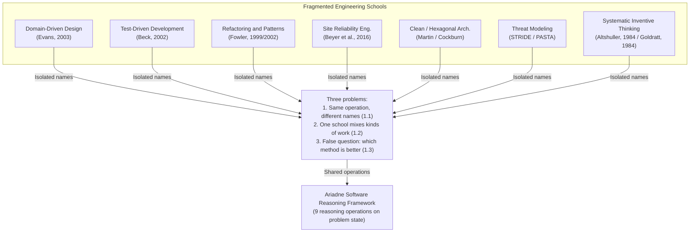

Each school explains one part of the software lifecycle well. No school gives a universal algorithm for every engineering problem. Isolation of the schools hides the structural, physical, and mathematical operations that govern software change.

Frederick P. Brooks Jr. states this in [*The Mythical Man-Month* (1975)](https://en.wikipedia.org/wiki/The_Mythical_Man-Month) and [*No Silver Bullet: Essence and Accidents of Software Engineering* (1986)](https://ieeexplore.ieee.org/document/1663532). The hard part of software is *essential complexity*: the mesh of data structures, state relationships, dynamic invariants, algorithms, and domain rules that the system must construct. *Accidental complexity* comes from tools, languages, processes, and conceptual representations.

When schools invent different names and isolated dogmas for the same cognitive transformation, they add accidental complexity. Melvin Conway states this in [*How Do Committees Invent?* (1968)](https://www.melconway.com/Home/Committees_Paper.html): system architectures copy the communication structures of the organizations that design them. When architects, backend developers, reliability engineers, quality specialists, and security analysts use dialects that do not map to each other, the software becomes fragmented and brittle. The software also gains extra translation layers.

Software engineering needs one shared foundation. That foundation is an **epistemic ontology**. The ontology models engineering work as a sequence of **reasoning operations** on an evolving **problem state**. The ontology does not model engineering work as ritual adherence to one school.

Under this model, progress is the reduction of **engineering uncertainty**. You reduce uncertainty when you:

- generate falsifiable **causal hypotheses**
- find root **contradictions**
- synthesize **candidate mechanisms**
- collect empirical **evidence results**

The split of methods produces three problems:

1. **Same operation, different names (Section 1.1):** Schools give different names to the same structural or epistemic operation. The shared concept becomes hard to see.
2. **One school mixes kinds of work (Section 1.2):** One school packs framing, structural decomposition, dynamic modeling, and empirical verification into one ritual package.
3. **False question: which methodology is better (Section 1.3):** Teams argue about method rank. They do not diagnose the missing evidence or the missing cognitive deliverable that would advance the problem state.

------------------------------------------------------------------------

### 1.1.2. The Same Operation Receives Different Names

#### 1.1.2.1. Software physics and shared operations

Software is bound by the same computational limits in every paradigm. The paradigm can be a high-throughput message topology, a bare-metal kernel, a reactive user interface, or a secure enclave. The limits do not change:

- **Information flow and latency:** Data moves at finite speed across memory buses, CPU caches, and networks.
- **State ownership and mutation:** State transitions, concurrent writes, and consistency guarantees have mathematical limits.
- **Failure domains and blast radius:** Faults propagate across process boundaries and network boundaries.
- **Resource contention:** Queuing, scheduling, and throughput have limits under finite memory, compute, and I/O.

These physical and mathematical constraints are universal. The operations that an engineer can use to resolve design conflicts are also finite and universal.

Genrich Altshuller found the same pattern in classical engineering. He analyzed hundreds of thousands of patents and formulated TRIZ ([*Creativity as an Exact Science*, 1984](https://en.wikipedia.org/wiki/TRIZ)). Different technical challenges in mechanical, chemical, and electrical work were solved again and again by a small set of inventive principles. Examples are *Segmentation*, *Extraction*, *Prior Action*, and *Inversion*.

In software engineering, David L. Parnas set the base for modular reasoning in [*On the Criteria To Be Used in Decomposing Systems into Modules* (1972)](https://dl.acm.org/doi/10.1145/361598.361623). True modularity does not come from splitting a system by flowchart steps or execution phases. True modularity comes from *information hiding*: put volatile design decisions and change-prone mechanisms behind stable interfaces.

After Parnas, each new engineering school gave these transformations a new name. Different names create friction. Different names block knowledge transfer across disciplines. Different names also stop AI agents from seeing that techniques from different domains are the same operation.

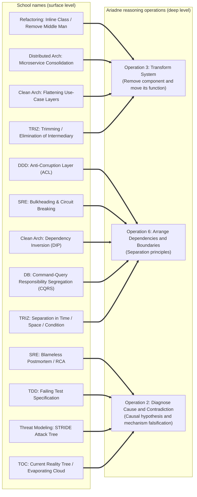

#### 1.1.2.2. How schools name the same operations

The sections below show how major software engineering schools name the same operations.

------------------------------------------------------------------------

#### 1.1.2.3. Remove a component and move its function (Operation 3: Transform)

The operation is: **find a component that adds overhead, latency, or maintenance cost; remove that component; move its useful function to a surviving component, the data owner, or the environment**.

- **Refactoring** ([Martin Fowler, 1999](https://martinfowler.com/books/refactoring.html)): Names include *Inline Class*, *Inline Method*, *Collapse Hierarchy*, and *Remove Middle Man*. Fowler describes *Remove Middle Man* as the inverse of *Hide Delegate*. When an intermediary only passes calls through, the client talks directly to the underlying server. The extra indirection is gone.
- **Enterprise and distributed systems architecture** ([Martin Fowler, 2002](https://martinfowler.com/books/eaa.html)): Names include *Service Consolidation*, *Monolith Extraction Reversal*, and *Direct Storage Delegation*. An intermediary proxy microservice only relays calls from an API gateway to a document store. You remove the proxy. The API gateway or the database client takes the responsibility, with parameterized query templates.
- **Clean Architecture and Hexagonal Architecture:** Names include *Flattening the Use-Case Layer* and *Collapsing Anemic Controllers*. You remove redundant Data Transfer Object (DTO) mappers and one-line interactors that only forward repository calls.
- **TRIZ / Systematic Inventive Thinking** ([Altshuller, 1984](https://en.wikipedia.org/wiki/TRIZ)): The name is *Trimming (Ideal Final Result)*. You remove an element. You move its useful functions to remaining elements or to existing external resources. The system moves closer to ideality ($I = \frac{\sum \text{Useful Functions}}{\sum \text{Costs} + \sum \text{Harm}}$).

##### 1.1.2.3.1. Concrete Architectural Example: Telemetry Ingestion Pipeline

Consider an enterprise telemetry platform where an intermediate streaming buffer service (`TelemetryEnricher`) sits between an edge gateway and an append-only analytical database:

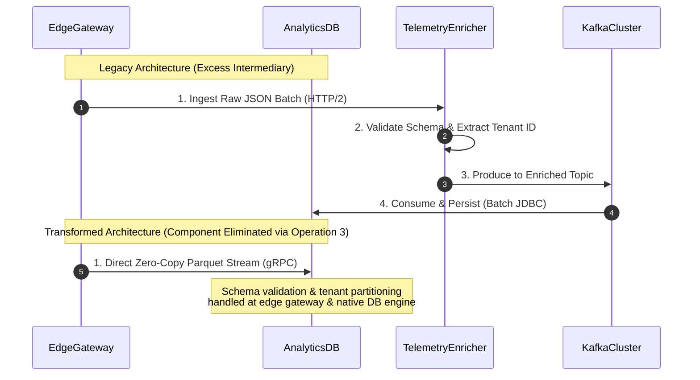

``` typescript
type TelemetryPayload = { meta: { tenant_id: string } };

interface SchemaRegistry {
  validate(payload: unknown): TelemetryPayload;
}
interface MessageProducer {
  send(topic: string, value: Uint8Array): Promise<void>;
}

class TelemetryEnricherService {
  constructor(private registry: SchemaRegistry, private producer: MessageProducer) {}

  async handlePayload(rawBytes: Uint8Array): Promise<void> {
    const payload = JSON.parse(new TextDecoder().decode(rawBytes));
    const validated = this.registry.validate(payload);
    const tenantId = validated.meta.tenant_id;
    await this.producer.send(
      "telemetry-" + tenantId,
      new TextEncoder().encode(JSON.stringify(validated))
    );
  }
}

class EdgeGatewayIngestHandler {
  constructor(private writer: { appendZeroCopy(record: Uint8Array): Promise<void> }) {}

  async handleStream(reader: { readExact(): Promise<Uint8Array> }): Promise<void> {
    const record = await reader.readExact();
    if (!fastVerifyHeader(record)) throw new Error("Corrupted telemetry frame");
    await this.writer.appendZeroCopy(record);
  }
}

declare function fastVerifyHeader(record: Uint8Array): boolean;
```

In both designs, the transformation removes serialization overhead, network latency, and deployment complexity. Validation moves to the ingress boundary. Partitioning moves to the storage engine.

------------------------------------------------------------------------

#### 1.1.2.4. Separation principles and boundary localization (Operation 6: Dependencies)

The operation is: **decouple two conflicting concerns, execution models, or rates of change by adding explicit physical, logical, or temporal boundaries**.

- **Domain-Driven Design** ([Eric Evans, 2003](https://www.domainlanguage.com/ddd/)): Names include *Bounded Context Isolation*, *Anti-Corruption Layer (ACL)*, and *Domain Events*. Evans states that one unified domain model for a whole enterprise yields an unwieldy, contradictory schema. An ACL translates between different conceptual models at the boundary.
- **Site Reliability Engineering** ([Beyer, Jones, Petoff, & Murphy, 2016](https://sre.google/sre-book/table-of-contents/)): Names include *Bulkheading*, *Circuit Breaking*, *Dead-Letter Isolation*, and *Load Shedding*. SRE adds strict failure isolation zones. An outage in an auxiliary subsystem (recommendation engine) must not exhaust thread pools or memory in the critical transaction path (checkout).
- **Enterprise Application Patterns** ([Fowler, 2002](https://martinfowler.com/books/eaa.html)): Names include *Command-Query Responsibility Segregation (CQRS)* and *Data Mapper*. Reads and writes use different structural pathways. This resolves the contradiction between normalized transactional integrity and denormalized query performance.
- **Clean Architecture and SOLID** (Robert C. Martin, 2017): Names include the *Dependency Inversion Principle (DIP)* and the *Interface Segregation Principle (ISP)*. High-level business rules do not depend on low-level database or I/O mechanisms. Abstract interfaces sit between them.
- **Theory of Constraints** ([Eliyahu M. Goldratt, 1984](https://en.wikipedia.org/wiki/The_Goal_%28novel%29)): The name is *Drum-Buffer-Rope (DBR)*. Finite buffers decouple the rate of upstream work generation from the capacity of the system bottleneck.
- **TRIZ Separation Principles** ([Altshuller, 1984](https://en.wikipedia.org/wiki/TRIZ)):
  1. *Separation in Time:* Assign conflicting properties to different time intervals.
  2. *Separation in Space / State:* Assign conflicting properties to distinct components or partitions.
  3. *Separation upon Condition:* Change behavior from operating context or workload characteristics.
  4. *Separation between Parts and Whole:* The subsystem has property $A$. The macro-system has property $\neg A$.

##### 1.1.2.4.1. Comparative Mapping Table: Separation Across Schools

| Ariadne Separation Principle | Domain-Driven Design (Evans 2003) | Site Reliability Eng. (Beyer et al. 2016) | Architecture Patterns (Fowler 1999/2002) | Clean Architecture | Theory of Constraints (Goldratt 1984) |
|:---|:---|:---|:---|:---|:---|
| **Separation in Time** | Domain Events / Eventual Consistency | Asynchronous worker queues / Scheduled batching | Asynchronous Messaging / Outbox Pattern | Deferred execution / Job pipelines | Drum-Buffer-Rope release schedules |
| **Separation in Space / State** | Bounded Contexts / Subdomains | Bulkheads / Multi-region redundancy | CQRS (Read vs. Write models) | Ports & Adapters (Core vs. Infra) | Dedicated buffer zones |
| **Separation on Condition** | Policy-driven Strategy dispatch | Circuit Breakers / Adaptive Throttling | Feature Flags / Branch by Abstraction | Dynamic Interface Interceptors | Dynamic buffer management (Green/Yellow/Red) |
| **Separation: Parts vs. Whole** | Aggregate Root encapsulating internal Entities | Microservices with independent SLOs | Composite Pattern / Facade | Module-level encapsulation | Bottleneck sub-assembly vs. plant throughput |

------------------------------------------------------------------------

#### 1.1.2.5. Diagnostic investigation and contradiction modeling (Operation 2: Diagnose)

The operation is: **find the structural, logical, or physical mechanism that keeps an undesirable system state, and write a falsifiable causal model**.

- **Site Reliability Engineering** ([Beyer et al., 2016](https://sre.google/sre-book/table-of-contents/)): Names include *Root Cause Analysis (RCA)*, *Blameless Postmortem*, and *Observability-Driven Triangulation*. You trace metric anomalies, distributed traces, and log spans back to a latent defect or an environmental shift.
- **Test-Driven Development** ([Kent Beck, 2002](https://www.informit.com/store/test-driven-development-by-example-9780321146533)): The name is *Writing a Differentiating Failing Test*. You write a minimal, deterministic reproduction script. The script fails if and only if the suspected defect is present.
- **Threat Modeling** (Shostack, 2014; STRIDE / PASTA): Names include *Attack Tree Decomposition* and *Trust Boundary Violation Mapping*. You construct causal hypotheses about how an adversary could exploit system assumptions to violate confidentiality, integrity, or availability invariants.
- **Theory of Constraints** ([Goldratt, 1984](https://en.wikipedia.org/wiki/The_Goal_%28novel%29)): Names include *Current Reality Tree (CRT)* and *Evaporating Cloud (Conflict Resolution Diagram)*. You map Undesirable Effects (UDEs) through cause-and-effect logic branches back to a core organizational or physical conflict.
- **TRIZ** ([Altshuller, 1984](https://en.wikipedia.org/wiki/TRIZ)): The name is *Technical and Physical Contradiction Modeling*. You formulate the problem so that an improvement of parameter $A$ degrades parameter $B$ ($P_1 \uparrow \implies P_2 \downarrow$). The root trade-off becomes visible. You must eliminate the trade-off. You must not only compromise.

------------------------------------------------------------------------

### 1.1.3. A Single School Mixes Different Kinds of Work

#### 1.1.3.1. The hazard of mixed work

Section 1.1 showed how different disciplines split one operation across many names. The inverse problem is equally destructive: **one engineering school packs different kinds of intellectual work and empirical work into one ritual package**.

When a practice bundles problem framing, causal diagnosis, structural transformation, dynamic runtime modeling, value selection, and empirical verification under one label, practitioners cannot see which cognitive transformation they execute at a given moment.

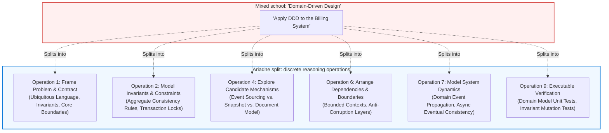

#### 1.1.3.2. Impact on AI agents and human teams

Experienced human engineers partly compensate with tacit knowledge. A senior architect knows when to stop discussing domain boundaries (framing / dependencies) and start measuring database write latencies (knowledge acquisition / empirical evidence).

For an AI coding agent or a junior team, a vague directive such as *"Apply DDD"*, *"Follow TDD"*, or *"Refactor this service using Clean Architecture"* is too ambiguous:

1. **Under-specified deliverables:** The agent cannot tell what artifact is the stop condition. Is the artifact a formal interface specification, a causal map, a benchmark, or an isolated branch?
2. **Premature synthesis:** The agent writes hundreds of lines of boilerplate (Entities, Value Objects, DTOs, Repositories, Use Cases) before it validates the causal hypothesis or the architectural boundary.
3. **Failure isolation fails:** If the implementation fails, the agent cannot tell whether the cause was invalid problem framing, an incorrect dependency boundary, unexpected concurrency under load, or a simple syntactic bug.

------------------------------------------------------------------------

#### 1.1.3.3. Split major method bundles

An actionable framework must split major engineering schools into Ariadne reasoning operations and typed epistemic artifacts.

##### 1.1.3.3.1. Deconstructing Domain-Driven Design (Evans, 2003)

DDD bundles at least six distinct operations spanning organizational strategy, domain modeling, state consistency, and distributed event dynamics:

- **Strategic Design (Bounded Contexts, Ubiquitous Language)**:
  - *Constituent Operations*: **Operation 1 (Framing)** and **Operation 6 (Dependencies)**.
  - *Epistemic Deliverable*: `CLM-` (Domain Claims), Context Maps, and explicit linguistic boundary definitions.
- **Aggregate Design (Transactional Invariants & Consistency Boundaries)**:
  - *Constituent Operations*: **Operation 2 (Diagnosis & Contradiction)** and **Operation 6 (State Ownership)**.
  - *Epistemic Deliverable*: `CTR-` (Contradiction between transactional atomicity and aggregate size) and Aggregate Root encapsulation contracts.
- **Domain Events & Event-Driven Architecture**:
  - *Constituent Operations*: **Operation 6 (Temporal Decoupling)** and **Operation 7 (System Dynamics)**.
  - *Epistemic Deliverable*: Event schemas, ordering guarantees, outbox delivery models, and idempotency keys.
- **Repository & Factory Patterns (Infrastructure Isolation)**:
  - *Constituent Operations*: **Operation 6 (Dependency Inversion)**.
  - *Epistemic Deliverable*: Interface contracts separating domain aggregates from persistence mechanisms.

##### 1.1.3.3.2. Deconstructing Test-Driven Development (Beck, 2002)

The classical "Red-Green-Refactor" cycle bundles contract specification, minimal hypothesis generation, structural refactoring, and regression safety:

- **Phase 1: "Write a Failing Test" (Red)**:
  - *Constituent Operations*: **Operation 1 (Framing)** and **Operation 5 (Evidence Request)**.
  - *Epistemic Deliverable*: `EVDREQ-` (Executable behavioral specification that fails against current actual behavior).
- **Phase 2: "Make the Test Pass" (Green)**:
  - *Constituent Operations*: **Operation 4 (Explore Candidate Mechanisms)**.
  - *Epistemic Deliverable*: `CAN-` (Minimal implementation mechanism that satisfies the behavioral contract).
- **Phase 3: "Refactor"**:
  - *Constituent Operations*: **Operation 3 (Transform System)** and **Operation 6 (Arrange Dependencies)**.
  - *Epistemic Deliverable*: Elimination of duplicate logic, encapsulation of volatiles, guarded continuously by **Operation 9 (Executable Verification)**.

##### 1.1.3.3.3. Deconstructing Site Reliability Engineering (Beyer et al., 2016)

SRE bundles operational goal setting, distributed observability, dynamic capacity management, and post-incident learning:

- **SLO and Error Budget Definition**:
  - *Constituent Operations*: **Operation 1 (Framing)** and **Operation 8 (Value Determination)**.
  - *Epistemic Deliverable*: Quantifiable reliability bounds balancing feature velocity against outage risk.
- **Distributed Tracing & Telemetry Design**:
  - *Constituent Operations*: **Operation 5 (Knowledge Expansion)**.
  - *Epistemic Deliverable*: `MEASURED` provenance data, structured log spans, and metric distributions.
- **Load Shedding, Throttling, and Capacity Engineering**:
  - *Constituent Operations*: **Operation 7 (Understand System Dynamics & Load)**.
  - *Epistemic Deliverable*: Queue-length models, backpressure policies, and concurrency limit controllers.
- **Incident Retrospectives and Blameless Postmortems**:
  - *Constituent Operations*: **Operation 2 (Find Cause & Contradiction)** and **Operation 9 (Transition)**.
  - *Epistemic Deliverable*: `HYP-` (Causal hypotheses explaining systemic vulnerabilities) and preventative architectural remediation plans.

------------------------------------------------------------------------

#### 1.1.3.4. Comprehensive Matrix: Deconstruction of Engineering Schools

The following matrix formally decomposes major software engineering traditions into their underlying Ariadne Reasoning Operations and identifies the specific failure risk when the work is conflated.

| Engineering Tradition | Bundled Activity / Ritual | Underlying Ariadne Reasoning Operation | Primary Epistemic Node Type | Failure Risk if Conflated |
|:---|:---|:---|:---|:---|
| **Domain-Driven Design** | Ubiquitous Language & Bounded Contexts | **Op 1 (Frame)** & **Op 6 (Dependencies)** | `CLM-` (Claim), `ASM-` (Assumption) | Premature database schema design without clear semantic boundaries |
|  | Aggregate Root Invariant Definition | **Op 2 (Contradiction)** & **Op 6 (Boundaries)** | `CTR-` (Contradiction), `CAN-` (Candidate) | Giant, multi-entity aggregates causing severe lock contention |
|  | Domain Event Propagation | **Op 6 (Temporal Decouple)** & **Op 7 (Dynamics)** | `CAN-` (Candidate), `TRANS-` (Transition) | Uncontrolled eventual consistency bugs and out-of-order event processing |
| **Test-Driven Development** | Writing failing test | **Op 1 (Frame)** & **Op 5 (Knowledge/Evidence)** | `EVDREQ-` (Evidence Request) | Testing implementation details instead of observable behavioral invariants |
|  | Minimal code synthesis | **Op 4 (Explore Candidates)** | `CAN-` (Candidate Mechanism) | Hardcoding naive branches that fail under real-world domain complexity |
|  | Refactoring pass | **Op 3 (Transform)** & **Op 6 (Dependencies)** | `EVD-` (Evidence Result), `DEC-` (Decision) | Structural churn without clear decoupling or performance objectives |
| **Site Reliability Eng.** | SLI/SLO & Error Budgets | **Op 1 (Frame)** & **Op 8 (Value Selection)** | `CLM-` (Claim), `DEC-` (Decision) | Treating arbitrary 99.99% targets as physical laws without economic trade-offs |
|  | Telemetry & Profiling | **Op 5 (Knowledge Expansion)** | `MEASURED` (Empirical Fact), `EVD-` | Drowning in unindexed metric noise without a falsifiable hypothesis |
|  | Autoscaling & Backpressure | **Op 7 (System Dynamics)** | `CAN-` (Candidate), `HYP-` (Causal Model) | Resonance oscillations and thundering herd cascades during traffic spikes |
| **Refactoring** | Code Smell Detection | **Op 2 (Diagnose)** & **Op 6 (Dependencies)** | `HYP-` (Causal Hypothesis) | Cosmetic code aesthetics prioritized over architectural decoupling |
|  | Applying Transformations | **Op 3 (Transform)** & **Op 9 (Verify)** | `EVD-` (Evidence Result) | Breaking runtime behavioral invariants while preserving static unit tests |
| **Threat Modeling** | STRIDE / PASTA Analysis | **Op 2 (Diagnose)** & **Op 4 (Explore Adversarial)** | `HYP-` (Causal Vulnerability) | Theoretical threat enumeration disconnected from real network blast radiuses |

------------------------------------------------------------------------

### 1.1.4. The False Question "Which Methodology is Better?"

#### 1.1.4.1. The false rank of methods

Software engineering history repeats the same debates:

- *"Monoliths vs. Microservices"*
- *"Test-Driven Development vs. Test-After Verification"*
- *"Strict DDD Aggregate Encapsulation vs. Pragmatic Transaction Script / Anemic Models"*
- *"Synchronous gRPC / REST vs. Asynchronous Event-Driven Messaging"*
- *"Strong ACID Relational Databases vs. Distributed NoSQL / Eventual Consistency"*
- *"Formal Mathematical Verification (TLA+, Coq) vs. Empirical Chaos Engineering"*

These debates are **category errors**. They treat contextual candidate mechanisms, structural topologies, or verification techniques as universal virtues.

In [*No Silver Bullet* (1986)](https://ieeexplore.ieee.org/document/1663532), Brooks showed that no single technological or methodological breakthrough can promise an order-of-magnitude gain in productivity or reliability. No single methodology addresses the entire essence of software.

Eliyahu M. Goldratt showed the same pattern in the Theory of Constraints ([*The Goal*, 1984](https://en.wikipedia.org/wiki/The_Goal_%28novel%29)). An improvement to any component other than the active constraint is an illusion. The improvement creates local optimization. Global throughput does not rise. Work-in-progress and administrative overhead rise.

An elaborate methodology applied where uncertainty does not currently sit is waste:

- Heavy **Domain-Driven Design aggregate modeling** on a high-throughput, compute-bound video encoding pipeline adds object-allocation overhead and transactional locking. The core algorithmic constraint does not move.
- Strict **Test-Driven Development** on an exploratory machine learning pipeline, where the mathematical model and the data distribution are unknown, forces brittle tests for throwaway prototypes.
- **Microservice decomposition** on an early-stage product with rapid requirement churn creates network coupling, serialization overhead, and cross-service transaction failures. The split also violates Conway's Law.

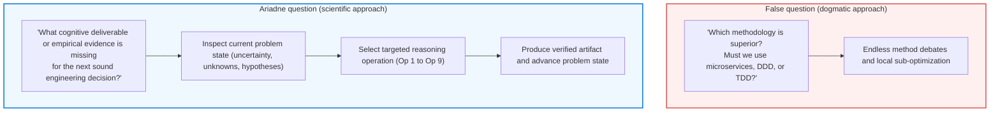

#### 1.1.4.2. Direct operations at problem state

Do not ask *"Which methodology is better?"* Ask this:

> **What cognitive deliverable, structural transformation, or empirical evidence is missing for the next sound, falsifiable engineering decision?**

Under Ariadne, an engineering system at any time has a **problem state**. The problem state is a typed, directed graph. The graph contains:

- **Facts (`FACT`):** Directly observed, immutable properties of the codebase or runtime environment.
- **Measured properties (`MEASURED`):** Quantitative empirical data (for example, p99 latency = 42ms, heap allocation rate = 1.2 GB/sec).
- **Derived claims (`DERIVED`):** Formal logical or mathematical consequences of facts and proven claims.
- **Assumptions (`ASM-`):** Working premises that you treat as true, but that lack empirical proof.
- **Causal hypotheses (`HYP-`):** Testable propositions that explain why a defect, bottleneck, or behavioral anomaly occurs.
- **Contradictions (`CTR-`):** Formal trade-offs where an improvement of parameter $P_1$ degrades parameter $P_2$.
- **Decision-significant unknowns (`UNK-`):** Missing information or unverified metrics. Resolution can invalidate an architectural candidate or select between mutually exclusive mechanisms.
- **Candidate mechanisms (`CAN-`):** Structurally distinct solution variants that can satisfy required invariants.
- **Evidence requests (`EVDREQ-`):** Concrete specifications of benchmarks, unit tests, mutation tests, or proof scripts required to validate a claim.
- **Evidence results (`EVD-`):** The empirical outcome of an evidence request.
- **Decisions (`DEC-`):** Formally locked architectural choices backed by evidence.
- **Transition plans (`TRANS-`):** Temporary architectural mechanisms (dual-writing, feature flags, CDC pipelines) that make migration from current state to target state safe.

#### 1.1.4.3. Falsification and transitive invalidation

A core rule of Ariadne is **transitive invalidation**. In software design, decisions often rest on trees of implicit assumptions:

$$\text{Decision } D_1 \implies \text{Candidate } C_1 \implies \text{Hypothesis } H_1 \implies \text{Assumption } A_1$$

In dogmatic engineering, when production falsifies assumption $A_1$ (for example, network latency between availability zones is 15 ms, not 1 ms), teams often patch decision $D_1$ with local hacks. The patches add accidental complexity.

In the Ariadne graph, when an evidence result (`EVD-`) **falsifies** an assumption (`ASM-`) or a causal hypothesis (`HYP-`), **transitive invalidation** moves downstream:

- All dependent candidate mechanisms (`CAN-`) are marked invalid.
- All dependent decisions (`DEC-`) are unlocked and returned to the problem state.
- The system requires a new reasoning operation to resolve the new **engineering uncertainty**.

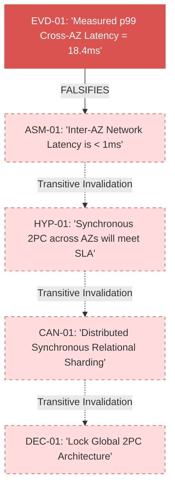

------------------------------------------------------------------------

#### 1.1.4.4. Problem-state to operation routing

Do not choose a methodology first. Inspect the current problem state. Then select the matching reasoning operation:

| Dominant uncertainty | Missing deliverable | Required operation | Output artifact |
|:---|:---|:---|:---|
| **Requirements and invariants:** Stakeholders propose solutions, not observable behavior deltas. Success criteria are ambiguous. | Technology-neutral behavioral contract and immutable system invariants. | **Operation 1: Frame and Model Problem** | **Problem Framing Map** (`CLM-`, invariant spec) |
| **Root cause or core trade-off:** A defect or performance drop is observed, or an improvement of performance degrades consistency. | Falsifiable causal model or formal contradiction statement. | **Operation 2: Find Cause or Contradiction** | **Causal Map / Contradiction Statement** (`HYP-`, `CTR-`) |
| **Structural bloat:** The system has redundant layers, intermediary services, pass-through DTOs, or obsolete dependencies. | Simpler structural model with useful functions moved to surviving parts. | **Operation 3: Transform System** | **Transformation Model** (`CAN-`, component elimination plan) |
| **Tunnel vision:** The team considers only minor variants of one technology (five ways to configure Kafka). | Structurally distinct solution classes across independent architectural dimensions. | **Operation 4: Explore Solution Space** | **Morphological Solution Space Map** (`CAN-01` .. `CAN-0N`) |
| **Decision-significant unknowns:** The architectural choice depends on unverified third-party latency, throughput limits, or data distribution. | Empirical quantitative data and falsification tests. | **Operation 5: Expand Knowledge and Evidence** | **Evidence Result** (`EVD-`, benchmark, spike verdict) |
| **Blast radius and coupling:** A small feature change requires edits in 15 modules. Independent requirements are coupled. | Decoupled dependency graph organized around reasons for change. | **Operation 6: Arrange Dependencies** | **Dependency Matrix and Boundary Map** (`DEC-`, interface contracts) |
| **Time and concurrency fragility:** Behavior under long execution, queuing, bursts, memory leaks, or network partitions is unknown. | Dynamic state model of feedback loops, queues, and degradation modes. | **Operation 7: Understand System Dynamics** | **System Dynamics Model** (queue/buffer spec, load curve) |
| **Conflicting quality attributes:** Several viable candidate mechanisms compete on cost, latency, complexity, and security. | Formal trade-off evaluation against explicit non-negotiable criteria. | **Operation 8: Determine Value and Select** | **Architectural Decision Record** (`DEC-`, value matrix) |
| **Transition and regression risk:** A change to a live production system can cause data loss or downtime. | Executable verification harness, dual-write shadow mechanism, and rollback path. | **Operation 9: Verify and Safely Transition** | **Transition and Verification Plan** (`TRANS-`, shadow run log) |

------------------------------------------------------------------------

### 1.1.5. Case study: a distributed ledger contradiction

This case shows the difference between method wars and systematic reasoning. The system is a high-throughput distributed financial ledger.

#### 1.1.5.1. The problem and the method war

An enterprise financial application must process high-velocity payment settlements. Under high load, user accounts receive concurrent settlement updates.

- **The DDD group** argues: *"We must model the Account as an Aggregate Root in a transactional database to guarantee invariant balance consistency. Every deposit and withdrawal must load the Aggregate, validate invariants, and commit within a strict ACID transaction."*
- **The microservices / SRE group** argues: *"Direct database locking will kill throughput. We must make everything asynchronous using Kafka event streams, eventual consistency, and sagas with compensating transactions."*
- **The performance / NoSQL group** argues: *"Relational databases cannot scale. We must use an in-memory Redis cluster with Lua scripts or a distributed key-value store with optimistic locking."*

The debate is deadlocked. Each group advocates a **candidate mechanism** (`CAN-`) as if it were a universal philosophy. No group models the underlying **contradiction**. No group resolves **decision-significant unknowns**.

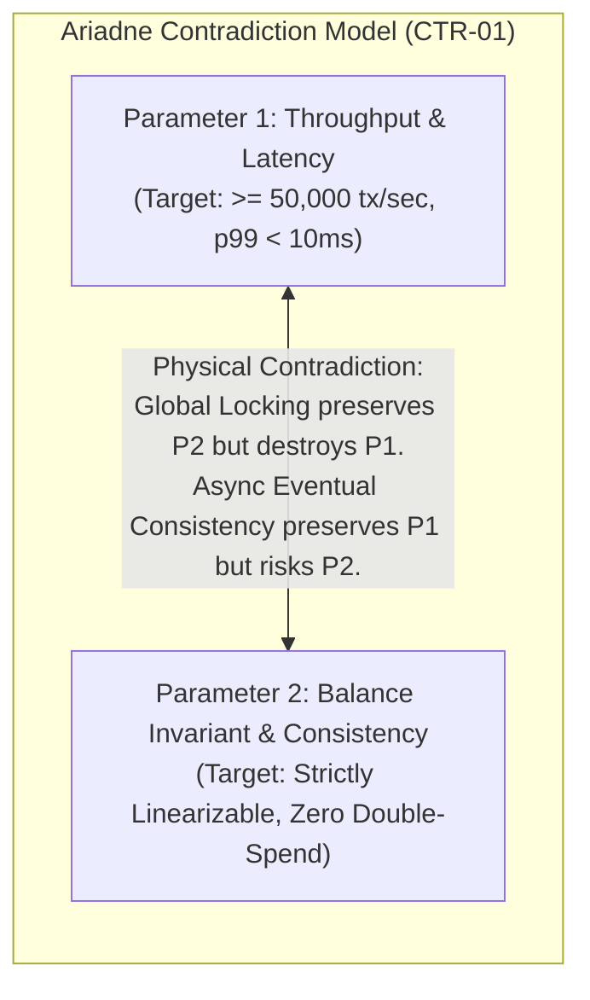

#### 1.1.5.2. Ariadne resolution

The nine operations resolve the contradiction without a compromise:

##### 1.1.5.2.1. Step 1: Operation 1 (Frame problem and contract)

- **Required observable behavior:** The system must process authorized settlements. No account balance may drop below zero ($Balance \ge 0$ at all times).
- **System boundary:** Account Settlement Ingress $\to$ Account Ledger State.
- **Non-negotiable invariants:** Linearizable consistency per account; throughput $\ge 50,000 \text{ ops/sec}$; p99 latency $\le 10 \text{ ms}$.

##### 1.1.5.2.2. Step 2: Operation 2 (Find cause and contradiction)

- **Contradiction statement (`CTR-01`):**
  - If you use *global pessimistic locking* across distributed databases, you keep $P_2$ (consistency), but you degrade $P_1$ (throughput) because of lock contention and distributed transaction overhead (2PC).
  - If you use *asynchronous eventual consistency*, you maximize $P_1$ (throughput), but you violate $P_2$ (linearizable invariant). Concurrent overdraft transactions can pass before state reconciles.

##### 1.1.5.2.3. Step 3: Operation 5 (Expand knowledge and decision-significant unknowns)

- **Decision-significant unknown (`UNK-01`):** What is the real-world cross-account contention distribution?
- **Evidence request (`EVDREQ-01`):** Query production historical audit logs. Calculate the probability that simultaneous concurrent transactions hit the *exact same* account ID within a 100 ms window.
- **Evidence result (`EVD-01`):** $99.98\%$ of transactions target mutually independent account IDs. High contention sits in a small fraction ($0.02\%$) of merchant accounts.

##### 1.1.5.2.4. Step 4: Operation 6 and TRIZ separation principles (Arrange dependencies and boundaries)

- TRIZ **Separation in Space / State Partitioning:** Contention exists *within* one account, not *between* different accounts. Global locking is accidental coupling.
- TRIZ **Separation in Time:** Instantaneous balance reservation is separate from long-term immutable ledger persistence.

##### 1.1.5.2.5. Step 5: Operation 4 (Explore candidate mechanisms)

The team synthesizes structurally distinct candidates:

- `CAN-01`: Relational sharding with distributed 2PC (rejected: latency and availability bottleneck).
- `CAN-02`: Single-threaded in-memory actor model with account-ID hash partitioning (virtual actors pin account state to specific CPU cores; zero lock overhead; linearizability per account).
- `CAN-03`: Optimistic concurrency with escrow reservation tokens (split balance into independent reservable buckets).

##### 1.1.5.2.6. Step 6: Operation 9 (Executable verification and transition)

The team implements `CAN-02` (partitioned in-memory actor with asynchronous append-only journaling):

``` typescript
type SettlementCommand = {
  accountId: number;
  amountCents: number;
  transactionId: bigint;
  respond: (result: number | Error) => void;
};

type JournalEntry = {
  transactionId: bigint;
  accountId: number;
  deltaCents: number;
  resultingBalance: number;
};

class AccountActor {
  constructor(
    private accountId: number,
    private balanceCents: number,
    private receiver: AsyncIterable<SettlementCommand>,
    private appendJournal: (entry: JournalEntry) => Promise<void>
  ) {}

  async run(): Promise<void> {
    for await (const command of this.receiver) {
      if (this.balanceCents + command.amountCents < 0) {
        command.respond(new Error("Insufficient funds"));
        continue;
      }
      this.balanceCents += command.amountCents;
      await this.appendJournal({
        transactionId: command.transactionId,
        accountId: this.accountId,
        deltaCents: command.amountCents,
        resultingBalance: this.balanceCents
      });
      command.respond(this.balanceCents);
    }
  }
}
```

##### 1.1.5.2.7. Step 7: Empirical verification (`EVD-02`)

- Benchmark results: Sustained throughput of $140,000 \text{ ops/sec}$ across a 16-core node; p99 latency of $2.1 \text{ ms}$; zero invariant violations under $10\times$ overload mutation fuzzing.
- **Transition plan (`TRANS-01`):** Deploy the actor partition cluster in shadow mode. Mirror production transactions with a CDC stream. Verify ledger hash equivalence for 72 hours. Then shift live traffic.

------------------------------------------------------------------------

### 1.1.6. Conclusion to Section 1

You do not resolve engineering problems by selecting a favored methodology and enforcing its rituals across the whole problem. You resolve them when you:

1. **Strip jargon** so that you can recognize the underlying invariant operation (Section 1.1).
2. **Split method bundles** into discrete, typed transformations with clear stop conditions (Section 1.2).
3. **Navigate the problem state** by matching the dominant uncertainty to the reasoning operation that can eliminate it (Section 1.3).

This clarity is the foundation for the nine operations in the rest of this document.

------------------------------------------------------------------------

## 1.2. From Methods to Operations on Problem State

### 1.2.1. From method rituals to operations on problem state

For decades, software engineering has moved between process lifecycles (Waterfall, RUP) and execution methodologies (Scrum, Extreme Programming, Kanban). These frameworks govern cadence, resource allocation, and team synchronization. They do not describe the *epistemic mechanics* of architectural reasoning. They organize when work happens. They do not organize how an engineer or an AI agent navigates uncertainty, finds contradictions, or converges on a sound computational design.

The unit of analysis must change. Do not analyze *method rituals*. Analyze **formal operations on problem state**.

Herbert A. Simon states this in [*The Sciences of the Artificial* (Simon, 1969/1996)](https://mitpress.mit.edu/9780262691918/the-sciences-of-the-artificial/). Design is not mystical generation of artifacts. Design is a goal-directed search through combinatorial state spaces under bounded rationality. To solve an ill-structured problem, you transform the problem representation until known operators can close the gap from current state to goal state.

In the 1972 ACM Turing Lecture [*The Humble Programmer*](https://dl.acm.org/doi/10.1145/355604.361591), Edsger W. Dijkstra states that human cognitive capacity is strictly bounded (George A. Miller's $7 \pm 2$ span). The primary challenge of software construction is mental complexity. The path to mastery over large-scale software is systematic separation of concerns:

> *"We know that a mental tool of the highest importance is the abstraction; its purpose is to enable us to consider a problem at a high level without being bogged down by its details... We must not forget that our primary purpose is to keep things manageable."* — Edsger W. Dijkstra (1972)

When an engineer or an AI agent designs a distributed backend, diagnoses an intermittent concurrency fault, or refactors a tightly coupled domain model, the object of work is not raw source code. The object of work is the **problem state**.

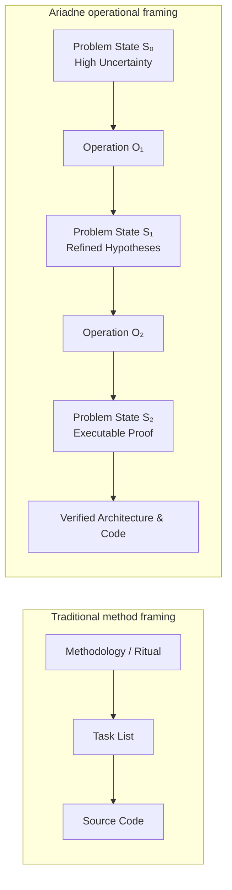

An engineering method is a bundled sequence of operations. When you split methods into primitive cognitive operators and structural operators, apparent conflicts between schools dissolve. TDD versus formal modeling, DDD versus clean architecture, and agile iteration versus upfront design become one set of transformations on the problem model.

------------------------------------------------------------------------

### 1.2.2. Problem state and epistemic overlay

In Ariadne, an engineering problem at time $t$ is a **problem state** tuple $\mathcal{S}_t$:

$$\mathcal{S}_t = \langle \mathcal{B}_t, \mathcal{I}_t, \mathcal{C}_t, \mathcal{M}_t, \mathcal{E}_t \rangle$$

Where:

- **$\mathcal{B}_t$ (Behavioral requirements):** Required observable inputs, events, state transitions, outputs, and performance bounds. Define them in the problem domain, not in implementation machinery ([Jackson, 2001](https://www.pearson.com/en-us/subject-catalog/p/problem-frames-analysing-and-structuring-software-development-problems/P200000003260)).
- **$\mathcal{I}_t$ (System invariants):** Non-negotiable correctness, safety, security, and consistency properties that must hold on all execution paths (linearizability, idempotency, data non-loss, authorization boundaries).
- **$\mathcal{C}_t$ (Contradictions and constraints):** Explicit clashes between mutually exclusive requirements or physical/operational resource limits (low latency $\leftrightarrow$ strict multi-region serializability; high release velocity $\leftrightarrow$ zero-defect regression tolerance) ([Altshuller, 1984](https://en.wikipedia.org/wiki/TRIZ); [Goldratt, 1990](https://www.toc-goldratt.com/en/product/what-is-this-thing-called-theory-of-constraints-and-how-should-it-be-implemented)).
- **$\mathcal{M}_t$ (Candidate mechanisms):** The active pool of candidate computational structures, architectural topologies, algorithms, data models, or protocol bindings.
- **$\mathcal{E}_t$ (Epistemic overlay graph):** The directed acyclic knowledge graph that tracks claims, hypotheses, evidence, assumptions, and validation dependencies:

$$\mathcal{E}_t = \langle \mathcal{V}_E, \mathcal{R}_E \rangle$$

#### 1.2.2.1. Node types ($\mathcal{V}_E$)

Every node $v \in \mathcal{V}_E$ has a typed identifier and a provenance label:

1. **`CLM-` (Claim):** A factual or derived proposition about system behavior, requirements, or architecture.
2. **`ASM-` (Assumption):** An unverified working premise, accepted temporarily so that reasoning can continue.
3. **`HYP-` (Causal hypothesis):** A testable, falsifiable proposition that explains the mechanism behind a defect, regression, or dynamic anomaly.
4. **`CTR-` (Contradiction):** A formal parameter or requirement conflict where an improvement of parameter $P_1$ impairs parameter $P_2$.
5. **`UNK-` (Decision-significant unknown):** Missing empirical information. Resolution can change candidate selection or invalidate an architectural path.
6. **`CAN-` (Candidate mechanism):** A structurally distinct solution variant that implements a required function.
7. **`EVDREQ-` (Evidence request):** A concrete specification of an automated test, benchmark, trace capture, or formal proof required to verify or falsify a claim.
8. **`EVD-` (Evidence result):** The empirical output or test verdict from an `EVDREQ-`.
9. **`TRANS-` (Transition plan):** The temporary architecture (dual-writing, feature flags, shims, data migrations) required to move safely from current state to target state.
10. **`DEC-` (Locked decision / ADR):** An immutable architectural choice grounded in verified evidence.

#### 1.2.2.2. Provenance types

Every node $v \in \mathcal{V}_E$ has a provenance type $\tau(v)$:

$$\tau(v) \in \{\text{FACT}, \text{MEASURED}, \text{DERIVED}, \text{ASSUMED}, \text{PROPOSED}, \text{UNKNOWN}, \text{DECIDED}\}$$

- $\text{FACT}$: Directly observed in the codebase or production runtime (for example, "PostgreSQL 15 is used", "column `user_id` is indexed").
- $\text{MEASURED}$: Quantitatively measured through automated instrumentation (for example, "p99 query latency is 420 ms under 1,000 QPS").
- $\text{DERIVED}$: Formally deduced from verified facts and proven lemmas.
- $\text{ASSUMED}$: Speculative working premise. It carries risk. It requires downstream validation.
- $\text{PROPOSED}$: A synthesized candidate mechanism or architectural transformation.
- $\text{UNKNOWN}$: Explicitly acknowledged missing information.
- $\text{DECIDED}$: Locked by a human architect, or verified through empirical falsification.

#### 1.2.2.3. Relations ($\mathcal{R}_E$)

Edges in the epistemic graph define semantic dependencies:

$$\mathcal{R}_E \subseteq \mathcal{V}_E \times {\text{supports}, \text{contradicts}, \text{depends_on}, \text{falsifies}, \text{invalidates}} \times \mathcal{V}_E$$

- $u \xrightarrow{\text{supports}} v$: Evidence or derivation $u$ increases the empirical justification of $v$.
- $u \xrightarrow{\text{contradicts}} v$: Proposition $u$ is logically or physically incompatible with $v$.
- $u \xrightarrow{\text{depends_on}} v$: The validity of $u$ requires the ongoing validity of premise $v$.
- $u \xrightarrow{\text{falsifies}} v$: Empirical evidence result $u$ decisively disproves hypothesis or assumption $v$.
- $u \xrightarrow{\text{invalidates}} v$: Invalidation of node $u$ triggers automatic downstream invalidation of candidate or decision $v$.

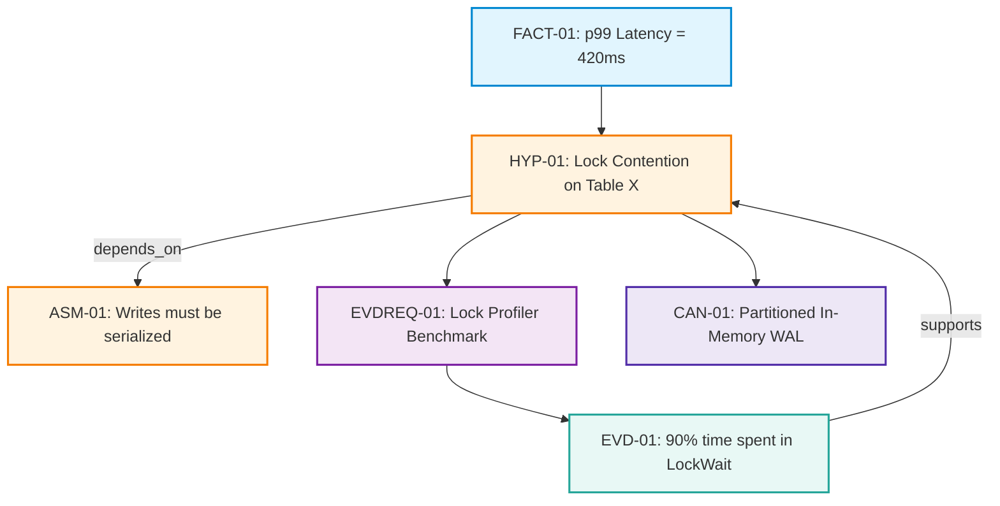

------------------------------------------------------------------------

### 1.2.3. Input-action-output model

An **operation** $\mathcal{O}_k$ is a deterministic cognitive and structural transformer. It maps an input problem state $\mathcal{S}_{\text{in}}$ to a refined output problem state $\mathcal{S}_{\text{out}}$:

$$\mathcal{O}_k: \mathcal{S}_{\text{in}} \xrightarrow{\mathcal{A}_k} \mathcal{S}_{\text{out}}$$

Every operation has three components:

1. **Input ($\mathcal{S}_{\text{in}}$):** The precondition predicate $\text{Pre}(\mathcal{O}_k, \mathcal{S})$. It names the active epistemic frontier, observed symptoms, unresolved uncertainties, or unrefined candidate mechanisms.
2. **Action ($\mathcal{A}_k$):** The cognitive or structural transformation applied to the problem model (functional decomposition, causal abduction, morphological synthesis, dependency inversion, system dynamics simulation).
3. **Output ($\mathcal{S}_{\text{out}}$):** The postcondition invariant $\text{Post}(\mathcal{O}_k, \mathcal{S}_{\text{out}})$. It requires verifiable, typed working artifacts and a reduction of epistemic entropy.

<!-- -->

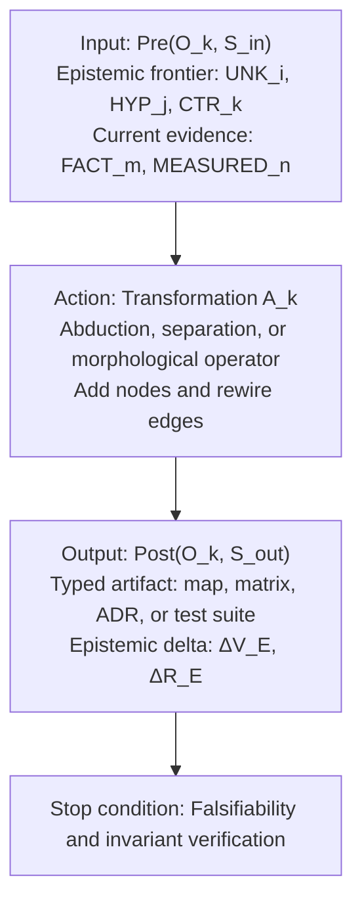

#### 1.2.3.1. Evidence is monotonic. Belief is not.

In software reasoning, empirical evidence accumulation is strictly monotonic. After a benchmark executes and logs a measurement, that historical trace $\text{EVD-} k$ remains an immutable empirical fact.

Architectural beliefs and hypotheses are **non-monotonic**. A new evidence node $\text{EVD-}k$ may falsify a foundational assumption $\text{ASM-}01$. Ariadne then applies **transitive invalidation**:

$$\forall v \in \mathcal{V}_E, \quad \left( \exists u \in \mathcal{V}_E : \tau(u) = \text{FALSIFIED} \land v \in \text{Reach}_{\text{depends_on}}(u) \right) \implies \text{Status}(v) \leftarrow \text{INVALIDATED}$$

Downstream candidate mechanisms (`CAN-`) or design decisions (`DEC-`) that rest on falsified premises are marked invalid. Ungrounded execution stops. Cognitive debt does not compound.

------------------------------------------------------------------------

### 1.2.4. Humans vs AI agents

Software engineering reasoning is done by human engineers or by LLM agents. Both have characteristic failure modes on complex software systems:

| Cognitive dimension | Human architect failure | AI agent failure | Ariadne remedy |
|----|----|----|----|
| **Solution anchoring** | Fixates on familiar tools ("Let's use Kafka") from availability bias ([Simon, 1969](https://mitpress.mit.edu/9780262691918/the-sciences-of-the-artificial/)). | Completes popular pattern tokens (boilerplate microservices) regardless of context. | **Op 1 (Frame):** Separate behavioral requirements from implementation mechanisms. |
| **Symptom patching** | Treats error logs as direct causes. Applies ad-hoc patches to suppress alerts. | Generates local code edits that pass superficial unit tests while they violate deep architectural invariants. | **Op 2 (Diagnose):** Require an explicit causal graph and differentiating falsification tests. |
| **Search space collapse** | Generates 3 minor variants of the same stack (Postgres vs. MySQL vs. MariaDB). | Hallucinates one "standard" solution and defends it with invented justifications. | **Op 4 (Explore):** Require morphological analysis across independent architectural dimensions. |
| **Unverified assumptions** | Treats vendor documentation or organizational folklore as established physics. | Asserts false API contracts, missing library features, or non-existent performance guarantees with confidence. | **Op 5 (Knowledge):** Classify unproven claims as `ASM-` or `UNK-`. Require minimal empirical spikes (`EVDREQ-`). |
| **Hidden dynamic coupling** | Reasons only about static class diagrams. Ignores queues, backpressure, and retry storms. | Cannot simulate temporal accumulation, queueing limits (Little's Law), or metastable states. | **Op 7 (Dynamics):** Require stock-and-flow modeling, queue capacity analysis, and failure-mode simulation. |
| **Premature decision lock** | Sunk-cost fallacy. Keeps a flawed design because days were spent coding it. | Drifts in long context windows. Forgets original invariants. Compounds early errors. | **Op 8 and 9 (Select and Verify):** Require formal ADRs, transitive invalidation, and executable verification suites. |

Formal problem state plus preconditions and postconditions for each operation turns software development from an intuitive art or stochastic token generation into a disciplined, verifiable practice.

------------------------------------------------------------------------

## 1.3. The Nine Operations

The nine operations are not arbitrary steps in a linear pipeline. They are an orthogonal, complete basis of cognitive transformations. They explore, diagnose, restructure, and validate software systems.

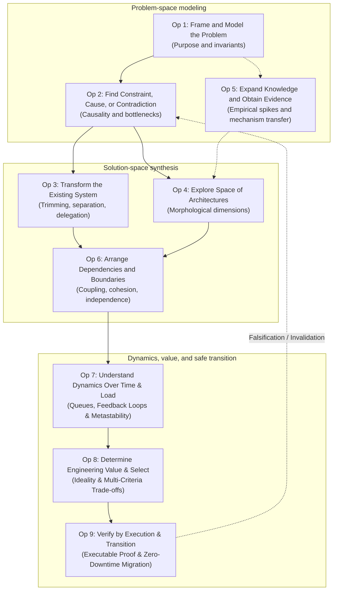

The sections below analyze each of the nine operations.

------------------------------------------------------------------------

### 1.3.1. Operation 1: Frame and Model the Software Problem

#### 1.3.1.1. Principle

> **"Separate the problem domain from the implementation machine."**

In [*Problem Frames: Analysing and Structuring Software Development Problems* (Jackson, 2001)](https://www.pearson.com/en-us/subject-catalog/p/problem-frames-analysing-and-structuring-software-development-problems/P200000003260), Michael Jackson states that software development problems sit in the *application domain* (users, physical phenomena, and business invariants). Software solutions sit in the *machine domain* (computers, runtimes, programming languages, and databases). Software engineering fails when domain requirements are expressed as machine mechanisms.

Nam P. Suh's **Axiomatic Design** ([Suh, 1990](https://global.oup.com/academic/product/the-principles-of-design-9780195043457)) maps Functional Requirements (FRs) in the functional domain to Design Parameters (DPs) in the physical domain. Physical choices must not corrupt the functional specification.

#### 1.3.1.2. Purpose

Operation 1 strips premature implementation anchoring ("we need Kafka," "we need a Redis cache," "we must rewrite in Go"). It isolates the observable behavioral delta that the software system must deliver. It sets non-negotiable correctness invariants and system boundaries before architectural capital is spent.

#### 1.3.1.3. Input uncertainty ($\mathcal{U}_1$)

- **Anchoring ambiguity:** Problem statements mix customer needs with technical components.
- **Boundary confusion:** The system boundary is unclear (client vs. API gateway vs. core service vs. database).
- **Implicit invariants:** Unstated business constraints. If they are violated, a technically functioning system is still useless.

#### 1.3.1.4. Action ($\mathcal{A}_1$)

1. **Functional abstraction:** Express the required function as an active verb and a domain object. Strip technical nouns. Transform "Write an Elasticsearch pipeline" into "Deliver full-text search results matching query $Q$ with freshness $\le 2\text{s}$".
2. **Behavioral invariant formulation:** Specify the contract with this template: $$\text{Under Conditions } \mathcal{C}, \text{ when Event } \mathcal{E} \text{ occurs, System delivers Outcome } \mathcal{O} \text{ measured as } \mathcal{M}, \text{ preserving Invariant } \mathcal{I}.$$
3. **Multi-perspective boundary projection:** Project the problem across 7 architectural viewpoints: End User, API Consumer, Data Auditor, Security Adversary, SRE/Operator, Maintainer, and Business Sponsor.

#### 1.3.1.5. Deliverable

A **Problem Framing Map** that contains:

- Structured claim nodes (`CLM-`): Observable behavioral requirements.
- Assumption nodes (`ASM-`): Presumed domain constraints.
- Formal invariant definitions (`INV-`): Explicit mathematical or logical safety properties.
- Success metric specifications: Quantitative bounds (for example, $p99 \le 150\text{ms}$, availability $\ge 99.99\%$).

#### 1.3.1.6. Human vs AI agent

- **For human architects:** Breaks cognitive inertia and confirmation bias. Senior engineers cannot prescribe their favorite tool to every incoming problem.
- **For AI agents:** Prevents "hallucinatory solution hopping." An LLM agent given a feature request typically writes code for a concrete library at once. Operation 1 forces the agent to freeze the behavioral contract and set falsifiable success criteria before it generates code.

------------------------------------------------------------------------

### 1.3.2. Operation 2: Find the Constraint, Cause, or Contradiction

#### 1.3.2.1. Principle

> **"Find the physical mechanism, bottleneck, or contradiction that keeps the undesirable state."**

In [*What is this thing called Theory of Constraints and how should it be implemented?* (Goldratt, 1990)](https://www.toc-goldratt.com/en/product/what-is-this-thing-called-theory-of-constraints-and-how-should-it-be-implemented), Eliyahu M. Goldratt proved that the throughput of any complex system is dictated by a very small number of constraints (often exactly one). Optimizing non-bottlenecks creates a local illusion of progress. Work-in-process (WIP) and operational instability increase.

In [*Creativity as an Exact Science: The Theory of the Solution of Inventive Problems* (Altshuller, 1984)](https://en.wikipedia.org/wiki/TRIZ), Genrich Altshuller showed that breakthrough inventive solutions do not come from compromise or trade-off averaging. They come from formulating and resolving **system contradictions** (improve parameter $A$ without degrading parameter $B$) and **physical contradictions** (an element must have property $P$ to satisfy function 1, and property $\neg P$ to satisfy function 2).

Judea Pearl's [*Causality* (Pearl, 2009)](https://doi.org/10.1017/CBO9780511803161) distinguishes correlational observations from structural causal mechanisms with counterfactual interventions: $P(Y \mid \text{do}(X)) \neq P(Y \mid X)$.

#### 1.3.2.2. Purpose

Operation 2 moves past superficial symptoms ("the API is slow," "the release cycle is 2 weeks," "the database crashes under peak"). It finds the exact causal graph, the limiting bottleneck (Amdahl's Law, Universal Scalability Law), or the underlying contradiction that prevents the system from reaching its goal.

#### 1.3.2.3. Input uncertainty ($\mathcal{U}_2$)

- **Symptom-cause mix:** An alarm or metric spike is treated as the root mechanism.
- **Contradiction camouflage:** An artificial trade-off ("we must sacrifice consistency for performance") is accepted as an immutable physical law.
- **Unexamined working assumptions:** Invisible dogmas ("all database queries must be transactional," "all microservices must communicate through HTTP").

#### 1.3.2.4. Action ($\mathcal{A}_2$)

1.  **Causal Graph Abduction**: Construct a directed acyclic causal chain from observed symptoms to root physical mechanisms, strictly annotating each edge with empirical proof or a differentiating falsification test.
2.  **Bottleneck Isolation**: Apply queueing theory and Amdahl's Law to identify whether the limitation is serialized CPU, memory bandwidth, lock contention, network I/O, storage latency, or organizational approval serialized paths.
3.  **Formal Contradiction Modeling**: Parameterize the conflict into a TRIZ/Ariadne contradiction: $$\text{Requirement } R_1 \implies \text{State } S_1 \implies \text{Improves Metric } M_1 \land \text{Degrades Metric } M_2 \text{ (violating } R_2 \text{)}.$$

<!-- -->

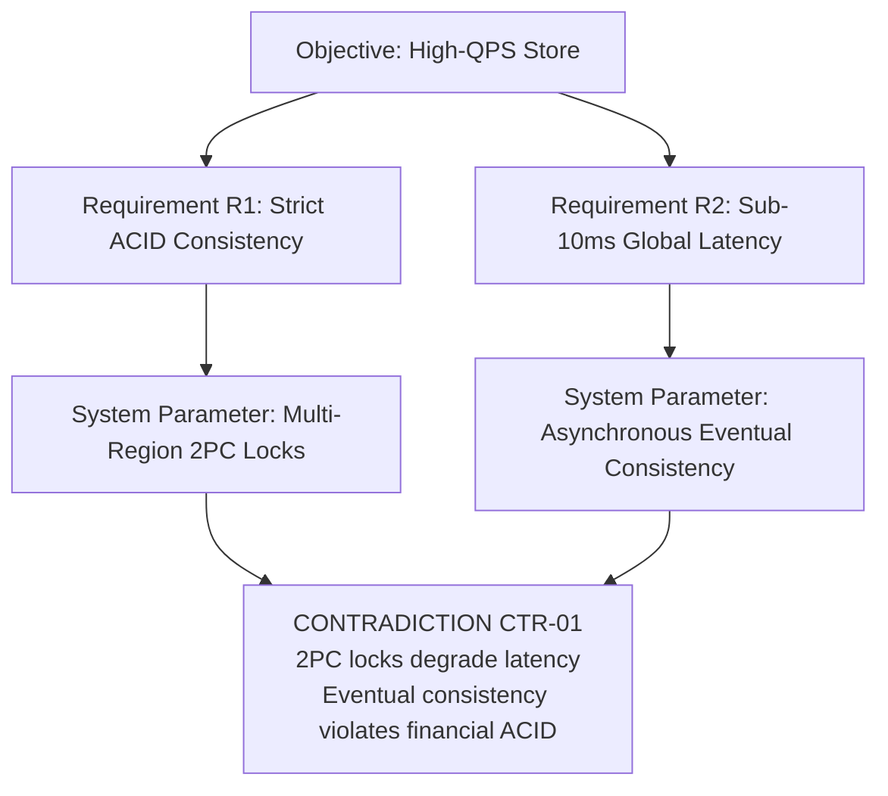

#### 1.3.2.5. Deliverable

A **Map of Causes, Constraints, and Contradictions** containing:

- Causal Hypothesis nodes (`HYP-`): Falsifiable mechanistic explanations.
- Contradiction nodes (`CTR-`): Explicit trade-off definitions.
- Evidence Request nodes (`EVDREQ-`): Differentiating tests designed to disprove competing hypotheses.

#### 1.3.2.6. Human vs AI agent

- **For human architects**: Prevents cargo-culting and superficial blame games (for example, blaming the network or the database driver without profiling).
- **For AI agents**: LLMs are prone to generating plausible-sounding narratives that hallucinate causality. Operation 2 forces the agent to output a formal hypothesis tree with paired empirical verification scripts.

------------------------------------------------------------------------

### 1.3.3. Operation 3: Transform the Existing Software System

#### 1.3.3.1. Principle

> **"Transform system structure purposefully: remove, split, combine, delegate functions, and alter execution mechanics rather than blindly adding new software."**

In TRIZ ([Altshuller, 1984](https://en.wikipedia.org/wiki/TRIZ)), the highest-level inventions are achieved through the **Law of Ideality Increase**, which dictates that an ideal system delivers all required functions with zero weight, zero volume, zero energy, and zero cost—meaning the system *does not exist, but its function is performed*. This is achieved primarily through **Trimming** (eliminating components and reassigning their useful functions to existing resources) and the **Separation Principles** (separating contradictory properties in time, space, state, or structure).

In software architecture, David L. Parnas ([Parnas, 1972](https://dl.acm.org/doi/10.1145/361598.361623)) established that modular decomposition must be guided by information hiding and responsibility allocation rather than mechanical flowcharting.

#### 1.3.3.2. Purpose

Operation 3 evolves an existing system's computational topology to remove bottlenecks and resolve contradictions. It avoids the "Second-System Effect" ([Brooks, 1975](https://en.wikipedia.org/wiki/The_Mythical_Man-Month)): costly, unguided ground-up rewrites.

#### 1.3.3.3. Input uncertainty ($\mathcal{U}_3$)

- **Structural Rigidity**: Belief that the current component topology is fixed.
- **Accidental Complexity**: Bloat caused by intermediary adapters, redundant caching layers, and unnecessary microservice hops.
- **Resource Underutilization**: Failure to use built-in runtime, database, OS, or compiler capabilities.

#### 1.3.3.4. Action ($\mathcal{A}_3$)

Apply the five systematic software transformation operators:

1.  **Trim / Eliminate**: Remove an intermediary layer, microservice, caching tier, DTO mapping, or distributed coordinator. For every trimmed component $C$, explicitly identify the recipient resource $R$ that absorbs its useful function $F(C)$.
2.  **Split / Localize (Separation Principles)**:
    - *Separation in Time*: Batch processing vs. real-time ingest; lazy evaluation vs. eager precomputation.
    - *Separation in Space/State*: Command Query Responsibility Segregation (CQRS); hot memory vs. cold archival storage; single-writer partitioned state.
    - *Separation in Condition/Mode*: Normal execution path vs. degraded fallback mode; transactional path vs. audit log path.
    - *Separation across System Boundaries*: Moving validation to the client edge or offloading invariant checks to the database engine.
3.  **Combine / Co-locate / Delegate**: Delegate custom distributed locking to database unique constraints; delegate scheduling to OS cron/systemd; delegate routing to eBPF/kernel primitives.
4.  **Replace Mechanism**: Shift computational paradigm (for example, synchronous polling $\to$ event-driven push; mutable shared-memory locks $\to$ actor-based message passing; full snapshot copying $\to$ append-only Write-Ahead Log streaming).
5.  **Alter Execution Topology**: Reorder operations, execute speculatively, introduce backpressure, or pipeline sequential stages.

#### 1.3.3.5. Deliverable

A **Transformation Log** containing:

- Candidate Mechanism nodes (`CAN-`): Formally describing the structural mutation.
- Function Absorption Matrix: Mapping trimmed components to the surviving carriers of their functions.
- Invariant Impact Assessment: Proof that the transformation does not violate $\mathcal{I}_t$.

#### 1.3.3.6. Human vs AI agent

- **For human architects:** Replaces "let's rewrite the whole system from scratch" with surgical topological edits.
- **For AI agents**: Prevents the agent from endlessly stacking new dependencies (for example, adding 5 new npm packages or spinning up new containers). Forces the agent to evaluate subtraction and delegation first.

------------------------------------------------------------------------

### 1.3.4. Operation 4: Explore the Space of Architectures and Implementations

#### 1.3.4.1. Principle

> **"Construct an orthogonal morphological space of solution classes to avoid premature convergence on local optima."**

In [*Discovery, Invention, Research Through the Morphological Approach* (Zwicky, 1969)](https://en.wikipedia.org/wiki/Morphological_analysis_%28problem-solving%29), astrophysicist Fritz Zwicky introduced **General Morphological Analysis**—a non-quantified method for structuring and investigating the comprehensive set of relationships contained in multi-dimensional, non-reducible problem complexes.

In software engineering, Nam P. Suh's **Axiomatic Design** ([Suh, 1990](https://global.oup.com/academic/product/the-principles-of-design-9780195043457)) defines the **Independence Axiom (Axiom 1)**: an optimal design must maintain the independence of functional requirements. When exploring the architectural space, dimensions must be orthogonal such that choosing a design parameter along one dimension does not unintentionally constrain or violate another.

#### 1.3.4.2. Purpose

Operation 4 expands the solution frontier across distinct design paradigms. The team must not evaluate only 5 minor variants of one implementation paradigm while it stays blind to better architectural classes.

#### 1.3.4.3. Input uncertainty ($\mathcal{U}_4$)

- **Local Optimum Trap**: Being trapped within a single paradigm (for example, evaluating only relational SQL schemas when the problem is fundamentally graph-traversal or log-structured).
- **Superficial Diversity**: Generating options that differ only by brand name (for example, Kafka vs. RabbitMQ vs. AWS SQS) rather than architectural mechanics (for example, durable append-only log vs. ephemeral broker-tracked queue vs. distributed ring buffer).

#### 1.3.4.4. Action ($\mathcal{A}_4$)

1.  **Identify Orthogonal Architectural Dimensions ($\mathcal{D}_1, \mathcal{D}_2, \dots, \mathcal{D}_k$)**:
    - *State Ownership*: Centralized Shared-Everything $\mid$ Domain-Partitioned $\mid$ Client-Owned $\mid$ Replicated Shared-Nothing.
    - *Consistency Guarantees*: Linearizable (Raft/Paxos) $\mid$ Sequential $\mid$ Causal $\mid$ Eventual (CRDT).
    - *Computation Placement*: Client-Side Edge $\mid$ Gateway/Proxy $\mid$ Core App Server $\mid$ Database Engine $\mid$ Asynchronous Worker.
    - *Execution Timing*: Immediate Synchronous $\mid$ Buffered Asynchronous $\mid$ Lazy On-Demand $\mid$ Scheduled Batch.
    - *Fault Recovery*: Crash-Stop / Fail-Fast $\mid$ Retry with Exponential Jitter $\mid$ Sagas / Compensating Transactions $\mid$ Circuit Breaking with Degraded Fallback.
2.  **Synthesize Morphological Combinations**: Construct representative solution vectors: $$\vec{V}_j = \langle d_{1,a}, d_{2,b}, \dots, d_{k,m} \rangle \in \mathcal{D}_1 \times \mathcal{D}_2 \times \dots \times \mathcal{D}_k$$
3.  **Systematic Invariant Pruning**: Prune combinations that violate hard invariants $\mathcal{I}_t$ or physical feasibility, leaving 3–5 structurally contrasting, viable candidate classes.

<!-- -->

| Dimension | Option A | Option B | Option C |
| --- | --- | --- | --- |
| State model | Single leader DB | Partitioned log | Client CRDT |
| Communication | Synchronous gRPC | Asynchronous events | Shared memory |
| Consistency | Linearizable | Causal | Eventual |

**Selected contrasting candidates**

- **Candidate 1 (traditional):** State model A + communication 1 + consistency X (RDBMS, gRPC, strict serializability).
- **Candidate 2 (event-driven):** State model B + communication 2 + consistency Y (Kafka log, outbox pattern, causal consistency).
- **Candidate 3 (local-first):** State model C + communication 2 + consistency Z (client SQLite, CRDT sync, eventual consistency).

#### 1.3.4.5. Deliverable

A **Solution Space Map** containing:

- Morphological Matrix defining dimensions and values.
- Candidate Mechanism nodes (`CAN-01`, `CAN-02`, `CAN-03`): Representing genuinely distinct architectural classes.
- Pruning Justifications: Explaining why discarded quadrants were eliminated.

#### 1.3.4.6. Human vs AI agent

- **For human architects**: Overcomes team tribalism and vendor hype, forcing explicit consideration of radically different paradigms.
- **For AI agents**: An LLM agent prompted to "propose 3 designs" typically returns three slight rewordings of the most frequent training pattern. Operation 4 enforces orthogonal parameterization, forcing the model to generate diverse, mathematically contrasting architectural archetypes.

------------------------------------------------------------------------

### 1.3.5. Operation 5: Expand Knowledge and Obtain Missing Evidence

#### 1.3.5.1. Principle

> **"Distinguish lack of knowledge from lack of options; resolve decision-significant unknowns through empirical falsification and cross-domain mechanism transfer."**

In [*The Logic of Scientific Discovery* (Popper, 1934/1959)](https://www.routledge.com/The-Logic-of-Scientific-Discovery/Popper/p/book/9780415278447), Karl Popper established that empirical knowledge grows not through inductive confirmation, but through bold conjectures subjected to rigorous, ruthless attempts at **falsification**. A proposition is scientifically and engineeringly meaningful only if it specifies an observational outcome that would decisively refute it.

In systems engineering and decision theory ([Simon, 1969](https://mitpress.mit.edu/9780262691918/the-sciences-of-the-artificial/)), the **Expected Value of Information (EVOI)** dictates that one should only expend resources gathering information if the anticipated result has the power to change an imminent, high-consequence decision.

#### 1.3.5.2. Purpose

Operation 5 prevents two failures: architectural paralysis (endless speculative debate) and reckless blind implementation. It names the critical unknowns that block a sound decision. It then runs the cheapest empirical experiment (spike, benchmark, trace inspection) that can resolve them.

#### 1.3.5.3. Input uncertainty ($\mathcal{U}_5$)

- **Decision-Significant Unknowns**: Missing factual metrics (for example, "Will this database engine support 50,000 range queries/sec on encrypted columns?").
- **Vendor/Documentation Drift**: Discrepancies between official library documentation and actual runtime behavior under stress.
- **Unverified Assumptions Masquerading as Facts**: Untested team beliefs about system performance or platform guarantees.

#### 1.3.5.4. Action ($\mathcal{A}_5$)

1.  **Formulate Decision-Significant Unknowns (`UNK-`)**: Frame questions strictly in terms of decision impact: $$\text{If } \text{Result} = X \implies \text{Select Candidate } A; \quad \text{If } \text{Result} = Y \implies \text{Select Candidate } B.$$
2.  **Cross-Domain Functional Isomorph Transfer**: Search for proven mechanisms in unrelated computational or physical domains that perform the identical abstract function (for example, borrowing log-structured merge trees from filesystems for high-throughput write ingestion; borrowing biological immune response algorithms for distributed anomaly detection).
3.  **Design Minimal Falsification Spikes (`EVDREQ-`)**: Construct minimal, isolated, throwaway test programs designed specifically to stress the boundary condition and falsify the working assumption.
4.  **Execute and Ingest Empirical Evidence (`EVD-`)**: Execute the spike, capture raw metrics/traces, and update the epistemic graph.

#### 1.3.5.5. Deliverable

A **Registry of Unknowns and Empirical Evidence** containing:

- Decision-Significant Unknown nodes (`UNK-`).
- Evidence Request specifications (`EVDREQ-`): Defining the exact script, environment, and falsification criteria.
- Evidence Result nodes (`EVD-`): Recording empirical data, logs, and benchmark verdicts.
- Updated Provenance Labels: Transitioning assumptions from `ASSUMED` to `FACT` or `FALSIFIED`.

#### 1.3.5.6. Human vs AI agent

- **For human architects**: Replaces subjective architectural committee arguments with objective, empirical benchmark data.
- **For AI agents**: AI agents have no internal physical runtime; they operate entirely on text token associations. Operation 5 mandates that whenever an agent encounters an unverified premise, it MUST pause code generation, write an automated test/spike, execute it in the host environment via tools, and ground its next reasoning step in real execution output.

------------------------------------------------------------------------

### 1.3.6. Operation 6: Arrange Dependencies and Change Boundaries

#### 1.3.6.1. Principle

> **"Structure dependencies around reasons for change; minimize the change radius and eliminate accidental coupling between independent requirements."**

In his seminal paper [*On the Criteria To Be Used in Decomposing Systems into Modules* (Parnas, 1972)](https://dl.acm.org/doi/10.1145/361598.361623), David L. Parnas proved that systems must be decomposed not according to the steps of execution, but such that each module encapsulates a secret (a likely-to-change design decision or hardware/data representation) that is hidden from all other modules.

This is formalized in Nam P. Suh's **Axiomatic Design (Independence Axiom)** ([Suh, 1990](https://global.oup.com/academic/product/the-principles-of-design-9780195043457)) and Robert C. Martin's **Single Responsibility Principle (SRP)** and **Dependency Inversion Principle (DIP)** ([Martin, 2017](https://www.informit.com/store/clean-architecture-a-craftsmans-guide-to-software-9780134494166)): an architectural element should have one, and only one, reason to change, and high-level policy must never depend on low-level volatile mechanisms.

#### 1.3.6.2. Purpose

Operation 6 makes independent business requirements evolve, deploy, and test independently. It exposes hidden dependency vectors. A change to requirement $A$ must not force changes across dozens of unrelated modules.

#### 1.3.6.3. Input uncertainty ($\mathcal{U}_6$)

- **Invisible Coupling Vectors**: Coupling that exists outside static code imports—such as shared database tables, shared message schemas, implicit temporal sequencing, shared configuration files, or coordinated deployment requirements.
- **Leaky Abstractions**: High-level business logic contaminated with low-level infrastructure, networking, or persistence concerns.
- **Cascading Change Radius**: High uncertainty regarding the blast radius of modifying a core interface.

#### 1.3.6.4. Action ($\mathcal{A}_6$)

1.  **Full-Spectrum Dependency Mapping**: Map all 7 vectors of coupling across the candidate architecture:
    - *Source/Compile Coupling*: Direct imports, type references.
    - *Binary/Packaging Coupling*: Shared shared-object libraries, bundled artifacts.
    - *Data/Storage Coupling*: Shared database schemas, common tables, dual-written rows.
    - *Protocol/Schema Coupling*: Shared protobuf/JSON contracts, serialization dependencies.
    - *Temporal Coupling*: Requirement for synchronous online availability and lockstep execution.
    - *Deployment/Pipeline Coupling*: Lockstep CI/CD release coordination.
    - *Organizational Coupling*: Conway's Law alignment between team communication and module boundaries.
2.  **Axiomatic Decoupling Transformations**:
    - Apply Dependency Inversion (Ports and Adapters / Hexagonal Architecture).
    - Enforce Single-Writer Data Ownership (no shared database tables across boundaries).
    - Isolate volatile third-party APIs behind Anti-Corruption Layers (ACL).
    - Transform synchronous temporal coupling into asynchronous event notifications.
3.  **Quantify Change Radius**: Calculate the fan-in, fan-out, and Instability Metric ($I = \frac{\text{Fan-Out}}{\text{Fan-In} + \text{Fan-Out}}$) for every boundary.

<!-- -->

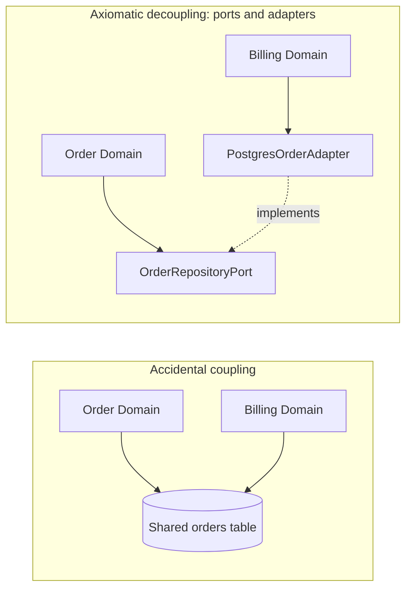

#### 1.3.6.5. Deliverable

A **Dependency Matrix & Change Propagation Map** containing:

- Module Coupling Matrix linking requirements to supporting mechanisms.
- Change Radius Impact Analysis: Documenting expected touched files and tests for core evolutionary scenarios.
- Boundary Invariant Declarations: Formal rules governing cross-boundary communication.

#### 1.3.6.6. Human vs AI agent

- **For human architects**: Exposes the fallacy of "microservices that share a database," showing that physical process separation without data decoupling provides zero real modularity.
- **For AI agents**: LLMs frequently introduce circular dependencies, leaky domain models, or deep transitive imports when attempting to make tests pass. Operation 6 establishes strict architectural linting and boundary validation rules that the agent must respect.

------------------------------------------------------------------------

### 1.3.7. Operation 7: Understand System Behavior Over Time and Under Load

#### 1.3.7.1. Principle

> **"Examine the system across time, under load, and during failures; static structural diagrams are fundamentally insufficient."**

In [*Thinking in Systems: A Primer* (Meadows, 2008)](https://www.chelseagreen.com/product/thinking-in-systems/) and [*Business Dynamics* (Sterman, 2000)](https://www.mheducation.com/highered/product/business-dynamics-systems-thinking-modeling-complex-world-sterman/M9780072389159.html), Donella H. Meadows and John D. Sterman demonstrated that complex systems are governed by non-linear dynamics: **stocks (accumulations), flows (rates of change), feedback loops (positive reinforcing and negative balancing), delays, and non-linear thresholds**.

In software systems, queueing theory and **Little's Law** ($L = \lambda W$) dictate that when arrival rate $\lambda$ approaches service capacity $\mu$, queue depth $L$ and wait time $W$ explode non-linearly towards infinity. Furthermore, distributed systems exhibit **metastable failure modes** ([Huang et al., 2022](https://dl.acm.org/doi/10.1145/3477132.3483541); [Nygard, 2018](https://pragprog.com/titles/mnee2/release-it-second-edition/)), where a transient trigger puts the system into a permanent degraded state that sustains itself even after the trigger is removed (for example, retry storms, cache stampedes, garbage collection thrashing).

#### 1.3.7.2. Purpose

Operation 7 finds dynamic failure modes, resource accumulation leaks, concurrency races, and operational instabilities. Static code reviews and component block diagrams do not show these modes.

#### 1.3.7.3. Input uncertainty ($\mathcal{U}_7$)

- **Dynamic Blindspots**: Ignoring what happens when a downstream dependency experiences a 500ms latency degradation.
- **Metastable Collapse Vulnerability**: Unchecked retry loops, unbounded queues, and thundering herd vulnerabilities under sudden traffic surges.
- **Transient State Hazards**: Data corruption or split-brain states occurring during cold starts, failovers, or rolling deployments.

#### 1.3.7.4. Action ($\mathcal{A}_7$)

1.  **Stock-and-Flow & Queueing Modeling**:
    - Model request queues, connection pools, thread pools, and memory buffers as explicit stocks.
    - Calculate queue saturation thresholds using Little's Law and Kingman's formula for waiting time.
2.  **Feedback Loop Identification**:
    - *Balancing Loops (Negative Feedback)*: Backpressure signaling, rate limiting, circuit breaking, auto-scaling.
    - *Reinforcing Loops (Positive Feedback / Dangerous)*: Aggressive client retries on timeout, connection churn under load, memory pressure triggering more frequent GC pauses.
3.  **Simulate Pathological Operating Modes**:
    - Downstream hard failure (crash-stop).
    - Downstream "gray failure" (downstream returns slow 200s or hangs indefinitely).
    - Cache cold-start / stampede.
    - Network partition and clock drift.
    - Prolonged asymmetric load spikes.

<!-- -->

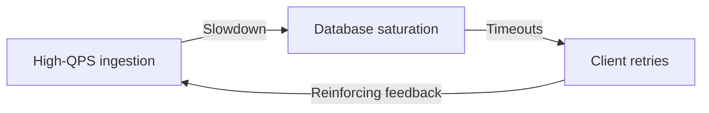

#### 1.3.7.5. Deliverable

A **System Dynamics and Load Behavior Map** containing:

- Stock-and-Flow Topology: Explicitly identifying all bounded and unbounded queues.
- Feedback Loop Catalog: Documenting protective circuit breakers, rate limiters, and backpressure mechanisms.
- Failure Mode and Effects Analysis (FMEA): Specifying system behavior under 5 classic distributed failure scenarios.

#### 1.3.7.6. Human vs AI agent

- **For human architects**: Expands mental simulation beyond the "happy path," ensuring the architecture includes load shedding, bulkhead isolation, and graceful degradation before hitting production.
- **For AI agents**: AI agents are notorious for writing code that works perfectly for a single synchronous request in a test fixture but catastrophic in production (for example, spawning unbounded goroutines/threads, catching exceptions and retrying immediately in a tight loop). Operation 7 enforces explicit backpressure, timeouts, and bounded concurrency in agent-generated code.

------------------------------------------------------------------------

### 1.3.8. Operation 8: Determine Engineering Value and Select

#### 1.3.8.1. Principle

> **"Evaluate options by full engineering value, accounting for total lifecycle cost, operational overhead, transition risk, and ideality."**

In TRIZ ([Altshuller, 1984](https://en.wikipedia.org/wiki/TRIZ)), the universal metric of system excellence is **Ideality** ($I$):

$$I = \frac{\sum \text{Useful Functions}}{\sum \text{Costs} + \sum \text{Harmful Effects}}$$

In Nam P. Suh's **Axiomatic Design (Information Axiom / Axiom 2)** ([Suh, 1990](https://global.oup.com/academic/product/the-principles-of-design-9780195043457)), among all designs that satisfy the functional independence requirement, the optimal design is the one with the **minimal information content** (that is, the simplest design with the highest probability of operational success and lowest entropy).

In multi-criteria decision analysis under uncertainty ([Simon, 1969](https://mitpress.mit.edu/9780262691918/the-sciences-of-the-artificial/)), choices must account not only for immediate capital acquisition/construction costs, but for ongoing operational friction, cognitive load, on-call toil, failure blast radius, and reversibility.

#### 1.3.8.2. Purpose

Operation 8 selects among competing candidate mechanisms (`CAN-`). The selection must be rigorous, transparent, and defensible. The chosen architecture must maximize long-term engineering value. Resume-driven development and short-term hacking are not the goal.

#### 1.3.8.3. Input uncertainty ($\mathcal{U}_8$)

- **Hidden Lifecycle Costs**: Ignoring maintenance, observability, cloud infrastructure spend, security patching, and on-call paging burdens.
- **Cognitive Overhead**: Introducing overly clever or esoteric technology stacks that the existing engineering organization cannot maintain.
- **Unstated Trade-Offs**: Selecting a candidate without explicitly documenting the negative consequences accepted.

#### 1.3.8.4. Action ($\mathcal{A}_8$)

1.  **Multi-Attribute Utility & Ideality Scoring**: Evaluate surviving candidate mechanisms across 6 comprehensive value dimensions:
    - *Functional Delivery*: Completeness of required behavioral invariants.
    - *Operational Reliability*: Failure blast radius, recovery time, observability simplicity.
    - *Maintainability & Cognitive Load*: Simplicity of the mental model, debuggability.
    - *Evolutionary Flexibility / Reversibility*: Cost of unwinding or migrating away from this decision in the future.
    - *Transition Cost & Risk*: Complexity of dual-writing, data migration, and zero-downtime deployment.
    - *Direct Economic Cost*: Cloud hosting, compute/storage overhead, software licensing.
2.  **Adversarial Critique**: Subject the leading candidate to a structured adversarial stress test (Steel-manning the alternatives, identifying hidden state mutations, and assessing failure modes).
3.  **Formulate Architecture Decision Record (ADR)**: Document the decision using formal epistemic linkage (`DEC-`).

<!-- -->

**IDEALITY EVALUATION MATRIX**

| Metric / vector | Candidate 1 (monolith DB) | Candidate 2 (microservices + Kafka) | Candidate 3 (partitioned WAL) |
| --- | --- | --- | --- |
| Useful Functions | High (ACID) | High (Scale) | High (Scale + ACID) |
| Direct Costs | Low | High (Infra) | Medium |
| Harmful Effects | High (Locks) | High (Async) | Low (Isolated state) |
| Cognitive Load | Low | Very High | Medium |
| Reversibility | Easy | Very Hard | Medium |
| IDEALITY SCORE | 0.62 | 0.45 | 0.88 (OPTIMAL) |

#### 1.3.8.5. Deliverable

A **Locked Architectural Decision Record (ADR)** containing:

- Decision node (`DEC-`): The chosen candidate mechanism.
- Explicit Justification: Comparative scoring across ideality dimensions.
- Acknowledged Consequences & Accepted Harms: Documented negative trade-offs.
- Invalidation Triggers: Conditions under which this decision MUST be formally revisited.

#### 1.3.8.6. Human vs AI agent

- **For human architects**: Establishes organizational alignment and creates an enduring historical record that prevents future engineers from repeating past mistakes.
- **For AI agents**: Prevents agentic over-engineering. Without Operation 8, an LLM agent given a simple task will often generate an elaborate microservice architecture with Kubernetes manifests, distributed tracing, and message buses. Operation 8 forces the agent to compute the ideality score and select the minimal sufficient mechanism.

------------------------------------------------------------------------

### 1.3.9. Operation 9: Verify the Solution by Execution and Safely Execute the Transition

#### 1.3.9.1. Principle

> **"Treat every design as an unproven hypothesis until verified by execution; execute transitions through reversible, zero-downtime intermediate systems."**

In his landmark 1972 Turing lecture, Edsger W. Dijkstra ([Dijkstra, 1972](https://dl.acm.org/doi/10.1145/355604.361591)) famously observed:

> *"Program testing can be a very effective way to show the presence of bugs, but it is utterly inadequate for showing their absence."*

To bridge the gap between theoretical correctness and empirical reality, software systems require **Executable Verification** across multiple falsification tiers (Property-Based Testing, Mutation Testing, Invariant Assertions, Chaos Injection) ([Claessen & Hughes, 2000](https://doi.org/10.1145/351240.351266); [Ammann & Offutt, 2016](https://cs.gmu.edu/~offutt/softwaretest/)).

Furthermore, in industrial software engineering, an architecture is only as good as its **Transition System** ([Nygard, 2018](https://pragprog.com/titles/mnee2/release-it-second-edition/); [Fowler, 2018](https://martinfowler.com/bliki/StranglerFigApplication.html)). A migration that requires a 6-hour maintenance window or risks corrupting live customer data is unacceptable. Transitions must be modeled as temporary, fault-tolerant state machines (Expand/Contract, Parallel Run, Dark Launching, Dual-Writing with Reconciliation).

#### 1.3.9.2. Purpose

Operation 9 closes the loop. It proves that the synthesized mechanism satisfies required behavioral invariants in a running environment. It executes the production rollout without downtime, data loss, or irreversible failure.

#### 1.3.9.3. Input uncertainty ($\mathcal{U}_9$)

- **Execution Divergence**: The subtle discrepancies between design models, unit tests, and live production runtimes.
- **Migration & Cutover Risk**: Unverified assumptions about data volume, replication lag, backward compatibility, and schema lock times during live upgrades.
- **Irreversibility Trap**: Deploying a change that cannot be rolled back if an anomaly is detected.

#### 1.3.9.4. Action ($\mathcal{A}_9$)

1.  **Multi-Tier Executable Verification Suite**:
    - *Invariant & Property-Based Tests*: Generate thousands of randomized inputs to falsify state machine invariants (QuickCheck / Hypothesis style).
    - *Mutation Testing*: Inject synthetic faults into the implementation to verify that test suites catch all mutations.
    - *Fault Injection & Chaos Testing*: Simulate network partitions, disk stalls, process crashes, and clock skews.
    - *Performance & Load Benchmarks*: Verify that $p99$ and throughput invariants hold under production-scale load.
2.  **Construct the Transition Architecture (`TRANS-`)**:
    - *Phase 1 (Expand)*: Deploy new schema/service in parallel; introduce dual-writing from old to new.
    - *Phase 2 (Reconcile & Backfill)*: Asynchronously backfill historical data; run continuous reconciliation jobs to verify data equality.
    - *Phase 3 (Dark Launch / Shadow Run)*: Route real production traffic reads/writes to the new system in shadow mode; verify outputs without returning to clients.
    - *Phase 4 (Canary Switchover)*: Incrementally shift live traffic (1% $\to$ 10% $\to$ 100%) with automated rollback on SLO breach.
    - *Phase 5 (Contract)*: Remove legacy code paths, decommission old tables, and clean up temporary shims.

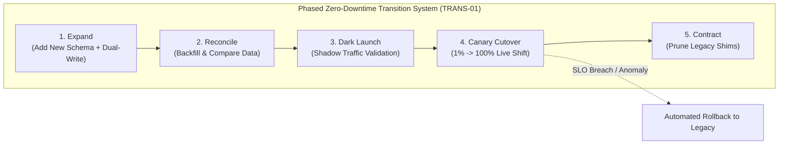

#### 1.3.9.5. Deliverable

A **Verification Suite & Phased Transition Plan** containing:

- Executable Test Artifacts: Automated property tests, load test scripts, and chaos injection scenarios.
- Empirical Verification Evidence (`EVD-`): Test run logs, benchmark results, and mutation coverage reports proving correctness.
- Transition Plan (`TRANS-`): Detailed 5-phase rollout and instantaneous rollback procedures with explicit health metrics.

#### 1.3.9.6. Human vs AI agent

- **For human architects**: Guarantees operational safety and business continuity, turning high-stakes deployments from nerve-wracking gambles into routine, reversible non-events.
- **For AI agents**: This is the ultimate ground-truth checkpoint. An AI agent cannot claim completion simply because it generated code that looks plausible. It must execute the verification suite, inspect real test results (`EVD-`), prove that invariants hold, and construct the exact migration scripts needed for safe execution.

------------------------------------------------------------------------

### 1.3.10. Summary: the nine-operation matrix

The table summarizes the nine operations and their coverage of software engineering problem state:

| Op \# | Principle / Operation | Primary Epistemic Input | Cognitive / Structural Transformation | Primary Working Artifact | Stop Condition |
|:--:|----|----|----|----|----|
| **1** | **Frame and Model the Problem** | Anchoring, ambiguous requirements, unstated assumptions | Functional abstraction, boundary shifting, invariant formulation | Problem Framing Map (`CLM-`, `INV-`) | Shared invariant understanding independent of implementation |
| **2** | **Find Constraint, Cause, or Contradiction** | Symptoms, alarms, performance regressions, clashing requirements | Causal graph abduction, bottleneck isolation, contradiction modeling | Causal & Contradiction Map (`HYP-`, `CTR-`, `EVDREQ-`) | Primary hypothesis is falsifiable by a concrete executable experiment |
| **3** | **Transform the Existing System** | Architectural inertia, bloat, unnecessary complexity | Trimming, functional delegation, separation principles, mechanism replacement | Transformation Log (`CAN-`, Function Absorption Matrix) | Structurally distinct candidates generated by mutation rather than rewrite |
| **4** | **Explore Space of Architectures** | Local optima, premature stack lock-in | General morphological analysis, orthogonal dimension synthesis, subspace pruning | Solution Space Map (`CAN-01..N`) | Surviving candidates represent distinct architectural classes |
| **5** | **Expand Knowledge & Obtain Evidence** | Decision-significant unknowns, unverified assumptions | Empirical spiking, repository data mining, cross-domain mechanism transfer | Registry of Unknowns & Evidence (`UNK-`, `EVD-`) | Unknowns capable of altering architectural choice are resolved |
| **6** | **Arrange Dependencies & Boundaries** | Hidden coupling, leaky abstractions, cascading change risk | Dependency taxonomy mapping, dependency inversion, single-writer state isolation | Dependency Matrix & Change Propagation Map | Independent requirements change independently; blast radius is bounded |
| **7** | **Understand Dynamics Over Time & Load** | Static blindspots, queue overflows, metastable failure risks | Stock-and-flow modeling, Little's Law queueing analysis, feedback loop cataloging | System Dynamics & Load Map (FMEA, Circuit Breakers) | Non-linear failure modes, backpressure, and load-shedding mechanisms are verified |
| **8** | **Determine Engineering Value & Select** | Multi-attribute conflicts, hidden operational costs, cognitive load | Ideality calculation, Pareto frontier analysis, adversarial critique | Architectural Decision Record (`DEC-`, Trade-off Proof) | Selection is mathematically justified and accepted harms are documented |
| **9** | **Verify by Execution & Transition** | Theoretical assumptions, runtime divergence, migration hazards | Property-based testing, chaos injection, 5-phase Expand/Contract transition | Executable Verification Suite & Transition Plan (`TRANS-`, `EVD-`) | Invariants proven by live execution; transition is zero-downtime and reversible |

These nine operations unify TRIZ, the Theory of Constraints, systems thinking, and formal software methods into one executable, repeatable practice.

------------------------------------------------------------------------

## 1.4. Three Levels of the Methodology

A methodology must connect high-level epistemic intent to bit-level execution. In civil, aerospace, and chemical engineering, methods fail when they stay too abstract (pure philosophy) or too concrete (domain checklists that decay as technologies change).

Ariadne organizes systematic inventive thinking into three coupled levels:

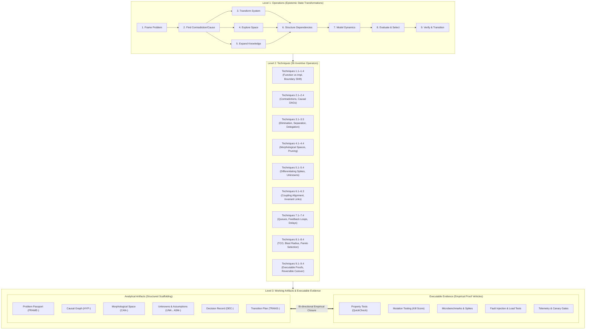

------------------------------------------------------------------------

### 1.4.1. Operations (The Epistemic State Transformations)

At the highest level, an **Operation** is a formal state transformation operator $T: \mathcal{S} \to \mathcal{S}'$ acting upon the **Epistemic State** of the engineering problem.

Formally, the Epistemic State $\mathcal{S}$ at any point in the engineering lifecycle is defined as an 11-tuple:

$$\mathcal{S} = \langle \mathcal{F}, \mathcal{M}, \mathcal{D}, \mathcal{A}, \mathcal{H}, \mathcal{C}, \mathcal{U}, \mathcal{K}, \mathcal{E}, \mathcal{T}, \mathcal{R} \rangle$$

where:

- $\mathcal{F}$ is the set of established, verified repository and environment **Facts** (`FACT`);
- $\mathcal{M}$ is the set of quantitative, empirical **Measurements** (`MEASURED`);
- $\mathcal{D}$ is the set of logically derived propositions from proven facts (`DERIVED`);
- $\mathcal{A}$ is the set of explicit, unverified working **Assumptions** (`ASM-`);
- $\mathcal{H}$ is the set of testable **Causal Hypotheses** (`HYP-`);
- $\mathcal{C}$ is the set of identified technical and physical **Contradictions** (`CTR-`);
- $\mathcal{U}$ is the set of **Decision-Significant Unknowns** (`UNK-`);
- $\mathcal{K}$ is the set of generated **Candidate Mechanisms** (`CAN-`);
- $\mathcal{E}$ is the set of formal **Evidence Requests** and **Evidence Results** (`EVDREQ-`, `EVD-`);
- $\mathcal{T}$ is the set of temporary architectural **Transition Systems** (`TRANS-`);
- $\mathcal{R}$ is the set of locked **Architectural Decisions** and Decision Records (`DEC-`).

The nine operations do not correspond to chronological project phases (for example, "waterfall analysis" or "sprint planning"). Instead, they represent fundamental epistemic transformations invoked dynamically whenever a specific type of engineering uncertainty blocks progress:

| Operation | Primary Epistemic Goal | Core Input State | Target Output State |
|----|----|----|----|
| **1. Frame and Model** | Eliminate solution-anchoring; define invariant boundary | Raw symptom, vague request, or feature mandate | Invariant-bounded behavioral delta $\Delta B$, explicit system scope, immutable constraints |
| **2. Find Constraint / Cause** | Formulate falsifiable mechanism; isolate contradiction | Observable anomaly, failing SLO, or clashing requirements | Directed Causal Graph ($\mathcal{H}$), technical contradiction ($\mathcal{C}$), or binding bottleneck |
| **3. Transform System** | Generate structural variants of existing system | Existing component topology, diagnosed constraint | Set of mutated topologies ($\mathcal{K}$) via elimination, separation, delegation, or reordering |
| **4. Explore Solution Space** | Span multi-dimensional architectural possibilities | Invariant boundary, performance/scale requirements | Morphological matrix spanning orthogonal dimensions; pruned candidate space |
| **5. Expand Knowledge** | Eliminate decision-significant unknowns | Critical unknowns ($\mathcal{U}$), conflicting assumptions ($\mathcal{A}$) | Empirical evidence ($\mathcal{E}$, $\mathcal{M}$), converted facts ($\mathcal{F}$), falsified hypotheses |
| **6. Structure Dependencies** | Align couplings with reasons for change | Structural dependency map, change frequency data | Decoupled interfaces, explicit invariant enforcement paths, minimized change radius |
| **7. Model System Dynamics** | Expose temporal, load, queue, and failure behavior | Static architecture, workload profiles, SLA/SLO bounds | Stock-and-flow model, queue saturation bounds, feedback/retry loops, degradation modes |
| **8. Determine Value & Select** | Rank candidates by total lifecycle cost and value | Candidate mechanisms ($\mathcal{K}$), empirical evidence ($\mathcal{E}$) | Pareto-ranked candidate, explicit trade-off justification, recorded review triggers |
| **9. Verify & Transition** | Achieve empirical closure and safe production rollout | Selected candidate, existing production state | Automated executable verification suite, reversible transition architecture ($\mathcal{T}$), telemetry proof |

------------------------------------------------------------------------

### 1.4.2. Techniques (The 36 Concrete Inventive Operators)

If Operations dictate *what epistemic transformation must occur*, **Techniques** specify *the exact cognitive and structural mechanics of execution*. The 36 techniques operationalize foundational principles from:

- **Classical TRIZ and Advanced Systematic Inventive Thinking (ASIT)**: Specifically Altshuller's physical and technical contradiction resolution principles;
- **The Theory of Constraints (Goldratt)**: Bottleneck identification, exploitation, subordination, and evaporating clouds;
- **Systems Thinking and System Dynamics (Forrester, Meadows)**: Stocks, flows, feedback delays, and non-linear system responses;
- **Formal Software Engineering and Modularity Principles (Parnas, Dijkstra, Liskov)**: Information hiding, separation of concerns, and behavioral subtyping.

#### 1.4.2.1. The 36 Techniques Taxonomy

| Operation | Techniques |
|---|---|
| **1. Frame and model the software problem** | 1.1 Separate function from implementation.<br/>1.2 Describe required and actual behavior.<br/>1.3 Shift the system boundary.<br/>1.4 Shift perspective. |
| **2. Find the constraint, cause, or contradiction** | 2.1 Identify requirement contradictions.<br/>2.2 Identify the limiting bottleneck.<br/>2.3 Construct a causal chain.<br/>2.4 Uncover hidden assumptions. |
| **3. Transform the existing software system** | 3.1 Remove or reduce.<br/>3.2 Split or localize.<br/>3.3 Combine, co-locate, or delegate.<br/>3.4 Replace the mechanism.<br/>3.5 Change quantity, order, time, or placement. |
| **4. Explore the space of architectures and implementations** | 4.1 Generate distinct directions.<br/>4.2 Isolate solution-space dimensions.<br/>4.3 Combine dimension values.<br/>4.4 Prune non-viable combinations. |
| **5. Expand knowledge and obtain missing evidence** | 5.1 Formulate decision-significant unknowns.<br/>5.2 Transfer implementation mechanisms across domains.<br/>5.3 Maintain a typed registry of assumptions and unknowns.<br/>5.4 Generate empirical knowledge with spikes and telemetry. |
| **6. Arrange dependencies and change boundaries** | 6.1 Map static, dynamic, data, and operational dependencies.<br/>6.2 Link requirements to enforcement mechanisms.<br/>6.3 Eliminate accidental co-change coupling. |
| **7. Understand system behavior over time and under load** | 7.1 Model queues, accumulations, rates, and capacity.<br/>7.2 Model feedback loops.<br/>7.3 Account for propagation latency, ordering, and version drift.<br/>7.4 Account for scale growth and bottleneck migration. |
| **8. Determine engineering value and select** | 8.1 Define constraints, value, and preference criteria.<br/>8.2 Compare useful effects with mechanism cost.<br/>8.3 Minimize operational harm, cognitive load, spend, and blast radius.<br/>8.4 Rank candidates with Pareto analysis. |
| **9. Verify the solution by execution and execute the transition safely** | 9.1 Predict benefits, new failure modes, and shifted complexity.<br/>9.2 Validate claims with executable code.<br/>9.3 Design transition architecture.<br/>9.4 Anchor results with telemetry and decommission shims. |

#### 1.4.2.2. The Four Software Separation Principles

A central achievement of Level 2 is the adaptation of TRIZ physical contradiction resolution into the **Four Software Separation Principles**:

1.  **Separation in Time**: Executing conflicting operations at different intervals or temporal phases.
    - *Example*: Separating transactional ingestion (hot, sub-millisecond execution) from analytical aggregation (cold, periodic batching or background streaming).
    - *Example*: Separating schema migration execution from application traffic cutover (two-phase expansion and contraction).
2.  **Separation in Data and State Ownership**: Resolving write contention and race conditions by strictly partitioning state ownership rather than synchronizing shared mutable memory.
    - *Example*: Command Query Responsibility Segregation (CQRS), where the write model is optimized for transactional consistency and the read model is denormalized for query throughput.
    - *Example*: The LMAX Disruptor pattern or Erlang actor model, where a single thread or actor exclusively owns a slice of state, eliminating lock contention.
3.  **Separation in Operating Conditions and Modes**: Altering system behavior dynamically based on operational state or environmental thresholds.
    - *Example*: Circuit breakers and adaptive rate limiters ([Nygard, 2018](https://pragprog.com/titles/mnee2/release-it-second-edition/)), which shift the system from *normal execution mode* to *degraded/fail-fast mode* when downstream error rates exceed critical bounds.
    - *Example*: Load-shedding and degraded graceful responses (for example, returning cached or stale recommendations during peak traffic spikes while keeping checkout strictly consistent).
4.  **Separation Across System and Trust Boundaries**: Isolating components into distinct fault domains, privilege boundaries, or execution contexts to prevent catastrophic failure cascades or security compromise.
    - *Example*: Bulkheading ([Nygard, 2018](https://pragprog.com/titles/mnee2/release-it-second-edition/)), where thread pools, memory allocations, or compute clusters are physically partitioned so that a failure in a non-critical integration cannot starve critical business paths.
    - *Example*: Moving unverified third-party plugin execution into isolated WebAssembly (WASM) sandboxes or separate worker processes.

------------------------------------------------------------------------

### 1.4.3. Working Artifacts and Executable Evidence (The Dual-Layer Evidence Model)

Software engineering reasoning cannot exist in a purely mental or informal textual plane. High-integrity engineering produces two complementary classes of artifacts: **Structured Analytical Artifacts** and **Executable Empirical Evidence**.

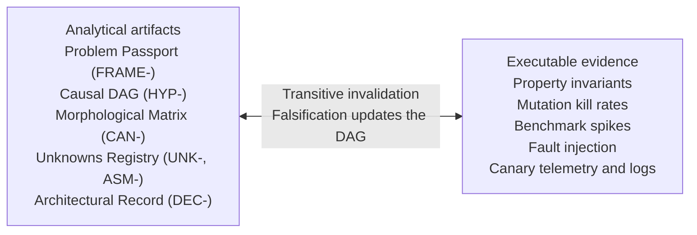

#### 1.4.3.1. Analytical Artifacts: Structured Epistemic Scaffolding

Analytical artifacts serve as the externalized cognitive scaffolding for human engineers and AI agents. They record the precise provenance, dependencies, and rationale of every architectural proposition:

1.  **Problem Passport (`FRAME-`)**: Formulates the required functional delta $\Delta B$, non-negotiable invariants, immutable vs. mutable constraints, and scope boundaries without naming implementation mechanisms.
2.  **Causal Hypothesis Graph (`HYP-`)**: A directed acyclic graph (DAG) connecting observed anomalies to hypothesized physical/computational causes, annotated with differentiating empirical checks.
3.  **Morphological Solution Space Matrix (`CAN-`)**: A systematic grid decomposing an architectural problem into orthogonal dimensions (for example, State Partitioning $\times$ Synchronization Mechanism $\times$ Consistency Model) and tracking evaluated candidate combinations.
4.  **Assumption and Unknowns Registry (`ASM-`, `UNK-`)**: A typed ledger classifying every premise into `FACT` (directly observed), `MEASURED` (quantified via telemetry/benchmarks), `DERIVED` (logically proven), `ASSUMED` (unverified working hypothesis), or `UNKNOWN` (critical missing information).
5.  **Architectural Decision Record (`DEC-`)**: A formal, immutable record capturing the chosen candidate mechanism, the resolved contradictions, the rejected alternatives with explicit rationale, the accepted operational risks, and the **review triggers** (the specific conditions that would invalidate the decision) ([Bass, Clements, & Kazman, 2021](https://www.pearson.com/en-us/subject-catalog/p/software-architecture-in-practice/P200000009477)).
6.  **Transition and Rollback Plan (`TRANS-`)**: The explicit specification of intermediate transition mechanisms (dual-writing, backward-compatible schemas, traffic routing gates, and automated rollback thresholds).

#### 1.4.3.2. Executable Evidence: Empirical Proof Vehicles

Analytical artifacts, however rigorous, remain unproven conjectures until subjected to executable validation. Executable evidence consists of deterministic and statistical verification harnesses executed directly against the code, runtime, or infrastructure:

1.  **Property-Based Invariant Suites**: Generative test suites that verify universal system properties across thousands of pseudo-randomly generated inputs, exposing edge cases that deterministic example-based tests miss ([Claessen & Hughes, 2000](https://doi.org/10.1145/351240.351266)).
2.  **Mutation Testing and Fault Injection**: The deliberate introduction of synthetic faults (mutating AST nodes or injecting network partitions/delays) to measure test suite adequacy and prove that the verification harness can actively falsify invalid states ([DeMillo, Lipton, & Sayward, 1978](https://doi.org/10.1109/C-M.1978.218136); [Nygard, 2018](https://pragprog.com/titles/mnee2/release-it-second-edition/)).
3.  **Isolated Solution Spikes and Benchmark Harnesses**: Minimal, isolated implementations (for example, on ephemeral git branches or worktrees) designed specifically to measure resource consumption, latency profiles, lock contention, or throughput under controlled synthetic workloads.
4.  **Chaos and Resilience Experiments**: Dynamic disruption of dependencies (for example, killing leader nodes, corrupting packets, exhausting thread pools) to verify self-healing, backpressure, and fail-safe recovery mechanisms.
5.  **Telemetry and Canary Verification Gates**: Real-time statistical evaluation of production error budgets, p99 latency distributions, and invariant assertions during progressive traffic cutovers.

#### 1.4.3.3. The Epistemic Supremacy of Executable Evidence and True Empirical Closure

Why does software engineering allow a degree of epistemic certainty that physical engineering disciplines can rarely achieve?

In civil or mechanical engineering, validating a novel bridge design or jet turbine under extreme failure conditions requires either destructive physical testing or reliance on mathematical approximations. A physical bridge cannot be compiled and subjected to 100,000 synthetic load cycles in two seconds before construction.

Software engineering, by contrast, operates on **formal, executable discrete-state systems**. As Edsger W. Dijkstra observed in his seminal work on program structuring ([Dijkstra, 1968](https://doi.org/10.1145/362929.362947)), our intellectual ability to reason about program execution is bounded by the static structure of the text; whenever static structure diverges wildly from dynamic execution flow, our ability to verify correctness collapses.

Because software is intrinsically executable, it provides **true empirical closure**:

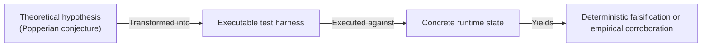

In accordance with Karl Popper's logic of scientific discovery ([Popper, 1959/1934](https://en.wikipedia.org/wiki/The_Logic_of_Scientific_Discovery)), a scientific or engineering proposition is meaningful only if it is **falsifiable**—that is, if there exists an empirical test whose negative outcome would definitively refute the claim.

In the Ariadne framework, no architectural claim (`CLM-`), causal hypothesis (`HYP-`), or assumption (`ASM-`) is considered justified until it is linked to an executable verification harness.

#### 1.4.3.4. Transitive Invalidation Dynamics

The integration between analytical artifacts and executable evidence enables **Transitive Invalidation**. In an epistemic dependency graph:

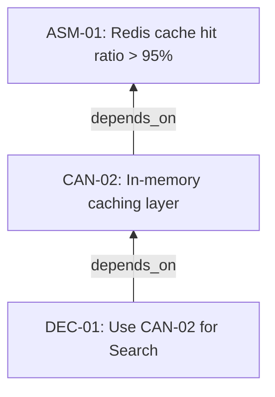

If an executable benchmark spike (`EVD-04`) reveals that under realistic query distributions the hit ratio is only $42\%$, `ASM-01` is **falsified**. Through transitive invalidation:

1.  `ASM-01` status shifts from `ASSUMED` to `FALSIFIED`;
2.  `CAN-02` is automatically invalidated;
3.  `DEC-01` is flagged for mandatory re-evaluation;
4.  The system triggers Operation 2 (Diagnosis) or Operation 4 (Solution Space Exploration) to construct a viable alternative.

This eliminates "architectural decay" where systems are built upon layers of unverified, obsolete assumptions.

------------------------------------------------------------------------

## 1.5. What a Good Result of Engineering Reasoning Is

Engineering reasoning is often scored with superficial proxies: polish of an architectural diagram, number of design patterns cited, length of an RFC, or speed of first code.

These are **anti-metrics**. A 50-page design document that hides unverified assumptions is worse than a one-page problem passport plus a three-line property test that proves an invariant.

A sound outcome is only the **unbroken chain of justification**:

$$\text{Problem Model} \xrightarrow{\text{Falsifiable}} \text{Hypothesis} \xrightarrow{\text{Systematic}} \text{Transformation} \xrightarrow{\text{Executable}} \text{Check} \xrightarrow{\text{Empirical}} \text{Evidence} \xrightarrow{\text{Justified}} \text{Decision}$$

``` mermaid
flowchart LR
    PM["Problem Model<br/>(Invariant Delta ΔB)"] -->|Falsifiable| H["Causal Hypothesis<br/>(Mechanistic DAG)"]
    H -->|Systematic| T["Transformation<br/>(Orthogonal Candidates)"]
    T -->|Executable| C["Check Harness<br/>(Property/Mutation/Spike)"]
    C -->|Empirical| E["Evidence Result<br/>(Measured Data)"]
    E -->|Justified| D["Decision & Transition<br/>(ADR + Rollback Plan)"]

    style PM fill:#f9f,stroke:#333,stroke-width:2px
    style H fill:#bbf,stroke:#333,stroke-width:2px
    style T fill:#dfd,stroke:#333,stroke-width:2px
    style C fill:#ffd,stroke:#333,stroke-width:2px
    style E fill:#dff,stroke:#333,stroke-width:2px
    style D fill:#fdd,stroke:#333,stroke-width:2px
```

------------------------------------------------------------------------

### 1.5.1. Operational Quality Criteria Across All Nine Operations

To establish rigorous quality gates for both human software engineers and AI agents, we define the precise criteria for a sound outcome across each of the nine operations:

| Operation | Quality criteria | Stop condition |
|---|---|---|
| **1. Frame and model** | ✓ Define the observable behavioral delta ΔB without naming implementation technologies.<br/>✓ Separate mandatory invariants and SLA/SLO bounds from mutable preferences.<br/>✓ Lock the system boundary and stakeholder perspectives (user, SRE, adversary, data owner). | Two independent engineers agree on the success and failure conditions. |
| **2. Find the contradiction or cause** | ✓ Build a Directed Causal Graph (DAG) that isolates the physical or computational mechanism.<br/>✓ State the quality conflict as a formal contradiction.<br/>✓ Define a differentiating empirical test. | A concrete experiment can decisively refute the hypothesis. |
| **3. Transform the system** | ✓ Apply elimination, separation, delegation, or mechanism replacement.<br/>✓ Move every required function from an eliminated component to an existing carrier.<br/>✓ Check for collateral functional loss. | Candidate mechanisms differ by operating principle, not only by syntax. |
| **4. Explore the solution space** | ✓ Decompose the problem into orthogonal dimensions (state, consistency, compute, flow).<br/>✓ Include structurally distinct candidate classes.<br/>✓ Prune candidates that violate hard invariants. | The morphological space contains at least three distinct architectural paradigms. |
| **5. Expand knowledge** | ✓ Type epistemic state as FACT, MEASURED, DERIVED, ASSUMED, or UNKNOWN.<br/>✓ Resolve decision-significant unknowns with spikes, benchmarks, or documentation.<br/>✓ Remove unexamined assumptions that block selection. | No remaining unknown can change the candidate choice. |
| **6. Structure dependencies** | ✓ Map static, dynamic, data, and operational couplings.<br/>✓ Remove accidental co-change coupling.<br/>✓ Define an enforcement mechanism for every critical invariant. | The expected change blast radius is bounded to isolated modules. |
| **7. Model system dynamics** | ✓ Quantify queues, buffers, thread pools, and connections.<br/>✓ Model retry amplification, thundering herds, and backpressure.<br/>✓ Analyze startup, shutdown, partitions, and rolling deployments. | Failure degradation modes and queue saturation limits are proven. |
| **8. Determine value and select** | ✓ Compare candidates on the Pareto frontier using lifecycle cost, operational complexity, and blast radius.<br/>✓ Record explicit trade-off reasoning.<br/>✓ Record exact review triggers. | Evidence uniquely justifies the selected decision against the stated criteria. |
| **9. Verify and transition** | ✓ Verify the solution with executable property tests, mutation tests, and performance spikes.<br/>✓ Design a reversible multi-phase transition.<br/>✓ Activate telemetry and automated rollback criteria. | Production evidence shows sustained improvement without regression. |

------------------------------------------------------------------------

### 1.5.2. Comparative Quality Analysis: Weak vs. Rigorous Reasoning

To make the demarcation between superficial engineering and systematic epistemic rigor unmistakable, we contrast common anti-patterns with sound engineering deliverables across the nine operations:

| Operation | Superficial / Anti-Pattern Reasoning | Rigorous Ariadne Epistemic Reasoning |
|----|----|----|
| **1. Frame Problem** | *"We need to migrate our backend to Go microservices because Python is too slow."* | *"Under a peak workload of 15,000 req/sec, p99 search latency must not exceed 85 ms while maintaining serializable read consistency. The current runtime yields 420 ms due to GIL contention during JSON deserialization."* |
| **2. Diagnose Cause** | *"The database is overloaded; let's add a Redis cache in front of it."* | *"Causal DAG reveals that 92% of DB load originates from redundant permission checks in nested loop queries. A differentiating spike proved that batching permission lookups reduces DB CPU from 95% to 18% without adding a cache."* |
| **3. Transform System** | *"Let's rewrite the service from scratch using clean architecture."* | *"Applied Separation in Time and State Ownership: extracted write-path event validation into an append-only WAL, delegating read-path aggregation to a materialized view. Eliminated two intermediate microservices and a distributed lock manager."* |
| **4. Explore Space** | *"We evaluated three options: RabbitMQ, Apache Kafka, and AWS SQS."* (All 3 belong to the same paradigm: asynchronous message broker). | *"Explored 4 orthogonal architectural classes: (A) Asynchronous partitioned log (Kafka), (B) In-memory actor mailboxes (Erlang/Akka), (C) Database-backed transactional outbox, and (D) Client-driven idempotent retry over HTTP/3."* |
| **5. Expand Knowledge** | *"We assume the network latency between Availability Zones is negligible."* | *"Identified UNK-03 (cross-AZ latency distribution). Executed a 24-hour network telemetry spike measuring p50=0.8ms, p99=4.2ms, p99.9=28ms under cross-AZ traffic, proving that synchronous multi-AZ 2PC will violate our 15ms p99 SLA."* |
| **6. Structure Dependencies** | *"Every microservice has its own Git repository and talks via REST APIs."* | *"Mapped data and change coupling. Inverted the dependency between Billing and OrderProcessing using domain events; eliminated synchronous REST calls that created a distributed temporal deadlock."* |
| **7. Model Dynamics** | *"The service handled 1,000 users in staging; it should scale linearly to 100,000 users."* | *"Modeled queue dynamics under downstream outage: exponential retries without jitter trigger a thundering herd that saturates connection pools within 12 seconds. Introduced token-bucket rate limiting and circuit-breaker shed modes."* |
| **8. Determine Value & Select** | *"Option A is modern and has 40k stars on GitHub, so the team prefers it."* | *"Evaluated Candidate 1 vs Candidate 3. Candidate 1 yields 12% lower compute cost but introduces distributed state synchronization requiring \$180k/year operational maintenance. Selected Candidate 3; recorded review trigger: re-evaluate if traffic exceeds 50k RPS."* |
| **9. Verify & Transition** | *"Code passed unit tests; deploying straight to production on Friday afternoon."* | *"Verified invariants via QuickCheck (100k generated state transitions) and PIT mutation testing (kill rate 94%). Executing 3-stage transition: (1) Dual-write with shadow comparison, (2) 5% canary routing with automatic error-budget rollback, (3) Final cutover and shim removal."* |

------------------------------------------------------------------------

### 1.5.3. Foundations of Empirical Soundness in Software Systems

The framework's rigorous standards are anchored in foundational literature across the history of computer science:

1.  **Popperian Falsification and Testability**: As established by Karl Popper ([Popper, 1959/1934](https://en.wikipedia.org/wiki/The_Logic_of_Scientific_Discovery)), an engineering claim that cannot be empirically tested is a dogma, not an engineering truth. In software systems, every architectural assertion ("this cache improves throughput," "this lock prevents data corruption," "this circuit breaker isolates failures") must be accompanied by an executable test harness designed specifically to attempt its refutation.

2.  **Dijkstra's Invariant Verification and Structured Reasoning**: Edsger W. Dijkstra demonstrated that the human mind cannot fathom the dynamic state space of complex software without formal structural boundaries and invariants ([Dijkstra, 1968](https://doi.org/10.1145/362929.362947)). A sound engineering reasoning process structures systems such that dynamic execution flow reflects static logical relationships, making behavior verifiable and predictable.

3.  **Property-Based Verification and Generative Testing**: Koen Claessen and John Hughes demonstrated with QuickCheck ([Claessen & Hughes, 2000](https://doi.org/10.1145/351240.351266)) that example-based unit tests reflect only the developer's preconceived scenarios. Sound verification demands testing universal algebraic properties (invariants, round-trip serialization, idempotency, commutativity) across randomly generated input distributions with automatic counterexample shrinking.

4.  **Mutation Analysis and Test Adequacy**: Richard A. DeMillo, Richard J. Lipton, and Frederick G. Sayward established the theoretical foundations of mutation testing ([DeMillo, Lipton, & Sayward, 1978](https://doi.org/10.1109/C-M.1978.218136)). A test suite that passes 100% of the time is uninformative unless it is proven capable of killing synthetically injected mutants. Sound engineering reasoning demands proving the sensitivity of our verification mechanisms.

5.  **Architectural Quality Attributes and Systematic Trade-Offs**: Len Bass, Paul Clements, and Rick Kazman established that software architecture is the embodiment of early design decisions regarding quality attributes (modifiability, availability, performance, security) ([Bass, Clements, & Kazman, 2021](https://www.pearson.com/en-us/subject-catalog/p/software-architecture-in-practice/P200000009477)). Sound reasoning recognizes that there are no "best architectures"—only architectural tactics that trade one quality attribute for another in alignment with system invariants.

6.  **Production Resilience and Failure Mode Engineering**: Michael T. Nygard established that software systems operate in hostile, non-linear environments where failures are inevitable ([Nygard, 2018](https://pragprog.com/titles/mnee2/release-it-second-edition/)). Sound engineering reasoning must account for transient shocks, cascading failures, capacity exhaustion, and socket leaks through structural resilience patterns (circuit breakers, bulkheads, timeouts, backpressure, and graceful degradation).

When engineering reasoning adheres to these three levels—operating systematically on epistemic uncertainty, applying proven inventive techniques, and anchoring every claim in executable evidence—software engineering realizes its full potential as a rigorous, predictive, and empirical discipline.

------------------------------------------------------------------------

------------------------------------------------------------------------

# Part 2. The Nine Core Operations

## 2.1. Operation 1. Frame and Model the Software Problem

### 2.1.1. Failure First: The Cache That Preserved Revoked Access

A team receives the request “add Redis so authorization checks are faster.” It implements a five-minute cache for permission decisions. At 14:03 an administrator revokes a compromised account; at 14:04 the cached positive decision still authorizes a funds transfer. The code satisfies the requested implementation and violates the actual safety requirement.

| Perspective | Intuitive but wrong response | Why this actor makes the error | Consequence | Required correction |
|---|---|---|---|---|
| Human engineer | Accept “add Redis” as settled scope and tune TTL after the incident. | Authority anchoring, delivery pressure, and sunk commitment make reopening the problem socially costly. | A shorter TTL reduces but does not eliminate the stale-authorization window; the safety invariant remains undefined. | Ask what observable behavior must change, under which revocation conditions, and what staleness is legally or operationally tolerable. |
| AI agent | Infer a cache-aside task from the tool name and generate a generic wrapper with invalidation hooks. | Prompt nouns and common code patterns dominate when repository state and business invariants are absent. | The implementation looks complete while missing cross-region invalidation, failure semantics, and the distinction between cacheable identity data and non-cacheable authorization decisions. | Refuse to select a carrier until current behavior, required behavior, invariants, boundary, and evidence source are represented in `FRAME-*`. |

The correction is shared. The control differs. Humans need a review ritual that permits reframing a sponsor's proposed solution. Agents need an input contract and a gate that blocks implementation while framing fields are unresolved.

#### 2.1.1.1. Formal Concept → Engineering Meaning

| Formal concept | Precise role | Engineering reading and observable evidence |
|---|---|---|
| Framing uncertainty, $U_{\text{frame}}$ | Uncertainty about required behavior, invariant boundaries, conditions, or success criteria. | The team cannot write a tool-neutral failing scenario such as “a revoked grant is rejected globally within 250 ms”; conflicting tickets and acceptance tests are the evidence. |
| Behavioral delta, $\Delta B = B_{\text{required}} - B_{\text{actual}}$ | Difference between observed and required behavior under specified conditions. | Today a revoked principal succeeds for up to five minutes; required behavior is rejection within 250 ms. That measurable gap, not “missing Redis,” is the problem. |
| Transitive invalidation | Invalidity propagates from a false upstream premise to dependent claims and artifacts. | If “five minutes of stale authorization is safe” is false, the cache design, tests, capacity plan, and rollout decision depending on it must all be reopened. |

### 2.1.2. Why framing comes first

**Operation 1: Frame and Model the Software Problem** is the first gate. A framing error can make the team optimize the wrong measure, automate a false assumption, solve a symptom instead of a constraint, or select a technology too early.

``` mermaid
flowchart TD
    subgraph RawInput["Raw Problem Input (Unstructured & Biased)"]
        Req["User / Stakeholder Request<br/>(for example, 'Add Kafka to speed up reporting')"]
    end

    subgraph Operation1["Operation 1: Frame and Model the Software Problem"]
        T11["Technique 1.1<br/>Separate Function from Implementation<br/>(Strip Premature Solutions)"]
        T12["Technique 1.2<br/>Describe Required & Actual Behavior<br/>(Hoare Triples & Quality Attribute Scenarios)"]
        T13["Technique 1.3<br/>Shift System Boundary<br/>(Multi-Scale Hierarchy: Module → Platform)"]
        T14["Technique 1.4<br/>Shift Perspective<br/>(Multi-Stakeholder Epistemic Overlay)"]
        
        T11 --> T12 --> T13 --> T14
    end

    subgraph EpistemicArtifact["Ariadne Epistemic Layer"]
        FrameNode["Problem Framing Node: FRAME-ID<br/>• Implementation-Agnostic Function<br/>• Behavioral Delta (ΔB = B_actual → B_required)<br/>• Mandatory Invariants (Safety & Liveness)<br/>• Boundary Scope & Perspective Matrix"]
    end

    subgraph DownstreamOperations["Downstream Invariant Operations"]
        Op2["Op 2: Diagnose Cause & Contradiction"]
        Op3["Op 3: Transform System"]
        Op4["Op 4: Explore Solution Space"]
        Op6["Op 6: Arrange Dependencies"]
        Op7["Op 7: Model Dynamics"]
        Op9["Op 9: Verify & Safely Transition"]
    end

    Req --> Operation1
    Operation1 --> FrameNode
    FrameNode ==> Op2 & Op3 & Op4 & Op6 & Op7 & Op9
```

Operation 1 reduces **framing uncertainty** ($U_{\text{frame}}$). This uncertainty exists when required behavior, invariants, or success criteria are incomplete, conflict with each other, or contain an implementation choice.

Before you create candidate architectures (`CAN-`), causal hypotheses (`HYP-`), or verification suites (`VAL-`), create a **Problem Framing Map (`FRAME-`)**. If a later fact changes the frame, invalidate every dependent candidate, decision, test, and code change.

------------------------------------------------------------------------

#### 2.1.2.1. Main Question

> **What software system behavior must change, under what observable conditions, and bounded by what non-negotiable invariants, regardless of what code, service, database, or library currently exists?**

The first failure occurs before architecture design: **the problem statement already names an implementation**.

Engineers and AI agents routinely receive requests framed as technological imperatives:

- *"We need to add Redis caching."*
- *"We need to decompose the monolith into microservices."*
- *"We need an Apache Kafka message broker."*
- *"We need to rewrite the ingestion engine in Rust."*
- *"We need a distributed lock manager."*

These statements are **solutions**, not problems. The named mechanism can be wrong. If the team accepts it as the problem, it sees only small variants of one design. Simpler, more reliable, and less costly options are then hidden.

Good framing removes implementation names. It states the **observable behavioral delta**:

- Not *"add Redis,"* but *"deliver read access to session state with $p99 < 5\text{ ms}$ under 50,000 concurrent requests/sec without serving stale authorization grants."*
- Not *"split into microservices,"* but *"enable independent deployment and scaling of billing and catalog workflows such that a catalog outage cannot prevent transaction settlement."*
- Not *"add Kafka,"* but *"decouple the rate of bursty telemetry ingestion ($100\text{k events/sec}$) from the batch analytical write rate ($10\text{k events/sec}$) with zero data loss during worker node restarts."*
- Not *"rewrite in Rust,"* but *"eliminate tail-latency spikes exceeding $50\text{ ms}$ caused by garbage collection pauses during real-time order matching."*

------------------------------------------------------------------------

### 2.1.3. Theoretical Grounding

Operation 1 rests on computer science, software architecture theory, and mathematical logic. The base is: separate the problem domain from the implementation machine, specify behavioral invariants, and model quality attributes from multiple perspectives.

```mermaid
flowchart TD
    Jackson["Michael Jackson<br/>Problem Frames<br/>Domain properties and machine specification"]
    Parnas["David Parnas<br/>Information Hiding<br/>Stable behavioral contracts"]
    Dijkstra["Edsger Dijkstra<br/>Separation of Concerns<br/>Separate what from how"]
    Hoare["C. A. R. Hoare<br/>Axiomatic Semantics<br/>Precondition, command, postcondition"]
    Lamport["Leslie Lamport<br/>Temporal Logic<br/>Safety and liveness invariants"]
    Bass["Bass, Clements, and Kazman<br/>Quality Attribute Scenarios<br/>Observable response measures"]
    Framing["Operation 1<br/>Frame and Model the Software Problem"]

    Jackson --> Framing
    Parnas --> Framing
    Dijkstra --> Framing
    Hoare --> Framing
    Lamport --> Framing
    Bass --> Framing
```

#### 2.1.3.1. Michael Jackson's Problem Frames Theory (2001)

In [*Problem Frames: Analysing and Structuring Software Development Problems* (Addison-Wesley, 2001)](https://www.pearson.com/en-us/subject-catalog/p/problem-frames-analysing-and-structuring-software-development-problems/P200000003157), Michael Jackson distinguishes the **problem domain** (the environment, real-world entities, business context) from the **machine** (the software system to be constructed).

Jackson's core insight is the fundamental theorem of requirements engineering:

$$\mathcal{D}, \mathcal{M} \vdash \mathcal{R}$$

Where:

- $\mathcal{D}$ represents the known, immutable properties of the **Problem Domain** (for example, *"networks can drop packets,"* *"users can double-click buttons,"* *"clocks can drift"*).
- $\mathcal{M}$ represents the behavioral specification of the **Machine** to be built.
- $\mathcal{R}$ represents the customer's desired **Requirements** in the environment.

The engineer's task is not to describe the machine's internal mechanisms. The task is to specify a machine $\mathcal{M}$ such that, when it operates in the physical domain $\mathcal{D}$, the requirements $\mathcal{R}$ are mathematically entailed.

Jackson classified recurring software problems into canonical **problem frames**:

1.  **Required Behavior**: The machine monitors and controls domain entities to maintain a required physical/logical relationship (for example, an engine controller, an automated heating regulator).
2.  **Commanded Behavior**: The machine accepts operator commands and directs domain entities accordingly (for example, a motor drive controller).
3.  **Information Display**: The machine observes real-world state and continuously presents an accurate, up-to-date representation to external observers (for example, real-time dashboards, flight tracking).
4.  **Workpieces**: The machine creates, modifies, and preserves structured information artifacts in response to user commands (for example, document editors, CAD tools, compilers).
5.  **Transformation**: The machine reads input data files in a defined format and produces output data files in another format (for example, ETL pipelines, batch billing processors).

Operation 1 applies Jackson's principle: **the problem lives in the domain; the solution lives in the machine**. Do not specify the machine (for example, *"use Redis"*) before you characterize domain properties $\mathcal{D}$ and requirement $\mathcal{R}$. That order violates the entailment relation.

------------------------------------------------------------------------

#### 2.1.3.2. Parnas on Information Hiding and Modular Decomposition (1972)

In [*On the Criteria To Be Used in Decomposing Systems into Modules* (CACM, 1972, DOI: 10.1145/361598.361623)](https://dl.acm.org/doi/10.1145/361598.361623), David L. Parnas showed that decomposition by execution flowcharts or procedural steps produces fragile, tightly coupled architectures. Decomposition must be guided by **information hiding**:

> *"We propose instead that one begins with a list of difficult design decisions or design decisions which are likely to change. Each module is then designed to hide such a decision from the others."*

In Operation 1, Parnas's principle governs **system boundaries** (Technique 1.3). When you frame a problem, you must state:

1. The **primary secret:** The algorithms, storage formats, or protocol mechanisms that must remain free to change.
2. The **stable behavioral contract:** The observable inputs, outputs, and invariants exposed across the boundary.

Framing that binds a problem to a specific database schema or RPC framework leaks the volatile implementation secret into the problem definition. That violates Parnas's criterion.

------------------------------------------------------------------------

#### 2.1.3.3. Dijkstra's Separation of Concerns (1972)

In his ACM Turing Lecture [*The Humble Programmer* (CACM, 1972, DOI: 10.1145/355604.361591)](https://dl.acm.org/doi/10.1145/355604.361591), Edsger W. Dijkstra introduced **separation of concerns** as a defense against human cognitive limits:

> *"We know that a program should be read and understood by a human mind... We must keep the role of our intellectual powers in mind: we are small, our heads are small, and the computer is huge. The only way to prevent our mental powers from being overwhelmed is the disciplined separation of concerns."*

Dijkstra states that separating **what** a program must achieve from **how** hardware executes it is not an aesthetic preference. It is a mathematical necessity for correctness. When you mix functional correctness with execution mechanics (thread scheduling, memory allocation, or caching layers), human and artificial cognition overload. Latent concurrency bugs, race conditions, and unmaintainable code follow.

------------------------------------------------------------------------

#### 2.1.3.4. Hoare's Axiomatic Basis and Pre/Post Conditions (1969)

In [*An Axiomatic Basis for Computer Programming* (CACM, 1969, DOI: 10.1145/363235.363259)](https://dl.acm.org/doi/10.1145/363235.363259), C. A. R. Hoare introduced axiomatic semantics with the Hoare Triple:

$${P} ; \mathcal{C} ; {Q}$$

Where:

- $P$ is the **Precondition**: an assertion on the system state that must hold prior to execution.
- $\mathcal{C}$ is the **Command / Program**: the computational execution.
- $Q$ is the **Postcondition**: an assertion on the system state guaranteed to hold upon termination, provided $P$ held initially.

In Operation 1 (Technique 1.2), Hoare logic is the grammar for behavioral modeling. Do not describe an implementation narrative (*"the controller calls the payment gateway through HTTP and writes to the database"*). Frame the problem as a contract between system states:

$${ \text{OrderState} = \text{UNPAID} \land \text{Balance} \ge \text{Amount} } ; \mathcal{S} ; { \text{OrderState} = \text{PAID} \land \text{Balance} = \text{Balance}_{\text{prev}} - \text{Amount} \land \text{AuditLogExists} }$$

Coupled with a **Global Invariant** $\mathcal{I}$ that must hold across all intermediate states:

$$\mathcal{I} \equiv \forall \text{order} \in \text{Orders},\; \text{Count}(\text{Charges}(\text{order})) \le 1$$

------------------------------------------------------------------------

#### 2.1.3.5. Lamport's Temporal Logic and Invariant Specification (2002)

In [*Specifying Systems: The TLA+ Language and Tools for Hardware and Software Engineers* (Addison-Wesley, 2002)](https://www.microsoft.com/en-us/research/publication/specifying-systems-the-tla-language-and-tools-for-hardware-and-software-engineers/), Leslie Lamport models concurrent and distributed software as discrete state transition systems.

Lamport splits system correctness into two independent properties:

1.  **Safety Properties** (*"nothing bad happens"*): Assertions that must hold in every reachable system state: $$\text{Init} \land \Box[\text{Next}]_{\text{vars}} \implies \Box \text{Invariant}$$
2.  **Liveness Properties** (*"something good eventually happens"*): Assertions that guaranteed progress will be made: $$\Box \Diamond \text{TargetState}$$

In Operation 1, framing must separate safety from liveness. A system that does nothing satisfies all safety invariants. A system that crashes on error satisfies safety but violates liveness. Framing must state both: which state transitions are forbidden (safety), and which state transitions must complete within bounded time (liveness).

------------------------------------------------------------------------

#### 2.1.3.6. Bass, Clements & Kazman's Quality Attribute Scenarios (2021)

In [*Software Architecture in Practice* (4th ed., Addison-Wesley, 2021)](https://www.oreilly.com/library/view/software-architecture-in/9780136886099/), Len Bass, Paul Clements, and Rick Kazman showed that vague architectural qualities ("the system must be fast, scalable, and secure") are non-operational and unfalsifiable.

They introduced the **Quality Attribute Scenario**, with six parts:

1.  **Source of Stimulus**: The entity generating the request (for example, external user, rogue client, internal timer).
2.  **Stimulus**: The event or condition arriving at the system (for example, 50,000 HTTP requests arriving in a 1-second burst).
3.  **Artifact**: The specific subsystem or boundary receiving the stimulus (for example, API Gateway, Ingestion Service).
4.  **Environment**: The operational context (for example, normal steady-state, failover mode, network partition).
5.  **Response**: The required observable reaction of the system (for example, accept valid requests, throttle excess, log rate-limit events).
6.  **Response Measure**: The quantifiable, testable threshold of success (for example, $p99 \text{ latency} \le 15\text{ ms}$, zero dropped legitimate requests, 429 response issued in $< 1\text{ ms}$).

Operation 1 uses this 6-part structure as the standard template for behavioral modeling. Ambiguous "non-functional requirements" become verifiable engineering contracts.

------------------------------------------------------------------------

### 2.1.4. Cognitive Pathology: Human Solution Anchoring vs. AI Premature Tool Selection

Problem framing is not only an analytical technique. It is a cognitive defense. Human engineers and AI agents both bypass problem modeling and jump to solution synthesis.

``` mermaid
flowchart TD
    subgraph HumanPathology["Human Cognitive Pathology: Solution Anchoring"]
        HA1["Cognitive Anchoring & Availability Heuristic<br/>(Tversky & Kahneman, 1974)"]
        HA2["Law of the Instrument / Maslow's Hammer<br/>('To a man with a hammer, everything looks like a nail')"]
        HA3["Resume-Driven Development (RDD) & Tribal Hype"]
        HA1 & HA2 & HA3 --> H_Outcome["Premature Architectural Lock-in<br/>(for example, a distributed microservice mesh for a 10 req/sec domain)"]
    end

    subgraph AIPathology["AI Agent Pathology: Premature Tool Selection"]
        AI1["Autoregressive Greediness & Token Attraction<br/>(Next-token probability favours familiar library names)"]
        AI2["Premature Tool Calling without Epistemic State<br/>(Invoking write_to_file / run_command immediately on prompt)"]
        AI3["Associative Pattern Matching over Causal Modeling<br/>('Search' → ElasticSearch, 'Speed' → Redis, 'Async' → Kafka)"]
        AI1 & AI2 & AI3 --> AI_Outcome["Premature Code / Config Generation<br/>(Generating boilerplate before verifying invariants)"]
    end

    H_Outcome & AI_Outcome --> EpistemicDisaster["Epistemic Disaster:<br/>• Solves the wrong problem<br/>• Introduces unmanaged mutable state<br/>• Creates accidental coupling<br/>• Guarantees downstream rework"]
```

#### 2.1.4.1. Human solution anchoring

In human architects, premature solution commitment is driven by known psychological heuristics:

- **The availability heuristic** ([Tversky & Kahneman, 1974](https://www.science.org/doi/10.1126/science.185.4157.1124)): Engineers reach for technologies from their most recent project or recent conference talks. If an architect recently resolved a data pipeline issue with Apache Flink, incoming stream-processing problems are framed as *"we need a Flink cluster."*
- **The law of the instrument** ([Abraham Maslow, 1966](https://en.wikipedia.org/wiki/Law_of_the_instrument)): *"I suppose it is tempting, if the only tool you have is a hammer, to treat everything as if it were a nail."* Teams with deep Kubernetes expertise frame all deployment, scaling, and isolation problems as custom CRDs, sidecars, and operators. They ignore simpler OS-level or database-level solutions.
- **Resume-driven development (RDD) and social proof:** Engineers select architectural mechanisms that raise professional marketability or match industry fashion. They justify the complexity after the fact with fabricated scalability requirements.

#### 2.1.4.2. AI agent premature tool selection

In LLMs acting as software agents, premature commitment looks different. The architectural failure is the same:

- **Autoregressive greediness and lexical attraction:** LLMs predict high-probability token sequences. In developer training corpora, problem descriptions sit next to concrete implementations (for example, "fast caching" with `import redis`, "message queue" with `kafka-python`, "relational data" with `CREATE TABLE`). The model is biased to emit code and tool calls at once. It does not pause to question the problem framing.
- **Premature tool invocations:** When an agent has execution tools (`run_command`, `write_to_file`), a prompt *"Make the user search faster"* often runs `npm install elasticsearch` or changes database configuration on the first turn. The agent has not established baseline latency, query distributions, or invariant constraints.
- **Associative pattern matching vs. causal reasoning:** LLMs complete associative patterns. They have no innate model of engineering uncertainty. Without an explicit reasoning harness, an agent treats a premature solution in the user's prompt as a hard constraint, not as a hypothesis to unpack.

#### 2.1.4.3. Comparative taxonomy of framing pathologies

| Pathology dimension | Human architect | AI agent | Ariadne counter-measure |
|----|----|----|----|
| **Primary Failure Mode** | **Solution Anchoring**: Emotional attachment to familiar frameworks, patterns, or recent successes. | **Premature Tool Calling**: Token-driven compulsion to generate code/files immediately without modeling. | **Operation 1 Gate**: Hard constraint prohibiting candidate generation until `FRAME-` is validated. |
| **Trigger Mechanism** | Cognitive comfort, industry hype, organizational inertia, fear of unfamiliar paradigms. | Strong lexical association between problem keywords and popular library names in training weights. | **Technique 1.1**: Automated stripping of noun-technologies from problem statements. |
| **Response to Ambiguity** | Makes unstated assumptions based on past experience without documenting them. | Hallucinates plausible requirements or silently selects default framework configurations. | **Technique 1.2**: Hoare contract and Quality Attribute Scenario with explicit `UNKNOWN` markers. |
| **System Boundary Bias** | Focuses on the layer owned by the architect's specific team (for example, backend vs. frontend vs. SRE). | Anchors to the specific file or repository directory mentioned in the user's initial prompt. | **Technique 1.3**: Mandatory 8-level boundary sweep from CPU register to socio-technical pipeline. |
| **Perspective Blindspot** | Prioritizes developer ergonomics or architectural elegance over operational or security realities. | Ignores operational blast radius, on-call debugging overhead, and long-term data migration safety. | **Technique 1.4**: Multi-stakeholder epistemic overlay across all 7 operational roles. |

------------------------------------------------------------------------

### 2.1.5. The Four Framing Techniques

Operation 1 provides four techniques. They transform an ambiguous, solution-entangled request into a verifiable Problem Framing Map (`FRAME-`).

``` mermaid
flowchart LR
    subgraph Input["Input Request"]
        Raw["'We need a distributed Redis lock to prevent double payments'"]
    end

    subgraph T11["1.1 Separate Function from Implementation"]
        F1["Function: Enforce single-execution invariant across concurrent payment attempts"]
    end

    subgraph T12["1.2 Describe Required & Actual Behavior"]
        F2["Behavior: {OrderState=UNPAID} S {OrderState=PAID ∧ Charges=1}<br/>Invariant: Charges ≤ 1 under all network retries"]
    end

    subgraph T13["1.3 Shift System Boundary"]
        F3["Boundary: Evaluate DB constraint vs. Gateway Idempotency vs. Lock"]
    end

    subgraph T14["1.4 Shift Perspective"]
        F4["Perspectives: Customer (no double billing), SRE (no lock timeouts), Finance (audit trail)"]
    end

    subgraph Output["Output Artifact"]
        Frame["FRAME-02 Problem Framing Map"]
    end

    Raw --> T11 --> T12 --> T13 --> T14 --> Output
```

------------------------------------------------------------------------

#### 2.1.5.1. Technique 1.1. Separate Function from Implementation

##### 2.1.5.1.1. Formal Definition

Let $S_{\text{raw}}$ be a raw problem statement. The Functional Abstraction Operator $\mathcal{F}_{\text{abstract}}$ maps $S_{\text{raw}}$ to a pure functional tuple:

$$\mathcal{F}_{\text{abstract}}(S_{\text{raw}}) = \langle \text{Verb}, \text{Object}, \text{Context}, \mathcal{I} \rangle$$

Where:

- $\text{Verb}$ is an active, technology-neutral action (for example, *isolate, synchronize, serialize, persist, transform, throttle*).
- $\text{Object}$ is the core domain entity or information flow (for example, *financial transaction, analytical query, authorization token*).
- $\text{Context}$ is the operational environment and load profile.
- $\mathcal{I}$ is the set of non-negotiable invariants that must be preserved.

The transformation forbids concrete software components, libraries, database engines, network protocols, or infrastructure products in the functional statement.

##### 2.1.5.1.2. Linguistic Transformation Rules

1.  **Strip Named Technologies**: Replace proper nouns (for example, *PostgreSQL, Kafka, Redis, gRPC, React, AWS Lambda*) with their underlying computational function (for example, *relational storage, durable log, in-memory cache, synchronous RPC, presentation layer, ephemeral compute*).
2.  **Convert Nouns to Verbs**: Transform component nouns into behavioral verbs (for example, replace *"we need a queue"* with *"we must decouple ingestion rate from processing rate"*).
3.  **Identify the Underlying State Mutation**: Articulate what data or system state is created, updated, or preserved, and what invariants govern that mutation.

##### 2.1.5.1.3. Concrete Transformation Examples

| Raw Request (Solution-Coupled) | Extracted Implementation | Technology-Agnostic Function (Technique 1.1) |
|----|----|----|
| *"We need to add Redis caching to the user profile endpoint."* | In-memory key-value store (`Redis`) | **Deliver user profile read requests** with latency $p99 < 10\text{ ms}$ under 20,000 RPS, while ensuring profile updates are reflected in subsequent reads within $\le 500\text{ ms}$. |
| *"We need to split the monolith into microservices to scale checkout."* | Distributed service decomposition | **Isolate checkout execution capacity** from non-critical browsing traffic such that peak catalog load cannot exhaust checkout compute or database connection pools. |
| *"We need an Apache Kafka pipeline to stream clickstream events."* | Distributed commit log broker (`Kafka`) | **Buffer and ingest high-volume telemetry events** ($100\text{k events/sec}$) with zero data loss during downstream analytical database maintenance windows. |
| *"We need to rewrite our image processor in Rust to fix memory leaks."* | Memory-safe systems language (`Rust`) | **Process image resizing jobs** with bounded heap memory footprint ($\le 512\text{ MB}$ per worker process) and deterministic execution time without process crashes. |

------------------------------------------------------------------------

#### 2.1.5.2. Technique 1.2. Describe Required and Actual Behavior

##### 2.1.5.2.1. Formal Definition

Behavioral modeling states the system's operational contract as the **behavioral delta tuple**:

$$\Delta \mathcal{B} = \langle \mathcal{B}_{\text{actual}}, \mathcal{B}_{\text{required}}, \mathcal{I}_{\text{safety}}, \mathcal{L}_{\text{liveness}}, \mathcal{M}_{\text{metrics}} \rangle$$

Where:

- $\mathcal{B}_{\text{actual}}$ is the empirically observed state transitions and failure modes under current conditions.
- $\mathcal{B}_{\text{required}}$ is the mandatory state transitions required under defined stimuli.
- $\mathcal{I}_{\text{safety}}$ is the set of safety invariants: $\forall s \in \text{ReachableStates},\; \mathcal{I}_{\text{safety}}(s) = \text{True}$.
- $\mathcal{L}_{\text{liveness}}$ is the set of liveness guarantees: $\forall e \in \text{Stimuli},\; \Diamond \text{Response}(e) = \text{True}$ within bounded time $T$.
- $\mathcal{M}_{\text{metrics}}$ is the quantifiable vector of quality attribute thresholds.

##### 2.1.5.2.2. Quality attribute scenario template

Required behavior must use the 6-part Bass-Clements-Kazman scenario. The structure gives precision and operational falsifiability:

$$\begin{aligned} \text{Scenario} = \{ &\text{Source: } \mathcal{S}_{\text{src}},\; \text{Stimulus: } \mathcal{S}_{\text{stim}},\; \text{Artifact: } \mathcal{A}_{\text{art}}, \\ &\text{Environment: } \mathcal{E}_{\text{env}},\; \text{Response: } \mathcal{R}_{\text{resp}},\; \text{Measure: } \mathcal{M}_{\text{meas}} \} \end{aligned}$$

``` mermaid
flowchart TD
    subgraph QualityAttributeScenario["Quality Attribute Scenario (Bass, Clements & Kazman, 2021)"]
        Src["1. Source of Stimulus<br/>(e.g., External Client, Rogue Tenant, Timer)"]
        Stim["2. Stimulus<br/>(e.g., Burst of 10,000 requests in 100ms)"]
        Env["4. Environment<br/>(e.g., Peak Load, Network Partition, Database Failover)"]
        Art["3. Artifact / System Boundary<br/>(e.g., Payment Gateway Ingestion Interface)"]
        Resp["5. Observable Response<br/>(e.g., Process legitimate requests, reject excess with 429)"]
        Meas["6. Response Measure<br/>(e.g., p99 latency < 20ms, zero double-charges, error rate < 0.001%)"]

        Src -->|generates| Stim
        Stim -->|arrives at| Art
        Env -->|conditions| Art
        Art -->|produces| Resp
        Resp -->|quantified by| Meas
    end
```

##### 2.1.5.2.3. Code example: formal contract modeling

The next example shows an implementation-coupled specification versus an invariant-driven behavioral contract. The domain is a payment execution interface:

###### 2.1.5.2.3.1. Anti-Pattern: Implementation-Coupled Specification (TypeScript)

``` typescript
// FLAWED: The contract names Redis, HTTP, and PostgreSQL.
interface PaymentProcessor {
  acquireRedisLock(context: RequestContext, orderId: string): Promise<RedisLock>;
  callStripeHttp(context: RequestContext, request: HttpRequest): Promise<HttpResponse>;
  insertPostgresPayment(context: RequestContext, record: PaymentRecord): Promise<void>;
}

type RequestContext = { signal: AbortSignal };
type RedisLock = { release(): Promise<void> };
type HttpRequest = { body: unknown };
type HttpResponse = { status: number };
type PaymentRecord = { orderId: string; amountCents: number };
```

###### 2.1.5.2.3.2. Invariant-Driven Behavioral Contract (TypeScript)

``` typescript
// CORRECT: A technology-agnostic behavioral contract.
type Money = { amountCents: number; currency: string };
type PaymentCommand = {
  idempotencyKey: string;
  orderId: string;
  payerAccountId: string;
  amount: Money;
  submittedAt: Date;
};
type PaymentResult = { transactionId: string; settledAt: Date; finalAmount: Money };

interface PaymentExecutionContract {
  executePayment(command: PaymentCommand, signal: AbortSignal): Promise<PaymentResult>;
}

// Invariant: one idempotency key produces at most one settlement.
// Invariant: the contract returns Settled or Rejected within 3000 ms.
```

------------------------------------------------------------------------

#### 2.1.5.3. Technique 1.3. Shift the System Boundary

##### 2.1.5.3.1. Multi-scale boundary hierarchy

Software problems rarely sit only at the layer where their symptoms appear. An engineer or agent must sweep the **eight architectural boundary levels** to find the minimal and optimal boundary of intervention.

``` mermaid
flowchart TB
    subgraph Level8["Level 8: Socio-Technical & Delivery Pipeline (Teams, CI/CD, Approval Gates)"]
        subgraph Level7["Level 7: Client & Network Topology (Browser, Mobile App, Edge CDN, WAN)"]
            subgraph Level6["Level 6: Infrastructure & Cloud Platform (VPC, Multi-AZ, Managed Storage)"]
                subgraph Level5["Level 5: Distributed System / Cluster (Consensus, Replication, Sharding)"]
                    subgraph Level4["Level 4: Service / Subsystem (Process Boundary, RPC/HTTP Contract)"]
                        subgraph Level3["Level 3: Process / Runtime (Thread Pool, Memory Heap, GC, Event Loop)"]
                            subgraph Level2["Level 2: Module / Package (Information Hiding Boundary, Interfaces)"]
                                subgraph Level1["Level 1: Sub-Function / Algorithm (Data Structure, CPU Cache, Mutex)"]
                                    Core["Core Computation / State Mutation"]
                                end
                            end
                        end
                    end
                end
            end
        end
    end
```

##### 2.1.5.3.2. The Eight Architectural Boundary Levels

1.  **Level 1: Sub-Function / Algorithm**: In-memory data structures, cache-line alignment, branch prediction, lock-free primitives, algorithmic complexity ($O(N)$ vs. $O(\log N)$).
2.  **Level 2: Module / Package**: Information hiding boundaries, class/struct responsibilities, domain entity boundaries, package-level dependency directions.
3.  **Level 3: Process / Runtime**: Operating system process boundaries, thread pools, asynchronous event loops, memory heaps, garbage collection cycles, local disk I/O.
4.  **Level 4: Service / Subsystem**: Network-isolated microservices, RPC/REST boundaries, inter-process communication (IPC), local service databases.
5.  **Level 5: Distributed System / Cluster**: Consensus domains (Raft/Paxos), multi-node database clusters, distributed sharding, partition tolerance boundaries.
6.  **Level 6: Infrastructure & Cloud Platform**: Virtual Private Clouds (VPC), multi-Availability Zone (AZ) deployments, CDN caching tiers, managed cloud storage engines.
7.  **Level 7: Client & Network Topology**: Mobile client runtimes, browser DOM execution, edge compute workers, last-mile cellular networks, client-side caching.
8.  **Level 8: Socio-Technical & Delivery Pipeline**: Engineering team ownership boundaries (Conway's Law), CI/CD build and test pipelines, automated deployment stages, compliance gates.

##### 2.1.5.3.3. Boundary Shift Transformation Matrix

| Initial Narrow Symptom | Level | Shifted Boundary Scope | Expanded Problem Formulation |
|----|:--:|----|----|
| *"Database queries on the orders table are timing out under peak load."* | L1/L4 | **Shift to Level 7 (Client & CDN)** | The mobile client polls the order status every 500ms via un-cached HTTP GET. Shift boundary to client: replace polling with client-side exponential backoff or WebSocket push. |
| *"Microservice A and Microservice B have high network latency communicating via REST."* | L4 | **Shift to Level 2 (Module)** | The two services share identical deployment schedules and tightly coupled business logic. Collapse the network boundary: merge into a single modular process communicating via in-memory function calls. |
| *"Analytical reports are exhausting database CPU and locking production write tables."* | L4 | **Shift to Level 5 (Cluster / WAL)** | Analytical compute is co-located with OLTP transactions. Shift boundary to cluster storage: stream write-ahead logs (WAL) to an asynchronous read replica or columnar analytical store. |
| *"Developers spend 5 days waiting for staging environment deployment verification."* | L8 | **Shift to Level 2/3 (Local Testability)** | The staging environment is a bottleneck because integration tests cannot run locally. Shift boundary to local process: construct in-memory test harnesses with ephemeral database containers. |

------------------------------------------------------------------------

#### 2.1.5.4. Technique 1.4. Shift Perspective

##### 2.1.5.4.1. Multi-stakeholder overlay

Software systems serve competing, often contradictory stakeholder concerns. A problem framed only from the application developer's perspective will miss operational, financial, and security invariants.

Technique 1.4 requires evaluation through **seven essential perspectives**:

``` mermaid
flowchart TD
    subgraph CoreProblem["Core Engineering Decision / Problem State"]
        Center["FRAME-ID"]
    end

    P1["1. End-User / Client<br/>• Latency, freshness, perceived responsiveness<br/>• Predictable error feedback"]
    P2["2. Domain / Data Owner<br/>• Business invariants & auditability<br/>• Zero financial discrepancy / data corruption"]
    P3["3. SRE / Operator<br/>• Observability, blast radius, MTTR<br/>• Zero-downtime rolling deployments"]
    P4["4. Adversary / Threat Actor<br/>• Abuse vectors, replay attacks, race conditions<br/>• Resource exhaustion (DoS)"]
    P5["5. Downstream Dependent<br/>• Backpressure handling, schema stability<br/>• Idempotent retry tolerance"]
    P6["6. Maintenance / On-Call<br/>• Mean time to understand (MTTU)<br/>• Clear log correlation & runbook simplicity"]
    P7["7. Future Developer<br/>• Modifiability, change radius<br/>• Test isolation & dependency cleanliness"]

    Center --- P1 & P2 & P3 & P4 & P5 & P6 & P7
```

##### 2.1.5.4.2. Perspective Shift Analysis Matrix

| Perspective | Primary Focus | Evaluative Question | Typical Invariant Generated |
|----|----|----|----|
| **End-User / Client** | Utility, latency, responsiveness, predictability | *"What happens when my network drops mid-request?"* | Requests must return deterministic status; duplicate clicks must never double-bill. |
| **Domain / Data Owner** | Correctness, auditability, financial integrity | *"Can we prove every balance mutation is justified by an immutable ledger entry?"* | Double-entry bookkeeping invariant: $\sum \text{Debits} = \sum \text{Credits}$ across all transactions. |
| **SRE / Operator** | Blast radius, observability, survivability | *"If this component crashes at 3:00 AM, how do we detect it, isolate it, and recover without data loss?"* | Component must export Prometheus health metrics; failure must degrade gracefully without taking down parent process. |
| **Adversary / Threat Actor** | Exploitation, resource exhaustion, abuse | *"Can I craft concurrent requests with identical timestamps to bypass rate limits or steal balance?"* | All state transitions must enforce strict concurrency serialization or atomic conditional checks. |
| **Downstream Dependent** | Contract stability, backpressure, predictability | *"If our service slows down, will the upstream flood us with retries and cause a cascading outage?"* | Upstream must implement exponential backoff with jitter and circuit breaking. |
| **Maintenance / On-Call** | Diagnosability, cognitive load, MTTR | *"When an alert fires, can I determine the root cause within 5 minutes from structured logs?"* | All log entries and traces must propagate a standardized `TraceID` and `TenantID`. |
| **Future Developer** | Modifiability, change radius, testability | *"Can I modify the pricing formula without rewriting the database persistence layer?"* | Business logic must be decoupled from persistence via dependency inversion (ports and adapters). |

------------------------------------------------------------------------

### 2.1.6. Practical Case Studies

Three real-world engineering problems show Operation 1 in use:

1.  **Distributed Analytical Reporting vs. Transactional Integrity** (OLTP/OLAP Contention)
2.  **Idempotent Payment Processing Under Network Unreliability** (Distributed Financial Safety)
3.  **Multi-Tenant API Rate Limiting and Fair Scheduling** (Distributed Resource Quotas)

------------------------------------------------------------------------

#### 2.1.6.1. Case Study 1: Distributed Analytical Reporting vs. Transactional Integrity

##### 2.1.6.1.1. Initial Stakeholder Request

> *"Our PostgreSQL database is locking up at the end of every month during financial reporting. We need to extract the reporting logic into a dedicated microservice with an Apache Kafka event streaming pipeline."*

##### 2.1.6.1.2. Step-by-Step Problem Reframing

###### 2.1.6.1.2.1. Technique 1.1: Separate Function from Implementation

- **Premature Solution in Request**: Extract a microservice; deploy an Apache Kafka cluster; build an event-streaming ETL pipeline.
- **Underlying Function**: **Execute long-running, compute-intensive analytical aggregations over historical transaction data** without increasing transaction latency or lock contention on the primary online transaction processing (OLTP) write path, while ensuring reports reflect data that is at most 15 minutes old.

###### 2.1.6.1.2.2. Technique 1.2: Describe Required and Actual Behavior

- **Actual Behavior ($\mathcal{B}_{\text{actual}}$)**: Monthly analytical SQL queries execute `SUM()`, `AVG()`, and complex `JOIN` operations directly against the master OLTP `transactions` and `accounts` tables. Queries hold shared table locks and exhaust CPU and buffer cache memory, causing OLTP write transaction latency to spike from $p99 = 12\text{ ms}$ to $p99 > 8,500\text{ ms}$, triggering HTTP 504 gateway timeouts.
- **Required Behavior ($\mathcal{B}_{\text{required}}$)**:
  - *Quality Attribute Scenario*: Under peak financial month-end closing conditions ($\mathcal{E}$), when the finance department triggers 50 concurrent analytical reports ($\mathcal{S}$), the reporting engine ($\mathcal{A}$) must compute all aggregations ($\mathcal{R}$) within $\le 30\text{ seconds}$ with data freshness staleness $\le 15\text{ minutes}$ ($\mathcal{M}$), while primary OLTP write latency remains $p99 \le 15\text{ ms}$ ($\mathcal{I}$).
- **Safety Invariant ($\mathcal{I}_{\text{safety}}$)**: An analytical query must never acquire exclusive or shared table locks on the OLTP master database.
- **Liveness Invariant ($\mathcal{L}_{\text{liveness}}$)**: All initiated reports must complete or fail with explicit error within 60 seconds (no hung queries).

###### 2.1.6.1.2.3. Technique 1.3: Shift the System Boundary

- *Narrow Boundary (Module/Query)*: Optimize SQL query execution plans with composite indexes. (Fails: index maintenance degrades OLTP write throughput).
- *Subsystem Boundary (Service)*: Build a standalone reporting microservice. (Introduces massive accidental complexity: maintaining dual schemas, Kafka infrastructure, eventual consistency reconciliation).
- *Storage/Cluster Boundary (Level 5)*: Decouple compute at the database storage engine layer. Use asynchronous PostgreSQL physical streaming replication to a dedicated read-only replica, or export WAL logs directly to a columnar analytical data lake (for example, ClickHouse / DuckDB / Parquet on S3).

###### 2.1.6.1.2.4. Technique 1.4: Shift Perspective

- *Finance Auditor*: Reports must reconcile exactly with ledger state at the cutoff timestamp.
- *OLTP User / Customer*: Checkout and money transfer transactions must never fail or stall due to internal reporting activity.
- *SRE / On-Call*: No complex distributed Kafka lag monitoring; replication failover must be automated; database CPU on primary must remain $< 60\%$.

##### 2.1.6.1.3. Resulting Problem Framing Map

``` markdown
### Problem Framing: FRAME-01 (Distributed Financial Reporting)

#### Initial Request
"Extract reporting into a separate microservice with Kafka streaming to fix DB lockups."

#### Premature Solutions Stripped
- Microservice extraction
- Apache Kafka cluster deployment
- Custom event streaming ETL

#### Technology-Agnostic Function
Isolate analytical query compute from the transactional write path while maintaining bounded data staleness (≤ 15 min) and zero OLTP write degradation.

#### Required vs. Actual Behavior
- Actual: OLTP p99 latency spikes from 12ms to 8,500ms during monthly reports due to lock contention and buffer pool eviction on shared OLTP master DB.
- Required: OLTP p99 write latency ≤ 15ms during concurrent execution of 50 monthly reports; report completion time ≤ 30s.

#### Invariants
- Safety: Zero lock acquisition on OLTP master by analytical workloads.
- Liveness: Reports complete within 60s.
- Consistency: Data staleness in reports ≤ 15 minutes relative to master WAL.

#### Boundary Evaluation
- Rejected Boundary: Application-level microservice (high operational overhead).
- Selected Boundary: Database Cluster Storage / Replication tier (Level 5).

#### Unlocked Solution Space (for Operation 4)
1. Read-only PostgreSQL streaming replica with tuned query cancellation.
2. Change Data Capture (CDC) via Debezium to ClickHouse OLAP store.
3. Automated S3 Parquet export via DuckDB serverless analytical engine.
4. Materialized views refreshed off-peak with incremental maintenance.
```

------------------------------------------------------------------------

#### 2.1.6.2. Case Study 2: Idempotent Payment Processing Under Network Unreliability

##### 2.1.6.2.1. Initial Stakeholder Request

> *"We are seeing duplicate charges on customer credit cards when the checkout page times out. We need to install Redis and implement distributed locking around the payment controller."*

##### 2.1.6.2.2. Step-by-Step Problem Reframing

###### 2.1.6.2.2.1. Technique 1.1: Separate Function from Implementation

- **Premature Solution in Request**: Redis distributed lock (`SETNX` with TTL); mutex locking in the payment HTTP controller.
- **Underlying Function**: **Guarantee that a unique customer checkout intention is settled at most once against the payment processor and ledger**, regardless of network retries, client double-clicks, worker crashes, or concurrent execution threads.

###### 2.1.6.2.2.2. Technique 1.2: Describe Required and Actual Behavior

- **Actual Behavior ($\mathcal{B}_{\text{actual}}$)**: When an upstream network timeout occurs between the client and the API gateway, the mobile client automatically retries the checkout request. If the first request is still executing in a background worker, two concurrent threads invoke the payment gateway API with different internal transaction IDs, resulting in two distinct charges against the customer's credit card.
- **Required Behavior ($\mathcal{B}_{\text{required}}$)**:
  - *Hoare Formulation*: $${ \text{OrderState} = \text{PENDING} \land \text{Attempts} \ge 1 } ; \mathcal{C} ; { \text{ChargesCount} = 1 \land \text{OrderState} = \text{PAID} }$$
  - *Quality Attribute Scenario*: When a customer or client network retries a checkout request 5 times within 10 seconds ($\mathcal{S}$), the payment subsystem ($\mathcal{A}$) must process the payment exactly once ($\mathcal{R}$), returning the identical success receipt for all subsequent retries within $\le 200\text{ ms}$ ($\mathcal{M}$), while ensuring exactly one charge is submitted to the external gateway ($\mathcal{I}$).
- **Safety Invariant ($\mathcal{I}_{\text{safety}}$)**: $$\forall \text{order_id}, \quad \text{Count}(\text{SuccessfulCharges}(\text{order_id})) \le 1$$
- **Liveness Invariant ($\mathcal{L}_{\text{liveness}}$)**: Every submitted payment request must reach a terminal state (`SETTLED`, `REJECTED`, or `EXPIRED`) within 10 seconds.

###### 2.1.6.2.2.3. Technique 1.3: Shift the System Boundary

- *Narrow Boundary (In-Memory Controller)*: Mutex lock inside the web server process. (Fails: does not protect across multi-instance load-balanced servers).
- *Infrastructure Boundary (Redis Lock)*: Distributed lock via Redis. (Fragile: if Redis lock TTL expires while the payment gateway call is in-flight, a concurrent retry will acquire the lock and execute a duplicate charge; network partitions to Redis cause false payment rejections).
- *Data & Contract Boundary (Level 2 / Level 5)*: Shift boundary to the **Database Transactional Invariant** and the **External Gateway Idempotency Contract**. Use a persistent `idempotency_key` with a database `UNIQUE` constraint, combined with passing the deterministic idempotency key directly to the external payment gateway (Stripe/Adyen).

``` mermaid
sequenceDiagram
    autonumber
    actor Client as Mobile Client
    participant GW as API Gateway
    participant DB as OLTP Database
    participant Ext as Stripe / Payment Gateway

    Client->>GW: 1. POST /checkout (IdempotencyKey: "ord_123_xyz")
    Note over GW: Extract IdempotencyKey
    GW->>DB: 2. INSERT INTO payments (key, state) VALUES ('ord_123_xyz', 'PROCESSING')
    alt Key already exists (Unique Constraint Violation)
        DB-->>GW: Duplicate Key Error
        GW->>DB: Query current payment state
        DB-->>GW: State: SETTLED, Receipt: rec_999
        GW-->>Client: 200 OK (Cached Receipt: rec_999)
    else Key inserted successfully (First attempt)
        DB-->>GW: Insert OK
        GW->>Ext: 3. POST /v1/charges (Idempotency-Key: "ord_123_xyz")
        Ext-->>GW: 200 OK (Charge ID: ch_888)
        GW->>DB: 4. UPDATE payments SET state='SETTLED', receipt='rec_999'
        GW-->>Client: 200 OK (Receipt: rec_999)
    end
```

###### 2.1.6.2.2.4. Technique 1.4: Shift Perspective

- *End-User*: Never gets double-charged; gets instant feedback even if they click "Pay" three times rapidly.
- *Finance / Compliance*: Full audit log linking customer checkout attempt to payment gateway transaction ID.
- *SRE / Resilience*: System has zero dependency on an auxiliary Redis cluster for financial correctness; database ACID guarantees provide absolute safety.

##### 2.1.6.2.3. Resulting Problem Framing Map

``` markdown
### Problem Framing: FRAME-02 (Idempotent Payment Settlement)

#### Initial Request
"Install Redis and add distributed locking to prevent duplicate credit card charges."

#### Premature Solutions Stripped
- Redis distributed lock (`SETNX`)
- Controller-level memory mutex
- Application-level TTL leases

#### Technology-Agnostic Function
Guarantee that a customer checkout intention is settled at most once against the payment processor and internal ledger under arbitrary network retries and concurrency.

#### Required vs. Actual Behavior
- Actual: Retried HTTP requests during gateway timeouts spawn concurrent threads, generating multiple distinct gateway charges for a single order.
- Required: Exactly one charge submitted to external processor per order; all retries return the deterministic terminal result within ≤ 200ms.

#### Invariants
- Safety: Count(GatewayCharges(OrderID)) ≤ 1 under all concurrency, retry, and crash conditions.
- Liveness: Terminal state reached in ≤ 10s.

#### Boundary Evaluation
- Rejected Boundary: In-memory mutex (single-process only); Redis lock (vulnerable to GC pauses and TTL expiration).
- Selected Boundary: Persistent Database Constraint + External Gateway Idempotency Contract (Level 2/5).

#### Unlocked Solution Space (for Operation 4)
1. Database UNIQUE constraint on Idempotency Key with Outbox state machine.
2. Two-Phase Commit / Saga with deterministic transaction token passing.
3. Deterministic gateway-level idempotency key forwarding.
```

------------------------------------------------------------------------

#### 2.1.6.3. Case Study 3: Multi-Tenant API Rate Limiting and Fair Scheduling

##### 2.1.6.3.1. Initial Stakeholder Request

> *"A single customer flooded our API with a crawler and brought down the cluster for everyone. We need to install Kong API Gateway with the Redis Token Bucket plugin to rate limit all tenants to 100 requests per second."*

##### 2.1.6.3.2. Step-by-Step Problem Reframing

###### 2.1.6.3.2.1. Technique 1.1: Separate Function from Implementation

- **Premature Solution in Request**: Deploy Kong API Gateway; attach global Redis Token Bucket plugin; enforce hard 100 RPS cap across all tenants.
- **Underlying Function**: **Protect shared computational and storage resources from saturation by high-volume tenants while ensuring fair capacity allocation, bounded latency, and predictable quality of service for all tenants.**

###### 2.1.6.3.2.2. Technique 1.2: Describe Required and Actual Behavior

- **Actual Behavior ($\mathcal{B}_{\text{actual}}$)**: A rogue or misconfigured tenant generates a burst of 10,000 RPS. The API gateway admits all requests, exhausting backend thread pools and database connections. Legitimate tenants experience $p99 \text{ latency} > 15,000\text{ ms}$ and widespread HTTP 503/504 errors (Noisy Neighbor problem).
- **Required Behavior ($\mathcal{B}_{\text{required}}$)**:
  - *Quality Attribute Scenario*: Under a 50x traffic burst from Tenant A ($\mathcal{S}$ arriving at API Ingress $\mathcal{A}$ in peak environment $\mathcal{E}$), the rate limiting subsystem must throttle Tenant A's excess requests ($\mathcal{R}$) with HTTP 429 in $< 2\text{ ms}$ ($\mathcal{M}$), while Tenant B's concurrent requests experience zero 429 errors and latency $p99 \le 20\text{ ms}$ ($\mathcal{I}$).
- **Safety Invariant ($\mathcal{I}_{\text{safety}}$)**: $$\forall \text{Tenant } T_i, \quad \text{TrafficBurst}(T_j) \implies \text{Throughput}(T_i) \ge \text{GuaranteedSLA}(T_i) \quad (i \neq j)$$
- **Performance Invariant ($\mathcal{I}_{\text{perf}}$)**: The rate-limiting mechanism itself must add $\le 1.0\text{ ms}$ overhead to the $p99$ latency of legitimate requests.

###### 2.1.6.3.2.3. Technique 1.3: Shift the System Boundary

- *Centralized Gateway Boundary (Level 4/6)*: Every API request performs a synchronous round-trip to a centralized Redis cluster to decrement a token bucket. (Fails: Redis becomes a single point of failure; adds 2–5ms cross-AZ network latency to every request; Redis saturation during a DDoS attack brings down the entire API gateway).
- *Edge & In-Process Boundary (Level 1 / Level 7)*: Shift boundary to **Local In-Memory Rate Limiting with Asynchronous State Gossip** or **Client-Side Signed Quota Tokens**. Each gateway instance maintains local token buckets in memory, synchronizing aggregated usage asynchronously via background gossip, or offloading rate computation to CDN edge workers (Cloudflare Workers / Fastly Compute@Edge).

``` mermaid
flowchart TD
    subgraph CentralizedAntiPattern["Anti-Pattern: Centralized Redis Bottleneck"]
        Req1["Request 1"] --> GW1["Gateway Instance 1"]
        Req2["Request 2"] --> GW2["Gateway Instance 2"]
        GW1 & GW2 -->|Synchronous Roundtrip<br/>+3ms Latency + SPoF| CentralRedis[("Centralized Redis<br/>Token Bucket")]
    end

    subgraph DistributedReframed["Reframed Architecture: Local In-Memory + Async Gossip"]
        ReqA["Request A"] --> GWA["Gateway Node A<br/>(Local In-Memory Bucket)"]
        ReqB["Request B"] --> GWB["Gateway Node B<br/>(Local In-Memory Bucket)"]
        GWA <-->|Async Batch Gossip / Delta Sync (100ms)| GWB
        GWA -->|p99 < 0.2ms overhead| Backend["Backend Services"]
    end
```

###### 2.1.6.3.2.4. Technique 1.4: Shift Perspective

- *Free-Tier User*: Receives clear HTTP 429 headers with `Retry-After` timestamp.
- *Enterprise VIP Tenant*: Paid tier allows bursting up to 2,000 RPS without artificial throttling.
- *Gateway SRE*: Rate limiter must be fail-open if the synchronization layer degrades; rate-checking must never consume more than 5% of gateway CPU.
- *Security Analyst*: Rate limiting must block algorithmic credential-stuffing attacks across distributed IP pools.

##### 2.1.6.3.3. Resulting Problem Framing Map

``` markdown
### Problem Framing: FRAME-03 (Multi-Tenant Fair Rate Limiting)

#### Initial Request
"Install Kong with Redis token bucket to limit all tenants to 100 RPS."

#### Premature Solutions Stripped
- Kong API Gateway deployment
- Synchronous Redis Token Bucket cluster
- Uniform 100 RPS global cap

#### Technology-Agnostic Function
Protect shared system capacity from saturation by rogue tenants while guaranteeing fair resource scheduling, sub-millisecond enforcement latency, and zero cross-tenant degradation.

#### Required vs. Actual Behavior
- Actual: Tenant A's 10,000 RPS burst exhausts database connection pools, causing 504 timeouts for all other tenants.
- Required: Tenant A throttled to contract tier with HTTP 429 within ≤ 2ms; Tenant B experiences zero degradation (p99 ≤ 20ms). Enforcement overhead ≤ 1ms.

#### Invariants
- Safety (Isolation): Tenant A's traffic volume cannot decrease Tenant B's provisioned throughput.
- Performance: Rate enforcement latency p99 ≤ 1.0ms.
- Reliability: Fail-open behavior if rate-limit state sync is partitioned.

#### Boundary Evaluation
- Rejected Boundary: Centralized synchronous Redis (adds network latency, single point of failure).
- Selected Boundary: In-Process Local Token Bucket with Asynchronous Gossip Sync / Edge Compute (Level 1/7).

#### Unlocked Solution Space (for Operation 4)
1. Local in-memory token bucket with asynchronous Redis delta synchronization.
2. Edge rate-limiting at CDN tier (Cloudflare / Fastly).
3. Client-side signed rate-limit tokens (JWT with client-enforced backpressure).
4. Adaptive concurrency limits (TCP Vegas style) based on downstream latency feedback.
```

------------------------------------------------------------------------

### 2.1.7. Operational Deliverables: The `FRAME-*` Artifact and Templates

The output of Operation 1 is the **Problem Framing Map (`FRAME-`)**. In the Ariadne reasoning harness, this artifact is recorded in project epistemic memory. It is the immutable contract for all later operations.

#### 2.1.7.1. Comprehensive `FRAME-*` Markdown Template

``` markdown
# Problem Framing: FRAME-[ID] — [Descriptive Title]

## 1. Decision Identification
- **Target Decision**: [What exact architectural, algorithmic, or structural decision must be made?]
- **Decision Owner**: [Role / Engineer / Team]
- **Cost of Inaction**: [What failure, cost, or degradation occurs if no action is taken?]
- **Reversibility**: [Reversible (Two-way door) / Irreversible (One-way door)]

## 2. Raw Request Analysis (Technique 1.1)
- **Raw Stakeholder Statement**: "[Quote the original request verbatim]"
- **Premature Implementation Mechanisms Identified**: 
  - [Mechanism 1: e.g., Redis]
  - [Mechanism 2: e.g., Kafka]
  - [Mechanism 3: e.g., Microservice decomposition]
- **Stripped Technology-Agnostic Function**: 
  > [Verb + Object + Context + Invariant Goal]

## 3. Behavioral Specification (Technique 1.2)
### Current Actual Behavior (B_actual)
- [Empirically observed symptoms, failure modes, metrics, and trace evidence]

### Required Behavior (B_required)
- **Hoare Contract**:
  - **Precondition {P}**: [State assertion before event]
  - **Stimulus / Command {C}**: [Incoming event, load spike, or user action]
  - **Postcondition {Q}**: [State assertion guaranteed after completion]
- **Quality Attribute Scenario (Bass-Clements-Kazman)**:
  - **Source of Stimulus**: [e.g., External API client]
  - **Stimulus**: [e.g., Burst of 5,000 requests in 500ms]
  - **Artifact**: [e.g., Ingestion endpoint]
  - **Environment**: [e.g., Database failover in progress]
  - **Observable Response**: [e.g., Accept valid, reject excess with 429]
  - **Response Measure**: [e.g., p99 latency ≤ 15ms, zero data loss]

## 4. Invariant Boundaries
### Mandatory Safety Invariants (Must NEVER be violated)
- `INV-SAFE-01`: [e.g., Count(Charges per Order) ≤ 1]
- `INV-SAFE-02`: [e.g., Unauthenticated requests must never access tenant data]

### Mandatory Liveness Invariants (Must eventually complete)
- `INV-LIVE-01`: [e.g., All valid requests terminate in a terminal state within 3000ms]

### Mutable Preferences vs. Immutable Constraints
| Parameter | Classification | Current Value | Negotiable Range | Trade-off Willingness |
|---|---|---|---|---|
| Consistency | Immutable Constraint | Strict Serializability | None | Zero compromise |
| Data Freshness | Mutable Preference | Real-time (0s) | ≤ 15 minutes | High for lower cost |
| Infrastructure Cost | Mutable Preference | $500/mo | ≤ $1,500/mo | Medium for reliability |

## 5. Multi-Scale Boundary Analysis (Technique 1.3)
- **Initial Boundary Level**: [e.g., Level 4: Application Service]
- **Evaluated Boundary Scopes**:
  1. *Level 1 (Algorithm/Data Structure)*: [Feasibility & impact]
  2. *Level 2 (Module/Interface)*: [Feasibility & impact]
  3. *Level 4 (Service/RPC)*: [Feasibility & impact]
  4. *Level 5 (Cluster/Storage Replication)*: [Feasibility & impact]
  5. *Level 7 (Client/Edge CDN)*: [Feasibility & impact]
- **Selected Boundary Scope**: [e.g., Level 5: Database Cluster Storage]
- **Justification for Boundary Selection**: [Why this boundary minimizes accidental complexity]

## 6. Multi-Perspective Epistemic Matrix (Technique 1.4)
| Perspective | Primary Concern | Key Evaluative Question | Derived Invariant / Constraint |
|---|---|---|---|
| **End-User / Client** | Latency & Feedback | What happens on connection drop? | Deterministic retry response |
| **Domain / Data Owner** | Financial Integrity | Can we audit all balance changes? | Immutable double-entry ledger |
| **SRE / Operator** | Observability & MTTR | How do we detect partial failure? | Prometheus SLI metrics export |
| **Adversary** | Resource Exhaustion | Can duplicate requests bypass quota? | Atomic concurrency serialization |
| **Downstream System** | Backpressure | Will retries cause a storm? | Exponential backoff with jitter |
| **Maintenance On-Call** | Diagnosability | Can root cause be traced in logs? | Universal TraceID propagation |
| **Future Developer** | Modifiability | Can storage engine be swapped? | Persistence interface isolation |

## 7. Downstream Hand-off: Unlocked Solution Directions
- [ ] Class A: [e.g., Storage-engine native replication]
- [ ] Class B: [e.g., Asynchronous Change Data Capture]
- [ ] Class C: [e.g., Client-side backpressure & local in-memory caching]
```

------------------------------------------------------------------------

### 2.1.8. Stop Conditions & Measurable Acceptance Invariants

Operation 1 is complete if and only if the following **Five Invariant Stop Conditions** are verified. If any condition fails, the agent or engineer must remain in Operation 1.

``` mermaid
flowchart TD
    Start["Begin Operation 1 Framing Verification"] --> C1{"1. Implementation Agnosticism?<br/>Zero named libraries, databases, or cloud tools?"}
    C1 -- No --> Fail1["Reject: Strip technology nouns (Technique 1.1)"] --> Start
    C1 -- Yes --> C2{"2. Bilateral Agreement Test?<br/>Can 2 engineers propose different implementations that both pass?"}
    C2 -- No --> Fail2["Reject: Framing is still anchored to a single mechanism"] --> Start
    C2 -- Yes --> C3{"3. Measurable Falsifiability?<br/>Every quality scenario has a quantifiable threshold (M)?"}
    C3 -- No --> Fail3["Reject: Quantify vague adjectives with metric bounds (Technique 1.2)"] --> Start
    C3 -- Yes --> C4{"4. Boundary & Perspective Coverage?<br/>All 8 boundaries & 7 perspectives evaluated?"}
    C4 -- No --> Fail4["Reject: Complete boundary and perspective matrices (Techniques 1.3 & 1.4)"] --> Start
    C4 -- Yes --> C5{"5. Invariant Separation?<br/>Safety separated from Liveness and Preferences?"}
    C5 -- No --> Fail5["Reject: Differentiate hard constraints from mutable preferences"] --> Start
    C5 -- Yes --> Pass["STOP CONDITION SATISFIED:<br/>Emit FRAME-ID → Unlock Operations 2, 3, 4"]
```

#### 2.1.8.1. The Five Invariant Stop Conditions

1.  **The Implementation Agnosticism Invariant**: The problem framing document (`FRAME-`) contains **zero proper nouns** referring to third-party software products, libraries, databases, cloud services, or network protocols (unless the integration with an existing external protocol is itself an immutable external constraint).
2.  **The Bilateral Agreement Invariant**: Two independent engineers or agents can read `FRAME-` and propose **two fundamentally different architectural implementations** (for example, one in-memory, one database-centric) that both satisfy all stated acceptance criteria.
3.  **The Measurable Falsifiability Invariant**: Every quality attribute scenario contains a quantifiable, testable metric threshold ($\mathcal{M}$) with explicit units (for example, milliseconds, requests/second, error percentage), eliminating all unquantified adjectives (*"fast," "scalable," "resilient"*).
4.  **The Boundary and Perspective Coverage Invariant**: All 8 architectural boundary levels and all 7 stakeholder perspectives have been explicitly evaluated, with resulting constraints recorded in the epistemic matrix.
5.  **The Invariant Separation Invariant**: Hard safety invariants ($\mathcal{I}_{\text{safety}}$) are strictly isolated from liveness properties ($\mathcal{L}_{\text{liveness}}$) and mutable operational preferences.

------------------------------------------------------------------------

### 2.1.9. Common Mistakes & Cognitive Anti-Patterns in Framing

When executing Operation 1, engineers and AI agents frequently fall into six recurring cognitive anti-patterns. Recognizing these anti-patterns allows immediate corrective reframing.

``` mermaid
mindmap
  root((Framing Anti-Patterns))
    The Maslow Hammer
      Embedding technology in goal
      Fix: Technique 1.1 Stripping
    The Vague Aspiration
      Unquantified adjectives
      Fix: Technique 1.2 Scenarios
    The False Invariant
      Treating habits as laws
      Fix: Challenge assumptions
    The Scope Explosion
      Framing the whole universe
      Fix: Technique 1.3 Minimal Boundary
    The Single Perspective Blindspot
      Developer-only tunnel vision
      Fix: Technique 1.4 Stakeholder Overlay
    The Protocol Fallacy
      Confusing transport with domain
      Fix: Isolate domain state mutation
```

#### 2.1.9.1. Detailed Anti-Pattern Analysis

##### 2.1.9.1.1. Anti-Pattern 1: The Maslow Hammer (Premature Solution Embedding)

- **Symptom**: The problem statement begins with *"We need to build/install \[Technology X\]"*.
- **Root Cause**: Cognitive anchoring to familiar tools; conflating the mechanism with the desired outcome.
- **Epistemic Fallout**: Eliminates 90% of the viable solution space before exploration begins; guarantees accidental complexity if the selected tool is mismatched to the true constraint.
- **Corrective Heuristic**: Apply the **"Why Question Rule"**: Ask *"Why do we need \[Technology X\]?"* Repeat until a pure behavioral verb and observable metric emerge.

##### 2.1.9.1.2. Anti-Pattern 2: The Vague Aspiration (Unquantified Adjectives)

- **Symptom**: Requirements state the system must be *"highly available," "low-latency," "cloud-native," "performant,"* or *"secure."*
- **Root Cause**: Intellectual laziness; avoiding the hard work of defining concrete failure bounds.
- **Epistemic Fallout**: The requirement is unfalsifiable; no test or benchmark can prove whether the implementation passes or fails.
- **Corrective Heuristic**: Replace every adjective with a 6-part Bass-Clements-Kazman Quality Attribute Scenario with explicit percentile bounds (for example, $p99.9 \le 50\text{ ms}$).

##### 2.1.9.1.3. Anti-Pattern 3: The False Invariant (Treating Accidental Architecture as Immutable Law)

- **Symptom**: The team asserts *"We cannot change the database schema,"* or *"All communication must go through the enterprise ESB,"* when these are merely historical organizational conventions.
- **Root Cause**: Status quo bias; confusion between physical/business laws and temporary legacy design choices.
- **Epistemic Fallout**: Forces the new architecture to adopt complex workarounds (for example, polling, distributed transactions) to circumvent an artificial constraint.
- **Corrective Heuristic**: Classify every constraint as **Physical/Domain** (immutable), **Regulatory/Legal** (immutable), or **Architectural/Organizational** (mutable at a cost).

##### 2.1.9.1.4. Anti-Pattern 4: The Scope Explosion (Framing the Universe)

- **Symptom**: A request to fix payment retries expands into a mandate to redesign the entire company data platform and rewrite all services in a new framework.
- **Root Cause**: Perfectionism; inability to establish a minimal functional boundary.
- **Epistemic Fallout**: Analysis paralysis; multi-year projects that deliver zero value and collapse under their own weight.
- **Corrective Heuristic**: Identify the **Minimal Observable Boundary** (Technique 1.3). Solve the decision at the narrowest responsible layer that satisfies the invariant.

##### 2.1.9.1.5. Anti-Pattern 5: The Single-Perspective Blindspot (Developer Tunnel Vision)

- **Symptom**: A solution is designed purely for elegant code syntax or developer ergonomics, ignoring how the system will be monitored, debugged during an outage, or secured against malicious input.
- **Root Cause**: Lack of operational and adversarial empathy; siloed engineering organizations.
- **Epistemic Fallout**: Fragile production systems that generate un-diagnosable 3:00 AM alerts and suffer from security vulnerabilities.
- **Corrective Heuristic**: Execute the 7-perspective sweep (Technique 1.4) before locking `FRAME-`.

##### 2.1.9.1.6. Anti-Pattern 6: The Protocol-as-Requirement Fallacy

- **Symptom**: The problem is framed as *"We need to send JSON over HTTP POST to /v1/orders"*.
- **Root Cause**: Confusing the communication transport protocol with the underlying business contract and state transition.
- **Epistemic Fallout**: Binds the system to synchronous REST semantics, preventing the adoption of event-driven, shared-memory, or batch-optimized mechanisms where appropriate.
- **Corrective Heuristic**: Frame the interaction as a **Hoare State Transition** ${P} ; \mathcal{C} ; {Q}$, independent of whether the trigger is HTTP, gRPC, an in-memory function call, or a database trigger.

------------------------------------------------------------------------

#### 2.1.9.2. Diagnostic Summary Table

| Anti-Pattern | Tell-tale Phrase | Immediate Test | Corrective Action |
|----|----|----|----|
| **Maslow Hammer** | *"We need Kafka / Redis / GraphQL"* | Can you explain the problem without naming the tool? | Apply Technique 1.1 (Separate Function). |
| **Vague Aspiration** | *"Must be fast and scalable"* | What exact number makes this test fail? | Apply Technique 1.2 (Quality Attribute Scenario). |
| **False Invariant** | *"We've always done it this way"* | What physical or legal law breaks if we change this? | Move from Immutable Constraint to Mutable Preference. |
| **Scope Explosion** | *"While we're at it, let's rewrite..."* | What is the smallest boundary that stops the immediate harm? | Apply Technique 1.3 (Minimal Boundary). |
| **Single Perspective** | *"The API looks so clean in TypeScript"* | How does SRE debug this when it times out? | Apply Technique 1.4 (7-Perspective Sweep). |
| **Protocol Fallacy** | *"The requirement is an HTTP PUT endpoint"* | What state mutation actually happens? | Convert protocol to Hoare state transition contract. |

------------------------------------------------------------------------

## 2.2. Operation 2. Find the Constraint, Cause, or Contradiction

### 2.2.1. Failure First: Replicas That Made the Ledger Slower

At peak traffic, ledger throughput plateaus at 2,400 writes/s and p99 latency climbs from 40 ms to 1.8 s. The team doubles workers from 16 to 32. Throughput falls to 1,900 writes/s because every worker spends more time contending on the same account-level lock; retry volume then doubles the offered load.

| Perspective | Intuitive but wrong response | Why this actor makes the error | Consequence | Required correction |
|---|---|---|---|---|
| Human engineer | Add workers or tune the component with the most visible CPU and latency. | Dashboards, ownership boundaries, and the last successful scaling playbook focus attention on local symptoms. | More concurrency increases lock wait and coherency cost, so the “fix” moves the system into retrograde scaling. | State competing mechanisms—CPU saturation, lock serialization, database I/O, retry amplification—and run an intervention that distinguishes them. |
| AI agent | Read correlated metrics and recommend autoscaling, indexing, or a rewrite based on the most familiar incident pattern. | Language models complete from statistical association; telemetry without topology, timing, and interventions does not establish causality. | A plausible remediation is produced without a falsifiable mechanism and may amplify the incident. | Require each `HYP-*` to predict a distinct trace or benchmark signature and pair it with an `EVDREQ-*` capable of disproving it. |

Humans usually over-trust the slice of the system they can see. Agents over-trust the pattern most compatible with the supplied text. Give humans cross-boundary evidence. Give agents explicit alternative hypotheses plus intervention results.

#### 2.2.1.1. Formal Concept → Engineering Meaning

| Formal concept | Precise role | Engineering reading and observable evidence |
|---|---|---|
| Causal hypothesis, $HYP$ | A proposed mechanism that entails observable consequences under intervention. | “The account lock serializes writes” predicts that throughput is insensitive to more workers but improves when contention is partitioned; a load test supplies the evidence. |
| Binding constraint | The element whose capacity limits end-to-end throughput at the current operating point. | The lock's service rate caps ledger commits; optimizing JSON serialization elsewhere changes CPU charts but not completed writes/s. |
| Technical contradiction, $TC$ | Improving one parameter worsens another under the current mechanism. | More workers improve available parallelism but worsen lock contention. The incident is the trade-off made visible. |
| Physical contradiction, $PC$ | One parameter must take incompatible values under different conditions. | Concurrency must be high across independent accounts and effectively one within a single account's ordered ledger. The architecture must separate those conditions. |

### 2.2.2. Main Question and Purpose

#### 2.2.2.1. Main Question

> **What underlying mechanism, limiting bottleneck, or unexamined contradiction sustains the undesirable system state?**

> **OPERATION 2: EPISTEMIC MAPPING**
> INPUT:
> - Problem Passport [TASK-ID] & Behavioral Model [FRAME-ID]
> - Undesirable Symptoms, Anomalies, Error Logs, Trace Spans, Metric Spikes [OBS-]
> - Current Architectural Topology & Environmental Constraints
> COGNITIVE & STRUCTURAL TRANSFORMATION:
> - Abductive Causal Modeling (Pearl Structural Causal Models & DAGs)
> - Bottleneck Identification (Goldratt TOC, Amdahl's Law, Gunther's USL)
> - Requirement Conflict Formalization (Altshuller Technical & Physical Contradictions)
> - Tacit Assumption Extraction (Goldratt Evaporating Cloud & Inversion)
> OUTPUT:
> - Map of Causes, Constraints, and Contradictions [DIAG-ID]
> - Falsifiable Causal Hypotheses [HYP-] with Differentiating Evidence Requests [EVDREQ-]
> - Formal Contradictions [CTR-] (Technical & Physical)
> - Surfaced Assumptions [ASM-] with Invalidation Conditions
> STOP CONDITION:
> - The primary causal hypothesis is mathematically grounded, bounded by verified invariants,
> and paired with a differentiating test whose negative outcome decisively disproves it.

The most costly failures often start when a team treats a symptom as its cause, or accepts a trade-off without making the contradiction clear.

For example, high tail latency does not prove that the service needs more memory or a rewrite in Go. Memory use, connection-pool exhaustion, CPU spikes, and error rates are **undesirable effects (UDEs)**. They can come from a serialized section, a cache-coherency storm, an unindexed query, or a conflict between consistency and availability.

Operation 2 is **abductive diagnosis and constraint localization**. Do not generate solutions in Operations 3 and 4 until you know the failure mechanism.

------------------------------------------------------------------------

### 2.2.3. Foundational Literature

Operation 2 combines five bodies of scientific and engineering thought into one diagnostic harness for software systems.

```mermaid
flowchart TD
    subgraph FoundationalSchools["Foundational Theoretical Grounding"]
        A["Genrich Altshuller (1984): TRIZ Contradiction Theory; technical and physical contradictions"]
        G["Eliyahu M. Goldratt (1984, 1994): Theory of Constraints and Thinking Processes; Current Reality Trees and Evaporating Cloud"]
        P["Judea Pearl (2009): Causal Inference and Structural Causal Models; causal hierarchy, DAGs, and falsification"]
        U["Gene Amdahl (1967) and Neil Gunther (2007): Mathematical Scalability Laws; Amdahl's Law and Universal Scalability Law"]
        D["John Allspaw (2010) and Sidney Dekker (2014): Resilience Engineering and Safety-II; root-cause fallacy and complex adaptive systems"]
    end

    FoundationalSchools --> OP2["Operation 2: Find the Constraint, Cause, or Contradiction"]
    OP2 --> T1["Technique 2.1: Identify Contradictions"]
    OP2 --> T2["Technique 2.2: Identify Bottlenecks"]
    OP2 --> T3["Technique 2.3: Construct Causal DAGs"]
    OP2 --> T4["Technique 2.4: Uncover Assumptions"]
```

#### 2.2.3.1. Genrich Altshuller: Contradiction Analysis

In [*Creativity as an Exact Science: The Theory of the Solution of Inventive Problems* (Altshuller, 1984)](https://en.wikipedia.org/wiki/TRIZ), Genrich Altshuller states that inventive problems arise when a system contains an unresolved **contradiction**. Altshuller identified two tiers of contradiction:

1.  **Technical Contradiction ($TC$)**: An engineering trade-off where improving one desirable system parameter $A$ unconditionally deteriorates another parameter $B$ (for example, increasing telemetry granularity increases network and CPU overhead).
2.  **Physical Contradiction ($PC$)**: A deeper, acute requirement where a single physical parameter $P$ must simultaneously exist in mutually exclusive states: $P$ must be $S$ under operating condition $C_1$, and $P$ must be $\neg S$ under operating condition $C_2$ (for example, a shared database connection pool must be infinitely large to handle burst traffic without queuing, and strictly small to prevent backend database resource exhaustion).

Altshuller showed that conventional engineering relies on **compromise** (a mediocre midpoint where both requirements are partly lost). Inventive engineering **resolves the contradiction**. It eliminates the conflict through separation principles (separation in time, space, condition, or system structure).

#### 2.2.3.2. Eliyahu M. Goldratt: Theory of Constraints and Thinking Processes

In [*The Goal: A Process of Ongoing Improvement* (Goldratt, 1984)](https://www.toc-goldratt.com/en/product/the-goal) and [*It's Not Luck* (Goldratt, 1994)](https://www.toc-goldratt.com/en/product/it-s-not-luck), Eliyahu M. Goldratt introduced the **Theory of Constraints (TOC)** and the **Thinking Processes**:

- **The Constraint Principle:** At any given moment, a system has exactly **one** primary constraint (the bottleneck) that dictates maximum throughput. Any optimization anywhere other than the system constraint is an illusion. It increases work-in-progress. Overall system throughput does not increase.
- **Current Reality Tree (CRT)**: A formal causal diagram using strict sufficiency logic (*"If \[Cause A\] and \[Cause B\], then \[Effect C\]"*) to map multiple observable Undesirable Effects (UDEs) back to a single or small set of core drivers.
- **Evaporating Cloud (Conflict Resolution Diagram)**: A structural tool to dissolve conflicts by surfacing and invalidating the hidden tacit assumptions that link necessary requirements to mutually exclusive implementation actions.

#### 2.2.3.3. Judea Pearl: Structural Causal Models and Causal Graphs

In [*Causality: Models, Reasoning, and Inference* (Pearl, 2009, 2nd ed., Cambridge University Press)](https://doi.org/10.1017/CBO9780511803161), Judea Pearl set the mathematical foundation of causal reasoning. Pearl formulated the **Causal Hierarchy (The Ladder of Causation)**:

1.  **Layer 1: Association ($P(y\mid x)$)** — Passive observation. Answering: *"What does symptom $Y$ tell us about metric $X$?"* (for example, correlation between error rate and CPU load).
2.  **Layer 2: Intervention ($P(y\mid \text{do}(x))$)** — Active manipulation. Answering: *"What will happen to response time $Y$ if we take action $\text{do}(X)$?"* (for example, what happens if we throttle ingestion traffic or inject network latency?).
3.  **Layer 3: Counterfactuals ($P(y_x\mid x', y')$)** — Retrospective reflection. Answering: *"Would the database crash have occurred if we had not executed the schema migration at 14:00?"*

Pearl showed that purely observational data (telemetry, APM traces, system logs) cannot resolve confounding variables. Observational data cannot distinguish correlation from causation without an explicit **Directed Acyclic Graph (DAG)** and structural interventions.

#### 2.2.3.4. Gene Amdahl & Neil J. Gunther: Mathematical Physics of Software Bottlenecks

In [*Validity of the Single Processor Approach to Achieving Large Scale Computing Capabilities* (Amdahl, 1967, AFIPS)](https://dl.acm.org/doi/10.1145/1465482.1465560), Gene Amdahl proved that the maximum speedup of a parallel system is strictly bounded by its non-parallelizable serial fraction $\sigma$.

In [*Guerrilla Capacity Planning: A Metric-Driven Approach* (Gunther, 2007)](https://www.perfdynamics.com/Manifesto/USLbook.html), Neil J. Gunther generalized Amdahl's Law into the **Universal Scalability Law (USL)**. USL adds the quadratic penalty of inter-node coherency and crosstalk ($\kappa$). USL is a closed-form equation. It predicts when adding concurrency or compute nodes will not only plateau, but cause **throughput collapse (retrograde scalability)**.

#### 2.2.3.5. John Allspaw & Sidney Dekker: The Root Cause Fallacy in Complex Systems

In [*Web Operations: Keeping the Data on Time* (Allspaw & Robbins, 2010)](https://www.oreilly.com/library/view/web-operations/9781449377441/) and [*The Field Guide to Understanding 'Human Error'* (Dekker, 2014, 3rd ed., CRC Press)](https://www.routledge.com/The-Field-Guide-to-Understanding-Human-Error/Dekker/p/book/9781472439055), the authors dismantle the simple "Root Cause Fallacy". In complex, distributed, socio-technical software systems:

- Systemic failures do not come from one broken component or one human error. They are **emergent phenomena**. They arise from dense, non-linear coupling of multiple individually acceptable conditions.
- Diagnosis must not stop at blame for one line of code or one operator. Diagnosis must map the web of safety margins, feedback delays, latent defects, and organizational incentives that permitted the failure mode.

------------------------------------------------------------------------

### 2.2.4. The Four Core Diagnostic Techniques

> **THE FOUR TECHNIQUES OF OPERATION 2**
> 2.1. IDENTIFY REQUIREMENT CONTRADICTIONS
> - Formulate Technical Contradictions: TC = <Parameter_A ↑, Parameter_B ↓>
> - Deepen into Physical Contradictions: Parameter P must be S (under C1) and ¬S (under C2)
> - Reject compromise; frame separation conditions (Time, Space, Mode, Boundary).
> 2.2. IDENTIFY THE LIMITING BOTTLENECK
> - Apply Little's Law (L = λW) to localize queuing accumulations.
> - Compute Amdahl Serial Fraction (σ) and Gunther USL Coherency Penalty (κ).
> - Trace the bottleneck hierarchy: Hardware → OS → Runtime → Sync → Data → Network.
> 2.3. CONSTRUCT A CAUSAL CHAIN / DIRECTED ACYCLIC GRAPH
> - Separate Observations [OBS-] from Causal Hypotheses [HYP-].
> - Build Pearl Structural Causal Models (SCMs) & Goldratt Current Reality Trees (CRTs).
> - Design Differentiating Falsification Tests [EVDREQ-] to eliminate competing hypotheses.
> 2.4. UNCOVER HIDDEN ASSUMPTIONS
> - Apply Goldratt's Evaporating Cloud to extract tacit premises underlying requirements.
> - Stress-test implicit invariants (synchronicity, statefulness, ordering, colocation).
> - Trigger Transitive Invalidation on unproven assumptions [ASM-].

------------------------------------------------------------------------

#### 2.2.4.1. Technique 2.1. Identify Requirement Contradictions

##### 2.2.4.1.1. From compromise to contradiction statement

When engineering requirements collide, conventional software development defaults to **compromise scoring**: a middle-ground value that degrades both requirements (for example, a 30-second cache TTL that is too stale for real-time consistency and too short to protect the database during peak traffic).

Systematic inventive thinking rejects compromise. It forces an explicit statement of the conflict in two tiers:

``` mermaid
flowchart LR
    subgraph TechnicalContradiction["1. Technical Contradiction (TC)"]
        TCA["Improving Parameter A<br/>(e.g., Strict Linearizability)"] -->|Worsens| TCB["Degrading Parameter B<br/>(e.g., p99 Write Latency)"]
    end

    subgraph PhysicalContradiction["2. Physical Contradiction (PC)"]
        PCA["Single Parameter P<br/>(e.g., Coordination Lock)"] -->|Must be State S under C1| PCC1["State S: HELD<br/>(To ensure zero double-spend)"]
        PCA -->|Must be State ¬S under C2| PCC2["State ¬S: ABSENT<br/>(To allow 50,000 req/sec)"]
    end

    TechnicalContradiction -->|Deepen Mechanistic Analysis| PhysicalContradiction
```

##### 2.2.4.1.2. Taxonomy of Characteristic Software Contradictions

Software architecture is governed by a canonical set of fundamental contradictions:

| Contradiction ID | Parameter to Improve ($P_A$) | Parameter That Deteriorates ($P_B$) | Underlying Physical/Architectural Parameter ($P$) |
|----|----|----|----|
| **CTR-01** | Data Consistency (Linearizability) | Availability & Partition Tolerance | Centralized Coordination Lock |
| **CTR-02** | Transaction Isolation (Serializable) | Transaction Throughput / Latency | Lock Duration / Multi-Version Concurrency Overhead |
| **CTR-03** | Deep Telemetry & Observability | Runtime Overhead & Network Egress | Sampling Frequency & Metric Dimension Cardinality |
| **CTR-04** | Deployment Velocity & Lead Time | Release Stability & Verification Confidence | Scope of Batched Changes & Test Suite Duration |
| **CTR-05** | Team Autonomy & Decoupling | System-Wide Data Invariant Integrity | State Ownership Boundaries & Distributed Transactions |
| **CTR-06** | Framework Extensibility & Flexibility | Cognitive Load & Performance Simplicity | Indirection Layers & Dynamic Reflection Hooks |
| **CTR-07** | Forward/Backward API Compatibility | Freedom to Evolve Domain Models | Wire Format Invariance & Field Deprecation Shims |
| **CTR-08** | Memory Footprint Efficiency | CPU Processing Throughput | Precomputed Lookups / Decompressed In-Memory State |

##### 2.2.4.1.3. Mathematical Formulation of Contradictions

A **Technical Contradiction ($TC$)** is formalized as an ordered pair of conflicting quality attribute vectors:

$$TC = \langle \mathcal{Q}^+ \uparrow, \mathcal{Q}^- \downarrow \rangle$$

Where $\mathcal{Q}^+$ is the set of quality attributes that improve under change $\Delta M$, and $\mathcal{Q}^-$ is the set of quality attributes that strictly deteriorate under $\Delta M$.

A **Physical Contradiction ($PC$)** is formalized as a state-condition tuple over a specific computational or operational parameter $P$:

$$PC(P) = \begin{cases} P = S & \text{under operational condition } \mathcal{C}_1 \\ P = \neg S \text{ (or } \bar{S}\text{)} & \text{under operational condition } \mathcal{C}_2 \end{cases}$$

Where $\mathcal{C}_1 \cap \mathcal{C}_2 = \emptyset$ represents the separation condition (for example, different phases of execution, different data classifications, or distinct network partitions).

------------------------------------------------------------------------

#### 2.2.4.2. Technique 2.2. Identify the Limiting Bottleneck

##### 2.2.4.2.1. The Physics of Software Capacity

In any software system processing transactions, requests, or events, performance is strictly governed by the mathematical laws of queuing and scalability.

``` mermaid
graph LR
    subgraph USLRegimes["Gunther's Universal Scalability Law Regimes"]
        R1["<b>1. Linear Regime (Ideal)</b><br/>λ(N) = γN<br/>σ = 0, κ = 0"]
        R2["<b>2. Amdahl Contention Plateau</b><br/>λ(N) → γ/σ as N → ∞<br/>σ > 0, κ = 0"]
        R3["<b>3. Retrograde Scalability (Collapse)</b><br/>Throughput peaks at N*, then crashes<br/>σ > 0, κ > 0 (Coherency / Crosstalk)"]
    end
```

##### 2.2.4.2.2. Little's Law

For any stable queuing system, the average number of concurrent requests in the system $L$ is equal to the long-term average effective arrival rate $\lambda$ multiplied by the average time a request spends in the system $W$:

$$L = \lambda \cdot W$$

If a downstream dependency increases its response time $W$ from 50 ms to 500 ms while the incoming request rate $\lambda$ remains constant at 1,000 req/sec, the in-flight concurrency $L$ must expand from $50$ to $500$ concurrent requests. If the worker thread pool or connection pool is capped at $100$, queuing is mathematically guaranteed, leading to exponential latency spikes and eventual resource starvation.

##### 2.2.4.2.3. Amdahl's Law vs. Gunther's Universal Scalability Law (USL)

###### 2.2.4.2.3.1. Amdahl's Law (Contention Only)

Amdahl's Law models the speedup $S(N)$ of a workload executed across $N$ parallel processing units:

$$S(N) = \frac{N}{1 + \sigma(N - 1)}$$

Where:

- $N$ is the number of concurrent worker threads, CPU cores, or distributed nodes.
- $\sigma \in [0, 1]$ is the **serialization fraction** (the proportion of execution time spent in strictly serial, non-parallelizable code paths such as mutex locks, write-ahead log appending, or global ID generation).

As $N \to \infty$, Amdahl's Law asymptotically approaches a hard ceiling:

$$\lim_{N \to \infty} S(N) = \frac{1}{\sigma}$$

If only $5\%$ of a request's processing is serialized ($\sigma = 0.05$), the maximum achievable speedup is strictly capped at $20\times$, regardless of whether $100$ or $10,000$ cores are allocated.

###### 2.2.4.2.3.2. Gunther's Universal Scalability Law (USL) (Contention + Coherency)

Amdahl's Law fails to model distributed systems because it assumes that communication and coordination between parallel workers are free. In reality, distributed worker nodes must exchange state, invalidate caches, replicate logs, and reach consensus.

Neil Gunther formulated the **Universal Scalability Law**, modeling system throughput $\lambda(N)$ as:

$$\lambda(N) = \frac{\gamma \cdot N}{1 + \sigma(N - 1) + \kappa \cdot N(N - 1)}$$

Where:

- $\gamma$ is the concurrency scale factor (throughput per worker at $N=1$, that is, baseline single-node performance).
- $\sigma$ is the **contention / serialization coefficient** (time spent waiting in queue for shared serialized resources).
- $\kappa$ is the **coherency / crosstalk coefficient** (the pairwise communication penalty incurred to maintain consistency across $N$ nodes, scaling with $\frac{N(N-1)}{2} \approx \mathcal{O}(N^2)$).

###### 2.2.4.2.3.3. The Three Scalability Regimes

The USL reveals three fundamental regimes of software scalability:

``` mermaid
flowchart LR
    Linear["Linear scalability<br/>σ = 0, κ = 0"] --> Plateau["Amdahl plateau<br/>σ > 0, κ = 0"]
    Plateau --> Peak["Optimal point<br/>N*, λ*"]
    Peak --> Retrograde["Retrograde regime<br/>σ > 0, κ > 0<br/>Throughput collapse"]
```

1.  **Linear Scalability ($\sigma = 0, \kappa = 0$)**: Perfect horizontal scaling: $\lambda(N) = \gamma N$.
2.  **Sub-linear Asymptotic Plateau ($\sigma > 0, \kappa = 0$)**: Governed by Amdahl's Law. Throughput plateaus at $\lambda_{\max} = \frac{\gamma}{\sigma}$.
3.  **Retrograde Scalability ($\sigma > 0, \kappa > 0$)**: Throughput reaches an optimal concurrency peak $N^\*$ and then **collapses catastrophically** due to inter-node coherency traffic (for example, distributed 2PC, gossip protocols, Redis cluster cross-slot lock contention).

###### 2.2.4.2.3.4. Derivation of the Optimal Scaling Point ($N^*$) and Maximum Capacity ($\lambda^*$)

To find the exact point of maximum capacity $N^\*$, we take the first derivative of the USL equation with respect to $N$ and set it to zero:

$$\frac{d\lambda}{dN} = 0 \implies N^\* = \sqrt{\frac{1 - \sigma}{\kappa}}$$

The maximum achievable throughput $\lambda^\* = \lambda(N^\*)$ is:

$$\lambda^\* = \frac{\gamma}{\sigma + 2\sqrt{\kappa(1 - \sigma)} - \kappa} \approx \frac{\gamma}{\sigma + 2\sqrt{\kappa}}$$

##### 2.2.4.2.4. The Software Bottleneck Hierarchy

To systematically isolate a bottleneck, an engineer or AI agent must traverse the software stack from innermost execution primitives to outermost system topology:

``` mermaid
flowchart TD
    B1["1. Hardware & Physical I/O<br/>(NVMe IOPS, PCIe Bus, Memory Bandwidth, Network NIC)"] --> B2["2. OS Kernel & System Calls<br/>(Context Switching, Epoll Limits, TCP Buffer Bloat, Page Faults)"]
    B2 --> B3["3. Runtime & VM Engine<br/>(GC Stop-The-World Pauses, JIT Compilation, Thread Allocation)"]
    B3 --> B4["4. Application Synchronization<br/>(Mutex Contention, Thread Pool Queuing, Serialization Formats)"]
    B4 --> B5["5. Data Store & Storage Engine<br/>(Row/Table Locks, Buffer Pool Hit Ratio, WAL Flush fsync)"]
    B5 --> B6["6. Distributed Topology & Network<br/>(Cross-AZ Latency, Head-of-Line Blocking, Fan-Out Amplification)"]
    B6 --> B7["7. Socio-Technical & Delivery Pipeline<br/>(Staging Env Serialization, Manual Gatekeeping, Batched Releases)"]
```

------------------------------------------------------------------------

#### 2.2.4.3. Technique 2.3. Construct a Causal Chain / Directed Acyclic Graph

##### 2.2.4.3.1. Abductive Causal Inference in Software

Diagnosis is fundamentally an **abductive** reasoning process: given an observed anomaly or symptom $Y$ (for example, p99 latency spike), we infer the most probable underlying mechanism $X$ that produced $Y$.

However, human engineers and LLMs frequently fall prey to **symptomatic association**: assuming that because metric $X$ correlates with symptom $Y$, $X$ is the root cause.

``` mermaid
flowchart TD
    subgraph PearlSCM["Pearl Structural Causal Model (SCM)"]
        U["Exogenous Background Variable U<br/>(e.g., Burst Traffic Influx)"] --> X["Explanatory Variable X<br/>(e.g., CPU Spikes to 95%)"]
        U --> Y["Observed Symptom Y<br/>(e.g., HTTP 504 Gateway Timeouts)"]
        X -.->|Spurious Correlation / No Direct Arc| Y
        U --> Z["True Causal Mediator Z<br/>(e.g., DB Connection Pool Starvation)"]
        Z --> Y
    end
```

In Pearl's structural causal framework, failing to account for the common confounder $U$ leads an engineer to mistakenly "fix" CPU utilization (for example, by upgrading instance sizes), only to discover that HTTP 504 timeouts persist because the true causal path flows through connection pool exhaustion $Z$.

##### 2.2.4.3.2. Goldratt's Current Reality Tree (CRT) Logic

To eliminate cognitive bias, causal chains must be constructed using **Strict Necessity and Sufficiency Logic**:

1.  **Sufficiency Test**: *"Is Cause $A$ alone sufficient to produce Effect $B$?"* If not, what co-existing condition $C$ is strictly required?
2.  **Necessity Test**: *"Can Effect $B$ exist in the complete absence of Cause $A$?"*
3.  **Clarity Test**: *"Is every intermediate step in the chain explicitly articulated without cognitive leaps?"*

``` mermaid
flowchart TD
    subgraph CRT["Goldratt Current Reality Tree (CRT) for Microservice Latency"]
        UDE1["<b>UDE-01: p99 Latency = 3,500ms</b>"]
        
        CA1["Thread Pool Exhaustion on Edge Gateway"] -->|Sufficient with| CA2["Incoming Requests Queued in Socket Backlog"]
        CA2 --> UDE1
        
        CA3["Downstream Payment Service Response Time > 2,000ms"] --> CA1
        CA4["HTTP Client Timeout Set to 5,000ms (Default)"] --> CA1
        
        CA5["Database Row Lock Contention on Global Merchant Balance"] --> CA3
        CA6["Synchronous ACID Transaction Held Across Third-Party REST Call"] --> CA5
        
        ROOT["<b>ROOT MECHANISM:</b><br/>Synchronous RPC executed inside an open DB transaction"] --> CA6
    end
```

##### 2.2.4.3.3. Differentiating Falsification Tests ($EVDREQ-$)

When multiple competing hypotheses ($HYP-01$ vs. $HYP-02$) explain the observed symptoms, the engineer must not argue based on intuition. Instead, design a **Differentiating Falsification Experiment**:

An experiment $E$ with observable outcome $O$ is differentiating if and only if:

$$P(O = \text{true} \mid HYP_1) \approx 1 \quad \land \quad P(O = \text{true} \mid HYP_2) \approx 0$$

If the test returns $O = \text{false}$, $HYP_1$ is decisively falsified and must be pruned from the epistemic graph via **Transitive Invalidation**.

------------------------------------------------------------------------

#### 2.2.4.4. Technique 2.4. Uncover Hidden Assumptions

##### 2.2.4.4.1. The Nature of Tacit Architectural Premises ($ASM-$)

Every software architecture is anchored by implicit assumptions accepted by the development team as immutable laws of nature. When system requirements evolve or load increases by an order of magnitude, these hidden assumptions transform into invisible constraints.

Common tacit software assumptions include:

- **The Synchronicity Fallacy**: *"The caller must wait synchronously for the database write to commit before receiving an acknowledgment."*
- **The Monolithic State Fallacy**: *"To maintain domain integrity, all related entities must reside within the same physical ACID database transaction."*
- **The Static Topology Fallacy**: *"Every microservice instance must maintain persistent TCP connections to every other instance."*
- **The Zero-Cost Abstraction Fallacy**: *"Object-Relational Mapping (ORM) and distributed RPC calls behave identically to local in-memory function invocations."*
- **The Strict Ordering Fallacy**: *"All incoming events must be processed in strict global FIFO order across the entire distributed cluster."*

##### 2.2.4.4.2. Goldratt's Evaporating Cloud (Conflict Resolution Diagram)

The Evaporating Cloud surfaces the hidden assumptions that create the illusion of an irreconcilable conflict:

``` mermaid
flowchart TD
    OBJ["<b>Objective (O)</b><br/>Ensure High Financial Ledger Throughput & Zero Data Corruption"]
    
    REQ1["<b>Requirement 1 (R1)</b><br/>Prevent Overdrafts & Double-Spending"]
    REQ2["<b>Requirement 2 (R2)</b><br/>Process 20,000 Transactions / Sec"]
    
    ACT1["<b>Action 1 (Prerequisite P1)</b><br/>Acquire Global Distributed Lock on Account"]
    ACT2["<b>Action 2 (Prerequisite P2)</b><br/>Execute Fully Non-Blocking Concurrent Writes"]
    
    OBJ --> REQ1
    OBJ --> REQ2
    REQ1 --> ACT1
    REQ2 --> ACT2
    ACT1 <-.->|<b>CONTRADICTION / CONFLICT</b>| ACT2
    
    ASM_EDGE["<b>TACIT ASSUMPTION (TO EVAPORATE):</b><br/>'The only way to verify balance sufficiency<br/>is to hold an exclusive lock during the entire transaction.'"]
    ACT1 -.-> ASM_EDGE
    ASM_EDGE -.-> ACT2
```

##### 2.2.4.4.3. The Assumption Inversion Method

To uncover and dissolve tacit assumptions:

1.  **Identify the Imperative Statement**: State the non-negotiable rule (for example, *"We must use distributed 2-Phase Commit across services"*).
2.  **Apply Direct Logical Inversion**: Assert the exact opposite (for example, *"We never use distributed transactions; services write locally and achieve convergence asynchronously"*).
3.  **Identify the Missing Enabler**: What architectural mechanism would make the inverted statement safe and viable? (for example, Sagas, Outbox Pattern, CRDTs, Idempotency Keys, Compensating Actions).

------------------------------------------------------------------------

### 2.2.5. Practical Case Studies

------------------------------------------------------------------------

#### 2.2.5.1. Case Study 1: Tail Latency Spikes in Distributed Microservices (Fan-Out Amplification)

##### 2.2.5.1.1. Symptoms & Observed Anomalies (`OBS-`)

An e-commerce platform's search and checkout recommendation service exhibits severe p99 latency degradation during promotional campaigns:

- Single-instance p50 latency: $12\text{ ms}$ (Healthy).
- Aggregated user-facing p50 latency: $22\text{ ms}$ (Healthy).
- Aggregated user-facing p95 latency: $185\text{ ms}$ (Degraded).
- Aggregated user-facing p99 latency: **$1,450\text{ ms}$** (Unacceptable SLA breach; timeout threshold is $1,000\text{ ms}$).
- Aggregated user-facing p99.9 latency: **$4,800\text{ ms}$**.

##### 2.2.5.1.2. Naive Diagnostic Guess vs. Epistemic Investigation

- **Naive Guess**: *"The recommendation microservice needs more CPU cores and a larger JVM heap."*
- **Epistemic Diagnostic Path**: The gateway service executes an aggregation query that fans out in parallel to $M = 40$ backend microservices and worker partitions.

##### 2.2.5.1.3. Mathematical Causal Modeling: The Fan-Out Tail Amplification Law

Let $p$ be the probability that an individual downstream service takes longer than latency threshold $T$. The probability $P_{\text{slow}}$ that an aggregate user request (requiring responses from **all** $M$ services) experiences a delay $> T$ is:

$$P_{\text{slow}}(M, p) = 1 - (1 - p)^M$$

For $M = 40$ downstream requests:

- If each individual service has a 99th percentile latency of $p = 0.01$ ($1\%$ slow requests), the probability that the user-facing request is slow is:

$$P_{\text{slow}} = 1 - (1 - 0.01)^{40} = 1 - (0.99)^{40} = 1 - 0.6689 = 33.11\%$$

**Result**: A $1\%$ single-service p99 anomaly is amplified into a **$33.1\%$ user-facing failure rate**. The p99 user request is not hitting the downstream p99; it is hitting the downstream **p99.975** tail!

##### 2.2.5.1.4. USL Coherency & Contention Analysis

Profiling the gateway under high load reveals:

- Thread pool contention: Workers block on `Future.get()` or reactive backpressure queues.
- Head-of-line blocking on shared HTTP/2 multiplexed TCP streams.
- Gunther USL curve fitting yields $\sigma = 0.038$ and $\kappa = 0.014$, indicating that adding more gateway threads beyond $N^\* = \sqrt{\frac{1-0.038}{0.014}} \approx 8.3$ threads per core causes throughput collapse.

``` mermaid
graph TD
    classDef obs fill:#ffebee,stroke:#c62828,stroke-width:2px;
    classDef hyp fill:#fff3e0,stroke:#ef6c00,stroke-width:2px;
    classDef evd fill:#e8f5e9,stroke:#2e7d32,stroke-width:2px;
    classDef ctr fill:#ede7f6,stroke:#4527a0,stroke-width:2px;

    OBS1["OBS-01: Gateway p99 Latency = 1,450ms under 5k RPS"]:::obs
    OBS1 --> HYP1["HYP-01: Fan-Out Latency Amplification across M=40 services"]:::hyp
    OBS1 --> HYP2["HYP-02: JVM Garbage Collection STW Pauses on Gateway"]:::hyp
    
    HYP1 --> EVDREQ1["EVDREQ-01: Distributed Trace Span Latency Histogram"]
    EVDREQ1 --> EVD1["EVD-01: Max single-span latency in 98% of slow traces is ~1,200ms; Gateway GC pauses < 15ms"]:::evd
    EVD1 -->|falsifies| HYP2
    EVD1 -->|supports| HYP1

    HYP1 --> CTR1["CTR-01 (Technical): Aggregation Completeness vs User Latency SLA"]:::ctr
    CTR1 --> PC1["CTR-01 (Physical): Fan-out wait time must be unbounded (for 100% data)<br/>and <= 100ms (for SLA)"]:::ctr
```

##### 2.2.5.1.5. Epistemic Deliverable: Diagnostic Map `DIAG-01`

- **`HYP-01`**: Latency is driven by the probabilistic tail of $M=40$ fan-out dependencies, compounded by synchronous blocking wait.
- **`CTR-01` (Physical Contradiction)**: The gateway must wait for all 40 responses to ensure complete recommendation quality ($C_1$), and must NOT wait longer than 80 ms to ensure p99 SLA compliance ($C_2$).
- **Resolution Direction (Op 3/4)**: Hedged requests with speculative retries ([Dean & Barroso, 2013](https://doi.org/10.1145/2408776.2408794)), tie-breaking deadlines, and graceful degradation with partial results.

------------------------------------------------------------------------

#### 2.2.5.2. Case Study 2: Distributed Lock Contention & Throughput Collapse in High-Volume Financial Ledger

##### 2.2.5.2.1. Symptoms & Observed Anomalies (`OBS-`)

A payment processing core handles balance updates across 5,000,000 accounts:

- At $N = 16$ concurrent worker instances: Throughput = $4,200\text{ TPS}$, p99 Latency = $45\text{ ms}$.
- At $N = 32$ concurrent worker instances: Throughput = $6,100\text{ TPS}$, p99 Latency = $120\text{ ms}$.
- At $N = 64$ concurrent worker instances: Throughput = **$2,800\text{ TPS}$ (54% Drop!)**, p99 Latency = **$1,850\text{ ms}$**.

##### 2.2.5.2.2. Bottleneck Analysis via Universal Scalability Law

Plotting the empirical data against Gunther's USL:

$$\lambda(N) = \frac{300 \cdot N}{1 + 0.02(N - 1) + 0.0035 \cdot N(N - 1)}$$

- Serialization coefficient: $\sigma = 0.02$ ($2\%$ serialized locking).
- Coherency coefficient: $\kappa = 0.0035$ ($0.35\%$ pairwise distributed lock synchronization overhead via Redis/Redlock).
- Optimal concurrency peak:

$$N^\* = \sqrt{\frac{1 - 0.02}{0.0035}} = \sqrt{\frac{0.98}{0.0035}} = \sqrt{280} \approx 16.73 \text{ nodes}$$

Scaling beyond $17$ nodes pushes the system directly into the **Retrograde Scalability Zone**, where nodes spend $> 70\%$ of their CPU cycles negotiating distributed lock leases, heartbeat renewals, and lock-wait retries.

``` mermaid
graph TD
    classDef obs fill:#ffebee,stroke:#c62828,stroke-width:2px;
    classDef hyp fill:#fff3e0,stroke:#ef6c00,stroke-width:2px;
    classDef evd fill:#e8f5e9,stroke:#2e7d32,stroke-width:2px;

    OBS2["OBS-02: Scaling from 32 to 64 nodes collapses throughput from 6.1k to 2.8k TPS"]:::obs
    OBS2 --> HYP3["HYP-03: Network Bandwidth Saturation on DB Cluster"]:::hyp
    OBS2 --> HYP4["HYP-04: Distributed Lock Contention & Coherency Crosstalk (USL κ = 0.0035)"]:::hyp

    HYP4 --> EVDREQ2["EVDREQ-02: Redlock Acquisition Latency & CPU Flamegraph on Redis"]
    EVDREQ2 --> EVD2["EVD-02: 82% of transaction time is spent in LockWait; Redis CPU at 100% on EVAL scripts"]:::evd
    EVD2 -->|falsifies| HYP3
    EVD2 -->|supports| HYP4
```

##### 2.2.5.2.3. Evaporating Cloud & Assumption Surfacing

- **Objective ($O$)**: High-throughput, zero-overdraft ledger.
- **Requirement 1 ($R_1$)**: Guarantee balance never drops below zero $\implies$ **Action 1 ($P_1$)**: Acquire exclusive lock on Account ID across all nodes.
- **Requirement 2 ($R_2$)**: Scale horizontally with cluster size $\implies$ **Action 2 ($P_2$)**: Eliminate global coordination locks.
- **Surfaced Tacit Assumption (`ASM-01`)**: *"Account balance updates must be processed by arbitrary worker nodes on demand, requiring distributed locks to serialize access to the shared record."*
- **Invalidation / Epistemic Breakthrough**: If accounts are deterministically partitioned to dedicated single-threaded worker actors (the LMAX Disruptor / Shared-Nothing Architecture), all balance updates for Account $X$ execute sequentially on a single core without any distributed locks ($\kappa \to 0$).

------------------------------------------------------------------------

#### 2.2.5.3. Case Study 3: Cache Stampedes (Thundering Herd) and Dogpiling in High-Traffic Content Delivery

##### 2.2.5.3.1. Symptoms & Observed Anomalies (`OBS-`)

A sports streaming platform experiences catastrophic backend database outages occurring periodically at the top of the hour (for example, 20:00:00 UTC):

- Normal database CPU load: $18\%$.
- 20:00:01 UTC database CPU load: **$100\%$ (Crash / Connection Pool Exhausted)**.
- Cache hit ratio drops from $99.4\%$ to $42.1\%$ for a 5-second interval.

##### 2.2.5.3.2. Causal Chain & Current Reality Tree Analysis

``` mermaid
flowchart TD
    UDE["<b>UDE: Database Outage at 20:00:00 UTC</b>"]
    
    C1["10,000 Concurrent User Requests for Live Game Metadata"] --> C2["Cache Key 'game:live:1042' Expires at 20:00:00 (Fixed TTL)"]
    C2 --> C3["All 10,000 Requests Simultaneously Experience Cache Miss"]
    C3 --> C4["All 10,000 Requests Execute Heavy DB Aggregation Query"]
    C4 --> C5["Database Connection Pool (Max 300) Instantaneously Exhausted"]
    C5 --> UDE
    
    C6["Backend DB Latency Spikes from 5ms to 8,000ms"] --> C7["Gateway Timeout (504) Triggers Automated Client Retries"]
    C7 --> C4
```

##### 2.2.5.3.3. Physical Contradiction Formulation

- **Parameter ($P$)**: Cache Time-To-Live (TTL).
- **Physical Contradiction (`CTR-03`)**:
  - TTL must be **short** ($P = S$) under condition $\mathcal{C}_1$ (live game score is changing) to ensure data freshness.
  - TTL must be **infinite / non-expiring** ($P = \neg S$) under condition $\mathcal{C}_2$ (peak traffic surge) to prevent 10,000 concurrent workers from hitting the database simultaneously.

##### 2.2.5.3.4. Theoretical & Mathematical Resolution: The XFetch Algorithm

Rather than relying on naive fixed TTLs or heavy distributed mutexes, the optimal solution applies the **XFetch Probabilistic Early Expiration Algorithm** ([Vattani, Chierichetti, & Lowenstein, 2015](https://en.wikipedia.org/wiki/Consistent_hashing)):

A worker reading cache key $k$ at time $t$ with compute computation time $\delta$ and remaining lifetime $\text{TTL} = \text{expiry} - t$ independently computes:

$$-\beta \cdot \delta \cdot \ln(\text{rand}()) > \text{TTL}$$

Where:

- $\beta > 0$ is an aggressiveness parameter (typically $\beta = 1.0$).
- $\delta$ is the measured duration required to recompute the value from the database.
- $\text{rand}() \sim \text{Uniform}(0, 1)$.

As $\text{TTL} \to 0$, the probability of a worker proactively and asynchronously recomputing the cache in the background approaches $1.0$. Exactly **one** worker recomputes the cache slightly before it expires, while all other $9,999$ requests continue reading the valid cached value. The database experiences exactly $1$ query instead of $10,000$, completely eliminating the cache stampede.

------------------------------------------------------------------------

#### 2.2.5.4. Case Study 4: Long Release Cycles in Enterprise Monoliths (Delivery Pipeline Bottleneck)

##### 2.2.5.4.1. Symptoms & Observed Anomalies (`OBS-`)

An enterprise financial platform reports that delivering a two-line business logic change takes an average of **14 working days** from merge to production deployment.

- Team Lead Hypothesis: *"Our automated test suite is too slow; we need to parallelize CI runners."*

##### 2.2.5.4.2. Goldratt Current Reality Tree (CRT) Diagnosis

Constructing the causal tree of the delivery pipeline:

``` mermaid
flowchart TD
    UDE["<b>UDE: 14-Day Release Cycle Lead Time</b>"]
    
    A1["PRs Batched into Bi-Weekly Release Trains"] --> UDE
    A2["Manual Regression Testing Phase Takes 4 Days"] --> A1
    A3["Staging Environment Contention: Only 1 Team Can Deploy at a Time"] --> A2
    A4["Database Schema Migrations Tightly Coupled Across 12 Domain Modules"] --> A3
    A5["Zero-Downtime Migration Architecture Absent (Expand-Contract Not Enforced)"] --> A4
    A6["Fear of Corrupting Shared Production DB During Rollback"] --> A1
    
    TEST["CI Test Execution Time = 18 Minutes"]
    TEST -.->|No Significant Causal Link| UDE
```

##### 2.2.5.4.3. Epistemic Breakthrough

The test suite duration ($18\text{ minutes}$) is an insignificant fraction ($0.08\%$) of the 14-day lead time. The true system constraint is the **staging environment serialization bottleneck** caused by **coupled database schema migrations**.

- **Surfaced Tacit Assumption (`ASM-04`)**: *"Database schema modifications must be deployed in lockstep with application code changes to maintain backward compatibility."*
- **Resolution**: Adopting the **Expand-Contract (Parallel Change) Pattern** decouples schema changes from code deployments, allowing independent continuous delivery without staging locks.

------------------------------------------------------------------------

### 2.2.6. Operational Deliverable: Map of Causes, Constraints, and Contradictions

The output of Operation 2 is the formal working artifact: **Map of Causes, Constraints, and Contradictions (`DIAG-ID`)**.

```` markdown
# [DIAG-ID] Map of Causes, Constraints, and Contradictions

## 1. Problem Passport Reference
- **Task ID**: [TASK-ID]
- **Frame ID**: [FRAME-ID]
- **Primary Undesirable Effect (UDE)**: [Concise statement of observable failure]

## 2. Observable Symptoms Registry [OBS-]
| Code | Observed Phenomenon | Measurement / Evidence Source | Operating Conditions |
|---|---|---|---|
| OBS-01 | p99 Latency = 1,450 ms | APM Prometheus `http_req_duration_p99` | Traffic > 4,000 RPS |
| OBS-02 | CPU Utilization = 94% on Node 3 | Host OS Metric `node_cpu_utilization` | During batch ingestion |

## 3. Causal Hypotheses & Structural Causal Model [HYP-]
```mermaid
flowchart TD
    OBS-01 --> HYP-01["HYP-01: Thread Pool Starvation via Lock Contention"]
    HYP-01 --> HYP-02["HYP-02: Global Mutex in Logging Interceptor"]
```

| Hypothesis ID | Proposed Causal Mechanism | Prior Confidence | Competing Hypothesis | Differentiating Check \[EVDREQ-\] | Falsification Criterion |
|----|----|----|----|----|----|
| HYP-01 | Lock contention on shared buffer | High | Network socket buffer bloat | EVDREQ-01 (Async-profiler trace) | Lock wait time \< 5% of total request duration |

## 4. Bottleneck & Scalability Analysis (TOC / USL)

- **Primary Constraint**: \[Hardware / OS / Runtime / Lock / Database / Network / Pipeline\]
- **Amdahl Serial Fraction ($\sigma$)**: `0.042`
- **Gunther Coherency Coefficient ($\kappa$)**: `0.0018`
- **Optimal Concurrency Limit ($N^\*$)**: `23 worker threads/nodes`
- **Current Operating Concurrency ($N$)**: `64 nodes` (Operating in Retrograde Collapse Zone!)

## 5. Formal Contradiction Registry \[CTR-\]

### CTR-01: \[Contradiction Name\]

- **Technical Contradiction ($TC$)**:
  - Parameter to Improve ($\mathcal{Q}^+$): \[e.g., Data Freshness\]
  - Parameter That Worsens ($\mathcal{Q}^-$): \[e.g., Database CPU Utilization\]
- **Physical Contradiction ($PC$)**:
  - Parameter $P$: \[e.g., Cache Lifetime\]
  - Must be State $S$ (`Short / 0s`) under Condition $\mathcal{C}_1$ (`When data is modified`)
  - Must be State $\neg S$ (`Long / ∞`) under Condition $\mathcal{C}_2$ (`During peak read traffic`)
- **Target Separation Principle**: \[Separation in Time / Space / Condition / Boundary\]

## 6. Surfaced Tacit Assumptions \[ASM-\]

| Assumption ID | Statement of Premise | Why It Was Accepted | Risk Rating | Invalidation Condition |
|----|----|----|----|----|
| ASM-01 | All writes must acquire global lock | Legacy single-threaded DB design | Critical | Partitioned actor model verified |

## 7. Next Actionable Evidence Requests \[EVDREQ-\]

- **EVDREQ-01**: Run async-profiler on gateway during 5,000 RPS load test to measure exact lock wait spans.

````

<!-- -->


---

### 2.2.7. Stop Conditions & Falsification Criteria

``` mermaid
flowchart TD
    Gate["Operation 2 stop conditions"]
    Gate --> C1["Causal falsifiability: every HYP has an EVDREQ check"]
    Gate --> C2["No bare correlations: explain the mechanism"]
    Gate --> C3["Contradiction deepening: define technical and physical states"]
    Gate --> C4["Bottleneck localization: identify the limiting constraint"]
    Gate --> C5["Tacit assumptions exposed: register ASM nodes and risks"]
```


#### 2.2.7.1. Popperian Falsifiability Rule
A diagnostic claim that cannot be disproved by any conceivable empirical test is an **epistemic hallucination**. If an agent states *"The system is slow due to microservice complexity,"* this statement is non-falsifiable. 

To satisfy Operation 2, the claim must be translated into:
> *"The p99 latency spike is caused by synchronous HTTP serialization overhead between Service A and Service B ($HYP-01$). This hypothesis will be FALSIFIED if an in-memory mock of Service B reduces p99 latency by less than $50\text{ ms}$ under a 2,000 RPS load ($EVDREQ-01$)."*

---

### 2.2.8. Common Mistakes & Diagnostic Anti-Patterns

```mermaid
graph TD
    classDef err fill:#ffebee,stroke:#c62828,stroke-width:2px;
    
    E1["<b>1. The Root Cause Fallacy</b><br/>Searching for a single culprit component in a complex adaptive network"]:::err
    E2["<b>2. Symptomatic Monkey-Patching</b><br/>Suppressing errors or increasing timeouts without fixing mechanism"]:::err
    E3["<b>3. Correlation as Causation</b><br/>Assuming metric spike X caused outage Y without confounding analysis"]:::err
    E4["<b>4. Local Sub-Optimization</b><br/>Optimizing non-bottleneck code (Amdahl serial fraction ignored)"]:::err
    E5["<b>5. Premature Compromise</b><br/>Settling for a mediocre trade-off instead of resolving the contradiction"]:::err
    E6["<b>6. Confabulated Telemetry</b><br/>Cherry-picking log lines that confirm pre-existing biases"]:::err
```

#### 2.2.8.1. The Root Cause Fallacy (Allspaw & Dekker)

- **Error**: Declaring that a complex multi-service outage was caused by *"a developer typing a typo in a config file"* or *"a single slow database query"*.
- **Remedy**: Recognize that outages in distributed systems require a **confluence of latent conditions**: inadequate validation in CI, absent circuit breakers, aggressive retry storms, and unbuffered socket queues. Map the complete causal graph.

#### 2.2.8.2. Symptomatic Monkey-Patching ("Whack-A-Mole")

- **Error**: Increasing connection pool sizes, doubling JVM memory limits, or lengthening HTTP client timeouts to "fix" timeout errors.
- **Remedy**: Recognize that increasing queue capacity or timeouts merely delays the failure, transforming a fast failure into a catastrophic system-wide thread lockup and memory exhaustion.

#### 2.2.8.3. Conflating Correlation with Causation (Pearl's Collider/Confounder Bias)

- **Error**: Observing that CPU spikes to $99\%$ during high latency, and concluding that CPU is the bottleneck.
- **Remedy**: Determine whether high CPU is the *cause* of the latency or a *common symptom* of a thread spin-lock loop caused by lock starvation.

#### 2.2.8.4. Local Sub-Optimization of Non-Constraints (Goldratt)

- **Error**: Spending three weeks optimizing a JSON serialization routine from $4\text{ ms}$ to $1\text{ ms}$, when the request spends $450\text{ ms}$ waiting for a database row lock.
- **Remedy**: Calculate Amdahl's serial fraction and locate the single system constraint before optimizing any code.

#### 2.2.8.5. The Anti-TRIZ Compromise Fallacy

- **Error**: Splitting the difference between consistency and availability by introducing arbitrary delays, sleepy retries, or semi-stale caches.
- **Remedy**: Elevate the trade-off into a Physical Contradiction and apply separation principles (in time, space, state ownership, or operational mode).

#### 2.2.8.6. Confabulated Telemetry and Confirmation Bias

- **Error**: Searching through gigabytes of logs to find a single error message that supports a favored theory, ignoring thousands of contradictory telemetry metrics.
- **Remedy**: Define the differentiating test and its falsification criteria **before** inspecting the telemetry data.

------------------------------------------------------------------------

------------------------------------------------------------------------

## 2.3. Operation 3. Transform the Existing Software System

### 2.3.1. Failure First: The Queue That Turned Latency into Data Loss Risk

A synchronous telemetry writer misses its latency SLO during bursts. The intuitive redesign inserts a broker, a consumer service, a schema registry, and a retry topic. Request latency improves, but duplicate delivery corrupts counters, lag hides freshness failures, and three new stateful systems enter the on-call rotation. The original need was only to absorb a bounded ten-second burst.

| Perspective | Intuitive but wrong response | Why this actor makes the error | Consequence | Required correction |
|---|---|---|---|---|
| Human engineer | Add a durable queue because asynchronous architecture is a familiar, reviewable project. | Visible component delivery receives credit; deletion, delegation, or a smaller boundary change looks less substantial. | Operational surface and mutable state grow faster than useful capability. | Try operators in order: remove, delegate to an existing carrier, localize, reorder, and only then add a new mechanism. |
| AI agent | Assemble a canonical event-driven architecture from broker, consumer, DLQ, schema, and observability templates. | Compositional patterns are easy to generate and appear robust even when their preconditions are unknown. | The generated architecture imports failure modes the requirement never demanded. | Force every proposed component to name the required function it carries and compare it with a transformation that adds no component. |

The human correction is an incentives and review problem. The agent correction is a search-order constraint. Both must preserve invariants. Both must minimize new code, state, coordination, and operators.

#### 2.3.1.1. Formal Concept → Engineering Meaning

| Formal concept | Precise role | Engineering reading and observable evidence |
|---|---|---|
| Transformation operator, $\tau$ | A topology, ownership, timing, quantity, or mechanism change applied to the current system. | Replace the remote synchronous write with an existing database's bounded staging table; the diff in carriers and failure modes is the transformation. |
| Function carrier | The component or platform mechanism responsible for a required function. | If the broker is removed, the database or caller must absorb buffering, durability, or backpressure; an ownership map shows where the function went. |
| Trimming | Elimination of a component with its function removed, delegated, or performed by the object itself. | Deleting a pass-through ingestion service is valid only if validation and partition routing are demonstrably carried elsewhere. |
| Ideality | Useful effects relative to harmful effects and lifecycle cost. | A ten-second database-backed buffer may deliver the same burst tolerance with fewer pages, upgrades, schemas, and replay hazards than a broker platform. |

### 2.3.2. Main Question

> **How can we transform the structure, state ownership, and execution dynamics of the software system without anchoring to the first obvious implementation or resorting to unguided technological cycling?**

When engineers find a bottleneck, a design problem, or a missing function, they often add a service, cache, message broker, or new language. Each addition adds operational work and more states to manage. It might not resolve the structural contradiction.

**Operation 3 (Transform the Existing Software System)** changes topology, component boundaries, execution time, and resource use. Apply its five transformation operators to the problem model from [Operation 1](#21-operation-1-frame-and-model-the-software-problem) and the causal mechanisms from [Operation 2](#22-operation-2-find-the-constraint-cause-or-contradiction). Start with removal, delegation, or a smaller boundary change before you add a component.

``` mermaid
flowchart TD
    subgraph IN["Input Problem Model"]
        P["Diagnosed Contradiction (CTR) / Bottleneck"]
        M["Current Function-Carrier Topology"]
    end

    subgraph OP3["Operation 3: Transformation Engine"]
        T1["3.1 Remove or Reduce (Trimming)"]
        T2["3.2 Split or Localize (Separation)"]
        T3["3.3 Combine, Co-locate, Delegate"]
        T4["3.4 Replace Mechanism"]
        T5["3.5 Change Quantity, Order, Time, Placement"]
    end

    subgraph SEP["Software Separation Principles"]
        S1["Separation in Time"]
        S2["Separation in Space / State"]
        S3["Separation on Condition"]
        S4["Separation of Parts from Whole"]
    end

    subgraph OUT["Operational Deliverables"]
        TRF["Transformation Log (TRF-*)"]
        CAN["Candidate Mechanisms (CAN-*)"]
    end

    IN --> OP3
    OP3 <--> SEP
    OP3 --> OUT
```

------------------------------------------------------------------------

### 2.3.3. Theoretical Grounding

Systematic transformation in software engineering rests on theories of modularity, refinement, transaction semantics, and inventive problem solving.

#### 2.3.3.1. The Law of Ideality and Component Trimming

In classical TRIZ, [Altshuller (1984) *Creativity as an Exact Science*](https://en.wikipedia.org/wiki/TRIZ) formulated the **Law of Increasing Ideality**: every technical system evolves toward increasing its degree of ideality ($I$), defined as the ratio of the sum of useful functions ($\sum F_u$) to the sum of harmful effects ($\sum F_h$) and resource expenditures ($\sum C$):

$$I = \frac{\sum F_u}{\sum F_h + \sum C}$$

In software engineering:

- **Useful functions ($\sum F_u$):** Business capabilities, throughput, consistency guarantees, availability, data integrity.
- **Harmful effects ($\sum F_h$):** Latency tail spikes, race conditions, memory leaks, security vulnerabilities, cascading failures, bugs.
- **Resource expenditures ($\sum C$):** Compute cycles, memory footprint, network bandwidth, operational maintenance, cognitive load, codebase size.

The ultimate ideal system is an **Ideal Final Result (IFR)**: *the component itself does not exist (zero code, zero infrastructure, zero operational maintenance), yet its useful function is fully performed.* Operation 3 reaches ideality through **Trimming**: remove redundant modules, proxies, and layers. Move indispensable functions to existing host resources (the database engine, kernel, compiler, or client).

#### 2.3.3.2. Program Refactoring and Behavioral Invariance

[Fowler (1999) *Refactoring: Improving the Design of Existing Code*](https://martinfowler.com/books/refactoring.html) formalized restructuring software without changing observable behavior. Fowler's catalog provides micro-transformations (*Inline Class*, *Collapse Hierarchy*, *Remove Middle Man*, *Separate Query from Modifier*). These are building blocks for architectural trimming and delegation. Operation 3 scales refactoring from object-oriented ASTs to distributed topologies, data layers, and asynchronous pipelines.

#### 2.3.3.3. Object-Oriented and Structural Design Patterns

[Gamma, Helm, Johnson & Vlissides (1994) *Design Patterns: Elements of Reusable Object-Oriented Software*](https://www.informit.com/store/design-patterns-elements-of-reusable-object-oriented-9780201633610) codified structural, creational, and behavioral mechanisms that decouple interfaces from implementations. Patterns such as *Proxy*, *Adapter*, *Facade*, *Strategy*, and *Observer* are structural manifestations of function delegation and mechanism replacement.

#### 2.3.3.4. Distributed Systems, Transactions, and Concurrency

Transformation of state and communication topology relies on the foundational theorems of distributed computing:

- [Gray (1981) *The Transaction Concept: Virtues and Limitations*](https://dl.acm.org/doi/10.5555/1286831.1286846) established the formal boundaries of ACID transactions, recovery mechanisms, and the impossibility of costless distributed coordination.
- [Bernstein, Hadzilacos & Goodman (1987) *Concurrency Control and Recovery in Database Systems*](https://books.google.com/books?id=m05RAAAAMAAJ) formalized serializability theory, two-phase locking (2PL), multiversion concurrency control (MVCC), and logging protocols (ARIES), providing the theoretical foundation for replacing locking with optimistic or multiversion mechanisms.
- [Kleppmann (2017) *Designing Data-Intensive Applications*](https://www.oreilly.com/library/view/designing-data-intensive-applications/9781491903063/) unified batch, stream, and transactional storage paradigms, demonstrating how unbundling the database into append-only logs, derived views, and change data capture (CDC) resolves fundamental scalability contradictions.

#### 2.3.3.5. Stepwise Refinement and Algorithmic Geometry

[Wirth (1971) *Program Development by Stepwise Refinement*](https://dl.acm.org/doi/10.1145/362575.362577) established that system architecture is refined through successive decomposition and restructuring of data representations and algorithmic steps. Operation 3 adapts this concept to temporal and spatial rearrangements: reordering computations, shifting evaluation times (lazy vs. eager), and batching operations to maximize hardware mechanical sympathy.

------------------------------------------------------------------------

### 2.3.4. The Software Separation Principles

Physical contradictions (a single parameter must exist in state $A$ and state $\neg A$ at the same time) appear in software as conflicting quality attributes. A system cannot be fully synchronized across all nodes and instantaneously available during network partitions ([Gilbert & Lynch, 2002](https://dl.acm.org/doi/10.1145/564585.564601)).

Do not compromise (mediocre latency and fragile consistency). The **Software Separation Principles** resolve contradictions by separating the conflicting requirements along independent dimensions.

``` mermaid
graph TD
    subgraph CONT["Software Contradiction: Parameter P must be X and ¬X"]
        C1["Strict Consistency vs. High Availability"]
        C2["High Throughput vs. Sub-Millisecond Latency"]
        C3["Zero-Copy Performance vs. Memory Safety"]
    end

    CONT --> SP["Software Separation Principles"]

    SP --> P1["1. Separation in Time<br/>(Phases, Epochs, Batching, Async)"]
    SP --> P2["2. Separation in Space / State<br/>(Partitioning, CQRS, Sharding, Domains)"]
    SP --> P3["3. Separation on Condition<br/>(Adaptive Fast-Path, Circuit Breaking, Workload Regimes)"]
    SP --> P4["4. Separation of Parts from Whole<br/>(Vectorization vs. Streaming, Gossip vs. Raft)"]
```

#### 2.3.4.1. Principle 1: Separation in Time

The conflicting requirements are satisfied in distinct temporal windows or lifecycle phases.

- **Write-Ahead Logging (WAL) vs. Checkpointing:** Durability requires immediate disk persistence, but random B-tree updates are disk I/O bottlenecks. *Separation in Time* resolves this: writes are appended sequentially to the WAL immediately ($t_0$), while expensive random page flushes to tablespaces are deferred to asynchronous background checkpoints ($t_1$).
- **OLTP vs. OLAP (Materialized Views & ETL):** Operational transactions require sub-millisecond execution without analytical query interference; analytical queries require deep aggregate scans. Transactions execute against row-oriented transactional tables in real-time, while data is transformed and loaded into columnar analytical engines (for example, ClickHouse, Snowflake) via continuous asynchronous change streams.
- **Speculative Execution vs. Verification:** Fast path executes immediately based on predicted outcomes; validation occurs asynchronously, with rollback/compensation executed only upon conflict.

#### 2.3.4.2. Principle 2: Separation in Space and State Ownership

The conflicting requirements are satisfied in distinct memory addresses, storage volumes, physical nodes, or domain boundaries.

- **Command Query Responsibility Segregation (CQRS):** The write model (Command) is normalized for transactional integrity and domain invariants; the read model (Query) is denormalized, replicated, and optimized for unstructured UI rendering.
- **Hot Path vs. Cold Path Partitioning:** High-frequency transaction paths operate purely in RAM (for example, LMAX Disruptor ring buffers, non-blocking single-writer threads), while cold audit history and infrequently accessed metadata are partitioned into distributed object storage (for example, AWS S3).
- **Process and Privilege Isolation:** Kernel-level separation (namespaces, cgroups, seccomp filters) and hardware-level memory protection (enclaves, ring 0 vs. ring 3) ensure that high-privilege operations execute within dedicated address spaces without compromising general application throughput.

#### 2.3.4.3. Principle 3: Separation on Condition and Operating Mode

The system switches its internal computational mechanism based on operational parameters, workload intensity, or environmental health.

- **Adaptive Fast-Path / Slow-Path Execution:** Under uncontended conditions, lock-free compare-and-swap (CAS) operations execute instantaneously; under high contention, the algorithm dynamically switches to thread parking, backoff, or batched queue serialization.
- **Adaptive Batching (for example, Nagle's Algorithm, Kafka Producer):** Under low throughput, messages are dispatched immediately to maintain low latency. When request arrival rate exceeds a threshold ($\lambda > \theta$), the transport layer automatically coalesces messages into contiguous buffers to maximize network bandwidth and compression ratios.
- **Circuit Breakers and Graceful Degradation:** In nominal operating conditions, rich remote RPC calls are executed. If error rates exceed an SLO threshold, the client degrades gracefully to local heuristic fallbacks or cached snapshots without blocking calling threads.

#### 2.3.4.4. Principle 4: Separation of Parts from the Whole (Micro vs. Macro Separation)

The aggregate system exhibits a macro-property that is explicitly absent or inverted at the level of individual sub-components.

- **Cluster Consensus vs. Local Append:** At the macro level, a Raft or Paxos cluster provides linearizable, fault-tolerant state machine replication. At the micro level, each individual node executes simple, deterministic local disk appends and state transitions without knowing global cluster convergence.
- **SIMD Vectorization vs. Pipeline Streaming:** At the pipeline level, data flows as a high-level asynchronous reactive stream; at the core level, inner loops vectorize across 512-bit registers (AVX-512) to process multiple primitives per CPU clock cycle.
- **Erlang/OTP Supervision Trees:** The individual worker process is expendable and adheres to the "let it crash" philosophy (zero internal error recovery code), while the macro supervision tree guarantees 99.999% system availability through hierarchical restarts and clean state resets.

------------------------------------------------------------------------

### 2.3.5. Deep Analysis of the Five Transformation Techniques

``` mermaid
classDiagram
    class SystemResource {
        +CPU Registers
        +Kernel Subsystems
        +Database Engine
        +Type System / Compiler
        +Network Fabric / Edge
    }

    class TransformationTechnique {
        <<enumeration>>
        3.1 Remove or Reduce
        3.2 Split or Localize
        3.3 Combine / Delegate
        3.4 Replace Mechanism
        3.5 Change Geometry / Time
    }

    class FunctionCarrierMap {
        +String FunctionName
        +String OriginalCarrier
        +String TargetCarrier
        +String InvariantPreserved
        +reallocate()
    }

    TransformationTechnique --> FunctionCarrierMap : executes
    FunctionCarrierMap --> SystemResource : delegates to
```

#### 2.3.5.1. Technique 3.1. Remove or Reduce (Component Trimming & Abstraction Pruning)

##### 2.3.5.1.1. Formal Definition

Trimming is the systematic elimination of an architectural component, layer, proxy, or intermediate state while preserving or reallocating its indispensable useful functions to remaining components or the execution platform.

##### 2.3.5.1.2. Trimming Rules (Adapted from Altshuller's Trimming Rules for Software)

1.  **Rule A (Function Obsolete):** The component can be removed if its useful function is no longer required by any upstream business invariant or downstream consumer.
2.  **Rule B (Object Performs Function):** The component can be removed if the object of the action (the data or client) performs the function itself.
3.  **Rule C (Carrier Performs Function):** The component can be removed if another existing system component (for example, the database, the OS kernel, the reverse proxy) can absorb its function using spare capacity or native primitives.

##### 2.3.5.1.3. Concrete Targets for Software Trimming

- **Pass-Through Microservices:** Services that merely validate and forward requests without executing distinct domain logic.
- **Intermediate DTO / Mapping Layers:** Redundant translation layers (for example, Entity $\rightarrow$ Domain Model $\rightarrow$ DTO $\rightarrow$ View Model) where properties pass through unmodified.
- **Dedicated Caching Clusters:** External Redis/Memcached clusters when database buffer pools, memory-mapped tables, or in-process local caches (for example, Caffeine) satisfy latency SLOs with zero distributed cache invalidation bugs.
- **Distributed Lock Managers (for example, ZooKeeper, Consul):** Replaced by atomic database operations (`UPDATE ... WHERE version = ?`) or partition-based single-writer architectures.
- **Synchronous Distributed Orchestrators:** Replaced by choreographed asynchronous state progression or immutable event streams.

##### 2.3.5.1.4. Before vs. After Architecture: Trimming a Pass-Through Ingestion Service

``` mermaid
flowchart TD
    subgraph BEFORE["Before: Over-Engineered Ingestion Layer"]
        C1["Client"] -->|"HTTPS / JSON"| API["API Gateway"]
        API -->|"gRPC"| VAL["Validation Service"]
        VAL -->|"REST"| ROUTER["Router Service"]
        ROUTER -->|"Kafka Producer"| K1["Kafka Topic"]
    end

    subgraph AFTER["After: Trimmed Direct Ingestion"]
        C2["Client"] -->|"HTTPS / JSON (Schema Validated)"| APIGW["API Gateway (Native JSON Schema + Kafka Plugin)"]
        APIGW -->|"Direct Event Stream"| K2["Kafka Topic"]
    end
```

##### 2.3.5.1.5. Function Carrier Redistribution Mapping

When trimming components, every original function must be accounted for:

| Original Component | Trimmed Element | Useful Function | New Carrier | Mechanism of Transfer |
|----|----|----|----|----|
| `Validation Service` | Microservice process | JSON Schema validation | `API Gateway` | Native Envoy/Kong JSON schema validation filter |
| `Router Service` | Microservice process | Route by tenant ID | `Kafka Producer Partition Key` | Gateway extracts `tenant_id` header into Kafka record key |
| `Redis Cache Layer` | Distributed cluster | Sub-millisecond read latency | `PostgreSQL Shared Buffers + Index` | Covering index (`INCLUDE`) fitting entirely in RAM buffer pool |
| `Distributed Lock Service` | ZooKeeper cluster | Prevent concurrent double-booking | `RDBMS Unique Constraint` | `INSERT INTO bookings (room_id, slot) VALUES (...) ON CONFLICT DO NOTHING` |

------------------------------------------------------------------------

#### 2.3.5.2. Technique 3.2. Split or Localize (Decoupling Along Natural Fault Lines)

##### 2.3.5.2.1. Formal Definition

Splitting is the decomposition of a monolithic, multiplexed, or tightly coupled module into distinct, specialized components separated by time, state ownership, lifecycle, or security domains.

##### 2.3.5.2.2. Core Dimensions of Software Splitting

###### 2.3.5.2.2.1. Read / Write Splitting (CQRS)

Separating the command model (responsible for maintaining relational invariants and transactional consistency) from the read model (optimized for projection, filtering, and latency).

``` typescript
// Before: one service mixes write invariants with read-heavy search.
interface OrderService {
  placeOrder(command: CreateOrderCommand): Promise<OrderResult>;
  searchOrders(filter: OrderFilter): Promise<OrderSearchView>;
}

// After: separate command and query boundaries.
interface OrderCommandHandler {
  handle(command: PlaceOrderCommand): Promise<Result<OrderId>>;
}
interface OrderQueryService {
  query(query: OrdersSummaryQuery): Promise<PagedResult<OrderSummaryView>>;
}

type CreateOrderCommand = unknown;
type PlaceOrderCommand = unknown;
type OrderFilter = unknown;
type OrderResult = unknown;
type OrderSearchView = unknown;
type OrderId = string;
type Result<T> = { ok: true; value: T } | { ok: false; error: Error };
type PagedResult<T> = { items: T[]; nextCursor?: string };
type OrderSummaryView = { id: OrderId };
```

###### 2.3.5.2.2.2. Hot Path vs. Cold Path Splitting

Isolating low-latency, high-throughput execution loops from background auditing, telemetry, and reporting.

``` mermaid
flowchart LR
    subgraph INGRESS["Ingress Request"]
        REQ["Order Submission"]
    end

    subgraph HOT["Hot Execution Path (In-Memory, Non-Blocking)"]
        SEQ["Single-Writer Sequencer"]
        RAM["In-Memory Ledger State"]
        SEQ --> RAM
    end

    subgraph COLD["Cold Execution Path (Asynchronous, Durable)"]
        RING["Ring Buffer / Disruptor"]
        DISK["Async WAL Append"]
        AUDIT["Audit & Telemetry Sink"]
        RING --> DISK
        RING --> AUDIT
    end

    REQ --> SEQ
    SEQ -.->|"Zero-Copy Push"| RING
```

###### 2.3.5.2.2.3. Privilege and Security Boundary Splitting

Decomposing monolithic execution units into unprivileged workers and isolated cryptographic/privileged modules following the Principle of Least Privilege ([Saltzer & Schroeder, 1975](https://dl.acm.org/doi/10.1145/361011.361067)).

------------------------------------------------------------------------

#### 2.3.5.3. Technique 3.3. Combine, Co-locate, or Delegate Function (Harnessing Native Resources)

##### 2.3.5.3.1. Formal Definition

Combining and delegating is the process of reallocating software responsibilities to existing platforms, operating system kernels, hardware subsystems, database engines, or programming language type systems, thereby eliminating bespoke application logic.

``` mermaid
flowchart TD
    subgraph BESPOKE["Bespoke Application Layer (Eliminated)"]
        AL1["Custom Idempotency Deduplicator"]
        AL2["Userspace Socket Buffer Copier"]
        AL3["Manual Runtime Null Checks"]
        AL4["Distributed Cron Orchestrator"]
    end

    subgraph SYSTEM["Native System Resource Carriers"]
        R1["Database Engine: Unique Constraints & MVCC"]
        R2["Linux Kernel: sendfile() / io_uring / eBPF"]
        R3["Compiler / Type System: Non-nullable & Phantom Types"]
        R4["Storage Engine: TTL & CDC Change Streams"]
    end

    AL1 -->|"Delegate to"| R1
    AL2 -->|"Delegate to"| R2
    AL3 -->|"Delegate to"| R3
    AL4 -->|"Delegate to"| R4
```

##### 2.3.5.3.2. Primary Delegation Targets and Mechanisms

###### 2.3.5.3.2.1. Delegation to the Database Engine

- **Idempotency & Deduplication:** Replace distributed cache checks with `INSERT ... ON CONFLICT DO NOTHING` or conditional upserts.
- **Temporal Validity & Audit:** Use SQL:2011 temporal tables (`SYSTEM_TIME`) and database triggers rather than application-managed audit histories.
- **Materialized Aggregations:** Replace application-level scheduled recalculations with database incremental materialized views.

###### 2.3.5.3.2.2. Delegation to the Operating System and Hardware

- **Zero-Copy Data Transfer:** Replace userspace read-write buffer loops with `sendfile(2)`, `splice(2)`, or `io_uring`, eliminating CPU context switches and L1/L2 cache pollution.
- **Network Packet Filtering:** Delegate firewalling, rate-limiting, and metric collection from application proxies to in-kernel **eBPF (Extended Berkeley Packet Filter)** hooks.

###### 2.3.5.3.2.3. Delegation to the Type System and Compiler

- **State Machine Invariants:** Encode lifecycle states into Rust/TypeScript phantom types or algebraic data types (ADTs), making invalid state transitions mathematically unrepresentable at compile time.

``` typescript
// TypeScript uses a state type to restrict legal transitions.
type Draft = { state: "draft" };
type Moderated = { state: "moderated" };
type Published = { state: "published" };

class Post<State> {
  private constructor(public readonly id: number, public readonly content: string, public readonly state: State) {}
  static draft(id: number, content: string): Post<Draft> {
    return new Post(id, content, { state: "draft" });
  }
  submitForModeration(this: Post<Draft>): Post<Moderated> {
    return new Post(this.id, this.content, { state: "moderated" });
  }
  publish(this: Post<Moderated>): Post<Published> {
    return new Post(this.id, this.content, { state: "published" });
  }
}

const published = Post.draft(1, "Text").submitForModeration().publish();
// Post.draft(1, "Text").publish(); // Compile-time error: Draft has no publish transition.
```

------------------------------------------------------------------------

#### 2.3.5.4. Technique 3.4. Replace the Mechanism (Computational & Algorithmic Substitution)

##### 2.3.5.4.1. Formal Definition

Replacing the mechanism preserves the external contract and functional requirements while replacing the underlying algorithmic strategy, concurrency model, communication topology, or storage format with a superior computational paradigm.

``` mermaid
flowchart TD
    subgraph SUB["Algorithmic and Architectural Substitutions"]
        direction TB
        M1["Polling (Periodic Pull)"] -->|"Replace with"| S1["Push / Change Data Capture (CDC)"]
        M2["Distributed 2PC Locking"] -->|"Replace with"| S2["Transactional Outbox + Saga"]
        M3["Pessimistic Table Locks"] -->|"Replace with"| S3["Optimistic Locking (OCC) / CAS"]
        M4["In-Place Database Mutation"] -->|"Replace with"| S4["Append-Only Immutable Event Stream"]
        M5["Synchronous RPC Chaining"] -->|"Replace with"| S5["Asynchronous Event Choreography"]
    end
```

##### 2.3.5.4.2. Canonical Substitution Taxonomy

| Legacy Mechanism | Replacement Mechanism | Eliminated Bottleneck / Contradiction | Trade-off / Cost |
|----|----|----|----|
| **Periodic Polling** (HTTP/SQL queries) | **Event-Driven Push / CDC** (WebSockets, SSE, Debezium) | Wasted compute cycles, network overhead, delayed freshness | Connection state management, backpressure handling |
| **Two-Phase Commit (2PC)** | **Transactional Outbox + Idempotent Consumer** | Distributed lock holding, blocking coordinator failure | Eventual consistency window, out-of-order delivery |
| **Distributed Pessimistic Locks** | **Key-Partitioned Single-Writer Thread** | Lock contention, deadlock detection overhead, network latency | Partition rebalancing complexity, hotspot susceptibility |
| **In-Place DB Update** | **Append-Only Event Sourcing** | Lost historical state, destructive write races | Storage volume growth, query projection requirement |
| **On-the-Fly Full Aggregation** | **Streaming Materialized Aggregation** | $O(N)$ query latency on large datasets | Stream processing state maintenance, replay complexity |

------------------------------------------------------------------------

#### 2.3.5.5. Technique 3.5. Change Quantity, Order, Time, or Placement (Structural Geometry)

##### 2.3.5.5.1. Formal Definition

Altering the geometric parameters of computation: changing the granularity of operations (batching vs. streaming), the temporal sequencing (eager vs. lazy vs. speculative), the execution direction (forward vs. compensating rollback), or the physical placement of execution (client vs. edge vs. origin vs. background daemon).

``` mermaid
flowchart TD
    subgraph GEOMETRY["Dimensions of Computational Geometry"]
        Q["Quantity<br/>(Batching, Pipelining, Micro-batches)"]
        O["Order<br/>(Speculative Execution, Topological Sort)"]
        T["Time<br/>(Lazy Evaluation, Write-Behind, Precomputation)"]
        P["Placement<br/>(Edge Compute, In-Memory, Resident Daemon)"]
    end
```

##### 2.3.5.5.2. Quantity Transformations

- **Dynamic Micro-Batching:** Grouping $N$ discrete network I/O calls or database inserts into a single contiguous vector operation (`executemany` or multi-row `INSERT`), amortizing network round-trip time (RTT) and disk fsync overhead.
- **Pipelining (for example, Redis Pipelining, HTTP/2 Multiplexing):** Transmitting multiple requests over a single connection without waiting for individual responses, saturating bandwidth capacity.

##### 2.3.5.5.3. Order Transformations

- **Out-of-Order Execution & Reconciliation:** Allowing concurrent operations to apply out of order using Conflict-Free Replicated Data Types (CRDTs) or monotonic lattices, eliminating synchronization barriers.
- **Reverse Execution (Sagas):** Structuring failures not as complex distributed rollbacks, but as forward execution of pre-defined compensating actions ($C_1, C_2, \dots, C_n$).

##### 2.3.5.5.4. Time Transformations

- **Lazy Evaluation vs. Eager Precomputation:** Deferring expensive cryptographic verification, image transformation, or report compilation until requested, or eagerly pre-computing static assets during CI/CD build phases.
- **Write-Behind Caching (Write-Back):** Acknowledging writes immediately in non-volatile RAM while asynchronously flushing dirty blocks to durable persistent storage.

##### 2.3.5.5.5. Placement Transformations

- **Resident Daemon vs. Ephemeral Serverless:** Consolidating hundreds of cold-start-heavy ephemeral serverless functions into long-running, resident daemon containers that maintain hot in-memory state, persistent DB connection pools, and zero-allocation object buffers.
- **Edge Compute Offloading:** Pushing authorization token validation, A/B testing routing, and image resizing to CDN edge workers (for example, Cloudflare Workers, Fastly Compute@Edge).

------------------------------------------------------------------------

### 2.3.6. Practical Case Studies

#### 2.3.6.1. Case Study 1: Transforming Expensive Database Backups

##### 2.3.6.1.1. Problem Model & Diagnostic Contradiction

A mission-critical PostgreSQL database holding 12 TB of transactional customer records executes a daily logical dump (`pg_dump`) to an AWS S3 bucket.

- **Symptom:** Backup execution requires 14 hours, saturates disk I/O, spikes p99 query latencies from 15 ms to 2,400 ms, and causes connection pool exhaustion.
- **Contradiction:** The backup must be comprehensive and frequent to ensure low Recovery Point Objective (RPO $\le 5$ minutes), but executing the backup consumes the very I/O bandwidth needed for production transactions.

``` mermaid
flowchart TD
    subgraph BEFORE["Before: Monolithic Logical Dump"]
        DB1["PostgreSQL Master (12 TB)"] -->|"Heavy SELECT * (14h lock/read)"| DUMP["pg_dump Process"]
        DUMP -->|"Saturates CPU & Network"| S3_1["S3 Storage (Full Dump)"]
        DB1 -.->|"I/O Saturation & High Latency"| PROD1["Production Traffic (Degraded)"]
    end

    subgraph AFTER["After: Systematic Transformation"]
        DB2["PostgreSQL Master"] -->|"Continuous Micro-Streaming"| WAL["WAL Archiver (Streaming)"]
        WAL -->|"Zero-Impact Sync"| S3_2["S3 WAL Archive (Continuous RPO < 1s)"]
        EBS["Storage Volume"] -->|"Copy-on-Write Snapshot (10s)"| SNAP["EBS / ZFS Snapshot (Daily Base)"]
        DB2 ===|"Unimpeded Performance"| PROD2["Production Traffic (Nominal)"]
    end
```

##### 2.3.6.1.2. Application of Transformation Techniques

1.  **Technique 3.1 (Trimming):** Eliminate `pg_dump` and logical query extraction entirely. Trim backups for ephemeral tables (session caches, temporary analytics).
2.  **Technique 3.2 (Split in Space & Tiering):** Partition database tablespaces by RPO/RTO tiers: static reference data (infrequent snapshot) vs. high-velocity transactional ledgers (continuous stream).
3.  **Technique 3.3 (Delegate to Host/Kernel):** Delegate snapshotting to the underlying storage volume (AWS EBS Copy-on-Write snapshots or ZFS snapshot primitives) which freeze storage blocks in milliseconds without database table scans.
4.  **Technique 3.4 (Replace Mechanism):** Replace logical SQL extraction with continuous **Write-Ahead Log (WAL) Streaming** (Point-in-Time Recovery via tools like `pgBackRest` or `WAL-G`).
5.  **Technique 3.5 (Change Time & Quantity):** Alter backup timing: 1 baseline snapshot per week + continuous micro-batch streaming of 16 MB WAL segments.

##### 2.3.6.1.3. Verification & Measurable Delta

- Backup window reduced from 14 hours to 0 seconds of user-visible degradation.
- Effective RPO improved from 24 hours to $< 1$ second (streaming WAL).
- Storage cost reduced by 68% via differential block deduplication.

------------------------------------------------------------------------

#### 2.3.6.2. Case Study 2: Zero-Copy Networking and High-Throughput I/O

##### 2.3.6.2.1. Problem Model & Diagnostic Contradiction

A high-throughput file distribution gateway serves multi-gigabyte media assets and binary artifacts to thousands of concurrent clients.

- **Symptom:** CPU utilization reaches 100% on a 64-core server at 12 Gbps throughput, failing to saturate the 40 Gbps NIC. Kernel profiler shows 72% of CPU time spent in `copy_user_generic_string` and memory page fault handling.
- **Contradiction:** To deliver file contents over the network, data must be read from disk into application memory and written to network sockets; however, copying data across the kernel/userspace boundary consumes all memory bus bandwidth and CPU cycles.

``` mermaid
flowchart TD
    subgraph TRADITIONAL["Traditional Multi-Copy Architecture"]
        DISK1["Disk Storage"] -->|"1. DMA Read"| KBUF["Kernel Page Cache"]
        KBUF -->|"2. CPU Copy (Syscall read)"| UBUF["Userspace App Buffer"]
        UBUF -->|"3. CPU Copy (Syscall write)"| SBUF["Kernel Socket Buffer"]
        SBUF -->|"4. DMA Write"| NIC1["Network Interface Card"]
    end

    subgraph ZEROCOPY["Transformed Zero-Copy Architecture (sendfile / splice)"]
        DISK2["Disk Storage"] -->|"1. DMA Read"| KPAGE["Kernel Page Cache"]
        KPAGE -->|"2. In-Kernel Descriptor Pipe (No Data Copy)"| SOK["Kernel Socket Buffer"]
        SOK -->|"3. DMA Gather / Scatter Write"| NIC2["Network Interface Card"]
    end
```

##### 2.3.6.2.2. Application of Transformation Techniques

1.  **Technique 3.1 (Trimming):** Trim the userspace application buffer (`byte[]` array) entirely. The application thread no longer touches data bytes.
2.  **Technique 3.3 (Delegate to Kernel):** Delegate data transfer directly to the Linux kernel via `sendfile(2)` or `splice(2)`.
3.  **Technique 3.4 (Replace Mechanism):** Replace standard synchronous POSIX `read`/`write` system call loops with asynchronous **`io_uring`** with registered fixed buffers (`IORING_REGISTER_BUFFERS`).

##### 2.3.6.2.3. Code Transformation Pattern: Linux Zero-Copy Implementation

``` typescript
// Before: userspace copying reads and writes each chunk twice.
async function streamFileTraditional(
  file: AsyncIterable<Uint8Array>,
  socket: { write(chunk: Uint8Array): Promise<void> }
): Promise<void> {
  for await (const chunk of file) {
    const copy = new Uint8Array(chunk);
    await socket.write(copy);
  }
}

// After: delegate the transfer to a zero-copy platform primitive.
async function streamFileZeroCopy(
  file: { transferTo(socket: unknown): Promise<void> },
  socket: unknown
): Promise<void> {
  await file.transferTo(socket); // The OS performs the direct transfer.
}
```

##### 2.3.6.2.4. Verification & Measurable Delta

- CPU utilization dropped from 100% to 11% at identical 12 Gbps load.
- Maximum network throughput reached 38.5 Gbps (96% of theoretical NIC line rate).
- Context switches per second dropped by $4.2\times 10^6$.

------------------------------------------------------------------------

#### 2.3.6.3. Case Study 3: Eliminating Distributed Dual-Writes with Transactional Outbox & CDC

##### 2.3.6.3.1. Problem Model & Diagnostic Contradiction

An e-commerce order checkout system must persist an `Order` entity to a PostgreSQL database and publish an `OrderCreated` event to an Apache Kafka cluster to trigger inventory reservation and billing.

- **Symptom:** Periodic production anomalies occur where orders exist in PostgreSQL without corresponding Kafka events (inventory never reserved, customer unbilled), or Kafka events exist for orders that were rolled back due to DB deadlocks.
- **Contradiction:** The application must ensure atomic consistency between two disparate storage engines (RDBMS and Kafka), but distributed two-phase commit (2PC/XA) is unsupported by Kafka and degrades transaction throughput by $10\times$.

``` mermaid
flowchart TD
    subgraph DUALWRITE["Anti-Pattern: Synchronous Dual-Write"]
        APP1["Order Application"] -->|"1. BEGIN TX; INSERT Order"| DB1["PostgreSQL"]
        APP1 -->|"2. Produce(OrderCreated) [FAILS OR TIMES OUT]"| K1["Kafka Topic"]
        APP1 -->|"3. COMMIT TX [ANOMALY: INCONSISTENCY]"| DB1
    end

    subgraph OUTBOX["Transformed Pattern: Transactional Outbox + CDC"]
        APP2["Order Application"] -->|"1. Atomic ACID TX (Order + Outbox Record)"| DB2[("PostgreSQL\n- orders\n- outbox_table")]
        DB2 -->|"2. Read Write-Ahead Log (WAL)"| DEB["Debezium / Kafka Connect (CDC Engine)"]
        DEB -->|"3. Guaranteed At-Least-Once Delivery"| K2["Kafka Topic"]
        K2 -->|"4. Idempotent Consumer"| INV["Inventory Service"]
    end
```

##### 2.3.6.3.2. Application of Transformation Techniques

1.  **Technique 3.1 (Trimming):** Trim the direct Kafka producer client code and retry loops from the synchronous request handling path.
2.  **Technique 3.3 (Delegate to RDBMS Engine):** Delegate atomicity to PostgreSQL's native ACID transaction engine by writing the event payload into a local `outbox_table` within the same database transaction as the business entity.
3.  **Technique 3.4 (Replace Mechanism):** Replace synchronous Dual-Writing with **Change Data Capture (CDC)** reading the PostgreSQL Write-Ahead Log (WAL) via logical decoding (`pgoutput`).
4.  **Technique 3.5 (Change Time & Order):** Shift Kafka publication from synchronous inline execution ($t_0$) to asynchronous out-of-band streaming ($t_1$) with at-least-once delivery guarantees and idempotent consumers.

##### 2.3.6.3.3. Concrete Outbox DDL & CDC Schema

``` typescript
const sqlExample = String.raw`
-- Atomic Outbox Table Definition
CREATE TABLE orders (
    order_id UUID PRIMARY KEY,
    customer_id UUID NOT NULL,
    total_amount NUMERIC(12, 2) NOT NULL,
    status VARCHAR(32) NOT NULL,
    created_at TIMESTAMPTZ NOT NULL DEFAULT NOW()
);

CREATE TABLE event_outbox (
    event_id UUID PRIMARY KEY DEFAULT gen_random_uuid(),
    aggregate_type VARCHAR(64) NOT NULL,
    aggregate_id VARCHAR(64) NOT NULL,
    event_type VARCHAR(64) NOT NULL,
    payload JSONB NOT NULL,
    created_at TIMESTAMPTZ NOT NULL DEFAULT NOW()
);

-- Transaction Execution in Application Repository
BEGIN;
INSERT INTO orders (order_id, customer_id, total_amount, status)
VALUES ('d3b07384-d113-494b-9c82-2c6c09b2b1a1', 'c56a4180-65aa-42ec-a945-5fd21dec0538', 199.99, 'CREATED');

INSERT INTO event_outbox (aggregate_type, aggregate_id, event_type, payload)
VALUES ('ORDER', 'd3b07384-d113-494b-9c82-2c6c09b2b1a1', 'OrderCreated', 
        '{"order_id": "d3b07384-d113-494b-9c82-2c6c09b2b1a1", "total": 199.99, "customer_id": "c56a4180-65aa-42ec-a945-5fd21dec0538"}');
COMMIT;
`;
```

##### 2.3.6.3.4. Verification & Measurable Delta

- Data inconsistency rate dropped to absolute 0.00%.
- API p99 latency decreased from 145 ms (waiting on Kafka roundtrip and acks) to 18 ms (pure local DB transaction).
- System survives Kafka outages without losing order submissions; events backlog safely in PostgreSQL WAL and stream immediately upon broker recovery.

------------------------------------------------------------------------

#### 2.3.6.4. Case Study 4: Serverless Function Orchestration vs. Resident Daemon Consolidation

##### 2.3.6.4.1. Problem Model & Diagnostic Contradiction

A fintech payment validation pipeline is composed of 45 granular AWS Lambda functions chained via AWS Step Functions.

- **Symptom:** End-to-end payment processing latency averages 4.8 seconds (p99 of 12.6 seconds). Monthly AWS bill exceeds \$42,000. Frequent database connection pool exhaustion occurs due to thousands of concurrent Lambda containers spinning up unpredictably.
- **Contradiction:** Granular serverless functions offer decoupled micro-scaling and zero idle cost, but the cumulative overhead of cold starts, JSON serialization/deserialization across network boundaries, Step Function state transitions, and unpooled database connections causes severe latency and cost inflation.

``` mermaid
flowchart TD
    subgraph SERVERLESS["Before: 45 Fragmented Serverless Functions"]
        APIG["API Gateway"] --> SF["AWS Step Functions (Orchestrator)"]
        SF --> L1["Lambda 1: Auth"]
        L1 --> SF
        SF --> L2["Lambda 2: Fraud Check"]
        L2 --> SF
        SF --> L3["Lambda 3: Ledger Write"]
        L3 --> SF
        SF --> L4["Lambda 4: Notification"]
        L1 & L2 & L3 -.->|"Unpooled Connections"| DB1[("PostgreSQL (Exhausted)")]
    end

    subgraph DAEMON["After: Consolidated Resident Asynchronous Daemon"]
        INGRESS["High-Performance Ingress (Envoy)"] -->|"Unix Domain Socket / gRPC"| DAEMON_PROC["Resident Daemon (Modular Rust / Go)"]
        subgraph IN_PROC["In-Process Pipeline Engine"]
            P1["Auth Module"] --> P2["Fraud Engine"] --> P3["Ledger Engine"]
        end
        DAEMON_PROC --- IN_PROC
        DAEMON_PROC -->|"Persistent Connection Pool (Hikari / sqlx)"| DB2[("PostgreSQL (Stable)")]
        DAEMON_PROC -->|"Async Fire-and-Forget"| NOTIF["Notification Queue"]
    end
```

##### 2.3.6.4.2. Application of Transformation Techniques

1.  **Technique 3.1 (Trimming):** Trim the Step Function state machine, 45 individual API gateway bindings, and intermediate JSON DTO network payloads.
2.  **Technique 3.2 (Split in Time & Phase):** Separate the real-time synchronous payment approval path (Auth + Fraud + Ledger) from the asynchronous post-settlement path (Notifications, Analytics, Ledger Reconciliation).
3.  **Technique 3.3 (Combine & Co-locate):** Combine the 45 granular functions into a single modular **Resident Daemon** container running on AWS ECS/Fargate or Kubernetes.
4.  **Technique 3.5 (Change Placement & Geometry):** Replace ephemeral containers with long-running worker processes holding persistent, warm connection pools to PostgreSQL and local in-memory rule caches.

##### 2.3.6.4.3. Architectural Comparison Matrix

| Architectural Dimension | Fragmented Serverless (45 Lambdas) | Consolidated Resident Daemon | Performance / Cost Delta |
|----|----|----|----|
| **P99 Execution Latency** | 12,600 ms (Step Function hops + cold starts) | 68 ms (In-process pointer passing) | **$185\times$ speedup** |
| **Network Boundary Transits** | 90 network hops per transaction | 2 network hops (Ingress + Database) | **97.7% reduction in hops** |
| **Database Connections** | Spikes to 2,500+ (Requires AWS RDS Proxy) | 32 fixed, multiplexed connections | **Zero connection exhaustion** |
| **Monthly Infrastructure Cost** | $42,500 (Step Function transitions + Lambda) | $3,400 (3 ECS Fargate Tasks) | **92% cost reduction** |
| **Debugging / Tracing** | Distributed tracing across 45 log groups | Unified in-process structured logging | **Drastic cognitive reduction** |

------------------------------------------------------------------------

### 2.3.7. Operational Deliverables

Operation 3 produces two formal artifacts in the Ariadne epistemic overlay: the **Transformation Log (`TRF-*`)** and the **Candidate Mechanisms Registry (`CAN-*`)**.

#### 2.3.7.1. Transformation Log Schema (`TRF-*`)

The Transformation Log records every structural operation applied to the system model, ensuring that every eliminated or modified component has its useful functions accounted for.

``` typescript
const example =
{
  "$schema": "https://json-schema.ariadne.ai/v1/trf.json",
  "id": "TRF-034",
  "title": "Trim Redis Cache Layer via PostgreSQL Covering Indexes",
  "target_component": "Infrastructure::RedisCacheCluster",
  "applied_technique": "3.1 Remove or Reduce",
  "separation_principle": "Separation in Space / State",
  "lost_useful_functions": [
    "Sub-millisecond user profile read latency"
  ],
  "new_function_carrier": "PostgreSQL Shared Buffers + B-Tree Covering Index",
  "mechanism_of_transfer": "Add INCLUDE (email, full_name, role) to idx_users_id and tune shared_buffers to 16GB",
  "expected_benefits": {
    "infrastructure_cost_delta": "-$1,200/mo",
    "architectural_simplification": "Eliminate cache invalidation race conditions (stale reads)"
  },
  "new_risks": [
    "Increased database buffer pool memory pressure during table scans"
  ],
  "falsification_check": {
    "evidence_request_id": "EVDREQ-108",
    "verification_command": "k6 run --vus 500 --duration 10m load_test_user_profile.js",
    "acceptance_criteria": "p99 latency <= 4ms under 5,000 QPS"
  }
} as const;
```

##### 2.3.7.1.1. Comprehensive Transformation Log Table

| Code | Original Element | Applied Transformation | Lost Function | New Function Carrier | Expected Benefit | New Risk | Minimal Check |
|----|----|----|----|----|----|----|----|
| **TRF-01** | Dedicated Redis Cache Cluster | 3.1 Remove / Trim | Sub-millisecond read access | PostgreSQL buffer pool + covering index | Eliminate distributed cache invalidation bugs; save \$1.4k/mo | Database memory pressure during sequential scans | Benchmark p99 query latency under 5k QPS (`EVDREQ-01`) |
| **TRF-02** | Synchronous REST Payment Ingestion | 3.4 Replace Mechanism | Instant client confirmation | Async Outbox + WebSocket push | Decouple payment API from downstream processor outages | Client must handle async processing state | Chaos test: Kill payment processor during load (`EVDREQ-02`) |
| **TRF-03** | Distributed ZooKeeper Lock Manager | 3.3 Delegate Function | Prevent concurrent booking of same room | PostgreSQL unique partial index constraint | Remove ZooKeeper cluster dependency and network RTT | Database CPU utilization on constraint violation | Concurrency stress test: 1,000 parallel bookings for 1 room (`EVDREQ-03`) |
| **TRF-04** | 45 Lambda Step Function Pipeline | 3.1 + 3.5 Combine & Co-locate | Granular independent scaling | Resident Modular Go Daemon on ECS | Reduce p99 latency from 12.6s to 68ms; cut AWS bill by 90% | Deployment unit becomes larger (whole binary) | Measure p99 latency under simulated payment spike (`EVDREQ-04`) |
| **TRF-05** | Userspace File Streaming Loop | 3.3 Delegate to OS Kernel | File transfer over TCP | Linux `sendfile(2)` zero-copy syscall | Reduce CPU usage from 100% to 11%; saturate 40Gbps NIC | Cannot perform in-transit userspace data encryption | Verify line-rate throughput and CPU profiling (`EVDREQ-05`) |

------------------------------------------------------------------------

#### 2.3.7.2. Candidate Mechanisms Registry (`CAN-*`)

Candidate Mechanisms represent structurally distinct solution archetypes generated by Operation 3 and passed to [Operation 4 (Explore the Solution Space)](#24-operation-4-explore-the-space-of-architectures-and-implementations) and [Operation 8 (Determine Engineering Value)](#28-operation-8-determine-engineering-value-and-select).

``` typescript
const example =
{
  "$schema": "https://json-schema.ariadne.ai/v1/can.json",
  "id": "CAN-012",
  "title": "Log-Centric Change Data Capture (CDC) with Debezium",
  "parent_contradiction": "CTR-004 (Strict DB-Broker Consistency vs. Zero Distributed Locks)",
  "underlying_paradigm": "Append-Only WAL Stream Ingestion",
  "state_ownership": "PostgreSQL owns source of truth; Kafka owns event dissemination",
  "concurrency_model": "Single-stream ordering per table partition",
  "coupling_type": "Asynchronous, Eventual (WAL offsets)",
  "infrastructure_prerequisites": [
    "PostgreSQL wal_level = logical",
    "Kafka Connect cluster with Debezium connector"
  ],
  "epistemic_status": "PROPOSED"
} as const;
```

------------------------------------------------------------------------

### 2.3.8. Stop Conditions and Resource Exhaustion Criteria

An agent or engineering team must not brainstorm transformations indefinitely. Operation 3 terminates when specific epistemic stop conditions are met:

#### 2.3.8.1. Mechanistic Divergence Criterion

Operation 3 is complete only when at least **three structurally distinct candidate mechanisms (`CAN-*`)** have been formulated across different architectural paradigms (for example, in-database delegation vs. async outbox streaming vs. client-side CRDT reconciliation).

- *Failure Condition:* Generating five variants that all rely on "different message brokers" (RabbitMQ vs. Kafka vs. Pulsar vs. AWS SQS) violates this criterion.

#### 2.3.8.2. Invariant Preservation Proof

For every trimmed component or replaced mechanism, the Transformation Log (`TRF-*`) must explicitly demonstrate:

1.  Which remaining component or platform resource absorbs the lost useful function.
2.  An automated, executable verification check (`EVDREQ-*`) designed to test the invariant under maximum load or failure injection.

#### 2.3.8.3. Bounded Search Budget

If after 5 transformation iterations no candidate resolves the diagnosed contradiction ([Operation 2](#22-operation-2-find-the-constraint-cause-or-contradiction)) without introducing unacceptable collateral risks, stop and trigger **Epistemic Backtracking**:

- Re-examine the problem boundary in [Operation 1](#21-operation-1-frame-and-model-the-software-problem).
- Falsify the underlying causal hypothesis in [Operation 2](#22-operation-2-find-the-constraint-cause-or-contradiction).

------------------------------------------------------------------------

### 2.3.9. Common Mistakes and Transformation Anti-Patterns

#### 2.3.9.1. Anti-Pattern 1: The "Resume-Driven Refactoring"

- **Description:** Replacing a functional system component with a trendy technology stack (for example, rewriting a Python service in Rust, or replacing MySQL with a distributed NoSQL engine) without changing the underlying computational mechanism or state ownership model.
- **Remedy:** Force formulation of the exact mechanical delta: *What mathematical, algorithmic, or concurrency invariant changes between the old and new implementation?*

#### 2.3.9.2. Anti-Pattern 2: The "Orphaned Function" (Trimming Without Carrier Reallocation)

- **Description:** Deleting an intermediate service or proxy to simplify architecture, while forgetting non-functional responsibilities previously handled by that proxy (for example, TLS termination, rate-limiting, CORS headers, distributed trace context propagation).
- **Remedy:** Maintain a strict **Function Carrier Matrix**. No component may be trimmed until every single functional and non-functional responsibility is mapped to an explicit target carrier.

#### 2.3.9.3. Anti-Pattern 3: The "Cargo-Cult Microservice Split"

- **Description:** Decomposing a system into microservices along arbitrary code lines rather than bounded domain contexts, resulting in a "distributed monolith" with high network latency, distributed transaction hell, and coupled release cycles.
- **Remedy:** Apply Technique 3.2 (Split) strictly along data ownership and lifecycle boundaries. If two services require synchronous two-phase commits to maintain consistency, they must be combined (Technique 3.3).

#### 2.3.9.4. Anti-Pattern 4: The "Accidental Distributed Transaction"

- **Description:** Replacing an ACID database transaction with asynchronous microservice calls without implementing compensating transactions (Sagas), idempotency keys, or outbox tables, leading to silent data corruption.
- **Remedy:** Apply Technique 3.4 with formal transactional guarantees (Outbox pattern + CDC or Event Sourcing).

#### 2.3.9.5. Anti-Pattern 5: The "Premature Edge Delegation"

- **Description:** Delegating state validation or business logic to the client or CDN edge without considering Byzantine failure modes, untrusted client environments, or eventual consistency conflicts.
- **Remedy:** Ensure that edge delegation is restricted to stateless projections, read caching, and optimistic UI updates, while authoritative invariant enforcement remains pinned to the verified domain owner.

------------------------------------------------------------------------

### 2.3.10. Summary Checklist for Operation 3

Before advancing to [Operation 4 (Explore the Space of Architectures)](#24-operation-4-explore-the-space-of-architectures-and-implementations), verify that the transformation reasoning satisfies this checklist:

- [ ] **Functional Essence Isolated:** The transformation addresses the core required behavior identified in Operation 1, stripped of implementation bias.
- [ ] **Trimming Exhausted:** All non-essential proxies, intermediate DTOs, pass-through services, and redundant caches have been evaluated for elimination (Technique 3.1).
- [ ] **Separation Principles Applied:** The contradiction identified in Operation 2 has been analyzed through Separation in Time, Space, Condition, and Scale (Technique 3.2).
- [ ] **System Resources Leveraged:** Opportunities to delegate work to the database engine, OS kernel, compiler/type system, or network fabric have been investigated (Technique 3.3).
- [ ] **Mechanism Substituted:** Algorithmic and structural alternatives (polling $\rightarrow$ push, locking $\rightarrow$ single-writer, 2PC $\rightarrow$ outbox) have been explicitly formulated (Technique 3.4).
- [ ] **Computational Geometry Optimized:** Batching, pipelining, execution order, lazy evaluation, and process placement have been tuned (Technique 3.5).
- [ ] **Artifacts Emitted:** Transformation Log (`TRF-*`) and Candidate Mechanisms (`CAN-*`) are populated with explicit falsification checks.

------------------------------------------------------------------------

## 2.4. Operation 4. Explore the Space of Architectures and Implementations

### 2.4.1. Failure First: Five Candidates with One Shared Failure

A team must prevent overselling inventory across three regions. Its design review compares five candidates: three cloud databases, two cache products, and several RPC libraries. Every candidate still performs a synchronous global availability check before checkout. During a network partition all five must either exceed the latency SLO or reject healthy regional orders; vendor diversity has not created mechanism diversity.

| Perspective | Intuitive but wrong response | Why this actor makes the error | Consequence | Required correction |
|---|---|---|---|---|
| Human engineer | Restrict alternatives to technologies the team already operates and call vendor choice architectural exploration. | Skills, procurement, sunk cost, and political feasibility collapse the search space before it is modeled. | Selection optimizes familiarity inside one flawed operating principle. | Separate state authority, allocation, coordination, consistency, and failure-mode decisions before attaching products to them. |
| AI agent | Produce several polished architectures that vary names but preserve the dominant retrieved pattern. | High-probability sampling yields surface variety more readily than structural novelty. | All candidates fail the same invariant under the same partition. | Require candidate distance across independent dimensions and reject alternatives differing only by vendor, language, or syntax. |

Humans prune too early by organizational feasibility. Agents converge too early by probability. Humans need a protected divergence step. Agents need explicit dimensions, forbidden near-duplicates, and invariant-based pruning.

#### 2.4.1.1. Formal Concept → Engineering Meaning

| Formal concept | Precise role | Engineering reading and observable evidence |
|---|---|---|
| Morphological space, $\mathcal{S}=D_1\times\cdots\times D_n$ | Cartesian product of independently variable design dimensions. | Combine “global vs. regional authority,” “reservation vs. escrow,” and “sync vs. async reconciliation”; rows in `SPACE-*` make unexplored combinations visible. |
| Orthogonality | Variation in one decision dimension does not merely rename or duplicate another. | Changing PostgreSQL to another SQL vendor is not orthogonal to global synchronous coordination; changing authority to regional quotas is. |
| Candidate mechanism, $CAN$ | A coherent selection of dimension values with a causal account of how it preserves invariants. | “Regional escrow quotas with asynchronous rebalance” is a mechanism; “use Vendor X” is not until authority and failure behavior are specified. |
| Constraint pruning | Removal of combinations that violate hard invariants or internal compatibility. | A design that can oversell beyond the bounded loss limit is removed before cost scoring, regardless of its latency. |

### 2.4.2. Main Question and Purpose

#### 2.4.2.1. Main Question

> **What distinct classes of software solutions exist, and what regions of the solution space have we not yet explored?**

> **OPERATION 4: EPISTEMIC MAPPING**
> INPUT:
> - Problem Framing Map [FRAME-ID] (System Invariants, Behavioral Delta, Invariant Boundaries)
> - Map of Causes, Constraints, & Contradictions [DIAG-ID] (Core Bottleneck, Technical &
> Physical Contradictions [CTR-], Surfaced Assumptions [ASM-])
> - Transformation Log [TRF-*] & System Resource Inventory (From Operation 3)
> COGNITIVE & STRUCTURAL TRANSFORMATION:
> - Morphological Field Construction (Zwicky Morphological Analysis: S = D1 × D2 × ... × Dn)
> - Axiomatic Independence Verification (Suh's Axiomatic Design & Design Matrix [A])
> - Trade-off Space Bounding (Brewer CAP Theorem, Abadi PACELC Theorem)
> - Systematic Divergence & Paradigm Inversion (Escaping Local Design Optima)
> - Two-Tier Invariant & Compatibility Pruning (Constraint Satisfaction Filtering)
> - Orthogonal Candidate Vector Synthesis (Synthesizing Coherent Structural Mechanisms)
> OUTPUT:
> - Solution Space Map [SPACE-ID] (Orthogonal Dimensions, Discretized Values, Pruning Rules)
> - Structurally Distinct Candidate Mechanisms [CAN-*] (Architecture Vectors, Trade-offs)
> - Orthogonality & Axiomatic Decoupling Scorecard
> STOP CONDITION:
> - Surviving candidates span at least 3 fundamentally distinct architectural classes whose
> pairwise Hamming distance across orthogonal dimensions exceeds the diversity threshold,
> and no two candidates differ solely by third-party library, vendor, or language syntax.

The usual architecture failure is an **early choice of one familiar design**. A team can face a high-throughput ingestion engine, a replication protocol, a real-time search index, or a multi-tenant billing engine. Both engineers and LLMs can then anchor on the design they know best. They produce small variants of it. For example, they change parts of an HTTP service with a relational database and Redis cache.

These variants do not explore different architectures. They change only one point in the design space. If the basic design conflicts with an invariant, every variant can fail in the same way under production load.

``` mermaid
flowchart TD
    subgraph IN["Epistemic Inputs"]
        FR["Problem Framing Map<br/><b>FRAME-ID</b><br/>(Invariants & Behavioral Delta)"]
        CTR["Diagnosed Contradictions<br/><b>CTR-ID</b><br/>(Technical & Physical)"]
        TRF["Transformation Primitives<br/><b>TRF-*</b><br/>(Trimming, Separation, Delegation)"]
    end

    subgraph OP4["Operation 4: Morphological Exploration Engine"]
        T41["4.1 Generate Fundamentally Distinct Directions<br/><i>(Paradigm Inversion & Divergence)</i>"]
        T42["4.2 Isolate Solution Space Dimensions<br/><i>(Morphological Field Construction: S = ∏ Di)</i>"]
        T43["4.3 Combine Branches into Candidates<br/><i>(Synthesize Vectors: s = (v1, v2, ..., vn))</i>"]
        T44["4.4 Prune Incompatible Combinations<br/><i>(Two-Tier Invariant & Compatibility Filtering)</i>"]
        
        T41 --> T42 --> T43 --> T44
    end

    subgraph FOUNDATION["Theoretical Grounding"]
        ZW["Zwicky (1969)<br/>Morphological Analysis"]
        SUH["Suh (1990)<br/>Axiomatic Design Matrix"]
        CAP["Brewer (2000, 2012)<br/>Gilbert & Lynch (2002)<br/>CAP Bounds"]
        PAC["Abadi (2012)<br/>PACELC Theorem"]
        KLEP["Kleppmann (2017)<br/>Unbundled Data Systems"]
        POSA["Buschmann et al. (1996)<br/>Pattern Architectures"]
    end

    subgraph OUT["Operational Deliverables"]
        SPACE["Solution Space Map<br/><b>SPACE-ID</b><br/>(Orthogonal Dimension Matrix)"]
        CAN["Candidate Mechanisms<br/><b>CAN-01, CAN-02, CAN-03...</b><br/>(Structurally Orthogonal Architectures)"]
    end

    IN --> OP4
    FOUNDATION -.-> OP4
    OP4 --> OUT
```

**Operation 4 (Explore the Space of Architectures and Implementations)** finds, organizes, and filters architecture options. Put independent decisions in a **morphological field** ($\mathcal{S} = D_1 \times D_2 \times \dots \times D_n$). Check that one decision does not change an unrelated requirement. Apply distributed-system limits, such as **CAP** and **PACELC**. Remove options that cannot meet hard constraints. The remaining candidates (`CAN-*`) must use different operating principles. Do not keep candidates that differ only by vendor, library, or programming language.

------------------------------------------------------------------------

### 2.4.3. Foundational Literature

Operation 4 combines research in morphology, axiomatic systems design, distributed computing theorems, and architectural pattern languages.

``` mermaid
classDiagram
    class ZwickyMorphology {
        +SetDimensions D_1..D_n
        +DiscretizeValues V_ij
        +ConstructCartesianField S
        +CrossConsistencyAssessment()
    }
    class SuhAxiomaticDesign {
        +FunctionalRequirements FR
        +DesignParameters DP
        +DesignMatrix A
        +IndependenceAxiom()
        +InformationAxiom()
    }
    class DistributedBounds {
        +BrewerCAPTheorem
        +GilbertLynchProof
        +AbadiPACELCTheorem
        +BoundConsistencyLatency()
    }
    class UnbundledDataSystems {
        +KleppmannLogCentric
        +DerivedStateViews
        +CommandEventDuality
        +HeterogeneousStorage()
    }
    class PatternArchitectures {
        +BuschmannPOSA
        +ArchitecturalStyles
        +CommunicationTopologies
        +FaultIsolationPatterns()
    }

    ZwickyMorphology <|-- Operation4_Exploration : Formal Field Construction
    SuhAxiomaticDesign <|-- Operation4_Exploration : Independence Verification
    DistributedBounds <|-- Operation4_Exploration : Physical Bounds & Pruning
    UnbundledDataSystems <|-- Operation4_Exploration : State & Storage Decomposition
    PatternArchitectures <|-- Operation4_Exploration : Topology Catalog
```

#### 2.4.3.1. Fritz Zwicky: Morphological Analysis and Systematic Field Generation

In [*Discovery, Invention, Research Through the Morphological Approach* (Zwicky, 1969, Macmillan)](https://books.google.com/books?id=m05RAAAAMAAJ), Fritz Zwicky described **General Morphological Analysis (GMA)**. GMA is a method to explore complex problems that do not have one numeric answer.

Zwicky treated a complex system as a finite set of structural dimensions $D_1, D_2, \dots, D_n$. Give each dimension a small set of possible values: $D_i = \{v_{i,1}, v_{i,2}, \dots, v_{i,k_i}\}$. The Cartesian product contains every combination:

$$\mathcal{S} = D_1 \times D_2 \times \dots \times D_n$$

People usually explore familiar combinations first and can miss valid alternatives. Zwicky used **Cross-Consistency Assessment (CCA)** to remove combinations that cannot work together. The result is a smaller set of valid options.

#### 2.4.3.2. Nam P. Suh: Axiomatic Design and the Independence Axiom

In [*The Principles of Design* (Suh, 1990, Oxford University Press)](https://global.oup.com/academic/product/the-principles-of-design-9780195043457), Nam P. Suh gave two rules for architecture design:

1. **Independence axiom:** Keep functional requirements ($\mathbf{FR}$) independent. A change to one design parameter ($\mathbf{DP}$) must meet its requirement without changing other requirements.
2. **Information axiom:** If two designs meet the requirements, select the one with less information content. In practice, select the simpler design with fewer coupled parts.

Mathematically, the relationship between the vector of Functional Requirements $\mathbf{FR}$ and Design Parameters $\mathbf{DP}$ is defined by the **Design Matrix** $[A]$:

$$\mathbf{FR} = [A],\mathbf{DP} \iff \begin{bmatrix} FR_1 \\ FR_2 \\ \vdots \\ FR_m \end{bmatrix} = \begin{bmatrix} A_{11} & A_{12} & \dots & A_{1n} \\ A_{21} & A_{22} & \dots & A_{2n} \\ \vdots & \vdots & \ddots & \vdots \\ A_{m1} & A_{m2} & \dots & A_{mn} \end{bmatrix} \begin{bmatrix} DP_1 \\ DP_2 \\ \vdots \\ DP_n \end{bmatrix}$$

Suh described three forms of $[A]$:

- **Uncoupled design:** $[A]$ is diagonal ($A_{ij} = 0$ for all $i \neq j$). One parameter meets one requirement. This is the ideal for a module.
- **Decoupled design:** $[A]$ is triangular. The team can change parameters in a defined order without a cycle.
- **Coupled design:** $[A]$ is full or arbitrary. A change to one parameter changes several requirements. This causes regression defects and makes the system hard to change. Operation 4 should remove such options where possible.

#### 2.4.3.3. Eric Brewer, Seth Gilbert & Nancy Lynch: The CAP Theorem and Distributed State Bounds

In [*Towards Robust Distributed Systems* (Brewer, 2000, ACM PODC)](https://doi.org/10.1145/343477.343502) and [*CAP Twelve Years Later: How the "Rules" Have Changed* (Brewer, 2012, IEEE Computer)](https://doi.org/10.1109/MC.2012.37), Eric Brewer described a limit of distributed data systems. During a network partition, a system cannot give both **linearizable consistency** and **availability** for every request.

[Gilbert and Lynch](https://doi.org/10.1145/564585.564601) proved this limit for asynchronous networks. When a partition ($\mathcal{P}$) occurs, a distributed state machine must choose one of these actions:

1. Return an error or wait. This keeps linearizable consistency ($CP$).
2. Return local state that can be stale or different. This keeps availability ($AP$).

Use CAP as a filter in Operation 4. Remove a candidate that claims that it can preserve linearizable consistency and return a successful response for every request across an untrusted network partition.

#### 2.4.3.4. Daniel J. Abadi: The PACELC Theorem and Normal-State Latency Trade-offs

In [*Consistency Tradeoffs in Modern Distributed Database System Design: CAP is Only Part of the Story* (Abadi, 2012, IEEE Computer, DOI: 10.1109/MC.2012.33)](https://doi.org/10.1109/MC.2012.33), Daniel J. Abadi showed that CAP does not describe the normal case. Partitions are not the only design condition.

Abadi formulated the **PACELC Theorem**, which models system behavior under both partition and nominal conditions:

$$\text{If } \mathbf{P} \text{ (Partition)} \implies \text{choose between } \mathbf{A} \text{ (Availability) and } \mathbf{C} \text{ (Consistency)}; \quad \mathbf{E} \text{ (Else / Normal Operation)} \implies \text{choose between } \mathbf{L} \text{ (Latency) and } \mathbf{C} \text{ (Consistency)}.$$

``` mermaid
flowchart TD
    PACELC["PACELC classification"]
    PACELC --> Consistency["PC / EC (or L)<br/>Consistency first"]
    PACELC --> Availability["PA / EL (or C)<br/>Availability first"]
    Consistency --> Spanner["PC/EC<br/>Spanner or Raft<br/>Strong consistency"]
    Consistency --> Mongo["PC/EL<br/>MongoDB, W:1<br/>Asynchronous replication"]
    Availability --> Dynamo["PA/EL<br/>Dynamo or Cassandra<br/>Low latency"]
    Availability --> Hazelcast["PA/EC<br/>Hazelcast<br/>Stale master"]
```

PACELC makes the normal-case trade-off explicit. Even when the network is healthy, linearizable consistency needs round-trip coordination. For example, it can need synchronous quorum replication or two-phase commit. This adds latency.

#### 2.4.3.5. Martin Kleppmann: Unbundling Data Systems and Derived State

In [*Designing Data-Intensive Applications* (Kleppmann, 2017, O'Reilly)](https://www.oreilly.com/library/view/designing-data-intensive-applications/9781491903063/), Martin Kleppmann describes complex data systems as **unbundled databases**. The system can separate:

- **Primary records of truth:** Immutable, durable state changes in an append-only log or event stream.
- **Derived state and materialized views:** Caches, search indexes, graph stores, and read replicas. They apply a defined function $f(\text{log})$ for a specific query.
- **Change data capture (CDC) and stream processors:** Asynchronous pipelines that bring derived views toward the source state.

This model lets Operation 4 separate storage, indexing, and synchronization decisions instead of treating the database as one indivisible component.

#### 2.4.3.6. Buschmann et al.: Pattern-Oriented Software Architecture (POSA)

In [*Pattern-Oriented Software Architecture: A System of Patterns* (Buschmann, Meunier, Rohnert, Sommerlad & Stal, 1996, Wiley)](https://www.wiley.com/en-us/Pattern+Oriented+Software+Architecture%2C+Volume+1%2C+A+System+of+Patterns-p-9780471958697), the authors list architectural styles, structural patterns, and communication patterns.

POSA describes *Layers*, *Pipes and Filters*, *Blackboard*, *Broker*, *Microkernel*, *Reactor*, and *Proactor*. Use these categories to create candidates with different execution and communication topologies. Do not count small code changes as different architectures.

------------------------------------------------------------------------

### 2.4.4. Mathematical Formulation of the Morphological Solution Space

To liberate architectural exploration from informal brainstorming, Operation 4 establishes a formal mathematical foundation for the software solution space.

``` mermaid
flowchart LR
    subgraph DIMS["Orthogonal Dimensions (D_i)"]
        D1["D1: State Ownership<br/>{v11, v12, v13}"]
        D2["D2: Consistency Model<br/>{v21, v22, v23}"]
        D3["D3: Ingestion Protocol<br/>{v31, v32, v33}"]
        D4["D4: Deduplication Mechanism<br/>{v41, v42, v43}"]
        D5["D5: Computation Placement<br/>{v51, v52, v53}"]
    end

    subgraph RAW["Raw Combinatorial Space (S = ∏ Di)"]
        RAW_SPACE["Total Theoretical Configurations: |S| = 3 × 3 × 3 × 3 × 3 = 243"]
    end

    subgraph PRUNE["Two-Tier Constraint Pruning"]
        T1["Tier 1: Invariant Filtering<br/>(Physical & Business Invariants)"]
        T2["Tier 2: Compatibility Matrix C(vi, vj)<br/>(CAP, PACELC, Suh Axiomatic Decoupling)"]
        T1 --> T2
    end

    subgraph ADMISSIBLE["Admissible Solution Space (S_admissible)"]
        V1["CAN-01: Log-Partitioned Single-Writer"]
        V2["CAN-02: Distributed Actor with Local WAL"]
        V3["CAN-03: Asynchronous CQRS with CDC"]
    end

    DIMS --> RAW
    RAW --> PRUNE
    PRUNE --> ADMISSIBLE
```

#### 2.4.4.1. The Morphological Field Equation

Let an architectural problem model possess $n$ orthogonal design dimensions:

$$\mathcal{D} = \{D_1, D_2, \dots, D_n\}$$

Each dimension $D_i$ represents an independent architectural axis (for example, State Ownership, Consistency Guarantee, Concurrency Primitive, Storage Model) and is discretized into a finite set of $k_i$ mutually exclusive, concrete mechanisms:

$$D_i = \{v_{i,1}, v_{i,2}, \dots, v_{i,k_i}\}, \quad \text{where } \|D_i\| = k_i \ge 2$$

The **Full Theoretical Solution Space** $\mathcal{S}$ is the $n$-dimensional Cartesian product of all discrete values:

$$\mathcal{S} = D_1 \times D_2 \times \dots \times D_n = \prod_{i=1}^n D_i$$

A single candidate architecture $s \in \mathcal{S}$ is represented as an $n$-dimensional configuration vector:

$$s = (v_{1,j_1}, v_{2,j_2}, \dots, v_{n,j_n}), \quad \text{where } v_{i,j_i} \in D_i$$

The cardinality of the raw theoretical solution space $\|\mathcal{S}\|$ is:

$$\|\mathcal{S}\| = \prod_{i=1}^n k_i$$

Even a modest design problem with $n = 6$ dimensions and an average of $k = 4$ options per dimension yields $\|\mathcal{S}\| = 4^6 = 4,096$ theoretical configurations.

#### 2.4.4.2. Two-Tier Compatibility Matrix and Constraint Satisfaction

The raw space $\mathcal{S}$ contains configurations that are physically impossible, logically contradictory, or in direct violation of mandatory system invariants. To filter these, Operation 4 applies a **Two-Tier Constraint Satisfaction Filter**:

##### 2.4.4.2.1. Tier 1: Invariant & Physical Feasibility Filter ($F_{\text{inv}}$)

Let $\mathcal{I} = \{I_1, I_2, \dots, I_m\}$ be the set of non-negotiable safety, liveness, and hardware invariants established in [Operation 1](#21-operation-1-frame-and-model-the-software-problem). The unary predicate $F_{\text{inv}}(s)$ evaluates whether candidate vector $s$ violates any hard invariant:

$$F_{\text{inv}}(s) = \begin{cases} 1 & \text{if } \forall I \in \mathcal{I}, s \models I \\ 0 & \text{otherwise} \end{cases}$$

*Example:* If invariant $I_{\text{audit}}$ mandates "Zero data loss under total datacenter power loss," any vector assigning $v_{\text{durability}} = \text{In-Memory Only}$ evaluates to $F_{\text{inv}}(s) = 0$.

##### 2.4.4.2.2. Tier 2: Binary Compatibility Matrix ($C$)

Cross-Consistency Assessment evaluates the pairwise compatibility of discrete mechanisms across distinct dimensions. For any two values $v_{i,a} \in D_i$ and $v_{j,b} \in D_j$ ($i \neq j$), the compatibility function is defined as:

$$C(v_{i,a}, v_{j,b}) = \begin{cases} 1 & \text{if } v_{i,a} \text{ and } v_{j,b} \text{ are mutually compatible} \\ 0 & \text{if } v_{i,a} \text{ and } v_{j,b} \text{ are physically or logically contradictory} \end{cases}$$

*Example:* Let $v_{1,1} = \text{Multi-Leader Asynchronous Replication}$ (Dimension: State Ownership) and $v_{2,1} = \text{Strict Linearizable Reads}$ (Dimension: Consistency Model). Under PACELC and network delay dynamics, $C(v_{1,1}, v_{2,1}) = 0$.

The **Admissible Solution Space** $\mathcal{S}_{\text{admissible}}$ is the subset of configuration vectors that satisfy all system invariants and all pairwise compatibility constraints:

$$\mathcal{S}_{\text{admissible}} = \left\{ s \in \mathcal{S} \middle| F_{\text{inv}}(s) = 1 \land \forall i, j \in \{1, \dots, n\}, (i < j \implies C(s[i], s[j]) = 1) \right\}$$

#### 2.4.4.3. Axiomatic Decoupling Matrix Verification

For every candidate vector $s \in \mathcal{S}_{\text{admissible}}$, the candidate's structural modularity is verified against the system's Functional Requirements $\mathbf{FR} = [FR_1, FR_2, \dots, FR_m]^T$ using Suh's Design Matrix $[A_s]$:

$$\begin{bmatrix} FR_1 \\ FR_2 \\ \vdots \\ FR_m \end{bmatrix} = \begin{bmatrix} A_{11} & A_{12} & \dots & A_{1n} \\ A_{21} & A_{22} & \dots & A_{2n} \\ \vdots & \vdots & \ddots & \vdots \\ A_{m1} & A_{m2} & \dots & A_{mn} \end{bmatrix} \begin{bmatrix} DP_1(s) \\ DP_2(s) \\ \vdots \\ DP_n(s) \end{bmatrix}$$

A candidate is accepted into the final candidate set (`CAN-*`) only if its design matrix $[A_s]$ is **Uncoupled** (diagonal) or **Decoupled** (triangular):

$$\text{Reorderable}([A_s]) \in \{\text{Diagonal}, \text{Triangular}\}$$

If $[A_s]$ contains non-eliminable cross-functional feedback loops (coupled design), the candidate is flagged as an anti-pattern (Spaghetti Architecture) and pruned.

#### 2.4.4.4. Candidate Vector Orthogonality Metric

To ensure that surviving candidates represent genuinely distinct architectural classes rather than cosmetic clones, Operation 4 computes the **Normalized Hamming Distance** between any two candidate vectors $s_a, s_b \in \mathcal{S}_{\text{admissible}}$:

$$d_H(s_a, s_b) = \frac{1}{n} \sum_{i=1}^n \delta(s_a[i], s_b[i]), \quad \text{where } \delta(x, y) = \begin{cases} 0 & \text{if } x = y \\ 1 & \text{if } x \neq y \end{cases}$$

##### 2.4.4.4.1. Diversity Rule:

A proposed candidate set $\mathcal{C} = \{s_1, s_2, \dots, s_m\}$ satisfies the **Orthogonality Criterion** if and only if:

$$\forall a, b \in \{1, \dots, m\},\; a \neq b \implies d_H(s_a, s_b) \ge \theta_{\text{diversity}}$$

Where the diversity threshold $\theta_{\text{diversity}} \ge 0.50$ (that is, any two architectural candidates must differ in at least 50% of their fundamental structural dimensions).

------------------------------------------------------------------------

### 2.4.5. Escaping Local Design Optima & Overcoming Cognitive Anchoring

The greatest hurdle in architectural exploration is the cognitive bias of engineers and AI models toward **paradigm monoculture**.

``` mermaid
graph TD
    subgraph BIAS["The Local Optimum Trap (Monoculture Bias)"]
        TRAP["Anchored Design:<br/>'Microservice + PostgreSQL + Redis + Kafka'"]
        V1["Variation A: Go Microservice"]
        V2["Variation B: Rust Microservice"]
        V3["Variation C: Node.js Microservice"]
        TRAP -.-> V1 & V2 & V3
    end

    subgraph ESCAPE["Operation 4: Systematic Divergence Operators"]
        OP1["1. Dimension Inversion<br/>(Flip Centralized ↔ Partitioned, Sync ↔ Async)"]
        OP2["2. Extreme Boundary Pushing<br/>(Zero-Memory, Zero-Network, Append-Only)"]
        OP3["3. Cross-Domain Transposition<br/>(Hardware SIMD, OS Page Tables, Double-Entry Accounting)"]
        OP4["4. Function Unbundling<br/>(Split Storage into Log + Derived Materialized Views)"]
    end

    subgraph ORTHOGONAL["Orthogonal Solution Classes"]
        CLASS1["Class 1: Log-Centric Single-Writer Sequencer (LMAX)"]
        CLASS2["Class 2: Shared-Nothing CRDT Gossip Topology"]
        CLASS3["Class 3: In-Kernel eBPF Direct Ingestion Engine"]
    end

    BIAS ==> ESCAPE
    ESCAPE ==> ORTHOGONAL
```

#### 2.4.5.1. The Monoculture Bias in LLMs and Software Teams

When asked to design a system, standard LLMs and human engineering teams routinely generate variations of the single design pattern that dominates modern enterprise web applications:

- *Compute:* Stateless HTTP REST/GraphQL API services.
- *Storage:* Centralized ACID Relational Database (PostgreSQL/MySQL).
- *Cache:* In-memory Key-Value Cache (Redis/Memcached).
- *Decoupling:* Distributed Pub/Sub Message Broker (Kafka/RabbitMQ).

While this stack is versatile, treating it as the universal default blindfolds the engineer to structural alternatives that may be orders of magnitude more performant, reliable, and cost-effective. When an AI agent generates five options that all share this topology (differing only in language runtime, framework, or cloud vendor), it has generated **one** candidate five times.

#### 2.4.5.2. The Four Systematic Divergence Operators

To force the exploration engine out of local optima, Operation 4 applies four mathematical divergence operators:

##### 2.4.5.2.1. Dimension Inversion (Orthogonal Parameter Inversion)

For every dimension $D_i$, identify the conventional default value $v_{i,\text{default}}$ and systematically force the evaluation of its structural polar opposite:

- If default is **Centralized Coordination** $\implies$ Force **Shared-Nothing Partitioning** or **Peer-to-Peer Gossip**.
- If default is **Push-based Synchronous RPC** $\implies$ Force **Pull-based Asynchronous Batched Streaming** or **Shared-Memory Ring Buffers**.
- If default is **Mutable In-Place Updates** $\implies$ Force **Immutable Append-Only Log with Deterministic State Machine Replay**.
- If default is **Application-Layer Authorization** $\implies$ Force **Cryptographic Token Verification in OS Kernel (eBPF)** or **Hardware Enclave (SGX)**.

##### 2.4.5.2.2. Extreme Boundary Pushing (Stress-Testing the Extremes)

Examine what happens when a system parameter is pushed to its absolute theoretical limit ($0$ or $\infty$):

- *Zero Network Round-Trips:* What if the client evaluates all business logic locally using embedded WebAssembly and synchronizes state via CRDTs?
- *Zero Disk I/O on Critical Path:* What if all state mutations are held purely in battery-backed RAM (NVDIMM/PMEM) with background asynchronous checkpointing?
- *Zero Application Code:* What if the entire transformation is executed directly within the database engine via declarative SQL views and triggers, or at the network edge via Cloudflare Workers?
- *Infinite Durability:* What if every state mutation is stored immutably forever on append-only content-addressable storage (IPFS/S3 Glacier) without delete operations?

##### 2.4.5.2.3. Cross-Domain Morphological Transposition

Import computational mechanisms from radically different computing domains:

- *From CPU Microarchitecture:* Apply branch prediction, speculative execution, out-of-order execution, and SIMD lane vectorization to distributed microservice pipelines.
- *From Operating System Kernels:* Apply copy-on-write page tables, virtual memory paging, seccomp sandboxing, and zero-copy `splice()` socket transfers to application data pipelines.
- *From Financial Accounting:* Apply double-entry bookkeeping ledgers and immutable transaction journals to distributed saga coordination and inventory allocation.

##### 2.4.5.2.4. Function Unbundling and Composable Reassembly

Disassemble monolithic database features into independent structural components ([Kleppmann, 2017](https://www.oreilly.com/library/view/designing-data-intensive-applications/9781491903063/)):

- Separate **durability logging** from **indexing**.
- Separate **transaction serialization** from **query execution**.
- Separate **primary write consensus** from **read-only analytical aggregation**.

------------------------------------------------------------------------

### 2.4.6. Deep Analysis of the Four Core Exploration Techniques

> **THE FOUR TECHNIQUES OF OPERATION 4**
> 4.1. GENERATE FUNDAMENTALLY DISTINCT DIRECTIONS
> - Establish orthogonal divergence across the 9 primary architectural axes.
> - Reject cosmetic variations; enforce structural diversity across paradigms.
> 4.2. ISOLATE SOLUTION SPACE DIMENSIONS (MORPHOLOGICAL ANALYSIS)
> - Construct the Morphological Field S = D1 × D2 × ... × Dn.
> - Discretize dimensions into mutually exclusive, unambiguous mechanisms.
> 4.3. COMBINE BRANCHES INTO COHERENT CANDIDATES
> - Synthesize configuration vectors s = (v1, v2, ..., vn) spanning the field.
> - Construct boundary and unconventional candidate architectures.
> 4.4. PRUNE INCOMPATIBLE COMBINATIONS (TWO-TIER FILTERING)
> - Tier 1: Eliminate vectors violating hard business, safety, and physical invariants.
> - Tier 2: Eliminate vectors violating pairwise compatibility, CAP, PACELC, or Axiomatic
> Independence (Coupled Designs).

#### 2.4.6.1. Technique 4.1. Generate Fundamentally Distinct Directions

Technique 4.1 establishes the taxonomy of orthogonal architectural dimensions. When exploring the solution space for any software system, divergence must span nine fundamental axes:

``` mermaid
mindmap
  root((Architectural Axes))
    1. State Ownership
      Single Global Leader
      Key-Partitioned Sharding
      Decentralized CRDT Peer-to-Peer
      Client-Owned Local State
    2. Consistency Model
      Strict Linearizability
      Sequential Consistency
      Causal Consistency with Read-Your-Writes
      Monotonic Eventual Consistency
    3. Computation Placement
      Client-Side WebAssembly
      Network Edge / CDN
      Application Tier
      Database Engine / Storage Node
      Background Batch Worker
    4. Computation Timing
      Eager Synchronous
      Lazy On-Demand
      Asynchronous Event-Driven
      Scheduled Epoch Batching
    5. Communication Topology
      Synchronous Request-Response RPC
      Asynchronous Pub/Sub Message Broker
      Append-Only Event Stream Log
      Shared Memory Ring Buffer
      Gossip Protocol
    6. Fault & Recovery Mechanics
      Fail-Fast with Instant Supervisor Restart
      Idempotent Retry with Exponential Backoff
      Saga Orchestration with Compensation
      Circuit Breaking with Local Degradation
    7. Component Packaging
      Monolithic In-Process Modular
      Isolated Micro-Processes
      Event-Driven Serverless Functions
      Kernel-Space eBPF Modules
    8. Coordination Degree
      Centralized Orchestration
      Decentralized Choreography
      Single-Writer Sequencer
      Lock-Free Optimistic Coordination
    9. Storage & Access Paradigm
      Relational B-Tree ACID
      LSM-Tree Key-Value Append
      Columnar Vectorized Scan
      Graph Index Adjacency List
      Immutable Event Sourcing Journal
```

##### 2.4.6.1.1. Taxonomy of the Nine Primary Architectural Dimensions

<table>
<colgroup>
<col style="width: 25%" />
<col style="width: 25%" />
<col style="width: 25%" />
<col style="width: 25%" />
</colgroup>
<thead>
<tr>
<th>Dimension</th>
<th>Architectural Axis</th>
<th>Canonical Discrete Values ($v_{i,j}$)</th>
<th>Key Trade-off / Characteristic</th>
</tr>
</thead>
<tbody>
<tr>
<td><strong>$D_1$</strong></td>
<td><strong>State Ownership</strong></td>
<td>• Centralized Global Master<br />
• Hash-Partitioned Shards (Shared-Nothing)<br />
• Fully Replicated Multi-Master<br />
• Client-Local / Decentralized P2P</td>
<td>Blast radius vs. Cross-partition transaction overhead</td>
</tr>
<tr>
<td><strong>$D_2$</strong></td>
<td><strong>Consistency Guarantee</strong></td>
<td>• Linearizable / Strict Serializability<br />
• Causal Consistency + Session Guarantees<br />
• Monotonic Read Consistency<br />
• Eventual Convergence (CRDT)</td>
<td>Write latency &amp; partition tolerance vs. Read stale anomaly window</td>
</tr>
<tr>
<td><strong>$D_3$</strong></td>
<td><strong>Computation Placement</strong></td>
<td>• In-Process Client (WASM/Mobile)<br />
• Network Edge Worker (CDN)<br />
• Core Application Server<br />
• In-Database Engine (Stored Proc/JIT)<br />
• Asynchronous Worker Pool</td>
<td>Network hop latency vs. Compute scaling flexibility</td>
</tr>
<tr>
<td><strong>$D_4$</strong></td>
<td><strong>Computation Timing</strong></td>
<td>• Eager Synchronous Inline<br />
• Lazy On-Demand Evaluation<br />
• Stream-Triggered Real-Time<br />
• Scheduled Micro-Batch / Epoch</td>
<td>Resource consumption smoothness vs. Freshness latency</td>
</tr>
<tr>
<td><strong>$D_5$</strong></td>
<td><strong>Communication Topology</strong></td>
<td>• Synchronous RPC (gRPC/HTTP)<br />
• Durable Message Broker (RabbitMQ)<br />
• Partitioned Event Stream (Kafka)<br />
• Shared-Memory Ring Buffer (Disruptor)<br />
• Epidemic Gossip Mesh</td>
<td>Point-to-point latency vs. Backpressure &amp; temporal decoupling</td>
</tr>
<tr>
<td><strong>$D_6$</strong></td>
<td><strong>Fault &amp; Recovery</strong></td>
<td>• Crash-Stop / Let-It-Crash (Erlang/OTP)<br />
• Idempotent Retry + Dead-Letter Queue<br />
• Saga Distributed Compensations<br />
• Graceful Fallback Snapshot Degradation</td>
<td>Recovery speed vs. Implementation &amp; state rollback complexity</td>
</tr>
<tr>
<td><strong>$D_7$</strong></td>
<td><strong>Boundary &amp; Packaging</strong></td>
<td>• In-Process Monolith with Strict Modules<br />
• Distributed Microservices<br />
• Ephemeral Serverless Functions<br />
• Embedded OS Kernel / eBPF Hook</td>
<td>Operational deployment autonomy vs. Inter-service IPC overhead</td>
</tr>
<tr>
<td><strong>$D_8$</strong></td>
<td><strong>Coordination Model</strong></td>
<td>• Centralized Orchestrator (Temporal/Camunda)<br />
• Decentralized Event Choreography<br />
• Single-Writer Log Sequencer (LMAX)<br />
• Lock-Free Optimistic Concurrency (MVCC)</td>
<td>Global workflow visibility vs. Coordination bottleneck</td>
</tr>
<tr>
<td><strong>$D_9$</strong></td>
<td><strong>Storage &amp; Indexing</strong></td>
<td>• Relational B-Tree / Page-Buffered (Postgres)<br />
• LSM-Tree Write-Optimized (RocksDB)<br />
• Columnar Block-Compressed (ClickHouse)<br />
• Immutable Event Log (EventStoreDB)<br />
• Memory-Mapped Volatile Ring Buffer</td>
<td>Write ingestion throughput vs. Complex analytical query latency</td>
</tr>
</tbody>
</table>

------------------------------------------------------------------------

#### 2.4.6.2. Technique 4.2. Isolate Solution Space Dimensions (Morphological Field Construction)

Constructing a rigorous Morphological Field requires transforming informal design considerations into a structured mathematical matrix.

``` mermaid
flowchart TD
    subgraph STEP1["Step 1: Extract Core Functions"]
        F1["Function 1: Command Ingestion"]
        F2["Function 2: State Persistence"]
        F3["Function 3: Conflict Resolution"]
        F4["Function 4: Client Notification"]
    end

    subgraph STEP2["Step 2: Assign Orthogonal Dimensions"]
        D1["D1: Ingestion Transport"]
        D2["D2: Durability Mechanism"]
        D3["D3: Concurrency Control"]
        D4["D4: Acknowledgment Boundary"]
    end

    subgraph STEP3["Step 3: Discretize Values"]
        V1["D1 = {HTTP Synchronous, Kafka Stream, Direct Shared Memory}"]
        V2["D2 = {Sync WAL Flush, Async Checkpoint, Replicated In-Memory}"]
        V3["D3 = {Pessimistic 2PL, Optimistic MVCC, Single-Threaded Queue}"]
        V4["D4 = {On Ingress, After WAL Sync, After Full Downstream Settle}"]
    end

    subgraph STEP4["Step 4: Verify Orthogonality"]
        CHECK{"Are Dimensions<br/>Linearly Independent?<br/>(Suh Axiom 1)"}
        FIX["Refactor / Merge Entangled Dimensions"]
    end

    STEP1 --> STEP2 --> STEP3 --> STEP4
    CHECK -- No --> FIX --> STEP2
    CHECK -- Yes --> READY["Morphological Field Ready for Synthesis"]
```

##### 2.4.6.2.1. The Four Rules of Dimension Discovery:

1.  **Rule of Exhaustive Functional Coverage:** Every mandatory system function identified in [Operation 1](#21-operation-1-frame-and-model-the-software-problem) must be governed by at least one dimension.
2.  **Rule of Mutual Orthogonality (Suh Independence):** A dimension $D_i$ must represent an independent structural decision. If choosing a value in $D_i$ strictly dictates the value in $D_j$, then $D_i$ and $D_j$ are not orthogonal dimensions—they are coupled manifestations of a single underlying parameter and must be merged.
3.  **Rule of Value Exclusivity:** Within a single dimension $D_i$, the discrete values ${v_{i,1}, v_{i,2}, \dots, v_{i,k}}$ must be mutually exclusive for a single component role (for example, a storage engine cannot be simultaneously pure B-Tree and pure Append-Only Log for the identical state partition).
4.  **Rule of Technology Neutrality:** Dimension values must specify **mechanisms**, not brand names (for example, specify "Partitioned Append-Only Commit Log," not "Kafka"; specify "Distributed Consensus State Machine," not "Raft/Consul").

------------------------------------------------------------------------

#### 2.4.6.3. Technique 4.3. Combine Branches into Candidates

Once the Morphological Field is established, candidate architectures are synthesized by selecting one discrete value from each dimension to form a complete configuration vector $s = (v_1, v_2, \dots, v_n)$.

``` mermaid
flowchart TD
    subgraph FIELD["Morphological Field Matrix"]
        D1["D1: Ingestion"] --> V11["v1,1: Sync HTTP"] & V12["v1,2: Kafka Stream"] & V13["v1,3: Shared-Mem Ring"]
        D2["D2: State Model"] --> V21["v2,1: Shared RDBMS"] & V22["v2,2: Partitioned Shards"] & V23["v2,3: Event Sourced"]
        D3["D3: Concurrency"] --> V31["v3,1: Distributed Lock"] & V32["v3,2: Optimistic CAS"] & V33["v3,3: Single-Writer Thread"]
        D4["D4: Recovery"] --> V41["v4,1: Sync 2PC"] & V42["v4,2: Saga Compensations"] & V43["v4,3: Replay from Log"]
    end

    subgraph PATHS["Candidate Synthesis Trajectories"]
        P1["Path 1 (Traditional Enterprise):<br/>v1,1 + v2,1 + v3,1 + v4,1"]
        P2["Path 2 (High-Throughput Streaming):<br/>v1,2 + v2,3 + v3,2 + v4,3"]
        P3["Path 3 (Ultra-Low Latency Mechanical Sympathy):<br/>v1,3 + v2,2 + v3,3 + v4,3"]
    end

    FIELD -.-> PATHS
```

##### 2.4.6.3.1. Strategies for High-Value Candidate Synthesis:

1.  **The Baseline / Conventional Candidate:** Construct the standard industry paradigm to serve as an explicit reference benchmark for complexity, cost, and latency.
2.  **The Mechanical Sympathy / High-Throughput Candidate:** Maximize hardware efficiency by combining single-writer execution, sequential disk I/O, cache-line aligned shared memory, and lock-free ring buffers.
3.  **The Decentralized / High-Availability Candidate:** Maximize partition tolerance and horizontal scaling by combining key-partitioned sharding, asynchronous replication, CRDT conflict resolution, and local edge caching.
4.  **The Minimalist / IFR Candidate (Maximum Ideality):** Maximize simplicity by eliminating intermediate brokers, caching tiers, and proxy layers, delegating concurrency and durability directly to database engine primitives or OS kernel capabilities.

------------------------------------------------------------------------

#### 2.4.6.4. Technique 4.4. Prune Incompatible Combinations

Pruning eliminates unviable branches before investing resources in detailed design, prototyping, or benchmarking.

``` mermaid
flowchart TD
    subgraph CANDIDATES["Raw Candidate Vectors (s ∈ S)"]
        ALL["All Combinatorial Paths"]
    end

    subgraph TIER1["Tier 1: Invariant & Physical Impossibility Pruning"]
        I1{"Violates Hard Safety<br/>or Liveness Invariant?"}
        I2{"Violates CAP Theorem?<br/>(e.g., CA over WAN)"}
        I3{"Violates Hardware Limits?<br/>(e.g., Random Disk IOPS > 100k on HDD)"}
    end

    subgraph TIER2["Tier 2: Cross-Consistency & Axiomatic Coupling Pruning"]
        C1{"Pairwise Incompatible?<br/>C(vi, vj) = 0<br/>(e.g., Async Repl + Linearizability)"}
        C2{"Coupled Design Matrix?<br/>[A] has cyclical feedback loops"}
        C3{"PACELC Normal-State Conflict?<br/>(e.g., Zero-latency + Synchronous 2PC)"}
    end

    subgraph SURVIVORS["Surviving Admissible Candidates (CAN-*)"]
        SURV["Orthogonal, Viable Architectural Classes"]
    end

    ALL --> I1
    I1 -- Yes --> DROP1["PRUNED: Invariant Violation"]
    I1 -- No --> I2
    I2 -- Yes --> DROP2["PRUNED: Physical Impossibility"]
    I2 -- No --> I3
    I3 -- Yes --> DROP3["PRUNED: Hardware Bound Exceeded"]
    I3 -- No --> C1
    C1 -- Yes --> DROP4["PRUNED: Incompatible Pair"]
    C1 -- No --> C2
    C2 -- Yes --> DROP5["PRUNED: Coupled Design (Spaghetti)"]
    C2 -- No --> C3
    C3 -- Yes --> DROP6["PRUNED: PACELC Latency Violation"]
    C3 -- No --> SURV
```

##### 2.4.6.4.1. The Pruning Matrix Rules:

- **Rule 1 (The CAP Partition Rule):** If network boundary = WAN or Untrusted Network, eliminate any vector containing $(\text{Consistency} = \text{Linearizable}) \land (\text{Availability} = \text{Non-Blocking}) \land (\text{Partition Tolerance} = \text{Yes})$.
- **Rule 2 (The PACELC Latency Rule):** If latency SLO $p99 < 5\text{ ms}$, eliminate any vector containing $(\text{Write Replication} = \text{Synchronous Multi-Datacenter 2PC})$.
- **Rule 3 (The Durability Invariant Rule):** If invariant $I_{\text{zero_data_loss}} = \text{True}$, eliminate any vector containing $(\text{Durability} = \text{Async Memory Buffer without WAL})$.
- **Rule 4 (The Axiomatic Coupling Rule):** If altering state partitioning requires modifying client query schemas, data serialization formats, and routing proxies simultaneously, eliminate the vector as a coupled design.

------------------------------------------------------------------------

### 2.4.7. Practical Case Studies

To demonstrate the mathematical rigor and practical execution of Operation 4, we examine four complex real-world engineering domains.

------------------------------------------------------------------------

#### 2.4.7.1. Case Study 6.1. Distributed High-Throughput Command Ingestion Engine

##### 2.4.7.1.1. Context & Problem Frame (`FRAME-INGEST-01`)

A financial exchange requires a command ingestion subsystem capable of processing **500,000 order cancellations and placements per second** with **$p99.9 < 2\text{ ms}$ tail latency**, strict **idempotency (zero duplicate execution)**, and **zero data loss** across node crashes.

##### 2.4.7.1.2. Step 1: Construct the Morphological Field

``` mermaid
graph LR
    subgraph D1["D1: Ingestion Protocol"]
        V11["v1,1: Sync HTTP/JSON"]
        V12["v1,2: gRPC / HTTP/2 Proto"]
        V13["v1,3: Direct TCP / Ring Buffer"]
    end
    subgraph D2["D2: Concurrency & State"]
        V21["v2,1: Multi-Threaded + Mutex"]
        V22["v2,2: Partitioned Single-Writer"]
        V23["v2,3: Distributed Lock (Redis)"]
    end
    subgraph D3["D3: Deduplication"]
        V31["v3,1: Global DB Table Index"]
        V32["v3,2: In-Memory Sliding Bloom Filter"]
        V33["v3,3: Partition-Local State Map"]
    end
    subgraph D4["D4: Durability Log"]
        V41["v4,1: Synchronous RDBMS Insert"]
        V42["v4,2: Append-Only Direct I/O WAL"]
        V43["v4,3: Replicated Raft Log Stream"]
    end
```

| Dimension | Axis | Option 1 ($v_{i,1}$) | Option 2 ($v_{i,2}$) | Option 3 ($v_{i,3}$) |
|----|----|----|----|----|
| **$D_1$** | **Ingestion Protocol** | Sync HTTP/REST (`JSON`) | Bidirectional gRPC / Protobuf | Raw TCP with Binary Framing (`Zero-Copy`) |
| **$D_2$** | **Concurrency & State Ownership** | Multi-Threaded Shared State (`Mutex/2PL`) | Key-Partitioned Single-Writer (`LMAX Core`) | Distributed Lock Manager (`Redis/Redlock`) |
| **$D_3$** | **Deduplication Mechanism** | Centralized Database Unique Constraint | Partition-Local In-Memory Cache + Epoch | Sliding-Window Block-Compressed Bloom Filter |
| **$D_4$** | **Durability & Persistence** | Synchronous RDBMS Transaction (`fsync`) | Local Sequential Append-Only WAL (`O_DIRECT`) | Distributed Quorum Log Append (`Raft/Paxos`) |
| **$D_5$** | **Client Acknowledgment** | Immediate upon socket ingress | After sequential WAL append | After full order matching and execution |

$$\text{Raw Theoretical Space: } \|\mathcal{S}\| = 3 \times 3 \times 3 \times 3 \times 3 = 243 \text{ configurations}$$

##### 2.4.7.1.3. Step 2: Binary Compatibility & Invariant Pruning Matrix

| Ingestion / concurrency | v2,1 Mutex | v2,2 Single-writer | v2,3 Distributed lock | v4,1 RDBMS fsync | v4,2 Direct WAL | v4,3 Raft |
| --- | ---: | ---: | ---: | ---: | ---: | ---: |
| v1,1 HTTP | 1 | 1 | 1 | 1 | 1 | 1 |
| v1,3 Raw TCP | 0 | 1 | 0 | 0 | 1 | 1 |
| v2,1 Mutex | - | - | - | 1 | 0 | 0 |
| v2,2 Single-writer | - | - | - | 0 | 1 | 1 |
| v2,3 Distributed lock | - | - | - | 1 | 0 | 0 |

*Pruning Rationale:*

- $C(v_{1,3}, v_{2,1}) = 0$: High-speed raw TCP zero-copy ingestion cannot scale on multi-threaded shared mutex contention (Gunther USL coherency collapse).
- $C(v_{2,2}, v_{4,1}) = 0$: Single-writer thread pinned to a CPU core cannot execute synchronous blocking RDBMS JDBC/ODBC network calls.
- $F_{\text{inv}}(v_{4,1}) = 0$: Synchronous RDBMS inserts yield max ~5,000 IOPS per disk; violates the 500,000 req/s throughput invariant by two orders of magnitude.
- $F_{\text{inv}}(v_{2,3}) = 0$: Distributed lock over network incurs $1\text{ ms}$ minimum RTT; violates the $p99.9 < 2\text{ ms}$ end-to-end latency budget.

##### 2.4.7.1.4. Step 3: Synthesis of Surviving Orthogonal Candidate Mechanisms

``` mermaid
flowchart TD
    subgraph CAN1["CAN-INGEST-01: Log-Centric Partitioned Sequencer (LMAX Style)"]
        TCP["Zero-Copy TCP Socket"] --> DISRUPTOR["In-Memory Ring Buffer"]
        DISRUPTOR --> SINGLE_WRITER["Single-Writer Core (Pinned Thread)"]
        SINGLE_WRITER --> LOCAL_WAL["Append-Only NVMe WAL (O_DIRECT)"]
        SINGLE_WRITER --> MEM_STATE["In-Memory Order Book & Dedup Map"]
        LOCAL_WAL -.-> REPL["Async Quorum Replicator"]
    end

    subgraph CAN2["CAN-INGEST-02: Distributed Actor Pipeline with Quorum Consensus"]
        GRPC["gRPC Proto Ingress"] --> ROUTER["Consistent Hash Router"]
        ROUTER --> ACTOR["Partition Actor Instance"]
        ACTOR --> RAFT["Distributed Raft Group WAL"]
        RAFT --> ACK["Ack on Raft Majority Commit"]
    end

    subgraph CAN3["CAN-INGEST-03: Edge-Deduplicated Stream Queue (Cloud-Native)"]
        HTTP["Edge API Gateway"] --> BLOOM["Edge Bloom Filter Dedup"]
        BLOOM --> KAFKA["Partitioned Kafka Broker"]
        KAFKA --> CONSUMER["Batch Consumer Engine"]
        CONSUMER --> DB["LSM Storage (RocksDB)"]
    end
```

##### 2.4.7.1.5. Step 4: Candidate Comparison Matrix

| Candidate ID | Architecture Vector | Throughput Capacity | Tail Latency ($p99.9$) | Fault Recovery Time | Operational Complexity |
|----|----|----|----|----|----|
| **`CAN-INGEST-01`** | $(v_{1,3}, v_{2,2}, v_{3,2}, v_{4,2}, v_{5,2})$ | $> 1,200,000\text{ req/s}$ | $0.15\text{ ms}$ | $1.2\text{ s}$ (WAL Replay) | High (C++/Rust, Kernel tuning) |
| **`CAN-INGEST-02`** | $(v_{1,2}, v_{2,2}, v_{3,3}, v_{4,3}, v_{5,2})$ | $\approx 450,000\text{ req/s}$ | $1.85\text{ ms}$ | $< 0.1\text{ s}$ (Raft Failover) | Medium (Erlang/Akka/Raft) |
| **`CAN-INGEST-03`** | $(v_{1,1}, v_{2,1}, v_{3,2}, v_{4,3}, v_{5,1})$ | $\approx 150,000\text{ req/s}$ | $12.50\text{ ms}$ | Instant (Stateless) | Low (Managed Cloud) |

*Decision Significance:* `CAN-INGEST-01` is selected for the core matching engine, while `CAN-INGEST-02` is selected for customer-facing order entry gateways. `CAN-INGEST-03` is falsified due to latency violation ($12.5\text{ ms} > 2\text{ ms}$).

------------------------------------------------------------------------

#### 2.4.7.2. Case Study 6.2. Cross-Datacenter State Replication and Consensus Engine

##### 2.4.7.2.1. Context & Problem Frame (`FRAME-REPL-01`)

A global retail banking platform requires user account ledger replication across **three datacenters (US-East, EU-Central, AP-East)** with **WAN latency of 120 ms**.

- **Invariants:** Zero balance overdrafts (Strict Financial Invariant), account balance queries must return in $< 10\text{ ms}$ locally, system must withstand complete loss of any single datacenter without data corruption.

##### 2.4.7.2.2. Step 1: Construct the Morphological Field

``` mermaid
graph TD
    subgraph D1["D1: Replication Protocol"]
        V11["v1,1: Synchronous 2PC"]
        V12["v1,2: Multi-Paxos / Raft"]
        V13["v1,3: Asynchronous Log Shipping"]
        V14["v1,4: Conflict-Free Replicated Data Types (CRDT)"]
    end
    subgraph D2["D2: Master Topology"]
        V21["v2,1: Single Global Leader"]
        V22["v2,2: Geo-Partitioned Home Region"]
        V23["v2,3: Multi-Leader Active-Active"]
    end
    subgraph D3["D3: Read Consistency"]
        V31["v3,1: Strict Linearizable Read (Quorum Read)"]
        V32["v3,2: Local Snapshot with Read-Your-Writes"]
        V33["v3,3: Bounded Stale Read (Δt ≤ 500ms)"]
    end
```

##### 2.4.7.2.3. Step 2: Pruning and PACELC Analysis

``` mermaid
flowchart LR
    subgraph PACELC_BOUND["PACELC Theorem Constraints"]
        P1["If Partition (P)"] --> A1["Choose CP (Linearizable) vs AP (Available)"]
        P2["Else Normal (E)"] --> A2["Choose Latency (L) vs Consistency (C)"]
    end

    subgraph PRUNING["Pruning Evaluation"]
        P_FAIL["v1,1 (Sync 2PC over WAN) + Local Read (< 10ms)"] -->|PRUNED| REASON1["Violates PACELC: 2PC across WAN incurs > 240ms write latency"]
        P_FAIL2["v1,4 (PN-Counter CRDT) + Overdraft Prevention"] -->|PRUNED| REASON2["Violates Invariant: CRDT cannot enforce global invariant (Balance ≥ 0) without coordination"]
    end

    PACELC_BOUND -.-> PRUNING
```

##### 2.4.7.2.4. Step 3: Surviving Candidate Architectures

``` mermaid
flowchart TD
    subgraph CAN_REPL_1["CAN-REPL-01: Geo-Partitioned Home Region with Raft (Spanner Model)"]
        USER_EU["EU User Transaction"] --> ROUTE_EU["Geo-Router (Direct to EU Leader)"]
        ROUTE_EU --> RAFT_EU["EU Local Raft Group Leader"]
        RAFT_EU --> WAN_SYNC["Async Quorum WAN Sync to US & AP"]
        RAFT_EU --> LOCAL_READ["Local Reads: < 2ms (Linearizable in Home)"]
    end

    subgraph CAN_REPL_2["CAN-REPL-02: Escrow Reservation Protocol with Local Settling"]
        USER_ANY["User Spend Request"] --> LOCAL_DC["Local DC Engine"]
        LOCAL_DC --> ESCROW["Check Local Escrow Slice (e.g., €500 Limit)"]
        ESCROW -->|Within Slice| FAST_ACK["Instant Commit (< 5ms)"]
        ESCROW -->|Exceeded| WAN_REQ["WAN Coordination to Request Escrow Slice"]
    end
```

##### 2.4.7.2.5. Step 4: Axiomatic Design Evaluation

$$\mathbf{FR} = \begin{bmatrix} FR_1: \text{Prevent Overdraft} \\ FR_2: \text{Local Read Latency } < 10\text{ ms} \\ FR_3: \text{Datacenter Fault Tolerance} \end{bmatrix}$$

For `CAN-REPL-01` (Geo-Partitioned Home Region): $$\begin{bmatrix} FR_1 \\ FR_2 \\ FR_3 \end{bmatrix} = \begin{bmatrix} A_{11} & 0 & 0 \\ 0 & A_{22} & 0 \\ 0 & 0 & A_{33} \end{bmatrix} \begin{bmatrix} DP_1: \text{Home-Region Single Raft Leader} \\ DP_2: \text{Leader Lease Local Reads} \\ DP_3: \text{Cross-Region Raft Quorum} \end{bmatrix} \implies \mathbf{Uncoupled}\; (\text{Optimal})$$

For `CAN-REPL-02` (Escrow Reservations): $$\begin{bmatrix} FR_1 \\ FR_2 \\ FR_3 \end{bmatrix} = \begin{bmatrix} A_{11} & 0 & 0 \\ A_{21} & A_{22} & 0 \\ 0 & 0 & A_{33} \end{bmatrix} \begin{bmatrix} DP_1: \text{Bounded Escrow Limits} \\ DP_2: \text{Local Escrow Check} \\ DP_3: \text{Distributed Slice Redistribution} \end{bmatrix} \implies \mathbf{Decoupled}\; (\text{Viable})$$

------------------------------------------------------------------------

#### 2.4.7.3. Case Study 6.3. Real-Time Multi-Modal Search Indexing Pipeline

##### 2.4.7.3.1. Context & Problem Frame (`FRAME-SEARCH-01`)

An e-commerce marketplace receives **20,000 product updates per second** and serves **100,000 search queries per second** over a catalog of **50,000,000 items**.

- **Invariants:** Document search visibility delay $t_{\text{visibility}} < 1.0\text{ s}$, search query response time $p95 < 25\text{ ms}$, zero lost updates during index compaction.

##### 2.4.7.3.2. Step 1: Morphological Field

``` mermaid
graph TD
    subgraph D1["D1: Index Update Architecture"]
        V11["v1,1: Direct In-Place Inverted Index Mutation"]
        V12["v1,2: Tiered LSM Segment Merging (Lucene)"]
        V13["v1,3: Dual-Buffer Dynamic Memory Index + Immutable Base"]
    end
    subgraph D2["D2: Ingestion Pipeline"]
        V21["v2,1: Synchronous Dual-Write from Core DB"]
        V22["v2,2: CDC Stream from Database WAL (Debezium)"]
        V23["v2,3: Event-Driven SQS / Message Queue"]
    end
    subgraph D3["D3: Query Routing & Caching"]
        V31["v3,1: Centralized ElasticSearch Cluster"]
        V32["v3,2: Partitioned Local In-Memory Embedded Index (Tantivy)"]
        V33["v3,3: Distributed Vector Index (HNSW) + Sparse Hybrid"]
    end
```

##### 2.4.7.3.3. Step 2: Pruning and Synthesis

``` mermaid
flowchart TD
    subgraph PRUNED["Pruned Combinations"]
        P1["v1,1 (In-Place Mutation)"] -->|PRUNED| R1["Locks inverted index postings; query latency spikes to > 500ms under 20k writes/s"]
        P2["v2,1 (Synchronous Dual-Write)"] -->|PRUNED| R2["Violates Consistency Invariant: Partial failures cause permanent drift between DB and Index"]
    end

    subgraph CANDIDATES["Surviving Candidates"]
        C1["CAN-SEARCH-01: CDC Stream + Tiered LSM Lucene Cluster (Standard)"]
        C2["CAN-SEARCH-02: Embedded In-Memory Micro-Index with Ephemeral WAL (High-Performance)"]
        C3["CAN-SEARCH-03: Hybrid Sparse BM25 + Dense Vector Inverted Index with GPU Scans"]
    end
```

##### 2.4.7.3.4. Step 3: Candidate Trade-Off Map

| Candidate | Freshness Latency ($t_{\text{vis}}$) | Query $p95$ | RAM Footprint | Re-indexing Time |
|----|----|----|----|----|
| **`CAN-SEARCH-01`** (CDC + Elasticsearch) | $1.2 - 2.5\text{ s}$ | $22\text{ ms}$ | $128\text{ GB}$ | $4.5\text{ hours}$ |
| **`CAN-SEARCH-02`** (CDC + Embedded Tantivy) | $0.2 - 0.5\text{ s}$ | $4.5\text{ ms}$ | $48\text{ GB}$ | $35\text{ minutes}$ |
| **`CAN-SEARCH-03`** (Hybrid Vector/Sparse) | $0.8 - 1.5\text{ s}$ | $14\text{ ms}$ | $256\text{ GB}$ (GPU VRAM) | $2.0\text{ hours}$ |

------------------------------------------------------------------------

#### 2.4.7.4. Case Study 6.4. Multi-Tenant Usage Metering & Financial Billing Engine

##### 2.4.7.4.1. Context & Problem Frame (`FRAME-BILLING-01`)

A global cloud infrastructure provider meters API, compute, and storage usage across **100,000 enterprise tenants**, processing **10,000,000 usage events per minute**.

- **Invariants:** Exactly-once financial billing (No double-charging or lost usage), sub-second usage quota enforcement, multi-currency conversion at historical rate, audit-proof cryptographic reconciliation.

##### 2.4.7.4.2. Step 1: Morphological Field

| Dimension | Axis | Option 1 ($v_{i,1}$) | Option 2 ($v_{i,2}$) | Option 3 ($v_{i,3}$) |
|----|----|----|----|----|
| **$D_1$** | **Metering Ingestion** | Push API Gateway (`HTTP`) | Distributed Event Log (`Kafka`) | Client-Side Aggregation Agent (`UDP/gRPC`) |
| **$D_2$** | **Aggregation Engine** | Real-Time Stream Windows (`Flink`) | Micro-Batch Worker (`Spark/DuckDB`) | In-Database Incremental View (`ClickHouse`) |
| **$D_3$** | **Ledger State Model** | Mutable Account Balances (`UPDATE`) | Immutable Double-Entry Ledger (`Append-Only`) | State Machine Event Sourcing (`Snapshots`) |
| **$D_4$** | **Quota Enforcement** | Synchronous Centralized Check | Local Credit-Lease Bucket at Gateway | Asynchronous Soft-Limit Alerting |

##### 2.4.7.4.3. Step 2: Synthesis and Candidate Vectors

``` mermaid
flowchart LR
    subgraph CAN_BILL_01["CAN-BILLING-01: Immutable Event-Sourced Streaming Ledger"]
        EVD["Raw Usage Events"] --> KAFKA["Kafka Ingestion Log"]
        KAFKA --> FLINK["Flink Stateful Streaming Aggregation"]
        FLINK --> LEDGER["Immutable Double-Entry Ledger (Postgres)"]
        GATEWAY["API Gateway"] --> LEASE["Local Redis Credit-Lease Bucket"]
        LEASE -.->|Sync Usage| FLINK
    end

    subgraph CAN_BILL_02["CAN-BILLING-02: Micro-Batch Columnar Aggregation (Low-Cost)"]
        EVD2["Raw Usage Events"] --> S3["Object Storage (Parquet Spool)"]
        S3 --> DUCK["Hourly DuckDB / ClickHouse Compaction"]
        DUCK --> INVOICE["Monthly Invoice Generator"]
    end
```

##### 2.4.7.4.4. Step 3: Epistemic Decision Matrix

- `CAN-BILLING-01` satisfies both strict real-time quota enforcement (via local credit leases) and exact-once financial correctness (via immutable double-entry accounting).
- `CAN-BILLING-02` is selected as the cold-path audit reconciler operating in parallel with `CAN-BILLING-01` (Separation in Space and Time).

------------------------------------------------------------------------

### 2.4.8. Operational Deliverables & Epistemic Schemas

Operation 4 produces two primary epistemic artifacts in the Ariadne reasoning layer: the **Solution Space Map (`SPACE-`)** and **Candidate Mechanisms (`CAN-`)**.

``` mermaid
classDiagram
    class SolutionSpaceMap_SPACE {
        +String SpaceId
        +String FrameRef
        +List~Dimension~ Dimensions
        +Matrix CompatibilityMatrix
        +List~PrunedVector~ PrunedBranches
        +List~String~ SurvivingCandidates
    }

    class CandidateMechanism_CAN {
        +String CandidateId
        +String Title
        +String SpaceRef
        +Vector ConfigurationVector
        +AxiomaticDesignMatrix DesignMatrix
        +PACELCClassification PACELC
        +List~Invariant~ PreservedInvariants
        +List~TradeOff~ StructuralTradeOffs
        +List~EvidenceRequest~ DifferentiatingTests
    }

    SolutionSpaceMap_SPACE "1" --> "many" CandidateMechanism_CAN : generates
```

#### 2.4.8.1. Schema: Solution Space Map (`SPACE-*`)

``` typescript
const example =
{
  "$schema": "https://ariadne.epistemic.org/schemas/v1/solution-space.json",
  "space_id": "SPACE-INGEST-01",
  "frame_ref": "FRAME-INGEST-01",
  "timestamp": "2026-08-20T19:30:00Z",
  "dimensions": [
    {
      "dimension_id": "D1",
      "name": "Ingestion Protocol",
      "values": [
        {"id": "v1.1", "name": "Sync HTTP/JSON", "mechanism": "Standard stateless HTTP reverse proxy"},
        {"id": "v1.2", "name": "Bidirectional gRPC", "mechanism": "Multiplexed HTTP/2 streaming Protobuf"},
        {"id": "v1.3", "name": "Zero-Copy TCP", "mechanism": "Custom binary framing over raw sockets"}
      ]
    },
    {
      "dimension_id": "D2",
      "name": "Concurrency & State Ownership",
      "values": [
        {"id": "v2.1", "name": "Multi-Threaded Shared State", "mechanism": "Global mutex/2PL locks"},
        {"id": "v2.2", "name": "Key-Partitioned Single-Writer", "mechanism": "Thread-pinned LMAX ring buffer"},
        {"id": "v2.3", "name": "Distributed Lock Manager", "mechanism": "Centralized Redis/ZooKeeper coordination"}
      ]
    },
    {
      "dimension_id": "D3",
      "name": "Durability Mechanism",
      "values": [
        {"id": "v3.1", "name": "Synchronous RDBMS Flush", "mechanism": "Blocking fsync transaction commit"},
        {"id": "v3.2", "name": "Sequential Direct I/O WAL", "mechanism": "Local disk append bypassing page cache"},
        {"id": "v3.3", "name": "Quorum Log Consensus", "mechanism": "Multi-node Raft log replication"}
      ]
    }
  ],
  "compatibility_rules": [
    {"pair": ["v1.3", "v2.1"], "compatible": false, "reason": "Mutex contention destroys raw TCP throughput"},
    {"pair": ["v2.2", "v3.1"], "compatible": false, "reason": "Single-writer cannot block on synchronous RDBMS network calls"}
  ],
  "pruned_branches": [
    {
      "vector": ["v1.1", "v2.3", "v3.1"],
      "rule": "Tier 1: Latency Invariant Violation",
      "reason": "Cumulative latency (HTTP + Redis Lock + RDBMS fsync) exceeds 2ms SLO by 15x"
    }
  ],
  "surviving_candidate_ids": [
    "CAN-INGEST-01",
    "CAN-INGEST-02"
  ]
} as const;
```

#### 2.4.8.2. Schema: Candidate Mechanism (`CAN-*`)

``` typescript
const example =
{
  "$schema": "https://ariadne.epistemic.org/schemas/v1/candidate-mechanism.json",
  "candidate_id": "CAN-INGEST-01",
  "space_ref": "SPACE-INGEST-01",
  "title": "Log-Centric Key-Partitioned Sequencer",
  "provenance": "PROPOSED",
  "configuration_vector": {
    "D1_Ingestion_Protocol": "v1.3 (Zero-Copy TCP)",
    "D2_Concurrency_State": "v2.2 (Key-Partitioned Single-Writer)",
    "D3_Durability": "v3.2 (Sequential Direct I/O WAL)"
  },
  "axiomatic_design": {
    "classification": "UNCOUPLED",
    "design_matrix": [
      {"FR": "FR1_High_Throughput", "DP": "DP1_Key_Partitioned_Single_Writer", "coupling": "DIRECT"},
      {"FR": "FR2_Zero_Data_Loss", "DP": "DP2_Direct_IO_Sequential_WAL", "coupling": "DIRECT"},
      {"FR": "FR3_Idempotency", "DP": "DP3_Partition_Local_State_Map", "coupling": "DIRECT"}
    ]
  },
  "pacelc_classification": "PC/EC",
  "preserved_invariants": [
    "INV_THROUGHPUT: > 500k req/s",
    "INV_LATENCY: p99.9 < 2ms",
    "INV_SAFETY: Zero duplicate order executions"
  ],
  "structural_trade_offs": {
    "advantages": [
      "Maximum hardware mechanical sympathy (zero lock contention, sequential disk writes)",
      "Zero GC pause interference via off-heap memory mapping"
    ],
    "disadvantages": [
      "Higher operational complexity during live node repartitioning",
      "Requires custom binary protocol client SDK"
    ]
  },
  "differentiating_tests": [
    {
      "request_id": "EVDREQ-INGEST-01",
      "description": "Microbenchmark single-partition ingestion throughput under 100% core saturation",
      "falsification_threshold": "Throughput < 600k ops/sec on NVMe storage"
    }
  ]
} as const;
```

------------------------------------------------------------------------

### 2.4.9. Stop Conditions & Orthogonality Verification

``` mermaid
flowchart TD
    START["Evaluate Candidate Set (CAN-*)"] --> C1{"Are there at least 3<br/>surviving candidates?"}
    C1 -- No --> EXPAND["Apply Divergence Operators (4.1)"] --> START
    C1 -- Yes --> C2{"Does Pairwise Hamming Distance<br/>d_H(sa, sb) ≥ 0.50 for all pairs?"}
    C2 -- No --> DIVERGE["Force Dimension Inversion on Clustered Candidates"] --> START
    C2 -- Yes --> C3{"Do candidates differ by<br/>MECHANISM rather than vendor/library?"}
    C3 -- No --> PRUNE_SYN["Eliminate Vendor Duplicates; Refactor to Primitives"] --> START
    C3 -- Yes --> C4{"Is Design Matrix [A]<br/>Uncoupled or Decoupled?"}
    C4 -- No --> PRUNE_COUPLE["Prune Coupled Spaghetti Candidates"] --> START
    C4 -- Yes --> PASS["STOP CONDITION MET:<br/>Proceed to Operation 5 (Knowledge) / Operation 8 (Value)"]
```

#### 2.4.9.1. Quantitative & Qualitative Stop Conditions:

1.  **Structural Diversity Threshold ($\theta_{\text{diversity}} \ge 0.50$):** The pairwise normalized Hamming distance between any two surviving candidate vectors must be $\ge 0.50$.
2.  **Mechanistic Orthogonality:** No two candidates may share the same combination of state ownership model ($D_1$) and consistency guarantee ($D_2$). If two candidates differ only by library (for example, Kafka vs. Redpanda) or language (for example, Go vs. Rust), they must be collapsed into a single Candidate Mechanism.
3.  **Decoupled Axiomatic Matrix:** Every surviving candidate must possess an uncoupled or decoupled design matrix $[A]$ with no non-eliminable circular feedback loops.
4.  **Falsification Bounding:** Every candidate must be paired with at least one concrete **Evidence Request (`EVDREQ-`)** specifying a benchmark, proof, or test capable of decisively disproving its viability.

------------------------------------------------------------------------

### 2.4.10. Common Mistakes & Search Space Anti-Patterns

``` mermaid
graph TD
    subgraph ANTIPATTERNS["Search Space Anti-Patterns"]
        A1["1. The Synonym Trap<br/><i>(Mistaking vendor swaps for architectural exploration)</i>"]
        A2["2. Combinatorial Explosion<br/><i>(Generating 10,000 unpruned, unviable permutations)</i>"]
        A3["3. The Local Optimum Rut<br/><i>(5 variations of Microservices + Postgres + Redis)</i>"]
        A4["4. Invariant Conflation<br/><i>(Treating subjective preferences as hard physical invariants)</i>"]
        A5["5. Coupled Spaghetti Generation<br/><i>(Selecting vectors with high inter-module feedback loops)</i>"]
    end
```

#### 2.4.10.1. The Synonym Trap (Cosmetic Permutation)

- **Defect:** Presenting "Option A: Java Spring Boot + PostgreSQL", "Option B: Go Fiber + MySQL", and "Option C: Node.js Fastify + MariaDB" as three distinct architectures.
- **Correction:** Recognize that all three share the exact same configuration vector $(v_{\text{HTTP}}, v_{\text{Centralized RDBMS}}, v_{\text{Sync 2PL}}, v_{\text{Stateless Compute}})$. They represent **one** candidate. Force exploration into decentralized, log-centric, or single-writer paradigms.

#### 2.4.10.2. Combinatorial Explosion Without Systematic Pruning

- **Defect:** Expanding a 10-dimension morphological field into $3^{10} = 59,049$ raw combinations and attempting to evaluate all of them manually or in downstream operations.
- **Correction:** Apply Tier-1 invariant filtering and Tier-2 binary compatibility matrices immediately during field construction to eliminate $> 98\%$ of unviable configurations.

#### 2.4.10.3. Invariant Conflation (False Constraints)

- **Defect:** Treating a legacy organizational preference (for example, "All services must use Oracle DB" or "Must be hosted on Kubernetes") as a non-negotiable system invariant, thereby prematurely pruning revolutionary candidates.
- **Correction:** Strictly segregate physical/business invariants (for example, "Zero data loss under power cut") from organizational assumptions (`ASM-*`). Challenge assumptions using [Operation 2 (Evaporating Cloud)](#22-operation-2-find-the-constraint-cause-or-contradiction).

#### 2.4.10.4. Premature Optimization of a Single Branch

- **Defect:** Diving into low-level thread synchronization optimizations or query tuning for Candidate 1 before establishing whether Candidate 2 (for example, changing to an append-only log) completely eliminates the need for synchronization.
- **Correction:** Keep candidate mechanisms at the structural architecture level until the Solution Space Map is fully populated and verified.

#### 2.4.10.5. Coupled Spaghetti Generation (Violating Suh's Independence Axiom)

- **Defect:** Synthesizing candidate vectors where multiple functional requirements are inextricably entangled across shared mutable state, creating cascading failure modes.
- **Correction:** Construct Suh's Design Matrix $[A]$. If $[A]$ is fully coupled, reject the candidate and re-partition boundaries along natural domain fault lines.

------------------------------------------------------------------------

## 2.5. Operation 5. Expand Knowledge and Obtain Missing Evidence

### 2.5.1. Failure First: The Migration Built on a Capability That Wasn't There

A proposed multi-region migration assumes the deployed database version supports non-blocking index creation with the required uniqueness semantics. Six weeks into implementation, a staging rehearsal shows that the actual version locks writes during validation and cannot meet the zero-downtime invariant. One version check and a ten-minute rehearsal would have invalidated the plan before work began.

| Perspective | Intuitive but wrong response | Why this actor makes the error | Consequence | Required correction |
|---|---|---|---|---|
| Human engineer | Trust memory, an internal slide, or a vendor presentation and postpone the risky rehearsal. | Schedule pressure makes information gathering look like delay; admitting uncertainty can carry social cost. | An unverified fact becomes an architectural foundation and multiplies rework. | Record the exact version- and workload-specific unknown, its decision impact, and the cheapest decisive probe. |
| AI agent | State that the database “supports online migration” and cite generic behavior without inspecting version, configuration, schema, or runtime. | Missing facts are silently completed from broad training priors; fluency masks provenance gaps. | The plan is syntactically credible and operationally impossible. | Tag the claim as unknown until grounded in repository state, primary documentation, or an executable experiment; propagate falsification to dependent candidates. |

The human failure is often a search-cost and status calculation. The agent failure is unmarked probabilistic completion. The controls differ. Make uncertainty safe and budgeted for people. Make provenance plus tool evidence mandatory for agents.

#### 2.5.1.1. Formal Concept → Engineering Meaning

| Formal concept | Precise role | Engineering reading and observable evidence |
|---|---|---|
| Decision-significant unknown, $UNK$ | Missing information whose possible values can change the preferred action. | Whether the deployed database can build the index without a blocking validation phase determines whether the candidate survives. |
| Evidence request, $EVDREQ$ | A bounded procedure and expected observation designed to resolve or discriminate a claim. | “Clone the production schema on version 15.4, run the index build under 2k writes/s, and record lock waits and p99.” |
| Expected value of information, $EVOI$ | Expected decision loss avoided by evidence minus the cost of obtaining it. | A ten-minute rehearsal is valuable when it can prevent a six-week dead-end; reading unrelated migration articles is not. |
| Transitive invalidation | Falsification of a premise invalidates dependent hypotheses, candidates, and decisions. | The unsupported online-build premise reopens the migration architecture and every rollout estimate derived from it. |

### 2.5.2. Why knowledge expansion comes first

**Operation 5: Expand Knowledge and Obtain Missing Evidence** turns important unknowns into evidence. Architecture and defect work often fail because a team makes a costly or irreversible choice from an unverified assumption, a vendor claim, old knowledge, or code that nobody has inspected.

``` mermaid
flowchart TD
    subgraph InputState["Input Problem State"]
        U["Engineering Uncertainty (U_fact, U_mech, U_invar)"]
        ASM["Unverified Working Assumptions (ASM-*)"]
        CAN["Candidate Mechanisms (CAN-*) under Evaluation"]
    end

    subgraph Operation5["Operation 5: Epistemic Expansion Engine"]
        T51["5.1 Formulate Decision-Significant Unknowns (UNK-*)"]
        T52["5.2 Extract Knowledge from Existing Sources (Mining)"]
        T53["5.3 Transfer Mechanisms from Other Domains (Isomorphism)"]
        T54["5.4 Generate Knowledge via Experimentation (Spikes & Probes)"]
        
        T51 --> T52 & T53 & T54
    end

    subgraph MathematicalGate["Information-Theoretic Value Gate"]
        EVOI["Expected Value of Information (EVOI) >= Cost(E)"]
        BAYES["Bayesian Belief Update: P(θ | y)"]
    end

    subgraph OutputState["Ariadne Epistemic Layer Output"]
        EVDREQ["Evidence Requests (EVDREQ-*)"]
        EVD["Empirical Evidence Results (EVD-*)"]
        FALS["Falsified Hypotheses & Assumptions"]
        TINV["Transitive Invalidation of Unviable Candidates"]
        DEC["Grounded Decision State (DEC-*)"]
    end

    InputState --> Operation5
    Operation5 --> MathematicalGate
    MathematicalGate --> OutputState
```

Engineering work commonly reaches one of these two states:

- **Lack of options:** The team has enough facts, but no different architecture classes. Use [Operation 3: Transform System](#23-operation-3-transform-the-existing-software-system) and [Operation 4: Explore Solution Space](#24-operation-4-explore-the-space-of-architectures-and-implementations).
- **Lack of knowledge:** The team has candidate architectures or diagnostic hypotheses, but no data to choose between them or to check their invariants.

Use Operation 5 to change **engineering uncertainty** into **verified evidence** (`EVD-`). Inspect the repository, reuse a proven mechanism from another domain, or run an experiment. If evidence falsifies an assumption (`ASM-`), invalidate every candidate and decision that depends on it. This avoids late rework.

------------------------------------------------------------------------

### 2.5.3. Main Question & Core Operational Calculus

#### 2.5.3.1. Main Question

> **What unknown information prevents us from distinguishing between options or discovering a new solution class, and what is the cheapest, most decisive empirical test that can resolve it?**

Do not use Operation 5 for passive reading or open-ended research. First state the claim that the evidence can disprove. Research without a decision question wastes time.

Every activation of Operation 5 must be governed by a strict operational calculus:

$$\text{Actionable Knowledge} = \arg\min_{E \in \mathcal{E}} \left\{ \text{Cost}(E) \middle| \mathbb{P}\left(\text{Falsify}(\text{Hypothesis}) \mid E\right) > 0 \right\}$$

Where:

- $\mathcal{E}$ is the set of available epistemic procedures (code mining, git archaeology, AST analysis, telemetry queries, microbenchmarks, chaos experiments).
- $\text{Cost}(E)$ is the total engineering, computational, and latency cost of executing the evidence gathering procedure $E$.
- $\text{Falsify}(\text{Hypothesis})$ is the empirical disproof of a working premise, assumption, or candidate mechanism.

------------------------------------------------------------------------

### 2.5.4. Foundational Literature

Operation 5 synthesizes epistemological philosophy, decision analysis, bounded rationality, systems archaeology, and reliability engineering into a rigorous methodology for software investigation.

``` mermaid
classDiagram
    class KarlPopper_1959 {
        +AsymmetryOfFalsification()
        +EmpiricalTestability()
        +DemarcationCriterion()
        +FalsificationProtocol()
    }
    class HerbertSimon_1969 {
        +BoundedRationality()
        +InformationSearchCost()
        +SatisficingThreshold()
        +HeuristicSearchInDesign()
    }
    class RonaldHoward_1966 {
        +ExpectedValueOfInformation(EVOI)
        +ExpectedValueOfPerfectInformation(EVPI)
        +ExpectedValueOfSampleInformation(EVSI)
        +InformationEconomicGate()
    }
    class JohnAllspaw_2015 {
        +ObservabilityUnderPressure()
        +JointCognitiveSystems()
        +DiagnosticTriaging()
        +DynamicHypothesisGeneration()
    }
    class BetsyBeyer_GoogleSRE_2016 {
        +TelemetryAsGroundTruth()
        +EmpiricalSLI_SLO()
        +BlamelessPostmortemMining()
        +ProactiveFaultInjection()
    }
    class DiomidisSpinellis_2006 {
        +CodebaseMining()
        +ASTStructuralInspection()
        +VersionControlArchaeology()
        +CodeQualityMetrics()
    }
    class MichaelFeathers_2004 {
        +LegacyCodeInvariants()
        +CharacterizationTesting()
        +SeamsAndSensing()
        +ImplicitContractExtraction()
    }

    KarlPopper_1959 <|-- Operation5_Epistemics : Philosophy of Science
    HerbertSimon_1969 <|-- Operation5_Epistemics : Search Strategy
    RonaldHoward_1966 <|-- Operation5_Epistemics : Mathematical Value Gate
    JohnAllspaw_2015 <|-- Operation5_Epistemics : Runtime Observability
    BetsyBeyer_GoogleSRE_2016 <|-- Operation5_Epistemics : Empirical Reliability
    DiomidisSpinellis_2006 <|-- Operation5_Epistemics : Static Code Mining
    MichaelFeathers_2004 <|-- Operation5_Epistemics : Legacy Invariant Recovery
```

#### 2.5.4.1. Karl Popper: Falsificationism and the Asymmetry of Verification

In [*The Logic of Scientific Discovery* (Popper, 1959/1934)](https://en.wikipedia.org/wiki/The_Logic_of_Scientific_Discovery), Karl Popper states that successful observations cannot prove an empirical hypothesis. A future observation can still fail. One reproducible counterexample can **falsify** a universal claim:

$$\forall x,\; (P(x) \rightarrow Q(x)) \quad \text{is falsified by} \quad \exists x , (P(x) \land \neg Q(x))$$

In software engineering:

- A caching mechanism can pass 10,000 runs and still contain a race condition.
- One reproducible race condition under CPU contention falsifies the thread-safety claim.
- For this reason, Operation 5 uses **severe tests**. A severe test is an experiment designed to expose the suspected failure mode.

#### 2.5.4.2. Herbert A. Simon: Bounded Rationality and Information Search in Artificial Systems

In [*The Sciences of the Artificial* (Simon, 1969, MIT Press)](https://mitpress.mit.edu/9780262691918/the-sciences-of-the-artificial/), Herbert A. Simon introduced **bounded rationality** and **satisficing**:

- Software design is limited by the internal environment (hardware, runtime, and memory) and the external environment (workload, network latency, and user behavior).
- A team has limited time, memory, and computing capacity. It cannot inspect every architecture or every code invariant.
- Stop collecting information when a candidate has the minimum evidence needed to meet non-negotiable safety and performance invariants.

#### 2.5.4.3. Ronald A. Howard: Information Value Theory and Decision Analysis

In [*Information Value Theory* (Howard, 1966)](https://doi.org/10.1109/TSSC.1966.300074), Ronald A. Howard defined the **expected value of information (EVOI)**. Use it to decide whether to obtain more information before a decision:

- Information has value only if it can change the decision to a better one.
- If a test cannot change the selected architecture, its $\text{EVOI} = 0$. Do not run it.
- EVOI gives Operation 5 a stop condition. It prevents both unnecessary analysis and unsafe work with unknown facts.

#### 2.5.4.4. John Allspaw: Observability, Cognitive Triaging, and Incident Epistemics

In [*Trade-Offs Under Pressure: Heuristics and Observations of Teams Resolving Internet Service Outages* (Allspaw, 2015, Lund University)](https://www.thestrangeloop.com/2015/how-your-systems-will-fail.html), John Allspaw describes incident work:

- Engineers update their model of a running system from telemetry and cross-checks.
- Observability is more than dashboards. It lets the team ask new questions of the running software.
- Operation 5 turns telemetry, logs, and distributed traces into evidence that supports or falsifies a causal hypothesis.

#### 2.5.4.5. Betsy Beyer et al.: Site Reliability Engineering and Production Ground Truth

In [*Site Reliability Engineering: How Google Runs Production Systems* (Beyer et al., 2016, O'Reilly)](https://sre.google/sre-book/table-of-contents/), the authors make three relevant points:

- Diagrams and code inspection do not show all production behavior. Measure the system with service level indicators (SLIs).
- Blameless postmortems and incident records show hidden failure modes.
- Use canary analysis, dark launches, and synthetic load as methods to obtain evidence.

#### 2.5.4.6. Diomidis Spinellis: Code Quality and Repository Mining

In [*Code Quality: The Open Source Perspective* (Spinellis, 2006, Addison-Wesley)](https://www.spinellis.gr/codequality/), Diomidis Spinellis shows how to inspect source code, version-control data, build logs, and static-analysis trees. Use these sources to find invariants, hidden coupling, and technical debt. Operation 5 applies this work to both human developers and AI coding agents.

#### 2.5.4.7. Michael Feathers: Legacy Code Invariants and Characterization Testing

In [*Working Effectively with Legacy Code* (Feathers, 2004, Prentice Hall)](https://www.pearson.com/en-us/subject-catalog/p/working-effectively-with-legacy-code/P200000009472), Michael Feathers defines legacy code as "code without tests" and introduces **characterization testing**:

- If a legacy system has no formal specification, its current observable behavior is the working specification.
- Use seams and characterization tests with varied inputs to identify its implicit invariants before you change it.

------------------------------------------------------------------------

### 2.5.5. Mathematical Formulation of Knowledge Value

The decision to acquire knowledge in software engineering is governed by decision-analytic game theory. Every empirical test, benchmark, or repository mining task incurs an engineering cost (developer hours, cloud compute spend, delay in feature delivery). We formalize this using Howard's Information Value Theory adapted to software architecture.

``` mermaid
flowchart TD
    subgraph PriorState["Prior Epistemic State"]
        Prior["Prior Distribution P(θ)<br/>over System Parameter θ"]
        ChoiceNoInfo["Optimal Choice without Info:<br/>a* = argmax Σ P(θ) U(a, θ)"]
    end

    subgraph Experimentation["Epistemic Action E"]
        Cost["Cost of Experiment: C(E)"]
        Sample["Observation y ~ P(y | θ)"]
        Bayes["Posterior Distribution:<br/>P(θ | y) = P(y | θ)P(θ) / P(y)"]
    end

    subgraph PosteriorState["Posterior Decision State"]
        ChoiceWithInfo["Optimal Choice with Info:<br/>a*(y) = argmax Σ P(θ | y) U(a, θ)"]
        UtilityDiff["Utility Gain: ΔU(y) = U(a*(y), θ) - U(a*, θ)"]
    end

    subgraph ValueCalculation["EVOI Calculation"]
        EVOI["EVOI = E_y [ max_a E_θ|y [ U(a, θ) ] ] - max_a E_θ [ U(a, θ) ] - C(E)"]
        DecisionGate{"EVOI > 0 ?"}
        Execute["Execute Experiment / Mining"]
        Proceed["Commit to Best Candidate Immediately"]
    end

    PriorState --> Experimentation
    Experimentation --> PosteriorState
    PosteriorState --> ValueCalculation
    DecisionGate -- Yes --> Execute
    DecisionGate -- No --> Proceed
```

#### 2.5.5.1. Formal Decision Model under Uncertainty

Let:

- $\Theta = \{\theta_1, \theta_2, \dots, \theta_n\}$ be the state space of the true, unobserved system environment (for example, $\theta_1 = \text{Multi-AZ network } p99 \le 2\text{ms}$, $\theta_2 = \text{Multi-AZ network } p99 > 15\text{ms}$).
- $P(\theta)$ be the prior probability distribution over $\Theta$.
- $\mathcal{A} = \{a_1, a_2, \dots, a_m\}$ be the set of mutually exclusive candidate architectural actions (for example, $a_1 = \text{Synchronous Multi-Region Raft Consensus}$, $a_2 = \text{Asynchronous Conflict-Free Replicated Data Types (CRDTs)}$).
- $U(a, \theta)$ be the utility function mapping action $a$ in state $\theta$ to total system value (accounting for throughput, latency, implementation complexity, operational cost, and failure penalties).

#### 2.5.5.2. Expected Value of Perfect Information (EVPI)

The **Expected Value of Perfect Information (EVPI)** represents the absolute theoretical upper bound on what an engineering team should spend to eliminate all uncertainty regarding state $\Theta$.

1.  **Expected Utility without Additional Information:** $$\mathbb{E}[U_{\text{no info}}] = \max_{a \in \mathcal{A}} \sum_{\theta \in \Theta} P(\theta)\, U(a, \theta)$$

2.  **Expected Utility with Perfect Information:** If a perfect oracle could reveal the true state $\theta$ with certainty, the engineer would select the optimal action for that specific state: $$\mathbb{E}[U_{\text{perfect info}}] = \sum_{\theta \in \Theta} P(\theta) \left( \max_{a \in \mathcal{A}} U(a, \theta) \right)$$

3.  **EVPI Formulation:** $$\text{EVPI} = \mathbb{E}[U_{\text{perfect info}}] - \mathbb{E}[U_{\text{no info}}] = \sum_{\theta \in \Theta} P(\theta) \left( \max_{a \in \mathcal{A}} U(a, \theta) \right) - \max_{a \in \mathcal{A}} \sum_{\theta \in \Theta} P(\theta)\, U(a, \theta)$$

$$\text{Theorem 1: } \text{EVPI} \ge 0. \quad \text{EVPI} = 0 \iff \arg\max_{a \in \mathcal{A}} U(a, \theta) \text{ is identical for all } \theta \text{ where } P(\theta) > 0.$$

*Engineering Interpretation:* If the same architectural candidate is optimal regardless of whether network latency is high or low, measuring network latency has an $\text{EVPI} = 0$. Conducting the measurement is engineering waste.

#### 2.5.5.3. Expected Value of Imperfect / Sample Information (EVSI) & EVOI

Real-world experiments (benchmarks, spikes, log samples) are noisy, imperfect information sources. Let:

- $E$ be an empirical experiment yielding an observation $y \in \mathcal{Y}$ (for example, a 24-hour latency trace sample).
- $P(y \mid \theta)$ be the likelihood function of observing outcome $y$ given true state $\theta$.
- $C(E)$ be the total cost of designing, executing, and analyzing experiment $E$.

1.  **Bayesian Posterior Distribution:** Upon observing result $y$, the prior belief $P(\theta)$ is updated via Bayes' Theorem: $$P(\theta \mid y) = \frac{P(y \mid \theta) P(\theta)}{P(y)} = \frac{P(y \mid \theta) P(\theta)}{\sum_{\theta' \in \Theta} P(y \mid \theta') P(\theta')}$$

2.  **Expected Value of Sample Information (EVSI):** $$\text{EVSI}(E) = \sum_{y \in \mathcal{Y}} P(y) \left( \max_{a \in \mathcal{A}} \sum_{\theta \in \Theta} P(\theta \mid y)\, U(a, \theta) \right) - \max_{a \in \mathcal{A}} \sum_{\theta \in \Theta} P(\theta)\, U(a, \theta)$$

3.  **Expected Value of Information (EVOI):** The net economic value of the experiment after subtracting execution cost: $$\text{EVOI}(E) = \text{EVSI}(E) - C(E)$$

$$\text{Operational Decision Rule: Execute Experiment } E \iff \text{EVOI}(E) > 0 \quad \text{and} \quad E = \arg\max_{E' \in \mathcal{E}} \text{EVOI}(E')$$

------------------------------------------------------------------------

### 2.5.6. The Four Core Knowledge Expansion Techniques

``` mermaid
graph TD
    OP5["Operation 5: Expand Knowledge & Obtain Missing Evidence"]

    OP5 --> T51["Technique 5.1: Formulate Decision-Significant Unknowns"]
    OP5 --> T52["Technique 5.2: Extract Knowledge from Existing Sources"]
    OP5 --> T53["Technique 5.3: Transfer Mechanisms from Other Domains"]
    OP5 --> T54["Technique 5.4: Generate Knowledge via Experimentation"]

    T51 --> T51_1["Distinguish Fact vs Assumption vs Unknown"]
    T51 --> T51_2["The Decision-Significance Filter (EVOI > 0)"]
    T51 --> T51_3["Formulate Typed Evidence Requests (EVDREQ)"]

    T52 --> T52_1["Git Archaeology & Churn Entropy"]
    T52 --> T52_2["AST Parsing & Static Call Graph Mining"]
    T52 --> T52_3["Schema Evolution & DDL Constraint Recovery"]
    T52 --> T52_4["Distributed Traces & Telemetry Profiling"]

    T53 --> T53_1["Functional Isomorphism Extraction"]
    T53 --> T53_2["OS Kernel Mechanics (RCU, Paging, epoll, CoW)"]
    T53 --> T53_3["Network Congestion Control (BBR, AIMD, SACK)"]
    T53 --> T53_4["Financial Double-Entry Accounting & Ledgers"]

    T54 --> T54_1["Isolated Epistemic Spike Harnesses"]
    T54 --> T54_2["Rigorous Microbenchmarking & Flamegraphs"]
    T54 --> T54_3["Fault Injection & Chaos Verification"]
    T54 --> T54_4["Production Shadowing & Dark Launches"]
```

------------------------------------------------------------------------

#### 2.5.6.1. Technique 5.1. Formulate Decision-Significant Unknowns

##### 2.5.6.1.1. Formal Definition

A **Decision-Significant Unknown (`UNK-`)** is an unverified empirical parameter, behavioral invariant, or operational characteristic whose resolution has a non-zero probability of changing the optimal choice among competing candidate mechanisms or architectural topologies.

##### 2.5.6.1.2. The Decision-Significance Gate

Engineers and AI agents must subject every proposed inquiry to the **Decision-Significance Filter**:

``` mermaid
flowchart TD
    Question["Proposed question or information need"] --> Changes{"Could an outcome alter the choice between Candidate A and Candidate B?"}
    Changes -->|No| Reject["Reject as epistemic noise<br/>EVOI = 0"]
    Changes -->|Yes| EVOI{"Is EVOI(experiment) > 0?"}
    EVOI -->|No| Fallback["Adopt cheapest reversible fallback"]
    EVOI -->|Yes| Unknown["Register as typed unknown<br/>UNK-*"]
```

##### 2.5.6.1.3. Taxonomy of Decision-Significant Unknowns

| Type Code | Category | Epistemic Focus | Concrete Software Example | Falsification Criterion |
|----|----|----|----|----|
| `UNK-PARAM` | Quantitative Parameter | Throughput, latency percentiles, memory footprint, bandwidth, loss rates | What is the real-world $p99.9$ round-trip latency between AWS `us-east-1a` and `us-east-1b` under 40Gbps cross-AZ link saturation? | $p99.9 > 4.5\text{ ms}$ invalidates synchronous multi-AZ write-ahead log replication. |
| `UNK-INVAR` | Behavioral Invariant | State sequencing, concurrency safety, message ordering, idempotency | Does the legacy order processing service guarantee strict monotonic sequence IDs across database reconnects? | Duplicate or out-of-order sequence ID under reconnect invalidates downstream single-writer stream processing. |
| `UNK-INTEG` | Platform / Cloud Semantics | Third-party APIs, managed database failover time, hypervisor noisy-neighbor jitter | Does AWS Aurora PostgreSQL drop existing read connections during automated multi-AZ master failover? | Connection drop duration $> 12\text{ s}$ invalidates zero-downtime client failover assumption. |
| `UNK-FEAS` | Algorithmic Feasibility | Feasibility of a mathematical or algorithmic optimization | Can a SIMD-vectorized JSON parser process 2GB/s per core on x86 AVX-512 without triggering CPU frequency throttling? | Core frequency drop $> 15\%$ or throughput $< 1.5\text{GB/s}$ invalidates in-line parsing strategy. |

------------------------------------------------------------------------

#### 2.5.6.2. Technique 5.2. Extract Knowledge from Existing Sources (Repository & Runtime Data Mining)

Before constructing external experiments or writing new code, the engineer or AI subagent must extract latent evidence already embedded within the repository artifacts, version control history, schema evolution, and production runtime telemetry.

``` mermaid
flowchart LR
    subgraph RepoMining["Repository Data Mining Pipeline"]
        direction TB
        VCS["Git Commit Archaeology<br/>• Churn Entropy<br/>• Co-Change Coupling<br/>• Author Fragmentation"]
        AST["AST & Static Analysis<br/>• Type Constraint Trees<br/>• Call Graph Reachability<br/>• Cyclomatic Fan-Out"]
        DDL["Schema Evolution<br/>• Migration History<br/>• Nullability Drift<br/>• Implicit Foreign Keys"]
    end

    subgraph RuntimeMining["Runtime Telemetry Mining Pipeline"]
        direction TB
        TRC["Distributed Tracing<br/>• Critical Path Spans<br/>• Tail Latency Breakdown<br/>• Network Serialization Tax"]
        LOG["Structured Logs<br/>• Error Cascade Topology<br/>• State Transition Failures<br/>• Reconnect Storms"]
        MET["APM & System Metrics<br/>• GC Pause Distributions<br/>• Thread Contention Rates<br/>• Buffer Pool Miss Ratios"]
    end

    RepoMining --> EvidenceEngine["Ariadne Epistemic Synthesizer"]
    RuntimeMining --> EvidenceEngine
    EvidenceEngine --> TypedEvidence["Verified Facts (FACT) & Evidence Results (EVD-*)"]
```

##### 2.5.6.2.1. Git History and Churn Archaeology

Version control history contains direct empirical evidence regarding architectural coupling, defect hotspots, and team cognitive boundaries.

``` typescript
const commandExample = String.raw`
# 1. Identify Architectural Hotspots (High Churn + High Complexity)
git log --format=format: --name-only --since="1 year ago" | \
    grep -v '^$' | sort | uniq -c | sort -nr | head -n 20

# 2. Extract Temporal Co-Change Coupling (Files modified together in the same commits)
git log --format='%H' --since="6 months ago" | while read commit; do
    files=$(git show --pretty="" --name-only $commit | grep -E '\.(ts|go|rs|py|java)$' | sort)
    echo "$files" | tr '\n' ' '
    echo ""
done | awk 'NF > 1 {for(i=1;i<=NF;i++) for(j=i+1;j<=NF;j++) print $i, $j}' | \
    sort | uniq -c | sort -nr | head -n 30

# 3. Detect Author Fragmentation (High entropy indicates diffuse ownership and higher defect risk)
git shortlog -sn --no-merges path/to/critical_module/
`;
```

*Epistemic Interpretation of Co-Change Coupling:* If `OrderBillingService.ts` and `InventoryAllocationService.ts` co-change in $78\%$ of commits over 12 months, any architectural diagram claiming they are "independently deployable microservices" is empirically falsified. They constitute a single distributed monolith.

##### 2.5.6.2.2. AST Analysis and Static Call Graph Extraction

Autonomous developer agents and human architects must query Abstract Syntax Trees (ASTs) to extract explicit structural guarantees and dead execution branches without executing the code.

``` typescript
// Example: Tree-Sitter / TypeScript AST Query Protocol for Extracting Implicit Database Transaction Invariants
import * as ts from "typescript";

export function extractTransactionalInvariants(sourceFile: ts.SourceFile): Map<string, boolean> {
  const methodTransactionMap = new Map<string, boolean>();

  function visit(node: ts.Node) {
    if (ts.isMethodDeclaration(node) && node.name) {
      const methodName = node.name.getText(sourceFile);
      let hasTransactionDecorator = false;
      let hasManualTransactionCommit = false;

      // Check decorators: @Transactional, @WithTransaction
      if (node.modifiers) {
        for (const mod of node.modifiers) {
          if (ts.isDecorator(mod) && mod.expression.getText(sourceFile).includes("Transactional")) {
            hasTransactionDecorator = true;
          }
        }
      }

      // Check AST body for manual transaction boundaries
      node.forEachChild(child => {
        const text = child.getText(sourceFile);
        if (text.includes("queryRunner.startTransaction") || text.includes("BEGIN TRANSACTION")) {
          hasManualTransactionCommit = true;
        }
      });

      methodTransactionMap.set(methodName, hasTransactionDecorator || hasManualTransactionCommit);
    }
    ts.forEachChild(node, visit);
  }

  visit(sourceFile);
  return methodTransactionMap;
}
```

##### 2.5.6.2.3. Schema Migration and DDL Constraint Recovery

Database schemas evolve through accretions of migrations. Querying DDL history reveals implicit domain invariants that may be absent from application-level documentation:

``` typescript
const sqlExample = String.raw`
-- PostgreSQL Query: Extract Implicit Foreign Key Relationships via Index and Column Pattern Mining
SELECT 
    t.relname AS table_name,
    a.attname AS column_name,
    format_type(a.atttypid, a.atttypmod) AS data_type,
    c.conname AS constraint_name,
    c.contype AS constraint_type
FROM pg_class t
JOIN pg_attribute a ON a.attrelid = t.oid
LEFT JOIN pg_constraint c ON c.conrelid = t.oid AND a.attnum = ANY(c.conkey)
JOIN pg_namespace n ON n.oid = t.relnamespace
WHERE n.nspname = 'public' 
  AND t.relkind = 'r' 
  AND a.attnum > 0 
  AND NOT a.attisdropped
  AND a.attname LIKE '%_id'
ORDER BY t.relname, a.attname;
`;
```

##### 2.5.6.2.4. Telemetry and Distributed Trace Archaeology

Distributed tracing systems (for example, OpenTelemetry, Jaeger) provide empirical call graphs with exact duration breakdowns across microservice hops.

``` typescript
type TraceSpan = { startTimeNs: number; endTimeNs: number; children?: TraceSpan[] };
type TraceMetrics = {
  p50TotalMs: number;
  p99TotalMs: number;
  p99NetworkSerializationMs: number;
  p99OverheadPercent: number;
};

function percentile(values: number[], p: number): number {
  const sorted = [...values].sort((a, b) => a - b);
  return sorted[Math.min(sorted.length - 1, Math.floor(sorted.length * p))] ?? 0;
}

function analyzeTraceSpans(spans: TraceSpan[]): TraceMetrics {
  const totals = spans.map(span => (span.endTimeNs - span.startTimeNs) / 1e6);
  const overheads = spans.map(span => {
    const totalNs = span.endTimeNs - span.startTimeNs;
    const childNs = (span.children ?? []).reduce((sum, child) => sum + child.endTimeNs - child.startTimeNs, 0);
    return Math.max(0, totalNs - childNs) / 1e6;
  });
  const p99TotalMs = percentile(totals, 0.99);
  const p99OverheadMs = percentile(overheads, 0.99);
  return {
    p50TotalMs: percentile(totals, 0.5),
    p99TotalMs,
    p99NetworkSerializationMs: p99OverheadMs,
    p99OverheadPercent: p99TotalMs === 0 ? 0 : (p99OverheadMs / p99TotalMs) * 100
  };
}
```

------------------------------------------------------------------------

#### 2.5.6.3. Technique 5.3. Transfer Mechanisms from Other Domains (Cross-Domain Isomorphism)

When a software problem appears intractable within its immediate architectural domain, the most powerful inventive technique is **Cross-Domain Isomorphism**: mapping the functional problem statement to an abstract invariant and importing proven mechanisms from operating system kernels, network protocols, financial accounting, or distributed consensus.

``` mermaid
flowchart TD
    subgraph LocalProblem["Target Problem Domain (e.g., Distributed E-Commerce)"]
        LP["Contradiction: Need 1,000,000 concurrent reads with instant consistency<br/>without holding global database locks during updates."]
    end

    subgraph FunctionalAbstraction["Ariadne Epistemic Mapping"]
        ABS["Abstract Invariant: Allow non-blocking reads of mutable state<br/>while safe concurrent updates publish atomic pointer swaps<br/>and reclaim obsolete memory only when all readers finish."]
    end

    subgraph SourceDomains["Source Engineering Domains"]
        OS["Linux OS Kernel:<br/>Read-Copy-Update (RCU) & Epoch GC"]
        NET["TCP Protocol:<br/>Sliding Window & AIMD Congestion Control"]
        FIN["Financial Accounting:<br/>Double-Entry Immutable Bookkeeping"]
        HW["CPU Architecture:<br/>Cache-Line Padding & False Sharing Avoidance"]
    end

    subgraph ImportedMechanism["Transferred Computational Mechanism"]
        SOL["Mechanism: In-Memory Epoch-Based RCU Routing Table<br/>• Reads: Pure atomic pointer dereference (0 locks, 0 atomics, 0 bus contention)<br/>• Writes: Copy-on-write clone + atomic CAS pointer update<br/>• Reclamation: Defer memory free until reader epoch counter advances."]
    end

    LocalProblem --> ABS
    ABS --> SourceDomains
    SourceDomains --> OS
    OS --> ImportedMechanism
    ImportedMechanism --> LocalProblem
```

##### 2.5.6.3.1. Mechanism Transfer Matrix

| Target Software Problem | Conflicting Invariant | Source Domain | Transferred Mechanism | Technical Implementation Details |
|----|----|----|----|----|
| **High-Frequency Routing / Feature Flags** | Sub-microsecond reads vs. atomic dynamic runtime updates without global read-write lock contention. | **Linux OS Kernel** | **Read-Copy-Update (RCU) & Epoch Reclamation** | Readers read lock-free through an atomic pointer. Writers create a modified clone of the data structure, perform an atomic pointer swap, and defer old memory reclamation until all active reader epochs conclude ([McKenney & Slingwine, 1998](https://en.wikipedia.org/wiki/Read-copy-update)). |
| **Microservice Egress Backpressure** | Maximum throughput utilization vs. catastrophic downstream server crash under sudden traffic surges. | **TCP Networking Protocol** | **Additive Increase / Multiplicative Decrease (AIMD) & BBR Congestion Control** | The client tracks inflight RPC requests and round-trip latency. As long as RTT matches baseline, inflight limit increments linearly ($W \leftarrow W + 1$). Upon RTT spike or drop, inflight limit decreases multiplicatively ($W \leftarrow W \times 0.7$) ([Jacobson, 1988](https://doi.org/10.1145/52324.52356)). |
| **Distributed Multi-Party Settlement** | Complete auditability and financial data consistency across asynchronous, unreliable microservices. | **Venetian Accounting (1494)** | **Double-Entry Ledger & Idempotent Journal Entries** | Eliminate mutable `account_balance` columns. Every operation is an immutable pair of balanced Debit/Credit entries ($\sum \text{Debits} = \sum \text{Credits}$). Balances are precomputed projections from the immutable transaction log ([Paccioli, 1494](https://en.wikipedia.org/wiki/Summa_de_arithmetica)). |
| **High-Throughput In-Memory Queuing** | Multi-producer / multi-consumer thread coordination without CPU cache line bouncing and lock latency. | **CPU Memory Bus Architecture** | **Cache Line Padding & Ring Buffer Sequences (LMAX Disruptor)** | Ring buffer slots and atomic sequence counters are padded with 64 bytes of dummy variables to match CPU L1/L2 cache line sizes (64 bytes), completely eliminating **False Sharing** across CPU cores ([Thompson et al., 2011](https://lmax-exchange.github.io/disruptor/files/Disruptor-1.0.pdf)). |
| **Distributed Node Liveness & Metadata** | Centralized heartbeat bottle-necking master node vs. stale membership detection across 10,000 nodes. | **Epidemiology & Viral Spread** | **Gossip Protocol (SWIM Membership)** | Nodes periodically exchange membership states with $k$ randomly chosen peers. Failure detection uses indirect ping probes through third-party nodes, achieving $O(\log N)$ message convergence with zero master bottlenecks ([Das et al., 2002](https://doi.org/10.1109/DSN.2002.1028914)). |

------------------------------------------------------------------------

#### 2.5.6.4. Technique 5.4. Generate Knowledge via Experimentation (Spikes, Benchmarks & Probes)

When existing repositories, runtime telemetry, and literature cannot resolve a decision-significant unknown, the engineer or AI agent must generate empirical evidence through controlled experimental intervention.

``` mermaid
flowchart TD
    subgraph Spec["1. Experiment Specification"]
        H["Falsifiable Causal Hypothesis (HYP-*)"]
        FC["Explicit Falsification Boundary (e.g., Latency > 5ms)"]
        MET["Target Metrics: p50, p99, p99.9, CPU Contention, Alloc/op"]
    end

    subgraph Harness["2. Isolated Experimental Harness"]
        ISO["Minimal Isolating Harness (Zero Unrelated Dependencies)"]
        WARM["Warmup Phase (JIT / JVM / Cache Pre-warming)"]
        CO_CORR["Coordinated Omission Correction (Constant Arrival Rate)"]
    end

    subgraph Exec["3. Execution & Profiling"]
        RUN["Execute Benchmark Suite across Concurrency Matrix (1..64 Threads)"]
        PROF["Capture Low-Overhead Profiling Data (perf / eBPF / Flamegraph)"]
    end

    subgraph Decision["4. Epistemic Verdict"]
        COMP{"Did outcome cross Falsification Boundary?"}
        FAL_TRUE["HYPOTHESIS FALSIFIED<br/>• Invalidate Dependent Candidates<br/>• Prune Architectural Branch"]
        FAL_FALSE["HYPOTHESIS SUPPORTED<br/>• Upgrade Epistemic State to MEASURED<br/>• Unlock Downstream Decisions"]
    end

    Spec --> Harness
    Harness --> Exec
    Exec --> Decision
    Decision --> COMP
    COMP -- Yes --> FAL_TRUE
    COMP -- No --> FAL_FALSE
```

##### 2.5.6.4.1. The Anatomy of an Epistemic Spike

An **Epistemic Spike** is a minimal, disposable software artifact designed solely to answer a single `UNK-` question. It must not be merged into production code.

**Spike Design Rules:**

1.  **Single Variable Isolation:** Only the parameter under investigation is varied; all other runtime variables (operating system, kernel parameters, hardware class) must remain fixed.
2.  **Explicit Falsification Threshold:** The test harness must assert against the falsification threshold programmatically (for example, exit code 1 if $p99 > 5\text{ms}$).
3.  **Correction for Coordinated Omission:** Load generators must use open-loop scheduling (Poisson or constant arrival times) rather than closed-loop request-response loops ([Gil Tene, 2015](https://www.infoq.com/presentations/latency-response-time/)).

------------------------------------------------------------------------

### 2.5.7. Practical Case Studies

#### 2.5.7.1. Case Study 1: Multi-AZ Cross-Data-Center Network Latency Profiling

##### 2.5.7.1.1. Context & Problem Framing

An engineering team is designing a mission-critical financial order-matching engine deployed across AWS Availability Zones (`us-east-1a`, `us-east-1b`, `us-east-1c`).

- **Candidate Mechanism 1 (`CAN-01`):** Synchronous multi-AZ Raft consensus across three AZs for every order write (guaranteeing zero RPO data loss during an entire AZ failure).
- **Candidate Mechanism 2 (`CAN-02`):** Asynchronous replication to secondary AZs with local in-memory NVMe journaling (sub-millisecond order processing, but theoretical $10\text{ms}$ RPO exposure during sudden AZ power loss).

##### 2.5.7.1.2. The Decision-Significant Unknown

- **`UNK-01`:** What is the empirical $p99.9$ round-trip latency and jitter distribution of cross-AZ network packets under continuous 10Gbps cross-AZ link saturation?
- **Decision Impact:** If cross-AZ network $p99.9 \le 2.0\text{ ms}$, `CAN-01` satisfies the non-negotiable business invariant of $p99.9 \le 5.0\text{ ms}$ total order latency. If cross-AZ network $p99.9 > 2.0\text{ ms}$, `CAN-01` is mathematically unviable and must be pruned.

##### 2.5.7.1.3. Epistemic Experiment Harness (TypeScript)

The team deploys an isolated testing harness across two AWS Availability Zones:

``` typescript
import net from "node:net";
import { randomFillSync } from "node:crypto";
import { performance } from "node:perf_hooks";

async function runClient(target: { host: string; port: number }, durationMs: number, payloadSize: number) {
  const socket = net.createConnection(target);
  const payload = Buffer.alloc(payloadSize);
  randomFillSync(payload);
  const latencies: number[] = [];
  const stopAt = performance.now() + durationMs;

  while (performance.now() < stopAt) {
    const started = performance.now();
    socket.write(payload);
    await onceData(socket);
    latencies.push(performance.now() - started);
  }
  const p999 = percentile(latencies, 0.999);
  if (p999 > 2) throw new Error("Cross-AZ p99.9 latency exceeds 2 ms");
}

function onceData(socket: net.Socket): Promise<Buffer> {
  return new Promise(resolve => socket.once("data", resolve));
}
function percentile(values: number[], p: number): number {
  const sorted = [...values].sort((a, b) => a - b);
  return sorted[Math.min(sorted.length - 1, Math.floor(sorted.length * p))] ?? 0;
}
```

##### 2.5.7.1.4. Empirical Findings & Epistemic Resolution

The 24-hour test execution produces the following evidence result:

    RESULTS: N=86400000 | p50=0.820ms | p99=1.650ms | p99.9=4.850ms | Max=28.420ms
    FALSIFICATION: Cross-AZ latency p99.9 (4.850ms) exceeds 2.0ms threshold!

``` mermaid
pie title Latency Budget Breakdown for Synchronous Multi-AZ Write (p99.9 = 6.85ms)
    "Cross-AZ Roundtrip Network Tail" : 4.85
    "NVMe Journal Disk Flush" : 0.85
    "Application Serialization & State Transition" : 0.65
    "Kernel TCP/IP Stack Processing" : 0.50
```

- **Epistemic Update:** Hypothesis `HYP-01` (that synchronous multi-AZ Raft can sustain $p99.9 \le 5.0\text{ ms}$) is **FALSIFIED**.
- **Transitive Invalidation:** Candidate Mechanism `CAN-01` is eliminated.
- **Architectural Shift:** The team pivots to `CAN-02` (in-region partitioned single-writer with local NVMe journal + asynchronous cross-AZ Raft replication pipeline), resolving the latency contradiction via **Separation in Space and Time**.

------------------------------------------------------------------------

#### 2.5.7.2. Case Study 2: Legacy Code Invariant Extraction

##### 2.5.7.2.1. Context & Problem Framing

A large enterprise retail application relies on a 12-year-old monolithic Java billing component (`BillingEngine.java`, 8,500 lines of spaghetti code, zero unit tests). Management orders the component decomposed into a microservice. Nobody on the current engineering team understands the implicit discounting rules, tax precedence logic, or state mutation invariants embedded in the class.

##### 2.5.7.2.2. Epistemic Mining Strategy

The team applies **Michael Feathers' Characterization Testing Protocol** combined with **AST Dependency Mining** and **Git Commit Archaeology**.

``` mermaid
flowchart TD
    subgraph Step1["Step 1: Git Churn & Defect Archaeology"]
        G1["git log -p BillingEngine.java | grep -E 'FIX|BUG|TAX'"]
        G2["Extract Historical Defect Regression Test Cases"]
    end

    subgraph Step2["Step 2: AST Mutation Seam Extraction"]
        A1["Parse BillingEngine.java AST with Spoon / JavaParser"]
        A2["Identify All Mutable Fields & Setter Access Chains"]
    end

    subgraph Step3["Step 3: Golden Master Characterization Harness"]
        C1["Generate 100,000 Synthetic Invoices with Combinatorial Fuzzing"]
        C2["Execute Legacy BillingEngine.process(invoice)"]
        C3["Record Exact JSON Output Snapshots ('Golden Master')"]
    end

    subgraph Step4["Step 4: Formal Invariant Extraction"]
        I1["Invariant 1: If Country = 'CA' and HasTaxExemptCert = true, PST is waived but GST is NOT waived."]
        I2["Invariant 2: Order of Discount Application is STRICTLY: Promotional Code -> Loyalty Tier -> Volume Rebate."]
    end

    Step1 --> Step3
    Step2 --> Step3
    Step3 --> Step4
```

##### 2.5.7.2.3. Characterization Test Implementation

``` typescript
import { readFile, writeFile } from "node:fs/promises";

async function testExtractInvariantsAgainstGoldenMaster(order: Order): Promise<void> {
  const actual = await legacyEngine.calculateBilling(order);
  const file = "test-fixtures/snapshots/" + order.id + ".json";
  let expected: string;
  try {
    expected = await readFile(file, "utf8");
  } catch {
    await writeFile(file, JSON.stringify(actual));
    return;
  }
  if (expected !== JSON.stringify(actual)) {
    throw new Error("Behavioral divergence detected for order: " + order.id);
  }
}

type Order = { id: string };
declare const legacyEngine: { calculateBilling(order: Order): Promise<unknown> };
```

##### 2.5.7.2.4. Deliverable

The team extracts 14 non-obvious business invariants into typed facts (`FACT-01` through `FACT-14`), enabling a safe, risk-free rewrite of the billing service with 100% behavioral equivalence.

------------------------------------------------------------------------

#### 2.5.7.3. Case Study 3: Cross-Domain Mechanism Borrowing (Kernel eBPF & Congestion Control)

##### 2.5.7.3.1. Context & Contradiction

A global API gateway handles 2,000,000 requests/sec across 500 edge nodes. The system must enforce a global tenant rate-limit (for example, "Tenant X is limited to 50,000 req/sec globally").

- **Attempted Solution 1:** Centralized Redis cluster. *Result:* Redis cluster CPU saturated by atomic `INCR` commands; network latency adds $15\text{ms}$ overhead to every HTTP request.
- **Attempted Solution 2:** Local node rate limits (Global Limit / 500 nodes). *Result:* Highly bursty and uneven traffic distribution causes false-positive `429 Too Many Requests` rejections on hot nodes while total global traffic is well below the limit.

##### 2.5.7.3.2. The Contradiction (`CTR-01`)

- Parameter $A$ (Global Limit Accuracy) requires synchronous global state sharing.
- Parameter $B$ (Sub-Millisecond Gateway Latency) forbids synchronous network calls to a central coordinator.

##### 2.5.7.3.3. Borrowing from Linux Kernel eBPF & TCP BBR Congestion Control

The team borrows two mechanisms:

1.  **From Linux Kernel eBPF:** In-kernel per-CPU atomic token buckets with batch synchronization.
2.  **From TCP BBR (Bottleneck Bandwidth and RTT):** Model-based pacing and asynchronous credit leasing.

``` mermaid
flowchart LR
    subgraph CentralCoordinator["Central Credit Authority (1 Node)"]
        CCA["Global Credit Allocator<br/>Maintains Global Tenant Cap (e.g., 50k req/s)"]
    end

    subgraph EdgeNodes["Edge Gateway Nodes (500 Nodes)"]
        direction TB
        E1["Edge Node 1<br/>Local eBPF Token Bucket<br/>Leased Batch: 500 tokens"]
        E2["Edge Node 2<br/>Local eBPF Token Bucket<br/>Leased Batch: 100 tokens"]
        E500["Edge Node 500<br/>Local eBPF Token Bucket<br/>Leased Batch: 1,200 tokens"]
    end

    CCA <-->|"Asynchronous Credit Heartbeat (Every 100ms)"| E1
    CCA <-->|"Dynamic Demand-Weighted Lease"| E2
    CCA <-->|"Adaptive Quota Pacing"| E500
    
    IncomingReq["Incoming HTTP Request"] -->|"Sub-microsecond Check (In-Memory Atomic CAS)"| E1
```

##### 2.5.7.3.4. Technical Implementation Details

1.  **Local Execution (Fast Path):** Every edge node evaluates incoming requests in pure memory (zero RPCs) against a local token bucket lease. Latency penalty: $< 5\mu\text{s}$.
2.  **Asynchronous Credit Renewal (Background Path):** Edge nodes run an asynchronous heartbeat loop every $100\text{ms}$. Nodes request credit blocks proportional to their recent arrival velocity ($V_{\text{node}} = \frac{\Delta \text{requests}}{\Delta t}$).
3.  **Graceful Decay:** If an edge node loses network connectivity to the Central Credit Authority, its local lease expires within $300\text{ms}$, safely preventing global over-allocation without blocking traffic.

------------------------------------------------------------------------

#### 2.5.7.4. Case Study 4: Spike Benchmark Falsification (Evaluating a High-Performance Distributed Cache)

##### 2.5.7.4.1. Context & Vendor Claim

A commercial distributed in-memory cache vendor claims: *"Our distributed caching engine delivers sub-millisecond p99.9 latency under 500,000 writes/sec on commodity hardware."* The architecture team considers replacing their relational database write-buffer with this engine.

##### 2.5.7.4.2. The Epistemic Spike (JMH with Coordinated Omission Protection)

The team designs an isolated TypeScript benchmark harness using a high-resolution histogram and constant-rate request generation:

``` typescript
import { performance } from "node:perf_hooks";

class DistributedCacheBenchmark {
  private requestTimes: number[] = [];

  async benchmarkCacheWrite(client: { put(key: string, value: string): Promise<void> }): Promise<void> {
    const expectedStart = performance.now();
    await client.put("key_" + expectedStart, "value_payload_1kb");
    this.requestTimes.push(performance.now() - expectedStart);
  }

  report(): Record<string, number> {
    return {
      p50Ms: percentile(this.requestTimes, 0.50),
      p90Ms: percentile(this.requestTimes, 0.90),
      p99Ms: percentile(this.requestTimes, 0.99),
      maxMs: Math.max(...this.requestTimes)
    };
  }
}

function percentile(values: number[], p: number): number {
  const sorted = [...values].sort((a, b) => a - b);
  return sorted[Math.min(sorted.length - 1, Math.floor(sorted.length * p))] ?? 0;
}
```

##### 2.5.7.4.3. Results & Epistemic Verdict

When measured without open-arrival correction (closed loop), the vendor client reported $p99.9 = 0.85\text{ ms}$. When measured with **Coordinated Omission Correction**, the true distribution was revealed:

| Percentile | Vendor Claimed (Closed Loop) | True Empirical Measurement (Open Arrival) | Status |
|----|----|----|----|
| **$p50$** | $0.22\text{ ms}$ | $0.24\text{ ms}$ | PASS |
| **$p90$** | $0.45\text{ ms}$ | $0.58\text{ ms}$ | PASS |
| **$p99$** | $0.78\text{ ms}$ | $14.20\text{ ms}$ | **FAIL (GC Pause Spike)** |
| **$p99.9$** | $0.95\text{ ms}$ | **$86.50\text{ ms}$** | **CRITICAL FAILURE** |

*Epistemic Conclusion:* The vendor's internal thread synchronization triggers severe lock convoying when arrival rates exceed network buffer drain rates. The claim is **FALSIFIED**. The architecture team avoids an expensive multi-million dollar vendor contract and keeps their partitioned relational buffer architecture.

------------------------------------------------------------------------

### 2.5.8. Operational Deliverable: The Knowledge and Evidence Registry

Operation 5 produces a formal, machine-readable, and human-auditable **Registry of Unknowns, Assumptions, and Evidence**.

``` mermaid
classDiagram
    class DecisionSignificantUnknown {
        +String ID (UNK-*)
        +String Question
        +String DecisionImpact
        +String FalsificationThreshold
        +Float EVOI
        +Status status
    }
    class Assumption {
        +String ID (ASM-*)
        +String Premise
        +String Justification
        +String InvalidationCondition
        +Status status
    }
    class EvidenceRequest {
        +String ID (EVDREQ-*)
        +String TargetUnknownID
        +String ProcedureType
        +Float MaxCostBudget
        +String MetricAssertions
    }
    class EvidenceResult {
        +String ID (EVD-*)
        +String RequestID
        +String ProvenanceType (FACT | MEASURED)
        +JSON RawMetrics
        +Verdict verdict (SUPPORTS | FALSIFIES)
    }

    DecisionSignificantUnknown "1" --> "1..*" EvidenceRequest : triggers
    Assumption "1" --> "0..1" EvidenceRequest : validated by
    EvidenceRequest "1" --> "1" EvidenceResult : produces
    EvidenceResult ..> DecisionSignificantUnknown : resolves
    EvidenceResult ..> Assumption : falsifies / validates
```

#### 2.5.8.1. Ariadne Epistemic Registry Schema

``` markdown
### Epistemic Registry: Knowledge & Evidence Log

#### 1. Decision-Significant Unknowns (`UNK-`)
| Code | Unknown Question | Decision Impact | Falsification Criterion | Prior P(θ) | EVOI ($) | Status |
|---|---|---|---|---|---|---|
| `UNK-01` | Cross-AZ p99.9 latency under 10Gbps load | Chooses Synchronous Raft (`CAN-01`) vs Async Pipeline (`CAN-02`) | Latency > 2.0ms | 0.60 | $45,000 | RESOLVED (FALSIFIED) |
| `UNK-02` | Legacy Billing Engine PST/GST tax order invariants | Prevents incorrect invoice calculation in rewritten service | Any divergence from Golden Master | 0.90 | $120,000 | RESOLVED (EXTRACTED) |

#### 2. Working Assumptions (`ASM-`)
| Code | Working Premise | Dependent Candidates | Invalidation Condition | Current Epistemic State |
|---|---|---|---|---|
| `ASM-01` | Cloud database automated failover completes in < 3 seconds | `CAN-03` (Direct DB Connection Pool) | Failover duration > 3.0s | ASSUMED (Needs EVDREQ-03) |
| `ASM-02` | Client mobile apps correctly respect HTTP 429 Retry-After headers | `CAN-04` (Edge Rate Limiting) | Mobile app retries immediately in tight loop | MEASURED (Verified via App Log Mining) |

#### 3. Evidence Requests (`EVDREQ-`)
| Code | Target ID | Epistemic Procedure | Harness / Query | Max Budget | Assigned Agent / Engineer |
|---|---|---|---|---|---|
| `EVDREQ-01` | `UNK-01` | Cross-AZ Network Spike | `spikes/multiaz_ping.go` | 4h / $50 Cloud | Performance Subagent |
| `EVDREQ-02` | `UNK-02` | Characterization Test Suite | `BillingEngineTest.java` | 16h | Senior Architect |

#### 4. Evidence Results (`EVD-`)
| Code | Request Code | Provenance | Empirical Verdict | Transitive Invalidation Effect |
|---|---|---|---|---|
| `EVD-01` | `EVDREQ-01` | `MEASURED` | FALSIFIED (`p99.9 = 4.85ms > 2.0ms`) | Invalidates `CAN-01`; Unlocks `CAN-02` |
| `EVD-02` | `EVDREQ-02` | `FACT` | EXTRACTED (14 Invariants Mapped) | Unlocks `DEC-02` (Decomposition Spec) |
```

------------------------------------------------------------------------

### 2.5.9. Stop Conditions & Expected Value of Information (EVOI)

Knowledge acquisition must not continue indefinitely. Operation 5 terminates when any of the following four formal stop conditions is met:

``` mermaid
flowchart TD
    Start["Evaluate Current Epistemic State"] --> Cond1{"1. EVOI <= 0 ?"}
    Cond1 -- Yes --> Stop["STOP OPERATION 5<br/>Proceed to Selection (Op 8) or Architecture (Op 3/4)"]
    Cond1 -- No --> Cond2{"2. Decision Invariance Met ?<br/>(One candidate strictly dominates all others)"}
    Cond2 -- Yes --> Stop
    Cond2 -- No --> Cond3{"3. Satisficing Invariant Threshold Reached ?<br/>(Safety & Liveness guarantees proven)"}
    Cond3 -- Yes --> Stop
    Cond3 -- No --> Cond4{"4. Asymmetric Risk Bounded ?<br/>(Reversible fallback path exists)"}
    Cond4 -- Yes --> Stop
    Cond4 -- No --> Continue["CONTINUE TARGETED INVESTIGATION<br/>Execute Next Highest EVOI Evidence Request"]
```

#### 2.5.9.1. The Four Formal Stop Conditions

1.  **The Mathematical EVOI Stop Condition:** $$\text{EVOI}(E) = \mathbb{E}[\text{Value with Information}] - \mathbb{E}[\text{Value without Information}] - \text{Cost}(E) \le 0$$ When the cost of running another benchmark, trace query, or spike exceeds the financial or architectural benefit of reducing the remaining uncertainty, information gathering must stop immediately.

2.  **Decision Invariance:** If candidate mechanism $A$ has a higher expected utility than candidate mechanism $B$ across all remaining plausible states ($\forall \theta \in \Theta_{\text{plausible}}, U(A, \theta) > U(B, \theta)$), resolving the exact value of $\theta$ cannot change the decision. Stop immediately.

3.  **Satisficing Invariant Threshold:** When all non-negotiable safety and liveness invariants (for example, zero data loss, memory safety, legal compliance) are backed by empirical proof (`FACT` or `MEASURED`), and remaining uncertainties only affect secondary preferences (for example, whether CPU utilization is 35% vs 42%), further experimentation is unwarranted.

4.  **Asymmetric Risk Bounding via Reversibility:** If a candidate mechanism can be deployed behind a feature flag or dynamic adapter with a low-cost, instantaneous rollback path, the cost of an empirical production canary is lower than the cost of prolonged staging simulation. Stop investigation and execute a canary rollout ([Operation 9](#29-operation-9-verify-the-solution-by-execution-and-safely-execute-the-transition)).

------------------------------------------------------------------------

### 2.5.10. Common Mistakes & Epistemic Anti-Patterns

``` mermaid
mindmap
  root((Epistemic Anti-Patterns))
    Analysis Paralysis
      Infinite research without falsifiable questions
      Confusing learning with deciding
    Passive Reading
      Ingesting docs without executable tests
      Believing marketing claims
    Vendor Gullibility
      Trusting vendor benchmark graphs
      Ignoring Coordinated Omission
    Proof-of-Concept Bias
      Building POCs only to confirm belief
      Zero falsification criteria
    Absence Fallacy
      Absence of error logs != Absence of bugs
      Silent data corruption
    AI Subagent Rabbit Holes
      Agents parsing thousands of web pages
      Unbounded search depth without EVOI gate
```

#### 2.5.10.1. Detailed Anti-Pattern Catalog

##### 2.5.10.1.1. Analysis Paralysis (The Quest for Omniscience)

- **Symptom:** Engineering teams spending weeks reading whitepapers, evaluating dozens of libraries, and debating hypothetical failure modes without writing a single line of benchmark code or formulating a decision-significant unknown.
- **Root Mechanism:** Fear of decision commitment combined with failure to calculate EVOI.
- **Remediation:** Enforce the **Decision-Significance Filter**: reject any research task that cannot name the specific candidate mechanism it will invalidate upon completion.

##### 2.5.10.1.2. Passive Documentation Ingestion without Executable Verification

- **Symptom:** Reading framework or cloud provider documentation and assuming its stated throughput or consistency guarantees hold true in your specific VPC, topology, and workload.
- **Root Mechanism:** Confusing documentation (`CLAIM`) with empirical proof (`FACT`).
- **Remediation:** Treat all third-party and vendor claims as unverified assumptions (`ASM-`). Require a minimal executable spike (`EVDREQ-`) before committing to an architectural path.

##### 2.5.10.1.3. Vendor Benchmark Gullibility

- **Symptom:** Accepting vendor-published performance benchmarks (for example, "1,000,000 ops/sec at sub-millisecond latency") that were captured under unrealistic conditions (zero network hops, tiny payloads, 100% read workloads, closed-loop generators).
- **Root Mechanism:** Ignoring experimental confounding variables and **Coordinated Omission**.
- **Remediation:** Execute independent, open-arrival benchmarks using realistic payload sizes, concurrent read-write mixes, and network latency injection.

##### 2.5.10.1.4. The "Proof-of-Concept" Confirmation Trap

- **Symptom:** Building a small demo application that only exercises the happy path of a new technology, declaring success because "it worked on my machine."
- **Root Mechanism:** Confirmatory bias—seeking evidence to verify a desired conclusion rather than attempting to falsify it.
- **Remediation:** An experiment is only valid if it specifies a pre-committed **Falsification Threshold** (for example, "If memory usage exceeds 2GB under 50k concurrent websockets, the framework is rejected").

##### 2.5.10.1.5. Conflating Absence of Evidence with Evidence of Absence

- **Symptom:** Concluding that a legacy service has no race conditions because "no errors appear in the logs."
- **Root Mechanism:** Naive reliance on un-instrumented runtime observations. Race conditions in concurrent systems often cause silent data corruption or state drift rather than explicit thrown exceptions.
- **Remediation:** Implement explicit behavioral assertion harnesses, invariant monitors, and thread-sanitizer analysis (`TSan`).

##### 2.5.10.1.6. Autonomous AI Subagent Information Rabbit Holes

- **Symptom:** An autonomous AI developer agent spawns recursive web searches, reading hundreds of blog posts or traversing entire directory trees, exhausting its token context window with zero actionable decision progress.
- **Root Mechanism:** Unconstrained epistemic prompts lacking structured stop conditions, EVOI boundaries, and typed target artifacts.
- **Remediation:** Enforce strict tool protocols: AI subagents must only execute bounded AST queries, specific git log commands, or targeted spike scripts with pre-allocated token budgets and explicit `EVDREQ-` deliverables.

------------------------------------------------------------------------

### 2.5.11. Summary of Operation 5

<table>
<colgroup>
<col style="width: 50%" />
<col style="width: 50%" />
</colgroup>
<thead>
<tr>
<th>Dimension</th>
<th>Operational Specification</th>
</tr>
</thead>
<tbody>
<tr>
<td><strong>Core Epistemic Purpose</strong></td>
<td>Transform Engineering Uncertainty into Verified Evidence or Falsified Assumptions via targeted empirical investigation.</td>
</tr>
<tr>
<td><strong>Main Question</strong></td>
<td><em>What unknown information prevents us from distinguishing between options or discovering a new solution class?</em></td>
</tr>
<tr>
<td><strong>Key Invariant</strong></td>
<td>Distinguish lack of knowledge from lack of options; never spend more to acquire information than the expected value of the decision it influences ($\text{EVOI} &gt; 0$).</td>
</tr>
<tr>
<td><strong>Four Techniques</strong></td>
<td>5.1 Formulate Decision-Significant Unknowns<br />
5.2 Extract Knowledge from Existing Sources (Code/Git/Logs/AST)<br />
5.3 Transfer Mechanisms from Other Domains (OS/Network/Finance/Hardware)<br />
5.4 Generate Knowledge via Experimentation (Spikes/Benchmarks/Probes)</td>
</tr>
<tr>
<td><strong>Operational Deliverables</strong></td>
<td>Registry of Unknowns (<code>UNK-</code>), Assumptions (<code>ASM-</code>), Evidence Requests (<code>EVDREQ-</code>), and Evidence Results (<code>EVD-</code>).</td>
</tr>
<tr>
<td><strong>Primary Stop Condition</strong></td>
<td>$\text{EVOI}(E) \le 0$ or Decision Invariance across all surviving candidate mechanisms.</td>
</tr>
<tr>
<td><strong>Ariadne Downstream Handoff</strong></td>
<td>Verified Evidence unlocks <a href="#operation-8-determine-engineering-value-and-select">Operation 8: Determine Engineering Value and Select</a> or feeds into <a href="#operation-6-arrange-dependencies-and-change-boundaries">Operation 6: Arrange Dependencies and Change Boundaries</a>.</td>
</tr>
</tbody>
</table>

------------------------------------------------------------------------

## 2.6. Operation 6. Arrange Dependencies and Change Boundaries

### 2.6.1. Failure First: The One-Day Tax Rule That Required Five Teams

A statutory tax rule changes for one jurisdiction. Implementing it requires edits to checkout UI validation, order calculation, invoice rendering, notification templates, a shared database table, and five deployment pipelines. The code is split into services, yet the rule has a change radius larger than the monolith it replaced.

| Perspective | Intuitive but wrong response | Why this actor makes the error | Consequence | Required correction |
|---|---|---|---|---|
| Human engineer | Add another service or coordination meeting while keeping the shared schema and release sequence. | Existing ownership and communication paths feel immutable; organizational coupling is normalized as domain necessity. | Process boundaries multiply while semantic and data coupling remain, increasing lead time and failure surface. | Trace the requirement to its enforcing mechanisms and move volatile policy behind one stable contract and data owner. |
| AI agent | Introduce interfaces, adapters, events, or dependency inversion mechanically. | Structural vocabulary is easy to reproduce without examining co-change history, data authority, runtime ordering, or deployment coupling. | More abstractions disguise rather than reduce the forced change set. | Measure actual dependency edges and change radius; accept an abstraction only when a named independent change no longer propagates across it. |

Humans tend to preserve social topology. Agents tend to mistake visible indirection for independence. Humans need authority to realign ownership. Agents need repository, schema, runtime, and history grounding before they propose a seam.

#### 2.6.1.1. Formal Concept → Engineering Meaning

| Formal concept | Precise role | Engineering reading and observable evidence |
|---|---|---|
| Essential coupling | Dependency required by a domain invariant. | Settlement must know the authorized amount; removing that information changes the business rule. The contract should expose only that necessity. |
| Accidental coupling | Dependency introduced by a replaceable implementation or coordination choice. | Notifications read tax fields from checkout's table and therefore require synchronized schema releases; no domain invariant requires the shared table. |
| Change radius, $R(M)$ | Transitive set of artifacts, services, schemas, pipelines, and owners affected by changing mechanism $M$. | Git history and deployment records show that one tax-rule edit consistently touches twelve modules and five teams. |
| Design Structure Matrix | Matrix representation of dependency edges used to expose cycles and clusters. | A dense cyclic block predicts synchronized releases and tells the architect where a boundary claim is false. |

### 2.6.2. Purpose and Main Question

#### 2.6.2.1. The role of dependency arrangement

**Operation 6: Arrange Dependencies and Change Boundaries** governs the structural topology of software systems. [Operation 1](#21-operation-1-frame-and-model-the-software-problem) frames behavioral deltas. [Operation 2](#22-operation-2-find-the-constraint-cause-or-contradiction) diagnoses contradictions and bottlenecks. [Operation 3](#23-operation-3-transform-the-existing-software-system) applies physical and structural transformations. Operation 6 resolves **structural and coupling uncertainty** ($U_{\text{dep}}$).

``` mermaid
flowchart TD
    subgraph InputState["Epistemic Input State"]
        Req["Functional & Quality Requirements (REQ-*)"]
        Trans["Transformed Candidate Mechanisms (CAN-*)"]
        Topo["Current Topological Boundaries & Interfaces"]
    end

    subgraph Operation6["Operation 6: Arrange Dependencies & Change Boundaries"]
        T61["Technique 6.1<br/>Build Map of Dependencies & Contracts<br/><i>DSM, Package Metrics, Change Radius</i>"]
        T62["Technique 6.2<br/>Link Requirements to Mechanisms<br/><i>Reason-for-Change Tracing, Ghost Coupling</i>"]
        T63["Technique 6.3<br/>Weaken Unnecessary Dependencies<br/><i>Inversion, ACL, Expand/Contract, Temporal Decoupling</i>"]
        
        T61 --> T62 --> T63
    end

    subgraph EpistemicArtifacts["Ariadne Epistemic Layer"]
        DepMatrix["Dependency Matrix: DEP-ID<br/>• Coupling Vectors (Source, Data, Time, Org)<br/>• Metric Suite (Ca, Ce, I, A, D)<br/>• Change Radius R(M) Calculation"]
        DSM["Design Structure Matrix (DSM)<br/>• Partitioned & Clustered Blocks<br/>• Cycle Detection & Upper-Triangular Form"]
        Boundaries["Change Boundary Contracts<br/>• Bounded Context Mappings<br/>• Anti-Corruption Layers (ACL)<br/>• Safe Evolution Protocols"]
    end

    subgraph DownstreamImpact["Downstream Architectural Resilience"]
        Op7["Op 7: Model System Dynamics<br/><i>(Queueing, Concurrency, Load)</i>"]
        Op9["Op 9: Verify & Safely Transition<br/><i>(Expand/Contract Migration)</i>"]
        TransInv["Prevents Transitive Invalidation<br/><i>(Isolates Boundary Failures)</i>"]
    end

    InputState --> Operation6
    Operation6 --> EpistemicArtifacts
    EpistemicArtifacts ==> DownstreamImpact
```

Structural uncertainty arises when module boundaries are porous, when dependencies flow toward high volatility, or when independent business requirements sit in one computational carrier. Under those conditions, a local code change propagates across the system. In the Ariadne graph, this causes **transitive invalidation**: a change in a low-level implementation detail invalidates assumptions (`ASM-`), hypotheses (`HYP-`), and verification proofs (`VAL-`) across distant subsystems.

Operation 6 constructs a topology where **reasons for change dictate boundaries**. Dependencies point toward stability and abstraction. The blast radius of any modification is bounded.

------------------------------------------------------------------------

#### 2.6.2.2. Main Question

> **Which requirements and business capabilities must change independently, and where does the current system couple them accidentally?**

Software architecture is not defined by deployment topology, microservice count, or communication protocols. Software architecture is defined by:

1. **The structure of dependencies** across modules, layers, and data models
2. **The direction in which changes propagate** through the system
3. **The isolation of volatility** behind stable, invariant contracts

When an engineer or AI agent evaluates a system, the central question is not *"How many services exist?"* The question is: *"When requirement $R_1$ changes, what set of modules, databases, deployment pipelines, and teams must change, and does this set intersect with the carriers of independent requirement $R_2$?"*

If a change to a tax calculation algorithm requires a change to the checkout UI, a redeploy of the notification service, or a migration of a shared database table, the system has **accidental coupling**. Operation 6 eliminates accidental coupling. It makes **essential coupling** explicit, minimal, and verified.

------------------------------------------------------------------------

#### 2.6.2.3. The Dual Nature of Coupling: Essential vs. Accidental

To structure dependencies effectively, an engineer must distinguish between two fundamental forms of coupling:

$$\text{Coupling}_{\text{total}} = \text{Coupling}_{\text{essential}} + \text{Coupling}_{\text{accidental}}$$

> **ESSENTIAL VS. ACCIDENTAL COUPLING**
> ESSENTIAL COUPLING (Semantic & Domain Invariant)
> - Inherent to the business problem domain.
> - Cannot be eliminated without altering the fundamental requirements of the system.
> - Example: A Payment Settlement engine MUST know the final authorized amount of an Order.
> - Strategy: Make explicit, strongly typed, minimal, and bounded by formal domain contracts.
> ACCIDENTAL COUPLING (Structural, Technological, & Artifactual)
> - Introduced by implementation choices, shared infrastructure, or convenience shortcuts.
> - Can be eliminated without changing any business requirement.
> - Example: Payment Service and Catalog Service share a single PostgreSQL database instance and
> execute direct SQL joins across `orders` and `product_inventory` tables.
> - Strategy: Eliminate via Dependency Inversion, Anti-Corruption Layers, and Event Projections.

------------------------------------------------------------------------

### 2.6.3. Theoretical Grounding

Operation 6 synthesizes six decades of formal computer science, modularity theory, object-oriented metrics, domain-driven design, and socio-technical systems theory.

``` mermaid
classDiagram
    class ParnasInformationHiding {
        +DecomposeByReasonForChange()
        +EncapsulateVolatileSecrets()
        +StableBehavioralInterfaces()
    }
    class MartinCleanArchitecture {
        +DependencyInversionPrinciple DIP
        +CommonClosurePrinciple CCP
        +StableDependenciesPrinciple SDP
        +StableAbstractionsPrinciple SAP
        +DistanceToMainSequence D
    }
    class EvansDomainDrivenDesign {
        +BoundedContext
        +ContextMapping
        +AntiCorruptionLayer ACL
        +SharedKernel
        +PublishedLanguage
    }
    class ChidamberKemererMetrics {
        +CouplingBetweenObjects CBO
        +ResponseForClass RFC
        +LackOfCohesion LCOM
        +Instability I
    }
    class BaldwinClarkDesignRules {
        +DesignStructureMatrix DSM
        +ModularOperators
        +OptionValueOfModularity
        +DecouplingCost
    }
    class BrandPaceLayering {
        +ShearingLayers
        +RateOfChangeInvariance
        +SubordinateFastToSlow()
    }
    class ConwaySocioTechnical {
        +ConwaysLaw
        +InverseConwayManeuver
        +TeamTopologies
    }

    ParnasInformationHiding <|-- Operation6_Dependencies : Foundations
    MartinCleanArchitecture <|-- Operation6_Dependencies : Metrics & Principles
    EvansDomainDrivenDesign <|-- Operation6_Dependencies : Domain Boundaries
    ChidamberKemererMetrics <|-- Operation6_Dependencies : Formal Calculus
    BaldwinClarkDesignRules <|-- Operation6_Dependencies : Structural Matrix
    BrandPaceLayering <|-- Operation6_Dependencies : Temporal Invariance
    ConwaySocioTechnical <|-- Operation6_Dependencies : Organizational Alignment
```

------------------------------------------------------------------------

#### 2.6.3.1. David L. Parnas: Information Hiding and Decomposition by Reasons for Change (1972)

In his seminal paper [*On the Criteria To Be Used in Decomposing Systems into Modules* (CACM, 1972, DOI: 10.1145/361598.361623)](https://dl.acm.org/doi/10.1145/361598.361623), David L. Parnas contrasted two modularization strategies for a Keyword in Context (KWIC) index system:

1.  **Decomposition by Flowchart / Processing Steps**: Subsystems correspond to execution phases (Input $\to$ Circular Shift $\to$ Alphabetize $\to$ Output).
2.  **Decomposition by Information Hiding**: Each module encapsulates a **volatile design decision (a "secret")** that is likely to change independently of others.

Parnas proved that flowchart-based decomposition creates widespread accidental coupling: every module requires direct knowledge of shared in-memory data representations. When the data representation changes, every module in the pipeline must be modified.

Conversely, decomposing by information hiding confines volatility within module boundaries. The external world interacts only with abstract, invariant access functions.

> **Parnas's Decomposition Theorem**:\
> A system should be partitioned into modules such that each module hides a design decision from all other modules. A module boundary is justified if and only if it encapsulates a distinct **reason for change**.

------------------------------------------------------------------------

#### 2.6.3.2. Robert C. Martin: Package Principles and the Metrics of the Main Sequence (2017)

In [*Clean Architecture: A Craftsman's Guide to Software Structure and Design* (Prentice Hall, 2017)](https://www.informit.com/store/clean-architecture-a-craftsmans-guide-to-software-9780134494166), Robert C. Martin formalized the structural principles governing component cohesion and coupling:

##### 2.6.3.2.1. Component Cohesion Principles

- **Common Closure Principle (CCP)**: *Classes that change together for the same reason should be packaged together.* (The Single Responsibility Principle scaled to architectural components).
- **Common Reuse Principle (CRP)**: *Classes that are not used together should not be packaged together.* (Preventing consumers from depending on things they do not need).

##### 2.6.3.2.2. Component Coupling Principles & Metrics

- **Acyclic Dependencies Principle (ADP)**: *The dependency graph of components must contain no directed cycles.* Directed cycles turn all involved components into a single monolithic deployment unit.
- **Stable Dependencies Principle (SDP)**: *Depend in the direction of stability.* A component should only depend on components that are more stable than itself.
- **Stable Abstractions Principle (SAP)**: *A component should be as abstract as it is stable.* Stable components must be abstract (composed of interfaces) to remain extensible; unstable components can be concrete.

##### 2.6.3.2.3. The Mathematical Calculus of the Main Sequence

Let a component (package or module) $K$ possess:

- $C_a$ (**Afferent Coupling**): Number of classes outside $K$ that depend on classes inside $K$ (incoming dependencies).
- $C_e$ (**Efferent Coupling**): Number of classes inside $K$ that depend on classes outside $K$ (outgoing dependencies).
- $N_a$: Number of abstract classes and interfaces in $K$.
- $N_c$: Total number of classes and interfaces in $K$.

We define:

$$\text{Instability } I = \frac{C_e}{C_a + C_e}, \quad I \in [0, 1]$$

- $I = 0$: Maximally stable component (heavy incoming dependencies, zero outgoing dependencies; for example, a core domain interface package).
- $I = 1$: Maximally unstable component (zero incoming dependencies, heavy outgoing dependencies; for example, a top-level CLI or UI entry point).

$$\text{Abstractness } A = \frac{N_a}{N_c}, \quad A \in [0, 1]$$

- $A = 0$: Maximally concrete component (contains only executable implementations).
- $A = 1$: Maximally abstract component (contains purely abstract interfaces).

<!-- -->

``` mermaid
flowchart LR
    Stable["Stable concrete component<br/>A = 0, I = 0"] --> Main["Main sequence<br/>A + I = 1"]
    Main --> Abstract["Abstract component<br/>A = 1, I = 0"]
    Stable -.-> Pain["Zone of pain<br/>High dependency and low abstraction"]
    Abstract -.-> Useless["Zone of uselessness<br/>High abstraction and low usefulness"]
```

The **Normalized Distance from the Main Sequence ($D$)** measures structural balance:

$$D = \|A + I - 1\|, \quad D \in [0, 1]$$

- **Optimal Design ($D \approx 0$)**: The component sits on the Main Sequence. Highly stable components ($I \to 0$) are highly abstract ($A \to 1$), allowing them to be extended without modification. Highly unstable components ($I \to 1$) are concrete ($A \to 0$), making them easy to write and modify without breaking dependents.
- **Zone of Pain ($A \to 0, I \to 0 \implies D \to 1$)**: The component is concrete, rigid, and heavily depended upon. Modifying it causes widespread breaking changes across the entire system (for example, a massive shared utility class or a monolithic database entity model).
- **Zone of Uselessness ($A \to 1, I \to 1 \implies D \to 1$)**: The component contains abstract interfaces that nobody implements or depends on (pure architectural overhead and unnecessary indirection).

------------------------------------------------------------------------

#### 2.6.3.3. Eric Evans: Domain-Driven Design and Context Mapping (2003)

In [*Domain-Driven Design: Tackling Complexity in the Heart of Software* (Addison-Wesley, 2003)](https://www.domainlanguage.com/ddd/), Eric Evans demonstrated that total enterprise consistency across a single unified data model is an impossible illusion. Attempting to force a single model across multiple business units creates severe semantic coupling.

Evans established the concept of the **Bounded Context**: an explicit linguistic and boundary enclosure within which a specific domain model applies consistently. Outside that boundary, domain terms may possess entirely different meanings, invariants, and data schemas.

``` mermaid
flowchart LR
    subgraph ContextA["Bounded Context: Sales Order Processing"]
        OA["Order (Customer, LineItems, TotalPrice)"]
    end

    subgraph ContextB["Bounded Context: Warehouse Fulfillment"]
        OB["Order (Dimensions, Weight, RoutingBin, SKU)"]
    end

    subgraph ContextC["Bounded Context: Financial General Ledger"]
        OC["JournalEntry (DebitAccount, CreditAccount, TaxCode)"]
    end

    ContextA -->|"Customer/Supplier<br/>(ACL)"| ContextB
    ContextA -->|"Published Language<br/>(Domain Events)"| ContextC
```

Evans classified the formal relationships between Bounded Contexts in a **Context Map**:

1.  **Shared Kernel**: Two contexts share a strictly defined subset of the domain model and database. Highly risky; requires lockstep coordination.
2.  **Customer / Supplier**: Upstream context (Supplier) delivers data to Downstream context (Customer). Upstream must accommodate downstream requirements.
3.  **Conformist**: Downstream context accepts the upstream model wholesale without translation, surrendering its own model purity.
4.  **Anti-Corruption Layer (ACL)**: Downstream context builds a bidirectional translation layer that maps foreign upstream schemas into its own pristine ubiquitous language, completely isolating internal domain models from external churn.
5.  **Open Host Service (OHS) / Published Language (PL)**: Upstream context provides a stable, documented protocol (for example, Protobuf, OpenAPI schema) designed for multiple independent consumers.
6.  **Separate Ways**: Contexts declare zero structural coupling, solving shared problems independently to eliminate integration overhead.

------------------------------------------------------------------------

#### 2.6.3.4. Shyam Chidamber & Chris Kemerer: Object-Oriented Metrics Suite (1994)

In [*A Metrics Suite for Object Oriented Design* (IEEE TSE, 1994, DOI: 10.1109/32.295895)](https://doi.org/10.1109/32.295895), Chidamber and Kemerer established the empirical metrics for structural coupling:

- **Coupling Between Objects (CBO)**: The number of other classes to which a class is coupled. High CBO decreases modular reusability, hinders isolated testing, and amplifies maintenance cost.
- **Response For a Class (RFC)**: The size of the response set of a class (the number of methods that can be executed in response to a message sent to an object of that class). High RFC increases cognitive load and testing complexity.
- **Lack of Cohesion in Methods (LCOM)**: The degree to which methods of a class do not share access to instance attributes. High LCOM signals that a class encapsulates multiple disparate responsibilities and must be split.

------------------------------------------------------------------------

#### 2.6.3.5. Carliss Baldwin & Kim Clark: Design Rules and the Power of Modularity (2000)

In [*Design Rules: The Power of Modularity* (MIT Press, 2000)](https://mitpress.mit.edu/9780262024662/design-rules/), Baldwin and Clark established the economic and structural theory of modularity. A modular system partitions design parameters into two categories:

1.  **Visible Design Rules (Architecture, Interfaces, Standards)**: Decisions that affect multiple modules, established early and kept strictly stable.
2.  **Hidden Design Parameters**: Decisions that affect only the interior of a single module, free to change and evolve without cross-system coordination.

Baldwin and Clark formalized the **Design Structure Matrix (DSM)** as an $N \times N$ adjacency matrix representing inter-component dependencies, and proved that modularity creates **real options value**: the ability to modify, substitute, or discard a single module at low cost without destabilizing the rest of the enterprise system.

------------------------------------------------------------------------

#### 2.6.3.6. Stewart Brand: Pace Layering and Shearing Layers (1994)

In [*How Buildings Learn: What Happens After They're Built* (Viking, 1994)](https://www.penguinrandomhouse.com/books/292676/how-buildings-learn-by-stewart-brand/), Stewart Brand observed that buildings adapt successfully over decades because they are structured into distinct **Shearing Layers** that change at fundamentally different rates:

- **Site** (Geological; centuries) $\to$ **Structure** (Foundation & Load-bearing; 30–300 years) $\to$ **Skin** (Exterior facade; 20 years) $\to$ **Services** (HVAC, plumbing, electrical; 7–15 years) $\to$ **Space Plan** (Interior walls, layout; 3 years) $\to$ **Stuff** (Furniture, appliances; daily).

<!-- -->

``` mermaid
flowchart TD
    Slow["Slow / stable"] --> Data["1. Data models and storage foundations"]
    Data --> Domain["2. Core domain invariants and business rules"]
    Domain --> Workflows["3. Application workflows and use cases"]
    Workflows --> APIs["4. Presentation and integration APIs"]
    APIs --> Clients["5. Third-party clients and ephemeral consumers"]
    Clients --> Fast["Fast / volatile"]
```

> **The Software Pace Layering Rule**:\
> *Fast-changing layers must always depend on slow-changing layers, never the reverse.*\
> If a slow layer (such as the database schema or core domain model) depends directly on a fast layer (such as a specific mobile UI layout or third-party payment vendor API), severe shearing forces tear the architecture apart, resulting in perpetual breakage.

------------------------------------------------------------------------

#### 2.6.3.7. Melvin Conway: Socio-Technical Boundaries and Conway's Law (1968)

In [*How Do Committees Invent?* (Datamation, 1968)](https://www.melconway.com/Home/Committees_Paper.html), Melvin Conway established that:

> *"Organizations which design systems are constrained to produce designs which are copies of the communication structures of these organizations."*

In modern software architecture ([Skelton & Pais, *Team Topologies*, IT Revolution, 2019](https://teamtopologies.com/)), Conway's Law is leveraged through the **Reverse Conway Maneuver**: evolve team structures (Stream-aligned, Enabling, Complicated Subsystem, Platform) to match the desired software architecture, ensuring that cognitive boundaries and communication paths align cleanly with modular software boundaries.

------------------------------------------------------------------------

### 2.6.4. Taxonomy of Dependency Vectors (The Nine Coupling Vectors)

Engineers often make the fatal error of evaluating dependencies solely through the lens of **source code imports** (`import`, `require`, `#include`). In production distributed systems, source code coupling represents only a fraction of the total coupling surface.

Operation 6 mandates the inspection of all **nine distinct dependency vectors**:

``` mermaid
mindmap
  root((Dependency<br/>Vectors))
    1. Source Code & Binary
      Concrete Class References
      Shared Monorepo Libraries
      Static Linkage
    2. Data Model & Schema
      Shared DTOs & Payloads
      Protobuf / OpenAPI Bleed
      Domain Leakage
    3. Database & Storage
      Shared Tables
      Cross-Domain Foreign Keys
      Distributed Transactions
    4. Temporal & Execution
      Synchronous Blocking RPC
      Lockstep Ordering
      Distributed Locks
    5. Configuration & Flags
      Global Feature Flags
      Centralized Config Repos
      Shared Secrets
    6. Third-Party Libraries
      Diamond Dependencies
      Unpinned Native Binaries
      Vendor SDK Lock-in
    7. Infrastructure & Hardware
      Shared CPU / Memory
      Colocated Thread Pools
      VPC Topology
    8. Release & Deployment
      Lockstep Monolith Deploys
      Shared CI/CD Pipelines
      Coordinated Version Bumps
    9. Socio-Technical & Teams
      Cross-Team Approval Blockers
      Split Domain Ownership
      Diffused Responsibility
```

------------------------------------------------------------------------

#### 2.6.4.1. Vector 1: Source Code & Compilation Coupling

- **Mechanism**: Direct language-level references to concrete classes, static singletons, global functions, or shared monorepo packages.
- **Failure Mode**: A change to a private field or method signature in package $A$ forces recompilation, relinking, or type-checking errors across packages $B, C,$ and $D$.
- **Mitigation**: Dependency Inversion Principle (DIP); consumer-defined interfaces; abstract factories; package boundary enforcement tools (for example, Nx, Bazel visibility rules, ArchUnit).

#### 2.6.4.2. Vector 2: Data Model & Schema Coupling

- **Mechanism**: Sharing concrete Data Transfer Objects (DTOs), Protobuf definitions, or JSON schemas across boundary lines.
- **Failure Mode**: Adding a new optional field to a shared user profile payload in the identity service unexpectedly breaks deserialization in an un-updated legacy billing consumer (for example, strict JSON schema validation rejection).
- **Mitigation**: Tolerant Reader pattern; explicit Anti-Corruption Layers; independent boundary schemas with distinct mappings.

#### 2.6.4.3. Vector 3: Database & Storage Coupling

- **Mechanism**: Multiple services reading and writing directly to the same database tables, using cross-schema foreign keys, or sharing transactional locks.
- **Failure Mode**: Team $A$ adds an index or renames a column in table `accounts` to optimize a search query, inadvertently deadlocking or crashing the batch billing job managed by Team $B$.
- **Mitigation**: Strict single-service data ownership; eliminating cross-service direct DB access; exposing data exclusively via APIs, Change Data Capture (CDC), or asynchronous event streams.

#### 2.6.4.4. Vector 4: Temporal & Execution Coupling

- **Mechanism**: Synchronous, blocking request-reply chains ($A \to B \to C \to D$) where service $A$ cannot complete its transaction until $D$ responds, or where operations must execute in a strict lockstep chronological window.
- **Failure Mode**: Latency summation and availability multiplication:

$$A_{\text{system}} = \prod_{i=1}^N A_i, \quad \text{Latency}_{\text{total}} = \sum_{i=1}^N \text{Latency}_i$$

An outage or $500\text{ ms}$ latency degradation in service $D$ immediately cascades upward, exhausting thread pools in $C, B,$ and $A$.

- **Mitigation**: Asynchronous messaging; transactional Outbox pattern; event-driven choreography; eventual consistency; fallback caching.

#### 2.6.4.5. Vector 5: Configuration & Environmental Coupling

- **Mechanism**: Subsystems sharing global environment variables, centralized configuration keys, or global feature flag toggles.
- **Failure Mode**: Flipping a feature flag intended to enable a new search algorithm accidentally disables rate-limiting in the checkout service due to overlapping configuration key namespaces.
- **Mitigation**: Scoped configuration schemas; tenant- and domain-isolated feature flagging; immutable configuration artifacts baked into deployment images.

#### 2.6.4.6. Vector 6: Third-Party & Binary Dependency Coupling

- **Mechanism**: Multiple internal modules depending on differing versions of a shared third-party library or native runtime binary (the "Diamond Dependency" problem).
- **Failure Mode**: Upgrading library `lib-crypto` to patch a security vulnerability in Service $A$ breaks Service $B$ because a shared core utility requires an incompatible older version of the same library.
- **Mitigation**: Shading/vendoring; isolating third-party dependencies behind internal adapter interfaces; micro-packaging.

#### 2.6.4.7. Vector 7: Infrastructure & Co-location Coupling

- **Mechanism**: Independent services sharing the same underlying Kubernetes node, network interface, database connection pool, or thread pool.
- **Failure Mode**: "Noisy Neighbor" effect: an analytical report generation worker consumes 100% of host CPU and exhausts disk I/O IOPS, starving the co-located real-time transaction processing engine.
- **Mitigation**: Cgroups; CPU/memory limits and requests; dedicated thread pools; storage volume QoS; physical or node-pool isolation.

#### 2.6.4.8. Vector 8: Release Pipeline & Deployment Coupling

- **Mechanism**: Multiple services bundled into a single monolithic release train, requiring simultaneous, synchronized deployments and shared CI/CD pipeline gates.
- **Failure Mode**: A failed integration test in the blog comment module blocks a critical hotfix deployment for the payment processing engine.
- **Mitigation**: Independent deployment pipelines; semantic versioning; backward-compatible API contracts; trunk-based development with feature flags.

#### 2.6.4.9. Vector 9: Socio-Technical & Team Boundary Coupling

- **Mechanism**: A single business capability or bounded context split across multiple engineering teams, requiring multi-team meetings, shared pull requests, and multi-manager sign-offs for minor feature changes.
- **Failure Mode**: Extreme delivery lead time, coordination overhead, and diluted operational ownership.
- **Mitigation**: Reverse Conway Maneuver; Stream-Aligned Teams organized around complete domain capabilities; explicit Customer/Supplier agreements.

------------------------------------------------------------------------

### 2.6.5. The Three Core Techniques of Operation 6

> **THE THREE TECHNIQUES OF OPERATION 6**
> 6.1. BUILD A MAP OF DEPENDENCIES AND CONTRACTS
> - Construct the Design Structure Matrix (DSM) across all 9 dependency vectors.
> - Perform topological sorting, partitioning, and clustering to expose cycles.
> - Calculate package metrics: Afferent (Ca), Efferent (Ce), Instability (I),
> Abstractness (A), and Distance from the Main Sequence (D).
> - Quantify the Change Radius R(M) for critical modification scenarios.
> 6.2. LINK REQUIREMENTS TO MECHANISMS
> - Map each functional and quality requirement directly to its supporting mechanism.
> - Enforce the "Single Reason to Change" rule: 1 Requirement Delta = 1 Module Modified.
> - Expose Ghost Dependencies where logical independence is betrayed by hidden coupling.
> 6.3. WEAKEN UNNECESSARY DEPENDENCIES
> - Apply Dependency Inversion Principle (DIP) and Ports-and-Adapters.
> - Construct Anti-Corruption Layers (ACL) for external/legacy integrations.
> - Execute the Expand/Contract (Parallel Run) pattern for zero-downtime evolution.
> - Transform synchronous temporal coupling into asynchronous event-driven flows.

------------------------------------------------------------------------

#### 2.6.5.1. Technique 6.1: Build a Map of Dependencies and Contracts

##### 2.6.5.1.1. Constructing the Design Structure Matrix (DSM)

The **Design Structure Matrix (DSM)** is an $N \times N$ square matrix where rows and columns represent identical system components (modules, packages, or services).

- An entry at row $i$, column $j$ ($M_{ij}$) indicates that **Component $i$ depends on Component $j$**.
- Diagonal elements ($M_{ii}$) represent internal module cohesion.
- **Feed-forward dependencies** (clean architecture) appear in the lower triangular matrix below the diagonal.
- **Cyclic dependencies (architectural defects)** appear in the upper triangular matrix above the diagonal.

<!-- -->

**Initial Unpartitioned DSM (With Cycles)**

| Component | A | B | C | D | E | Dependency note |
|---|---:|---:|---:|---:|---:|---|
| A | . | 1 | . | . | . | A depends on B |
| B | . | . | 1 | . | . | B depends on C |
| C | 1 | . | . | . | . | C depends on A; cycle: A → B → C → A |
| D | . | 1 | . | . | 1 | D depends on B and E |
| E | . | . | . | . | . | E is independent |

##### 2.6.5.1.2. Partitioning, Clustering, and Cycle Elimination

Through algorithmic **partitioning** (matrix reordering based on topological sorting and Tarjan's strongly connected components algorithm), we isolate cycles and reorder components into a strict layered hierarchy:

**Partitioned and clustered DSM**

| Layer | Component | E | A | B | C | D | Meaning |
|---|---|---:|---:|---:|---:|---:|---|
| 0 | E | . | . | . | . | . | Core foundation; zero dependencies |
``` mermaid
flowchart TD
    A["A"] --> B["B"] --> C["C"] --> A
    D["D: High-level application orchestrator"] --> B
    D --> E["E: Core foundation"]
    C -. "Unresolved feedback loop; apply DIP" .-> Interface["I_A: Abstract interface"]
    Interface -. implemented by .-> A
```

Applying the **Dependency Inversion Principle (DIP)** breaks the cycle: we extract an abstract interface $I_A$ from Component $A$. Now, Component $C$ depends on interface $I_A$, and Component $A$ implements $I_A$. The transformed matrix becomes purely lower-triangular:

**Cycle-free lower-triangular DSM**

| Component | E | IA | C | B | A | D | Meaning |
|---|---:|---:|---:|---:|---:|---:|---|
| E | . | . | . | . | . | . | Core foundation |
| IA | . | . | . | . | . | . | Pure abstract interface |
| C | . | 1 | . | . | . | . | Depends on interface IA |
| B | . | . | 1 | . | . | . | Depends on C |
| A | . | 1 | . | 1 | . | . | Implements IA; depends on B |
| D | 1 | . | . | 1 | . | . | Depends on E and B |

##### 2.6.5.1.3. Calculating Software Package Metrics

For every module $M_k$ in the system, compute the structural metrics:

``` typescript
type ComponentMetrics = {
  afferentCouplingCa: number;
  efferentCouplingCe: number;
  abstractTypesNa: number;
  totalTypesNc: number;
};

function instability(metrics: ComponentMetrics): number {
  const total = metrics.afferentCouplingCa + metrics.efferentCouplingCe;
  return total === 0 ? 0 : metrics.efferentCouplingCe / total;
}
function abstractness(metrics: ComponentMetrics): number {
  return metrics.totalTypesNc === 0 ? 0 : metrics.abstractTypesNa / metrics.totalTypesNc;
}
function distanceFromMainSequence(metrics: ComponentMetrics): number {
  return Math.abs(abstractness(metrics) + instability(metrics) - 1);
}
```

##### 2.6.5.1.4. Quantifying the Change Radius (Blast Radius)

The **Change Radius** $R(M)$ represents the expected number of components that must be inspected, tested, or modified when module $M$ undergoes an internal modification:

$$R(M) = 1 + \sum_{k \in \text{TransitiveDependents}(M)} P(\text{Propagation} \mid M \to D_k) \cdot \text{Impact}(D_k)$$

Where:

- $\text{TransitiveDependents}(M)$ is the set of all upstream components that directly or transitively depend on $M$.
- $P(\text{Propagation} \mid M \to D_k)$ is the probability that a change in $M$ breaks contract $D_k$ (bounded in $[0, 1]$; for concrete binary coupling $P=1.0$; for typed versioned APIs $P \le 0.1$).
- $\text{Impact}(D_k)$ is the weight/cost of redeploying component $D_k$.

------------------------------------------------------------------------

#### 2.6.5.2. Technique 6.2: Link Requirements to Mechanisms

Every software requirement must be mapped to the exact set of computational mechanisms, database schemas, and network interactions that satisfy it.

**REQUIREMENT-TO-MECHANISM AUDIT TABLE**

| Requirement (REQ) | Supporting Mechanism (CAN) | Physical Carriers | Change Isolation? |
| --- | --- | --- | --- |
| REQ-01: Calculate | CAN-TAX: Dynamic Jurisdiction | `tax-engine` library, | YES: Isolated to |
| Sales Tax Rate | Rule Evaluator | `jurisdiction_rules` table | tax domain. |
| REQ-02: Enforce | CAN-AUTH: Centralized ABAC | Scattered `if (user.role)` | NO: Accidental |
| Access Control | Policy Decision Point | checks in UI, API, DB views | Ghost Coupling! |

##### 2.6.5.2.1. Exposing Ghost Dependencies and Latent Couplings

A **Ghost Dependency** occurs when two components have no explicit source code or network dependencies, but are coupled through hidden shared assumptions:

- **Format Ghost Coupling**: Service $A$ writes an ISO-8601 timestamp string `2026-08-20T19:21:22Z` to a Redis key; Service $B$ parses it assuming exact millisecond precision `2026-08-20T19:21:22.000Z`. A change in $A$'s serializer breaks $B$ with zero compile-time warning.
- **Order-of-Execution Ghost Coupling**: Service $A$ inserts a record into table `orders`; Service $B$ runs a cron job every 5 minutes assuming all orders older than 2 minutes have completed payment settlement.

------------------------------------------------------------------------

#### 2.6.5.3. Technique 6.3: Weaken Unnecessary Dependencies

##### 2.6.5.3.1. Structural Decoupling: Dependency Inversion & Ports-and-Adapters

To decouple core domain logic from volatile infrastructure (databases, message brokers, external HTTP APIs), place the domain model at the center and invert dependency arrows:

``` mermaid
flowchart TD
    subgraph InfrastructureLayer["Infrastructure Layer (Volatile, Concrete)"]
        PostgresAdapter["PostgresOrderRepository<br/>(Implements Port)"]
        StripeAdapter["StripePaymentGateway<br/>(Implements Port)"]
        HttpController["OrderApiController<br/>(Drives Use Case)"]
    end

    subgraph CoreDomainLayer["Core Domain Layer (Stable, Abstract)"]
        OrderUseCase["OrderSubmissionUseCase"]
        RepoPort["<<interface>><br/>OrderRepositoryPort"]
        PaymentPort["<<interface>><br/>PaymentGatewayPort"]
        OrderEntity["Order Aggregate Root"]
    end

    HttpController --> OrderUseCase
    OrderUseCase --> OrderEntity
    OrderUseCase --> RepoPort
    OrderUseCase --> PaymentPort

    PostgresAdapter -.->|implements| RepoPort
    StripeAdapter -.->|implements| PaymentPort
```

##### 2.6.5.3.2. Data Decoupling: Anti-Corruption Layer (ACL)

When integrating with an unruly legacy system, third-party vendor, or external bounded context, never allow the external data structures to leak into your domain:

``` typescript
// Anti-Corruption Layer (ACL) Implementation Pattern
// 1. External Dirty Legacy Schema
interface LegacySoapCustomerRecord {
  CUST_ID_NUM: string;
  FULL_NM_STR: string;
  ADDR_LN_1: string;
  ST_CD_FLG: number; // 1 = Active, 2 = Suspended, 3 = Terminated
}

// 2. Pure Internal Domain Entity
class Customer {
  constructor(
    public readonly id: CustomerId,
    public readonly name: PersonName,
    public readonly address: Address,
    public readonly status: CustomerStatus
  ) {}
}

// 3. Anti-Corruption Translator (Isolates Volatility)
class CustomerAntiCorruptionLayer {
  public static toDomain(legacy: LegacySoapCustomerRecord): Customer {
    return new Customer(
      CustomerId.fromString(legacy.CUST_ID_NUM),
      PersonName.parse(legacy.FULL_NM_STR),
      Address.create(legacy.ADDR_LN_1),
      this.mapStatus(legacy.ST_CD_FLG)
    );
  }

  private static mapStatus(flag: number): CustomerStatus {
    switch (flag) {
      case 1: return CustomerStatus.Active;
      case 2: return CustomerStatus.Suspended;
      case 3: return CustomerStatus.Terminated;
      default: throw new InvalidLegacyDataException(`Unknown status flag: ${flag}`);
    }
  }
}
```

##### 2.6.5.3.3. Evolutionary Decoupling: Expand/Contract (Parallel Run) Pattern

To evolve a database schema, public API, or communication contract without breaking running clients and without requiring lockstep zero-second deployments, apply the **Expand/Contract** protocol across three phases:

``` mermaid
sequenceDiagram
    autonumber
    actor Client as API Consumer
    participant App as Application Core
    participant DB as Storage Layer

    Note over Client,DB: Phase 1: Expand (Dual-Write / Backward-Compatible Reading)
    App->>DB: Add new column 'full_name' (nullable) alongside legacy 'first_name', 'last_name'
    App->>DB: Write to both legacy and new columns (Dual-Writing)
    Client->>App: Read / Write (Legacy clients read old columns; new clients read new column)

    Note over Client,DB: Phase 2: Migrate (Backfill & Switch Read Path)
    App->>DB: Asynchronous backfill migration: copy old data into new 'full_name'
    App->>DB: Switch primary read path to 'full_name'
    Client->>App: Verify all clients transitioned to new schema

    Note over Client,DB: Phase 3: Contract (Deprecate & Truncate)
    App->>DB: Remove dual-write logic; stop reading legacy columns
    App->>DB: Drop legacy columns 'first_name', 'last_name'
```

------------------------------------------------------------------------

### 2.6.6. Deep-Dive Practical Case Studies

------------------------------------------------------------------------

#### 2.6.6.1. Case Study 1: Authorization Policy Extraction

##### 2.6.6.1.1. Context & Symptom

A high-growth fintech application embedded user role checks directly within frontend UI templates, REST controller methods, and database query filters:

``` typescript
// Fragile Anti-Pattern: Scattered Authorization Coupling
if (user.role === 'FINANCE_MANAGER' || (user.role === 'AUDITOR' && record.status === 'SETTLED')) {
    renderApproveButton();
}
```

When compliance regulations introduced a new role (*Regional Risk Officer*) with conditional spending limits based on geography and transaction history, the engineering team had to modify **84 distinct files** across 5 repositories. The change radius $R(\text{Auth})$ spanned almost the entire codebase.

##### 2.6.6.1.2. Applying Operation 6

1.  **Technique 6.1 (Build Dependency Map)**: Identified that the business requirement *"Enforce Regulatory Access Control"* was coupled to presentation, routing, and database query layers.
2.  **Technique 6.2 (Link Requirement to Mechanism)**: Extracted authorization into a dedicated **Policy Decision Point (PDP)** using Open Policy Agent (OPA) and Rego.
3.  **Technique 6.3 (Weaken Dependency)**: Decoupled application code from concrete policy logic. The application becomes a simple **Policy Enforcement Point (PEP)** that passes context to the PDP.

``` typescript
type AuthorizationInput = {
  user: { roles: string[]; assignedRegion?: string };
  action: string;
  resource: { amount: number; region?: string; riskScore?: number };
};

function allow(input: AuthorizationInput): boolean {
  const financeManager = input.user.roles.includes("FINANCE_MANAGER");
  const regionalOfficer = input.user.roles.includes("REGIONAL_RISK_OFFICER");
  return input.action === "APPROVE" && (
    (financeManager && input.resource.amount < 100_000) ||
    (regionalOfficer && input.resource.region === input.user.assignedRegion && (input.resource.riskScore ?? 100) < 75)
  );
}
```

``` typescript
type UserContext = { id: string; roles: string[] };
type ResourceContext = { id: string; amount: number };
type PolicyClient = { evaluate(path: string, input: unknown): Promise<boolean> };

async function enforcePolicy(
  pdpClient: PolicyClient,
  user: UserContext,
  action: string,
  resource: ResourceContext
): Promise<void> {
  const allowed = await pdpClient.evaluate("banking/authz/allow", { user, action, resource });
  if (!allowed) throw new Error("Policy violation");
}
```

##### 2.6.6.1.3. Outcome

- **Change Radius Reduction**: Modifying compliance rules now requires changes to **1 file** (`authz.rego`) and **0 application redeployments**.
- **Metric Shift**: $R(\text{Auth})$ dropped from $84 \to 1$. Instability and Abstractness normalized to the Main Sequence ($D = 0.04$).

------------------------------------------------------------------------

#### 2.6.6.2. Case Study 2: Distributed Database Schema Decoupling

##### 2.6.6.2.1. Context & Symptom

An e-commerce platform decomposed its backend into 12 microservices, but left all services connected to a single monolithic PostgreSQL database. The `orders` service executed direct cross-table SQL joins against the `inventory.products` and `users.accounts` tables.

A schema migration in the `users` table locked rows during a high-traffic flash sale, deadlocking the `orders` service and causing an 18-minute total system outage.

``` mermaid
flowchart TD
    subgraph Antipattern["Anti-Pattern: Shared Database Coupling"]
        S1["Order Service"]
        S2["User Service"]
        S3["Inventory Service"]
        SharedDB[("Monolithic PostgreSQL<br/>orders | users | products")]
        
        S1 -->|Direct SQL Join| SharedDB
        S2 -->|Direct SQL Write| SharedDB
        S3 -->|Direct SQL Read| SharedDB
    end
```

##### 2.6.6.2.2. Applying Operation 6

1.  **Technique 6.1**: Identified Vector 3 (Database Coupling) and Vector 4 (Temporal Lock Contention) as the root structural flaws.
2.  **Technique 6.3**: Enforced **Strict Single-Service Data Ownership**. Partitioned the database into isolated physical databases (`orders_db`, `users_db`, `inventory_db`).
3.  **Decoupling Mechanism**: Implemented the **Transactional Outbox Pattern** with Change Data Capture (CDC via Debezium/Kafka). The `orders` service maintains an asynchronous, read-optimized local projection of necessary user and product data.

``` mermaid
flowchart LR
    subgraph OrderContext["Order Bounded Context"]
        OrderApp["Order Service"]
        OrderDB[("orders_db<br/>(Private)")]
        OutboxTable[("outbox_table")]
        OrderApp -->|ACID Transaction| OrderDB
        OrderApp -->|Write Event| OutboxTable
    end

    subgraph Streaming["Asynchronous Event Fabric"]
        CDC["Debezium CDC"]
        KafkaBroker[["Kafka Topic: order-events"]]
        OutboxTable --> CDC --> KafkaBroker
    end

    subgraph InventoryContext["Inventory Bounded Context"]
        InvApp["Inventory Service"]
        InvDB[("inventory_db<br/>(Private)")]
        KafkaBroker -->|Consume Event| InvApp
        InvApp -->|Reserve Stock| InvDB
    end
```

``` typescript
const sqlExample = String.raw`
-- Transactional Outbox Table Definition
CREATE TABLE order_outbox (
    event_id UUID PRIMARY KEY,
    aggregate_type VARCHAR(64) NOT NULL,
    aggregate_id VARCHAR(64) NOT NULL,
    event_type VARCHAR(64) NOT NULL,
    payload JSONB NOT NULL,
    created_at TIMESTAMP WITH TIME ZONE DEFAULT NOW()
);
`;
```

##### 2.6.6.2.3. Outcome

- **Failure Isolation**: An outage or migration in `users_db` has zero effect on order ingestion throughput.
- **Blast Radius**: Reduced from global cluster crash to zero cross-service lock propagation.

------------------------------------------------------------------------

#### 2.6.6.3. Case Study 3: Expand/Contract Schema & API Evolution

##### 2.6.6.3.1. Context & Symptom

A B2B SaaS platform needed to split a monolithic `billing_address` field (string) into structured columns (`street`, `city`, `postal_code`, `country_iso`) in a database containing $150\text{M}$ records. A naive `ALTER TABLE` migration locked the table for 45 minutes, failing SLA guarantees.

##### 2.6.6.3.2. Applying Operation 6 (Expand/Contract Protocol)

> **EXPAND / CONTRACT SCHEMA PROGRESSION**
> Step 1: EXPAND (Zero-Downtime DDL)
> ALTER TABLE accounts
> ADD COLUMN street VARCHAR(255),
> ADD COLUMN city VARCHAR(128),
> ADD COLUMN postal_code VARCHAR(32),
> ADD COLUMN country_iso VARCHAR(2);
> Step 2: DUAL WRITE (Application Code v1.1)
> - Write path writes to BOTH `billing_address` AND structured fields.
> - Read path falls back to parsing `billing_address` if structured fields are null.
> Step 3: ASYNC BACKFILL (Background Job)
> - Process batches of 5,000 rows during off-peak hours.
> - Parse legacy strings into structured columns.
> Step 4: SWITCH READS (Application Code v1.2)
> - Read path exclusively uses structured fields.
> - Dual write maintained for safety buffer.
> Step 5: CONTRACT (Final Cleanup DDL)
> - Remove dual-write logic (Application Code v2.0).
> - ALTER TABLE accounts DROP COLUMN billing_address;

##### 2.6.6.3.3. Outcome

- Zero downtime, zero table locking during peak traffic, and complete backward-compatibility for active API consumers throughout the 14-day transition period.

------------------------------------------------------------------------

#### 2.6.6.4. Case Study 4: Anti-Corruption Layer (ACL) for Legacy Core Banking Modernization

##### 2.6.6.4.1. Context & Symptom

A modern digital banking mobile application needed to integrate with a 35-year-old COBOL/CICS mainframe backend. The mainframe exposed fixed-width EBCDIC files via nightly batch transfers and an unstable SOAP interface with obscure field codes (`X09_TX_AMT_NET`, `FLAG_C7`).

Early iterations allowed mainframe data models to penetrate the mobile app's microservices. Within 6 months, modern services were littered with COBOL-specific status codes and workarounds.

``` mermaid
flowchart TD
    subgraph Contaminated["Contaminated Architecture (No ACL)"]
        Mainframe["Legacy Core Banking<br/>(COBOL / CICS / SOAP)"]
        MobileAPI["Mobile API Gateway"]
        AccountSvc["Modern Account Service"]
        LoanSvc["Modern Loan Service"]
        
        Mainframe -->|Leaky SOAP Schema| MobileAPI
        MobileAPI -->|COBOL Flags Leaked| AccountSvc
        MobileAPI -->|COBOL Flags Leaked| LoanSvc
    end
```

##### 2.6.6.4.2. Applying Operation 6

Constructed a dedicated **Anti-Corruption Layer (ACL)** as a standalone edge translation service:

``` mermaid
flowchart LR
    subgraph LegacyZone["Legacy Mainframe Zone"]
        COBOL["Core Banking<br/>SOAP / EBCDIC"]
    end

    subgraph ACLZone["Anti-Corruption Layer (ACL)"]
        Adapter["SOAP Protocol Adapter"]
        Translator["Domain Model Translator<br/>(EBCDIC/Codes -> Ubiquitous Language)"]
        Cache["Resilience Cache & Circuit Breaker"]
        
        Adapter --> Translator --> Cache
    end

    subgraph ModernZone["Modern Digital Banking Domain (Clean)"]
        DomainAPI["Domain REST/gRPC API<br/>(Customer, Account, Ledger)"]
        ModernMicroservices["Modern Cloud Services<br/>(Loan, Mobile, Investment)"]
        
        Cache --> DomainAPI --> ModernMicroservices
    end

    COBOL <-->|Raw Legacy RPC| Adapter
```

``` typescript
type LegacySoapAccountResponse = {
  ACC_NUM_STR: string;
  X09_TX_AMT_NET: number;
  FLAG_C7: "Y" | "N" | "L" | "D";
};
type AccountSnapshot = {
  accountId: string;
  availableBalanceCents: number;
  state: "Active" | "Dormant" | "LockedForAudit" | "Closed";
};

function translateLegacyAccount(raw: LegacySoapAccountResponse): AccountSnapshot {
  const states = { Y: "Active", N: "Dormant", L: "LockedForAudit", D: "Closed" } as const;
  const state = states[raw.FLAG_C7];
  if (!state) throw new Error("Unknown legacy state: " + raw.FLAG_C7);
  return {
    accountId: raw.ACC_NUM_STR,
    availableBalanceCents: raw.X09_TX_AMT_NET,
    state
  };
}
```

##### 2.6.6.4.3. Outcome

- Complete isolation of modern microservices from legacy schema drift.
- When the core mainframe was upgraded to a modern core banking package two years later, only the ACL adapter was rewritten; zero modern microservices required modifications.

------------------------------------------------------------------------

### 2.6.7. Operational Deliverables & Epistemic Artifacts

Every execution of Operation 6 produces four concrete, verifiable engineering deliverables:

------------------------------------------------------------------------

#### 2.6.7.1. The Dependency & Contract Matrix (`DEP-*`)

**ARIADNE DEPENDENCY MATRIX (DEP-01)**

| ID | Source Module | Target Dependency | Vector Type | Coupling | Stability | Contract | Mitigation |
| --- | --- | --- | --- | --- | --- | --- | --- |
|  |  |  |  | Strength | Delta (D) | Type | Status |
| DEP-01 | `order-service` | `payment-gateway` | Synchronous | HIGH | D = 0.42 | HTTP REST | Replace with |
|  |  |  | Network RPC | (Blocking) | (Pain) | (OpenAPI) | Outbox/Event |
| DEP-02 | `billing-worker` | `user-db` | Database / | CRITICAL | D = 0.68 | Direct | Implement |
|  |  |  | Shared Table | (Deadlocks) | (Pain) | SQL Join | User CDC API |
| DEP-03 | `mobile-client` | `catalog-service` | Schema / | LOW | D = 0.05 | Protobuf | VERIFIED |
|  |  |  | Async Stream | (Tolerant) | (Optimal) | v2 Schema | (Invariant) |

------------------------------------------------------------------------

#### 2.6.7.2. Change Radius & Blast Radius Assessment Sheet

**CHANGE RADIUS ASSESSMENT SHEET**

| Target Component: | `core-auth-token-generator` |
| --- | --- |
| Current Metric Profile: | Ca = 18, Ce = 2, I = 0.10, A = 0.05, D = 0.85 (Zone of Pain) |
| Modification Scenario: | Upgrade JWT signing algorithm from RS256 to Ed25519. |
| Direct Dependents (N1): | 18 microservices (API Gateways, Internal Service Clients). |
| Transitive Dependents: | 42 downstream workers and background batch processors. |
| Raw Blast Radius: | 60 services (100% of internal infrastructure). |
| Decoupling Plan: | 1. Implement JWKS (JSON Web Key Set) endpoint for public key rotation. |
|  | 2. Support dual-key verification in all downstream verification libs. |
|  | 3. Invert token generation behind `TokenSigner` abstract interface. |
| Target Metric Profile: | Ca = 18, Ce = 0, I = 0.00, A = 0.95, D = 0.05 (Main Sequence) |
| Post-Decoupling Radius: | R(M) = 1 (Zero downstream service redeployments). |

------------------------------------------------------------------------

#### 2.6.7.3. Design Structure Matrix (DSM) Specification

**Design Structure Matrix: Core Platform (Post-Operation 6)**

| Component | 1 | 2 | 3 | 4 | 5 | 6 | 7 | 8 | Meaning |
|---|---:|---:|---:|---:|---:|---:|---:|---:|---|
| 1 | . | . | . | . | . | . | . | . | Domain interfaces (A=1.0, I=0.0) |
| 2 | 1 | . | . | . | . | . | . | . | Common invariants and value objects |
| 3 | 1 | 1 | . | . | . | . | . | . | Order domain core |
| 4 | 1 | 1 | . | . | . | . | . | . | Billing domain core |
| 5 | 1 | 1 | 1 | . | . | . | . | . | Order application use cases |
| 6 | 1 | 1 | . | 1 | . | . | . | . | Billing application use cases |
| 7 | . | . | . | . | 1 | . | . | . | HTTP order controller (adapter) |
| 8 | . | . | . | . | . | 1 | . | . | RabbitMQ billing consumer (adapter) |

**Property:** Pure lower-triangular form (zero directed cycles; maximum distance to the main sequence $D \le 0.12$).

------------------------------------------------------------------------

#### 2.6.7.4. Architectural Decision Record: Boundary & Coupling Contract (`DEC-DEP-*`)

``` markdown
# Architectural Decision Record: DEC-DEP-04
**Title**: Decoupling Billing Service from User Database via Transactional Outbox
**Status**: APPROVED / LOCKED
**Date**: 2026-08-20
**Context**:
The billing service currently executes direct cross-database SQL queries against the monolithic `users` table to obtain customer billing addresses, causing deadlocks during peak batch runs.

**Decision**:
1. Revoke direct SQL access permissions for `billing_service` user on `users_db`.
2. Introduce `UserUpdated` domain event published to Kafka via Debezium CDC from `users_db.outbox`.
3. `billing_service` will maintain an internal, private, read-only projection `billing_customer_cache` updated via Kafka.

**Consequences**:
- Positive: Zero database lock contention; independent schema evolution for `users` table.
- Negative: Eventual consistency delay ($p99 < 250\text{ ms}$) between user profile update and billing address refresh.
- Invariant: Billing invoices must record the immutable snapshot of the address at the moment of invoice generation.
```

------------------------------------------------------------------------

### 2.6.8. Stop Conditions & Coupling Minimization Criteria

An engineer or automated software agent must terminate Operation 6 when and only when all of the following formal criteria are satisfied:

> **OPERATION 6 STOP CONDITIONS**
> 1. ACYCLIC TOPOLOGY
> - The Design Structure Matrix (DSM) is strictly lower-triangular; all directed component
> cycles (A → B → … → A) are eliminated via Dependency Inversion.
> 2. MAIN SEQUENCE BALANCE
> - All core architectural packages exhibit a Normalized Distance from the Main Sequence
> D = |A + I - 1| <= 0.20. No critical component resides in the Zone of Pain or Uselessness.
> 3. BOUNDED CHANGE RADIUS
> - For every identified independent business requirement (REQ-*), the expected Change Radius
> is strictly bounded: R(REQ) <= Threshold (typically <= 2 modules).
> 4. ZERO CROSS-BOUNDARY DATABASE SHARING
> - No two independent services share direct read/write access to the same database tables.
> 5. FORMAL CONTEXT MAP COMPLETE
> - All external and legacy integrations are protected by explicit Anti-Corruption Layers (ACL)
> or Published Languages with automated contract tests.
> 6. EPISTEMIC SOUNDNESS
> - Every dependency vector is explicitly documented in a `DEP-*` artifact with no unverified
> ghost dependencies or hidden temporal assumptions.

------------------------------------------------------------------------

### 2.6.9. Common Mistakes & Architectural Anti-Patterns

``` mermaid
graph TD
    subgraph AntiPatterns["The Six Deadly Dependency Anti-Patterns"]
        AP1["1. The Distributed Monolith<br/><i>(Microservices sharing a database & lockstep releases)</i>"]
        AP2["2. The Entity CRUD Mesh<br/><i>(Anemic domain models with heavy orchestration)</i>"]
        AP3["3. The Common-Utils Junk Drawer<br/><i>(God-library creating universal compile-time coupling)</i>"]
        AP4["4. Leaky Domain Models<br/><i>(Database ORM entities leaked across API boundaries)</i>"]
        AP5["5. Fake Temporal Decoupling<br/><i>(Async queue with synchronous semantic blocking)</i>"]
        AP6["6. Cargo-Cult Microservices<br/><i>(Arbitrary network splits violating Bounded Contexts)</i>"]
    end
```

------------------------------------------------------------------------

#### 2.6.9.1. Anti-Pattern 1: The Distributed Monolith

- **Symptom**: The organization decomposes code into dozens of Git repositories and microservices, but deploys them via a single coordinated release train and connects them all to a single shared database.
- **Why it fails**: It combines all the operational overhead and network latency of distributed systems with all the rigidity and brittle coupling of a monolith.
- **Correction**: Merge tightly coupled services back into a well-structured modular monolith, or enforce strict database and pipeline isolation.

#### 2.6.9.2. Anti-Pattern 2: The Entity CRUD Service Mesh

- **Symptom**: Services are designed as thin wrappers over database tables (`UserService`, `OrderService`, `ProductService`). Any meaningful business operation requires an external orchestrator executing a massive web of cross-service REST calls.
- **Why it fails**: High temporal coupling, extreme latency amplification, and lack of domain encapsulation (Anemic Domain Model).
- **Correction**: Reorganize services around **Business Capabilities and Bounded Contexts** rather than relational database entities.

#### 2.6.9.3. Anti-Pattern 3: The "Common-Utils" Junk Drawer Library

- **Symptom**: A single shared package (`company-common` or `shared-utils`) containing string helpers, database connection logic, auth middleware, and shared domain models, imported by every service in the enterprise.
- **Why it fails**: Maximum Afferent Coupling ($C_a \gg 50, I \approx 0, A \approx 0 \implies D \to 1.0$). A bug fix or version bump in a utility function forces universal recompilation and redeployment across the enterprise.
- **Correction**: Break the junk drawer into micro-libraries, inline trivial 5-line helpers, and isolate domain models into their respective bounded contexts.

#### 2.6.9.4. Anti-Pattern 4: Leaky Domain Models & Transitive DTO Bleed

- **Symptom**: Exposing internal database ORM entities (for example, Hibernate/TypeORM classes) directly as API responses to external clients.
- **Why it fails**: Modifying an internal database column immediately breaks external API consumers, binding database storage structure directly to public contracts.
- **Correction**: Enforce strict separation between internal domain entities, persistence entities, and external API Data Transfer Objects (DTOs).

#### 2.6.9.5. Anti-Pattern 5: Fake Temporal Decoupling

- **Symptom**: Replacing a synchronous HTTP call with a message queue, but having the sender immediately block and wait for a correlated reply event on a response queue before returning a response to the user.
- **Why it fails**: It retains 100% of synchronous temporal coupling while adding the complexity, latency, and failure modes of a distributed message broker.
- **Correction**: True asynchronous handling (return `202 Accepted` with a tracking URL) or direct synchronous RPC with explicit circuit breaking.

#### 2.6.9.6. Anti-Pattern 6: Cargo-Cult Microservices

- **Symptom**: Splitting a system across network boundaries because "microservices are best practice," without understanding domain boundaries or transactional invariants.
- **Why it fails**: Introduces distributed transaction nightmares (2PC, complex Sagas) where an in-process ACID transaction was entirely sufficient.
- **Correction**: Start with a **Modular Monolith** with strict package visibility boundaries; extract network boundaries only when scaling, organizational, or fault-isolation requirements demand them.

------------------------------------------------------------------------

## 2.7. Operation 7. Understand System Behavior Over Time and Under Load

### 2.7.1. Failure First: The Retry Policy That Outlived the Outage

A database slows for 30 seconds. Each timed-out request retries three times with synchronized exponential backoff, filling the worker queue and connection pool. The database recovers, but accumulated requests and retries keep utilization above saturation for another 40 minutes. The system is technically healthy and operationally unable to recover.

| Perspective | Intuitive but wrong response | Why this actor makes the error | Consequence | Required correction |
|---|---|---|---|---|
| Human engineer | Increase timeout, retry count, or instance count based on steady-state averages. | Dashboards compress time and teams reason from familiar up/down component states rather than feedback and accumulation. | Longer-held resources and more retries increase the stock of unfinished work and deepen the recovery trap. | Model arrival, service, retry, abandonment, and drain rates across trigger, degradation, recovery, and warm-up phases. |
| AI agent | Verify that each request path terminates and conclude the retry logic is safe. | Static code context exposes branches but not workload distributions, synchronized clients, queue limits, or delayed feedback unless explicitly supplied. | Locally correct retry code creates a globally unstable control loop. | Require a `DYN-*` model and a load/fault experiment that observes queue depth, offered load, useful throughput, and recovery time. |

Humans miss dynamics because operational evidence is fragmented over time; agents miss dynamics because execution context is absent from the text. Improve temporal observability for people and provide explicit workload models plus executable simulation for agents.

#### 2.7.1.1. Formal Concept → Engineering Meaning

| Formal concept | Precise role | Engineering reading and observable evidence |
|---|---|---|
| Utilization, $\rho=\lambda/\mu$ | Ratio of arrival rate to service capacity. | When incoming and retried requests exceed completed requests, queue depth rises; latency explosion near $\rho=1$ appears before CPU necessarily reaches 100%. |
| Stock-and-flow balance, $dS/dt=\text{inflow}-\text{outflow}$ | Evolution of accumulated work or resources over time. | $S$ is queued requests; even after the database recovers, the queue grows while retries plus new traffic exceed drain capacity. |
| Reinforcing feedback loop | A change produces effects that amplify the original change. | Slow responses cause retries; retries add load; added load causes slower responses. Trace counters should show retry traffic rising with latency. |
| Metastability | A self-sustaining degraded state that persists after the initiating disturbance ends. | Database latency returns to normal but useful throughput does not because the retry/queue state keeps the service saturated. |

### 2.7.2. Epistemic Purpose & Main Question

#### 2.7.2.1. The Epistemic Role of Dynamic Modeling

In the Ariadne software reasoning layer, **Operation 7: Understand System Behavior Over Time and Under Load** governs the temporal, stateful, and non-linear physical realities of executing software systems. While [Operation 1](#21-operation-1-frame-and-model-the-software-problem) establishes behavioral contracts, [Operation 2](#22-operation-2-find-the-constraint-cause-or-contradiction) diagnoses structural contradictions, and [Operation 6](#26-operation-6-arrange-dependencies-and-change-boundaries) defines static dependency topology, Operation 7 resolves **Dynamic and Temporal Uncertainty** ($U_{\text{dyn}}$).

``` mermaid
flowchart TD
    subgraph InputState["Epistemic Input State"]
        Topo["Static Architecture & Boundary Contracts (DEP-*)"]
        Workload["Workload Profiles (Arrival Rates λ, Concurrency N, Data Volume)"]
        Res["Resource Constraints (CPU, Memory, Sockets, DB Conns, IOPS)"]
    end

    subgraph Operation7["Operation 7: Dynamic & Temporal Modeling Engine"]
        T71["Technique 7.1<br/>Model Accumulations, Flows & Throughput<br/><i>Stocks, Little's Law, Queueing Cliffs</i>"]
        T72["Technique 7.2<br/>Model Feedback Loops & Nonlinearity<br/><i>Reinforcing/Balancing Loops, Metastability</i>"]
        T73["Technique 7.3<br/>Account for Latencies, Ordering & Phases<br/><i>Tail Latency, Lamport Clocks, Dual-Version Drift</i>"]
        T74["Technique 7.4<br/>Account for Evolution & Adaptation<br/><i>Shifting Bottlenecks, Data Aging, Capacity Clocks</i>"]
        
        T71 --> T72 --> T73 --> T74
    end

    subgraph EpistemicArtifacts["Ariadne Epistemic Layer Output"]
        DynMap["Dynamics Map: DYN-ID<br/>• Stock & Flow Inventory (dS/dt)<br/>• Queue Utilization (ρ = λ/μ)<br/>• Tail Latency Fan-Out Bounds"]
        LoopModel["Feedback Loop & Metastability Analysis<br/>• Sustaining Mechanisms & Triggers<br/>• Quench & Recovery Protocols"]
        TransMap["Transient Deployment Protocol (DYN-DEP-*)<br/>• Dual-Version RPC Invariants<br/>• Expand/Contract State Lifecycles"]
    end

    subgraph DownstreamImpact["Downstream Architectural Resilience"]
        Op8["Op 8: Value & Selection<br/><i>(Operational Run-Cost, Failure Risk)</i>"]
        Op9["Op 9: Executable Verification & Transition<br/><i>(Chaos Injections, Load Spikes, Rolling Deploys)</i>"]
        FalsDyn["Falsifies Inviable Topologies<br/><i>(Prevents Metastable Outages in Production)</i>"]
    end

    InputState --> Operation7
    Operation7 --> EpistemicArtifacts
    EpistemicArtifacts ==> DownstreamImpact
```

Static architectural representations—such as box-and-line deployment diagrams, class hierarchies, and entity-relationship models—are inherently **atemporal illusions**. They depict components as if they exist in a timeless, instantaneous equilibrium where requests travel at infinite speed, processing capacity is infinite, memory never fills, locks are granted immediately, and failures are clean binary events.

In reality, running software is a continuous thermodynamic and physical process:

1.  **Resources accumulate and deplete:** Incoming requests fill buffers; allocations consume heap space; connections occupy finite socket tables.
2.  **Latencies compound non-linearly:** As utilization ($\rho$) approaches $1.0$, queueing delays do not scale linearly—they explode asymptotically toward infinity.
3.  **Feedback loops dominate failure dynamics:** Errors trigger retries; retries amplify load; amplified load triggers cascading timeouts; timeouts induce total system collapse that persists even after the original perturbation ceases (**Metastable Failure**).
4.  **Deployments and migrations are multi-phase transient states:** A system is rarely in a pure "v1" or "v2" state; during rollouts, multiple versions coexist, exchange incompatible serialized payloads, compete for shared database locks, and operate with cold, empty caches.

Operation 7 eliminates dynamic blindness. It transforms static designs into **state-space dynamic models**, identifying catastrophic tipping points, runaway feedback loops, and transient deployment hazards before a single line of production traffic is routed.

------------------------------------------------------------------------

#### 2.7.2.2. Main Question

> **How will the system behave under continuous repetition, resource accumulation, variable latency, extreme scale, and partial failure over time?**

When evaluating an architecture or diagnosing an incident, an engineer must move beyond *"Does the code satisfy the functional specification?"* and rigorously answer:

- **Where are the accumulation points (stocks), and what happens when inflow exceeds outflow for 10 seconds? For 10 minutes? For 10 hours?**
- **What positive (reinforcing) feedback loops exist that could turn a minor transient hiccup into an unrecoverable cascading collapse?**
- **What are the non-linear cliffs where a 5% increase in throughput causes a 500% increase in $p99$ tail latency?**
- **How does the system transition across lifecycle phases (cold start, cache warming, rolling upgrade, network partition recovery, graceful drain)?**

------------------------------------------------------------------------

#### 2.7.2.3. Static vs. Dynamic Thinking in Software Architecture

**STATIC VS. DYNAMIC PARADIGMS**

| STATIC ARCHITECTURAL THINKING | DYNAMIC SYSTEM THINKING (OPERATION 7) |
| --- | --- |
| System is a set of static blocks | System is a network of stocks, flows, buffers, and latencies. |
| and synchronous RPC links. | Every wire has propagation delay; every node has finite mass. |
| Evaluates average (mean) latency | Evaluates tail distributions (p95, p99, p99.9) and fan-out |
| and nominal steady-state load. | amplification under multi-tenant contention and jitter. |
| Assumes linear scaling: | Models non-linear phase changes: saturation cliffs, queue |
| 2x traffic = 2x server instances. | explosions (Little's Law), lock contention, and GC thrashing. |
| Failures are modeled as clean | Failures are modeled as self-sustaining feedback loops: |
| binary states (UP or DOWN). | retry storms, slow-death degradation, and metastable traps. |
| Deployments are atomic switches | Deployments are continuous transient phases: dual-version |
| from Version A to Version B. | RPCs, schema drift, canary warming, and cold-cache recovery. |

------------------------------------------------------------------------

### 2.7.3. Theoretical Grounding

Operation 7 synthesizes seven decades of systems dynamics, queueing theory, distributed systems principles, and empirical site reliability engineering into an operational calculus.

``` mermaid
classDiagram
    class DonellaMeadows {
        +StocksAndFlows()
        +DelaysAndDestabilization()
        +FeedbackLoops_R_and_B()
        +LeveragePoints()
    }
    class JohnSterman {
        +CausalLoopDiagrams_CLD()
        +PolicyResistance()
        +NonlinearCapacityLimits()
        +SystemDynamicsCalculus()
    }
    class JohnLittle {
        +LittlesLaw_L_equals_lambda_W()
        +ConservationOfFlow()
        +StationaryQueueingBounds()
    }
    class LeonardKleinrock {
        +MM1_and_GG1_Queues()
        +KingmansApproximation()
        +UtilizationCliff_rho_to_1()
        +TailLatencyAmplification()
    }
    class NathanBronson {
        +MetastableFailures()
        +TriggerVsSustainingMechanisms()
        +BistableStateSpace()
        +QuenchAndRecoveryProtocols()
    }
    class MichaelNygard {
        +CircuitBreakers()
        +BulkheadsAndIsolation()
        +CascadingFailureArresters()
        +DeadlinesAndTimeouts()
    }
    class LeslieLamport {
        +HappenedBeforeRelation()
        +LogicalClocks_VectorClocks()
        +TransientStateInvariants()
        +DistributedOrdering()
    }

    DonellaMeadows <|-- Operation7_Dynamics : System Archetypes
    JohnSterman <|-- Operation7_Dynamics : Dynamic Modeling
    JohnLittle <|-- Operation7_Dynamics : Invariant Flow Laws
    LeonardKleinrock <|-- Operation7_Dynamics : Non-linear Queueing
    NathanBronson <|-- Operation7_Dynamics : Metastable Failure Theory
    MichaelNygard <|-- Operation7_Dynamics : Resilience Patterns
    LeslieLamport <|-- Operation7_Dynamics : Temporal & Causal Invariants
```

------------------------------------------------------------------------

#### 2.7.3.1. Donella Meadows: Stocks, Flows, Delays, and Use Points (2008)

In [*Thinking in Systems: A Primer* (Meadows, 2008, Chelsea Green Publishing)](https://www.chelseagreen.com/product/thinking-in-systems/), Donella H. Meadows established the foundational grammar of dynamic systems:

1.  **Stocks (Accumulations):** The memory of the system. Stocks represent physical or informational entities that accumulate over time (for example, in-flight HTTP requests, unprocessed Kafka records, database connections, dirty memory pages).
2.  **Flows (Inflow & Outflow):** The rates of change that increase or decrease stocks over time (for example, arrival rate $\lambda(t)$, processing rate $\mu(t)$).
3.  **Delays:** Information and physical delays between an action, its perception, and its effect. Meadows proved that **unaccounted-for delays in feedback loops are the primary cause of system oscillations and explosive instability**.
4.  **Use Points:** Places in a system where a small shift in structure or policy produces massive, enduring changes in behavior. In software, use points include queue size limits, adaptive concurrency limits, and circuit breaker trip thresholds.

> **Meadows's Stock Conservation Law**:\
> A stock changes if and only if its inflow rate differs from its outflow rate:
>
> $$\frac{d S(t)}{dt} = \text{Inflow}(t) - \text{Outflow}(t), \quad S(t) = S(t_0) + \int_{t_0}^t \Big(\text{Inflow}(\tau) - \text{Outflow}(\tau)\Big) d\tau$$
>
> A system cannot be stabilized by manipulating policies at the boundary if the physical stock continues to accumulate faster than its outflow capacity.

------------------------------------------------------------------------

#### 2.7.3.2. John D. Sterman: System Dynamics, Feedback Loops, and Nonlinearity (2000)

In [*Business Dynamics: Systems Thinking and Modeling for a Complex World* (Sterman, 2000, McGraw-Hill)](https://www.mheducation.com/highered/product/business-dynamics-systems-thinking-modeling-complex-world-sterman/M9780072389158.html), John D. Sterman formalized the mathematical simulation of feedback systems and introduced **Causal Loop Diagrams (CLD)**:

- **Reinforcing Feedback Loops ($R$ or $+$):** Self-reinforcing positive feedback that amplifies disturbances, leading to exponential growth, runaway explosions, or catastrophic death spirals (for example, retry storms, memory leaks, connection exhaustion cascades).
- **Balancing Feedback Loops ($B$ or $-$):** Goal-seeking negative feedback that opposes change and seeks an equilibrium state (for example, TCP congestion control, thread pool rate limiting, auto-scaling controllers).
- **Policy Resistance:** The tendency of complex systems to defeat attempts to improve them because interventions trigger compensatory feedback loops. (For example, increasing thread pool sizes to handle slow database queries causes database connection starvation, which makes queries even slower).

``` mermaid
flowchart LR
    subgraph ReinforcingLoop["Reinforcing Loop (R): Retry Storm Spiral"]
        L[System Load] -->|Causes +| D[Processing Delay]
        D -->|Causes +| TO[Client Timeouts]
        TO -->|Causes +| R[Aggressive Retries]
        R -->|Amplifies +| L
    end

    subgraph BalancingLoop["Balancing Loop (B): Adaptive Concurrency Control"]
        L2[System Load] -->|Increases +| D2[Observed RTT]
        D2 -->|Triggers +| Shed[Shed Low-Priority Requests]
        Shed -->|Decreases -| L2
    end
```

------------------------------------------------------------------------

#### 2.7.3.3. John D. C. Little: Little's Law and Invariant Flow Relations (1961)

In [*A Proof for the Queuing Formula: $L = \lambda W$* (Little, 1961, Operations Research, DOI: 10.1287/opre.9.3.383)](https://doi.org/10.1287/opre.9.3.383), John D. C. Little proved the most fundamental invariant theorem of queueing theory:

$$L = \lambda \cdot W$$

Where:

- $L$ = Average number of requests/items inside the system (Concurrency / Work-in-Progress / Queue + In-Flight).
- $\lambda$ = Long-term average arrival rate of requests entering the system.
- $W$ = Average total time a request spends inside the system (Residence Time = Queue Wait Time + Service Time).

<!-- -->

> **LITTLE'S LAW ARCHITECTURAL INVARIANT**
> - Mathematical Invariance: Little's Law holds for ANY queueing discipline (FIFO, LIFO, Priority),
> ANY arrival distribution (Poisson, Burst, Pareto), and ANY service time distribution,
> provided the system is stationary and requests are not lost/created within the boundary.
> - The Concurrency Trap: If downstream service latency doubles (W: 100 ms → 200 ms) at constant
> throughput (λ = 10,000 req/s), the required concurrency L MUST double:
> L = 10,000 * 0.100 = 1,000 concurrent requests
> L = 10,000 * 0.200 = 2,000 concurrent requests
> - Exhaustion Corollary: If maximum concurrency L_max is bounded (for example, thread pool = 1,000),
> then as latency W increases, throughput λ MUST collapse:
> λ_max = L_max / W = 1,000 / 0.200 = 5,000 req/s (50% throughput drop!)

------------------------------------------------------------------------

#### 2.7.3.4. Leonard Kleinrock: Queuing Systems and the Non-Linear Utilization Cliff (1975)

In [*Queueing Systems, Volume 1: Theory* (Kleinrock, 1975, Wiley)](https://www.wiley.com/en-us/Queueing+Systems%2C+Volume+1%3A+Theory-p-9780471491101), Leonard Kleinrock established the mathematical relationship between resource utilization ($\rho$) and response time in stochastic systems.

For an $M/M/1$ queue (Poisson arrivals at rate $\lambda$, exponential service times at mean rate $\mu$, single server), utilization is defined as $\rho = \frac{\lambda}{\mu}$. The expected number of items in the system ($L$) and average wait time in queue ($W_q$) are:

$$L = \frac{\rho}{1 - \rho}, \quad L_q = \frac{\rho^2}{1 - \rho}, \quad W_q = \frac{\rho}{\mu(1 - \rho)}$$

For general arrival and service distributions ($G/G/1$), **Kingman's Approximation Formula** governs mean queueing delay:

$$W_q \approx \left( \frac{\rho}{1 - \rho} \right) \cdot \left( \frac{C_a^2 + C_s^2}{2} \right) \cdot \frac{1}{\mu}$$

Where:

- $C_a = \frac{\sigma_a}{\mu_a}$ is the coefficient of variation of inter-arrival times.
- $C_s = \frac{\sigma_s}{\mu_s}$ is the coefficient of variation of service times.

<!-- -->

``` mermaid
flowchart LR
    Low["ρ = 0.0<br/>Low queue wait"] --> Mid["ρ = 0.70<br/>Variance becomes visible"]
    Mid --> Cliff["ρ = 0.90<br/>Non-linear queueing cliff"]
    Cliff --> Asymptote["ρ → 1.0<br/>Wait time tends to infinity"]
```

> **The Non-Linear Utilization Law**:\
> As utilization $\rho$ exceeds $0.70$–$0.80$, queue wait time grows non-linearly. At $\rho = 0.95$, wait time is $19\times$ the service time; at $\rho = 0.99$, it is $99\times$. Any slight variance in arrival rate or service time ($C_a^2 + C_s^2$) immediately pushes the system over the queueing cliff into severe latency degradation.

------------------------------------------------------------------------

#### 2.7.3.5. Nathan Bronson et al.: Metastable Failures in Distributed Systems (2021)

In [*Metastable Failures in Distributed Systems* (Bronson et al., 2021, ACM HotOS, DOI: 10.1145/3458336.3465286)](https://doi.org/10.1145/3458336.3465286), the authors formalized why large-scale distributed architectures suffer catastrophic outages that **persist long after the initial root cause has disappeared**:

> **METASTABLE FAILURE FORMALIZATION**
> 1. TWO EQUILIBRIUM STATES:
> - Stable State (Healthy): Low latency, high cache hit rate, low concurrency, zero retries.
> - Metastable State (Degraded Attractor): Saturated queues, 0% cache hit, maximum retries,
> GC thrashing, 100% timeout rate.
> 2. THE TRIGGER:
> - A transient event (for example, 30-second network partition, GC pause, database failover, or burst)
> that pushes the system over the energy barrier into the degraded state.
> 3. THE SUSTAINING MECHANISM:
> - A positive feedback loop (for example, unjittered retries, cache eviction cascades, work
> amplification) that supplies enough continuous internal load to KEEP the system trapped in
> the degraded state EVEN AFTER THE TRIGGER HAS COMPLETELY RESOLVED.
> 4. THE QUENCH PROTOCOL:
> - A metastable failure CANNOT be resolved by fixing the trigger. It requires an active
> QUENCH: dropping load to near-zero, clearing queues, pre-warming caches, and slowly
> restoring traffic through admission control.

``` mermaid
stateDiagram-v2
    [*] --> HealthyState: Cold Boot & Warm Caches
    HealthyState --> HealthyState: Nominal Traffic (ρ < 0.70)
    HealthyState --> MetastableTrap: Trigger Event (Network Glitch / Burst / DB Lag)
    
    state MetastableTrap {
        [*] --> QueueSaturation
        QueueSaturation --> HighTailLatency
        HighTailLatency --> ClientTimeouts
        ClientTimeouts --> RetryStorm
        RetryStorm --> CacheEviction
        CacheEviction --> QueueSaturation
    }
    
    MetastableTrap --> MetastableTrap: Trigger Ceases (Self-Sustaining!)
    MetastableTrap --> HealthyState: Quench Protocol (Shed 90% Load + Warm Cache + Rate Limit)
```

------------------------------------------------------------------------

#### 2.7.3.6. Michael T. Nygard: Stability Patterns and Cascading Failure Arresters (2018)

In [*Release It! Design and Deploy Production-Ready Software*, 2nd ed. (Nygard, 2018, Pragmatic Bookshelf)](https://pragprog.com/titles/mnee2/release-it-second-edition/), Michael Nygard established the core design patterns for dynamic fault containment:

- **Circuit Breaker:** Protects callers and downstream systems by failing fast when error thresholds are exceeded, preventing thread pool exhaustion.
- **Bulkheads:** Partitioning system resources (thread pools, memory arenas, connection pools, CPU cores) so that a failure in one tenant, domain, or downstream dependency cannot consume all shared capacity.
- **Timeouts and Deadlines:** Absolute temporal limits propagated across distributed call graphs (Context Deadlines) to abort execution when the probability of useful completion drops to zero.
- **Fail Fast & Shed Load:** Rejecting excess requests at the edge before they consume expensive in-flight memory and database resources.

------------------------------------------------------------------------

#### 2.7.3.7. Leslie Lamport: Logical Clocks, Partial Ordering, and Causality in Distributed Time (1978)

In [*Time, Clocks, and the Ordering of Events in a Distributed System* (Lamport, 1978, CACM, DOI: 10.1145/359545.359563)](https://dl.acm.org/doi/10.1145/359545.359563), Leslie Lamport proved that in distributed software systems, physical time cannot guarantee event ordering due to clock drift and relativistic network latencies.

Lamport defined the **"Happened-Before" ($\to$) relation**:

1.  If $a$ and $b$ are events in the same process, and $a$ occurs before $b$, then $a \to b$.
2.  If $a$ is the sending of a message and $b$ is the receipt of the same message, then $a \to b$.
3.  If $a \to b$ and $b \to c$, then $a \to c$ (transitivity).
4.  If neither $a \to b$ nor $b \to a$, then events $a$ and $b$ are **concurrent** ($a \parallel b$).

In dynamic modeling, Lamport ordering is essential for understanding **transient states during distributed rolling deployments, asynchronous event streaming, and out-of-order message delivery**.

------------------------------------------------------------------------

### 2.7.4. Detailed Breakdown of the Four Techniques

``` mermaid
flowchart TD
    subgraph T71["Technique 7.1: Model Accumulations, Flows & Throughput"]
        A1["Identify All Stocks S(t) (Queues, Pools, Heap, WAL)"]
        A2["Formulate Flow Equations: dS/dt = Inflow(t) - Outflow(t)"]
        A3["Calculate Queue Utilization ρ = λ/μ & Sizing (Little's Law)"]
        A4["Design Explicit Backpressure & Dropping Policies (CoDel, RED)"]
    end

    subgraph T72["Technique 7.2: Model Feedback Loops & Nonlinearity"]
        B1["Map Reinforcing Loops (R) (Retries, GC Thrashing, Conn Exhaustion)"]
        B2["Map Balancing Loops (B) (Backoff, Concurrency Limits, Shedding)"]
        B3["Perform Metastable Analysis: Trigger vs Sustaining Mechanism"]
        B4["Design Quench Protocols & Energy Barrier Protections"]
    end

    subgraph T73["Technique 7.3: Account for Latencies, Ordering & Phases"]
        C1["Compute Tail Latency Fan-Out Amplification: P(System > T)"]
        C2["Enforce Distributed Deadlines & Invariant Propagation"]
        C3["Model Transient Deployment Regimes (Dual-Version RPC, Drift)"]
        C4["Analyze Cold-Start Dynamics & Probabilistic Cache Expiration"]
    end

    subgraph T74["Technique 7.4: Account for Evolution & Capacity Limits"]
        D1["Trace Shifting Bottlenecks (Theory of Constraints in Time)"]
        D2["Detect Unintended Second-Order Systemic Effects"]
        D3["Model Long-Term Accumulations (Table Bloat, Tombstones)"]
        D4["Calculate Capacity Clocks (Time-to-Exhaustion T_exhaust)"]
    end

    T71 --> T72 --> T73 --> T74
```

------------------------------------------------------------------------

#### 2.7.4.1. Technique 7.1: Model Accumulations, Flows, and Throughput

Every software runtime is a network of interconnected **reservoirs (stocks)** and **pipelines (flows)**.

##### 2.7.4.1.1. The Fundamental Stock Differential Equation

For any resource stock $S(t)$ with finite buffer capacity $S_{\max}$:

$$\frac{d S(t)}{dt} = \text{Inflow}(t) - \text{Outflow}(t)$$

$$S(t) = \min\left( S_{\max},\; \max\left( 0,\; S(t_0) + \int_{t_0}^t \Big(\lambda(\tau) - \mu(\tau, S(\tau))\Big) d\tau \right) \right)$$

Where:

- $\lambda(t)$ is the instantaneous arrival rate (inflow).
- $\mu(t, S(t))$ is the instantaneous service rate (outflow), which frequently **degrades** as $S(t)$ increases due to lock contention, cache thrashing, or garbage collection overhead.
- When $S(t) = S_{\max}$, incoming requests are either dropped (Drop-Tail), rejected with backpressure (`429 Too Many Requests` / `503 Service Unavailable`), or block the upstream thread.

##### 2.7.4.1.2. The Software Stock Catalog

When executing Technique 7.1, an engineer must audit and map every physical stock in the execution path:

| Stock Name | Inflow Rate ($\lambda$) | Outflow Rate ($\mu$) | Capacity Limit ($S_{\max}$) | Saturation Failure Mode |
|----|----|----|----|----|
| **OS Socket Buffer** | Network packet arrival | Application `read()` syscall | TCP socket buffer `rmem` | TCP Window zero; packet drops |
| **HTTP Worker Pool** | Incoming TCP connections | Completed HTTP requests | `max_connections` (for example, 1024) | Connection refused; gateway 502 |
| **App Message Queue** | Producer `send()` rate | Consumer worker throughput | In-memory RAM / Broker Disk | Out of Memory (OOM); Disk full |
| **DB Connection Pool** | DB transaction requests | Txn `commit()` / `rollback()` | `max_pool_size` (for example, 50) | `ConnectionPoolTimeoutException` |
| **JVM/Go Heap Memory** | Object allocations | GC sweep rate | `-Xmx` / Container RAM limit | Stop-the-world GC pause; OOM Kill |
| **DB Lock Table** | Txns requesting row locks | Txns releasing row locks | DB shared memory / timeout | Deadlock detection; Txn timeouts |
| **Write-Ahead Log (WAL)** | Disk write IOPS | Background fsync/flush rate | NVMe IOPS / Disk storage | Transaction stall; Disk exhaustion |

##### 2.7.4.1.3. Backpressure Mechanics

When $\text{Inflow} > \text{Outflow}$, an unbounded queue does not solve the problem—it merely delays failure while consuming memory and increasing tail latency. Robust architectures implement **active backpressure**:

``` typescript
class BoundedIngestPipeline<T> {
  private readonly queue: T[] = [];
  private dropped = 0;

  constructor(private readonly capacity: number) {}

  ingestOrReject(item: T): boolean {
    if (this.queue.length >= this.capacity) {
      this.dropped++;
      return false; // Return HTTP 429 or gRPC ResourceExhausted.
    }
    this.queue.push(item);
    return true;
  }

  getDroppedCount(): number { return this.dropped; }
  take(): T | undefined { return this.queue.shift(); }
}
```

------------------------------------------------------------------------

#### 2.7.4.2. Technique 7.2: Model Feedback Loops & Nonlinear Resonances

Nonlinear feedback loops convert transient, minor fluctuations into catastrophic system failures.

``` mermaid
flowchart TD
    subgraph FeedbackInventory["The Three Critical Failure Feedback Loops"]
        subgraph L1["1. The Retry Storm Spiral (R1)"]
            A1["Downstream Latency Spike"] --> B1["Client Timeout Exceeded"]
            B1 --> C1["Immediate Client Retry"]
            C1 --> D1["2x-5x Inflow Surge (λ)"]
            D1 --> A1
        end

        subgraph L2["2. GC Thrashing Death Spiral (R2)"]
            A2["High Queue Accumulation"] --> B2["Heap Full of In-Flight Objects"]
            B2 --> C2["GC Frequency & Duration Increases"]
            C2 --> D2["Available CPU for App Drops"]
            D2 --> E2["Processing Rate (μ) Drops to Near Zero"]
            E2 --> A2
        end

        subgraph L3["3. Connection Starvation Cascade (R3)"]
            A3["Slow Database Query"] --> B3["Connections Held for Long Duration"]
            B3 --> C3["Connection Pool Depleted"]
            C3 --> D3["HTTP Threads Block on Pool"]
            D3 --> E3["Web Server Reaches Thread Limit"]
            E3 --> F3["Health Check Fails -> Pod Restarted"]
            F3 --> G3["Load Shifts to Remaining Pods"]
            G3 --> A3
        end
    end
```

##### 2.7.4.2.1. Formal Model of a Retry Storm

Let $R_0$ be the base request arrival rate. Let $p_e$ be the error/timeout probability. If clients retry up to $k$ times without backoff:

$$\lambda_{\text{total}} = R_0 \cdot \sum_{i=0}^k (p_e)^i = R_0 \cdot \frac{1 - (p_e)^{k+1}}{1 - p_e}$$

If service latency $W(t)$ is a function of total arrival rate $\lambda_{\text{total}}$, and $p_e = \mathbb{P}(W(t) > T_{\text{timeout}})$, then as $\lambda$ increases, $p_e \to 1.0$, and total load explodes to $(k+1) \cdot R_0$. A backend designed for $10,000\text{ req/s}$ suddenly receives $40,000\text{ req/s}$ exactly when it is least able to handle it.

##### 2.7.4.2.2. Stabilizing Feedback Loops: Exponential Backoff with Full Jitter

To break Reinforcing Loop $R_1$, clients must implement **Decorrelated Jittered Backoff**:

$$t_{\text{sleep}} = \text{random}\Big(0,\; \min\left(t_{\max},\; t_{\text{base}} \cdot 2^{\text{attempt}}\right)\Big)$$

``` typescript
type RetryableOperation<T> = () => Promise<T>;

async function executeWithJitteredBackoff<T>(
  operation: RetryableOperation<T>,
  maxAttempts = 5,
  baseDelayMs = 100,
  maxDelayMs = 5000
): Promise<T> {
  for (let attempt = 0; attempt < maxAttempts; attempt++) {
    try {
      return await operation();
    } catch (error) {
      if (attempt === maxAttempts - 1) throw error;
      const cap = Math.min(maxDelayMs, baseDelayMs * 2 ** attempt);
      const delay = Math.random() * cap;
      await new Promise(resolve => setTimeout(resolve, delay));
    }
  }
  throw new Error("unreachable");
}
```

------------------------------------------------------------------------

#### 2.7.4.3. Technique 7.3: Account for Latencies, Ordering, and Transient Phases

##### 2.7.4.3.1. Tail Latency Amplification in Distributed Microservices

In a microservice architecture where a frontend API gateway fans out a request to $N$ independent downstream services in parallel, the total request latency is bounded by the **slowest** component:

$$T_{\text{request}} = \max\Big(T_1, T_2, \dots, T_N\Big)$$

If each downstream service has a $p99$ latency threshold (i.e. $1\%$ of requests take $> 500\text{ ms}$), the probability that the user experiences a $> 500\text{ ms}$ response is:

$$P(\text{Slow}) = 1 - (1 - 0.01)^N$$

**TAIL LATENCY FAN-OUT AMPLIFICATION**

| Fan-Out Sub-Calls (N) | Probability Single Call > p99 (1%) | Probability System Call > p99 |
| --- | --- | --- |
| N = 1 | 1.0% | 1.0% |
| N = 10 | 1.0% | 9.56% |
| N = 50 | 1.0% | 39.50% |
| N = 100 | 1.0% | 63.40% |
| N = 200 | 1.0% | 86.60% |

> **Implication:** At $N=100$, nearly two-thirds of all user requests experience tail latency degradation, even though $99\%$ of all individual service calls are fast!

##### 2.7.4.3.2. Transient Multi-Version Deployment Regimes

During a rolling upgrade, the system enters a hybrid state that lasts from 10 minutes to several hours:

``` mermaid
flowchart LR
    subgraph ClientPool["Clients & Mobile Apps"]
        C1["Client (Old v1 Schema)"]
        C2["Client (New v2 Schema)"]
    end

    subgraph ServiceFleet["Service Fleet (Rolling Deploy Phase)"]
        S_v1["Instances v1.0 (60% Fleet)"]
        S_v2["Instances v2.0 (40% Fleet)"]
    end

    subgraph SharedData["Shared Persistent Storage"]
        DB[(Database: Intermediate Schema)]
        KAFKA[[Kafka Topic: Events]]
    end

    C1 & C2 --> S_v1 & S_v2
    S_v1 --> DB & KAFKA
    S_v2 --> DB & KAFKA
```

**Transient Hazards:**

1.  **Serialization Deserialization Asymmetry:** Instance $v2$ writes a new Protobuf/JSON field; instance $v1$ receives it via Kafka, fails to parse it, and routes the message to a Dead Letter Queue.
2.  **Schema Locking Clashes:** An `ALTER TABLE` executed by $v2$ takes an exclusive metadata lock, stalling all reads/writes from $v1$ instances and causing widespread thread exhaustion.
3.  **Cold Cache Stampede on Restart:** As new $v2$ containers spin up with empty local in-memory caches, initial requests miss the cache simultaneously, hammering the primary database with an instantaneous $100\times$ read spike.

------------------------------------------------------------------------

#### 2.7.4.4. Technique 7.4: Account for Evolution, Adaptation, and Capacity Limits

A system is not static over months and years of operation. System dynamics change as data grows, usage patterns adapt, and bottlenecks shift.

``` mermaid
flowchart TD
    subgraph BottleneckMigration["Theory of Constraints: Bottleneck Migration Cycle"]
        B1["Phase 1: CPU Bottleneck in App Layer"] -->|Optimize Code / Scale Pods| B2["Phase 2: DB Connection Pool Exhaustion"]
        B2 -->|Add PgBouncer / Connection Pooler| B3["Phase 3: Database Disk IOPS Saturation"]
        B3 -->|Add Redis Read Cache| B4["Phase 4: Cache Invalidation Storms & Stampedes"]
        B4 -->|Add Cache Locking & CDC Invalidation| B5["Phase 5: Network Interface Saturation on Redis"]
    end
```

##### 2.7.4.4.1. Long-Term Data Accumulations & Performance Degradation

- **PostgreSQL MVCC Tombstones:** High write/update volume creates dead tuples. If `VACUUM` cannot keep pace with inflow $\lambda_{\text{write}}$, table bloat degrades index scan performance from $O(\log N)$ to $O(N)$ sequential page reads.
- **Kafka Log Segment Retention & Consumer Offsets:** Unconsumed partitions accumulate on broker disks until disk saturation trips broker read-only modes.
- **Index Depth Growth:** B-Tree depth increases from 3 to 4 levels, turning 10-microsecond in-memory index traversals into multi-millisecond storage reads.

##### 2.7.4.4.2. The Capacity Clock Calculus

For every finite resource (disk space, auto-increment integer IDs, connection limits), calculate the **Time to Exhaustion ($T_{\text{exhaust}}$)**:

$$T_{\text{exhaust}} = \frac{S_{\max} - S(t_0)}{\mathbb{E}\left[\frac{dS}{dt}\right]}$$

If an audit table consumes $50\text{ GB/month}$ on a $500\text{ GB}$ volume with $150\text{ GB}$ used, $T_{\text{exhaust}} = \frac{500 - 150}{50} = 7\text{ months}$. Operation 7 mandates establishing automated alerting at $T_{\text{exhaust}} < 2\text{ months}$ rather than reacting to static percentage thresholds.

------------------------------------------------------------------------

### 2.7.5. Practical Case Studies

------------------------------------------------------------------------

#### 2.7.5.1. Case Study 1: Message Queue Buildup, Poison Pills, and Reactive Backpressure in Payment Settlement

##### 2.7.5.1.1. Context & Architecture

A global fintech platform processes credit card settlements via a distributed event pipeline. The ingestion tier receives authorization events from payment gateways at peak rates of $\lambda = 15,000\text{ events/s}$ and publishes them to a Kafka cluster. A fleet of 50 settlement worker nodes consumes events, validates merchant ledgers, and writes settlement records to a distributed SQL database.

``` mermaid
flowchart LR
    Gateways["Payment Gateways (15,000 req/s)"] --> Ingest["Ingestion Tier (Go HTTP APIs)"]
    Ingest --> Kafka[["Kafka Topic: payment-settlements<br/>(200 Partitions)"]]
    Kafka --> Workers["50 Settlement Workers<br/>(Max Capacity: 12,000 req/s)"]
    Workers --> DB[("Distributed SQL Ledger<br/>(Saturates at 13,000 write ops/s)")]
```

##### 2.7.5.1.2. The Dynamic Failure Cascade

1.  **The Inflow Surge:** During Black Friday, ingestion traffic surged from $8,000\text{ req/s}$ to $\lambda = 18,000\text{ req/s}$.
2.  **The Accumulation:** Worker processing capacity was capped at $\mu = 12,000\text{ req/s}$ due to database transaction lock latency. The accumulation rate in Kafka was: $$\frac{dS}{dt} = 18,000 - 12,000 = 6,000\text{ messages/second} = 360,000\text{ messages/minute}$$
3.  **The Poison Pill Shock:** A third-party gateway sent malformed payload records with negative settlement values. When worker threads encountered these records, an unhandled exception triggered an immediate consumer offset rollback. The worker re-read the identical poison record, throwing the exception again in an infinite tight loop.
4.  **Throughput Collapse:** Outflow capacity $\mu$ collapsed from $12,000\text{ req/s}$ to $150\text{ req/s}$ as 48 of 50 workers became trapped in poison-pill crash loops.
5.  **Kafka Lag Explosion:** Unprocessed queue lag grew to 28,000,000 messages within 90 minutes, violating the 15-minute settlement SLA.

``` mermaid
stateDiagram-v2
    [*] --> NormalProcessing
    NormalProcessing --> LagAccumulation: Inflow (18k) > Outflow (12k)
    LagAccumulation --> PoisonPillEncounter: Malformed Record
    
    state PoisonLoop {
        [*] --> ReadRecord
        ReadRecord --> ExceptionThrown: Unhandled Negative Value
        ExceptionThrown --> OffsetRollback: Crash / Panic
        OffsetRollback --> ReadRecord: Immediate Re-delivery
    }
    
    PoisonPillEncounter --> PoisonLoop
    PoisonLoop --> TotalLagExplosion: Outflow drops to 150 req/s
```

##### 2.7.5.1.3. Applying Operation 7

The team applied **Technique 7.1 (Flow Modeling & Bounded Queues)** and **Technique 7.2 (Feedback Loop Arresters)**:

1.  **Dead Letter Queue (DLQ) with Bounded Non-Blocking Retry:** Malformed records are trapped via pattern matching, wrapped with error metadata, and routed to an isolated `payment-settlements-dlq` topic without blocking the partition consumer offset.
2.  **Dynamic Flow Rate Limiting & Pushback:** Implemented client-side backpressure in Go workers using a leaky bucket rate limiter coupled with database health metrics.
3.  **Partition-Aware Adaptive Worker Scaling:** Auto-scaled worker instances to match the 200 Kafka partitions, ensuring $\mu_{\max} = 200 \times 120 = 24,000\text{ req/s}$, well above peak inflow.

``` typescript
type SettlementRecord = { id: string; amountCents: number; accountId: string };
type KafkaMessage = { payload: Uint8Array };
type LedgerDatabase = { executeSettlement(record: SettlementRecord, signal: AbortSignal): Promise<void> };
type DlqProducer = { publish(message: KafkaMessage, reason: string, error: Error): Promise<void> };

class ConsumerPipeline {
  constructor(private dlq: DlqProducer, private ledger: LedgerDatabase) {}

  async processMessage(message: KafkaMessage): Promise<void> {
    let record: SettlementRecord;
    try {
      record = JSON.parse(new TextDecoder().decode(message.payload)) as SettlementRecord;
    } catch (error) {
      await this.dlq.publish(message, "DESERIALIZATION_FAILURE", error as Error);
      return;
    }
    if (record.amountCents <= 0) {
      await this.dlq.publish(message, "INVALID_NEGATIVE_AMOUNT", new Error("amount <= 0"));
      return;
    }
    const controller = new AbortController();
    const timeout = setTimeout(() => controller.abort(), 250);
    try {
      await this.ledger.executeSettlement(record, controller.signal);
    } catch (error) {
      if (isTransient(error)) throw error; // Retry with backoff.
      await this.dlq.publish(message, "LEDGER_REJECTED", error as Error);
    } finally {
      clearTimeout(timeout);
    }
  }
}

declare function isTransient(error: unknown): boolean;
```

##### 2.7.5.1.4. Outcome

- Kafka consumer lag during peak events remained bounded below $50,000$ messages ($< 3.5\text{ seconds}$ residence time).
- Poison pill records isolated within $2\text{ milliseconds}$; zero partition stalling.

------------------------------------------------------------------------

#### 2.7.5.2. Case Study 2: Metastable Retry Storm & Cold Cache Stampede in a Tier-1 Social Graph Service

##### 2.7.5.2.1. Context & Architecture

A social networking platform serves user profile and friendship graph reads at $800,000\text{ queries/s}$. The read path employs a two-tier architecture: an in-memory Redis cluster ($128\text{ nodes}$) caching hot user profiles, backed by a distributed document database (Cassandra). Under steady-state conditions, the cache hit rate is $98.5\%$, meaning Cassandra receives only $12,000\text{ read queries/s}$ ($1.5\%$ of total traffic).

``` mermaid
flowchart LR
    Users["Client Apps (800,000 req/s)"] --> Gateway["API Gateway Tier"]
    Gateway --> Cache["Redis Cluster (128 Nodes)<br/>(Hit Rate: 98.5% = 788k req/s)"]
    Cache -->|1.5% Misses: 12,000 req/s| DB[("Cassandra Cluster (64 Nodes)<br/>(Max Capacity: 35,000 req/s)")]
```

##### 2.7.5.2.2. The Metastable Collapse

1.  **The Trigger:** A 20-second network switch flap partitioned 32 of the 128 Redis nodes from the API Gateway tier.
2.  **The Cache Miss Shock:** Read requests routed to the partitioned nodes failed to read from cache, triggering immediate fallback to Cassandra. The miss rate jumped from $1.5\%$ to $26\%$, causing read inflow to Cassandra to surge from $12,000\text{ req/s}$ to: $$\lambda_{\text{DB}} = 800,000 \times 0.26 = 208,000\text{ req/s}$$
3.  **The Database Queue Cliff:** Cassandra's maximum read capacity was $35,000\text{ req/s}$. Utilization $\rho = \frac{208,000}{35,000} = 5.94$. Cassandra read latency exploded from $4\text{ ms}$ to $> 5,000\text{ ms}$ (timeout threshold).
4.  **The Client Retry Storm (Sustaining Mechanism):** Mobile and web clients were configured with an aggressive 3-retry policy with a fixed $200\text{ ms}$ unjittered backoff. Gateway servers timed out and retried. Total incoming traffic to the platform exploded to $2,400,000\text{ req/s}$.
5.  **The Metastable Trap:** Even after the network switch was repaired and all 128 Redis nodes were fully reachable, the system **could not recover**. The Redis nodes were empty (cold) for keys that had expired during the partition. Every incoming request missed Redis, hit the saturated Cassandra cluster, timed out, and triggered 3 retries. The system remained in total failure for 4 hours.

<!-- -->

**THE METASTABLE FAILURE PROGRESSION**

| TIME | EVENT | CACHE HIT | DB READ LOAD | SYSTEM STATUS |
| --- | --- | --- | --- | --- |
| T0 | Steady State | 98.5% | 12,000 req/s | HEALTHY (p99 = 8ms) |
| T1 | Network Flap (20 sec) | 74.0% | 208,000 req/s | DEGRADED (DB Queues) |
| T2 | Network Heals (Trigger Gone!) | 15.0% | 680,000 req/s | METASTABLE COLLAPSE |
| T3 | Client Retries Maximize | 5.0% | 2.4M req/s | 100% Outage (504s) |
| T4 | Engineers Restart App Servers | 0.0% | 2.4M req/s | Immediate Re-collapse |

##### 2.7.5.2.3. Applying Operation 7

The engineering team recognized that attempting to restart services or increase database capacity would not escape the metastable attractor. They executed a formal **Quench & Stabilization Protocol**:

``` mermaid
flowchart TD
    subgraph QuenchProtocol["Metastability Quench & Recovery Protocol"]
        Q1["1. Shed Edge Traffic (Drop 95% via Gateway 429 Shedding)"]
        Q2["2. Cassandra Load Collapses to 5,000 req/s (Drains Queues)"]
        Q3["3. Active Cache Pre-Warming Script (Top 100k Hot Profiles)"]
        Q4["4. Deploy Client Retry Breaker with Full Jitter & Max 1 Retry"]
        Q5["5. Implement Probabilistic Early Expiration (X-Fetch) in Gateway"]
        Q6["6. Gradually Ramp Traffic (5% -> 25% -> 50% -> 100%)"]
        
        Q1 --> Q2 --> Q3 --> Q4 --> Q5 --> Q6
    end
```

##### 2.7.5.2.4. Probabilistic Early Cache Expiration ($X\text{-Fetch}$)

To prevent cache stampedes when hot keys expire, the gateway calculates an early refresh probability based on remaining TTL and computation time:

$$\text{ShouldRefresh} = -\beta \cdot \delta \cdot \ln(\text{random}(0, 1)) > \text{RemainingTTL}$$

Where $\delta$ is the time taken to compute/fetch from database, and $\beta > 0$ is an aggressiveness multiplier.

``` typescript
type CachedValue<T> = { value: T; fetchDurationMs: number; expiresAtMs: number };

class XFetchCache<T> {
  constructor(
    private readonly redis: { get(key: string): Promise<CachedValue<T> | undefined> },
    private readonly fetchFromDb: (userId: string) => Promise<T>,
    private readonly refresh: (userId: string) => Promise<void>,
    private readonly beta = 1
  ) {}

  async getProfile(userId: string): Promise<T> {
    const key = "profile:" + userId;
    const cached = await this.redis.get(key);
    if (cached) {
      const ttl = cached.expiresAtMs - Date.now();
      const threshold = -this.beta * cached.fetchDurationMs * Math.log(Math.random());
      if (threshold > ttl) void this.refresh(userId);
      return cached.value;
    }
    return this.fetchFromDb(userId); // Cache miss; use a single-flight guard in production.
  }
}
```

##### 2.7.5.2.5. Outcome

- Zero cache stampedes during subsequent node restarts.
- When chaos testing injected complete Redis cluster reboots, Cassandra load peaked at only $22,000\text{ req/s}$ ($63\%$ of capacity); the system remained completely within its healthy equilibrium.

------------------------------------------------------------------------

#### 2.7.5.3. Case Study 3: Rolling Deployment Transient States & Cross-Version Serialization Drift

##### 2.7.5.3.1. Context & Architecture

An e-commerce order management system runs on a Kubernetes cluster with 200 pod replicas. Orders are submitted via a GraphQL gateway, processed by the order service, and serialized into a PostgreSQL JSONB column and an Apache Kafka stream for downstream fulfillment.

During a routine continuous deployment of version `v2.4.0`, a 45-minute canary rolling update was initiated ($5\%$ increments every 2 minutes).

``` mermaid
flowchart LR
    Gateway["API Gateway"] --> Pod_v1["Pods v2.3.0 (Old Version: 60%)"]
    Gateway --> Pod_v2["Pods v2.4.0 (New Version: 40%)"]
    
    Pod_v1 --> DB[("PostgreSQL Orders Table")]
    Pod_v2 --> DB
    
    Pod_v2 -->|Writes New Schema Payload| DB
    DB -->|Reads Payload Written by v2.4.0| Pod_v1
    Pod_v1 -->|Fails Deserialization / Panic!| Crash["Pod Crash Loop (500 Errors)"]
```

##### 2.7.5.3.2. The Transient Phase Failure

1.  **The Code Change:** Version `v2.4.0` refactored the `shipping_address` field from a freeform string into a structured object (`{ street, city, postal_code, country_iso }`).
2.  **The Asymmetric Write Hazard:** A user submitted an order routed to a `v2.4.0` pod. The pod wrote the new structured JSON payload into PostgreSQL.
3.  **The Asymmetric Read Crash:** Two minutes later, the customer viewed their order history. The request was routed to a `v2.3.0` pod. The legacy code attempted to parse `shipping_address` as a simple string, threw an unhandled `ClassCastException`, and returned an HTTP 500.
4.  **The Kafka Poisoning Cascade:** Simultaneously, `v2.4.0` published the structured event to Kafka. The downstream inventory and shipping services—which were still running `v2.3.0`—crashed upon consuming the event, causing a complete halt in warehouse order dispatch.

##### 2.7.5.3.3. Applying Operation 7

The team applied **Technique 7.3 (Account for Latencies, Ordering, and Phases)** by instituting the **Multi-Version Coexistence Rule**:

``` mermaid
flowchart TD
    Invariant["Invariant: Version V and V+1 can read and write the same storage and buses"]
    Invariant --> Phase1["Phase 1: Tolerant read<br/>Deploy V1.1<br/>Read old and new payloads; write old format"]
    Phase1 --> Phase2["Phase 2: Write expansion<br/>Deploy V2.0<br/>Write new format with backward-compatible fields"]
    Phase2 --> Phase3["Phase 3: Contract and cleanup<br/>Deploy V3.0 after full fleet migration<br/>Remove legacy read logic"]
```

``` typescript
type ShippingAddress =
  | { kind: "structured"; street: string; city: string; postalCode: string; countryIso: string }
  | { kind: "legacy"; value: string };

type OrderRecord = { orderId: string; customerId: string; shippingAddress: ShippingAddress };

function normalizedAddress(order: OrderRecord): string {
  const address = order.shippingAddress;
  return address.kind === "structured"
    ? [address.street, address.city, address.postalCode + " " + address.countryIso].join(", ")
    : address.value;
}
```

##### 2.7.5.3.4. Outcome

- Automated continuous integration pipeline now runs **Multi-Version Canary Matrix Tests**: tests spin up $v_{\text{current}}$ and $v_{\text{next}}$ in parallel against a shared test database and verify dual-read/dual-write invariants before deployment approval.
- Zero rolling deployment deserialization incidents across $> 1,200$ subsequent production releases.

------------------------------------------------------------------------

#### 2.7.5.4. Case Study 4: Database Connection Pool Starvation & Cascading Thread Pool Exhaustion

##### 2.7.5.4.1. Context & Architecture

A high-throughput banking API handles loan applications. The `apply_loan` endpoint performs three sequential operations:

1.  Begins a PostgreSQL database transaction to reserve credit quota.
2.  Calls an external credit rating bureau via synchronous HTTP REST API.
3.  Commits the database transaction and writes an audit log.

Under normal conditions, step 2 (credit bureau API) responds in $80\text{ ms}$. Total transaction duration is $95\text{ ms}$. The service runs with a database connection pool of $S_{\max} = 100$ connections per node.

``` mermaid
sequenceDiagram
    autonumber
    actor User
    participant API as Loan API Service
    participant DB as PostgreSQL DB
    participant Bureau as External Credit Bureau

    User->>API: POST /apply_loan
    API->>DB: BEGIN TRANSACTION (Acquires Conn from Pool)
    Note over API,DB: DB Connection HELD in Memory
    API->>Bureau: HTTP GET /credit_score (External Network)
    Note over API,Bureau: Latency Spikes: 80ms -> 4500ms
    Bureau-->>API: 200 OK (Score)
    API->>DB: COMMIT & Release Conn
    API-->>User: 200 Loan Approved
```

##### 2.7.5.4.2. The Dynamic Failure Cascade

1.  **The External Latency Hiccup:** The credit bureau experienced an internal network slowdown, increasing its response time from $80\text{ ms}$ to $4,500\text{ ms}$ ($56\times$ increase).
2.  **The Little's Law Concurrency Explosion:** Inflow traffic remained constant at $\lambda = 200\text{ req/s}$. By Little's Law ($L = \lambda \cdot W$), the required number of concurrent open transactions in the service exploded: $$L_{\text{normal}} = 200 \times 0.095 = 19\text{ concurrent DB connections}$$ $$L_{\text{slow}} = 200 \times 4.515 = 903\text{ concurrent DB connections}$$
3.  **Connection Pool Starvation:** Within $600\text{ ms}$, all 100 connections in the pool were held open, completely idle, simply waiting for external HTTP socket reads.
4.  **Cascading Exhaustion of Unrelated Endpoints:** Unrelated lightweight endpoints (for example, `get_account_balance`, which takes $2\text{ ms}$) could not acquire a database connection. The entire banking portal stopped serving all user traffic.
5.  **Thread Pool Exhaustion & Health Check Failure:** Incoming HTTP requests queued up in the web server worker pool, exhausting memory. The Kubernetes liveness probe (`/healthz`) timed out because all worker threads were blocked on connection pool acquisition. Kubernetes killed and restarted the pods, further exacerbating the connection storm upon reboot.

##### 2.7.5.4.3. Applying Operation 7

The team applied **Separation Principles across Time and Resources**:

1.  **Eliminate Synchronous Network Calls Inside Database Transactions:** The external HTTP call was extracted completely outside the database transaction boundary.
2.  **Introduce Bulkhead Isolation:** Separated database connection pools into isolated bulkheads: `loan_application_pool` (max 30 conns) and `read_account_pool` (max 70 conns).
3.  **Adaptive Concurrency Limiting (Netflix Concurrency-Limits / CoDel):** Replaced static thread pool caps with an adaptive gradient concurrency limiter that dynamically throttles in-flight requests as measured round-trip latency increases.

<!-- -->

``` mermaid
flowchart LR
    subgraph Before["Before: anti-pattern"]
        Begin["BEGIN DB transaction"] --> Http["External HTTP call<br/>4.5 seconds"] --> Update["UPDATE DB"] --> Commit["COMMIT DB transaction"]
        Http -.-> Held["DB connection held for 4,500 ms"]
    end
    subgraph After["After: temporal separation"]
        Http2["External HTTP call<br/>4.5 seconds<br/>No DB connection held"] --> Begin2["BEGIN DB transaction"] --> Update2["UPDATE DB"] --> Commit2["COMMIT<br/>Connection held for 3 ms"]
    end
```

##### 2.7.5.4.4. Outcome

- Database connection hold time decreased from $4,500\text{ ms}$ to $3.2\text{ ms}$ ($1,400\times$ improvement in connection efficiency).
- When external credit bureau latency degraded to $10\text{ seconds}$ during chaos injection tests, account balance reads and core banking operations experienced zero latency degradation.

------------------------------------------------------------------------

### 2.7.6. Operational Deliverables & Epistemic Artifacts

Every execution of Operation 7 produces four structured, verifiable dynamic deliverables:

------------------------------------------------------------------------

#### 2.7.6.1. The System Dynamics Map (`DYN-*`)

**ARIADNE SYSTEM DYNAMICS MAP (DYN-01)**

| ID | Target Subsystem | Inflow (λ) | Outflow (μ) | Utilization | Stock Limit | Delay (W) | Metastable |
| --- | --- | --- | --- | --- | --- | --- | --- |
|  | & Critical Stock | Nominal/Peak | Nominal/Peak | (ρ = λ/μ) | (S_max) | Nominal/p99 | Risk Status |
| DYN-01 | API Gateway | 10k req/s | 25k req/s | ρ = 0.60 | 2,048 conns | 12 ms / | LOW |
|  | Ingest Queue | (Peak: 15k) | (Bounded) | (Stable) | (TCP drop) | 45 ms | (Drop-Tail) |
| DYN-02 | Order Fulfillment | 2,500 msg/s | 3,000 msg/s | ρ = 0.93 | 100k msgs | 80 ms / | CRITICAL |
|  | Kafka Consumer | (Peak: 2.8k) | (Degrades) | (CLIFF RISK) | (RAM Buffer) | 4,200 ms | (Retry Storm) |
| DYN-03 | Postgres Primary | 4,200 IOPS | 8,000 IOPS | ρ = 0.52 | 100 pool | 4 ms / | MEDIUM |
|  | Connection Pool | (Peak: 6.5k) | (NVMe SSD) | (Stable) | conns | 18 ms | (Txn Hold) |

------------------------------------------------------------------------

#### 2.7.6.2. Stock & Flow Differential Inventory Table

``` markdown
# Stock & Flow Inventory: DYN-INV-03 (Payment Processing Engine)

| Stock Symbol | Physical Entity | Inflow Equation $\text{Inflow}(t)$ | Outflow Equation $\text{Outflow}(t)$ | Buffer Sizing ($S_{\max}$) | Saturation Remediation |
|---|---|---|---|---|---|
| $S_1$ | In-Flight HTTP Requests | $\lambda_{\text{client}}(t) + \lambda_{\text{retry}}(t)$ | $\min\left(N_{\text{threads}}, \; \frac{N_{\text{threads}}}{W_{\text{service}}(t)}\right)$ | 1,024 requests | Shed with HTTP 429 via Token Bucket |
| $S_2$ | DB Connection Pool | $\text{AcquireRate}(S_1)$ | $\frac{N_{\text{connections}}}{\text{TxnDuration}}$ | 64 connections | Bulkhead isolation; 500ms acquire timeout |
| $S_3$ | Kafka Settlement Queue | $\text{CompletedOrders}(t)$ | $N_{\text{workers}} \cdot \mu_{\text{worker}}$ | 500,000 records | Non-blocking DLQ; Auto-scale consumers |
| $S_4$ | Redis Session Cache RAM | $\text{UserLogins}(t) \cdot \text{Size}$ | $\text{TTL Evictions} + \text{LRU Purge}$ | 32 GB RAM | Probabilistic X-Fetch; MaxMemory LRU Shed |
```

------------------------------------------------------------------------

#### 2.7.6.3. Feedback Loop & Metastability Analysis Sheet

``` markdown
# Feedback Loop & Metastability Analysis: DYN-META-02
**Target System:** User Authentication & Token Verification Cluster
**Analyst Agent:** Ariadne Reasoning Engine
**Date:** 2026-08-20

## 1. Loop Inventory
- **Loop R1 (Reinforcing - Retry Cascade):** Token verification timeout $\to$ Mobile app retries 3x $\to$ Ingest traffic quadruples $\to$ Auth DB CPU hits 100% $\to$ All token verifications time out.
- **Loop B1 (Balancing - Adaptive Concurrency):** Gateway measures p90 RTT $\to$ When RTT $> 150\text{ ms}$, Gateway decreases max concurrent slots by $10\%$ (AIMD) $\to$ Traffic to Auth DB drops $\to$ DB recovers.

## 2. Metastability Risk Assessment
- **Trigger:** Auth DB failover (45-second read-only master promotion).
- **Sustaining Mechanism:** 5,000,000 mobile clients holding expired JWT tokens polling `/oauth/token` simultaneously with zero jitter.
- **Degraded Attractor:** Auth DB stuck at $100\%$ CPU serving cache-miss token requests; 0% success rate.

## 3. Quench & Recovery Specification
1. **Edge Shedding Gate:** Cloudflare WAF configured to shed $90\%$ of `/oauth/token` requests with HTTP 429 when origin error rate exceeds $25\%$.
2. **Client Backoff Contract:** Mobile SDK v4.0 enforces Exponential Backoff with Full Jitter ($\text{base} = 1.0\text{ s}, \text{max} = 60.0\text{ s}$).
3. **Read Cache Layer:** Edge Cloudflare Workers cache public JWKS public keys for 24 hours to eliminate cryptographic verification load on origin.
```

------------------------------------------------------------------------

#### 2.7.6.4. Transient Deployment & Degradation Protocol Card (`DYN-DEP-*`)

``` markdown
# Transient Deployment Protocol: DYN-DEP-04
**Service:** Billing Subscription Engine
**Release Version:** v2.1.0 -> v2.2.0 (Dual-Version Rolling Upgrade)

## 1. Transient State Invariants
- **Protobuf Backward/Forward Compatibility:** Field tags 1..14 are immutable. New fields in v2.2.0 must be declared `optional`.
- **Database Schema Expansion:** `ALTER TABLE subscriptions ADD COLUMN IF NOT EXISTS tier_v2 VARCHAR(32);` must be executed and verified 24 hours prior to deploying v2.2.0 application containers.
- **Dual-Write Protocol:** v2.2.0 writes to both `tier` (legacy) and `tier_v2`.

## 2. Canary Rollout Verification Gates
- **Stage 1 (1% Traffic, 15 min):** Monitor p99 latency and error rate. If error rate $> 0.05\%$, automated rollback.
- **Stage 2 (10% Traffic, 30 min):** Verify dual-write consistency via background reconciler job.
- **Stage 3 (50% Traffic, 30 min):** Verify cache hit rate parity on Redis cluster.
- **Stage 4 (100% Traffic, 24 hours):** Contract phase: decommission v2.1.0 containers.
```

------------------------------------------------------------------------

### 2.7.7. Stop Conditions & Dynamic Verification Bounds

An engineer or automated software agent must terminate Operation 7 when and only when all five of the following formal criteria are met:

> **OPERATION 7 STOP CONDITIONS**
> 1. BOUNDED STEADY-STATE QUEUEING
> - All system queues and thread pools operate at utilization ρ <= 0.70 under peak nominal load.
> - Non-linear queue wait time W_q is proven bounded by Kingman's formula.
> 2. METASTABILITY IMMUNITY & QUENCH PLAN VERIFIED
> - Every identified Reinforcing Loop (R) is counteracted by a validated Balancing Loop (B).
> - An explicit Quench & Recovery Protocol exists for all catastrophic triggers.
> 3. TAIL LATENCY BUDGET VERIFIED UNDER FAN-OUT
> - For all parallel fan-out calls (N), the compound tail latency P(System > T) satisfies the
> business SLO at p99 and p99.9.
> 4. ZERO-DOWNTIME MULTI-VERSION COMPATIBILITY PROVEN
> - Tolerant reader protocols and expand/contract database lifecycles are proven backward-
> and forward-compatible across concurrent v1 and v2 executions.
> 5. EXPLICIT BACKPRESSURE & LOAD SHEDDING CONFIGURED
> - Every unbounded buffer is eliminated; explicit drop policies (Drop-Tail, CoDel, 429 Shed)
> protect upstream memory and socket tables.

------------------------------------------------------------------------

### 2.7.8. Common Mistakes & Dynamic Anti-Patterns

``` mermaid
graph TD
    subgraph AntiPatterns["The Six Deadly Dynamic Anti-Patterns"]
        AP1["1. The Unbounded In-Memory Queue<br/><i>(Hides overload until sudden OOM crash)</i>"]
        AP2["2. The Constant-Interval Retry Loop<br/><i>(Synchronizes thundering herds into retry storms)</i>"]
        AP3["3. The Static Cache Capacity Assumption<br/><i>(Treating cache as hard capacity without cold-start modeling)</i>"]
        AP4["4. Average-Latency Myopia<br/><i>(Measuring mean latency while p99.9 explodes)</i>"]
        AP5["5. The Synchronous In-Txn Network Call<br/><i>(Holds DB connections open during HTTP latency spikes)</i>"]
        AP6["6. The Blind Metric Autoscaler<br/><i>(Autoscaling app pods while the database is the saturated constraint)</i>"]
    end
```

------------------------------------------------------------------------

#### 2.7.8.1. Anti-Pattern 1: The Unbounded In-Memory Queue

- **Symptom**: Using unbounded channels (for example, `LinkedBlockingQueue` with no capacity limit in Java, or unbounded Go channels) to buffer incoming work.
- **Why it fails**: Under overload ($\lambda > \mu$), the queue does not prevent failure; it consumes all heap memory, triggers severe garbage collection pauses, multiplies residence time ($W = L/\lambda$), and eventually terminates the process via an Out-of-Memory (OOM) crash.
- **Correction**: Enforce strict bounded queue limits with active backpressure (reject or shed at the edge).

#### 2.7.8.2. Anti-Pattern 2: The Constant-Interval Retry Loop

- **Symptom**: Clients retry failed network calls at fixed, deterministic intervals (for example, every $500\text{ ms}$).
- **Why it fails**: When an outage occurs, thousands of client retries synchronize into a single periodic shockwave (Thundering Herd), preventing the recovering backend from ever processing healthy requests.
- **Correction**: Enforce **Exponential Backoff with Full Jitter** and hard retry budgets (maximum 1–2 retries).

#### 2.7.8.3. Anti-Pattern 3: The Static Cache Capacity Assumption

- **Symptom**: Sizing backend databases to handle only cache-miss traffic (for example, $2\%$ of load), assuming the cache will always be warm.
- **Why it fails**: When cache nodes reboot, crash, or experience network partitions, the sudden $50\times$ surge in cache-miss traffic instantly destroys the database.
- **Correction**: Implement probabilistic early expiration ($X\text{-Fetch}$), single-flight request coalescing, and ensure the database can shed excess read load gracefully.

#### 2.7.8.4. Anti-Pattern 4: Average-Latency Myopia

- **Symptom**: Designing and alerting based solely on arithmetic mean latency (for example, "average response time is $25\text{ ms}$").
- **Why it fails**: In distributed systems with parallel fan-out, a system with a $25\text{ ms}$ average can have a $p99$ of $1,500\text{ ms}$ and a $p99.9$ of $8,000\text{ ms}$. Tail latency drives user abandonment, timeout cascades, and connection pool starvation.
- **Correction**: Track and optimize high-percentile distributions ($p95, p99, p99.9$) using high-dynamic-range histograms (HdrHistogram).

#### 2.7.8.5. Anti-Pattern 5: The Synchronous In-Transaction Network Call

- **Symptom**: Executing third-party HTTP RPCs, email sending, or remote microservice calls inside an open relational database transaction (`BEGIN ... COMMIT`).
- **Why it fails**: If the external service experiences a minor latency spike ($100\text{ ms} \to 3\text{ s}$), database connection hold time increases by $30\times$. Database connection pools exhaust in seconds, crashing all unrelated endpoints across the platform.
- **Correction**: Move all remote network calls outside database transactions; use the **Transactional Outbox Pattern** for asynchronous side effects.

#### 2.7.8.6. Anti-Pattern 6: The Blind Metric Autoscaler

- **Symptom**: Configuring Kubernetes Horizontal Pod Autoscalers (HPA) to spin up more application pods whenever CPU utilization or queue lag increases, while the underlying bottleneck is a locked database table or saturated disk.
- **Why it fails**: Spinning up 100 new application pods creates 100 new database connection pools, multiplying lock contention and connection churn on the already dying database.
- **Correction**: Autoscale based on end-to-end constraint metrics; implement global concurrency limits that cap total traffic routed to downstream shared state.

------------------------------------------------------------------------

## 2.8. Operation 8. Determine Engineering Value and Select

### 2.8.1. Failure First: The Winning Score That Violated the Law

Three storage candidates are scored from one to five across cost, speed, familiarity, features, and compliance. A globally replicated managed service wins 4.6 versus 4.1. It also stores personal data outside the permitted jurisdiction. The weighted sum has allowed optional benefits to compensate numerically for a non-negotiable legal constraint.

| Perspective | Intuitive but wrong response | Why this actor makes the error | Consequence | Required correction |
|---|---|---|---|---|
| Human engineer | Tune weights until the preferred or politically feasible platform wins. | Sunk cost, vendor relationships, consensus pressure, and ownership shape supposedly neutral scores. | The matrix launders preference into pseudo-objectivity and hides disqualifying facts. | Separate invariant gates from preferences, record evidence and uncertainty, then compare only viable candidates on lifecycle effects. |
| AI agent | Generate exact scores, totals, and rankings from qualitative prose or missing measurements. | Numerical completion looks rigorous even when scales are incomparable and inputs are invented. | Precision increases confidence without increasing truth; the selected candidate may be infeasible. | Mark unknown values, prohibit compensation across hard constraints, and route decision-changing gaps back to Operation 5. |

Humans use numbers to rationalize; agents use numbers to complete. Human governance must expose preference ownership, while agent governance must reject unsupported quantities and preserve `UNKNOWN` rather than fabricate a score.

#### 2.8.1.1. Formal Concept → Engineering Meaning

| Formal concept | Precise role | Engineering reading and observable evidence |
|---|---|---|
| Non-compensatory constraint | A criterion whose violation disqualifies a candidate regardless of performance elsewhere. | Data residency failure cannot be offset by lower latency or cost; compliance evidence is a pass/fail gate. |
| Pareto dominance | Candidate $A$ is no worse on every relevant dimension and strictly better on at least one. | If one option costs less, fails less, and is equally fast, the dominated option needs no weighted-score debate. |
| Engineering ideality | Ratio of useful function to harmful effects plus lifecycle cost. | Count not only request throughput, but pages, mutable state, migration work, lock-in, cognitive load, and retirement cost. |
| Expected value of information | Value of resolving uncertainty before committing. | If two viable candidates exchange rank depending on an unknown write-amplification rate, benchmark that rate before selection. |

### 2.8.2. Epistemic Purpose & Main Question

#### 2.8.2.1. The Epistemic Role of Value Determination and Selection

In the Ariadne software reasoning layer, **Operation 8: Determine Engineering Value and Select** serves as the rational decision-making gateway of the engineering lifecycle. While [Operation 4](#24-operation-4-explore-the-space-of-architectures-and-implementations) generates structurally distinct candidate mechanisms (`CAN-*`), [Operation 5](#25-operation-5-expand-knowledge-and-obtain-missing-evidence) acquires empirical evidence (`EVD-*`), [Operation 6](#26-operation-6-arrange-dependencies-and-change-boundaries) structures boundaries and coupling, and [Operation 7](#27-operation-7-understand-system-behavior-over-time-and-under-load) models dynamic behavior under load, Operation 8 resolves **Value, Trade-off, and Selection Uncertainty** ($U_{\text{val}}$).

``` mermaid
flowchart TD
    subgraph InputState["Epistemic Input State"]
        CAN["Candidate Mechanisms (CAN-*)<br/><i>(From Op 4: Structurally Distinct Architectures)</i>"]
        EVD["Empirical Evidence & Benchmarks (EVD-*)<br/><i>(From Op 5: Verified Properties & Measurements)</i>"]
        DEP["Coupling & Blast Radius Metrics (DEP-*)<br/><i>(From Op 6: DSM, Change Radius R(M))</i>"]
        DYN["Dynamic Load & Queuing Models (DYN-*)<br/><i>(From Op 7: Saturation, Latency, Stability)</i>"]
        INVAR["Hard Invariants & SLOs (INV-*)<br/><i>(From Op 1: Non-Negotiable System Boundaries)</i>"]
    end

    subgraph Operation8["Operation 8: Value Determination & Selection Engine"]
        T81["Technique 8.1<br/>Separate Hard Constraints from Preferences<br/><i>Non-Compensatory Lexicographic Screening</i>"]
        T82["Technique 8.2<br/>Compare Useful Effect Against Mechanism Cost<br/><i>Total Cost of Ownership (TCO) Vector Calculus</i>"]
        T83["Technique 8.3<br/>Account for Losses, Harm, and Blast Radius<br/><i>Cognitive Load, Vulnerability & Fragility Profiling</i>"]
        T84["Technique 8.4<br/>Decide Under Explicit Uncertainty<br/><i>Pareto Dominance Frontier & EVOI Value Gate</i>"]
        
        T81 --> T82 --> T83 --> T84
    end

    subgraph IdealityFormulation["Software Ideality Calculus"]
        IDEAL["Altshuller-Suh Ideality Index:<br/>I_software = Σ F_u / (Σ F_h + Σ C)<br/>Information Axiom: Min I = log2(1 / P_s)"]
    end

    subgraph EpistemicArtifacts["Ariadne Epistemic Deliverables"]
        VAL["Selection Matrix: VAL-SELECT-*<br/>• Invariant Compliance Gate<br/>• Multi-Attribute Utility Scorecard<br/>• Pareto Frontier Identification"]
        DEC["Architectural Decision Record: DEC-*<br/>• Selection Rationale & Rejected Options<br/>• Transitive Invalidation Triggers<br/>• Reversibility & Rollback Protocol"]
    end

    subgraph DownstreamHandoff["Downstream Safe Execution"]
        Op9["Op 9: Verify by Execution & Safely Transition<br/><i>(Dual-Write, Shadow Traffic, Expand/Contract)</i>"]
    end

    InputState --> Operation8
    Operation8 <--> IdealityFormulation
    Operation8 --> EpistemicArtifacts
    EpistemicArtifacts ==> DownstreamHandoff
```

In software engineering, architectural failure rarely stems from an inability to write code. It stems predominantly from **defective selection**: selecting a mechanism that satisfies immediate functional requirements while imposing catastrophic lifecycle maintenance costs, unmanageable cognitive load, extreme operational fragility, or irreversible vendor lock-in.

Furthermore, conventional decision-making is corrupted by **naive weighted-scoring matrices** (assigning arbitrary integer weights to subjective criteria and summing them into a pseudo-precise score) and **cognitive anchoring** (selecting the technology currently popular in industry blogs rather than the mechanism with maximal engineering ideality).

Operation 8 provides a mathematically grounded, epistemically rigorous framework for comparing candidate mechanisms. It establishes non-compensatory screening for hard system invariants, calculates the multi-dimensional **Total Cost of Ownership (TCO)** of software mechanisms, quantifies collateral harm and blast radius, constructs the **Pareto Dominance Frontier**, and makes decisions under explicit, unmasked uncertainty without pseudo-precision.

------------------------------------------------------------------------

#### 2.8.2.2. Main Question

> **Which viable candidate best achieves the goal when considering the full lifecycle cost of creation, modification, operation, and retirement?**

When evaluating candidate architectures or implementation strategies, an engineer or automated agent must not ask: *"Which framework has the most GitHub stars?"* or *"Which design feels cleanest?"* The rigorous inquiry is:

1.  **Which candidates strictly satisfy all non-negotiable invariants and hard constraints?** (Any candidate violating a hard constraint is disqualified instantly, regardless of its other qualities).
2.  **For the surviving viable candidates, what is the ratio of useful domain capability delivered to the total lifecycle cost and collateral harm introduced?**
3.  **Where does each candidate lie on the multi-dimensional Pareto frontier?**
4.  **Does the decision hinge on an unmeasured parameter?** If so, what is the Expected Value of Information (EVOI) of running a targeted spike in [Operation 5](#25-operation-5-expand-knowledge-and-obtain-missing-evidence) before locking the decision?

------------------------------------------------------------------------

#### 2.8.2.3. The Anatomy of Software Value: The Ideality Ratio

To evaluate software mechanisms scientifically, we adapt the classical TRIZ Law of Ideality and Suh's Axiomatic Design Information Axiom into a unified software value formulation:

$$\text{Engineering Value} \equiv \text{Ideality} = \frac{\text{Useful Domain Functions } (\sum F_u)}{\text{Collateral Harm & Vulnerability } (\sum F_h) + \text{Lifecycle Mechanism Cost } (\sum C)}$$

> **THE SOFTWARE IDEALITY BALANCE**
> USEFUL DOMAIN EFFECT (Σ F_u)
> - Delivered business capabilities, throughput guarantees, availability SLOs, data freshness.
> - Architectural evolvability, elasticity, multi-tenant isolation, security guarantees.
> COLLATERAL HARM & VULNERABILITY (Σ F_h)
> - Runtime fragility, distributed failure modes, cascading retry storms, data corruption risk.
> - Cognitive load on engineering teams, onboarding friction, mental model misalignment.
> - Blast radius: percentage of system degraded by localized component failure.
> - Lock-in: cost and difficulty of replacing or migrating away from the chosen mechanism.
> LIFECYCLE MECHANISM COST (Σ C)
> - Code complexity: lines of custom code, cyclomatic complexity, test suite maintenance.
> - Mutable state: distributed consensus, cache invalidation, data synchronization overhead.
> - Infrastructure spend: cloud compute instances, memory footprint, IOPS, network egress fees.
> - Operational friction: runbook complexity, alert noise, MTTR, manual operator intervention.
> - Transition cost: dual-write pipelines, historical data migration, cutover downtime.

An engineering choice is **optimal** not when it uses the most advanced technology, but when it maximizes this ratio—delivering the required behavior with the minimum necessary code, state, infrastructure, and operational risk.

------------------------------------------------------------------------

### 2.8.3. Theoretical Grounding

Operation 8 synthesizes foundational principles from decision theory, axiomatic design, TRIZ, software economics, bounded rationality, and empirical software engineering.

``` mermaid
classDiagram
    class Altshuller_Ideality_1984 {
        +LawOfIncreasingIdeality()
        +IdealFinalResult_IFR()
        +EliminateMechanismOverhead()
        +MaximizeUsefulFunction()
    }
    class Suh_AxiomaticDesign_1990 {
        +InformationAxiom()
        +MinimizeInformationContent_I()
        +ProbabilityOfSuccess_Ps()
        +DesignRangeVsSystemRange()
    }
    class KeeneyRaiffa_MAUT_1976 {
        +MultiAttributeUtilityTheory()
        +NonCompensatoryScreening()
        +ParetoDominanceFrontier()
        +TradeoffValueFunction()
    }
    class Simon_BoundedRationality_1956 {
        +SatisficingVsMaximizing()
        +AspirationLevel()
        +LexicographicOrdering()
        +StoppingHeuristic()
    }
    class Boehm_SoftwareEconomics_1981 {
        +LifecycleCostDistribution()
        +MaintenanceCostMultiplier_60_80()
        +COCOMO_CostDrivers()
        +ValueBasedSoftwareEngineering()
    }
    class ForsgrenHumbleKim_DORA_2018 {
        +DeliveryPerformanceMetrics()
        +OperationalStability_MTTR_CFR()
        +LooselyCoupledDeployability()
        +TeamCognitiveLoadMinimization()
    }

    Altshuller_Ideality_1984 <|-- Operation8_ValueSelection : Ideality Calculus
    Suh_AxiomaticDesign_1990 <|-- Operation8_ValueSelection : Information Content
    KeeneyRaiffa_MAUT_1976 <|-- Operation8_ValueSelection : Multi-Objective Choice
    Simon_BoundedRationality_1956 <|-- Operation8_ValueSelection : Invariant Screening
    Boehm_SoftwareEconomics_1981 <|-- Operation8_ValueSelection : Lifecycle TCO
    ForsgrenHumbleKim_DORA_2018 <|-- Operation8_ValueSelection : Operational Delivery
```

------------------------------------------------------------------------

#### 2.8.3.1. Genrich Altshuller: The Law of Increasing Ideality and the Ideal Final Result (1984)

In [*Creativity as an Exact Science: The Theory of the Solution of Inventive Problems* (Gordon and Breach, 1984)](https://en.wikipedia.org/wiki/TRIZ), Genrich Altshuller formulated the fundamental evolutionary law of technical systems: **The Law of Increasing Ideality**.

The ideality $I$ of any technical system is defined as the ratio of its useful functions $\sum F_u$ to the sum of harmful side effects $\sum F_h$ and costs $\sum C$:

$$I = \frac{\sum F_u}{\sum F_h + \sum C}$$

Altshuller's profound insight was the concept of the **Ideal Final Result (IFR)**:

> *The ideal machine is one that does not exist, yet its function is fully performed.*

In software engineering, the Ideal Final Result means:

- The ideal distributed cache is one that requires no Redis cluster, because data is cached immutably in HTTP headers or calculated deterministically in-process.
- The ideal distributed lock manager is one that requires no ZooKeeper/Consul ensemble, because state ownership is partitioned so that concurrent writes to the same entity never cross thread boundaries.
- The ideal data synchronization pipeline is one with zero lines of ETL code, because services read directly from an immutable, append-only log or share a unified schema contract.

When selecting candidate mechanisms, **every new component, microservice, background worker, and third-party daemon is an engineering liability**. The winning candidate is the one that achieves the functional requirement while introducing the minimal physical footprint.

------------------------------------------------------------------------

#### 2.8.3.2. Nam Pyo Suh: The Information Axiom and Information Content (1990)

In [*The Principles of Design* (Oxford University Press, 1990)](https://global.oup.com/academic/product/the-principles-of-design-9780195043457), Nam Pyo Suh established the two universal axioms of engineering design:

1.  **The Independence Axiom**: Maintain the independence of functional requirements (FRs).
2.  **The Information Axiom**: Minimize the information content of the design.

Suh defined **Information Content ($I$)** in terms of the probability of satisfying a given functional requirement within the specified design tolerance:

$$I = \log_2 \left( \frac{1}{P_s} \right) = -\log_2 P_s$$

Where $P_s$ is the probability that the system's actual performance (the *System Range*) falls within the acceptable user requirements (the *Design Range*):

$$P_s = \int_{\text{Design Range}} p_{system}(x)\, dx$$

For a system with $m$ independent functional requirements:

$$I_{\text{total}} = \sum_{i=1}^m \log_2 \left( \frac{1}{P_{s,i}} \right)$$

``` mermaid
flowchart LR
    System["System range<br/>Probability density p(x)"] --> Overlap["Common range overlap<br/>P_s"]
    Design["Design range"] --> Overlap
    Overlap --> Information["Information content<br/>I = log₂(1 / P_s)"]
```

**Software Translation of the Information Axiom**:

- A candidate architecture with high information content requires immense operational tuning, delicate timing, complex retry loops, and manual configuration just to remain inside its design range ($P_s \ll 1 \implies I \gg 0$).
- A candidate with minimal information content satisfies its functional requirements naturally, with wide safety margins and robust tolerance to hardware jitter, network partitions, and traffic spikes ($P_s \to 1 \implies I \to 0$).
- **Selection Rule**: Between two candidates satisfying the Independence Axiom, always select the candidate with the **lowest total Information Content**.

------------------------------------------------------------------------

#### 2.8.3.3. Ralph L. Keeney & Howard Raiffa: Multi-Attribute Utility Theory (1976 / 1993)

In [*Decisions with Multiple Objectives: Preferences and Value Trade-Offs* (Cambridge University Press, 1993 / Wiley, 1976)](https://en.wikipedia.org/wiki/Multi-criteria_decision_analysis), Ralph L. Keeney and Howard Raiffa formalized the mathematical foundations of decision analysis under multiple competing objectives.

##### 2.8.3.3.1. Non-Compensatory vs. Compensatory Decision Models

Keeney and Raiffa proved that multi-criteria decisions must strictly distinguish between:

1.  **Non-Compensatory Screening (Constraints / Invariants)**: A deficiency in a critical attribute cannot be compensated for by superior performance in other attributes. If a candidate violates a hard security constraint, zero-data-loss guarantee, or regulatory compliance rule, its utility is identically zero ($U = -\infty$).
2.  **Compensatory Evaluation (Preferences / Trade-Offs)**: Across viable candidates, gains in one attribute (for example, lower p99 latency) can be traded off against losses in another (for example, higher cloud compute cost) according to a multi-attribute utility function:

$$U(x_1, x_2, \dots, x_n) = \sum_{i=1}^n w_i \cdot u_i(x_i) \quad \text{subject to } \sum w_i = 1$$

Where $u_i(x_i)$ is the single-attribute utility function capturing non-linear risk preferences (for example, diminishing marginal utility of latency reductions below 5ms).

##### 2.8.3.3.2. The Pareto Dominance Criterion

Let candidate $A$ and candidate $B$ be evaluated across $n$ preference attributes $\vec{v} = \langle v_1, v_2, \dots, v_n \rangle$ where higher values are preferred.

Candidate $A$ **dominates** candidate $B$ ($A \succ B$) if and only if:

$$\forall i \in \{1, \dots, n\},\; v_i(A) \ge v_i(B) \quad \land \quad \exists j \in \{1, \dots, n\},\; v_j(A) > v_j(B)$$

The **Pareto Optimal Frontier ($\mathcal{P}$)** is the set of all non-dominated candidates:

$$\mathcal{P} = \{ A \in \mathcal{C} \mid \nexists B \in \mathcal{C} \text{ such that } B \succ A \}$$

Any candidate strictly dominated by another candidate in the feasible set must be eliminated immediately.

``` mermaid
flowchart TD
    Frontier["Pareto frontier"] --> CAN1["CAN-01<br/>Pareto optimal"]
    Frontier --> CAN3["CAN-03<br/>Pareto optimal"]
    Frontier --> CAN4["CAN-04<br/>Pareto optimal"]
    CAN1 -. dominates .-> CAN2["CAN-02<br/>Dominated by CAN-01"]
    Costs["Axes: infrastructure cost (TCO) and p99 latency<br/>Lower latency and lower cost are better"] -.-> Frontier
```

------------------------------------------------------------------------

#### 2.8.3.4. Herbert A. Simon: Bounded Rationality and Satisficing (1956 / 1969)

In [*Rational Choice and the Structure of the Environment* (Psychological Review, 1956)](https://doi.org/10.1037/h0042769) and [*The Sciences of the Artificial* (MIT Press, 1969)](https://mitpress.mit.edu/9780262691918/the-sciences-of-the-artificial/), Herbert A. Simon dismantled the myth of global optimization in complex systems:

- Real-world decision makers possess finite compute, memory, and incomplete information (**Bounded Rationality**).
- Exhaustive evaluation of all possible architectural trade-offs is computationally intractable and economically wasteful.
- Human experts and automated reasoning agents do not maximize global utility; they **satisfice**—evaluating options sequentially or hierarchically against explicit aspiration levels (thresholds) until an alternative meets all required bounds.

**Lexicographic Ordering in Software Selection**: Simon's framework establishes the **Lexicographic Screening Rule**:

1.  Filter candidates by binary invariant satisfaction ($INV_1, INV_2, \dots$).
2.  Rank surviving candidates by the primary decision attribute (for example, Operational Simplicity / MTTR).
3.  Use secondary attributes (for example, Infrastructure Cost, Development Velocity) only to break ties.

------------------------------------------------------------------------

#### 2.8.3.5. Barry W. Boehm: Software Engineering Economics and Lifecycle TCO (1981)

In [*Software Engineering Economics* (Prentice-Hall, 1981)](https://dl.acm.org/doi/book/10.5555/539885), Barry W. Boehm established the quantitative foundations of software cost estimation and lifecycle economics:

##### 2.8.3.5.1. The 70/30 Maintenance Rule

Boehm demonstrated that **60% to 80% of the Total Cost of Ownership (TCO) of software is incurred after the initial release**, during the maintenance, evolution, and operational phases.

**LIFECYCLE COST DISTRIBUTION**

| Initial Development (20–30% TCO) | Maintenance, Operations, & Evolution (70–80% TCO) |
| --- | --- |
| • Requirements & Architecture (5%) | • Corrective Maintenance (Bug fixes, Incident MTTR) (20%) |
| • Coding & Unit Testing (15%) | • Adaptive Maintenance (OS, Cloud, DB upgrades) (20%) |
| • Integration & Transition (10%) | • Perfective Maintenance (Refactoring, New features) (30%) |
|  | • Infrastructure Run Costs & On-Call Burden (10%) |

**Architectural Consequence**: A candidate mechanism that saves 2 weeks of initial implementation time by introducing a complex distributed database will incur a 500% cost penalty over its 5-year lifecycle in runbook maintenance, schema migrations, and on-call paging. **Initial development speed is a minor variable in the true software value equation.**

------------------------------------------------------------------------

#### 2.8.3.6. Nicole Forsgren, Jez Humble & Gene Kim: Accelerate and DORA Metrics (2018)

In [*Accelerate: The Science of Lean Software and DevOps* (IT Revolution, 2018)](https://itrevolution.com/book/accelerate/), Nicole Forsgren, Jez Humble, and Gene Kim empirically validated the relationship between architectural design and organizational performance across thousands of engineering organizations.

Key findings grounded in statistical rigor:

1.  **The Four DORA Metrics**:
    - *Throughput*: Deployment Frequency (DF) and Lead Time for Changes (LT).
    - *Stability*: Change Failure Rate (CFR) and Mean Time to Restore/Recover (MTTR).
2.  **Loosely Coupled Architecture is the Primary Predictor of Performance**: Teams that can deploy and test their services independently without cross-team coordination achieve $208\times$ higher deployment frequency and $2600\times$ faster recovery times.
3.  **Cognitive Load Limits Velocity**: Architectures that impose heavy cognitive load (complex orchestration, shared databases, distributed transactions) degrade both throughput and stability simultaneously.

**Selection Rule**: An architectural candidate that couples deployment units or increases MTTR is inherently low-value, regardless of its theoretical peak throughput.

------------------------------------------------------------------------

### 2.8.4. Useful Formulation of Ideality in Software

Building upon Altshuller and Suh, we formulate the mathematical calculus of **Software Ideality**:

$$I_{\text{software}} = \frac{\sum_{i=1}^u w_{u,i} \cdot F_{u,i}}{\sum_{j=1}^h w_{h,j} \cdot F_{h,j} + \sum_{k=1}^c w_{c,k} \cdot C_k}$$

Where:

- $F_{u,i}$ represents the quantified score of useful domain capability $i$ (for example, throughput, elasticity, developer velocity).
- $F_{h,j}$ represents the quantified penalty of collateral harm $j$ (for example, blast radius, cognitive load, lock-in risk).
- $C_k$ represents the quantified lifecycle cost component $k$ (for example, code maintenance, state synchronization, cloud infrastructure).
- $w$ represents the dimensional scaling weights.

``` mermaid
graph LR
    subgraph UsefulEffect["Useful Effect (Numerator: Maximize)"]
        U1["Business Capabilities"]
        U2["SLA / Latency / Throughput"]
        U3["Independent Deployability"]
        U4["Architectural Evolvability"]
    end

    subgraph CostHarm["Cost & Harm (Denominator: Minimize)"]
        C1["Codebase Complexity (LoC, Cyclomatic)"]
        C2["Mutable State & Distributed Coordination"]
        C3["Cloud Compute & Storage Bill"]
        C4["Operational On-Call & Runbook Drag"]
        H1["Blast Radius & Cascading Failures"]
        H2["Team Cognitive Load"]
        H3["Vendor / Framework Lock-in"]
        H4["Migration / Transition Friction"]
    end

    UsefulEffect --> |"Divided by"| CostHarm
    CostHarm --> IDEALITY["Software Ideality Index (I)"]
```

------------------------------------------------------------------------

#### 2.8.4.1. The Mechanism Cost Vector ($\vec{C}$)

In software systems, the cost of an architectural mechanism is not simply the price of cloud hosting. The cost of a mechanism is an 6-dimensional vector:

$$\vec{C} = \left\langle C_{\text{code}},\; C_{\text{state}},\; C_{\text{infra}},\; C_{\text{ops}},\; C_{\text{cog}},\; C_{\text{trans}} \right\rangle$$

**THE 6 DIMENSIONS OF MECHANISM COST**

| DIMENSION | METRIC & MANIFESTATION IN SOFTWARE SYSTEMS |
| --- | --- |
| 1. C_code | Lines of custom code, external library dependencies, test suites, API contracts. |
|  | - High: Writing a custom distributed raft consensus library (15,000 LoC). |
|  | - Low: Using language standard library primitives (0 LoC). |
| 2. C_state | Number of mutable data stores, cache layers, consensus protocols, locks. |
|  | - High: Multi-master distributed DB with eventual consistency & CDC reconciliation |
|  | - Low: Single ACID database table or immutable append-only log. |
| 3. C_infra | Monthly cloud infrastructure bill (vCPU, RAM, NVMe IOPS, Cross-AZ egress). |
|  | - High: 20-node Kubernetes cluster with dedicated Kafka and Elasticsearch nodes. |
|  | - Low: Serverless scale-to-zero function or single optimized bare-metal instance. |
| 4. C_ops | Runbook complexity, alert frequency, MTTR, deployment orchestration steps. |
|  | - High: Complex manual failover procedures, 24/7 pager fatigue, custom sharding. |
|  | - Low: Fully automated rolling deployments, self-healing immutable instances. |
| 5. C_cog | Mental model complexity, developer onboarding time, non-local side effects. |
|  | - High: Complex reactive actor framework with asynchronous hidden message passing |
|  | - Low: Plain synchronous procedural code with explicit function parameters. |
| 6. C_trans | Effort and risk required to migrate from the current state to the target state. |
|  | - High: 6-month dual-write migration with cross-database historical backfill. |
|  | - Low: Drop-in library swap behind an existing interface seam. |

------------------------------------------------------------------------

#### 2.8.4.2. The Three Levels of Software Ideality

    Level 1: Hardware & Infrastructure Addition (Lowest Ideality)
    - Problem: "Database queries are slow."
    - Response: Buy larger cloud instances, add a distributed Redis cluster, introduce a query caching proxy.
    - Ideality: LOW (Increases C_infra, C_state, C_ops, C_cog).

    Level 2: Software Refactoring & Mechanism Insertion (Medium Ideality)
    - Problem: "Database queries are slow."
    - Response: Write a custom caching layer with Redis, implement cache invalidation event listeners.
    - Ideality: MEDIUM (Solves latency, but adds C_code and cache inconsistency harm).

    Level 3: Eliminating the Mechanism / Using System Resources (Highest Ideality - IFR)
    - Problem: "Database queries are slow."
    - Response: Eliminate the N+1 query via a composite database index or restructure the data model to colocate related entities (Operation 3 Trimming / Operation 6 Boundary alignment).
    - Ideality: MAXIMUM (Zero new code, zero new state, zero new infrastructure, zero ongoing operational cost).

------------------------------------------------------------------------

### 2.8.5. Four Detailed Techniques of Operation 8

------------------------------------------------------------------------

#### 2.8.5.1. Technique 8.1. Separate Hard Constraints from Preferences

The most catastrophic error in software selection is **compensatory averaging of non-negotiable invariants**.

If a banking ledger requires strict linearizability (zero balance overdrafts under network partitions), an architecture that provides $1,000,000\text{ ops/sec}$ with eventual consistency is not "90% acceptable because its performance is so high"—**it is 0% acceptable because it violates a hard system invariant.**

``` mermaid
flowchart TD
    Start["All Candidate Mechanisms (CAN-01 .. CAN-0N)"] --> Gate["Technique 8.1: Hard Invariant Gate<br/><i>(Non-Compensatory Boolean Filter)</i>"]
    
    Gate -- "Fails Invariant (INV-01 .. INV-0K)" --> Disqualified["DISQUALIFIED<br/>(Score = -∞, Rationale Documented)"]
    Gate -- "Passes All Invariants" --> Viable["Viable Candidate Set (C_viable)"]
    
    Viable --> Pareto["Technique 8.4: Pareto Frontier Identification<br/><i>(Eliminate Strictly Dominated Candidates)</i>"]
    Pareto --> Frontier["Non-Dominated Pareto Frontier (P)"]
    
    Frontier --> TCO["Technique 8.2 & 8.3: TCO & Harm Valuation<br/><i>(Calculate Multi-Attribute Ideality)</i>"]
    TCO --> Final["Final Candidate Selection / EVOI Experiment Gate"]
```

##### 2.8.5.1.1. The Lexicographic Invariant Filter

Let $\mathcal{I} = \{ INV_1, INV_2, \dots, INV_k \}$ be the set of formal hard invariants established in [Operation 1](#21-operation-1-frame-and-model-the-software-problem).

For each candidate $CAN_i$:

$$\text{Viability}(CAN_i) = \prod_{j=1}^k \mathbb{I}\left( CAN_i \models INV_j \right) \in \{0, 1\}$$

Where $\mathbb{I}(\cdot)$ is the indicator function:

- If $\text{Viability}(CAN_i) = 0$, $CAN_i$ is instantly pruned from consideration.
- Only candidates with $\text{Viability}(CAN_i) = 1$ proceed to preference optimization and Pareto ranking.

##### 2.8.5.1.2. Invariant vs. Preference Taxonomy in Software

**INVARIANTS VS. PREFERENCES**

| HARD INVARIANTS (Pass / Fail) | PREFERENCE ATTRIBUTES (Optimize Trade-off) |
| --- | --- |
| • Zero financial data loss | • p99 Read Latency (for example, 25ms vs. 45ms) |
| • Strict tenant data isolation | • Cloud Infrastructure Cost ($/month) |
| • PCI-DSS / HIPAA compliance | • Developer Implementation Time (weeks) |
| • Sub-100ms hard safety cutoff | • Test Suite Execution Time (minutes) |
| • Zero downtime schema updates | • Language Familiarity / Team Ergonomics |

------------------------------------------------------------------------

#### 2.8.5.2. Technique 8.2. Compare Useful Effect Against Mechanism Cost

Once viable candidates are isolated, their **Total Cost of Ownership (TCO)** must be computed across their projected operational lifecycle (typically 3 to 5 years).

##### 2.8.5.2.1. The TCO Cost Model Formulation

$$\text{TCO}(CAN) = C_{\text{dev}}(CAN) + C_{\text{trans}}(CAN) + \sum_{t=1}^T \frac{C_{\text{infra}}(t) + C_{\text{ops}}(t) + C_{\text{maint}}(t)}{(1 + r)^t}$$

Where:

- $C_{\text{dev}}$: Engineering person-hours to build and test the mechanism.
- $C_{\text{trans}}$: Engineering person-hours to migrate data, train staff, write runbooks, and execute cutover.
- $C_{\text{infra}}(t)$: Recurring cloud/hardware hosting, licensing, and network costs in year $t$.
- $C_{\text{ops}}(t)$: Operational labor cost of on-call support, incident remediation, patch management, and backups in year $t$.
- $C_{\text{maint}}(t)$: Software maintenance labor (dependency upgrades, bug fixes, performance tuning) in year $t$.
- $r$: Discount rate (cost of capital).

##### 2.8.5.2.2. The Mechanism Cost Matrix (`COST-MATRIX-*`)

**LIFECYCLE COST COMPARISON**

| COST CATEGORY | CANDIDATE A: MANAGED CLOUD DB | CANDIDATE B: CUSTOM DISTRIBUTED CLUST |
| --- | --- | --- |
| Initial Dev (C_dev) | 80 engineering hours ($8,000) | 480 engineering hours ($48,000) |
| Transition (C_trans) | 40 hours ($4,000) | 240 hours ($24,000) |
| 3-Yr Infra (C_infra) | $36,000 ($1,000/mo) | $18,000 ($500/mo) |
| 3-Yr Ops (C_ops) | 100 on-call hrs ($10,000) | 600 on-call hrs ($60,000) |
| 3-Yr Maint (C_maint) | 60 upgrade hrs ($6,000) | 400 upgrade hrs ($40,000) |
| TOTAL 3-YEAR TCO: | $64,000 | $190,000 |
| VERDICT: | Candidate A saves $126,000 despite higher monthly cloud bill! |  |

> **The Infrastructure Cost Fallacy**: A cheaper cloud bill (\$500/mo vs. \$1,000/mo) is frequently used to justify building custom infrastructure. In reality, the custom solution consumes \$126,000 in additional engineering labor, resulting in an astronomical net loss.

------------------------------------------------------------------------

#### 2.8.5.3. Technique 8.3. Account for Losses, Harm, and Blast Radius

Every software mechanism brings collateral damage—undesirable side effects that degrade the surrounding system.

``` mermaid
mindmap
  root((Collateral Harm Σ F_h))
    Blast Radius
      Cascading Failures
      Network Partition Vulnerability
      Shared Database Contention
    Cognitive Load
      Non-Standard DSLs
      Hidden State Mutations
      Complex Local Dev Setup
    Operational Fragility
      Alert Fatigue
      Manual Failover Procedures
      High MTTR
    Architectural Lock-In
      Proprietary Cloud APIs
      Custom Non-Migratable Schemas
      Framework-Specific Annotations
```

##### 2.8.5.3.1. Quantifying the Blast Radius Metric ($B_R$)

Let $N_{\text{total}}$ be the total number of business capabilities or microservices in the system. Let $N_{\text{affected}}(M)$ be the number of capabilities that experience downtime, latency degradation, or data inconsistency if mechanism $M$ fails:

$$B_R(M) = \frac{N_{\text{affected}}(M)}{N_{\text{total}}} \in [0, 1]$$

- **$B_R \approx 0.0$ (Isolated)**: Failure of the recommendation caching layer does not disrupt the checkout flow.
- **$B_R \to 1.0$ (Systemic)**: A shared monolithic relational database or distributed consensus coordinator failure halts 100% of enterprise operations.

##### 2.8.5.3.2. The Cognitive Load Score ($C_{\text{cog}}$)

Based on Sweller's Cognitive Load Theory and Team Topologies (Skelton & Pais, 2019):

$$C_{\text{cog}} = \text{Intrinsic Load} + \text{Extraneous Load} + \text{Germane Load}$$

In software selection:

- **Extraneous Load**: Complex configuration files, esoteric build tools, complex local Docker orchestration, non-standard ORM abstractions.
- **Selection Goal**: Minimize Extraneous Cognitive Load so engineering bandwidth is reserved entirely for domain logic (Germane Load).

------------------------------------------------------------------------

#### 2.8.5.4. Technique 8.4. Decide Under Explicit Uncertainty

The most dangerous anti-pattern in software architecture is **pseudo-precision**: assigning arbitrary numbers to unmeasured properties (for example, scoring "Scalability: 8.5/10" and "Maintainability: 7.2/10") to create an illusion of mathematical objectivity.

> **PSEUDO-PRECISION VS. EPISTEMIC RIGOR**
> PSEUDO-PRECISION (Anti-Pattern)
> - "Candidate 1 scores 84.3 points, Candidate 2 scores 81.7 points. Candidate 1 wins!"
> - Masks high uncertainty behind arbitrary arithmetic sums.
> - Weights are subtly manipulated until the architect's pet technology emerges victorious.
> EPISTEMIC RIGOR (Ariadne Standard)
> - Metrics are expressed as confidence intervals or bounds: p99 Latency = [140ms, 220ms] (EVD-04).
> - Unknown properties are explicitly flagged as `UNK-*` with their Decision Significance.
> - If two candidates overlap within their uncertainty bounds, trigger EVOI Experiment Gate.

##### 2.8.5.4.1. The Expected Value of Information (EVOI) Gate

If Candidate A and Candidate B are both on the Pareto frontier, and Candidate A is superior if network latency $L < 15\text{ms}$ while Candidate B is superior if $L \ge 15\text{ms}$:

``` mermaid
flowchart TD
    Eval["Pareto Evaluation: CAN-01 vs CAN-02"] --> CheckUnk{"Does selection hinge on<br/>Unknown Parameter (UNK-X)?"}
    
    CheckUnk -- No --> Lock["Lock Decision: DEC-*<br/>(Proceed to Op 9)"]
    CheckUnk -- Yes --> CalcEVOI["Calculate EVOI:<br/>EVOI = E[Value with Info] - E[Value without Info]"]
    
    CalcEVOI --> CompCost{"EVOI > Cost of Spike (E)?"}
    CompCost -- Yes --> TriggerOp5["Trigger Operation 5:<br/>Run Targeted Benchmark / Probe (EVDREQ-*)"]
    CompCost -- No --> Heuristic["Apply Reversibility Heuristic:<br/>Choose most easily reversible candidate (Type 2 Door)"]
    
    TriggerOp5 --> ReturnOp8["Update Evidence (EVD-*) & Re-Evaluate Op 8"]
```

##### 2.8.5.4.2. Type 1 vs. Type 2 Decisions (Reversibility Principle)

Following Jeff Bezos's classic architectural taxonomy:

- **Type 1 Decision (One-Way Door)**: Irreversible or nearly impossible to reverse (for example, choosing the primary storage engine, changing the core domain partition key, signing a 3-year enterprise contract). Requires exhaustive evidence and formal proof.
- **Type 2 Decision (Two-Way Door)**: Easily reversible with minimal cost (for example, swapping a serialization library behind an interface, adjusting a cache TTL, choosing an internal HTTP client library). Make rapidly using satisficing heuristics; do not stall in analysis paralysis.

------------------------------------------------------------------------

### 2.8.6. In-Depth Practical Case Studies

------------------------------------------------------------------------

#### 2.8.6.1. Case Study 1: Distributed Storage Selection for High-Throughput Fintech Ledger

##### 2.8.6.1.1. Context and Problem State

A global payment platform processes $50,000\text{ write transactions/sec}$ at peak. The ledger must record immutable financial debits and credits across 10 million merchant accounts.

##### 2.8.6.1.2. Hard Invariants (`INV-*`)

- `INV-01 (Strict Serializability)`: Zero balance overdrafts under network partitions ($P_s = 1.0$).
- `INV-02 (Zero Data Loss)`: Recovery Point Objective $\text{RPO} = 0$ (Multi-region synchronous persistence).
- `INV-03 (Latency)`: p99 write latency $\le 30\text{ ms}$ within a geographic region.

##### 2.8.6.1.3. Candidate Mechanisms Explored (`CAN-*`)

- `CAN-01 (Distributed SQL Cluster)`: Deploy a 24-node CockroachDB / TiDB multi-region cluster with Raft consensus per range.
- `CAN-02 (Application-Level Sharded PostgreSQL)`: 64 independent single-node PostgreSQL instances partitioned by `merchant_id` with Vitess/Citus coordination.
- `CAN-03 (Unbundled Log-Centric Architecture)`: Apache Kafka partitioned by `merchant_id` as the durable transaction log, with in-memory RocksDB state machines and asynchronous read projections into PostgreSQL.

##### 2.8.6.1.4. Selection Analysis & Trade-off Calculus

**FINTECH LEDGER SELECTION MATRIX**

| CRITERION | TYPE | CAN-01: DIST SQL | CAN-02: SHARDED | CAN-03: LOG-CENT |
| --- | --- | --- | --- | --- |
| Strict Serializab. | Hard Invariant | PASS (Raft/2PC) | PASS (Local ACID) | PASS (Log Order) |
| Zero Data Loss | Hard Invariant | PASS (Raft sync) | PASS (Sync Rep) | PASS (ISR=3) |
| p99 Latency <= 30ms | Hard Invariant | FAIL (45–65ms)* | PASS (8–14ms) | PASS (4–7ms) |
| 3-Year Infra Cost | Cost (C_infra) | $280,000 | $140,000 | $95,000 |
| Operational Drag | Cost (C_ops) | HIGH (Complex) | MEDIUM (Vitess) | MEDIUM (Kafka) |
| Cognitive Load | Harm (C_cog) | LOW (StandardSQL) | MEDIUM (Sharding) | HIGH (Event Sourced) |
| Blast Radius (B_R) | Harm (F_h) | 1.0 (Clusterwide) | 0.015 (1 Shard) | 0.015 (1 Partition) |
| VIABILITY & RANK: |  | DISQUALIFIED* | PARETO RANK 2 | PARETO RANK 1 |

*\*Note: CAN-01 fails INV-03 under multi-region WAN latency constraints ($p99 = 58\text{ms} > 30\text{ms}$ measured in EVD-FIN-01).*

``` mermaid
graph TD
    subgraph CandidateComparison["Fine-Grained Ideality Evaluation"]
        C1["CAN-01: Distributed SQL<br/><b>Violates Latency Invariant (INV-03)</b><br/>Multi-region 2PC overhead = 58ms"]
        C2["CAN-02: Sharded PostgreSQL<br/><b>Pareto Viable</b><br/>High familiarity, moderate cost, low blast radius"]
        C3["CAN-03: Log-Centric Kafka+RocksDB<br/><b>Selected Winner (Max Ideality)</b><br/>Lowest latency (5ms), lowest infra cost, strict partition order"]
    end
    
    C1 --> |"Pruned by Tech 8.1"| DQ[Disqualified]
    C2 --> |"Pareto Trade-off"| Trade[Standard SQL vs Lower TCO]
    C3 --> |"Max Ideality Ratio"| WINNER[Selected: DEC-LEDGER-01]
```

##### 2.8.6.1.5. Selection Rationale & Decision Record

- **Selected**: `CAN-03` for the core transaction sequencing engine, paired with PostgreSQL read-only projections.
- **Ideality Rationale**: `CAN-03` leverages natural domain partitioning (`merchant_id`). By processing transactions deterministically in single-threaded partition loops, it eliminates distributed locking entirely, achieving $5\text{ms}$ latency and $B_R = 0.015$ at $34\%$ of the infrastructure cost of `CAN-01`.

------------------------------------------------------------------------

#### 2.8.6.2. Case Study 2: Inter-Service Communication & Workflow Coordination

##### 2.8.6.2.1. Context and Problem State

An e-commerce order fulfillment service must coordinate inventory reservation, payment charging, fraud screening, and shipment dispatch across four independent sub-domains.

##### 2.8.6.2.2. Candidate Mechanisms Explored

- `CAN-01 (Synchronous REST / gRPC Mesh)`: Direct HTTP calls with retries, exponential backoff, and Resilience4j circuit breakers.
- `CAN-02 (Choreographed Event Mesh with Transactional Outbox)`: Domain events published to Kafka via Debezium CDC from local PostgreSQL outbox tables; each service reacts to upstream events.
- `CAN-03 (Orchestrated Saga via Workflow Engine)`: Centralized workflow orchestrator (for example, Temporal) executing stateful workflow definitions with automated compensation steps.

##### 2.8.6.2.3. Selection Evaluation across TCO and Harm Vectors

**WORKFLOW COORDINATION SELECTION**

| CRITERION | CAN-01: SYNC REST | CAN-02: CHOREOGRAPHY | CAN-03: ORCHESTRATION (TEMPORAL) |
| --- | --- | --- | --- |
| Temporal Coupling | CRITICAL (High) | NONE (Decoupled) | NONE (Decoupled) |
| Partial Failure Mode | Distributed Incons. | Stuck Event DLQ | Deterministic Compensation Saga |
| Observability / Trace | Fragmented Logs | Complex Event Trace | Full Visual Execution History |
| Code Maintenance LoC | 1,200 LoC glue/retry | 3,500 LoC handlers | 450 LoC Workflow code |
| Infrastructure Drag | Zero additional | Kafka + CDC Engine | Temporal Cluster + DB |
| Cognitive Load | Low initially | High (Spaghetti) | Low (Explicit Code Flow) |
| 3-Year TCO Estimate | $145,000 (Incident) | $160,000 (Debug) | $85,000 |
| SELECTION VERDICT: | REJECTED (Harm) | REJECTED (Trace) | SELECTED (DEC-WF-02) |

``` typescript
type OrderRequest = { id: string; items: string[]; paymentDetails: unknown; shippingAddress: unknown };
type FulfillmentReceipt = { orderId: string; paymentId: string; trackingNumber: string };
type WorkflowContext = {
  executeActivity<T>(activity: string, input: unknown): Promise<T>;
  registerCompensation(activity: string, input: unknown): void;
  compensateAll(): Promise<void>;
};

async function orderFulfillmentWorkflow(
  context: WorkflowContext,
  order: OrderRequest
): Promise<FulfillmentReceipt> {
  const reservation = await context.executeActivity("ReserveInventory", order.items);
  context.registerCompensation("ReleaseInventory", reservation);
  let payment: { id: string };
  try {
    payment = await context.executeActivity("ChargePayment", order.paymentDetails);
  } catch (error) {
    await context.compensateAll();
    throw error;
  }
  const shipment = await context.executeActivity<{ tracking: string }>("DispatchShipment", order.shippingAddress);
  return { orderId: order.id, paymentId: payment.id, trackingNumber: shipment.tracking };
}
```

##### 2.8.6.2.4. Selection Justification

`CAN-03` was selected despite requiring a dedicated Temporal cluster. The centralized state machine reduces custom compensation code by $75\%$, eliminates distributed ghost state, and provides out-of-the-box auditability, reducing 3-year operational incident costs by USD 60,000.

------------------------------------------------------------------------

#### 2.8.6.3. Case Study 3: Platform Native Primitives vs. Custom In-House Framework

##### 2.8.6.3.1. Context and Problem State

A software engineering organization with 120 developers needs a standard solution for API rate limiting, authentication verification, and request logging across 40 microservices.

##### 2.8.6.3.2. Candidate Mechanisms Explored

- `CAN-01 (Custom In-House Shared Library / Framework)`: Internal Java/Go SDK (`company-starter-kit`) imported as a library dependency into every microservice repository.
- `CAN-02 (Platform Native Cloud API Gateway / Service Mesh)`: Envoy-based Kubernetes Gateway API with AWS API Gateway / Kong enforcing rate limits, OAuth2 JWT verification, and access logging at the network ingress boundary.
- `CAN-03 (Sidecar Proxy Pattern)`: Dedicated custom Go sidecar proxy deployed alongside every application pod.

##### 2.8.6.3.3. Total Cost of Ownership (TCO) & Dependency Impact

**PLATFORM PRIMITIVES VS. CUSTOM SDK**

| METRIC / DIMENSION | CAN-01: IN-HOUSE COMMON SDK | CAN-02: MANAGED CLOUD API GATEWAY |
| --- | --- | --- |
| Initial Implementation | 160 hours ($16,000) | 40 hours ($4,000) |
| Version Bump Drag | 40 services × 4 hrs/upgrade | 0 service redeployments |
|  | = 160 hrs/release ($16,000) | (Configured centrally) |
| Polyglot Extensibility | ZERO (Must rewrite for Node/Py | 100% Language Agnostic (Network Edge) |
| Distance to Main Sequence | D = 0.82 (Zone of Pain) | D = 0.05 (Optimal Main Sequence) |
| Security Patch Lead Time | 3 to 6 weeks (Coordination) | < 10 minutes (Central Gateway rule) |
| 3-YEAR TOTAL COST: | $210,000 | $32,000 |
| SELECTION VERDICT: | REJECTED (High Friction) | SELECTED (DEC-GATEWAY-01) |

##### 2.8.6.3.4. Ideality Rationale

`CAN-02` embodies the Ideal Final Result: rate limiting and authentication occur at the network boundary **before requests ever enter application space**. Application code contains zero lines of authentication boilerplate, reducing the blast radius of security vulnerabilities and cutting multi-service maintenance overhead by $85\%$.

------------------------------------------------------------------------

### 2.8.7. Operational Deliverables & Epistemic Artifacts

Every execution of Operation 8 must produce two formal, schema-validated engineering artifacts in the Ariadne epistemic graph:

------------------------------------------------------------------------

#### 2.8.7.1. The Value and Selection Matrix (`VAL-SELECT-*`)

``` markdown
# Epistemic Artifact: VAL-SELECT-2026-08-01
**Target Problem**: High-Volume Event Ingestion Pipeline (REQ-INGEST-42)
**Epistemic Uncertainty State**: U_val Resolved | Confidence: HIGH

### 1. Invariant Compliance Gate (Technique 8.1)
| Candidate ID | Candidate Description | INV-01: Zero Data Loss | INV-02: Sub-50ms Ack | INV-03: Multi-Region Active | Status |
|---|---|---|---|---|---|
| `CAN-01` | Direct REST -> PostgreSQL | FAIL (Buffer overflow) | FAIL (85ms under load)| FAIL (Active-Passive only)  | **DISQUALIFIED** |
| `CAN-02` | Managed AWS SQS + Lambda  | PASS (Durable queue)   | PASS (22ms p99)      | PASS (Multi-Region SQS)     | **VIABLE** |
| `CAN-03` | Self-Managed Kafka on K8s | PASS (Durable log)     | PASS (8ms p99)       | PASS (MirrorMaker 2)        | **VIABLE** |
| `CAN-04` | AWS Kinesis Data Streams  | PASS (Durable shard)   | PASS (18ms p99)      | PASS (Global replication)   | **VIABLE** |

### 2. Multi-Attribute Cost & Harm Breakdown (Techniques 8.2 & 8.3)
| Candidate | Initial Dev ($) | 3-Yr Infra ($) | 3-Yr Ops & On-Call ($) | Cognitive Load (1-5) | Blast Radius (B_R) | Total 3-Yr TCO |
|---|---|---|---|---|---|---|
| `CAN-02` (SQS+Lambda)  | $12,000 | $48,000 | $15,000 | 1.5 (Very Low) | 0.02 (Per Queue) | **$75,000** |
| `CAN-03` (Kafka on K8s)| $45,000 | $36,000 | $120,000 (High pager) | 4.5 (High)     | 0.85 (Cluster)   | **$201,000** |
| `CAN-04` (AWS Kinesis) | $18,000 | $52,000 | $22,000 | 2.0 (Low)      | 0.05 (Per Stream)| **$92,000** |

### 3. Pareto Dominance Ranking (Technique 8.4)
- `CAN-03` is dominated by `CAN-04` on TCO and Operational Harm without providing non-functional benefits required by specifications.
- `CAN-02` and `CAN-04` form the **Pareto Optimal Frontier**.
- **Tie-Breaker**: `CAN-02` is selected due to automatic scale-to-zero capability and lower baseline operational maintenance for unpredictable burst traffic.
```

------------------------------------------------------------------------

#### 2.8.7.2. The Architectural Decision Record (`DEC-*`)

``` markdown
# Architectural Decision Record: DEC-INGEST-08
**Title**: Selection of Managed SQS + Lambda for Event Ingestion Pipeline
**Status**: APPROVED / LOCKED
**Date**: 2026-08-20
**Deciders**: Principal Systems Architect, SRE Lead, Ariadne Reasoning Engine

## Context & Problem Statement
The platform requires an event ingestion pipeline capable of accepting 20,000 incoming webhook events/second with unpredictable burst profiles, zero message loss, and sub-50ms acknowledgement latency (REQ-INGEST-42).

## Decision
We select **Candidate Mechanism CAN-02: Managed AWS SQS with Serverless Lambda Consumers**.

## Evaluated Alternatives
1. **CAN-01 (Direct PostgreSQL Ingestion)**: Disqualified at Invariant Gate (Fails INV-01 and INV-02 under peak load).
2. **CAN-03 (Self-Managed Kafka Cluster on Kubernetes)**: Rejected due to prohibitive 3-year operational labor cost ($120k on-call overhead) and high cluster blast radius.
3. **CAN-04 (AWS Kinesis Data Streams)**: Viable on Pareto frontier, but rejected in favor of CAN-02 due to SQS's superior automatic concurrency scaling during zero-traffic idle periods.

## Epistemic Justification & Ideality Metrics
- **Software Ideality Index**: 
  $$I_{\text{software}} = \frac{\text{Throughput (20k/s)} + \text{Auto-Scaling}}{\text{Infra (\$48k)} + \text{Ops (\$15k)} + \text{Dev (\$12k)}} = 2.45 \times 10^{-4}$$
  *(Highest ideality ratio among all evaluated candidates).*
- **Blast Radius**: $B_R = 0.02$ (Isolated per customer queue).
- **Axiomatic Design**: Fully decoupled from downstream processing state (Information content $I \to 0$).

## Transitive Invalidation Triggers (Re-Evaluation Conditions)
This decision `DEC-INGEST-08` rests upon the following empirical premises. If any premise is falsified, this decision is transitively invalidated:
- `ASM-01`: SQS monthly cost remains below $2,500/month at steady state. (If monthly volume exceeds 500M events, CAN-04 Kinesis becomes more cost-effective).
- `ASM-02`: Strict message ordering (FIFO) is not required globally across all tenants. (If global FIFO ordering is mandated, trigger Operation 4 for Log-Centric architectures).

## Reversibility & Migration Protocol (Type 2 Door)
All producer clients emit events via the `EventPublisher` interface seam. Swapping SQS for Kinesis or Kafka requires altering only the concrete adapter class, with zero changes to business use-case handlers.
```

------------------------------------------------------------------------

### 2.8.8. Stop Conditions & Selection Rules

An engineer or autonomous software agent must terminate Operation 8 when and only when all six of the following conditions are satisfied:

> **OPERATION 8 STOP CONDITIONS**
> 1. NON-COMPENSATORY INVARIANT SCREENING COMPLETE
> - Every candidate has been evaluated against all hard invariants (INV-*). All failing options
> are pruned and assigned a score of -∞ with documented failure rationale.
> 2. PARETO OPTIMAL FRONTIER IDENTIFIED
> - Strictly dominated candidates are eliminated. Surviving candidates form an explicit
> multi-objective Pareto frontier across TCO, performance, and operational harm.
> 3. QUANTIFIED 3-YEAR TCO VECTOR
> - Mechanism cost is calculated across all 6 dimensions (Code, State, Infra, Ops, Cognitive,
> Transition). The comparison does not rely solely on initial build time or cloud bills.
> 4. ZERO PSEUDO-PRECISION / UNCERTAINTY BOUNDED
> - No arbitrary point scores or fake weighted sums are used. If candidates overlap within
> their confidence intervals, either an EVOI probe is commissioned (Op 5) or the most
> reversible option is selected.
> 5. FORMAL DECISION RECORD LOCKED (`DEC-*`)
> - The ADR contains explicit rejection rationale for all non-selected candidates, ideality
> justification, and explicit Transitive Invalidation triggers.
> 6. REVERSIBILITY PROTOCOL SPECIFIED
> - The architectural boundary seam isolating the chosen mechanism is defined, ensuring that
> the decision is a reversible "Two-Way Door" (Type 2) whenever technically feasible.

------------------------------------------------------------------------

### 2.8.9. Common Mistakes & Selection Anti-Patterns

``` mermaid
graph TD
    subgraph AntiPatterns["The Six Deadly Software Selection Anti-Patterns"]
        AP1["1. The Weighted Checklist Fallacy<br/><i>(Arbitrary scoring matrices masking true invariants)</i>"]
        AP2["2. Resume-Driven Architecture (RDA)<br/><i>(Selecting complex tech for career signaling)</i>"]
        AP3["3. Sunk Cost Escalation<br/><i>(Doubling down on failed legacy mechanisms)</i>"]
        AP4["4. The Zero-Migration Fallacy<br/><i>(Ignoring C_trans and cutover downtime costs)</i>"]
        AP5["5. The Build vs. Buy False Dilemma<br/><i>(Ignoring the massive TCO of integrating 3rd party SaaS)</i>"]
        AP6["6. Local Efficiency Maximization<br/><i>(Micro-optimizing a component while degrading system ideality)</i>"]
    end
```

------------------------------------------------------------------------

#### 2.8.9.1. Anti-Pattern 1: The Weighted Checklist Fallacy (Pseudo-Precision Matrix)

- **Symptom**: Constructing a spreadsheet with 20 criteria, assigning arbitrary weights ($w_i = 0.05, 0.15$), scoring technologies from 1 to 10, and declaring the option with 8.42 over 8.35 the winner.
- **Why it fails**: It conflates hard constraints with preferences, hides massive epistemic uncertainty behind decimal arithmetic, and invites confirmation bias (tweaking weights until the favorite option wins).
- **Correction**: Apply non-compensatory screening for hard invariants first, then map the surviving candidates onto a Pareto frontier.

#### 2.8.9.2. Anti-Pattern 2: Resume-Driven Architecture (RDA) & Technology Fashion

- **Symptom**: Selecting a distributed microservices service mesh, GraphQL federation, and a distributed graph database for a CRUD application with 50 daily active users.
- **Why it fails**: Drastically inflates mechanism cost ($\sum C$) and collateral harm ($\sum F_h$), destroying software ideality.
- **Correction**: Enforce the Law of Ideality: maximize the ratio of useful function to mechanism overhead. Challenge every new infrastructure component with the Ideal Final Result.

#### 2.8.9.3. Anti-Pattern 3: Sunk Cost Escalation & The "We Already Built It" Trap

- **Symptom**: Continuing to pour hundreds of engineering hours into maintaining a buggy, custom in-house ORM because the company spent 2 years developing it.
- **Why it fails**: Past expenditures are unrecoverable sunk costs. Economic decisions must be evaluated purely on future marginal TCO vs. future marginal utility.
- **Correction**: Evaluate existing in-house mechanisms on equal footing with standard industry primitives in the TCO matrix.

#### 2.8.9.4. Anti-Pattern 4: The Zero-Migration Fallacy (Ignoring $C_{\text{trans}}$)

- **Symptom**: Selecting a new database or framework because its steady-state operational characteristics look attractive, while completely ignoring the 12 months of dual-writing, data backfills, and cutover risks required to get there.
- **Why it fails**: Transition cost ($C_{\text{trans}}$) frequently exceeds the total 3-year operating savings of the new technology.
- **Correction**: Include explicit migration pipelines, dual-write overhead, and rollback plans in the total lifecycle cost equation.

#### 2.8.9.5. Anti-Pattern 5: The "Build vs. Buy" False Dilemma

- **Symptom**: Assuming that "buying" a SaaS or managed service has zero engineering cost.
- **Why it fails**: Integrating a third-party vendor introduces significant $C_{\text{code}}$ (SDK wrappers, webhook handlers), high cognitive load (debugging black-box failures), and catastrophic lock-in harm ($\sum F_h$).
- **Correction**: Treat third-party vendor solutions as Candidate Mechanisms with their own explicit TCO vectors and blast radius assessments.

#### 2.8.9.6. Anti-Pattern 6: Local Efficiency Maximization (Suboptimization)

- **Symptom**: Optimizing a single microservice to achieve microsecond serialization speeds using custom binary protocols, which in turn forces 30 downstream client teams to write custom parsers.
- **Why it fails**: A localized efficiency gain in one component imposes massive global costs and cognitive load across the wider engineering organization.
- **Correction**: Evaluate ideality at the **total system level**, subordinating component-level metrics to end-to-end business value and organizational velocity.

------------------------------------------------------------------------

## 2.9. Operation 9. Verify the Solution by Execution and Safely Execute the Transition

### 2.9.1. Failure First: The Correct Schema That Broke the Rollout

A team renames `customer_id` to `account_id`. The new code and schema pass every unit and integration test in an isolated environment. During rolling deployment, old binaries still query `customer_id`; error rates spike. Rolling back code fails because new writes exist only in `account_id`. The target state was correct, but no safe state transition existed.

| Perspective | Intuitive but wrong response | Why this actor makes the error | Consequence | Required correction |
|---|---|---|---|---|
| Human engineer | Treat passing tests and an approved target diagram as deployment readiness; perform a one-step migration. | Project planning rewards permanent architecture and treats temporary compatibility machinery as waste. | Mixed-version traffic breaks, rollback loses data, and the only recovery path is manual repair under outage pressure. | Design expand/contract phases, dual compatibility, parity checks, cutover gates, and decommissioning before rollout. |
| AI agent | Run the nearest test suite, report success, and omit production version coexistence and state evolution. | The checked-out tree is visible; deployment topology, old binaries, live data, traffic, and rollback authority often are not. | Static correctness is mistaken for operational proof. | Match each claim to an evidence rung and require a `TRANS-*` artifact whenever persistent state or public contracts change. |

Humans underfund transition code because it is temporary; agents overlook it because it is outside the repository snapshot. Budget temporary architecture explicitly for people and expose deployment/state context plus hard completion gates to agents.

#### 2.9.1.1. Formal Concept → Engineering Meaning

| Formal concept | Precise role | Engineering reading and observable evidence |
|---|---|---|
| Severe falsifying test | Test with high probability of failing when the claim is false. | A mixed-version rehearsal with old and new binaries is severe for compatibility; a new-version unit test is not. |
| Target architecture, $\mathcal{A}_{\text{target}}$ | Desired steady-state system after migration. | Only `account_id` remains and all callers use it. This diagram says nothing about how running old callers survive the move. |
| Transition architecture, $\mathcal{A}_{\text{trans}}$ | Temporary system that preserves invariants between current and target states. | Both columns coexist, writes remain compatible, backfill and parity checks run, traffic cuts over gradually, and the old path remains recoverable. |
| Rollback invariant, $I_{\text{rev}}(k)$ | Property that guarantees safe reversal at transition phase $k$. | At every phase, all committed writes can still be read by the rollback version without loss or manual reconstruction. |

### 2.9.2. Epistemic Purpose & Main Question

#### 2.9.2.1. The Epistemic Role of Verification and Safe Transition

In the Ariadne Software Reasoning Layer, **Operation 9: Verify the Solution by Execution and Safely Execute the Transition** represents the empirical realization and operational proof of all preceding engineering reasoning. While [Operation 1](#21-operation-1-frame-and-model-the-software-problem) establishes problem models, [Operation 2](#22-operation-2-find-the-constraint-cause-or-contradiction) diagnoses contradictions, [Operations 3–4](#23-operation-3-transform-the-existing-software-system) formulate candidate transformations, and [Operations 6–8](#26-operation-6-arrange-dependencies-and-change-boundaries) structure boundaries, dynamics, and multi-criteria selection, Operation 9 resolves **Execution, Transition, and Operational Uncertainty** ($U_{\text{exec}}, U_{\text{trans}}, U_{\text{ops}}$).

``` mermaid
flowchart TD
    subgraph InputState["Epistemic Input State"]
        CAN["Selected Candidate Mechanism (CAN-*)"]
        HYP["Causal Hypotheses & Invariants (HYP-*, INV-*)"]
        TOP["Target Topology & System Dynamics (DEP-*, DYN-*)"]
        DEC["Decision Record & Trade-Off Calculus (DEC-*)"]
    end

    subgraph Operation9["Operation 9: Verification & Safe Transition Engine"]
        T91["Technique 9.1<br/>Predict Consequences & FMEA<br/><i>(Problem Displacement, Secondary Contradictions, RPN)</i>"]
        T92["Technique 9.2<br/>The Evidentiary Ladder<br/><i>(PBT, Mutation Testing, Shadow Traffic, Chaos Injection)</i>"]
        T93["Technique 9.3<br/>Plan Transition as Distinct System<br/><i>(7-Phase Expand/Contract, Dual-Write, Backfill, Parity)</i>"]
        T94["Technique 9.4<br/>Anchor Continuous Observation<br/><i>(SLI/SLO Gates, Canary Analysis, Decommissioning)</i>"]
        
        T91 --> T92 --> T93 --> T94
    end

    subgraph MathematicalGate["Falsification & Safety Gate"]
        FALS["Popperian Falsification Protocol<br/><i>Severe Tests: P(Fail | ¬H) ≈ 1</i>"]
        REV["Rollback Invariants: I_rev(Phase_k)<br/><i>Zero Data Loss & MTTR <= Threshold</i>"]
    end

    subgraph OutputState["Ariadne Epistemic Layer Output"]
        VAL["Verification Cards (VAL-*)<br/>• Evidentiary Proof Suite<br/>• Mutation Kill Score >= 0.85<br/>• Parity Diff Delta = 0.000%"]
        TRANS["Transition Plan (TRANS-*)<br/>• 7-Phase Expand/Contract Runbook<br/>• Reversibility Vectors & Triggers<br/>• Shim Decommissioning Gate"]
        STABLE["Grounded, Invariant-Preserved Production State"]
    end

    InputState --> Operation9
    Operation9 --> MathematicalGate
    MathematicalGate --> OutputState
```

Diagrams, meetings, and persuasive writing cannot prove that a software architecture works. Software systems change state over time. They run on hardware that can fail, over networks that can delay messages, and with data that can change.

In Ariadne, every architecture change and bug fix is an **unproven causal hypothesis** ($\mathcal{H}$). Run a test that can falsify it. Then use a reversible transition that preserves data.

------------------------------------------------------------------------

#### 2.9.2.2. Main Question

> **Does the change deliver the promised behavior and preserve all system invariants under real execution, and can we transition to it safely from the current state without service disruption or data loss?**

When an engineering team or AI agent evaluates a candidate, do not ask only *"Does this design look elegant?"* or *"Did the happy-path unit test pass?"* Ask:

1. **Falsification:** What is the cheapest executable test that can show that this mechanism breaks a function, performance, or safety invariant?
2. **New problems:** What failure modes, resource conflicts, or operating work does this fix add?
3. **Transition:** What temporary software is needed to move from the current system to the target system without downtime?
4. **Rollback:** At each deployment stage, can the system return to the known-good state without data loss or manual repair?

------------------------------------------------------------------------

#### 2.9.2.3. The Dual Nature of Transition: Target Architecture vs. Transition Architecture

Teams often confuse the **target architecture** ($\mathcal{A}_{\text{target}}$) with the **transition architecture** ($\mathcal{A}_{\text{trans}}$).

$$\mathcal{A}_{\text{target}} \neq \mathcal{A}_{\text{trans}}$$

> **TARGET VS. TRANSITION ARCHITECTURE**
> TARGET ARCHITECTURE (A_target)
> - The desired end-state of the system (clean interfaces, normalized schemas, decoupled events).
> - Optimized for steady-state maintenance, modifiability, throughput, and domain clarity.
> - Example: A single partitioned table `ledger_entries_v2` accessed via a gRPC LedgerService.
> TRANSITION ARCHITECTURE (A_trans)
> - The temporary, disposable scaffolding required to move from A_initial to A_target safely.
> - Optimized for zero-downtime, dual-compatibility, parity assertion, and instant rollback.
> - Contains: Dual-write proxies, asynchronous backfill workers, background diff/parity engines,
> feature flag routers, shadow consumers, and fallback circuit breakers.
> - Rule: Must have an explicit decommissioning lifecycle to prevent permanent architectural rot.

If an engineer designs only $\mathcal{A}_{\text{target}}$, the rollout can become a **big-bang migration**. A big-bang migration can require a maintenance window or schema lock, and it can be hard to reverse. Operation 9 requires $\mathcal{A}_{\text{trans}}$ as a separate deliverable with its own verification.

------------------------------------------------------------------------

### 2.9.3. Theoretical Grounding

Operation 9 synthesizes the philosophy of science, formal software testing theory, mutation analysis, distributed systems reliability patterns, and chaos engineering into a unified operational discipline.

``` mermaid
classDiagram
    class KarlPopper_1959 {
        +AsymmetryOfFalsification()
        +SevereTestingProtocol()
        +EmpiricalContentSeverity()
        +DemarcationCriterion()
    }
    class EdsgerDijkstra_1972 {
        +TestingShowsPresenceOfBugsNotAbsence()
        +HumbleProgrammerDiscipline()
        +FormalInvariants()
        +AbstractionLevels()
    }
    class ClaessenHughes_2000 {
        +PropertyBasedTesting()
        +GenerativeInputDistributions()
        +AutomatedShrinking()
        +InvariantUniversalQuantification()
    }
    class DeMilloLiptonSayward_1978 {
        +MutationAnalysis()
        +CompetentProgrammerHypothesis()
        +CouplingEffect()
        +MutantKillScore()
    }
    class AmmannOffutt_2016 {
        +RIPR_Model()
        +ReachabilityInfectionPropagationReveal()
        +TestOracleProblem()
        +CoverageCriteriaCalculus()
    }
    class Basiri_NetflixChaos_2016 {
        +PrinciplesOfChaosEngineering()
        +SteadyStateHypothesis()
        +RealWorldFaultInjection()
        +BlastRadiusContainment()
    }
    class MichaelNygard_2018 {
        +CircuitBreakerPattern()
        +BulkheadIsolation()
        +CascadingFailureMitigation()
        +RollbackReadinessInvariants()
    }
    class SatoSadalageFowler_2021 {
        +ExpandContractPattern()
        +ParallelRunEvolution()
        +DecoupledSchemaMigration()
        +DarkLaunchingVerification()
    }

    KarlPopper_1959 <|-- Operation9_Verification : Epistemological Foundation
    EdsgerDijkstra_1972 <|-- Operation9_Verification : Testing Limits & Discipline
    ClaessenHughes_2000 <|-- Operation9_Verification : Property & Invariant Testing
    DeMilloLiptonSayward_1978 <|-- Operation9_Verification : Test Suite Adequacy
    AmmannOffutt_2016 <|-- Operation9_Verification : Fault Execution Dynamics
    Basiri_NetflixChaos_2016 <|-- Operation9_Verification : Distributed System Stress
    MichaelNygard_2018 <|-- Operation9_Verification : Stability & Safe Transition
    SatoSadalageFowler_2021 <|-- Operation9_Verification : Zero-Downtime Migration
```

------------------------------------------------------------------------

#### 2.9.3.1. Karl Popper: The Asymmetry of Falsification and Severe Testing (1959/1934)

In [*The Logic of Scientific Discovery* (Popper, 1959/1934, Routledge, DOI: 10.4324/9780203746639)](https://en.wikipedia.org/wiki/The_Logic_of_Scientific_Discovery), Karl Popper established the fundamental asymmetry between verification (confirmation) and falsification:

$$\forall x,\; (P(x) \rightarrow Q(x)) \quad \text{cannot be verified by any finite set of observations, but is falsified by} \quad \exists x , (P(x) \land \neg Q(x))$$

In software engineering terms:

- Executing 1,000,000 successful transactions through a payment pipeline does not prove the absence of race conditions, deadlocks, or integer overflows.
- A single reproducible concurrent interleaving that double-spends a balance decisively **falsifies** the correctness hypothesis.
- **Severe Testing Principle:** A test provides genuine epistemic evidence in favor of a hypothesis $\mathcal{H}$ if and only if the test was designed such that the probability of failing the test if $\mathcal{H}$ is false is extremely high:

$$\mathbb{P}\left(\text{Test Fails} \mid \neg \mathcal{H}\right) \to 1$$

Testing only the "happy path" has $\mathbb{P}\left(\text{Test Fails} \mid \neg \mathcal{H}\right) \approx 0$, yielding zero epistemic value. Operation 9 mandates that all verification suites must be explicitly constructed as severe falsification attempts.

------------------------------------------------------------------------

#### 2.9.3.2. Edsger W. Dijkstra: The Humble Programmer and the Limits of Testing (1972)

In his ACM Turing Lecture [*The Humble Programmer* (CACM, 1972, DOI: 10.1145/355604.361591)](https://dl.acm.org/doi/10.1145/355604.361591), Edsger W. Dijkstra articulated the immortal aphorism:

> *"Program testing can be used to show the presence of bugs, but never to show their absence!"*

Dijkstra warned that even a small program has too many possible inputs for exhaustive testing. Therefore:

1. Do not rely on random sample inputs.
2. Define clear abstractions and invariants.
3. If a formal proof costs too much, use structured tests that generate inputs and test boundaries.

------------------------------------------------------------------------

#### 2.9.3.3. Koen Claessen & John Hughes: Property-Based Testing and Automated Shrinking (2000)

In [*QuickCheck: A Lightweight Tool for Random Testing of Haskell Programs* (ACM ICFP, 2000, DOI: 10.1145/351240.351266)](https://doi.org/10.1145/351240.351266), Koen Claessen and John Hughes introduced **property-based testing (PBT)**:

- Instead of writing only unit tests with hand-made inputs $x_1, x_2$, define a property (an invariant) for the input domain:

$$\forall x \in \mathcal{D}, \quad \text{Invariant}(f(x)) \equiv \text{True}$$

- The test engine generates many pseudo-random inputs, with a bias toward boundary cases, across $\mathcal{D}$.
- **Automated shrinking:** If input $x_{\text{fail}}$ falsifies the property, the engine reduces it to a **minimal failing input** $x_{\text{min}} \subseteq x_{\text{fail}}$. For example, it can reduce an array of 5,000 items to `[0, -1]`.

------------------------------------------------------------------------

#### 2.9.3.4. Richard DeMillo, Richard Lipton & Frederick Sayward: Mutation Analysis and the Coupling Effect (1978)

In [*Hints on Test Data Selection: Help for the Practicing Programmer* (IEEE Computer, 1978, DOI: 10.1109/C-M.1978.218136)](https://doi.org/10.1109/C-M.1978.218136), DeMillo, Lipton, and Sayward describe the basis of **mutation testing**:

- Line or branch coverage is not enough. A test can execute all code and still make no useful assertion.
- Most defects are small changes, such as `<` instead of `<=`, `+` instead of `-`, an inverted Boolean, or an off-by-one index.
- A test suite that detects simple mutations is also more likely to detect larger related defects.
- **Mutation score ($MS$):**

$$MS = \frac{\text{Mutants Killed}}{\text{Total Mutants} - \text{Equivalent Mutants}} \in [0, 1]$$

In Operation 9, a mutation score must meet the required threshold ($MS \ge 0.85$) before it supports the related claim.

------------------------------------------------------------------------

#### 2.9.3.5. Paul Ammann & Jeff Offutt: The RIPR Model of Software Faults (2016)

In [*Introduction to Software Testing* (2nd ed., Cambridge University Press, 2016)](https://cs.gmu.edu/~offutt/softwaretest/), Paul Ammann and Jeff Offutt define the **RIPR model**. A test needs four conditions to expose a software fault:

> **THE RIPR MODEL OF FAULT EXECUTION**
> 1. REACHABILITY (R)
> The test input must execute and reach the exact physical location of the defect in code.
> 2. INFECTION (I)
> Upon executing the fault, the internal runtime state of the program must become incorrect.
> 3. PROPAGATION (P)
> The infected internal state must propagate through variables and control flow to the output.
> 4. REVEALABILITY (R)
> The test oracle must observe the corrupted output and assert failure (avoiding false passes).

$$\text{Fault Exposed} \iff \text{Reachability} \land \text{Infection} \land \text{Propagation} \land \text{Revealability}$$

If one link is missing, the test does not expose the fault. For example, the program can overwrite an incorrect state before it returns, or the test can have no assertion.

------------------------------------------------------------------------

#### 2.9.3.6. K. Basiri et al.: Chaos Engineering in Distributed Systems (2016)

In [*Chaos Engineering* (IEEE Software, 2016, DOI: 10.1109/MS.2016.60)](https://doi.org/10.1109/MS.2016.60), Basiri et al. describe experiments on distributed systems under production-like faults:

1. **Define steady state:** Measure normal behavior, for example successful checkouts per minute and p99 API latency.
2. **State the hypothesis:** Specify which measures must remain acceptable during a fault.
3. **Inject a real fault:** For example, stop a server, partition the network, increase disk latency, change clock time, or remove DNS.
4. **Compare the result:** A failed measure shows an architectural weakness, such as a missing fallback, a retry storm, or cascading timeouts.

------------------------------------------------------------------------

#### 2.9.3.7. Michael T. Nygard: Stability Patterns and Rollback Invariants (2018)

In [*Release It! Design and Deploy Production-Ready Software* (2nd ed., Pragmatic Bookshelf, 2018)](https://pragprog.com/titles/mnee2/release-it-second-edition/), Michael T. Nygard explains production failures:

- **Cascading failure:** A slow call or exhausted resource blocks callers. Their pools then exhaust and the failure spreads.
- **Stability patterns:** Use **circuit breakers**, **bulkheads**, **timeouts**, **fail-fast**, and **load shedding** where they apply.
- **Deployment safety:** Limit the blast radius, use canary routing, and make rollback immediate and automatic.

------------------------------------------------------------------------

#### 2.9.3.8. Danilo Sato, Pramod Sadalage & Martin Fowler: Expand/Contract Pattern (2021)

In [*Patterns of Distributed Systems: Expand-Contract* (martinfowler.com, 2021)](https://martinfowler.com/bliki/ParallelChange.html) and [*Refactoring Databases* (Addison-Wesley)](https://martinfowler.com/books/refactoringDatabases.html), Sato, Sadalage, and Fowler formalized the standard protocol for zero-downtime structural evolutions:

- Any breaking interface or schema change must be decomposed into two distinct evolutionary phases:
  1.  **Expand:** The interface or database is extended to support both the legacy and the new contracts simultaneously without breaking existing clients.
  2.  **Transition / Parallel Run:** Clients are migrated incrementally to the new contract while data synchronization and parity checks operate continuously.
  3.  **Contract:** Once all clients use the new contract and historical state is fully backfilled, the legacy interface/column is safely pruned.

------------------------------------------------------------------------

### 2.9.4. Four Techniques of Operation 9

``` mermaid
flowchart LR
    subgraph T91["Technique 9.1: Consequence Prediction"]
        FMEA["Software FMEA (RPN)"]
        Disp["Problem Displacement"]
        SecCont["Secondary Contradictions"]
    end

    subgraph T92["Technique 9.2: Evidentiary Ladder"]
        PBT["Property-Based Tests (QuickCheck)"]
        Mut["Mutation Testing (Kill Score)"]
        Shadow["Shadow Traffic & Dark Launch"]
        Chaos["Chaos Fault Injection"]
    end

    subgraph T93["Technique 9.3: Transition System"]
        Exp["Phase 1: Expand"]
        DualW["Phase 2: Dual-Write"]
        Back["Phase 3: Backfill"]
        DualR["Phase 4: Dual-Read & Parity"]
        Cut["Phase 5: Cutover"]
        Cont["Phase 6: Contract"]
        Clean["Phase 7: Cleanup"]
    end

    subgraph T94["Technique 9.4: Continuous Observation"]
        SLO["SLI/SLO Canary Gates"]
        AutoRoll["Automated Rollback Engine"]
        Decom["Shim Decommissioning"]
    end

    T91 --> T92 --> T93 --> T94
```

------------------------------------------------------------------------

#### 2.9.4.1. Technique 9.1. Predict Beneficial and Undesirable Consequences

Before executing any code modification or running a migration, the engineer or agent must explicitly model the total systemic impact of the candidate mechanism. Every software intervention produces a ripple effect across computational resources, operational profiles, and downstream dependencies.

##### 2.9.4.1.1. Problem Displacement Analysis

A common failure of naive problem solving is **Problem Displacement** (curing a symptom in component $A$ by introducing an unmanaged failure mode in component $B$):

> **PROBLEM DISPLACEMENT TAXONOMY**
> 1. Latency Displacement ► Memory Footprint
> Adding an in-memory cache drops DB latency from 50ms to 0.5ms, but introduces JVM GC pauses,
> OOM crashes under high cardinality, and cache-stampede failure modes upon restart.
> 2. Code Simplicity ► Operational Complexity
> Replacing an in-process ACID transaction with eventual consistency simplifies the service
> boundary, but introduces complex out-of-order event reconciliation, dead-letter reprocessing,
> and distributed state auditing overhead.
> 3. Database Load ► Network Saturation / Fanout Contention
> Sharding a monolithic database offloads disk I/O, but introduces distributed scatter-gather
> queries, network serialization overhead, and 2-phase commit latency.

##### 2.9.4.1.2. Secondary Contradictions

When a candidate mechanism is applied to resolve the primary contradiction (for example, "Throughput must be high while database connection pool is limited"), it frequently generates a **Secondary Contradiction**:

- *Example:* We introduce an asynchronous message queue to decouple ingestion from processing.
- *Secondary Contradiction:* The queue decouples the load, but now the client cannot receive immediate synchronous confirmation of order acceptance, violating the user's need for deterministic feedback.
- *Resolution:* Resolve the secondary contradiction via separation of conditions (for example, return an immediate receipt with a webhook/WebSocket subscription for final settlement status) before proceeding to implementation.

##### 2.9.4.1.3. Software Failure Mode and Effects Analysis (Software FMEA)

For every high-impact change, calculate the **Risk Priority Number (RPN)**:

$$\text{RPN} = \text{Severity } (S) \times \text{Occurrence } (O) \times \text{Detection } (D)$$

Where $S, O, D \in [1, 10]$:

- **Severity ($S$):** Impact on business/data integrity (1 = unnoticeable cosmetic glitch, 10 = irreversible data loss or security breach).
- **Occurrence ($O$):** Likelihood of the failure mode triggering under production traffic distributions (1 = virtually impossible, 10 = guaranteed under peak load).
- **Detection ($D$):** Inability of current monitoring/tests to detect the failure before it impacts users (1 = immediate automated alert/rollback, 10 = silent data corruption undetected for weeks).

Any candidate change with $\text{RPN} > 120$ or $S \ge 9$ cannot proceed without dedicated automated safeguards and pre-commit mitigation.

------------------------------------------------------------------------

#### 2.9.4.2. Technique 9.2. Turn Assertions into Executable Verifications (The Evidentiary Ladder)

In Ariadne, an assertion in an Architecture Decision Record (ADR) or pull request is treated as ungrounded speculation until mapped to its corresponding rung on the **Evidentiary Ladder**.

``` mermaid
flowchart BT
    R1["Rung 1: Deterministic state-machine and unit tests"] --> R2["Rung 2: Property-based testing and shrinking"]
    R2 --> R3["Rung 3: Mutation testing"]
    R3 --> R4["Rung 4: Consumer-driven contract testing"]
    R4 --> R5["Rung 5: Saturation and performance profiling"]
    R5 --> R6["Rung 6: Shadow traffic and dark launching"]
    R6 --> R7["Rung 7: Chaos engineering and production fault injection"]
    R7 --> Confidence["Increasing realism, system resilience, and epistemic confidence"]
```

##### 2.9.4.2.1. The Rungs of the Evidentiary Ladder

| Rung | Verification Method | Target Invariant / Property | Primary Tooling | Epistemic Deliverable |
|----|----|----|----|----|
| **1** | **Deterministic Unit & State Tests** | Pure functional correctness, boundary conditions, edge values (`null`, empty, max int). | JUnit 5, pytest, Vitest, Go `testing` | Hermetic verification of local invariants. |
| **2** | **Property-Based Testing (PBT)** | Algebraic properties: Commutativity, Idempotency, Invertibility, Round-trip serialization. | QuickCheck, Hypothesis, fast-check, Rapid | Discovery of counterexamples via automated shrinking. |
| **3** | **Mutation Testing** | Test suite adequacy: Verify that tests fail when intentional faults are injected into code. | Pitest (JVM), Mutmut (Python), Stryker (JS/TS) | Mutation Score $MS \ge 0.85$; elimination of false-positive tests. |
| **4** | **Consumer-Driven Contract Tests** | Interface and schema compatibility across independently deployed services. | Pact, Spring Cloud Contract, Protobuf buf | Verification that producer changes do not break consumer assumptions. |
| **5** | **Performance & Saturation Profiling** | Throughput (RPS), tail latency (p99/p99.9), memory leak detection, lock contention. | k6, Locust, async-profiler, Go pprof | Empirical proof of capacity, headroom, and resource bounds. |
| **6** | **Shadow Traffic & Dark Launching** | Real-world traffic equivalence, unexpected payload handling, semantic parity. | Envoy Shadowing, Diffy, McRouter, custom proxy | Statistical parity proof ($\Delta = 0.000\%$) against live production data. |
| **7** | **Chaos Engineering & Fault Injection** | Resilience against network partitions, downstream timeouts, disk corruption, node death. | Chaos Mesh, LitmusChaos, Toxiproxy, Gremlin | Proof of graceful degradation, circuit breaker trip, and auto-recovery. |

##### 2.9.4.2.2. The Test Oracle Problem and Differential Testing

When verifying complex legacy refactorings or algorithm replacements, constructing an explicit expected-output oracle is often impossible. Operation 9 resolves this via **Differential Testing (Dual-Run Oracle)**:

$$\forall x \in \text{Traffic}_{\text{real}}, \quad \text{Assert}\left(\text{Oracle}_{\text{legacy}}(x) \equiv \text{Implementation}_{\text{candidate}}(x)\right)$$

Instead of hand-coding test assertions, the legacy system serves as the reference oracle. Any divergence ($\Delta \neq 0$) is captured, logged to an anomaly database, and analyzed before cutover.

------------------------------------------------------------------------

#### 2.9.4.3. Technique 9.3. Plan the Transition as a Distinct System (The 7-Phase Architecture)

To eliminate the hazards of Big Bang cutovers, Operation 9 specifies the complete **7-Phase Expand/Contract Transition System Architecture**. Every breaking change (database schema, API contract, messaging format, or core algorithm) must advance through these exact seven discrete phases.

``` mermaid
stateDiagram-v2
    [*] --> Phase1_Expand : Schema/API Additive Expansion
    Phase1_Expand --> Phase2_DualWrite : Enable Dual-Writing (Old + New)
    Phase2_DualWrite --> Phase3_Backfill : Run Background Idempotent Backfill
    Phase3_Backfill --> Phase4_DualRead : Enable Dual-Reading & Parity Diffing
    Phase4_DualRead --> Phase5_Cutover : Shift Authority to New Target
    Phase5_Cutover --> Phase6_Contract : Deprecate Legacy Write/Read Paths
    Phase6_Contract --> Phase7_Cleanup : Drop Legacy Columns/Shims & Prune Flags
    Phase7_Cleanup --> [*]

    note right of Phase2_DualWrite
      Rollback: Disable Dual-Write flag.
      Zero data loss.
    end note
    note right of Phase4_DualRead
      Rollback: Disable Dual-Read flag.
      Legacy remains sole authority.
    end note
    note right of Phase5_Cutover
      Rollback: Revert traffic flag.
      Old storage still kept in sync via dual-write!
    end note
```

##### 2.9.4.3.1. Detailed Specification of the 7 Transition Phases

> **THE 7-PHASE EXPAND/CONTRACT TRANSITION PROTOCOL**
> PHASE 1: EXPAND (Additive Infrastructure / Schema)
> - Create new tables, columns, gRPC endpoints, or event topics alongside existing legacy ones.
> - Invariant: Must be strictly additive and nullable/optional. Zero live reads or writes.
> - Rollback Strategy: Drop the new table/column. Zero operational impact.
> PHASE 2: DUAL-WRITING (Live Ingestion Synchronization)
> - Applications write incoming mutations to BOTH legacy storage (authority) and new storage.
> - Execution: Primary write is synchronous; secondary write is asynchronous with error isolation
> (secondary write failure does NOT abort the user request, but emits an alert/DLQ metric).
> - Invariant: New storage captures 100% of mutations occurring from $T_{\text{dual}}$ forward.
> - Rollback Strategy: Disable feature flag `ENABLE_DUAL_WRITE`.
> PHASE 3: BACKGROUND BACKFILL (Historical Data Reconciliation)
> - Execute an idempotent batch worker to copy historical records created prior to $T_{\text{dual}}$
> - Mechanics: Cursor-based pagination over immutable keys, chunked transactions, rate-limited to
> prevent database CPU/IOPS saturation.
> - Invariant: Re-writing an already dual-written record must be an idempotent NO-OP or update.
> - Rollback Strategy: Pause/cancel backfill worker.
> PHASE 4: DUAL-READING & PARITY ASSERTION (Differential Verification)
> - Applications read from legacy storage (returned to user) and shadow-read from new storage.
> - Execution: An in-memory comparator compares results. Mismatches are logged with full payloads.
> - Parity Metric: $\text{Divergence Rate } \delta = \frac{N_{\text{mismatch}}}{N_{\text{total}}}$.
> - Invariant: $\delta \equiv 0.000\%$ over a continuous 72-hour window under production load.
> - Rollback Strategy: Disable shadow-read flag; fix schema/logic mapping bugs.
> PHASE 5: TRAFFIC CUTOVER (Authority Shift)
> - Shift read authority to new storage. New storage is now the single source of truth.
> - Reverse Dual-Write: Applications write to new storage (authority) and shadow-write to legacy
> storage to maintain reverse-rollback compatibility!
> - Rollout: Progressive canary deployment (1% ► 5% ► 25% ► 100%).
> - Rollback Strategy: Flip canary flag back to 0%. Legacy storage is completely up-to-date!
> PHASE 6: SCHEMA & INTERFACE CONTRACT (Deprecation)
> - Disable reverse dual-writing to legacy storage. Legacy storage is marked read-only / frozen.
> - Mark legacy APIs as `@Deprecated` and return HTTP `410 Gone` / Sunset headers.
> - Invariant: Point of No Return. Reverting after Phase 6 requires a new forward migration.
> - Rollback Strategy: Forward disaster recovery plan only.
> PHASE 7: CLEANUP & DECOMMISSIONING (Pruning the Scaffolding)
> - Drop legacy database tables, columns, indexes, and constraints.
> - Remove transition shims, dual-write proxy code, parity assertion engines, and feature flags.
> - Invariant: Zero dead code, zero obsolete configuration flags, zero zombie shims.

##### 2.9.4.3.2. The Five Rollback Readiness Invariants ($\mathcal{I}_1$ to $\mathcal{I}_5$)

At every phase $k \in [1, 5]$ of the transition system, the architecture must strictly satisfy the **Rollback Readiness Invariants**:

$$\mathcal{I}_{\text{rev}} = \bigwedge_{j=1}^{5} \mathcal{I}_j$$

1.  **$\mathcal{I}_1$ (Zero Data Loss):** Rolling back from Phase $k$ to Phase $k-1$ causes zero lost transactions, zero orphaned entities, and zero corrupted balances.
2.  **$\mathcal{I}_2$ (Bounded MTTR):** Rollback execution time $T_{\text{rollback}} \le 30 \text{ seconds}$, achievable via a single configuration/flag toggle without requiring a cold application redeployment.
3.  **$\mathcal{I}_3$ (Symmetric Ingestion):** While in Phase 5 (Cutover), reverse-writing to legacy storage ensures the legacy database remains a valid, consistent standby until Phase 6 is explicitly approved.
4.  **$\mathcal{I}_4$ (Isolated Blast Radius):** Any failure in a shadow-read, dual-write, or parity assertion worker is strictly isolated via try/catch/circuit-breaker blocks and cannot fail the primary user transaction.
5.  **$\mathcal{I}_5$ (Deterministic Parity Oracle):** The divergence rate $\delta$ between legacy and target mechanisms is continuously measured and exported as a Prometheus/OpenTelemetry gauge.

------------------------------------------------------------------------

#### 2.9.4.4. Technique 9.4. Anchor Results with Continuous Observation

Verification does not terminate when a pull request is merged or when a deployment reaches 100% traffic. In dynamic distributed environments, runtime behavior drifts due to cache cold starts, data skew, network topology changes, and evolving user access patterns.

##### 2.9.4.4.1. SLI/SLO Canary Gates

Every transition phase must be governed by automated canary analysis comparing the canary instance group ($C$) against the baseline instance group ($B$):

$$\text{Canary Gate Passed} \iff \left( \text{ErrorRate}(C) - \text{ErrorRate}(B) < \epsilon \right) \land \left( p99(C) \le 1.05 \times p99(B) \right)$$

Statistical significance is evaluated using non-parametric tests (such as the **Mann-Whitney U Test** or **Kolmogorov-Smirnov Test**) to prevent false alarms from transient network spikes while immediately catching true latency distribution shifts.

##### 2.9.4.4.2. Automated Rollback Circuit Breakers

If any non-negotiable Service Level Objective (SLO) is breached during rollout, automated deployment controllers (for example, Argo Rollouts, Flagger) trigger an immediate, automated rollback without human triage:

- **Trigger 1:** HTTP 5xx error rate $> 0.1\%$ over a 2-minute rolling window.
- **Trigger 2:** Database connection pool saturation $> 85\%$ for $> 30$ seconds.
- **Trigger 3:** Parity divergence count $> 0$ for non-idempotent financial mutations.
- **Trigger 4:** Downstream circuit breaker trip in any Tier-1 dependency.

##### 2.9.4.4.3. Decommissioning Governance (Preventing Shim Rot)

Transition scaffolding that is left in the codebase permanently becomes technical debt, increases cognitive load, and creates latent bugs (for example, forgotten feature flags defaulting to unintended paths during configuration reloads).

- Every `TRANS-*` plan must include an explicit **Decommissioning Ticket** scheduled within 14 days of Phase 5 completion.
- Feature flags must be hard-coded to the new path and pruned from configuration files.
- Dual-write shims, shadow routing filters, and parity loggers must be physically deleted from the codebase.

------------------------------------------------------------------------

### 2.9.5. Practical Case Studies

------------------------------------------------------------------------

#### 2.9.5.1. Case Study 1: Zero-Downtime Migration of a 50-Million-Row Financial Ledger

##### 2.9.5.1.1. Problem Context & Framing

A high-throughput FinTech core banking platform processes $3,500 \text{ writes/sec}$ against a monolithic PostgreSQL `ledger_entries` table containing 50 million rows.

- **Legacy Schema Flaw:** The legacy table uses a single `BIGSERIAL` primary key and stores monetary amounts as `FLOAT8` (introducing floating-point rounding errors). Furthermore, the table lacks tenant-level partitioning, causing table bloat and query degradation ($p99 > 850\text{ms}$).
- **Target Architecture:** A composite-partitioned table `ledger_entries_v2` partitioned by `(tenant_id, created_at_month)` using `NUMERIC(18, 4)` for exact fractional currency precision and UUIDv7 for time-ordered distributed primary keys.
- **Constraint:** Zero downtime ($99.999\%$ availability SLA), zero lost transactions, and absolute zero tolerance for balance discrepancies.

``` mermaid
flowchart TD
    subgraph ClientLayer["API Gateway & Services"]
        App["Payment Processing Engine"]
    end

    subgraph TransitionScaffolding["Transition Architecture (A_trans)"]
        DW["Dual-Write Proxy Hook"]
        Backfill["Idempotent Backfill Worker (Cursor-based)"]
        Parity["Async Parity Auditor (Kafka Stream Diff)"]
    end

    subgraph DatabaseLayer["PostgreSQL Cluster"]
        T1[("Legacy: ledger_entries<br/>• BIGSERIAL id<br/>• FLOAT8 amount<br/>• Unpartitioned")]
        T2[("Target: ledger_entries_v2<br/>• UUIDv7 id<br/>• NUMERIC(18,4) amount<br/>• Partitioned by tenant_id")]
    end

    App --> DW
    DW -->|"1. Sync Write (Authority)"| T1
    DW -.->|"2. Async Shadow Write"| T2
    Backfill -->|"3. Chunked Copy (Historical)"| T2
    T1 -.->|"CDC Stream (Debezium)"| Parity
    T2 -.->|"CDC Stream (Debezium)"| Parity
    Parity -->|"4. Assert delta = 0.000%"| Metrics["Prometheus Parity Gauge"]
```

##### 2.9.5.1.2. The 7-Phase Execution Runbook

###### 2.9.5.1.2.1. Phase 1: Expand

Create the partitioned table and sub-partitions without touching existing application queries.

``` typescript
const sqlExample = String.raw`
-- Phase 1: Target schema expansion (Zero locks on legacy table)
CREATE TABLE ledger_entries_v2 (
    entry_id UUID NOT NULL,
    tenant_id VARCHAR(64) NOT NULL,
    account_id VARCHAR(64) NOT NULL,
    amount NUMERIC(18, 4) NOT NULL,
    currency VARCHAR(3) NOT NULL,
    entry_type VARCHAR(16) NOT NULL,
    created_at TIMESTAMPTZ NOT NULL,
    PRIMARY KEY (tenant_id, created_at, entry_id)
) PARTITION BY LIST (tenant_id);

-- Create initial tenant partitions
CREATE TABLE ledger_entries_v2_tenant_us PARTITION OF ledger_entries_v2
    FOR VALUES IN ('tenant-us-east', 'tenant-us-west')
    PARTITION BY RANGE (created_at);

CREATE TABLE ledger_entries_v2_tenant_us_2026_08 PARTITION OF ledger_entries_v2_tenant_us
    FOR VALUES FROM ('2026-08-01 00:00:00+00') TO ('2026-09-01 00:00:00+00');
`;
```

###### 2.9.5.1.2.2. Phase 2: Dual-Writing

Deploy application version `v2.4.0` containing the dual-write proxy. Primary writes commit to `ledger_entries`. A secondary non-blocking asynchronous task writes to `ledger_entries_v2`.

``` typescript
type LedgerEntry = { tenantId: string; amount: number };

class LedgerRepository {
  constructor(
    private readonly insertLegacy: (entry: LedgerEntry) => Promise<number>,
    private readonly insertV2: (id: number, entry: LedgerEntry) => Promise<void>,
    private readonly dualWriteEnabled: (tenantId: string) => boolean
  ) {}

  async recordEntry(entry: LedgerEntry): Promise<number> {
    const legacyId = await this.insertLegacy(entry); // Primary authority.
    if (this.dualWriteEnabled(entry.tenantId)) {
      void this.safeShadowInsert(legacyId, entry); // Never fail the primary request.
    }
    return legacyId;
  }

  private async safeShadowInsert(id: number, entry: LedgerEntry): Promise<void> {
    try {
      await this.insertV2(id, entry);
    } catch (error) {
      console.error("Shadow write failed", { id, error });
      // Publish to a dead-letter queue in the real implementation.
    }
  }
}
```

###### 2.9.5.1.2.3. Phase 3: Background Backfill

An idempotent batch worker scans historical records in chunks of 5,000 using cursor-based pagination on `id`.

``` typescript
type BackfillRow = { id: number; tenantId: string; accountId: string; amount: number };
type Database = {
  fetch(sql: string, values: unknown[]): Promise<BackfillRow[]>;
  upsert(rows: BackfillRow[]): Promise<void>;
};

async function backfillLedgerChunk(db: Database, cursorId: number, chunkSize = 5000): Promise<number> {
  const rows = await db.fetch(
    "SELECT id, tenant_id, account_id, amount FROM ledger_entries WHERE id > $1 ORDER BY id LIMIT $2",
    [cursorId, chunkSize]
  );
  if (rows.length === 0) return -1;
  await db.upsert(rows); // Idempotent conflict handling belongs in the repository.
  return rows[rows.length - 1].id;
}
```

###### 2.9.5.1.2.4. Phase 4: Dual-Reading & Parity Assertion

A Kafka-based Change Data Capture (CDC) stream compares rows emitted by both tables.

$$\text{Parity Invariant: } \forall t \in \text{Transactions}, \quad \text{amount}_{\text{v1}}(t) \equiv \text{amount}_{\text{v2}}(t) \land \text{currency}_{\text{v1}}(t) \equiv \text{currency}_{\text{v2}}(t)$$

Over 72 hours and 250 million processed transactions, the Parity Auditor verified:

- Total checked records: $250,114,892$
- Mismatches: $0$ ($\delta = 0.00000\%$)
- $p99$ Shadow write latency: $1.4\text{ms}$

###### 2.9.5.1.2.5. Phase 5: Cutover (Authority Shift)

Via dynamic feature flag, read authority shifted to `ledger_entries_v2`. Write operations now write to `ledger_entries_v2` as primary, and reverse-shadow-write to `ledger_entries` for 48 hours.

###### 2.9.5.1.2.6. Phases 6 & 7: Contract & Cleanup

- Reverse shadow-write disabled.
- Application code pruned: removed legacy repository methods, dead-letter workers, and feature flags.
- Legacy table dropped concurrently: `DROP TABLE ledger_entries;`.
- **Result:** $p99$ query latency dropped from $850\text{ms}$ to $18\text{ms}$; zero downtime; zero data loss.

------------------------------------------------------------------------

#### 2.9.5.2. Case Study 2: Dark Launching & Shadow Traffic Verification in Search Ranking

##### 2.9.5.2.1. Problem Context & Framing

An e-commerce platform with 40,000 search queries/sec redesigned its core relevance ranking engine:

- **Legacy Engine:** Monolithic Lucene/BM25 text scoring written in Java ($p99 = 45\text{ms}$).
- **Candidate Engine:** Vector-embedding ANN search with cross-encoder re-ranking written in Rust/ONNX ($p99$ budget $\le 50\text{ms}$).
- **Uncertainty:** Will the Rust service handle peak query concurrency? Does the neural ranker return corrupted empty result sets for obscure lexical long-tail queries?

``` mermaid
flowchart LR
    User([User Search Request]) --> Envoy[Envoy Gateway]
    
    subgraph ProductionPath["Live Production Path (User-Facing)"]
        Envoy -->|"1. Primary Route (100%)"| JavaEngine["Legacy Java BM25 Engine"]
        JavaEngine -->|"2. Return Search Results"| User
    end

    subgraph ShadowPath["Dark Launch Verification Path (Fire & Forget)"]
        Envoy -.->|"3. Shadow Traffic Mirror (100%)"| DiffEngine["Shadow Comparator / Diff Proxy"]
        DiffEngine -->|"4. Execute Query"| RustEngine["Candidate Rust Vector Engine"]
        RustEngine -->|"5. Return Candidate Results"| DiffEngine
        JavaEngine -.->|"6. Async Copy of Live Results"| DiffEngine
        DiffEngine -->|"7. Log Metrics & Null Discrepancies"| OpenSearch[("Telemetry & Parity Cluster")]
    end
```

##### 2.9.5.2.2. Implementation & Verification Protocol

1.  **Envoy Shadow Traffic Configuration:** Configured Envoy service proxy with `request_mirror_policies` to mirror 100% of incoming `/v1/search` traffic to the shadow cluster asynchronously. User responses are returned strictly by the Java engine; responses from the Rust engine are dropped by Envoy at the socket level.
2.  **Differential Response Analyzer:** A dedicated comparator analyzed:
    - **Semantic Equivalence:** Do vector results share at least $80%$ top-10 category overlap with BM25?
    - **Empty Result Rate:** Did the candidate return 0 items when the legacy engine returned $>0$ items?
    - **Tail Latency Distribution:** Measured $p50, p95, p99, p99.9$ latencies under full production load.
3.  **Falsification Findings during Shadowing:**
    - **Bug Discovered:** For queries containing special punctuation (for example, `"C++ books"` or `"M&M's"`), the tokenizer stripped characters and caused a panic in the vector embedding runtime, resulting in a silent 500 error on 0.04% of traffic.
    - **Resolution:** The defect was fixed and verified in shadow mode *before a single real user ever interacted with the new code*.
4.  **Cutover:** After 7 days of 100% shadow traffic with $0.000\%$ panics and verified $p99 = 28\text{ms}$, traffic was cut over seamlessly via weighted DNS routing.

------------------------------------------------------------------------

#### 2.9.5.3. Case Study 3: Chaos Engineering & Fault Injection in a Distributed Payment Gateway

##### 2.9.5.3.1. Problem Context & Framing

A distributed payment settlement platform connects multiple internal microservices (`OrderService`, `PaymentGateway`, `LedgerService`, `NotificationService`) and third-party acquirers.

- **Architectural Claim:** "The payment gateway is fully resilient to third-party bank outages and network partitions due to our circuit breakers, retries, and outbox event architecture."
- **Epistemic Question:** Is this claim empirically true under real-world multi-fault conditions?

``` mermaid
sequenceDiagram
    autonumber
    actor User
    participant Order as OrderService
    participant Pay as PaymentGateway
    participant Bank as Acquirer API (External)
    participant Outbox as Outbox Processor
    participant Kafka as Kafka Cluster
    participant Ledger as LedgerService

    User->>Order: Checkout Order ($100)
    Order->>Pay: AuthorizePayment()
    Note over Pay,Bank: CHAOS INJECTION: 15s Latency Spike + 30% Packet Loss
    Pay->>Bank: POST /v1/charge
    Bank--xPay: Read Timeout (15s)
    
    rect rgb(240, 248, 255)
        Note over Pay: Circuit Breaker Trips (Open State)
        Pay-->>Order: PaymentPending (Graceful Fallback)
        Pay->>Outbox: Save In-Doubt Payment Event
    end

    Order-->>User: Order Accepted (Processing)
    
    rect rgb(255, 245, 245)
        Note over Outbox,Kafka: CHAOS INJECTION: Kafka Partition Leader Death
        Outbox->>Kafka: Publish Event
        Kafka--xOutbox: LeaderNotAvailableException
        Note over Outbox: Exponential Backoff & Retry
    end

    Note over Kafka: Leader Re-elected
    Outbox->>Kafka: Publish Event (Success)
    Kafka->>Ledger: Consume Event & Idempotent Settle
    Ledger-->>Ledger: Settle Balance (Zero Duplicate Charge)
```

##### 2.9.5.3.2. Chaos Experiment Protocol (Chaos Mesh & Toxiproxy)

``` typescript
const manifestExample = String.raw`
# Chaos Mesh Experiment: Inject 15s latency and 30% packet loss into Bank Acquirer egress
apiVersion: chaos-mesh.org/v1alpha1
kind: NetworkChaos
metadata:
  name: bank-acquirer-outage-simulation
spec:
  action: delay
  mode: all
  selector:
    namespaces:
      - payments
    labelSelectors:
      app: payment-gateway
  delay:
    latency: '15000ms'
    jitter: '2000ms'
    correlation: '50'
  loss:
    loss: '30'
  direction: to
  target:
    mode: all
    selector:
      namespaces:
        - payments
      labelSelectors:
        app: mock-bank-acquirer
  duration: '10m'
`;
```

##### 2.9.5.3.3. Empirical Observations & Disproven Hypotheses

1.  **Hypothesis 1 (Circuit Breaker):** "When the bank times out, the circuit breaker opens and returns `PaymentPending` in $< 500\text{ms}$."
    - **Result: FALSIFIED.** The HTTP client timeout was set to $30\text{s}$, but the thread pool size was only 50. Incoming requests saturated the pool in 4 seconds, causing `OrderService` health checks to fail, triggering a cascading crash of the entire payment pod cluster.
    - **Remediation applied:** Reduced client timeout to $2.5\text{s}$, configured Hystrix/Resilience4j bulkhead thread pools with dedicated queue limits.
2.  **Hypothesis 2 (Idempotency under Network Partition):** "Retrying dropped authorizations will never double-charge a customer."
    - **Result: VERIFIED.** 10,000 synthetic charge requests subjected to random network drops and retries produced exactly 10,000 ledger balance settlements with $0$ duplicate charges due to database-level unique idempotency keys.

------------------------------------------------------------------------

#### 2.9.5.4. Case Study 4: Automated Metric-Gated Canary Rollout & Instant Rollback System

##### 2.9.5.4.1. Problem Context & Architecture

A containerized checkout service deployed on Kubernetes uses Argo Rollouts and Prometheus metrics to execute fully automated progressive delivery without human intervention.

``` mermaid
flowchart TD
    Deploy["git push / Merge to main"] --> CI["CI Pipeline: Build & Test (MS >= 0.85)"]
    CI --> Argo["Argo Rollouts Controller"]
    
    subgraph CanaryDeployment["Progressive Canary Analysis"]
        Argo -->|"Step 1: Shift 5% Traffic"| C5["Canary Pods (5%)"]
        Argo -->|"Baseline 95%"| B95["Baseline Pods (95%)"]
        
        C5 & B95 --> Prom["Prometheus Real-Time Metric Ingestion"]
        
        Prom --> Gate{"Canary Analysis Gate<br/>• HTTP 5xx Error Rate <= 0.05%<br/>• p99 Latency <= 120ms<br/>• DB Pool Saturation <= 70%"}
        
        Gate -->|"PASS: Step 2 (25%)"| C25["Canary Pods (25%)"]
        Gate -->|"PASS: Step 3 (100%)"| C100["Full Promotion (100%)"]
        Gate -->|"FAIL: Metric Breach"| Rollback["AUTOMATIC INSTANT ROLLBACK<br/>(Traffic -> 0% in 8 seconds)"]
    end
```

##### 2.9.5.4.2. Argo Rollout Analysis Template

``` typescript
const manifestExample = String.raw`
apiVersion: argoproj.io/v1alpha1
kind: AnalysisTemplate
metadata:
  name: checkout-success-rate-and-latency
spec:
  metrics:
  - name: success-rate
    interval: 30s
    successCondition: result[0] >= 0.9995
    failureLimit: 2
    provider:
      prometheus:
        address: http://prometheus-k8s.monitoring:9090
        query: |
          sum(rate(http_requests_total{app="checkout",status!~"5.*",pod=~"checkout-canary.*"}[1m]))
          /
          sum(rate(http_requests_total{app="checkout",pod=~"checkout-canary.*"}[1m]))
  - name: p99-latency
    interval: 30s
    successCondition: result[0] <= 0.120 # 120ms max
    failureLimit: 2
    provider:
      prometheus:
        address: http://prometheus-k8s.monitoring:9090
        query: |
          histogram_quantile(0.99, sum(rate(http_request_duration_seconds_bucket{app="checkout",pod=~"checkout-canary.*"}[1m])) by (le))
`;
```

##### 2.9.5.4.3. Production Rollback Execution Record

During a rollout of `v3.1.2`, an unindexed database query in the promotional discount calculator caused query times to scale quadratically with cart size:

- **00:00:** Canary deployed to 5% traffic.
- **00:45:** Canary $p99$ latency spiked to $340\text{ms}$ (breaching the $120\text{ms}$ threshold).
- **01:15:** Second consecutive failure recorded by Prometheus Analysis Template.
- **01:23:** Argo Rollouts aborted rollout, scaled canary replica weight to $0\%$, and routed all ingress traffic back to baseline `v3.1.1`.
- **Total Blast Radius:** $0.02\%$ of active users experienced elevated latency for 83 seconds; zero transactions crashed; zero engineers woken up.

------------------------------------------------------------------------

### 2.9.6. Operational Deliverables & Epistemic Artifacts

Operation 9 requires two formal, structured epistemic deliverables before and during any production release: the **Verification Card (`VAL-*`)** and the **Transition Plan (`TRANS-*`)**.

------------------------------------------------------------------------

#### 2.9.6.1. Verification Card (`VAL-*`) Specification

Every high-impact change must be accompanied by a formal Verification Card documenting the empirical proofs that validate the solution and falsify alternative failure hypotheses.

| Field | Description | Formal Requirement |
|----|----|----|
| **Card ID** | Unique verification identifier. | `VAL-` followed by numeric sequence (for example, `VAL-042`). |
| **Target Candidate** | The candidate mechanism being tested. | Pointer to `CAN-*` from Operation 4/8. |
| **Target Hypothesis** | The core invariant or causal claim. | Pointer to `HYP-*` or `INV-*`. |
| **Falsification Protocol** | The specific severe test designed to break the claim. | Executable test suite, chaos config, or shadow script. |
| **Evidentiary Rung** | Level on the Evidentiary Ladder (1–7). | Must be Rung 2 or higher for architectural changes. |
| **Pass/Fail Criteria** | Precise quantitative threshold for success. | E.g., $\text{MS} \ge 0.85$, $\delta = 0.000\%$, $p99 \le 50\text{ms}$. |
| **Empirical Result** | Actual recorded metric from execution. | Link to test run artifact, APM trace, or log query. |
| **Epistemic Verdict** | Final epistemic status update. | `CORROBORATED` or `FALSIFIED`. |

##### 2.9.6.1.1. Complete Real-World Example: Verification Card `VAL-089`

``` markdown
# Verification Card: VAL-089
- **Target Candidate:** CAN-014 (Composite In-Memory Cache with Redis Cluster Standby)
- **Target Hypothesis:** HYP-032 (Cache stampede protection prevents DB connection pool exhaustion during node restarts under 10k RPS load)
- **Evidentiary Rung:** Rung 5 (Performance Profiling) + Rung 7 (Chaos Fault Injection)

## 1. Falsification Protocol
Deploy 3-node cluster to staging. Warm cache with 100,000 product keys. Apply 10,000 RPS synthetic read traffic via k6. Inject sudden SIGKILL into primary Redis node while concurrently flushing local cache. 

## 2. Invariant & Pass Criteria
1. PostgreSQL active connection count must NOT exceed 45 (pool max is 50).
2. HTTP 5xx error rate must remain <= 0.01%.
3. System must leverage SingleFlight mutex locking to ensure exactly ONE DB query per missing key.

## 3. Empirical Results
- Total simulated requests: 600,000 over 60 seconds.
- Peak PostgreSQL connection count during Redis death: 18 connections.
- HTTP 500 count: 0 (0.0000%).
- SingleFlight suppression efficiency: 99.82% of redundant DB queries collapsed into a single inflight request.
- Mutation Testing Kill Score on SingleFlight mutex logic: 100% (14/14 mutants killed).

## 4. Epistemic Verdict
CORROBORATED. Candidate CAN-014 satisfies invariant INV-012 under severe failure conditions.
```

------------------------------------------------------------------------

#### 2.9.6.2. Transition Plan (`TRANS-*`) Specification

Every non-trivial architectural migration must be governed by a structured, 7-phase Transition Plan.

``` markdown
# Transition Plan: TRANS-023
- **Title:** Zero-Downtime Migration from Synchronous REST to Asynchronous Event-Driven Order Processing
- **Target Architecture:** CAN-021 (Kafka Outbox Pattern with Debezium CDC)
- **Estimated Duration:** 10 business days across 7 phases
- **Rollback Readiness:** Automatic via feature flags for Phases 1–5; MTTR <= 15 seconds.

## Phase Matrix & Governance Runbook

| Phase | Phase Name | Execution Action | Verification & Parity Gate | Rollback Mechanism & Invariant |
|---|---|---|---|---|
| **1** | **Expand** | Deploy Kafka brokers, create `order_events` topic, add `outbox_table` to PostgreSQL. | Verify topic ACLs, schema registry compatibility, zero DB locks. | Drop topic and outbox table. $\mathcal{I}_1$ satisfied. |
| **2** | **Dual-Write** | Enable transactional outbox writing in `OrderService` alongside synchronous REST client. | Assert outbox insertion latency $< 2\text{ms}$; DLQ error count $= 0$. | Disable `ENABLE_OUTBOX_WRITE` flag. Synchronous REST remains active. |
| **3** | **Backfill** | Stream historical unshipped orders ($N=142,000$) into Kafka topic with `is_backfill=true`. | Replay auditor verifies all historical orders present in Kafka log. | Truncate Kafka topic partition offsets. |
| **4** | **Dual-Read** | Downstream `FulfillmentService` consumes Kafka events in shadow mode; compares with REST. | Parity diff engine asserts $0$ dropped orders over 48h ($\delta = 0.000\%$). | Disable shadow consumer group. REST remains authority. |
| **5** | **Cutover** | Flip `FulfillmentService` authority to Kafka events. Synchronous REST client disabled. | Monitor order fulfillment lag ($< 500\text{ms}$) and error budget. | Re-enable REST client flag. Outbox keeps REST updated. |
| **6** | **Contract** | Freeze and deprecate REST `/internal/orders/fulfill` endpoint. Remove reverse shims. | Point of No Return. Legacy endpoint returns HTTP 410. | Forward disaster recovery only. |
| **7** | **Cleanup** | Delete legacy REST client code, prune feature flags, archive obsolete telemetry dashboards. | Codebase AST scan confirms zero references to legacy REST endpoint. | N/A (Cleanup complete). |
```

------------------------------------------------------------------------

#### 2.9.6.3. Evidentiary Traceability Matrix

Operation 9 establishes the complete traceability chain connecting requirements to empirical evidence:

> **EVIDENTIARY TRACEABILITY CHAIN**
> REQ-012 (Requirement: Sub-50ms Payment Authorization with 99.999% Durability)
> ► HYP-008 (Causal Hypothesis: Local Outbox + Asynchronous Settlement guarantees latency)
> ► CAN-003 (Candidate Mechanism: PostgreSQL Outbox with Debezium CDC Engine)
> ► VAL-089 (Verification Card: 100k RPS Load Test + Mutation Score = 0.92)
> ► EVD-104 (Empirical Evidence: Staging Chaos Test Run #4189 Passed)
> ► TRANS-023 (Transition Plan: 7-Phase Rollout Executed Safely)

------------------------------------------------------------------------

### 2.9.7. Stop Conditions & Rollback Readiness Invariants

#### 2.9.7.1. Formal Stop Conditions for Operation 9

An engineering team or AI agent may conclude Operation 9 if and only if all five of the following conditions are satisfied:

1.  **Evidentiary Sufficiency:** All high-risk hypotheses (`HYP-*`) associated with the selected candidate (`CAN-*`) have corresponding Verification Cards (`VAL-*`) with status `CORROBORATED` on Evidentiary Rung $\ge 2$.
2.  **Mutation Testing Adequacy:** The test suite covering the modified domain boundaries achieves a Mutation Score $MS \ge 0.85$ (all critical first-order mutants killed).
3.  **Transition Reversibility Proof:** The transition plan (`TRANS-*`) explicitly documents rollback mechanisms for Phases 1 through 5, satisfying the 5 Rollback Invariants ($\mathcal{I}_1$ to $\mathcal{I}_5$) with verified $\text{MTTR} \le 30\text{s}$.
4.  **Empirical Parity Invariance:** In data/interface migrations, the shadow differential comparator demonstrates a parity divergence rate $\delta \equiv 0.000\%$ over a continuous observation window under representative traffic.
5.  **Observability & Decommissioning Gate:** Telemetry alerts (SLI/SLO canary monitors) are active, automated rollback triggers are armed, and a decommissioning ticket exists to prune temporary transition scaffolding within 14 days.

------------------------------------------------------------------------

#### 2.9.7.2. Transitive Invalidation Protocol

> **TRANSITIVE INVALIDATION PROTOCOL**
> IF Verification Card VAL-k produces verdict FALSIFIED:
> 1. The underlying Candidate Mechanism CAN-i is marked INVALIDATED.
> 2. All downstream Decision Records DEC-j relying on CAN-i are revoked.
> 3. The system halts the transition pipeline immediately.
> 4. Control returns to Operation 2 (if root cause is unknown) or Operation 3/4 (to select a new
> candidate mechanism), carrying the new empirical counterexample as an active constraint.

------------------------------------------------------------------------

### 2.9.8. Common Mistakes & Transition Anti-Patterns

``` mermaid
mindmap
  root((Transition Anti-Patterns))
    Big Bang Cutover
      Irreversible Point of No Return
      Untested Data Transformation Under Load
    Confirmatory Test Bias
      Happy-Path Only
      Zero Mutation Verification
    Shim Rot & Flag Debt
      Permanent Dual-Write Overhead
      Zombie Feature Flags
    Unbounded Backfill Lockout
      Table Locks & IOPS Starvation
      Missing Cursor Pagination
    Shadow Traffic Side-Effect Pollution
      Double Charging in Shadow Mode
      Unmocked Egress in Mirroring
    Untested Rollback Path
      One-Way Schema Migrations
      Asymmetric Write Corruption
```

#### 2.9.8.1. The Big Bang Cutover Anti-Pattern

- **Symptom:** Scheduling a 6-hour weekend maintenance window, taking the database offline, executing a massive schema transformation script, deploying new binaries, and switching DNS.
- **Root Cause:** Failure to design the Transition Architecture ($\mathcal{A}_{\text{trans}}$) as a distinct system; attempting to jump directly from $\mathcal{A}_{\text{initial}}$ to $\mathcal{A}_{\text{target}}$.
- **Systemic Hazard:** If a critical bug is discovered 4 hours into the maintenance window, rollback is complex or impossible, resulting in extended outages, corrupted data, and emergency hot-patching in production.
- **Ariadne Correction:** Enforce the 7-Phase Expand/Contract Protocol. Eliminate all planned maintenance windows for software deployments.

#### 2.9.8.2. Confirmatory Test Bias (The Happy-Path Trap)

- **Symptom:** Writing 500 unit tests that only verify that valid inputs produce expected outputs, achieving 95% line coverage while zero edge cases, network timeouts, or concurrent race conditions are tested.
- **Root Cause:** Adopting an inductive "proof by example" mindset rather than a Popperian severe falsification methodology.
- **Systemic Hazard:** The system crashes on Day 1 of production release when presented with long-tail unicode inputs, null pointers, or network latency spikes.
- **Ariadne Correction:** Mandate Property-Based Testing (QuickCheck/Hypothesis) with automated shrinking and Mutation Testing ($MS \ge 0.85$).

#### 2.9.8.3. Shim Rot & Permanent Feature Flag Debt

- **Symptom:** The codebase contains hundreds of legacy `if (FeatureFlags.isEnabled("OLD_MIGRATION_2023"))` checks, dual-write shims, and unused fallback adapters spanning years of releases.
- **Root Cause:** Treating deployment as the final step of software delivery, omitting Phase 7 (Cleanup & Decommissioning).
- **Systemic Hazard:** Enormous cognitive load, high risk of regression when modifying adjacent code, and potential for zombie code paths to activate unexpectedly during configuration reloads.
- **Ariadne Correction:** Make Phase 7 mandatory with an automated linter or calendar-gated CI check that fails builds if a feature flag exceeds its 14-day post-cutover lifespan.

#### 2.9.8.4. Unbounded Backfill Table Lockout

- **Symptom:** Running an unthrottled `INSERT INTO new_table SELECT * FROM old_table;` migration script against a live production database.
- **Root Cause:** Treating backfill as an offline script rather than a rate-limited background transition worker.
- **Systemic Hazard:** Exclusive table locks, replication lag spikes, IOPS exhaustion, and connection pool starvation leading to a total site outage.
- **Ariadne Correction:** Implement cursor-based pagination over immutable keys with chunk size limits ($N \le 5000$) and dynamic sleep intervals based on database CPU utilization.

#### 2.9.8.5. Shadow Traffic Side-Effect Pollution

- **Symptom:** Mirroring production traffic to a candidate service that inadvertently sends real emails, charges real credit cards, or mutates shared cache entries during shadow testing.
- **Root Cause:** Incomplete isolation of external egress points in the shadow environment.
- **Systemic Hazard:** Customer confusion, financial loss, regulatory compliance violations, and contaminated analytics.
- **Ariadne Correction:** Enforce hermetic mock gateways for all side-effecting egress protocols in shadow environments; strip authentication credentials and idempotency keys before mirroring.

#### 2.9.8.6. Untested Rollback Path (Asymmetric Write Corruption)

- **Symptom:** Rolling back a canary deployment after 30 minutes of live traffic, only to find that data written by the canary during those 30 minutes cannot be read or processed by the old version.
- **Root Cause:** Violating Rollback Invariant $\mathcal{I}_3$ (Symmetric Ingestion); cutting over without maintaining reverse-compatibility dual-writing.
- **Systemic Hazard:** Inability to roll back safely; engineering is trapped in a broken forward state.
- **Ariadne Correction:** Maintain reverse dual-writing in Phase 5 until parity and stability are proven beyond doubt.

------------------------------------------------------------------------

------------------------------------------------------------------------

# Part 3. How the Nine Operations Work in Software Engineering

## 3.6. Foundations of the Nine Operations

### 3.6.1. The Epistemic Synthesis

The Nine Operations of Systematic Inventive Thinking in Software Engineering do not constitute an ad-hoc taxonomy of software design tips, nor do they represent a linear project delivery methodology. They form an **epistemic reasoning engine** designed to systematically resolve **Engineering Uncertainty** ($U$) across the lifecycle of software systems.

Software architecture and engineering problems are fundamentally cognitive struggles against complexity, incomplete knowledge, and competing constraints. When an engineering team fails, the failure rarely originates from an inability to write algorithmic code; it originates from epistemic errors:

1.  Solving the wrong problem by conflating functional goals with habitual implementation technologies;
2.  Applying interventions to symptoms rather than diagnosing underlying causal mechanisms;
3.  Accepting sub-optimal, arbitrary compromises when encountering architectural trade-offs rather than eliminating contradictions;
4.  Introducing heavy, stateful external dependencies before exhausting latent in-system resources;
5.  Evaluating designs based on static abstractions while remaining blind to non-linear dynamic behavior under load;
6.  Accumulating unquantified technical debt by ignoring total lifecycle mechanism costs.

To solve these systemic pathologies, the Nine Operations synthesize four foundational pillars of engineering science into a unified framework:

``` mermaid
flowchart TD
    subgraph TheoreticalPillars["Theoretical Foundations of the Nine Operations"]
        TRIZ["<b>Classical TRIZ & Systematic Invention</b><br/><i>Altshuller (1984)</i><br/>• Law of Ideality<br/>• Elimination of Contradictions<br/>• Substance-Field (Su-Field) Resources<br/>• 40 Inventive Principles"]
        TOC["<b>Theory of Constraints (TOC)</b><br/><i>Goldratt (1984, 1990)</i><br/>• Five Focusing Steps<br/>• Systemic Bottleneck Identification<br/>• Evaporating Cloud (Conflict Tree)<br/>• Throughput vs Inventory/OpEx"]
        SYS["<b>Systems Thinking & Dynamics</b><br/><i>Meadows (2008)</i><br/>• Stocks, Flows & Delays<br/>• Balancing & Reinforcing Feedback<br/>• Non-Linear Tail Dynamics<br/>• Leverage Points in Complex Systems"]
        SWE["<b>Formal Software Engineering & Modular Architecture</b><br/><i>Parnas (1972), Bass et al. (2021),<br/>Kleppmann (2017), Saltzer & Schroeder (1975)</i><br/>• Information Hiding & Encapsulation<br/>• Quality Attribute Scenarios & Tactics<br/>• Distributed Data Invariants & CAP/PACELC<br/>• Least Privilege & Threat Modeling"]
    end

    subgraph AriadneCore["The Ariadne Epistemic Layer"]
        UNC["<b>Engineering Uncertainty ($U$)</b><br/>$U_{\text{prob}}, U_{\text{diag}}, U_{\text{sol}}, U_{\text{know}}, U_{\text{dep}}, U_{\text{dyn}}, U_{\text{val}}, U_{\text{ver}}$"]
        OPS["<b>Nine Invariant Operations</b><br/>Frame ➔ Diagnose ➔ Transform ➔ Explore ➔ Knowledge ➔<br/>Dependencies ➔ Dynamics ➔ Value/Select ➔ Verify/Transition"]
        SEP["<b>Software Separation Principles</b><br/>• Separation in Time ($S_{\\text{time}}$)<br/>• Separation in State/Data Ownership ($S_{\\text{space}}$)<br/>• Separation in Operating Condition/Mode ($S_{\\text{mode}}$)<br/>• Separation across Structural Boundary ($S_{\\text{boundary}}$)"]
    end

    subgraph ExecutableOutputs["Empirical & Architectural Delivery"]
        NODES["<b>Typed Epistemic Graph</b><br/><code>CLM-</code> ➔ <code>HYP-</code> ➔ <code>CTR-</code> ➔ <code>CAN-</code> ➔ <code>EVD-</code> ➔ <code>DEC-</code>"]
        BRANCHES["<b>Executable Solution Branches</b><br/>Git Worktrees • Spikes • Property Tests • Benchmarks"]
        TRANS["<b>Safe Transition Systems</b><br/>Dual-Writing • CDC • Expand/Contract • Feature Flags"]
    end

    TRIZ --> AriadneCore
    TOC --> AriadneCore
    SYS --> AriadneCore
    SWE --> AriadneCore

    AriadneCore --> ExecutableOutputs
```

#### 3.6.1.1. Classical TRIZ & Systematic Innovation

From the foundational work of [Genrich Altshuller (1984, *Creativity as an Exact Science: The Theory of the Solution of Inventive Problems*)](https://en.wikipedia.org/wiki/TRIZ), the framework inherits the **Law of Increasing Ideality**, the concept of the **Ideal Final Result (IFR)**, and the rigorous requirement to **eliminate technical and physical contradictions** rather than settling for compromise. In physical engineering, Altshuller demonstrated that breakthrough inventions occur when an engineer refuses to accept a trade-off (for example, increasing strength without increasing weight). In software engineering, the Nine Operations translate physical contradictions into conflicts between **Quality Attributes** (for example, increasing throughput without degrading tail latency; maintaining strong consistency without sacrificing availability under partition).

#### 3.6.1.2. Theory of Constraints (TOC)

From [Eliyahu M. Goldratt (1984, *The Goal*; 1990, *What is this thing called Theory of Constraints*)](https://www.toc-goldratt.com/en/product/what-is-this-thing-called-theory-of-constraints-and-how-should-it-be-implemented), the framework adopts the principle of **systemic bottleneck dominance**. Any software optimization applied outside the system's primary constraint is an illusion that merely generates excess work-in-progress (WIP) or shifts latency into hidden queues. Furthermore, Goldratt's *Evaporating Cloud* methodology directly informs our model of software contradiction framing: identifying the unstated assumptions that falsely link a necessary requirement to a harmful implementation prerequisite.

#### 3.6.1.3. Systems Thinking & Dynamic Complexity

From [Donella H. Meadows (2008, *Thinking in Systems: A Primer*)](https://www.chelseagreen.com/product/thinking-in-systems/), the framework integrates the mathematical and conceptual modeling of **stocks (accumulations), flows (rates), delays, and feedback loops**. Software systems are not static structural diagrams; they are non-linear dynamic engines where queues accumulate, client retry loops generate destructive resonance (thundering herds), and resource exhaustion triggers cascading phase shifts.

#### 3.6.1.4. Formal Software Architecture & Systems Theory

From the seminal contributions of computer science literature:

- [David L. Parnas (1972, *On the Criteria To Be Used in Decomposing Systems into Modules*, CACM)](https://doi.org/10.1145/361598.361623): Module decomposition based on **information hiding**—encapsulating volatile design decisions and independent reasons for change behind stable contracts.
- [Len Bass, Paul Clements, and Rick Kazman (2021, *Software Architecture in Practice*, 4th ed., Addison-Wesley)](https://www.pearson.com/en-us/subject-catalog/p/software-architecture-in-practice/P200000009477): Formal characterization of **Quality Attribute Scenarios** (stimulus, source, environment, artifact, response, response measure) and architectural tactics.
- [Martin Kleppmann (2017, *Designing Data-Intensive Applications*, O'Reilly)](https://dataintensive.net/): Formalization of distributed data invariants, consensus protocols, replication lag, partitioning trade-offs, and fault-tolerant event-driven data flows.
- [Jerome H. Saltzer and Michael D. Schroeder (1975, *The Protection of Information in Computer Systems*, IEEE Proceedings)](https://doi.org/10.1109/PROC.1975.9939): Foundational security design principles including Economy of Mechanism, Fail-Safe Defaults, Complete Mediation, Open Design, Separation of Privilege, Least Privilege, Least Common Mechanism, and Psychological Acceptability.
- [Adam Shostack (2014, *Threat Modeling: Designing for Security*, Wiley)](https://www.wiley.com/en-us/Threat+Modeling%3A+Designing+for+Security-p-9781118809990): Systematic enumeration of security boundaries, STRIDE threat classifications, and mitigation verification.

------------------------------------------------------------------------

### 3.6.2. The Ariadne Epistemic Model & Truth Maintenance

In the Ariadne reasoning layer, software engineering is modeled as a directed acyclic graph (DAG) of epistemic claims, hypotheses, evidence, and decisions. Each node in the graph represents a typed epistemic unit:

**ARIADNE EPISTEMIC NODE TYPES**

| Prefix | Epistemic Definition & Operational Semantics |
| --- | --- |
| CLM-* | Claim: An assertion regarding system behavior, requirements, or architecture. |
| ASM-* | Assumption: An unverified working premise accepted provisionally to proceed. |
| HYP-* | Causal Hypothesis: A falsifiable explanation of an observed defect or bottleneck. |
| CTR-* | Contradiction: A formal clash between two required quality attributes or parameters. |
| UNK-* | Decision-Significant Unknown: Missing information that blocks architectural choice. |
| CAN-* | Candidate Mechanism: A structurally distinct architecture or implementation option. |
| EVDREQ-* | Evidence Request: A specification of a test, benchmark, or code inspection. |
| EVD-* | Evidence Result: The empirical output obtained from executing an Evidence Request. |
| TRANS-* | Transition Plan: A temporary dual-architecture for safely reaching the target state. |
| DEC-* | Locked Decision: An Architectural Decision Record (ADR) backed by empirical proof. |

#### 3.6.2.1. Transitive Invalidation

A central feature of the Ariadne epistemic engine is **Transitive Invalidation**. If an assumption `ASM-01` ("Database network roundtrip latency is $<1\text{ ms}$ across availability zones") or a hypothesis `HYP-04` is proven false by empirical evidence `EVD-12` (`EVD-12 falsifies ASM-01`), all downstream candidate mechanisms (`CAN-02`), trade-off calculations (`VAL-03`), and decisions (`DEC-01`) that depend on that node are automatically marked **INVALIDATED** ($N_i \xrightarrow{\text{depends_on}} N_j \land \text{State}(N_j) = \text{FALSIFIED} \implies \text{State}(N_i) \leftarrow \text{INVALIDATED}$).

``` mermaid
flowchart TD
    Evidence["EVD-12: Ping p99 = 8.4 ms"] -->|falsifies| Assumption["ASM-01: AZ latency < 1 ms"]
    Assumption -->|depends_on| Candidate["CAN-02: Synchronous 2PC RPC"]
    Candidate -->|triggers| CandidateState["State: INVALIDATED"]
    Candidate -->|depends_on| Decision["DEC-01: Lockstep distributed commit"]
    Decision -->|triggers| DecisionState["State: INVALIDATED"]
```

------------------------------------------------------------------------

### 3.6.3. The Ten Invariant Axioms of Software Invention

The Nine Operations operate under ten invariant axioms that govern software design and evolution:

1.  **Axiom of Functional Decoupling**: A problem must be formulated strictly in terms of required observable behavior and invariant constraints, completely stripped of habitual implementation mechanisms.
2.  **Axiom of Causal Primacy**: No architectural modification or code intervention may be applied to an existing system until a falsifiable causal hypothesis (`HYP-*`) has been formulated and experimentally tested.
3.  **Axiom of Resource Exhaustion**: Net-new architectural components, external dependencies, or stateful infrastructure must never be introduced until all latent in-system resources (compiler types, database constraints, kernel facilities, existing event streams) have been proven incapable of satisfying the requirement.
4.  **Axiom of Functional Preservation upon Component Elimination**: When a system mechanism or code unit is eliminated, its useful function must be explicitly redistributed to simpler, existing system carriers rather than abandoned or duplicated.
5.  **Axiom of Non-Compromising Contradiction Resolution**: Architectural trade-offs must be resolved by separating conflicting requirements across time, state/space, operating conditions, or structural boundaries, rather than settling for compromise via arbitrary scoring weights.
6.  **Axiom of Solution Space Divergence**: Solution generation must produce structurally distinct mechanism classes (for example, memory layout vs asynchronous streaming vs compile-time derivation), not minor syntactic variations of a single technology.
7.  **Axiom of Orthogonal Change Propagation**: Module and service boundaries must encapsulate volatile design decisions, ensuring that independent axes of business or technological change result in localized code changes ($R(M) \approx 1$).
8.  **Axiom of Dynamic Non-Linearity**: System fitness cannot be evaluated via static steady-state diagrams; mechanisms must be modeled across time, accounting for queue accumulations, latency percentiles ($p99/p99.9$), retry storms, and failure cascades.
9.  **Axiom of Total Lifecycle Ideality**: The engineering value of a solution is inversely proportional to the total lifecycle cost of ownership, cognitive load, mutable state entropy, and operational blast radius it introduces.
10. **Axiom of Empirical Executability & Safe Transition**: Every architectural proposal is an unproven claim until validated by executable code in an isolated branch, and every deployment must possess an explicit, reversible transition architecture.

------------------------------------------------------------------------

## 3.7. How to Understand Core Concepts in Software

### 3.7.1. Software System Instead of Physical Device

Classical TRIZ was developed in the domain of mechanical, chemical, and electrical systems governed by thermodynamics, materials science, and classical mechanics. When transferring inventive operations to software engineering, we must account for the fundamental ontological divergence between physical hardware and computational systems.

**PHYSICAL DEVICE VS. SOFTWARE SYSTEM**

| Dimension | Physical Machine / Device | Software System |
| --- | --- | --- |
| Materiality & Reproduction | Governed by mass and friction; | Pure information structures; |
|  | non-zero marginal manufacturing | marginal reproduction cost |
|  | cost per unit ($C_{\text{unit}} > 0$). | is zero ($C_{\text{reproduction}} \approx 0$). |
| Wear, Tear & Degradation | Physical wear-out; entropy | Code does not wear out; |
|  | manifests as material fatigue | entropy manifests as schema |
|  | and friction. | drift, stale assumptions, and |
|  |  | state space explosion. |
| Failure Modes | Continuous, progressive failure | Discrete, non-linear phase |
|  | curves (for example, thermal expansion, | transitions (for example, single bit |
|  | mechanical vibration). | overflow, deadlock, OOM kill). |
| State & Mutability | State is bound to physical | Mutable state is decoupled |
|  | configuration and geometry. | from logic; state persistence |
|  |  | requires explicit consensus. |
| Topology & Polymorphism | Rigid physical topology; | Dynamic topology; routing, |
|  | components cannot instantly | dependency injection, and |
|  | rewire communication paths. | dynamic dispatch rewire links. |
| Transformation Target | Solid matter, fluids, fields, | AST, memory layout, runtime |
|  | energy, spatial geometry. | state, event streams, RPCs. |

In software engineering, the **target of transformation** is not a physical object, but an interconnected web of:

- **Abstract Syntax Trees (AST) & Source Code**: The declarative specification of logic;
- **Memory Layout & Cache Locality**: Struct-of-Arrays (SoA) vs Array-of-Structs (AoS), heap vs stack allocation;
- **Data Schemas & Type Invariants**: Relational schemas, algebraic data types, serialization formats (Protobuf, Avro, JSON);
- **Persistent State & Log Stores**: Append-only write-ahead logs (WAL), LSM-trees, B-trees, immutable event ledgers;
- **Execution Scheduling & Concurrency**: Cooperative coroutines, preemptive OS threads, event loops, actor mailboxes;
- **Communication Contracts & Protocols**: Synchronous RPC (gRPC, REST), asynchronous message queues, shared memory rings;
- **Dynamic Configuration & Feature Flags**: Runtime routing topologies, tenant-specific policy parameters;
- **Infrastructure & Execution Environments**: OS kernel boundaries, eBPF filters, container namespaces, cloud virtual machines;
- **Delivery & Verification Pipelines**: CI/CD workflows, automated test harnesses, deployment gates.

Therefore, structural transformation in software operates across **state ownership boundaries, execution timing, data representations, and contract definitions**.

------------------------------------------------------------------------

### 3.7.2. A Resource is Anything Already Available to the System

In classical TRIZ, a **resource** (Substance-Field Resource) is any material, energy, space, or time already present in or around the technical system (for example, ambient heat, gravity, magnetic fields, waste materials). In software engineering, engineers routinely commit the anti-pattern of **premature infrastructural inflation**: spinning up new Redis clusters, Kafka brokers, microservices, or external SaaS tools to solve problems that can be solved by exploiting latent resources already built into the host environment.

A **Software Resource** is any latent computational capability, data structure, type constraint, kernel hook, runtime guarantee, or idle capacity that exists within the system boundary without provisioning new stateful infrastructure.

``` mermaid
mindmap
  root((<b>Software Resources<br/>Catalog</b>))
    Type & Compiler Guarantees
      Rust Affine Types & Ownership
      TypeScript Discriminated Unions
      Compile-Time Const Evaluation
      Zero-Cost Abstractions
      Phantom Types for Invariant Enforcement
    Database & Storage Engines
      Declarative Constraints (UNIQUE, CHECK, FK)
      MVCC Snapshot Isolation
      Write-Ahead Logs (WAL) & CDC Streams
      Partial & Expression Indexes
      Storage Page Alignment & Fill Factor
    Kernel & OS Primitives
      eBPF In-Kernel Packet Filtering
      io_uring Asynchronous Ring Buffers
      Memory-Mapped Files (mmap)
      CPU Cache Line Locality (64-byte alignment)
      Kernel-Level TLS (kTLS) & Zero-Copy splice()
    Network & Payload Metadata
      HTTP/2 Multiplexing & HTTP/3 QUIC Streams
      Standard Cache Headers (ETag, If-None-Match)
      Idempotency Keys in Request Payloads
      W3C Trace Context (traceparent)
      TCP Window Scaling & BBR Congestion Control
    Event Streams & Immutable Logs
      Partition Offsets as Monotonic Clocks
      Compacted Topics as Key-Value State
      Append-Only Event Sourcing History
      Deterministic State Replay
    Idle Compute & Scheduling
      Cooperative Multitasking & Work-Stealing
      requestIdleCallback & Background Threading
      Off-Peak Batch Reconciliation
      Speculative Prefetching on Spare IOPS
```

#### 3.7.2.1. The Software Resources Catalog

**SOFTWARE RESOURCES CATALOG**

| Resource Category | Latent Mechanism | Functional Utility | Avoided Cost / Infrastructure |
| --- | --- | --- | --- |
| 1. Type Systems | Algebraic Data Types (ADTs) & | Eliminates invalid runtime | Eliminates custom defensive |
| & Compilers | Affine / Linear Types | states and memory leaks at | validation logic and runtime |
|  |  | compile time. | sanitization assertions. |
|  | <i>for example, Rust <code>enum</code> / <code>Drop</code></i> |  |  |
| 2. Database | Database <code>UNIQUE</code>, | Guarantees data integrity and | Eliminates distributed lock |
| Engine | <code>CHECK</code>, and | idempotency at the storage | managers (ZooKeeper, Redlock) |
| Primitives | Foreign Key Constraints | engine layer. | and race condition handling. |
| 3. Database | Write-Ahead Log (WAL) & | Enables asynchronous change | Eliminates dual-writing and |
| Replication Logs | Change Data Capture (CDC) | propagation and event stream | complex application-level |
|  |  | generation directly from writes. | event publishing pipelines. |
| 4. Kernel / OS | Extended Berkeley Packet | Executes programmable packet | Eliminates user-space proxy |
| Subsystems | Filter (eBPF) Bytecode | filtering, tracing, and routing | context switches and network |
|  |  | in kernel space. | latency overhead. |
| 5. I/O Subsystems | Linux <code>io_uring</code> | Delivers true zero-copy, | Eliminates thread-per-request |
|  | Ring Buffers | non-blocking asynchronous I/O | memory overhead and OS |
|  |  | without syscall overhead. | context switching bottlenecks. |
| 6. Protocol | Standard HTTP Caching Headers | Offloads read traffic to edge | Eliminates internal Redis |
| Metadata | (<code>ETag</code>, <code>If-None-Match</code>) | caches and browser memory. | cache clusters for static and |
|  |  |  | semi-static resources. |
| 7. Payload | Client-Generated Idempotency | Prevents duplicate execution | Eliminates complex two-phase |
| Envelopes | Keys & Request UUIDs | of payment and mutation events. | commit orchestration. |
| 8. Compute / Idle | Cooperative Work-Stealing | Reclaims spare CPU cycles | Eliminates dedicated batch |
| Intervals | Thread Pools (for example, Tokio) | during I/O wait states for | worker clusters for small |
|  |  | background maintenance. | maintenance tasks. |

> **The Golden Rule of Software Ideality**: *Never introduce a new persistent service, background daemon, or distributed coordination cluster until you have empirically proven that the latent resources of your existing compiler, operating system, database engine, and protocol layers cannot fulfill the required function.*

------------------------------------------------------------------------

### 3.7.3. Contradictions are Expressed via Quality Attributes or Operating Modes

In software engineering, a **Contradiction** arises when an effort to improve one system property or satisfy one stakeholder requirement degrades another critical property.

Traditional engineering practice approaches contradictions as **inevitable trade-offs** to be negotiated via compromise (for example, "we will accept 500 ms latency to ensure consistency," or "we will accept occasional data loss to achieve 100,000 RPS"). Compromise is the primary generator of long-term architectural entropy: it leaves both requirements suboptimal and introduces complex, fragile middle-ground code.

``` mermaid
flowchart TD
    Compromise["Traditional compromise<br/>Degrades both requirements into a sub-optimal middle ground"]
    Separation["Systematic separation principle<br/>Satisfies 100% of both requirements along orthogonal dimensions"]
    Compromise --> RequirementA["Requirement A:<br/>High throughput"]
    Compromise --> RequirementB["Requirement B:<br/>Low latency"]
    Separation --> RequirementA
    Separation --> RequirementB
```

The Nine Operations resolve software contradictions through the **Four Software Separation Principles**:

**FOUR SOFTWARE SEPARATION PRINCIPLES**

| Separation Principle | Theoretical Mechanism | Canonical Software Example |
| --- | --- | --- |
| 1. Separation in Time | The system satisfies Requirement $A$ at | Write path vs Read path; |
| ($S_{\text{time}}$) | time $t_1$ and Requirement $B$ at time | Micro-batching with dynamic |
|  | $t_2$. | timeout $\tau$; Async CDC. |
| 2. Separation in State | Subsystem $X$ owns state under condition | CQRS; Single-writer per-key |
| & Data Ownership | $A$, while Subsystem $Y$ owns state | partitioning; Immutable log |
| ($S_{\text{space}}$) | under condition $B$. | vs Mutable projection. |
| 3. Separation in Mode | System operates under Policy $A$ during | Circuit breaker states; |
| & Condition | normal conditions and Policy $B$ during | Adaptive load shedding; |
| ($S_{\text{mode}}$) | degraded / high-load conditions. | Dynamic sampling filters. |
| 4. Separation across | Mechanism operates at Layer $L_{\text{low}}$ | eBPF packet filtering in |
| System Boundaries | for property $A$ and Layer $L_{\text{high}}$ | kernel vs User-space logic; |
| ($S_{\text{boundary}}$) | for property $B$. | WASM plugin sandboxing. |

------------------------------------------------------------------------

### 3.7.4. A Prototype Can Be an Executable Solution Branch

A defining advantage of software engineering over physical engineering is the **near-zero cost of branch creation, environment isolation, and automated measurement**. In civil or mechanical engineering, building a prototype bridge or turbine requires physical materials, tooling, and months of manufacturing. In software engineering, an engineer or AI agent can instantiate an isolated, fully functional solution branch in seconds.

Therefore, the Ariadne framework replaces speculative architectural debate with the **Ariadne Rapid Falsification Loop**:

``` mermaid
sequenceDiagram
    autonumber
    actor Engineer as Engineer / Agent
    participant Epistemic as Ariadne Epistemic Layer
    participant Git as Git Worktree / Sandbox
    participant Harness as Test & Benchmark Harness
    participant Telemetry as Telemetry / Metrics

    Engineer->>Epistemic: Identify Contradiction (CTR-*) & Unknown (UNK-*)
    Epistemic->>Engineer: Formulate Falsifiable Hypothesis (HYP-*)
    Engineer->>Git: Provision Isolated Branch (git worktree add -b spike/can-01)
    Engineer->>Git: Implement Minimal Candidate Mechanism (CAN-01)
    Engineer->>Harness: Execute Property Tests & Micro-Benchmarks (EVDREQ-01)
    Harness->>Telemetry: Collect Exact Measurements (p99 latency, memory, throughput)
    Telemetry->>Epistemic: Ingest Evidence Result (EVD-01)
    alt Evidence Falsifies Hypothesis
        Epistemic->>Epistemic: Trigger Transitive Invalidation (Invalidate CAN-01)
        Epistemic->>Git: Prune / Archive Spike Branch
    else Evidence Validates Hypothesis
        Epistemic->>Epistemic: Lock Decision (DEC-01) & Generate Transition Plan (TRANS-01)
        Epistemic->>Git: Promote Mechanism to Production Pipeline
    end
```

#### 3.7.4.1. Protocol for an Executable Solution Branch

1.  **Formulate Falsifiable Hypothesis (`HYP-*`)**: Define the exact quantitative or structural criteria that would disprove the candidate mechanism.
2.  **Isolate via Ephemeral Worktree**: Execute `git worktree add -b spike/hypothesis-eval` to prevent polluting the primary development branch.
3.  **Construct Narrow Test Harness**: Implement a focused property-based test, micro-benchmark (for example, Criterion, JMH, Go `testing.B`), or chaos injection scenario.
4.  **Implement Minimal Candidate Mechanism (`CAN-*`)**: Write the minimal code necessary to test the mechanism, stubbing non-critical external dependencies with in-memory test doubles or lightweight testcontainers.
5.  **Execute and Ingest Evidence (`EVD-*`)**: Capture reproducible metrics (CPU profile, allocation flamegraph, tail latency percentiles, error rates).
6.  **Evaluate Falsification & Decide**: If the evidence disproves the hypothesis, trigger transitive invalidation; if verified, promote the design to an Architectural Decision Record (`DEC-*`) and construct the safe transition architecture.

------------------------------------------------------------------------

## 3.8. Software Contradictions as a First-Class Concept

To systematically solve software engineering problems, we categorize architectural trade-offs into **Six Quality Attribute Contradiction Families**, grounded in the taxonomy of [Bass, Clements & Kazman (2021)](https://www.pearson.com/en-us/subject-catalog/p/software-architecture-in-practice/P200000009477), the data systems principles of [Kleppmann (2017)](https://dataintensive.net/), and the security fundamentals of [Saltzer & Schroeder (1975)](https://doi.org/10.1109/PROC.1975.9939).

``` mermaid
graph LR
    subgraph QualityAttributeFamilies["Six Quality Attribute Contradiction Families"]
        Q1["<b>8.1 Performance</b><br/>Throughput vs Latency<br/>Utilization vs Tail Wait<br/>Cache Freshness vs Offload"]
        Q2["<b>8.2 Modifiability</b><br/>Abstraction vs Simplicity<br/>Independent Deploy vs Consistency<br/>Extensibility vs Encapsulation"]
        Q3["<b>8.3 Reliability</b><br/>Consistency vs Availability (CAP)<br/>Retryability vs Thundering Herd<br/>Durability vs Write Latency"]
        Q4["<b>8.4 Testability & Observability</b><br/>Deep Telemetry vs Runtime Overhead<br/>Fidelity vs Test Isolation/Speed<br/>Determinism vs Concurrency"]
        Q5["<b>8.5 Security</b><br/>Zero Trust vs Latency/Velocity<br/>Immutable Audit vs GDPR Deletion<br/>Deep Inspection vs Throughput"]
        Q6["<b>8.6 Economics</b><br/>Time-to-Market vs Lifecycle TCO<br/>Elasticity vs Predictable Billing<br/>Managed SaaS vs Lock-in Risk"]
    end
```

------------------------------------------------------------------------

### 3.8.1. Performance

#### 3.8.1.1. Formal Mathematical & Structural Formulations

Performance contradictions in software engineering are governed by queueing theory, concurrency limits, and resource utilization bounds:

- **Little's Law**: $$L = \lambda W$$ Where $L$ is the average number of requests in the system, $\lambda$ is the arrival rate (throughput), and $W$ is the average response time (latency).
- **Kingman's Approximation for Heavy Traffic in $G/G/1$ Queues**: $$W_q \approx \left( \frac{\rho}{1 - \rho} \right) \left( \frac{C_a^2 + C_s^2}{2} \right) \frac{1}{\mu}$$ Where $\rho = \lambda / \mu$ is server utilization, $C_a$ is the coefficient of variation of inter-arrival times, $C_s$ is the coefficient of variation of service times, and $\mu$ is service rate. As utilization $\rho \to 1$, queueing delay $W_q \to \infty$.
- **Gunther's Universal Scalability Law (USL)**: $$C(N) = \frac{N}{1 + \sigma (N - 1) + \kappa N (N - 1)}$$ Where $N$ is concurrent workers/nodes, $\sigma$ represents contention (serialization overhead, Amdahl's law), and $\kappa$ represents crosstalk (coherency delay, cross-node cache invalidation).

#### 3.8.1.2. Systematic Contradiction Breakdown

**PERFORMANCE CONTRADICTION TAXONOMY**

| Contradiction Clash | Conflicting Parameters | Physical / Algorithmic Manifestation | Systemic Failure if Unresolved |
| --- | --- | --- | --- |
| 1. Throughput vs | Batch Size $b$ must be large | Larger batches amortize fixed | System either suffers high |
| Latency | to maximize IOPS efficiency, | I/O overhead ($S_0$), but force | per-request latency or |
|  | but small to minimize wait. | early arrivals to wait in buffer. | collapses under I/O syscall |
|  |  | $L(b) = \frac{b-1}{2\lambda} + \frac{S_0 + b s}{c}$ | saturation. |
| 2. Utilization vs | CPU / Pool utilization $\rho$ | High utilization maximizes | Tail latency ($p99$) spikes |
| Tail Latency | must be high for cost economy, | hardware ROI, but causes queue | exponentially; queue backup |
|  | but low to prevent queueing. | saturation under bursty traffic. | triggers downstream timeouts |
| 3. Cache Freshness vs | Cache TTL $\tau$ must be long | Long TTL maximizes database offload | Stale reads cause financial |
| Database Offload | to protect DB, but short to | ratio, but serves outdated data | or domain inconsistency; |
|  | maintain data accuracy. | during concurrent mutations. | short TTL causes stampedes. |

#### 3.8.1.3. Clean Resolution via Separation Principles

``` mermaid
flowchart TD
    subgraph Clash1["Clash: Throughput vs Latency in Message Processing"]
        P1["Batch Size $b$ Large<br/><i>(High Throughput)</i>"] <--> P2["Batch Size $b=1$<br/><i>(Low Latency)</i>"]
    end

    subgraph Resolution1["Resolution via Separation Principles"]
        S_time["<b>Separation in Time ($S_{\\text{time}}$): Dynamic Micro-Batching</b><br/>Flush buffer when $b = b_{\\text{max}}$ OR when elapsed time $t \\ge \\tau_{\\text{max}}$ (e.g. 2ms).<br/><i>Under low load: latency is preserved ($t \\to 0$). Under high load: throughput is maximized ($b \\to b_{\\text{max}}$).</i>"]
        S_bound["<b>Separation across Boundary ($S_{\\text{boundary}}$): Kernel Zero-Copy</b><br/>Offload batching to kernel ring buffers via <code>io_uring</code> or <code>writev()</code>,<br/>eliminating user-space memory copies while servicing single-request APIs."]
    end

    Clash1 --> Resolution1
```

- **Resolution of Clash 1 (Throughput vs Latency)**:

  - **Separation in Time ($S_{\text{time}}$)**: Implement **Dynamic Adaptive Micro-Batching** (Nagle's algorithm generalized). Requests are buffered up to $b_{\text{max}}$ items or flushed unconditionally when a timer $\tau_{\text{max}}$ (for example, $1\text{ ms}$) expires. Under low load, latency is optimal ($W \approx \tau_{\text{max}}$); under surge load, batching automatically engages to maximize throughput.
  - **Separation across Boundary ($S_{\text{boundary}}$)**: Offload batching to OS kernel ring buffers via Linux `io_uring` or vectored I/O (`writev`), allowing application worker threads to process events individually while the storage controller receives aggregated blocks.

- **Resolution of Clash 2 (Utilization vs Tail Latency)**:

  - **Separation in Operating Mode ($S_{\text{mode}}$)**: Implement **Adaptive Concurrency Limits** (CoDel / TCP Vegas algorithm for RPC). Under normal load ($\rho < 0.75$), requests are processed concurrently. When gradient latency increases ($L_{\text{current}} / L_{\text{baseline}} > 1.5$), the system switches to **controlled load-shedding mode**, immediately rejecting non-essential traffic with HTTP 429 rather than allowing queues to accumulate and destroy $p99$ response times.
  - **Separation in State Ownership ($S_{\text{space}}$)**: Partition threads into dedicated CPU cores with **Core-Pinned Work-Stealing Ring Buffers** (LMAX Disruptor pattern). Eliminates cross-core cache invalidation ($\kappa \to 0$ in USL) and lock contention.

- **Resolution of Clash 3 (Cache Freshness vs Database Offload)**:

  - **Separation in Time & State ($S_{\text{time}} + S_{\text{space}}$)**: Implement **Change Data Capture (CDC) Event-Driven Invalidation** (Debezium + Redis) combined with **Lease-Based Caching**. When a write occurs, the database WAL stream emits an invalidation event that asynchronously evicts the cache key. Concurrent cache misses acquire a short-lived cryptographic lease, ensuring that only one worker queries the database while other workers await the fresh warm value, eliminating cache stampedes.

------------------------------------------------------------------------

### 3.8.2. Modifiability

#### 3.8.2.1. Formal Mathematical & Structural Formulations

Modifiability reflects the cost and ripple effect of changing software components:

- **Change Radius $R(M)$**: $$R(M) = \frac{\left\| \{ C_j \in \text{System} \mid \text{Change}(M) \implies \text{Modified}(C_j) \} \right\|}{\|\text{System}\|}$$ Where $M$ is a module or requirement. An ideal modular design achieves $R(M) \to \frac{1}{\|\text{System}\|}$ (changes to $M$ affect only $M$).
- **Martin's Package Metrics**:
  - **Afferent Coupling ($C_a$)**: Number of external classes depending on this package.
  - **Efferent Coupling ($C_e$)**: Number of external classes this package depends upon.
  - **Instability ($I$)**: $$I = \frac{C_e}{C_a + C_e}, \quad I \in [0, 1]$$
  - **Abstractness ($A$)**: Ratio of abstract classes/interfaces to total classes.
  - **Distance from the Main Sequence ($D$)**: $$D = \|A + I - 1\|, \quad D \in [0, 1]$$ $D = 0$ represents an optimally balanced module (stable packages are abstract; unstable packages are concrete).

#### 3.8.2.2. Systematic Contradiction Breakdown

**MODIFIABILITY CONTRADICTION TAXONOMY**

| Contradiction Clash | Conflicting Parameters | Structural / Semantic Clash | Systemic Failure if Unresolved |
| --- | --- | --- | --- |
| 1. Abstraction & | Code must be generic and | Deep class hierarchies and | Cognitive overload; |
| Generality vs | abstract to support future | parameter-heavy abstractions | "Design Patternitis"; |
| Understandability | requirements, but concrete to | obscure concrete business logic | simple bug fixes require |
|  | be easily comprehended. | and complicate debugging. | traversing 12 indirection layers. |
| 2. Independent | Services must be decoupled to | Independent deployments cause | Distributed runtime schema |
| Deployability vs | allow separate release cycles, | subtle contract drift and | breaks; cross-service bugs |
| Semantic Consistency | but tightly aligned to prevent | breaking API incompatibilities. | detected only in production. |
|  | end-to-end integration bugs. |  |  |
| 3. Extensibility vs | Internal state must be open to | Exposing internal structures for | Leaky abstractions; clients |
| Strict Encapsulation | extension, but sealed to | plugins allows external code to | depend on private details; |
|  | preserve internal invariants. | violate domain consistency rules. | refactoring breaks plugins. |

#### 3.8.2.3. Clean Resolution via Separation Principles

``` mermaid
flowchart TD
    subgraph Clash2["Clash: Independent Deployability vs End-to-End Contract Consistency"]
        D1["Independent Deployments<br/><i>(Autonomous Release Velocity)</i>"] <--> D2["Strict Cross-Service Consistency<br/><i>(Zero Runtime Breakage)</i>"]
    end

    subgraph Resolution2["Resolution via Separation Principles"]
        S_time2["<b>Separation in Time ($S_{\\text{time}}$): Phased Expand/Contract Rollout</b><br/>Phase 1: Expand schema (add optional new field).<br/>Phase 2: Deploy consumers reading new field.<br/>Phase 3: Deploy producers writing new field.<br/>Phase 4: Contract schema (deprecate & prune old field)."]
        S_bound2["<b>Separation across Boundary ($S_{\\text{boundary}}$): Consumer-Driven Contracts</b><br/>Pact / Protobuf schema registry validates cross-service compatibility<br/>at CI compile time before code reaches staging or production."]
    end

    Clash2 --> Resolution2
```

- **Resolution of Clash 1 (Abstraction vs Understandability)**:

  - **Separation in State / Data Ownership ($S_{\text{space}}$)**: Apply **Parnas Information Hiding**. Abstract *only* the specific volatile design secret (for example, the exact payment gateway vendor API or database dialect), while keeping all internal module business workflows concrete, procedural, and transparent. Do not introduce speculative abstractions for stable requirements.
  - **Separation across Boundary ($S_{\text{boundary}}$)**: Use **Compile-Time Generics and Type Classes** (for example, Rust traits, Go interfaces) rather than runtime reflection and polymorphic class hierarchies. Contracts are strictly enforced at boundaries while code within the module remains flat and easily traceable.

- **Resolution of Clash 2 (Independent Deployability vs Semantic Consistency)**:

  - **Separation in Time ($S_{\text{time}}$)**: Enforce the **Expand/Contract (Parallel Run) Pattern** for all database migrations and API schemas. An API or schema is never modified in a breaking fashion; new fields are added as optional (*Expand*), traffic is shifted across multiple independent deployments, and obsolete fields are pruned only after all consumers have upgraded (*Contract*).
  - **Separation across Boundary ($S_{\text{boundary}}$)**: Implement **Consumer-Driven Contract Testing** (for example, Pact, Buf Protobuf breaking-change detection) embedded into the CI pipeline. Integration compatibility is verified mathematically at build time before deployment, decoupling deployment schedules without sacrificing end-to-end semantic correctness.

- **Resolution of Clash 3 (Extensibility vs Strict Encapsulation)**:

  - **Separation across Boundary ($S_{\text{boundary}}$)**: Adopt a **Micro-Kernel / Sandboxed Plugin Architecture** using WebAssembly (WASM) or strictly typed gRPC extensions. Plugin authors extend behavior by implementing pure-function interface hooks, while internal domain aggregates remain completely encapsulated and memory-isolated.

------------------------------------------------------------------------

### 3.8.3. Reliability

#### 3.8.3.1. Formal Mathematical & Structural Formulations

Reliability in distributed software systems is governed by probability theory and distributed consensus constraints:

- **System Availability ($A$)**: $$A = \frac{\text{MTBF}}{\text{MTBF} + \text{MTTR}}$$ Where $\text{MTBF}$ is Mean Time Between Failures, and $\text{MTTR}$ is Mean Time to Recover. Reducing $\text{MTTR}$ to near-zero via automated rollback and self-healing yields higher availability than impossible attempts to make $\text{MTBF} \to \infty$.
- **Series vs Parallel Reliability**:
  - For $n$ independent components in series: $R_{\text{system}} = \prod_{i=1}^n R_i$.
  - For $n$ redundant parallel components: $R_{\text{system}} = 1 - \prod_{i=1}^n (1 - R_i)$.
- **CAP Theorem & PACELC Formulation**:
  - In a system that has partitions ($P$), one must choose between Availability ($A$) and Consistency ($C$).
  - **Else ($E$)**, when the system is running normally without partitions, one must choose between Latency ($L$) and Consistency ($C$).

#### 3.8.3.2. Systematic Contradiction Breakdown

**RELIABILITY CONTRADICTION TAXONOMY**

| Contradiction Clash | Conflicting Parameters | Distributed Mechanism Clash | Systemic Failure if Unresolved |
| --- | --- | --- | --- |
| 1. Strong Consistency | Node state must be | Under network partition $P$, | System either rejects all |
| vs High Availability | synchronously locked across | waiting for remote consensus | writes (outage) or allows |
| (CAP Dilemma) | all replicas, but replicas | blocks writes; accepting local | split-brain state and data |
|  | must accept local writes. | writes causes data divergence. | corruption. |
| 2. Aggressive Retries | Clients must retry failed | Retrying transient network drops | Downstream dependency |
| vs Avalanche / | requests to maximize single- | multiplies inbound request | suffers total collapse; |
| Thundering Herd | call success, but must not | volume during outages, creating | cascading failure takes down |
|  | overload failing downstreams. | an inescapable retry storm. | entire platform. |
| 3. Durability (Sync | Storage engine must execute | Disk <code>fsync()</code> and | Data loss on node crash |
| Disk Flush) vs | synchronous disk flush to | multi-AZ consensus introduce | or severe transaction |
| Write Latency | guarantee persistence, but | millisecond write latency; | throughput bottleneck. |
|  | respond in sub-millisecond. | memory buffering risks loss. |  |

#### 3.8.3.3. Clean Resolution via Separation Principles

``` mermaid
flowchart TD
    subgraph Clash3["Clash: Aggressive Retries vs Thundering Herd Cascade"]
        R1["Aggressive Retries<br/><i>(Improve Request Success Rate)</i>"] <--> R2["Zero Retries<br/><i>(Protect Downstream Service)</i>"]
    end

    subgraph Resolution3["Resolution via Separation Principles"]
        S_mode3["<b>Separation in Mode ($S_{\\text{mode}}$): Exponential Backoff with Full Jitter & Token Budgets</b><br/>$t_{\\text{sleep}} = \\text{random}(0, \\min(M, T_0 \\cdot 2^{\\text{attempt}}))$.<br/>Client retry budget limits retries to $\\le 10\\%$ of total request tokens.<br/>Circuit breaker trips to open state immediately upon sustained failure."]
        S_time3["<b>Separation in Time ($S_{\\text{time}}$): Asynchronous Dead-Letter Queues (DLQ)</b><br/>Failed mutations are moved out of the live request path into a durable DLQ<br/>with exponential delayed re-drive processing."]
    end

    Clash3 --> Resolution3
```

- **Resolution of Clash 1 (Consistency vs Availability under Partition)**:

  - **Separation in State & Data Ownership ($S_{\text{space}}$)**: Apply **Conflict-Free Replicated Data Types (CRDTs)** or **Single-Leader Partition Assignment per Tenant**. Commutative operations (for example, adding items to a shopping cart, counter increments) are accepted locally on any replica without cross-node locking and converge deterministically. For non-commutative invariants (for example, account balance transfer), partition ownership strictly by account ID so that consensus is localized to a single Raft group.
  - **Separation in Time ($S_{\text{time}}$)**: Use **Saga Orchestration with Compensating Transactions** instead of distributed two-phase commits (2PC). Local transactions commit immediately at each step; if a downstream step fails, compensating transactions are scheduled asynchronously.

- **Resolution of Clash 2 (Retryability vs Thundering Herd)**:

  - **Separation in Operating Mode ($S_{\text{mode}}$)**: Implement **Exponential Backoff with Full Jitter and Client Retry Budgets**: $$t_{\text{sleep}} = \text{Uniform}\left(0, \min(t_{\text{max}}, t_{\text{base}} \cdot 2^{\text{attempt}})\right)$$ Clients maintain a token bucket where retries cannot exceed $10\%$ of total request volume. When the downstream service fails, circuit breakers trip to *Open*, instantly returning a degraded fallback or cached response without generating network traffic.
  - **Separation in Time ($S_{\text{time}}$)**: Divert persistently failing requests to an **Asynchronous Dead-Letter Queue (DLQ)** with exponential delayed re-drive, decoupling client error handling from live request thread execution.

- **Resolution of Clash 3 (Durability vs Write Latency)**:

  - **Separation across Boundary ($S_{\text{boundary}}$)**: Implement **Group Commit in Write-Ahead Logs (WAL)**. Individual application transactions write to an in-memory ring buffer; a dedicated background I/O thread flushes accumulated transactions in a single batched `fsync()` syscall, amortizing the physical disk latency across hundreds of concurrent requests.
  - **Separation in State ($S_{\text{space}}$)**: Use **Quorum-Replicated In-Memory State (Raft over NVMe/RAM)**. A write is acknowledged as durable as soon as it is committed to the memory of $\lfloor n/2 \rfloor + 1$ independent failure domains, eliminating synchronous disk flush latency from the critical path while guaranteeing zero data loss.

------------------------------------------------------------------------

### 3.8.4. Testability and Diagnosability

#### 3.8.4.1. Formal Mathematical & Structural Formulations

Testability and diagnosability quantify the friction of verifying invariants and isolating runtime defects:

- **Observability Signal-to-Noise Ratio ($\text{SNR}_{\text{obs}}$)**: $$\text{SNR}_{\text{obs}} = \frac{\text{Relevant Diagnostic Telemetry}}{\text{Background Logging Overhead} + \text{Alert Noise}}$$
- **Test Suite Execution Time vs Defect Coverage**: $$T_{\text{suite}} = \sum_{i=1}^n t_i, \quad \text{Coverage} = \frac{\|\text{Exercised Invariants}\|}{\|\text{Total Invariants}\|}$$ The objective is to maximize Defect Coverage while holding $T_{\text{suite}} \le T_{\text{threshold}}$ (for example, $<5\text{ minutes}$ for local CI loops).
- **Flakiness Probability ($P_{\text{flake}}$)**: $$P_{\text{flake}}(\text{Suite}) = 1 - \prod_{i=1}^n (1 - p_{\text{flake}, i})$$ For a suite of 1,000 integration tests where each test has a tiny flakiness probability $p = 0.001$, the suite flakiness rate is $P = 1 - (0.999)^{1000} \approx 63.2\%$.

#### 3.8.4.2. Systematic Contradiction Breakdown

**TESTABILITY CONTRADICTION TAXONOMY**

| Contradiction Clash | Conflicting Parameters | Diagnostic / Verification Clash | Systemic Failure if Unresolved |
| --- | --- | --- | --- |
| 1. Telemetry Depth vs | System must emit rich high- | Full distributed traces and | APM storage costs explode; |
| Runtime Overhead & | cardinality logs for root- | verbose debug logging consume | CPU cycles spent on tracing |
| PII Leakage | cause analysis, but minimize | excessive CPU, memory, and | degrade user throughput; |
|  | CPU/storage and protect PII. | storage, and risk leaking PII. | PII compliance violations. |
| 2. Environmental | Tests must run against real | Real databases and services | Test suite is slow and |
| Fidelity vs Test | infrastructure to catch bugs, | introduce non-determinism, slow | flaky; developers bypass |
| Isolation & Speed | but run in milliseconds | startup times, and shared-state | tests or ignore broken CI |
|  | without flaky dependencies. | race conditions. | builds. |
| 3. Deterministic | Complex concurrent edge cases | Real OS thread scheduling and | Race conditions reproduce |
| Reproducibility vs | must be reliably reproduced, | distributed clock drift are | only once in 10,000 runs in |
| Real-World | but real concurrency is | inherently non-deterministic and | production; impossible to |
| Concurrency Testing | non-deterministic. | unseeded. | debug locally. |

#### 3.8.4.3. Clean Resolution via Separation Principles

``` mermaid
flowchart TD
    subgraph Clash4["Clash: Telemetry Depth vs Runtime Overhead & PII Protection"]
        T1["Emit 100% Detailed Traces<br/><i>(Complete Diagnosability)</i>"] <--> T2["Emit Minimal Aggregates<br/><i>(Zero CPU/Storage Overhead)</i>"]
    end

    subgraph Resolution4["Resolution via Separation Principles"]
        S_mode4["<b>Separation in Mode ($S_{\\text{mode}}$): Tail-Based Adaptive Sampling</b><br/>Buffer traces in-memory. Sample 100% of traces that encounter an error<br/>or exceed $p95$ latency threshold ($L > 200\\text{ms}$);<br/>sample only 0.01% of successful, normal-latency traces."]
        S_bound4["<b>Separation across Boundary ($S_{\\text{boundary}}$): eBPF Zero-Overhead Telemetry & Edge Redaction</b><br/>Continuous profiling via kernel eBPF hooks without application code changes.<br/>Automated telemetry proxy hashes/masks PII before serialization."]
    end

    Clash4 --> Resolution4
```

- **Resolution of Clash 1 (Telemetry Depth vs Overhead & PII)**:

  - **Separation in Operating Mode ($S_{\text{mode}}$)**: Implement **Tail-Based Adaptive Tracing**. The application buffers span telemetry in a circular memory ring. If a request completes successfully within normal latency bounds, it is sampled at a low rate ($0.01\%$). If the request encounters an HTTP $5xx$ error, database exception, or latency spike ($>p95$), $100\%$ of the complete trace and diagnostic spans are emitted to the telemetry collector.
  - **Separation across Boundary ($S_{\text{boundary}}$)**: Offload metrics collection and continuous profiling to **Kernel eBPF Probes** (for example, Parca, Cilium), capturing stack traces without modifying application bytecode or incurring user-space runtime overhead. Embed an automated token-redaction filter at the logging boundary to cryptographically hash PII before persistence.

- **Resolution of Clash 2 (Environmental Fidelity vs Test Speed/Isolation)**:

  - **Separation in State Ownership ($S_{\text{space}}$)**: Use **Ephemeral Containerized Dependencies via Testcontainers and In-Memory SQLite/Embedded Storage**. Each test suite or test thread instantiates a completely isolated, lightweight database container bound to a dynamic ephemeral port. Zero state is shared across tests, reducing flakiness to $P_{\text{flake}} \to 0$.
  - **Separation in Time ($S_{\text{time}}$)**: Partition the test pyramid across the delivery pipeline: ultra-fast unit and property tests run pre-commit ($<10\text{ seconds}$); consumer-driven contract tests run in PR CI ($<2\text{ minutes}$); full-system synthetic canary verifications run post-merge in production shadow environments.

- **Resolution of Clash 3 (Deterministic Reproducibility vs Real-World Concurrency)**:

  - **Separation across Boundary ($S_{\text{boundary}}$)**: Implement **Deterministic Simulation Testing (DST)** (FoundationDB / Antithesis pattern). The entire software system is compiled to execute on top of a simulated, single-threaded deterministic virtual hypervisor where time, network packet drops, disk delays, and thread context switches are driven by a pseudo-random seed. Any complex distributed race condition is $100\%$ deterministically reproducible by replaying the exact seed.

------------------------------------------------------------------------

### 3.8.5. Security

#### 3.8.5.1. Formal Mathematical & Structural Formulations

Security contradictions are governed by access control models, cryptography, and information-theoretic privacy constraints:

- **Saltzer-Schroeder Principle of Least Privilege**: $$\text{Privilege}(S) = \bigcap \text{Permissions Required for Valid Task}(S)$$
- **Attack Surface Metric**: $$\text{AttackSurface} = \sum_{i=1}^n w_{\text{entry}} \cdot \text{EntryPoint}_i + \sum_{j=1}^m w_{\text{channel}} \cdot \text{Channel}_j + \sum_{k=1}^p w_{\text{data}} \cdot \text{UntrustedData}_k$$
- **Cryptographic Erasure (Crypto-Shredding) Invariant**: $$\text{Data}_{\text{plaintext}} = D_k(\text{Data}_{\text{ciphertext}}), \quad \text{Destroy}(k) \implies P(\text{Recover}(\text{Data}_{\text{plaintext}})) \le \frac{1}{2^{256}}$$

#### 3.8.5.2. Systematic Contradiction Breakdown

**SECURITY CONTRADICTION TAXONOMY**

| Contradiction Clash | Conflicting Parameters | Security vs Engineering Clash | Systemic Failure if Unresolved |
| --- | --- | --- | --- |
| 1. Zero Trust & Granular | Access must be verified on | Remote authorization calls (ABAC | Developers bypass security |
| Auth vs Latency & | every RPC with dynamic context | / Zanzibar) add millisecond | checks; latency budget |
| Developer Velocity | but service calls must remain | latency to every internal hop | exceeded; massive monolithic |
|  | fast and simple to compose. | and complicate local dev. | permissions creep. |
| 2. Immutable Audit Logs | Audit trails must be append- | GDPR/CCPA mandates permanent | Regulatory non-compliance |
| vs Privacy Erasure | only and cryptographically | deletion of user records; | fines or compromised audit |
| (GDPR Deletion) | immutable, but privacy laws | mutating an immutable log | integrity and forensic |
|  | mandate permanent erasure. | destroys cryptographic proofs. | invalidation. |
| 3. Deep Packet / Payload | Inbound payloads must be | Deep JSON/gRPC deserialization | Application vulnerability |
| Inspection vs High | thoroughly inspected for WAF/ | and regex validation consume CPU | to zero-day injection or |
| Throughput & Stream | CVE attacks, but streamed at | and break zero-copy network | severe ingress bandwidth |
| Processing | multi-gigabit line rate. | streaming pipelines. | bottlenecks. |

#### 3.8.5.3. Clean Resolution via Separation Principles

``` mermaid
flowchart TD
    subgraph Clash5["Clash: Immutable Audit Logging vs GDPR Right to Be Forgotten"]
        S1["Immutable Append-Only Log<br/><i>(Cryptographic Audit Integrity)</i>"] <--> S2["Permanent Data Erasure<br/><i>(GDPR Privacy Compliance)</i>"]
    end

    subgraph Resolution5["Resolution via Separation Principles"]
        S_space5["<b>Separation in State Ownership ($S_{\\text{space}}$): Crypto-Shredding</b><br/>Encrypt user PII with an ephemeral, per-user encryption key $K_{\\text{user}}$.<br/>Store ciphertext in the immutable append-only ledger.<br/>Store $K_{\\text{user}}$ in a mutable Key Management Service (KMS).<br/>To erase: delete $K_{\\text{user}}$. Ciphertext becomes permanently irrecoverable."]
    end

    Clash5 --> Resolution5
```

- **Resolution of Clash 1 (Zero Trust Authorization vs Latency/Velocity)**:

  - **Separation in Time ($S_{\text{time}}$)**: Use **Short-Lived Cryptographic Capability Tokens (PASETO / Signed JWT)**. The identity provider issues a signed token containing user claims and tenant scopes valid for 60 seconds. Downstream microservices verify the cryptographic signature locally in microseconds using a cached public key without making remote authorization roundtrips.
  - **Separation across Boundary ($S_{\text{boundary}}$)**: Embed a **Local WebAssembly Policy Engine (for example, Open Policy Agent / OPA)** as an in-process sidecar or library. Authorization policies are evaluated in memory against local cached state, eliminating network overhead while maintaining centralized policy management.

- **Resolution of Clash 2 (Immutable Audit Logs vs GDPR Privacy Erasure)**:

  - **Separation in State Ownership ($S_{\text{space}}$)**: Implement **Cryptographic Shredding (Crypto-Shredding)**. All Personally Identifiable Information (PII) is encrypted with a unique, per-user encryption key $K_{\text{user}}$ before being written to the immutable event log. The immutable ledger stores only ciphertext. When a user requests deletion under GDPR/CCPA, the key $K_{\text{user}}$ is permanently destroyed from the Key Management Service (KMS). The immutable log remains cryptographically intact and auditable, while the PII is mathematically rendered irreversible noise.

- **Resolution of Clash 3 (Deep Security Inspection vs Throughput)**:

  - **Separation across Boundary ($S_{\text{boundary}}$)**: Offload TLS termination and layer-4/7 attack mitigation to **Kernel-Level TLS (kTLS) and eBPF XDP (eXpress Data Path)** on the network interface card (NIC). Malformed packets and volumetric DDoS floods are dropped directly in kernel driver space before allocating OS socket buffers or invoking user-space application code.

------------------------------------------------------------------------

### 3.8.6. Economics

#### 3.8.6.1. Formal Mathematical & Structural Formulations

Software economics governs the optimization of total engineering effort, infrastructure run-costs, and organizational velocity:

- **Total Cost of Ownership (TCO)**: $$\text{TCO} = C_{\text{dev}} + C_{\text{infra}} + C_{\text{ops}} + C_{\text{maint}} + C_{\text{transition}}$$ Where $C_{\text{maint}} + C_{\text{ops}}$ typically constitutes $60\text{--}80\%$ of total lifetime software cost ([Boehm, 1981](https://en.wikipedia.org/wiki/Barry_Boehm)).
- **Unit Economic Efficiency ($\eta_{\text{unit}}$)**: $$\eta_{\text{unit}} = \frac{\text{Delivered Business Value (Transactions)}}{\text{Cloud Infrastructure Spend (\$) } + \text{On-Call Engineering Hours}}$$
- **Cognitive Load ($CL$)**: $$CL = \text{Intrinsic Load} + \text{Germane Load} + \text{Extraneous Architectural Load}$$ Minimizing Extraneous Load (convoluted deployment rituals, distributed tracing debugging, manual configuration) directly increases feature delivery velocity ([Forsgren, Humble & Kim, 2018](https://itrevolution.com/product/accelerate/)).

#### 3.8.6.2. Systematic Contradiction Breakdown

**ECONOMICS CONTRADICTION TAXONOMY**

| Contradiction Clash | Conflicting Parameters | Economic / Organizational Clash | Systemic Failure if Unresolved |
| --- | --- | --- | --- |
| 1. Rapid Time-to-Market | System must be implemented | Monolithic quick hacks ship | Team velocity grinds to a |
| vs Lifecycle TCO & | immediately to capture market, | fast but accumulate crippling | halt after 12 months; total |
| Technical Debt | but built cleanly to prevent | technical debt; clean micro- | rewrite required at massive |
|  | compounding maintenance cost. | services delay launch by a year. | financial expense. |
| 2. Multi-Tenant Cloud | Compute resources must be | Shared multi-tenant pools | Noisy neighbor performance |
| Elasticity vs Cost | pooled to minimize base spend, | suffer from unpredictable burst | degradation for tier-1 |
| Predictability | but isolated to prevent noisy | billing and noisy neighbors; | customers; runaway cloud |
|  | neighbors and billing spikes. | dedicated instances waste money. | egress/compute invoices. |
| 3. Managed Cloud SaaS vs | Proprietary managed services | Proprietary services (DynamoDB, | Massive margin compression |
| Vendor Lock-In & | eliminate operational SRE | BigQuery) yield zero ops cost | at scale; exorbitant cost |
| Margin Compression | overhead, but lock architecture | but create vendor lock-in and | to migrate when provider |
|  | to high vendor unit margins. | severe cost inflation at scale. | raises prices. |

#### 3.8.6.3. Clean Resolution via Separation Principles

``` mermaid
flowchart TD
    subgraph Clash6["Clash: Rapid Time-to-Market vs Lifecycle Maintenance TCO"]
        E1["Ship Monolithic Hack Today<br/><i>(Immediate Time-to-Market)</i>"] <--> E2["Build Distributed Microservices<br/><i>(Future Architectural Scalability)</i>"]
    end

    subgraph Resolution6["Resolution via Separation Principles"]
        S_time6["<b>Separation in Time ($S_{\\text{time}}$): Modular Monolith First with Transition Gates</b><br/>Implement strict domain module boundaries in a single deployment artifact today.<br/>Defer distributed service extraction until empirical traffic reaches scale threshold."]
        S_space6["<b>Separation in State Ownership ($S_{\\text{space}}$): Isolated Schema Ownership</b><br/>Enforce private schema per module even inside a shared database,<br/>enabling zero-downtime physical database extraction in the future."]
    end

    Clash6 --> Resolution6
```

- **Resolution of Clash 1 (Rapid Time-to-Market vs Lifecycle TCO)**:

  - **Separation in Time ($S_{\text{time}}$)**: Adopt the **Modular Monolith First with Transition Milestones** strategy. Build domain capabilities inside a single codebase with strict compile-time module boundaries (for example, Go internal packages, Rust workspace crates, Java modules) and independent database schemas. Ship to market in weeks without distributed system overhead ($C_{\text{ops}} \approx 0$). If and when an individual module reaches independent scale thresholds, extract it into a standalone service with zero code refactoring.
  - **Separation in State Ownership ($S_{\text{space}}$)**: Enforce **Strict Schema Boundaries within Shared Database**. Modules never join across database tables; communication crosses explicit service interfaces. Preserves rapid initial deployment while preventing architectural coupling.

- **Resolution of Clash 2 (Multi-Tenant Cloud Elasticity vs Cost Predictability)**:

  - **Separation in Operating Mode ($S_{\text{mode}}$)**: Implement **Tiered Multi-Tenant Scheduling**. Standard free/entry-tier tenants run on pooled, serverless multi-tenant worker nodes with strict cgroup CPU/memory limits and aggressive auto-scaling down to zero. High-margin enterprise tenants are dynamically routed to dedicated, reserved single-tenant instances with predictable flat-rate billing and strict noisy-neighbor isolation.
  - **Separation across Boundary ($S_{\text{boundary}}$)**: Enforce **Row-Level Security (RLS) and Tenant Connection Pooling** at the database boundary, allowing thousands of tenants to share a single high-efficiency database cluster securely.

- **Resolution of Clash 3 (Managed SaaS vs Vendor Lock-In)**:

  - **Separation across Boundary ($S_{\text{boundary}}$)**: Apply **Hexagonal Architecture (Ports and Adapters)**. Domain logic interacts exclusively with abstract domain repository interfaces. The primary adapter connects to a high-productivity managed cloud service (for example, AWS DynamoDB, S3) for immediate time-to-market. A secondary open-source adapter (for example, PostgreSQL, MinIO) is maintained in CI tests. If cloud vendor margins become unfavorable at scale, switching the persistence layer requires changing only the boundary adapter without modifying a single line of business logic.

------------------------------------------------------------------------

### 3.8.7. Master Summary Matrix of Software Contradictions and Separation Mechanisms

**MASTER SOFTWARE CONTRADICTION & SEPARATION MATRIX**

| Contradiction | Primary Trade-off / Clash | Primary Separation Type | Canonical Software Mechanism |
| --- | --- | --- | --- |
| Performance | Throughput vs Latency | Separation in Time | Dynamic Adaptive Micro-Batching with |
|  |  | ($S_{\text{time}}$) | Max Flush Timeout ($\tau_{\text{max}}$) |
| Performance | Utilization vs Tail Latency | Separation in Mode | Adaptive Concurrency Limiting (CoDel) & |
|  |  | ($S_{\text{mode}}$) | Dynamic Load Shedding |
| Performance | Freshness vs DB Offload | Separation in State | CDC Event-Driven Cache Invalidation & |
|  |  | ($S_{\text{space}}$) | Cryptographic Cache Leases |
| Modifiability | Abstraction vs Simplicity | Separation in Boundary | Parnas Information Hiding & Compile- |
|  |  | ($S_{\text{boundary}}$) | Time Generic Traits (Zero Runtime Cost) |
| Modifiability | Independent Deploy vs Drift | Separation in Time | Expand/Contract (Parallel Run) Schema |
|  |  | ($S_{\text{time}}$) | Rollout & Consumer-Driven Contracts |
| Reliability | Consistency vs Availability | Separation in State | CRDTs for Commutative State; Single- |
|  | (CAP Theorem) | ($S_{\text{space}}$) | Leader Partitioning for Invariants |
| Reliability | Retries vs Thundering Herd | Separation in Mode | Exponential Backoff with Full Jitter, |
|  |  | ($S_{\text{mode}}$) | Client Retry Budgets & Circuit Breakers |
| Reliability | Durability vs Write Latency | Separation in Boundary | WAL Group Commit & Quorum In-Memory |
|  |  | ($S_{\text{boundary}}$) | Replication (Raft over NVMe/RAM) |
| Testability | Telemetry Depth vs Overhead | Separation in Mode | Tail-Based Adaptive Tracing & Kernel |
|  |  | ($S_{\text{mode}}$) | eBPF Continuous Profiling |
| Testability | Fidelity vs Speed/Isolation | Separation in State | Ephemeral Testcontainers & In-Memory |
|  |  | ($S_{\text{space}}$) | Database Instances per Test Thread |
| Security | Zero Trust Auth vs Latency | Separation in Time | Short-Lived Cryptographic Tokens (JWT/ |
|  |  | ($S_{\text{time}}$) | PASETO) & Local WASM Policy Engines |
| Security | Immutable Log vs GDPR | Separation in State | Crypto-Shredding (Per-User Ephemeral |
|  | Erasure | ($S_{\text{space}}$) | Keys Destroyed from KMS on Deletion) |
| Economics | Time-to-Market vs TCO | Separation in Time | Modular Monolith First with Explicit |
|  |  | ($S_{\text{time}}$) | Transition Milestones & Isolated Schema |
| Economics | SaaS Velocity vs Lock-in | Separation in Boundary | Hexagonal Ports and Adapters Isolating |
|  |  | ($S_{\text{boundary}}$) | Cloud Provider SDKs |

------------------------------------------------------------------------

------------------------------------------------------------------------

## 3.9. Software Equivalent of an Effects Database

### 3.9.1. Theoretical Foundations & Epistemic Motivation

In classical engineering design and inventive problem solving, Genrich Altshuller ([Altshuller, 1984, *Creativity as an Exact Science*, Gordon and Breach Science Publishers, ISBN: 978-0677208206](https://en.wikipedia.org/wiki/TRIZ)) established that high-level inventive breakthroughs occur when an engineer maps a desired technical function $F$ to an invariant physical, chemical, or geometric effect ($F \to E \to S$), rather than engaging in random trial-and-error within a single product domain. In mechanical and civil systems, physical laws (for example, the piezoelectric effect, Bernoulli's principle, shape-memory alloys) act as stable, repeatable mechanisms that transform inputs into outputs under defined boundary conditions.

``` mermaid
flowchart LR
    subgraph ClassicalTRIZ["Classical TRIZ Physical Effects Paradigm"]
        ReqFunc["Required Physical Function<br/>(e.g., Generate Micro-Displacement)"] --> PhysEffect["Physical / Geometric Effect<br/>(e.g., Piezoelectric Effect)"]
        PhysEffect --> MechImplement["Physical Carrier / Material<br/>(e.g., PZT Ceramic Actuator)"]
    end

    subgraph SoftwareReasoning["Ariadne Software Effects Paradigm"]
        SoftFunc["Required Computational Function<br/>(e.g., Atomic Read-Modify-Write)"] --> CompMechanism["Invariant Computational Mechanism<br/>(e.g., Compare-And-Swap / MVCC)"]
        CompMechanism --> TechCarrier["Concrete Technology Carrier<br/>(e.g., Postgres xmin, Redis Lua, CPU CAS)"]
    end
```

In software engineering, however, we do not manipulate physical matter; we manipulate **computational state, temporal ordering, informational entropy, and network communication**. The fundamental mistake of modern software engineering is confusing transient commercial technology carriers with durable computational mechanisms.

In [*No Silver Bullet: Essence and Accidents of Software Engineering* (Brooks, 1986, IEEE Computer, DOI: 10.1109/MC.1987.1663532)](https://doi.org/10.1109/MC.1987.1663532), Fred P. Brooks Jr. drew the foundational boundary between:

1.  **Essential Complexity:** The inherent difficulty of modeling conceptual structures, data relationships, temporal sequences, and invariant constraints in software.
2.  **Accidental Complexity:** The friction of mapping those conceptual structures onto concrete programming languages, frameworks, deployment runtimes, and vendor infrastructure.

When an engineer or AI agent asserts *"We need Kafka"* or *"We need Redis"*, they have committed an epistemic category error: they have specified an accidental technology carrier without identifying the underlying essential computational mechanism.

Frank Buschmann, Regine Meunier, Hans Rohnert, Peter Sommerlad, and Michael Stal ([Buschmann et al., 1996, *Pattern-Oriented Software Architecture: A System of Patterns*, Wiley, ISBN: 978-0471958697](https://www.wiley.com/en-us/Pattern+Oriented+Software+Architecture%2C+Volume+1%2C+A+System+of+Patterns-p-9780471958697)) formalized software patterns as repeatable structural and behavioral mechanisms that resolve competing forces in software architectures. The **Software Architectural & Computational Effects Database** generalizes this concept into a formal epistemic catalog.

------------------------------------------------------------------------

### 3.9.2. Formal Epistemic Structure of a Software Effect

In the Ariadne epistemic ontology, a **Computational Effect** is an invariant mapping from a functional requirement and operational boundary conditions to a formal algorithmic pattern, accompanied by its inherent resource costs, failure modes, and falsification methods:

$$\mathcal{E} = \left\langle \mathcal{F}_{\text{req}}, \mathcal{C}_{\text{ops}}, \mathcal{M}_{\text{inv}}, \mathcal{R}_{\text{cost}}, \mathcal{H}_{\text{harm}}, \mathcal{V}_{\text{verify}}, \mathcal{T}_{\text{carriers}} \right\rangle$$

Where:

- $\mathcal{F}_{\text{req}}$ is the **Required Function** (expressed as an implementation-agnostic verb-noun pair, for example, *"Deduplicate Ingestion Stream"*).
- $\mathcal{C}_{\text{ops}}$ is the set of **Operational Conditions & Invariants** (for example, *"Asynchronous network, clock drift $\le 100\text{ ms}$, partitioned storage"*).
- $\mathcal{M}_{\text{inv}}$ is the **Invariant Computational Mechanism** (for example, *"Two-Phase Locking with Deadlock Detection"*, *"Monotonic Version Clock Vectors"*).
- $\mathcal{R}_{\text{cost}}$ is the **Resource Cost Vector** (computational complexity $\mathcal{O}(T)$, memory $\mathcal{O}(S)$, network message complexity $\mathcal{O}(M)$, disk I/O, lock contention).
- $\mathcal{H}_{\text{harm}}$ is the **Harm & Failure Modes** (pathological edge cases, tail latency degradation, cascading failures, split-brain vulnerability).
- $\mathcal{V}_{\text{verify}}$ is the **Empirical Verification Method** (property-based invariant check, Jepsen fault injection, mutation kill suite, microbenchmark).
- $\mathcal{T}_{\text{carriers}}$ is the set of **Concrete Technology Carriers** (specific databases, libraries, kernel primitives, or cloud services that instantiate $\mathcal{M}_{\text{inv}}$).

------------------------------------------------------------------------

### 3.9.3. Populated Software Architectural & Computational Effects Database

The following tables define the formal catalog across six fundamental computational functions: **Deduplication**, **Distributed Coordination**, **Caching & Latency Decoupling**, **Routing & Load Distribution**, **Consistency & State Synchronization**, and **Fault Isolation & Concurrency Control**.

#### 3.9.3.1. Function: Deduplication & Idempotency

> **FUNCTION: DEDUPLICATION & IDEMPOTENCY**
> Objective: Ensure that repeated execution of an operation produces the identical system state
> and output as a single execution, despite network retries and duplicate message deliveries.

| ID | Operational Conditions ($\mathcal{C}_{\text{ops}}$) | Invariant Mechanism ($\mathcal{M}_{\text{inv}}$) | Resource Cost ($\mathcal{R}_{\text{cost}}$) | Harm & Failure Modes ($\mathcal{H}_{\text{harm}}$) | Empirical Verification Method ($\mathcal{V}_{\text{verify}}$) | Concrete Technology Carriers ($\mathcal{T}_{\text{carriers}}$) |
|----|----|----|----|----|----|----|
| **EFF-DEDUP-01** | Single relational storage node; strict ACID transactional boundary; synchronous write. | **Unique Constraint Index on Natural/Synthetic Idempotency Key** | $\mathcal{O}(\log N)$ index write overhead; index storage memory. | Lock contention on hot keys; transaction aborts and retry storms under high concurrency. | Generative PBT: Concurrent concurrent inserts with identical key; assert exactly one success and zero duplicates. | PostgreSQL `UNIQUE` / `ON CONFLICT DO NOTHING`, MySQL Unique B-Tree, SQLite Unique. |
| **EFF-DEDUP-02** | High-throughput streaming; approximate membership acceptable; false positives tolerable ($p \le 0.01$), false negatives intolerable ($0\%$). | **Probabilistic Counting Filter (Bloom / Cuckoo Filter)** | $\mathcal{O}(k)$ bit operations; $\approx 10\text{ bits/element}$ in-memory; zero disk I/O. | False positives cause silent dropping of legitimate new events; cannot delete elements in standard Bloom. | Invariant test: Insert $10^6$ unique keys; assert false positive rate $\le p_{\text{target}}$ and false negative count $\equiv 0$. | Redis `BF.ADD`, Guava `BloomFilter`, RocksDB Bloom Filter, Cuckoo Filter in Go/Rust. |
| **EFF-DEDUP-03** | Distributed partitioned stream; out-of-order delivery within bounded window $W$; monotonically increasing sequence numbers. | **Sliding Window Sequence Tracking (High-Water Mark Bitmap)** | $\mathcal{O}(1)$ lookup; $\mathcal{O}(W)$ memory per partition; periodic checkpoint state. | Memory exhaustion if sequence gaps stall window progression; out-of-window late messages fail or duplicate. | Chaos test: Shuffle and duplicate stream events within window $W$; verify output sequence is strictly monotonic. | TCP sliding window, Apache Flink sequence deduplication, Kafka idempotent producer. |
| **EFF-DEDUP-04** | Distributed asynchronous workers; mutable state machine; operations have natural commutativity. | **Conflict-Free Replicated Data Types (CRDTs) / Idempotent State Mutation** | $\mathcal{O}(1)$ computation; payload metadata overhead (for example, LWW timestamps, dot-contexts). | Clock skew causing Lost-World-Writes in LWW-CRDT; unbounded tombstone accumulation in state-based CRDTs. | Jepsen network partition test: Apply operations in arbitrary permutations; verify state convergence across all nodes. | Automerge, Yjs, Riak KV, Redis PN-Counters, DynamoDB atomic set operations. |
| **EFF-DEDUP-05** | Distributed heterogeneous systems; multiple external side effects (for example, charging card + sending email). | **Transactional Outbox with Two-Phase Deduplication State Machine** | 2 storage writes per command; background polling / CDC lag. | "Dual-write" trap if outbox and state are not in single transaction; orphan side-effects if worker crashes post-action. | Mutation & Crash Injection: Kill worker immediately after external HTTP call before outbox ACK; verify replay safety. | Debezium CDC, MassTransit Outbox, Temporal Workflows, Postgres Outbox + Kafka Connect. |

------------------------------------------------------------------------

#### 3.9.3.2. Function: Distributed Coordination & Consensus

> **FUNCTION: DISTRIBUTED COORDINATION & CONSENSUS**
> Objective: Achieve agreement on a single data value or execution state across multiple nodes in
> an asynchronous network subject to packet loss, delay, and node crash failures.

| ID | Operational Conditions ($\mathcal{C}_{\text{ops}}$) | Invariant Mechanism ($\mathcal{M}_{\text{inv}}$) | Resource Cost ($\mathcal{R}_{\text{cost}}$) | Harm & Failure Modes ($\mathcal{H}_{\text{harm}}$) | Empirical Verification Method ($\mathcal{V}_{\text{verify}}$) | Concrete Technology Carriers ($\mathcal{T}_{\text{carriers}}$) |
|----|----|----|----|----|----|----|
| **EFF-COORD-01** | Homogeneous cluster; crash-recovery model; majority quorum alive ($N = 2F+1$). | **Replicated State Machine via Leader-Based Consensus (Raft / Paxos)** | $\mathcal{O}(N)$ RPCs per commit; synchronous disk flush on quorum; leader bottleneck. | Leader election storms during network instability; un-fenced stale leader reads (split-brain read anomaly). | Jepsen test suite: Partition leader into minority; assert linearizability of all committed state transitions. | etcd (Raft), HashiCorp Consul (Raft), Apache ZooKeeper (ZAB), CockroachDB (Multi-Raft). |
| **EFF-COORD-02** | Ephemeral resource locking across distributed microservices; high acquisition frequency. | **Distributed Leasing with Monotonic Fencing Tokens** | $\mathcal{O}(1)$ network hop to lock manager; heartbeat network bandwidth. | Lock expiration during long GC pauses / disk stalls; split-brain execution if downstream resource ignores token. | Fencing token validation test: Inject 30s pause in lock holder; verify storage rejects writes with expired token. | Redis Redlock + Fencing Tokens, etcd Leases, ZooKeeper Ephemeral Sequential Nodes. |
| **EFF-COORD-03** | Cross-database atomic transactions; heterogeneous resource managers; low contention. | **Two-Phase Commit (2PC) Protocol** | $2$ round-trips; $3$ disk writes per participant; holds locks across network round-trips. | Blocking protocol: Coordinator crash leaves all participants holding locks indefinitely (resource exhaustion). | Fault injection: Crash coordinator during *Prepare* phase; verify participants timeout safely without data corruption. | XA Transactions, Narayana, Atomikos, Postgres Distributed Transactions (`PREPARE TRANSACTION`). |
| **EFF-COORD-04** | Distributed multi-agent or microservice task orchestration; long-running business workflows. | **Saga Pattern (Choreography or Orchestration) with Compensating Actions** | Storage for state machine log; asynchronous messaging overhead. | Semantic dirty reads between saga steps; failure in compensating transaction leaves system in inconsistent state. | Chaos test: Invalidate payment midway through booking saga; verify 100% of upstream inventory reservations compensate. | Temporal.io, AWS Step Functions, Zeebe / Camunda, MassTransit Saga State Machine. |

------------------------------------------------------------------------

#### 3.9.3.3. Function: Caching & Latency Decoupling

> **FUNCTION: CACHING & LATENCY DECOUPLING**
> Objective: Minimize response latency and downstream load by serving repeated read requests from
> low-latency memory, while managing consistency and cache invalidation.

| ID | Operational Conditions ($\mathcal{C}_{\text{ops}}$) | Invariant Mechanism ($\mathcal{M}_{\text{inv}}$) | Resource Cost ($\mathcal{R}_{\text{cost}}$) | Harm & Failure Modes ($\mathcal{H}_{\text{harm}}$) | Empirical Verification Method ($\mathcal{V}_{\text{verify}}$) | Concrete Technology Carriers ($\mathcal{T}_{\text{carriers}}$) |
|----|----|----|----|----|----|----|
| **EFF-CACHE-01** | Read-heavy workload ($R/W > 100$); stale data tolerable within bounded duration $\Delta t$. | **Time-To-Live (TTL) with Probabilistic Early Expiration (XFetch Algorithm)** | In-memory storage; lightweight floating-point computation on read. | Thundering herd / Cache stampede on cold start or hard expiry; stale reads during upstream emergency updates. | Benchmark under high concurrency: Expire key under 10k RPS; verify exactly one background recalculation occurs. | Redis TTL + XFetch, Varnish `stale-while-revalidate`, Cloudflare CDN caching. |
| **EFF-CACHE-02** | Read-heavy workload; zero stale read tolerance (strict consistency required). | **Cache-Aside with Atomic Invalidation via Change Data Capture (CDC)** | Storage for cache cluster; CDC replication latency ($\approx 10\text{–}100\text{ ms}$). | Race condition: Concurrent DB write and cache read can overwrite cache with stale snapshot if uncoordinated. | Property test: Interleave concurrent writes and reads with randomized delays; assert cache never retains stale value. | Debezium + Redis Invalidation, Postgres `LISTEN/NOTIFY` + In-memory Cache, Memcached. |
| **EFF-CACHE-03** | Immutable or versioned assets; distributed edge clients; bandwidth optimization. | **Content-Addressable Caching (Hash-Based Invariant URLs)** | Storage for unique hash-addressed objects; zero invalidation compute. | Storage unbounded growth if garbage collection / compaction is missing; URL mutation ripples through callers. | Verification: Assert cache headers include `Cache-Control: public, max-age=31536000, immutable`; verify bit-parity. | Webpack/Vite asset hashing, IPFS, Git object store, Amazon S3 + CloudFront immutable assets. |
| **EFF-CACHE-04** | Write-heavy bursty traffic; downstream database cannot sustain peak write IOPS. | **Write-Behind (Write-Back) Buffer with Coalescing & Periodic Flush** | RAM buffer; background worker threads; WAL storage for crash recovery. | Data loss window if host crashes before buffer flushes to durable storage; read-your-own-writes inconsistency. | Crash injection: Power-kill host under maximum write load; verify recovery log reconstructs all acknowledged writes. | Linux OS Page Cache, RocksDB MemTable + WAL, Redis Write-Back to Postgres, Kafka batch producer. |

------------------------------------------------------------------------

#### 3.9.3.4. Function: Routing & Load Distribution

> **FUNCTION: ROUTING & LOAD DISTRIBUTION**
> Objective: Distribute incoming computational requests across heterogeneous worker nodes to
> minimize tail latency, prevent node hot-spots, and handle node churn gracefully.

| ID | Operational Conditions ($\mathcal{C}_{\text{ops}}$) | Invariant Mechanism ($\mathcal{M}_{\text{inv}}$) | Resource Cost ($\mathcal{R}_{\text{cost}}$) | Harm & Failure Modes ($\mathcal{H}_{\text{harm}}$) | Empirical Verification Method ($\mathcal{V}_{\text{verify}}$) | Concrete Technology Carriers ($\mathcal{T}_{\text{carriers}}$) |
|----|----|----|----|----|----|----|
| **EFF-ROUTE-01** | Stateful caching / sharded storage nodes; node additions and removals must minimize key remapping. | **Consistent Hashing with Virtual Nodes (Ketama Algorithm)** | $\mathcal{O}(\log V)$ lookup where $V = N \times \text{tokens}$; ring state memory in router. | Non-uniform distribution if virtual node count is too low; hot-key saturation on a single hash bucket. | Simulation: Add/remove $10\%$ of nodes in a 100-node cluster; assert remapped keys $\le \frac{K}{N+1} \times 1.1$. | Amazon DynamoDB, Apache Cassandra token ring, Envoy Consistent Hash Router, libketama. |
| **EFF-ROUTE-02** | Dynamic stateless worker pool; request processing times follow heavy-tailed distributions. | **Power of Two Random Choices (P2C) with Least-Loaded Selection** | $2$ probe RPCs / internal state checks per routing decision; $\mathcal{O}(1)$ complexity. | Router-worker state drift if load is measured via asynchronous heartbeats rather than active connections. | Simulation & Load test: Compare P2C vs. Round Robin under Weibull latency distribution; verify p99 latency reduction. | NGINX `least_conn`, Envoy P2C Load Balancer, Finagle client-side balancer. |
| **EFF-ROUTE-03** | Multi-tenant microservices; distinct tenancy tiers (enterprise vs. free-tier); strict blast radius isolation. | **Cell-Based Routing with Shuffle Sharding** | Extra routing hop / proxy layer; configuration matrix storage. | Combinatorial configuration complexity; cross-cell data access requires complex distributed queries. | Resilience test: Squelch/overload one tenant; assert zero SLA violation or packet drop across non-overlapping cells. | AWS API Gateway Shuffle Sharding, Cloudflare Cell Architecture, Stripe Cell-based infrastructure. |
| **EFF-ROUTE-04** | Distributed clients; network path failures and BGP instability. | **Anycast BGP Routing to Closest Edge PoP** | BGP infrastructure; global IP allocation; complex external peering. | Route flapping during upstream ISP degradation; stateful TCP connections drop if BGP shifts mid-stream. | Edge latency telemetry: Measure p50/p99 connect times from 50 global vantage points during simulated PoP failure. | Cloudflare Anycast, AWS Global Accelerator, Google Cloud Anycast IP. |

------------------------------------------------------------------------

#### 3.9.3.5. Function: Consistency & State Synchronization

> **FUNCTION: CONSISTENCY & STATE SYNCHRONIZATION**
> Objective: Maintain coherent shared state across multiple execution environments and replicas
> while balancing the CAP/PACELC trade-offs between consistency, availability, and latency.

| ID | Operational Conditions ($\mathcal{C}_{\text{ops}}$) | Invariant Mechanism ($\mathcal{M}_{\text{inv}}$) | Resource Cost ($\mathcal{R}_{\text{cost}}$) | Harm & Failure Modes ($\mathcal{H}_{\text{harm}}$) | Empirical Verification Method ($\mathcal{V}_{\text{verify}}$) | Concrete Technology Carriers ($\mathcal{T}_{\text{carriers}}$) |
|----|----|----|----|----|----|----|
| **EFF-SYNC-01** | High concurrency; low write conflict probability; reads vastly outnumber writes. | **Multi-Version Concurrency Control (MVCC) with Optimistic Locking** | Storage overhead for tuple versions / undo logs; vacuum / compaction CPU overhead. | Write starvation under extreme contention; write skew anomalies under Snapshot Isolation. | Concurrency stress test: 50 threads mutating same record with CAS check; assert zero lost updates and clean retry handling. | PostgreSQL MVCC (`xmin`/`xmax`), MySQL InnoDB Undo Logs, CouchDB revision trees, Hibernate `@Version`. |
| **EFF-SYNC-02** | Asynchronous multi-master replication; concurrent disconnected writes; causal tracking required. | **Vector Clocks / Version Vectors with Explicit Conflict Resolution** | $\mathcal{O}(N)$ space per object (where $N$ is number of actors); payload metadata bloat. | Vector clock explosion with dynamic actor sets; requires client-side or application-level conflict resolution. | Property-based concurrency test: Generate concurrent branched edits; verify causal order graph is strictly preserved. | Riak KV Vector Clocks, Amazon Dynamo (original), Git commit DAGs. |
| **EFF-SYNC-03** | Event-driven microservices; separate read (query) and write (command) models with distinct scaling needs. | **Command Query Responsibility Segregation (CQRS) with Event Sourcing** | High storage volume for append-only event stream; projection rebuilding compute. | Eventual consistency lag; read models serve stale data during projection lag; schema evolution of historical events. | Parity verification: Replay complete event log from offset 0; assert projection matches current read model state bit-for-bit. | EventStoreDB, Axon Framework, Kafka + Postgres Projections, Apache Pulsar. |
| **EFF-SYNC-04** | Distributed multi-datacenter deployment; linearizable ACID transactions required globally. | **Synchronized Physical Time with TrueTime Unbounded Uncertainty Window** | Atomic clocks & GPS hardware in every datacenter; commit wait latency ($2 \epsilon$). | Stalling transactions if clock uncertainty $\epsilon$ exceeds threshold ($> 7\text{ ms}$); hardware failure in time sync. | Jepsen test suite on distributed transactions: Inject clock drift; verify strict serializability of cross-region updates. | Google Cloud Spanner (TrueTime), CockroachDB (Hybrid Logical Clocks), YugabyteDB. |

------------------------------------------------------------------------

#### 3.9.3.6. Function: Fault Isolation & Concurrency Control

> **FUNCTION: FAULT ISOLATION & CONCURRENCY CONTROL**
> Objective: Prevent local runtime faults, slow downstream dependencies, and resource exhaustion
> from escalating into systemic, cascading outages across the entire distributed system.

| ID | Operational Conditions ($\mathcal{C}_{\text{ops}}$) | Invariant Mechanism ($\mathcal{M}_{\text{inv}}$) | Resource Cost ($\mathcal{R}_{\text{cost}}$) | Harm & Failure Modes ($\mathcal{H}_{\text{harm}}$) | Empirical Verification Method ($\mathcal{V}_{\text{verify}}$) | Concrete Technology Carriers ($\mathcal{T}_{\text{carriers}}$) |
|----|----|----|----|----|----|----|
| **EFF-ISOL-01** | Multi-service call graph; downstream dependency experiences intermittent latency or total failure. | **Circuit Breaker with Tri-State Automaton (Closed, Open, Half-Open)** | $\mathcal{O}(1)$ in-memory atomic counter; negligible latency overhead. | Premature tripping on transient network blips; recovery delay if probe interval is too conservative. | Fault injection: Inject $100\%$ HTTP 500s into downstream; assert circuit opens in $\le 5$ errors and stops outbound traffic. | Resilience4j, Netflix Hystrix (legacy), Envoy Circuit Breaker, Polly (.NET), Istio. |
| **EFF-ISOL-02** | Shared process / worker pool servicing heterogeneous operations with disparate latency profiles. | **Bulkhead Isolation (Dedicated Thread/Connection Pools per Dependency)** | Memory overhead for independent thread stacks and queue buffers. | Thread pool starvation if queue sizing is uncalibrated; resource fragmentation across underutilized pools. | Stress test: Exhaust thread pool for Service A; assert Service B executes at baseline throughput with zero queuing. | Resilience4j Bulkhead, Go Worker Pool per endpoint, NGINX connection limits. |
| **EFF-ISOL-03** | Upstream traffic spikes exceeding system throughput capacity; downstream must protect SLA. | **Token Bucket / Leaky Bucket Rate Limiting with Dynamic Shedding** | Redis or local memory atomic counters; clock check overhead. | Legitimate client requests rejected (HTTP 429) during burst; synchronization lag in distributed rate limiters. | Load burst test: Send $5\times$ capacity in 100ms; verify system accepts exact burst limit and sheds remainder cleanly. | Envoy Global Rate Limiter, Redis `ratelimit`, Cloudflare WAF Rate Limiting, NGINX `limit_req`. |
| **EFF-ISOL-04** | Distributed network calls subject to packet drops and transient hiccups. | **Exponential Backoff with Full Jitter and Retry Budgets** | Client-side timer state; thread sleep or async delay scheduler. | Retry storm / Thundering herd if jitter is missing; exhaust client timeouts if max retry count is unbounded. | Simulation: Measure aggregate request volume to failing service; verify full jitter flattens retry spikes into uniform load. | AWS SDK Retry Strategy, gRPC Retry Policy, Polly, custom exponential backoff loops. |

------------------------------------------------------------------------

### 3.9.4. Epistemic Integration in the Ariadne Reasoning Harness

In the Ariadne reasoning layer, the Software Effects Database serves as the core transformation engine during **Operation 4: Explore the Space of Architectures and Implementations** and **Operation 3: Transform the Existing Software System**.

``` mermaid
flowchart TD
    subgraph ProblemInput["Epistemic Problem State"]
        F["Required Function (F)"]
        C["Operational Conditions & Invariants (C)"]
    end

    subgraph EffectsEngine["Ariadne Computational Effects Engine"]
        Match["Query Effects Database<br/><code>Match(F, C)</code>"]
        Filter["Filter Incompatible Invariants<br/>(Prune Violations)"]
        Synthesize["Instantiate Candidate Mechanisms<br/><code>CAN-01, CAN-02, CAN-03</code>"]
        
        Match --> Filter --> Synthesize
    end

    subgraph EpistemicOverlay["Ariadne Epistemic Graph (.ariadne/)"]
        CAN1["CAN-01: Replicated Log (Raft)<br/>• Cost: O(N) RPCs<br/>• Harm: Leader bottleneck<br/>• Verification: Jepsen linearizability"]
        CAN2["CAN-02: MVCC Optimistic Locking<br/>• Cost: Undo log storage<br/>• Harm: Write aborts under contention<br/>• Verification: Concurrent CAS PBT"]
        EVDREQ["EVDREQ-01: Formulate Severe Test<br/>(Derived directly from Effect Verification)"]
    end

    ProblemInput --> EffectsEngine
    EffectsEngine --> EpistemicOverlay
    CAN1 & CAN2 --> EVDREQ
```

When an AI agent explores candidate solutions:

1.  It queries the database by function ($\mathcal{F}_{\text{req}}$) and operational conditions ($\mathcal{C}_{\text{ops}}$).
2.  It generates candidate nodes (`CAN-*`) instantiated with the corresponding invariant mechanism ($\mathcal{M}_{\text{inv}}$), resource costs ($\mathcal{R}_{\text{cost}}$), and potential harms ($\mathcal{H}_{\text{harm}}$).
3.  It automatically derives formal **Evidence Requests (`EVDREQ-*`)** directly from the **Empirical Verification Method ($\mathcal{V}_{\text{verify}}$)** field, ensuring that no candidate is selected without an executable, severe falsification test.

------------------------------------------------------------------------

## 3.10. Why Component Elimination is Crucial in Software

### 3.10.1. Theoretical Foundations & The Physics of Software Trimming

In classical TRIZ ([Altshuller, 1984](https://en.wikipedia.org/wiki/TRIZ)), the law of increasing Ideality dictates that an engineering system evolves toward delivering maximum useful function while minimizing cost and harm:

$$I = \frac{\sum F_{\text{useful}}}{\sum C_{\text{cost}} + \sum H_{\text{harm}}} \to \infty$$

The most powerful operator for increasing ideality is **Trimming**: the complete elimination of a physical component from the system while ensuring its useful function is either no longer necessary or successfully redistributed to remaining system elements or the surrounding environment.

In physical mechanical engineering, removing a component requires physical retooling, material re-engineering, and spatial recalculation. In software engineering, however, **the physical manufacturing cost of code is zero, but the continuous carrying cost of code is astronomical**.

``` mermaid
flowchart TD
    subgraph AddedCode["Adding a Software Component / Service"]
        A1["+ Lines of Code"] --> A2["+ Mutable Runtime State"]
        A2 --> A3["+ Network Boundaries & Serialization"]
        A3 --> A4["+ Deployment Scaffolding & CI/CD"]
        A4 --> A5["+ Ongoing Cognitive Load & On-Call Burden"]
        A5 --> A6["Compounding Lifecycle Cost Over Time"]
    end

    subgraph TrimmedCode["Trimming a Software Component (Component Elimination)"]
        T1["- Eliminate Component"] --> T2["Redistribute Function to Existing Carrier (DB / Compiler / Runtime)"]
        T2 --> T3["- Zero Network Hops"]
        T3 --> T4["- Zero State Synchronization Drift"]
        T4 --> T5["- Zero Maintenance / Patching Overhead"]
        T5 --> T6["Permanent Positive Compounding Value"]
    end
```

#### 3.10.1.1. The Compounding Carrying Cost of Software Components

In [*Code Quality: The Open Source Perspective* (Spinellis, 2006, Addison-Wesley, ISBN: 978-0321166074)](https://www.spinellis.gr/codequality/), Diomidis Spinellis demonstrated that software code and architectural services are not assets; **they are liabilities**. Every line of code, every microservice boundary, and every external state store incurs an ongoing marginal cost:

$$C_{\text{lifecycle}}(t) = C_{\text{build}} + \int_0^t \Big( C_{\text{ops}}(\tau) + C_{\text{patch}}(\tau) + C_{\text{dep}}(\tau) + C_{\text{cog}}(\tau) + \lambda \cdot C_{\text{defect}}(\tau) \Big)\, d\tau$$

Where:

- $C_{\text{build}}$ is the one-time initial implementation cost.
- $C_{\text{ops}}(\tau)$ is the operational cost (hosting, compute, monitoring, alerting, telemetry ingestion).
- $C_{\text{patch}}(\tau)$ is the dependency maintenance cost (security patches, breaking runtime upgrades, library deprecations).
- $C_{\text{dep}}(\tau)$ is the architectural coupling cost (schema migrations, contract renegotiations, dual-version shims).
- $C_{\text{cog}}(\tau)$ is the cognitive load imposed on every developer and agent who must understand, navigate, and test the component.
- $\lambda \cdot C_{\text{defect}}(\tau)$ is the expected defect and incident cost (since defect probability $\mathbb{P}(\text{Defect}) \propto \text{State Space} \times \text{Cyclomatic Complexity}$).

When a software component is eliminated, $C_{\text{build}}$ is a sunk cost, but the entire integral $\int_t^\infty (\dots)\, d\tau$ drops to **identically zero**. Trimming is the only software engineering operation that delivers **compounding positive returns over infinite time horizons**.

------------------------------------------------------------------------

### 3.10.2. Literature Grounding on Software Elimination and Refactoring

Software component elimination is supported by decades of foundational literature:

1.  **Martin Fowler (1999/2018):** In [*Refactoring: Improving the Design of Existing Code* (Fowler, 1999/2018, Addison-Wesley, ISBN: 978-0134757599)](https://martinfowler.com/books/refactoring.html), Fowler defines foundational refactoring moves centered on elimination:

    - *Inline Function / Inline Class:* Eliminating unnecessary intermediaries that no longer pull their cognitive weight.
    - *Collapse Hierarchy:* Removing redundant inheritance layers where subclasses have converged.
    - *Remove Middle Man:* Deleting pass-through proxy objects that forward calls without adding behavioral value.
    - *Dead Code Elimination:* Safely excising unreached execution paths to shrink the system's verifiable state space.

2.  **Michael Feathers (2004):** In [*Working Effectively with Legacy Code* (Feathers, 2004, Prentice Hall, ISBN: 978-0131177055)](https://www.informit.com/store/working-effectively-with-legacy-code-9780131177055), Feathers establishes that legacy software rots primarily through the accumulation of obsolete mechanisms. Feathers proves that safely removing code requires finding **Seams** (places where behavior can be altered or excised without editing source text directly) and bracketing the component with **Characterization Tests** prior to deletion.

3.  **Fred P. Brooks, Jr. (1986):** In [*No Silver Bullet*](https://doi.org/10.1109/MC.1987.1663532), Brooks argued that the most radical way to improve software productivity and reliability is not to build faster, but to **not build at all**—eliminating accidental scaffolding by leveraging existing language abstractions and general-purpose system software.

------------------------------------------------------------------------

### 3.10.3. The Four Trimming Rules for Software Systems

Adapted from Altshuller's classical trimming methodology, software trimming operates under four formal rules:

``` mermaid
flowchart TD
    Start["Evaluate Component C Performing Useful Function F on Object O"] --> Rule1{"Rule 1:<br/>Is the useful function F<br/>no longer required?"}
    Rule1 -- Yes --> Act1["ELIMINATE C & F<br/>(Deprecate Feature / Obsolete Requirement)"]
    Rule1 -- No --> Rule2{"Rule 2:<br/>Can the Object O perform<br/>the function F on itself?"}
    Rule2 -- Yes --> Act2["ELIMINATE C<br/>(Self-Service / Client-Side Computation)"]
    Rule2 -- No --> Rule3{"Rule 3:<br/>Can an existing Component B<br/>or Platform Carrier absorb F?"}
    Rule3 -- Yes --> Act3["ELIMINATE C<br/>(Redistribute F to DB / OS / Runtime / Platform)"]
    Rule3 -- No --> Rule4{"Rule 4:<br/>Can the Object O be eliminated,<br/>removing the need for F?"}
    Rule4 -- Yes --> Act4["ELIMINATE O & C<br/>(Restructure Domain Model / Eliminate State)"]
    Rule4 -- No --> Keep["Retain Component C<br/>(Essential Mechanism)"]
```

#### 3.10.3.1. Rule 1: Eliminate the Function ($F$ is Obsolete)

- **Condition:** The business requirement or historical technical constraint that necessitated the component no longer exists.
- **Software Example:** Deleting custom polyfills or browser-compatibility shims once legacy browsers are deprecated; removing custom batching workers once database connection pooling is natively handled by the driver.

#### 3.10.3.2. Rule 2: The Object Performs the Function on Itself ($O \to F$)

- **Condition:** The recipient of the function possesses sufficient computational capacity, state, or context to execute the function directly.
- **Software Example:** Eliminating a centralized date-formatting or input-validation microservice and performing validation and formatting directly within the client/browser runtime or edge proxy.

#### 3.10.3.3. Rule 3: Another Existing Component or Platform Carrier Absorbs the Function ($B \to F$)

- **Condition:** An existing infrastructure component (for example, the relational database, the operating system kernel, the web server, the compiler) can perform the function with marginal additional resource cost.
- **Software Example:** Eliminating a custom Redis-based deduplication daemon by using PostgreSQL's native `INSERT ... ON CONFLICT DO NOTHING` with a unique index.

#### 3.10.3.4. Rule 4: Eliminate the Object of the Function ($O$ is Removed)

- **Condition:** The state or entity upon which the component operates is restructured or eliminated entirely.
- **Software Example:** Eliminating a complex cache-invalidation service by replacing mutable shared database records with an append-only, immutable event stream where data is never updated in-place.

------------------------------------------------------------------------

### 3.10.4. Taxonomy of High-Yield Trimming Candidates in Modern Software

The following catalog identifies ubiquitous software components that frequently represent pure accidental complexity and should be subjected to systematic trimming:

| Component Type | Accidental Function Performed | Why It Was Introduced | Superior Carrier for Function Redistribution | Residual State / Risk |
|----|----|----|----|----|
| **Dedicated Distributed Cache (for example, Redis Cluster for DB reads)** | Sub-millisecond read access to query results. | Slow database queries caused by missing indexes or unoptimized schema. | **PostgreSQL Buffer Pool + Covering Index + Client-Side HTTP Caching Headers.** | Cache invalidation race conditions eliminated; cache synchronization drift eliminated; \$0 network hops. |
| **Custom Distributed Lock Manager (DLM)** | Mutually exclusive execution across workers. | Fear of concurrent race conditions on shared business entities. | **Database Row-Level Atomic Updates (`UPDATE ... WHERE status = 'PENDING' RETURNING id`) or Optimistic Locking (`@Version`).** | Deadlock risk centralized in DB engine with deterministic timeouts; zero uncoordinated split-brain leasing failures. |
| **Microservice Orchestration Proxy / API Aggregator** | Aggregating data from 5 internal services to serve a single UI screen. | Strict microservice boundary dogma ("entities must have separate databases"). | **Modular Monolith in-process function call, or Database Foreign Data Wrapper / GraphQL Schema Stitching.** | Inter-service network latency eliminated; partial failure cascade risk eliminated; DTO serialization overhead eliminated. |
| **Custom Background Job / Queue Worker Daemon** | Asynchronous execution of deferred tasks. | Heavy work blocking the synchronous HTTP request thread. | **Native Database Queue (`SKIP LOCKED` in Postgres / MySQL 8) or Serverless Ephemeral Execution.** | Dedicated worker host management eliminated; queue broker clustering and partition management eliminated. |
| **Generic Repository & Unit-of-Work Abstraction Layer** | Decoupling application logic from the underlying ORM/database. | Hypothetical future requirement to swap database engines (for example, "switch from Postgres to Mongo"). | **Direct ORM / Query Builder queries localized within Domain Aggregate boundaries.** | Hundreds of boilerplate pass-through classes deleted; full power of database-native SQL features unlocked. |

------------------------------------------------------------------------

### 3.10.5. Safe Function Carrier Redistribution Protocol

Component elimination must never be performed via reckless deletion. In accordance with Ariadne's **Operation 9: Verify and Safely Execute the Transition**, carrier redistribution follows a strict 6-phase protocol:

``` mermaid
sequenceDiagram
    autonumber
    participant App as Application Core
    participant Legacy as Legacy Component (C_old)
    participant NewCarrier as Target Carrier (C_target)
    participant Parity as Parity & Invariant Monitor

    Note over App,NewCarrier: Phase 1: Establish Behavioral Invariants & Characterization Tests
    App->>Legacy: Execute Operations
    Legacy-->>Parity: Record Output Baseline (O_legacy)

    Note over App,NewCarrier: Phase 2: Implement Shadow Redistribution
    App->>Legacy: Execute Operation (Primary)
    App->>NewCarrier: Execute Operation in Shadow Mode (Secondary)
    Legacy-->>App: Return Result
    NewCarrier-->>Parity: Record Output Candidate (O_target)
    Parity->>Parity: Assert Diff(O_legacy, O_target) == 0

    Note over App,NewCarrier: Phase 3: Shift Primary Carrier via Dynamic Feature Flag
    App->>NewCarrier: Execute Operation (Primary)
    NewCarrier-->>App: Return Result
    App->>Legacy: Execute Shadow (Fallback / Parity)

    Note over App,NewCarrier: Phase 4: Squelch & Sever Legacy Component
    App->>NewCarrier: Execute Operation Exclusively
    App-xLegacy: Zero Inbound Traffic

    Note over App,Legacy: Phase 5: Excise Legacy Source Code & Infrastructure
    Note over App,NewCarrier: Phase 6: Verify Compounded Performance & Cognitive Relief
```

1.  **Characterize:** Construct characterization tests capturing 100% of the legacy component's observable input-output invariants.
2.  **Shadow:** Provision the new function carrier (for example, DB index, in-process call) and route traffic in parallel (shadow execution).
3.  **Assert Parity:** Run dark-launch traffic until parity diff is identically $0.000\%$ across $\ge 10^6$ transactions.
4.  **Cutover:** Flip traffic to the target carrier via runtime feature flag with instant rollback capability.
5.  **Excise:** Delete the legacy code, configuration files, and infrastructure provisioning manifests.
6.  **Ground:** Verify in runtime APM that latency, memory, error rates, and cloud spend have decreased.

------------------------------------------------------------------------

## 3.11. Why Agents Must Model from Codebase and System Data

### 3.11.1. Theoretical Foundations & Literature Grounding

In [*The Field Guide to Understanding 'Human Error'* (Dekker, 2014, 3rd ed., CRC Press, ISBN: 978-1472439055)](https://www.routledge.com/The-Field-Guide-to-Understanding-Human-Error/Dekker/p/book/9781472439055), Sidney Dekker established the **Local Rationality Principle**: human actors make decisions that make sense to them given their situational awareness, local goals, and available data at the time. When engineers post-hoc explain why a system failed or how an architecture works, their retrospective narratives are warped by hindsight bias, incomplete recall, and idealizations of the system as designed rather than the system as built.

In [*Web Operations: Keeping the Data on Time* (Allspaw & Robbins, 2010, O'Reilly, ISBN: 978-1449377441)](https://www.oreilly.com/library/view/web-operations/9781449377441/), John Allspaw and Jesse Robbins demonstrated that in complex, high-velocity distributed systems, **the only reliable source of truth is runtime telemetry, distributed execution traces, and the concrete codebase itself**. Static design documents, confluence wikis, and architectural diagrams decay into falsehoods within days of initial authoring.

``` mermaid
flowchart TD
    subgraph HallucinationTrap["Speculative Modeling (Anti-Pattern)"]
        A1["Agent / Engineer Prompt"] --> A2["Speculative Assumptions & Hallucinated APIs"]
        A2 --> A3["Abstract Whiteboard Architecture"]
        A3 --> A4["Invalid Implementation Plan"]
        A4 --> A5["Catastrophic Compile / Runtime Failure"]
    end

    subgraph GroundedProtocol["Ariadne Epistemic Grounding Protocol"]
        B1["Task Context"] --> B2["Layer 1: AST & Type System Extraction"]
        B2 --> B3["Layer 2: Static Call Graph & Dependency Analysis"]
        B3 --> B4["Layer 3: Schema & Migration Forensics"]
        B4 --> B5["Layer 4: Version Control & Churn Analysis"]
        B5 --> B6["Layer 5: OpenTelemetry & Runtime Traces"]
        B6 --> B7["Grounded Epistemic State (FACT & MEASURED Nodes)"]
    end
```

For AI coding agents, this principle is an absolute epistemic imperative. An LLM agent disconnected from repository facts and system telemetry suffers from **epistemic confabulation**: it invents non-existent methods, hallucinates database columns, assumes unrealistically optimistic network latencies, and proposes refactorings that shatter unstated runtime invariants.

------------------------------------------------------------------------

### 3.11.2. The Five-Layer Grounding Protocol for Autonomous Agents

To guarantee that reasoning is anchored in empirical reality, an AI agent operating within the Ariadne framework MUST execute the **Five-Layer Grounding Protocol** before formulating causal hypotheses (`HYP-*`), transforming systems (`CAN-*`), or finalizing decisions (`DEC-*`).

> **THE FIVE-LAYER GROUNDING PROTOCOL**
> LAYER 1: SYNTACTIC & TYPE GROUNDING (AST, Types, Signatures, Nullability Contracts)
> LAYER 2: TOPOLOGICAL GROUNDING (Static Call Graph, Import Trees, Afferent/Efferent Coupling)
> LAYER 3: PERSISTENCE & STATE GROUNDING (SQL Schemas, Migration Logs, Serializers, Indexes)
> LAYER 4: HISTORICAL & CHURN GROUNDING (Git Log, Blame, Co-Change Coupling, Hotspot Analysis)
> LAYER 5: DYNAMIC & TELEMETRY GROUNDING (OpenTelemetry Spans, p99 Latencies, Query EXPLAIN Plans)

#### 3.11.2.1. Layer 1: Syntactic & Type Grounding (AST & Type System)

The agent must never guess a function signature, interface contract, or data structure. It must execute programmatic AST queries (via Tree-sitter, LSP servers, or compiler reflection):

- **Exact Types & Nullability:** Verify whether a return type is `T`, `Optional[T]`, `Result<T, E>`, or `Promise<T>`.
- **Interface Implementations:** Enumerate all concrete classes or structs implementing an interface seam.
- **Compiler Invariants:** Run `tsc --noEmit`, `cargo check`, or `mypy` to verify that proposed changes satisfy all type-level proofs.

#### 3.11.2.2. Layer 2: Topological Grounding (Call Graphs & Dependency Trees)

The agent must map the structural change radius prior to editing:

- **Afferent Coupling ($C_a$):** Enumerate every module that depends on the target component (who will break if this changes?).
- **Efferent Coupling ($C_e$):** Enumerate every module the target component depends on (what hidden dependencies are being dragged along?).
- **Instability Metric:** $I = \frac{C_e}{C_a + C_e}$. High instability indicates components that must not be depended upon by core domain logic.

#### 3.11.2.3. Layer 3: Persistence & State Grounding (Schemas & Migrations)

The agent must inspect the physical data layer:

- **Migration History:** Inspect the chronological sequence of schema migrations (for example, `migrations/*.sql`, Flyway, Prisma, Alembic).
- **Physical Indexes:** Verify which columns have B-tree, Hash, or GIN indexes before proposing query optimizations.
- **Foreign Key Constraints & Triggers:** Uncover hidden cascade deletes or database-level side effects.

#### 3.11.2.4. Layer 4: Historical & Churn Grounding (Git Forensics)

The agent must analyze version control history:

- **Code Churn Analysis:** $\text{Hotspot Score} = \text{Cyclomatic Complexity} \times \text{Commit Frequency}$. Focus refactoring on high-churn, high-defect files.
- **Temporal Coupling (Co-Change):** Identify files that are consistently modified in the same commit across historical pull requests, exposing hidden architectural couplings invisible to static import analyzers.

#### 3.11.2.5. Layer 5: Dynamic & Telemetry Grounding (OpenTelemetry & APM)

The agent must ground performance and reliability claims in real runtime telemetry:

- **Distributed Trace Spans:** Inspect OpenTelemetry waterfall traces to identify the exact span contributing to p99 latency.
- **Database Query Plans:** Inspect `EXPLAIN (ANALYZE, BUFFERS)` output to verify index scans, buffer hit ratios, and sequential scan penalties.
- **Error Budget & Saturation Metrics:** Inspect CPU throttling, memory saturation, and connection pool exhaustion metrics.

------------------------------------------------------------------------

### 3.11.3. Concrete Agent Tool Invocations and Evidence Artifacts

The following table specifies the concrete CLI commands and inspection mechanisms required for each grounding layer:

| Grounding Layer | Concrete Inspection Mechanism | Extracted Epistemic Fact (`FACT` / `MEASURED`) | Anti-Pattern Hallucination Prevented |
|----|----|----|----|
| **Layer 1: AST / Types** | `tree-sitter query --query "(method_definition) @method" src/` | Exact method signatures, argument types, and exception/error contracts. | Hallucinating non-existent SDK methods or calling methods with incorrect parameter orders. |
| **Layer 2: Topology** | `madge --circular --orphans --image graph.svg src/` | Exact import dependency DAG; presence of circular dependencies. | Proposing a modular boundary that creates hidden cyclic imports and breaks build trees. |
| **Layer 3: State** | `psql -c "\d+ orders"` or inspecting `db/schema.rb` | Column data types, nullability, unique constraints, foreign keys, index coverage. | Proposing queries filtering on non-indexed columns or assuming non-null fields can hold nulls. |
| **Layer 4: Churn** | `git log --format=format: --name-only --since=6.months | sort | uniq -c | sort -nr | head -20` | Identification of top 20 hotspot files subject to continuous rework and regression. | Refactoring stable, untouched code while ignoring the volatile hotspot causing 80% of bugs. |
| **Layer 5: Telemetry** | `curl -s http://jaeger:16686/api/traces?service=billing&limit=5` or `EXPLAIN ANALYZE` | p99 span latencies, downstream database wait time, serialization CPU overhead. | Adding Redis cache to "fix latency" when the true bottleneck is an upstream lock wait or GC pause. |

------------------------------------------------------------------------

## 3.12. Independent Contradiction Reviewer

### 3.12.1. Theoretical Foundations & The Cognitive Pathology of Solution Bias

In [*Creativity as an Exact Science* (Altshuller, 1984)](https://en.wikipedia.org/wiki/TRIZ), Altshuller warned against the primary cognitive trap of inventors: **Problem Displacement**. When an engineer devises a solution to eliminate Contradiction $A$, they frequently celebrate the victory while blinding themselves to the fact that their mechanism has merely shifted the friction into Secondary Contradiction $B$ elsewhere in the system.

In [*The Field Guide to Understanding 'Human Error'* (Dekker, 2014)](https://www.routledge.com/The-Field-Guide-to-Understanding-Human-Error/Dekker/p/book/9781472439055), Dekker analyzes how systemic failures arise from **Drift into Failure**: complex systems incrementally trade off safety margins, operational resilience, and verification rigor to satisfy local optimization goals (for example, speed of feature delivery, microbenchmark optimization).

In [*Release It! Design and Deploy Production-Ready Software* (Nygard, 2018, 2nd ed., Pragmatic Bookshelf, ISBN: 978-1680502398)](https://pragprog.com/titles/mnee2/release-it-second-edition/), Michael T. Nygard demonstrates how architectural designs that look flawless in static diagrams routinely trigger catastrophic cascading failures in production due to unbudgeted cross-system couplings, unbounded retries, and missing circuit breakers.

``` mermaid
flowchart LR
    subgraph GeneratorAgent["Generator Agent (Creative Synthesis)"]
        P["Problem Model (CTR-*)"] --> S["Candidate Mechanism (CAN-*)<br/><i>'I resolved the contradiction!'</i>"]
    end

    subgraph AdversarialReviewer["Adversarial Contradiction Reviewer"]
        S --> V1["Vector 1: Complexity Displacement"]
        S --> V2["Vector 2: Hidden State"]
        S --> V3["Vector 3: Invariant Weakening"]
        S --> V4["Vector 4: Fragility Shift"]
        S --> V5["Vector 5: Unbudgeted Migration"]
        S --> V6["Vector 6: Unverified Resource"]
        S --> V7["Vector 7: Telemetry Confabulation"]
        
        V1 & V2 & V3 & V4 & V5 & V6 & V7 --> Verdict{"Adversarial<br/>Verdict"}
    end

    Verdict -- Falsified / Displaced --> Invalidate["Transitive Invalidation<br/><code>invalidates(CAN-*, CTR-*)</code>"]
    Invalidate --> P
    Verdict -- Verified Robust --> Lock["Lock Decision (DEC-*)"]
```

When an AI agent generates a candidate solution, it naturally suffers from **Solution Falling-in-Love (Confirmation Bias)**:

- It emphasizes the metric that improved while ignoring the metrics that degraded.
- It assumes infrastructure and network calls are free and reliable.
- It assumes downstream components will handle edge cases gracefully.

To guarantee architectural integrity, the Ariadne framework enforces an **Independent Adversarial Contradiction Reviewer**. The reviewer does not generate solutions; its sole mandate is to **falsify, stress-test, and attack the proposed candidate mechanism across seven formal critique vectors**.

------------------------------------------------------------------------

### 3.12.2. The Seven Adversarial Critique Vectors

> **THE SEVEN ADVERSARIAL CRITIQUE VECTORS**
> 1. COMPLEXITY DISPLACEMENT: Did code simplicity merely shift into operational fragility?
> 2. HIDDEN STATE: Did a "stateless" design introduce uncoordinated distributed state?
> 3. INVARIANT WEAKENING: Was the conflict resolved by silently abandoning a core guarantee?
> 4. FRAGILITY SHIFT: Did a visible fail-fast error become a silent data corruption or tail spike?
> 5. UNBUDGETED MIGRATION: Does the target architecture lack a zero-downtime transition path?
> 6. UNVERIFIED RESOURCE: Does the mechanism rely on a phantom API, speed, or platform primitive?
> 7. TELEMETRY CONFABULATION: Is the design justified by synthetic mean metrics masking bursts?

#### 3.12.2.1. Vector 1: Complexity Displacement (Code $\to$ Ops / Infrastructure)

- **The Trap:** The developer or agent eliminates complex in-process concurrency logic by introducing an external message broker, three microservices, a distributed cache, and a service mesh. The application code looks "clean," but the operational complexity, failure modes, and debugging difficulty have increased by an order of magnitude.
- **Reviewer Attack:** *"Does the total system complexity (code + infrastructure + deployment topology + telemetry) decrease, or did we merely export in-process complexity into distributed network failure modes?"*
- **Falsification Check:** Count new infrastructure components, network hops, and operational runbooks required to operate the solution.

#### 3.12.2.2. Vector 2: Hidden State & Distributed Drift

- **The Trap:** A service claims to be "stateless" to achieve horizontal scaling, but delegates state to in-memory local caches, sticky load-balancer sessions, or uncoordinated background buffers that drift out of sync during network partitions.
- **Reviewer Attack:** *"Where does state actually reside during concurrent executions, and what happens when an instance is killed abruptly during processing?"*
- **Falsification Check:** Inject `SIGKILL` into arbitrary instances during concurrent mutations; assert zero state loss or inconsistency.

#### 3.12.2.3. Vector 3: Invariant Weakening (The Silent Compromise)

- **The Trap:** The agent claims to have resolved a contradiction between write latency and consistency by switching from linearizable transactions to eventual consistency, without proving that the business domain can tolerate stale reads or lost updates.
- **Reviewer Attack:** *"Did we genuinely resolve the physical/computational contradiction via inventive separation, or did we covertly redefine the problem by abandoning a non-negotiable invariant?"*
- **Falsification Check:** Audit the Problem Framing Invariants (`FRAME-`); verify that all hard constraints remain $100\%$ satisfied.

#### 3.12.2.4. Vector 4: Fragility Shift & Cascading Failure Potential

- **The Trap:** A synchronous timeout is replaced with an asynchronous retry loop with exponential backoff. While this eliminates immediate timeout errors, under downstream brownout conditions, the retries accumulate and trigger a catastrophic **Retry Storm (Thundering Herd)** that obliterates downstream recovery.
- **Reviewer Attack:** *"Under steady-state degradation or downstream saturation, does this mechanism fail fast and isolate the blast radius, or does it amplify load and propagate failure upstream?"*
- **Falsification Check:** Simulate downstream latency increase from $10\text{ ms}$ to $2000\text{ ms}$; verify that upstream memory, thread pools, and retry queues remain strictly bounded.

#### 3.12.2.5. Vector 5: Unbudgeted Transition & Migration Impossibility

- **The Trap:** The agent presents an elegant target architecture ($\mathcal{A}_{\text{target}}$) with a pristine relational schema and clean domain boundaries, but provides no viable, zero-downtime transition architecture ($\mathcal{A}_{\text{trans}}$) to migrate 50 million legacy records without service downtime.
- **Reviewer Attack:** *"Can we deploy this change incrementally without a maintenance window, dual-write safely during transition, assert parity, and roll back instantly at any second?"*
- **Falsification Check:** Inspect the Transition Plan (`TRANS-`); verify the presence of an Expand/Contract schema migration and an explicit backward-compatibility shim.

#### 3.12.2.6. Vector 6: Unverified Resource & Phantom Capability

- **The Trap:** The proposed architecture assumes that the database supports transactional DDL, that the filesystem guarantees atomic writes, that network round-trips across availability zones are $< 1\text{ ms}$, or that a third-party API has infinite rate limits.
- **Reviewer Attack:** *"Which specific claims in this candidate mechanism are marked as `ASSUMED` or `PROPOSED` rather than `FACT` or `MEASURED`, and what is the cost if that assumption is false?"*
- **Falsification Check:** Require empirical measurement (`EVDREQ-`) before decision locking; run microbenchmark on target infrastructure.

#### 3.12.2.7. Vector 7: Telemetry Confabulation & Mean-Value Fallacy

- **The Trap:** The agent validates performance using average response times (for example, *"Mean latency is 15 ms"*), concealing the fact that the 99th percentile tail latency has spiked to $850\text{ ms}$ due to garbage collection pauses or lock contention.
- **Reviewer Attack:** *"Are our performance and reliability claims evaluated across high-percentile distributions (p95, p99, p99.9), burst traffic, and cold-start phases, or are they masked by synthetic steady-state averages?"*
- **Falsification Check:** Generate heavy-tailed (Weibull/Pareto) traffic distributions; inspect p99.9 latency and queue depth histograms.

------------------------------------------------------------------------

### 3.12.3. The Adversarial Reviewer Protocol & Verdict State Machine

The Adversarial Contradiction Reviewer operates as a formal state machine on candidate mechanisms (`CAN-*`):

``` mermaid
stateDiagram-v2
    [*] --> CandidateSubmitted: Candidate CAN-* Proposed
    
    state CandidateSubmitted {
        [*] --> RunVectorCheck
        RunVectorCheck --> EvaluateCritiqueVectors
        EvaluateCritiqueVectors --> GenerateCritiqueCard: CRIT-* Node Created
    }

    CandidateSubmitted --> Approved: 0 Critical Flaws & Invariants Preserved
    CandidateSubmitted --> EvidenceRequired: Missing Empirical Proof (EVDREQ-*)
    CandidateSubmitted --> RejectedDisplaced: Critical Vector 1/2/4 Violation
    CandidateSubmitted --> RejectedWeakened: Critical Vector 3/5/6 Violation

    state EvidenceRequired {
        [*] --> DispatchSevereTest
        DispatchSevereTest --> IngestEvidenceResult: EVD-*
        IngestEvidenceResult --> RunVectorCheck
    }

    state RejectedDisplaced {
        [*] --> TransitiveInvalidation
        TransitiveInvalidation --> RerouteToOperation3_4
    }

    state RejectedWeakened {
        [*] --> RefocusProblemFraming
        RefocusProblemFraming --> RerouteToOperation1_2
    }

    Approved --> DecisionLocked: DEC-* Node Created in Epistemic Graph
    DecisionLocked --> [*]
```

#### 3.12.3.1. Formal Schema for Critique Node (`CRIT-*`)

``` typescript
const manifestExample = String.raw`
id: CRIT-042
target_candidate: CAN-008
target_contradiction: CTR-015
timestamp: "2026-08-20T19:30:00Z"
reviewer_role: "AdversarialContradictionReviewer"
vector_evaluations:
  complexity_displacement:
    status: WARN
    finding: "Introduces external Redis cluster; shifts thread-safety into network cache invalidation."
    severity: MEDIUM
  hidden_state:
    status: FAIL
    finding: "Worker nodes maintain local in-memory deduplication maps that drift if worker restarts."
    severity: CRITICAL
  invariant_weakening:
    status: PASS
    finding: "Strict serializability invariant on ledger balance is preserved via DB unique constraint."
    severity: NONE
  fragility_shift:
    status: FAIL
    finding: "Retry policy lacks exponential jitter; risk of downstream retry storm under DB brownout."
    severity: CRITICAL
  unbudgeted_migration:
    status: WARN
    finding: "Requires dropping column \`legacy_status\`; lacks 2-phase expand/contract migration plan."
    severity: HIGH
  unverified_resource:
    status: PASS
    finding: "Postgres 16 \`SKIP LOCKED\` capability verified directly in repository Docker environment."
    severity: NONE
  telemetry_confabulation:
    status: FAIL
    finding: "Benchmark evaluated only 100 sequential requests; concurrency under 500 RPS unmeasured."
    severity: CRITICAL

verdict: REJECTED_DISPLACED_COMPLEXITY
required_actions:
  - "Eliminate in-memory worker maps; redistribute deduplication state to Postgres \`ON CONFLICT\`."
  - "Add full randomized jitter to retry backoff calculation."
  - "Execute EVDREQ-089: Run concurrent load test at 1,000 RPS with 50 concurrent worker threads."
invalidation_triggers:
  - "invalidates(CAN-008, CTR-015)"
  - "needs_review(DEC-004)"
`;
```

------------------------------------------------------------------------

### 3.12.4. Summary: The Invariant Epistemic Cycle of Systematic Software Invention

Sections 3.9 through 3.12 complete the bridge from abstract inventive theory to concrete, grounded software reality:

``` mermaid
flowchart LR
    C1["1. Contradictions as first-class concepts"] --> C2["2. Software effects database"]
    C2 --> C3["3. Component elimination"]
    C3 --> C4["4. Repository and telemetry grounding"]
    C4 --> C5["5. Adversarial contradiction review"]
    C5 --> Output["Output: Verified, grounded, trimmed, invariant-preserving transformations"]
```

By decoupling computational mechanisms from transient commercial software, relentlessly eliminating unnecessary code, anchoring reasoning in empirical repository and telemetry data, and subjecting all proposals to hostile contradiction review, human engineers and AI agents achieve repeatable architectural breakthroughs.

------------------------------------------------------------------------

------------------------------------------------------------------------

# Part 4. The Unified Development Reasoning Cycle

------------------------------------------------------------------------

## 4.13. Not a Project Lifecycle, but an Uncertainty Router

### 4.13.1. Epistemic Routing vs. Delivery Lifecycles

In conventional software engineering practice, methodologies such as Waterfall, Scrum, Kanban, Extreme Programming (XP), and SAFe organize work along axes of **delivery timeboxes, resource allocation, and backlog management**. They define how tickets move across boards, how sprints are planned, how work-in-progress (WIP) is capped, and how increments are released.

However, these delivery lifecycles operate under a fundamental, often fatal epistemic premise: they assume that the **problem structure** and the **solution space** are either already understood or will organically reveal themselves through simple delivery iterations.

``` mermaid
flowchart TD
    subgraph DeliveryLifecycle["Conventional Delivery Lifecycle (e.g., Scrum / Kanban)"]
        Backlog["Backlog Item / Story"] --> Sprint["Sprint Planning / WIP Ingestion"]
        Sprint --> Code["Code Implementation"]
        Code --> PR["Code Review / CI"]
        PR --> Deploy["Deployment to Production"]
        Deploy --> Retro["Retrospective / Post-Mortem"]
    end

    subgraph EpistemicRouting["Ariadne Epistemic State Routing (Part 4)"]
        StateT["Epistemic State S_t<br/>⟨K_t, U_t, G_t, C_t⟩"] --> Router{"Uncertainty Router<br/>(Principle of Highest-Cost Uncertainty)"}
        Router -- "Framing Deficit" --> Op1["Op 1: Frame Problem"]
        Router -- "Causal Deficit" --> Op2["Op 2: Diagnose Mechanism"]
        Router -- "Transform Deficit" --> Op3["Op 3: Transform System"]
        Router -- "Search Deficit" --> Op4["Op 4: Explore Space"]
        Router -- "Evidence Deficit" --> Op5["Op 5: Expand Knowledge"]
        Router -- "Boundary Deficit" --> Op6["Op 6: Arrange Dependencies"]
        Router -- "Dynamic Deficit" --> Op7["Op 7: Model Dynamics"]
        Router -- "Value Deficit" --> Op8["Op 8: Evaluate & Select"]
        Router -- "Verification Deficit" --> Op9["Op 9: Verify & Transition"]
        
        Op1 & Op2 & Op3 & Op4 & Op5 & Op6 & Op7 & Op8 & Op9 --> EvidenceCheck{"Empirical Evidence<br/>Falsification Gate"}
        EvidenceCheck -- "Falsified / Invalidated" --> Backtrack["Transitive Invalidation<br/>& Epistemic Backtrack"]
        Backtrack --> StateT
        EvidenceCheck -- "Verified" --> StateNext["Epistemic State S_{t+1}"]
    end
```

When an engineering effort stalls or produces catastrophic failures in production, the root failure is almost never a failure of agile ceremony or ticket tracking. It is an **epistemic failure**:

1.  **Premature Implementation Anchor:** Commencing coding before stripping habitual mechanisms from the required behavioral contract;
2.  **Causal Hallucination:** Implementing interventions against intermediate symptoms while remaining blind to the underlying physical/computational bottleneck;
3.  **Local Optimum Entrapment:** Evaluating three cosmetic variations of a single architectural paradigm while ignoring orthogonal solution spaces;
4.  **Epistemic Inversion:** Spending weeks optimizing a low-cost subsystem while leaving high-cost foundational invariants unverified;
5.  **Accidental Coupling Cascade:** Deploying changes whose change radius ripples uncontrollably across domain boundaries;
6.  **Dynamic Myopia:** Validating steady-state happy paths while ignoring non-linear queue accumulations, retry storms, and transient migration states.

The **Nine Operations of Systematic Inventive Thinking** do not constitute an alternative project management framework. They form an **Uncertainty Router** ($\mathcal{R}_{\text{epistemic}}$): a state-space control mechanism that evaluates the current topology of knowledge, missing evidence, and contradiction vectors, and dynamically selects the next optimal cognitive or empirical operation.

------------------------------------------------------------------------

### 4.13.2. Theoretical & Epistemic Foundations

The formalization of software reasoning as an uncertainty-routing trajectory is grounded in six seminal pillars of computer science, cybernetics, and management science:

#### 4.13.2.1. Bounded Rationality and State-Space Search

In [*The Sciences of the Artificial* (Simon, 1969, MIT Press, ISBN: 978-0262691918)](https://mitpress.mit.edu/9780262691918/the-sciences-of-the-artificial/), Herbert A. Simon established that human designers possess bounded rationality and cannot evaluate the combinatorial totality of complex systems. Problem solving in artificial systems is fundamentally a **search through a structured state space of problem representations and solution operators**. Simon demonstrated that complex systems exhibit hierarchical decomposability and that solving "ill-structured problems" requires iterative reformulation: transforming an ambiguous initial state into a structured space where heuristic search operators can be systematically applied.

#### 4.13.2.2. Information Value Theory and Decision Under Uncertainty

In [*Information Value Theory* (Howard, 1966, IEEE Transactions on Systems Science and Cybernetics, DOI: 10.1109/TSSC.1966.300074)](https://doi.org/10.1109/TSSC.1966.300074), Ronald A. Howard formulated the mathematical foundations for quantifying the economic value of reducing uncertainty before committing to irreversible actions. Howard introduced the **Expected Value of Information (EVOI)** and **Expected Value of Perfect Information (EVPI)**, demonstrating that information has zero economic value unless it possesses the potential to alter an impending decision. In software engineering, this establishes that empirical tests, prototypes, and investigations are justified strictly by their power to eliminate high-cost architectural risk.

#### 4.13.2.3. Cognitive Discipline and Mental Limitations

In [*The Humble Programmer* (Dijkstra, 1972, ACM Turing Lecture, Communications of the ACM, DOI: 10.1145/355604.361591)](https://dl.acm.org/doi/10.1145/355604.361591), Edsger W. Dijkstra articulated that the central challenge of software engineering is the sheer disparity between the complexity of computational systems and the limited capacity of the human mind. Because human working memory is severely constrained, software engineering must be practiced as a formal discipline of mental economy: rigorously separating concerns, abstracting behavioral contracts from internal mechanisms, and constructing verifiable proofs rather than relying on unguided cleverness.

#### 4.13.2.4. Systemic Constraints and Conflict Clouds

In [*What is this thing called Theory of Constraints and how should it be implemented?* (Goldratt, 1990, North River Press, ISBN: 978-0884271666)](https://www.toc-goldratt.com/en/product/what-is-this-thing-called-theory-of-constraints-and-how-should-it-be-implemented), Eliyahu M. Goldratt established that any manageable system is limited by a very small number of constraints (often exactly one). Attempting to optimize non-constraints yields zero systemic throughput improvement while increasing work-in-progress and operational noise. Furthermore, Goldratt's *Evaporating Cloud* (conflict resolution diagram) formalized that core conflicts are not solved through compromise, but by invalidating the hidden, erroneous assumptions that link legitimate objectives to conflicting prerequisites.

#### 4.13.2.5. Essential vs. Accidental Complexity

In [*No Silver Bullet: Essence and Accidents of Software Engineering* (Brooks, 1986, IEEE Computer, DOI: 10.1109/MC.1987.1663532)](https://doi.org/10.1109/MC.1987.1663532), Fred P. Brooks Jr. proved that software engineering is inherently difficult because of its *essential complexity*—the conceptual modeling of interlocking data structures, state spaces, temporal relationships, and invariant business rules. Brooks demonstrated that productivity gains cannot come from optimizing accidental syntax or tooling, but from disciplines that directly attack the conceptual construct: rapid prototyping, incremental refinement, and modular encapsulation.

#### 4.13.2.6. Empirical Feedback Loops and Decoupled Delivery

In [*Accelerate: The Science of Lean Software and DevOps* (Forsgren, Humble & Kim, 2018, IT Revolution Press, ISBN: 978-1942788331)](https://itrevolution.com/product/accelerate/), Nicole Forsgren, Jez Humble, and Gene Kim empirically validated that high-performing technology organizations do not achieve reliability through heavyweight gatekeeping or rigid multi-month plans. Instead, high performance is driven by small batch sizes, fast automated feedback loops, loosely coupled architectures, and empirical hypothesis verification.

------------------------------------------------------------------------

### 4.13.3. Formalization of the Epistemic Uncertainty State Space

In the Ariadne framework, an engineering problem at any discrete instant $t$ is represented by a formal **Epistemic State** $\mathcal{S}_t$:

$$\mathcal{S}_t = \left\langle \mathcal{K}_t, \mathbf{U}_t, \mathcal{G}_t, \mathcal{C}_t \right\rangle$$

Where:

1.  $\mathcal{K}_t$ is the **Knowledge Base**, comprising verified empirical facts ($\text{FACT}$), quantitative measurements ($\text{MEASURED}$), logical deductions ($\text{DERIVED}$), and provisionally accepted working premises ($\text{ASSUMED}$).
2.  $\mathbf{U}_t \in [0, 1]^9$ is the **Engineering Uncertainty Vector**, measuring the remaining epistemic entropy across the nine operational dimensions: $$\mathbf{U}_t = \left\langle U_{\text{frame}}, U_{\text{diag}}, U_{\text{trans}}, U_{\text{space}}, U_{\text{know}}, U_{\text{dep}}, U_{\text{dyn}}, U_{\text{val}}, U_{\text{ver}} \right\rangle$$
3.  $\mathcal{G}_t = (\mathcal{V}_t, \mathcal{E}_t)$ is the **Typed Epistemic Dependency Graph** (DAG), where vertices $\mathcal{V}_t$ are typed nodes (`CLM-`, `HYP-`, `CTR-`, `UNK-`, `CAN-`, `DEP-`, `DYN-`, `VAL-`, `TRANS-`, `DEC-`) and edges $\mathcal{E}_t$ represent formal epistemic relationships: $$\mathcal{E}_t \subseteq \mathcal{V}_t \times \mathcal{V}_t \times {\text{supports}, \text{contradicts}, \text{depends_on}, \text{falsifies}, \text{invalidates}}$$
4.  $\mathcal{C}_t$ is the set of active **Hard Invariants and Boundary Constraints** (for example, zero data loss under single-node crash, strict linearizability on financial balance, $p99 < 50\text{ ms}$).

#### 4.13.3.1. Operational State Transitions

A **Reasoning Operation** $\mathcal{O}_k$ (where $k \in \{1, 2, \dots, 9\}$) acts as a state transformation operator:

$$\mathcal{S}_{t+1} = \mathcal{O}_k\left(\mathcal{S}_t, \Delta_{\text{input}}\right)$$

The execution of $\mathcal{O}_k$ consumes an input delta $\Delta_{\text{input}}$ (for example, telemetry logs, prototype test results, code graph analysis), performs a structured transformation on the problem representation, updates the knowledge base $\mathcal{K}_{t+1}$, appends new typed nodes and edges to $\mathcal{G}_{t+1}$, and reduces one or more components of the uncertainty vector $\mathbf{U}_{t+1}$.

**EPISTEMIC STATE TRANSITION MATRIX**

| Operation | Primary Uncertainty Reduced | Typical Deliverable Node Added to Graph G_t |
| --- | --- | --- |
| Op 1 | U_frame (Framing Uncertainty) | FRAME-*: Implementation-Agnostic Passport |
| Op 2 | U_diag (Causal Uncertainty) | HYP-*, CTR-*: Causal Model & Contradiction Map |
| Op 3 | U_trans (Constructive Invariant) | TRF-*: Transformation Operators Log |
| Op 4 | U_space (Morphological Entropy) | SPACE-*, CAN-*: Structurally Distinct Candidates |
| Op 5 | U_know (Epistemic Deficit) | UNK-*, EVDREQ-*, EVD-*: Empirical Evidence Log |
| Op 6 | U_dep (Coupling & Radius Risk) | DEP-*: Dependency Matrix & Change Propagation Map |
| Op 7 | U_dyn (Non-Linear Dynamic Risk) | DYN-*: Stocks, Flows, Delays & Feedback Loops |
| Op 8 | U_val (Value & Preference Gap) | VAL-*, DEC-*: Multidimensional Value Trade-off |
| Op 9 | U_ver (Verification & Rollout) | TRANS-*, EVD-*: Transition Plan & Verified Tests |

------------------------------------------------------------------------

### 4.13.4. Non-Linear Backtracking & Non-Monotonic Belief Revision

Unlike rigid phase-gate delivery (where moving backward from testing to architecture is penalized as a project failure), epistemic routing treats **backtracking as an optimal, evidence-driven convergence mechanism**.

``` mermaid
stateDiagram-v2
    [*] --> Step0_Decision
    Step0_Decision --> Step1_Framing
    Step1_Framing --> Step2_Diagnosis
    Step2_Diagnosis --> Step3_KnowledgeTriage
    Step3_KnowledgeTriage --> Step4_CandidateGen: Sufficient Facts
    Step3_KnowledgeTriage --> Op5_KnowledgeExp: Missing Critical Facts
    Op5_KnowledgeExp --> Step3_KnowledgeTriage: Evidence Obtained
    Step4_CandidateGen --> Step5_DependencyAttack
    Step5_DependencyAttack --> Step6_DynamicsAttack
    Step6_DynamicsAttack --> Step7_EvidenceSelection
    Step7_EvidenceSelection --> Step8_Prototypes
    
    Step8_Prototypes --> Step9_Transition: Invariants Verified
    Step8_Prototypes --> Step2_Diagnosis: Hypothesis Falsified (Causal Backtrack)
    Step8_Prototypes --> Step4_CandidateGen: Candidate Inviable (Search Backtrack)
    Step8_Prototypes --> Step1_Framing: Invariant Impossible (Framing Backtrack)
    
    Step9_Transition --> [*]: Sustained in Production
```

#### 4.13.4.1. Transitive Invalidation Mechanics

In formal logic and truth maintenance systems ([Doyle, 1979, *A Truth Maintenance System*, Artificial Intelligence, DOI: 10.1016/0004-3702(79)90008-0](https://doi.org/10.1016/0004-3702%2879%2990008-0)90008-0)), when a foundational premise is retracted, all beliefs derived from that premise must be systematically revised.

In the Ariadne epistemic graph $\mathcal{G}_t$, if an empirical verification result $\text{EVD-08}$ falsifies a foundational assumption $\text{ASM-02}$ (for example, *"Cloud provider network latency across availability zones is strictly $< 1\text{ ms}$"*):

$$\text{State}(\text{ASM-02}) \leftarrow \text{FALSIFIED}$$

The router executes recursive transitive invalidation down the directed subgraph:

$$\forall v \in \mathcal{V}_t \quad \text{such that} \quad v \xrightarrow{\text{depends_on}^+} \text{ASM-02} \implies \text{State}(v) \leftarrow \text{INVALIDATED}$$

``` mermaid
flowchart TD
    Evidence["EVD-08: Ping p99 = 8.4 ms"] -->|falsifies| Assumption["ASM-02: AZ latency < 1 ms"]
    Assumption -->|depends_on| Candidate["CAN-01: Synchronous 2PC RPC"]
    Candidate -->|invalidates| CandidateState["State: INVALIDATED"]
    Candidate -->|depends_on| Dependency["DEP-03: Tight temporal coupling"]
    Dependency -->|invalidates| DependencyState["State: INVALIDATED"]
    Dependency -->|depends_on| Decision["DEC-04: Lockstep distributed commit"]
    Decision -->|invalidates| DecisionState["State: INVALIDATED"]
```

When `DEC-04` and `CAN-01` are invalidated, the uncertainty router does not halt. It detects that $U_{\text{space}}$ and $U_{\text{diag}}$ have sharply increased due to the collapse of Candidate 1, and immediately routes execution back to **Step 4 (Explore Space)** or **Step 2 (Diagnose Mechanism)** to synthesize asynchronous or partition-tolerant candidate mechanisms (for example, Saga with compensating transactions, or CRDT-based state replication).

------------------------------------------------------------------------

### 4.13.5. Comparative Analysis: Delivery Lifecycles vs. Epistemic Routing

**DELIVERY LIFECYCLES VS. ARIADNE EPISTEMIC ROUTING**

| Dimension | Conventional Delivery (Scrum / Kanban) | Ariadne Epistemic Uncertainty Router |
| --- | --- | --- |
| Primary Currency | Story Points, Velocity, WIP limits, Hours | Bits of Uncertainty Reduced, Empirical Evidence |
| State Representation | Ticket Status (To Do, In Progress, Done) | Epistemic Graph G_t (Claims, Invariants, Proofs) |
| Handling Uncertainty | Pushed into sprint backlog or spike story | Explicitly modeled via EVOI; drives next operation |
| Backtracking Semantics | Regarded as scope creep or failed sprint | First-class state transition (Transitive Invalidate) |
| Candidate Generation | First viable idea chosen; refined locally | Morphological divergence into distinct classes |
| Verification Basis | "Acceptance Criteria" passed on happy path | Falsification-oriented test suite & fault injection |
| Stop Condition | Ticket moves to "Done" column | All high-cost uncertainties verified by execution |

------------------------------------------------------------------------

## 4.14. Primary Route for an Unfamiliar Software Problem

When an engineer or autonomous software agent encounters an unfamiliar, highly ambiguous, or mission-critical software engineering problem, following an ad-hoc path leads to cognitive fixation, premature optimization, or unverified architectural bets.

The **Primary Route** defines the canonical ten-step trajectory (Step 0 through Step 9) designed to navigate from maximum ambiguity ($\mathbf{U}_0 \approx \mathbf{1}$) to an empirically validated, safely transitioned target system ($\mathbf{U}_n \approx \mathbf{0}$).

``` mermaid
flowchart TD
    S0["<b>Step 0. Name the Decision</b><br/><code>DEC-INIT</code> • Scoping & Reversibility"] --> S1["<b>Step 1. Frame Required Behavior</b><br/><code>FRAME-</code> • Agnostic Delta & Invariants"]
    S1 --> S2["<b>Step 2. Verify Problem Mechanism</b><br/><code>HYP-</code>, <code>CTR-</code> • Causal Chains & Bottlenecks"]
    S2 --> S3["<b>Step 3. Separate Options from Knowledge</b><br/><code>UNK-</code>, <code>EVDREQ-</code> • EVOI Triage"]
    S3 --> S4["<b>Step 4. Generate Structurally Distinct Candidates</b><br/><code>CAN-</code> • Morphological Divergence"]
    S4 --> S5["<b>Step 5. Attack with Dependency Analysis</b><br/><code>DEP-</code> • Coupling & Change Radius"]
    S5 --> S6["<b>Step 6. Attack with Dynamics Modeling</b><br/><code>DYN-</code> • Queues, Latency & Feedback Loops"]
    S6 --> S7["<b>Step 7. Select the Next Evidence Suite</b><br/><code>VAL-</code>, <code>EVDREQ-</code> • Differentiating Matrix"]
    S7 --> S8["<b>Step 8. Implement Minimal Verifiable Prototypes</b><br/><code>EVD-</code> • Isolated Spikes, PBT & Benchmarks"]
    S8 --> S9["<b>Step 9. Execute Transition</b><br/><code>TRANS-</code>, <code>DEC-</code> • Dual Systems & Decommissioning"]
```

------------------------------------------------------------------------

### 4.14.1. Step 0. Name the Decision

#### 4.14.1.1. Objective & Semantic Boundary

Before any technical analysis begins, isolate the **exact architectural or algorithmic decision** that must be resolved. Formulate the decision as a clear choice of mechanism, boundary, or state model, rather than an open-ended discussion topic.

Classify the decision according to the **Type 1 / Type 2 Reversibility Taxonomy** ([Bezos, 1997, *Amazon Shareholder Letter*](https://www.aboutamazon.com/news/company-news/2016-letter-to-shareholders)):

- **Type 1 (Irreversible / Two-Way Door is Barred):** Changing persistent storage engines, distributed consensus algorithms, cross-datacenter partition boundaries, or public API wire protocols. Requires deep epistemic verification (Deep Mode).
- **Type 2 (Reversible / Two-Way Door):** In-memory cache eviction policies, worker thread pool sizing, local module refactoring, or feature-flagged routing rules. Can proceed via Fast Mode.

#### 4.14.1.2. Formal Input Preconditions

- Initial trigger: bug report, performance regression alert, new product capability requirement, or architectural modernization mandate.
- Epistemic state: $\mathcal{S}_0 = \langle \mathcal{K}_0, \mathbf{U}_0, \mathcal{G}_0 = \emptyset, \mathcal{C}_0 \rangle$.

#### 4.14.1.3. Cognitive Transformation

1.  Strip passive descriptive language: convert *"We need to talk about our database performance"* into an active decision statement: *"Decide whether to shard the relational database by Tenant ID or migrate the write pipeline to an append-only event log."*
2.  Identify the decision owner, stakeholders, and blast radius.
3.  Establish the **Cost of Inaction (CoI)**: What is the measurable financial, operational, or reliability degradation if no decision is made for 90 days?

#### 4.14.1.4. Produced Typed Epistemic Artifacts

- Node: `DEC-INIT-[ID]`
- Artifact: **Engineering Task Passport** (Section 21)

``` markdown
### DEC-INIT-01: Cross-Region Inventory Reservation State Machine
- Type: Irreversible (Type 1 Architectural Decision)
- Context: Peak flash-sale events cause double-allocation across EU and US data centers.
- Explicit Decision: Decide whether to enforce inventory reservation via global multi-region Raft consensus, or via partitioned regional quota allocations with asynchronous reconciliation.
- Cost of Inaction: Estimated $450,000/month in oversold merchandise compensation and customer churn.
```

#### 4.14.1.5. Verification Gates & Stop Conditions

- **Gate 0.1:** The decision is formulated as an actionable dilemma or structural choice, not a vague goal.
- **Gate 0.2:** Reversibility classification (Type 1 vs. Type 2) is explicitly recorded.

------------------------------------------------------------------------

### 4.14.2. Step 1. Frame Required Behavior

#### 4.14.2.1. Objective & Semantic Boundary

Isolate the **required observable behavioral delta** of the system, completely decoupled from any concrete programming language, third-party library, database product, or infrastructure service.

#### 4.14.2.2. Formal Input Preconditions

- Validated `DEC-INIT-*` passport.
- Access to existing system specification, user requirements, or operational SLOs.

#### 4.14.2.3. Cognitive Transformation

Apply the four framing techniques (Section 1):

1.  **Technique 1.1 (Separate Function from Implementation):** Replace technology names with implementation-agnostic verb-noun pairs (for example, *"Prevent concurrent over-allocation of scarce inventory items"* instead of *"Add Redis Redlock"*).
2.  **Technique 1.2 (Define Required vs. Actual Behavior):** Use the strict behavioral template: $$\text{Under Conditions } \mathcal{C}, \text{ When Event } \mathcal{E} \text{ Occurs, System Must Deliver } \mathcal{O} \text{ Within Time } \mathcal{T}, \text{ Without Violating Invariant } \mathcal{I}.$$
3.  **Technique 1.3 (Shift System Boundaries):** Evaluate function placement across function, module, service, data tier, edge CDN, client application, and organizational process.
4.  **Technique 1.4 (Shift Stakeholder Perspectives):** Frame behavior through the lenses of the end-user, data owner, security adversary, SRE operator, and downstream consumer.

#### 4.14.2.4. Produced Typed Epistemic Artifacts

- Node: `FRAME-[ID]`
- Node: `CLM-INV-[ID]` (Hard Invariant Claims)
- Artifact: **Problem Framing Map** (Section 22)

``` markdown
### FRAME-01: Multi-Region Inventory Allocation
- Agnostic Function: Allocate discrete inventory units to authenticated checkout sessions under concurrent global requests.
- Required Behavior: Under network partition between EU and US regions (C), when simultaneous checkout requests for the final unit occur (E), the system must grant exactly one reservation and reject the other with an out-of-stock notification (O) within 250 ms (T), without violating zero-oversell invariant (I).
- Current Actual Behavior: Under network split, both regional databases increment local counter; 100 physical items result in 138 confirmed orders (38% oversell).
- CLM-INV-01 (Zero Oversell): At no point shall Total_Allocated_Units > Total_Physical_Units.
- CLM-INV-02 (Availability Bound): Regional checkout latency must remain < 300 ms for p99 of requests.
```

#### 4.14.2.5. Verification Gates & Stop Conditions

- **Gate 1.1:** Zero technology brands or specific libraries appear in the problem definition.
- **Gate 1.2:** Invariants ($\mathcal{I}$) are mathematically or contractually testable.
- **Gate 1.3:** Two independent engineers or agents agree on what constitutes success without knowing the implementation.

------------------------------------------------------------------------

### 4.14.3. Step 2. Verify Problem Mechanism Understanding

#### 4.14.3.1. Objective & Semantic Boundary

If the task involves a defect, regression, performance bottleneck, or unexplainable behavior, formulate a **falsifiable causal hypothesis** explaining the underlying mechanism. If the task is purely greenfield design, identify the core **Contradiction** between required quality attributes.

#### 4.14.3.2. Formal Input Preconditions

- `FRAME-*` artifact with defined required behavior and invariants.
- Access to system telemetry, source code call graphs, execution traces, or historical failure logs.

#### 4.14.3.3. Cognitive Transformation

Apply the diagnosis and contradiction techniques (Section 2):

1.  **Technique 2.1 (Identify Contradictions):** Formulate the clash between two required quality attributes: $$\text{Improving Parameter } P_1 \text{ (for example, Global Consistency)} \implies \text{Degrades Parameter } P_2 \text{ (for example, Checkout Latency / Availability)}.$$
2.  **Technique 2.2 (Locate Limiting Bottleneck):** Identify whether the constraint is CPU execution, memory allocation, network round-trip delays, database lock serialization, or connection pool contention.
3.  **Technique 2.3 (Construct Causal Chain):** Map $\text{Observation} \to \text{Mechanism} \to \text{Root Physical Cause}$.
4.  **Technique 2.4 (Expose Hidden Assumptions):** Expose unexamined beliefs that artificially force the trade-off.

#### 4.14.3.4. Produced Typed Epistemic Artifacts

- Node: `HYP-[ID]` (Causal Hypothesis)
- Node: `CTR-[ID]` (Formal Contradiction)
- Node: `ASM-[ID]` (Hidden Assumptions)
- Artifact: **Map of Causes, Constraints, and Contradictions** (Section 23)

``` markdown
### CTR-01: Global Consistency vs. Regional Checkout Latency
- Improving Parameter P1: Strict global inventory consistency (prevents oversell across regions).
- Degraded Parameter P2: Checkout latency and regional availability (requires synchronous cross-Atlantic WAN round-trip of ~120 ms).
- Conflict Condition: When inter-region WAN latency spikes or partitions occur, synchronous consensus blocks checkout or fails transactions.

### HYP-01: Causal Mechanism of Oversell
- Root Cause: Regional checkout nodes read from local asynchronous read-replicas with replication lag Δt ∈ [500ms, 4200ms].
- ASM-01 (Hidden Assumption): We assume every region must be able to sell from 100% of the global inventory pool at all times.
```

#### 4.14.3.5. Verification Gates & Stop Conditions

- **Gate 2.1:** The causal hypothesis is specific enough that an experiment can be designed in advance to decisively disprove it.
- **Gate 2.2:** Contradictions are stated without accepting arbitrary compromises.

------------------------------------------------------------------------

### 4.14.4. Step 3. Separate Lack of Options from Lack of Knowledge

#### 4.14.4.1. Objective & Semantic Boundary

Perform an epistemic triage: determine whether the primary barrier to progress is a **lack of architectural options** (requiring morphological expansion) or a **lack of empirical facts** (requiring targeted investigation or measurement).

``` mermaid
flowchart TD
    Triage{"Epistemic Triage:<br/>What is the primary blocker?"}
    Triage -- "Unknown Parameter / Unverified Metric" --> LackOfKnowledge["<b>Lack of Knowledge (Epistemic Deficit)</b><br/>• Formulate Decision-Significant Unknowns (<code>UNK-</code>)<br/>• Execute Operation 5: Expand Knowledge<br/>• Run Micro-Benchmark / Inspect Telemetry"]
    Triage -- "Known Facts, but Homogeneous Solutions" --> LackOfOptions["<b>Lack of Options (Search Deficit)</b><br/>• Formulate Morphological Space<br/>• Execute Operation 3 & 4: Transform & Explore<br/>• Apply Software Separation Principles"]
```

#### 4.14.4.2. Formal Input Preconditions

- `FRAME-*`, `CTR-*`, and `HYP-*` nodes.
- Initial list of team assumptions and open questions.

#### 4.14.4.3. Cognitive Transformation

1.  Inspect the decision dependency chain: For every open question, evaluate its **Information Value**: $$\text{If Knowledge } K \text{ is resolved as } X \implies \text{Choose Candidate } A; \quad \text{If } Y \implies \text{Choose Candidate } B.$$ If resolving $K$ does not change the choice of candidate, $K$ is a *decision-insignificant unknown* and must be discarded.
2.  If critical parameters are unknown (for example, actual cross-region network packet loss under peak load, lock contention duration), generate an **Evidence Request** (`EVDREQ-`) and invoke **Operation 5 (Expand Knowledge)** before designing architectures.
3.  If parameters are known but all proposed architectures are minor variations of a single vendor product, proceed to **Step 4 (Candidate Generation)**.

#### 4.14.4.4. Produced Typed Epistemic Artifacts

- Node: `UNK-[ID]` (Decision-Significant Unknown)
- Node: `EVDREQ-[ID]` (Evidence Request)
- Artifact: **Registry of Unknowns and Knowledge** (Section 26)

``` markdown
### UNK-01: Inter-Region WAN Latency & Packet Loss Profile
- Question: What is the empirical p99.9 latency and hourly partition frequency between AWS eu-west-1 and us-east-1 during peak traffic?
- Impact on Decision: If p99.9 latency is < 85 ms and partition frequency is < 1/month, synchronous Multi-Raft is viable; if latency > 150 ms or partitions occur weekly, asynchronous quota partitioning is mandatory.
- EVDREQ-01: Deploy synthetic UDP/TCP ping probes between eu-west-1 and us-east-1 logging RTT percentiles for 48 hours.
```

#### 4.14.4.5. Verification Gates & Stop Conditions

- **Gate 3.1:** Every recorded `UNK-*` has a documented impact on the final decision.
- **Gate 3.2:** No architectural candidate is selected based on an unverified high-cost assumption.

------------------------------------------------------------------------

### 4.14.5. Step 4. Generate Structurally Distinct Candidates

#### 4.14.5.1. Objective & Semantic Boundary

Construct a set of **mutually distinct architectural candidates** ($\text{CAN-01}, \text{CAN-02}, \dots$) that inhabit fundamentally different regions of the computational design space. Prohibit the generation of superficial variations (for example, swapping Postgres for MySQL, or Kafka for RabbitMQ) under the guise of distinct architectures.

#### 4.14.5.2. Formal Input Preconditions

- `FRAME-*` behavioral contract and invariants.
- `CTR-*` contradiction model.
- Empirical evidence resolving foundational unknowns (`EVD-*`).

#### 4.14.5.3. Cognitive Transformation

Apply the inventive transformation and morphological exploration techniques (Sections 2.3 and 2.4):

1.  **Apply the Four Software Separation Principles (Section 2.8):**
    - **Separation in Time ($S_{\text{time}}$):** Shift synchronous coordination to asynchronous post-checkout reconciliation or speculative pre-allocation.
    - **Separation in State/Data Ownership ($S_{\text{space}}$):** Partition inventory ownership by geographic region, tenant, or SKU tier.
    - **Separation in Operating Condition/Mode ($S_{\text{mode}}$):** Use low-overhead local counters when stock is high ($>100$ units); switch dynamically to strict distributed consensus when stock drops below threshold ($\le 10$ units).
    - **Separation across Structural Boundaries ($S_{\text{boundary}}$):** Move inventory locking from the database tier into an in-memory single-writer partition at the edge.
2.  **Apply Component Elimination (Technique 3.1):** Eliminate dedicated distributed lock clusters and evaluate whether database constraints or partitioned event logs can absorb the coordination function.
3.  **Construct Morphological Matrix (Technique 4.2):** Cross state ownership, consistency models, coordination timing, and communication protocols.

#### 4.14.5.4. Produced Typed Epistemic Artifacts

- Node: `SPACE-[ID]` (Morphological Matrix)
- Node: `CAN-01`, `CAN-02`, `CAN-03` (Structurally Distinct Candidates)
- Node: `TRF-[ID]` (Transformation Log)
- Artifact: **Solution Space Map** (Section 25)

``` markdown
### Morphological Candidates for Multi-Region Inventory

#### CAN-01: Synchronous Multi-Region Multi-Raft (Centralized Global Consensus)
- Mechanism: Sharded Multi-Raft consensus across EU and US nodes. Every reservation executes a distributed Raft log commit.
- State Ownership: Replicated global state machine.
- Separation Principle: None (accepts latency hit for strict serializability).

#### CAN-02: Asynchronous Quota Partitioning with Dynamic Rebalancing (Separation in Space & Time)
- Mechanism: Global inventory of $N$ units is statically partitioned into regional quotas (e.g., 50 EU, 50 US). Regions allocate locally with sub-millisecond ACID transactions. Background asynchronous agent rebalances quotas based on regional consumption velocity.
- State Ownership: Partitioned regional ownership.
- Separation Principle: Separation in Space (disjoint quotas) and Time (asynchronous rebalancing).

#### CAN-03: Two-Phase Adaptive Mode Shift (Separation in Condition / Stock Level)
- Mechanism: While regional stock $> 20$, allocate locally using optimistic decrements. When remaining stock $\le 20$, dynamically trigger mode switch: route all subsequent requests for that SKU through a single designated master region via synchronous RPC.
- State Ownership: Hybrid (optimistic local shifting to centralized authority).
- Separation Principle: Separation in Condition (stock level threshold).
```

#### 4.14.5.5. Verification Gates & Stop Conditions

- **Gate 4.1:** At least two candidates represent fundamentally different computational paradigms (for example, consensus vs. partitioning vs. adaptive mode shifting).
- **Gate 4.2:** All surviving candidates satisfy the non-negotiable invariants defined in `FRAME-*`.

------------------------------------------------------------------------

### 4.14.6. Step 5. Attack Candidates with Dependency Analysis

#### 4.14.6.1. Objective & Semantic Boundary

Evaluate how each candidate mechanism couples with the surrounding software ecosystem. Quantify the **change radius**, identify accidental couplings, verify alignment with **Conway's Law**, and ensure that independent reasons for business change do not require synchronized multi-service deployments.

#### 4.14.6.2. Formal Input Preconditions

- Surviving candidate mechanisms (`CAN-01`, `CAN-02`, `CAN-03`).
- Codebase dependency graph, service contracts, database schemas, and team ownership boundaries.

#### 4.14.6.3. Cognitive Transformation

Apply the dependency structuring techniques (Section 6):

1.  **Technique 6.1 (Build Dependency & Contract Map):** Map direct calls, shared database tables, shared DTOs, temporal execution ordering, and deployment pipeline dependencies.
2.  **Technique 6.2 (Link Requirements to Mechanisms):** Ensure that the business reason to change inventory rules does not propagate into checkout UI controllers or payment billing gateways.
3.  **Calculate Change Radius Metric ($R_M$):** $$R_M = \frac{\text{Number of Modules / Schemas Modified}}{\text{Number of Independent Business Requirements Altered}}$$ A sound architecture maintains $R_M \approx 1$.

#### 4.14.6.4. Produced Typed Epistemic Artifacts

- Node: `DEP-[ID]` (Dependency Analysis & Change Radius Map)
- Artifact: **Dependency Matrix** (Section 27)

``` markdown
### DEP-01: Dependency & Coupling Attack on Candidates

| Dimension | CAN-01 (Multi-Raft) | CAN-02 (Quota Partitioning) | CAN-03 (Adaptive Mode Shift) |
|---|---|---|---|
| Runtime Dependencies | Synchronous cross-region WAN link | Local DB only; async background sync | Local DB + fallback RPC client to Master |
| Shared Mutable State | Global distributed Raft log | Disjoint regional tables | Shared master state when stock low |
| Deployment Coupling | Lockstep deployment of Raft protocol | Independent regional deployment | Independent deployment with versioned RPC |
| Blast Radius of Outage| Global checkout failure on WAN split | Local region continues selling its quota | High-stock SKUs work; low-stock SKUs stall |
| Change Radius ($R_M$) | $R_M = 3.4$ (WAN, Raft, Schema) | $R_M = 1.1$ (Isolated to Inventory Svc)| $R_M = 2.1$ (Routing layer + Inventory) |
```

#### 4.14.6.5. Verification Gates & Stop Conditions

- **Gate 5.1:** Candidates with unconstrained change radius ($R_M > 3$) or hidden distributed state coupling are flagged with architectural risk warnings.
- **Gate 5.2:** Data ownership boundaries adhere strictly to single-writer principles.

------------------------------------------------------------------------

### 4.14.7. Step 6. Attack Candidates with Dynamics Modeling

#### 4.14.7.1. Objective & Semantic Boundary

Subject each candidate to non-linear dynamic scrutiny across time, high concurrent load, tail latency percentiles ($p99/p99.9$), resource accumulations, and cascading partial failure modes. Static architecture diagrams are strictly insufficient.

#### 4.14.7.2. Formal Input Preconditions

- Surviving candidate mechanisms (`CAN-01`, `CAN-02`, `CAN-03`).
- Traffic volume profiles, peak burst multiples, read/write ratios, and network failure distributions.

#### 4.14.7.3. Cognitive Transformation

Apply the system dynamics modeling techniques (Section 7):

1.  **Technique 7.1 (Model Accumulations and Rates):** Formulate the fundamental balance equations for queues, database connection pools, memory buffers, and in-flight transactions: $$\frac{d(\text{Queue_Size})}{dt} = \text{Inflow_Rate}(t) - \text{Outflow_Rate}(t)$$
2.  **Technique 7.2 (Model Destructive Feedback Loops):** Map reinforcing failure loops: $$\text{Latency Spikes} \xrightarrow{+} \text{Client Retries} \xrightarrow{+} \text{Server Queue Growth} \xrightarrow{+} \text{Thread Exhaustion} \xrightarrow{+} \text{Total Outage}.$$
3.  **Technique 7.3 (Model Transient Operating Modes):** Analyze cold starts, cache stampedes, database failovers, and dual-version protocol coexistence during rolling deployments.

#### 4.14.7.4. Produced Typed Epistemic Artifacts

- Node: `DYN-[ID]` (Dynamic System Model)
- Artifact: **Dynamics Map** (Section 28)

```` markdown
### DYN-01: Dynamic Stress Attack on Candidates

```mermaid
flowchart LR
    subgraph ReinforcingLoop["CAN-01 Failure Dynamic (Thundering Herd)"]
        WANDelay["WAN Latency Spike (150ms)"] --> RaftBlock["Raft Quorum Stalls"]
        RaftBlock --> ConnExhaust["DB Connection Pool Exhausted"]
        ConnExhaust --> HTTPTimeout["HTTP 504 Gateway Timeout"]
        HTTPTimeout --> ClientRetry["Aggressive Mobile App Retries"]
        ClientRetry --> WANDelay
    end
```

- **CAN-01 Dynamic Risk:** Under WAN partition, Raft heartbeat loss triggers election storm; all global checkouts freeze. Recovery takes $45\text{ s}$ post-heal due to log compaction catch-up.
- **CAN-02 Dynamic Risk:** Quota exhaustion in EU while US has surplus. If rebalancing queue lags ($> 5\text{ s}$), EU users receive false "Out of Stock" (false negative) while 200 units sit idle in US. Balancing loop required: exponential backoff quota requests.
- **CAN-03 Dynamic Risk:** Mode switch boundary creates a sharp latency cliff: request $N=21$ takes $2\text{ ms}$, request $N=20$ takes $180\text{ ms}$. Concurrent requests at the boundary can race, triggering duplicate master delegations.

````

<!-- -->


#### 4.14.7.5. Verification Gates & Stop Conditions
- **Gate 6.1:** Dynamic models account for tail latency ($p99/p99.9$), client retries, and bounded queue limits.
- **Gate 6.2:** All reinforcing failure loops have explicit balancing mechanisms (circuit breakers, rate limiters, jittered backoff, shedding).

---

### 4.14.8. Step 7. Select the Next Evidence Suite

#### 4.14.8.1. Objective & Semantic Boundary
If multiple competing candidates survive dependency and dynamics attacks, design a focused **differentiating empirical experiment suite** to resolve the decisive trade-offs before embarking on full-scale production implementation.

#### 4.14.8.2. Formal Input Preconditions
- Evaluated candidates (`CAN-01`, `CAN-02`, `CAN-03`) with attached `DEP-*` and `DYN-*` risk models.
- Multidimensional value criteria (performance, operational cost, cognitive load, migration friction).

#### 4.14.8.3. Cognitive Transformation
Apply the value determination and differentiating check techniques (Sections 2.5 and 2.8):
1. **Identify the Decisive Differentiating Factor:** Find the single metric or invariant where Candidate A and Candidate B make contradictory claims (e.g., *"CAN-02 false-out-of-stock rate under asymmetric demand is $< 0.1\%$"* vs. *"CAN-03 boundary race condition causes zero double-allocations under Jepsen network partition"*).
2. **Specify Minimal Evidence Requests (`EVDREQ-`):** Define the exact synthetic workload, failure injection script, or benchmark harness required to generate unambiguous empirical proof.

#### 4.14.8.4. Produced Typed Epistemic Artifacts
- Node: `VAL-[ID]` (Multidimensional Trade-Off Matrix)
- Node: `EVDREQ-DIFF-[ID]` (Differentiating Evidence Requests)
- Artifact: **Value and Selection Table** (Section 8)

```markdown
### VAL-01: Multidimensional Candidate Evaluation

| Evaluation Dimension | CAN-01 (Multi-Raft) | CAN-02 (Quota Partitioning) | CAN-03 (Adaptive Mode Shift) |
|---|---|---|---|
| Invariant I1 (Zero Oversell)| Proven (ACID Raft) | Proven (Disjoint Sets) | Unproven under boundary race |
| Invariant I2 (Latency <300ms)| Fails under WAN spike | Passes (p99 < 15ms) | Passes (p99 < 25ms / 190ms peak)|
| Operational Complexity | High (Raft cluster ops) | Low (Standard SQL DB) | Medium (Routing state proxy) |
| Asymmetric Demand Penalty | None | Risk of premature out-of-stock| None |

### EVDREQ-DIFF-01: Quota Rebalancing Simulation & Race Test
- Objective: Measure CAN-02 false-out-of-stock rate under 90/10 asymmetric traffic skew, and test CAN-03 boundary race safety under 50 concurrent threads hitting stock=20.
```

#### 4.14.8.5. Verification Gates & Stop Conditions

- **Gate 7.1:** The differentiating experiment is designed to be executable in $< 2$ days of engineering effort.
- **Gate 7.2:** Explicit success/failure thresholds are committed in writing *before* executing the experiment.

------------------------------------------------------------------------

### 4.14.9. Step 8. Implement Minimal Verifiable Prototypes

#### 4.14.9.1. Objective & Semantic Boundary

Construct **isolated, minimal verifiable prototypes (spikes or solution branches)** in dedicated git worktrees to execute the evidence suite designed in Step 7. Software engineering allows hypotheses to be turned into running machine code; this step executes that superpower.

``` mermaid
flowchart LR
    subgraph IsolatedBranch["Isolated Git Worktree / Branch"]
        SpikeCode["Minimal Kernel Code<br/>(100-300 LOC)"] --> TestHarness["Property Test / Benchmark Harness"]
        TestHarness --> FaultInject["Network Delay & Crash Injection"]
    end

    subgraph EmpiricalOutput["Empirical Evidence Generation"]
        FaultInject --> Telemetry["Empirical Metrics & Assertions"]
        Telemetry --> EVD_Result["<code>EVD-01</code>: Verified Evidence Result"]
    end

    EVD_Result --> ADR["<code>DEC-01</code>: Locked Architecture Decision Record"]
```

#### 4.14.9.2. Formal Input Preconditions

- `EVDREQ-DIFF-*` specifications.
- Clean development workspace or isolated branch environment.

#### 4.14.9.3. Cognitive Transformation

1.  Implement the absolute minimal slice of code necessary to test the mechanism (typically 100–400 lines of code). Omit production scaffolding, authentication, and generic CRUD endpoints.
2.  Subject the prototype to **Ascending Rungs of the Evidentiary Ladder** (Section 19):
    - Rung 4: Property-based generative tests (QuickCheck / Hypothesis / fast-check);
    - Rung 7: Microbenchmarks and load simulations (k6, Locust, Go `testing.B`);
    - Rung 8: Fault injection and chaos testing (simulated socket delays, node kills).
3.  Record empirical findings into typed evidence nodes (`EVD-`).

#### 4.14.9.4. Produced Typed Epistemic Artifacts

- Node: `EVD-[ID]` (Empirical Evidence Result)
- Node: `DEC-[ID]` (Locked Architecture Decision Record / ADR)

``` markdown
### EVD-01: Quota Partitioning (CAN-02) Empirical Benchmark Results
- Test Environment: 2 AWS regions (eu-west-1, us-east-1), simulated 10,000 req/sec flash sale, 85/15 asymmetric demand skew.
- Result 1 (Latency): EU p99 = 8.2 ms, US p99 = 9.1 ms. Zero requests exceeded 25 ms.
- Result 2 (Oversell Invariant): 0 double-allocations observed across 1,000,000 processed orders.
- Result 3 (False Out-of-Stock): Dynamic quota rebalancer with 500 ms heartbeat reduced false-out-of-stock rate to 0.002% (2 orders out of 100,000).
- Falsification Verdict: CAN-01 is decisively rejected due to latency invariant violation. CAN-02 is empirically verified.

### DEC-01: Selection of Partitioned Regional Quota Architecture (ADR)
- Status: APPROVED
- Selected Candidate: CAN-02 (Asynchronous Quota Partitioning with Dynamic Rebalancing)
- Justification: Empirically proven by EVD-01 to satisfy both Zero-Oversell (CLM-INV-01) and <300ms Latency (CLM-INV-02) under peak WAN partition conditions.
```

#### 4.14.9.5. Verification Gates & Stop Conditions

- **Gate 8.1:** Prototype results are reproducible via automated scripts in CI or local container harnesses.
- **Gate 8.2:** The final ADR (`DEC-*`) links directly to the empirical evidence (`EVD-*`) that justifies the selection.

------------------------------------------------------------------------

### 4.14.10. Step 9. Execute Transition

#### 4.14.10.1. Objective & Semantic Boundary

Design and execute the **Transition System** ($\mathcal{T}_{\text{sys}}$) as a dedicated, temporary architectural artifact. Safely migrate from the legacy system state to the validated target architecture without downtime, data corruption, or irreversible cutovers.

``` mermaid
flowchart LR
    subgraph TransitionPhases["Safe Transition Phasing (Technique 9.3)"]
        Phase1["<b>Phase 1: Expand Schema</b><br/>Add Regional Quota Tables"] --> Phase2["<b>Phase 2: Dual-Writing / CDC</b><br/>Shadow Rebalancing Stream"]
        Phase2 --> Phase3["<b>Phase 3: Dark Launch / Canary</b><br/>Route 5% Traffic via Feature Flag"]
        Phase3 --> Phase4["<b>Phase 4: Full Traffic Shift</b><br/>100% Traffic on New Engine"]
        Phase4 --> Phase5["<b>Phase 5: Contract & Decommission</b><br/>Delete Legacy Locks & Shims"]
    end
```

#### 4.14.10.2. Formal Input Preconditions

- Approved `DEC-*` ADR with empirical backing.
- Target architecture design and legacy system schema/codebase map.

#### 4.14.10.3. Cognitive Transformation

Apply the safe transition and continuous observation techniques (Section 9):

1.  **Technique 9.3 (Plan Transition as a Distinct System):** Implement the seven-phase migration pattern:
    - Phase 1: Expand schema (add new tables/columns with backward-compatible defaults);
    - Phase 2: Dual-writing / Change Data Capture (stream legacy writes into new partitioned quota engine);
    - Phase 3: Parity validation (verify that shadow quota calculations match legacy counters bit-for-bit);
    - Phase 4: Dark launch / Canary rollout via dynamic feature flags ($1% \to 5% \to 25% \to 100%$);
    - Phase 5: Complete cutover of write authority;
    - Phase 6: Contract schema (remove legacy locks, temporary RPC shims, and dual-writing adapters);
    - Phase 7: Post-release observation via SLO dashboards.
2.  **Technique 9.4 (Anchor Results with Continuous Observability):** Establish SLI alerts and automated rollback triggers (for example, if error rate exceeds $0.05\%$, instantly revert feature flag to legacy engine).

#### 4.14.10.4. Produced Typed Epistemic Artifacts

- Node: `TRANS-[ID]` (Transition & Migration Plan)
- Node: `EVD-PROD-[ID]` (Production Verification Evidence)
- Artifact: **Transition Plan & Decommissioning Checklist** (Section 29)

``` markdown
### TRANS-01: Multi-Region Quota Rollout Plan
1. Phase 1 (Schema): Deploy Migration `0042_add_regional_quotas.sql` to EU and US Postgres clusters. (Zero lock-wait timeout).
2. Phase 2 (Shadow Dual-Write): Enable Kafka CDC pipeline mirroring order events to Quota Rebalancer. Run parity check script for 7 days. Assert parity > 99.999%.
3. Phase 3 (Canary Flag): Enable `inventory_quota_v2` feature flag for internal test users, then 5% of EU web checkout traffic.
4. Phase 4 (Rollback Rule): If `p99_checkout_latency > 250ms` or `inventory_mismatch_alerts > 0` for 2 consecutive minutes, launch dark-revert flag `force_legacy_locking=true`.
5. Phase 5 (Decommissioning): Schedule ticket `CLEANUP-104` to drop legacy Redis locking shim 14 days post-100% stable rollout.
```

#### 4.14.10.5. Verification Gates & Stop Conditions

- **Gate 9.1:** Automated rollback mechanism is tested and proven operational prior to production cutover.
- **Gate 9.2:** Temporary transition shims have an explicit, scheduled decommissioning date.
- **Gate 9.3:** Production SLI/SLO metrics confirm sustained improvement under real customer load.

------------------------------------------------------------------------

## 4.15. How to Select the Next Operation

### 4.15.1. The Principle of Highest-Cost Uncertainty

When an engineer or AI agent works through a complex software task, multiple uncertainties compete simultaneously for cognitive and computational effort:

- *"Is our framing too narrow?"* ($U_{\text{frame}}$)
- *"Do we really understand why the database slows down at 2 AM?"* ($U_{\text{diag}}$)
- *"Should we benchmark three different messaging libraries?"* ($U_{\text{know}}$)
- *"Will our microservice boundaries create deployment coupling?"* ($U_{\text{dep}}$)
- *"How will the cache react to a thundering herd?"* ($U_{\text{dyn}}$)

Addressing these questions haphazardly leads to immense wasted motion. The governing heuristic of the Ariadne reasoning layer is the **Principle of Highest-Cost Uncertainty**:

> **At every decision step, execute the reasoning operation that targets the uncertainty with the highest expected cost of error relative to the cost of empirical verification.**

------------------------------------------------------------------------

### 4.15.2. Mathematical Formalization: Expected Value of Information (EVOI)

Grounding the selection process in Ronald A. Howard's [*Information Value Theory* (Howard, 1966)](https://doi.org/10.1109/TSSC.1966.300074), let $\Theta$ denote the set of possible true states of the software environment (for example, actual network latency distribution, true database bottleneck mechanism, actual user concurrency patterns).

Let $\mathcal{D}$ be the set of possible architectural commitments or design choices ($d \in \mathcal{D}$).

The net lifecycle value of choosing decision $d$ when the true system state is $\theta \in \Theta$ is denoted by the utility function:

$$V(d, \theta) = \text{Useful_Effect}(d, \theta) - \text{Lifecycle_Cost}(d, \theta) - \text{Harm}(d, \theta)$$

#### 4.15.2.1. Value Under Current Uncertainty (Prior State)

Without executing a new reasoning or verification operation, the engineer must choose the decision $d^\*$ that maximizes expected value under the prior probability distribution $P(\theta)$:

$$V_{\text{prior}} = \max_{d \in \mathcal{D}} \mathbb{E}_{\theta \sim P(\theta)} \left[ V(d, \theta) \right] = \max_{d \in \mathcal{D}} \sum_{\theta \in \Theta} P(\theta)\, V(d, \theta)$$

#### 4.15.2.2. Value After Executing Operation $\mathcal{O}_k$ (Posterior State)

Suppose we execute an operation $\mathcal{O}_k$ (for example, a microbenchmark spike, a causal diagnosis trace, or a dependency audit) at an engineering/computational cost $C(\mathcal{O}_k)$.

The operation produces an empirical evidence outcome $\mathcal{E} \in \Omega_{\mathcal{E}}$ with marginal probability $P(\mathcal{E})$. Upon observing $\mathcal{E}$, the belief distribution is updated via Bayes' rule to the posterior $P(\theta \mid \mathcal{E})$.

The optimal decision chosen *after* observing $\mathcal{E}$ is $d^\*_{\mathcal{E}} = \arg\max_{d \in \mathcal{D}} \mathbb{E}_{\theta \mid \mathcal{E}} [V(d, \theta)]$.

The expected value across all possible outcomes of operation $\mathcal{O}_k$ is:

$$V_{\text{post}}(\mathcal{O}_k) = \sum_{\mathcal{E} \in \Omega_{\mathcal{E}}} P(\mathcal{E}) \left[ \max_{d \in \mathcal{D}} \sum_{\theta \in \Theta} P(\theta \mid \mathcal{E})\, V(d, \theta) \right]$$

#### 4.15.2.3. Net Expected Value of Information (EVOI)

The **Net Expected Value of Information** of operation $\mathcal{O}_k$ is the expected value gained by updating the decision, minus the operational cost of performing the check:

$$\text{EVOI}(\mathcal{O}_k) = V_{\text{post}}(\mathcal{O}_k) - V_{\text{prior}} - C(\mathcal{O}_k)$$

$$\text{EVOI}(\mathcal{O}_k) = \sum_{\mathcal{E}} P(\mathcal{E}) \max_{d} \mathbb{E}_{\theta\mid\mathcal{E}}[V(d,\theta)] - \max_{d} \mathbb{E}_{\theta}[V(d,\theta)] - C(\mathcal{O}_k)$$

#### 4.15.2.4. Optimal Operation Dispatch Rule

The uncertainty router selects the next operation $\mathcal{O}^\*$ that maximizes net EVOI:

$$\mathcal{O}^\* = \arg\max_{\mathcal{O}_k \in \{\mathcal{O}_1, \dots, \mathcal{O}_9\}} \text{EVOI}(\mathcal{O}_k)$$

If $\max_k \text{EVOI}(\mathcal{O}_k) \le 0$, no further empirical investigation is economically justified: the system should immediately commit to the best prior decision $d^\*$ and proceed to implementation.

#### 4.15.2.5. Practical Cost-of-Uncertainty Ratio ($\mathcal{R}_{\text{unc}}$)

For rapid heuristic estimation by human architects or AI agents, the EVOI formulation simplifies to the **Cost-of-Uncertainty Ratio**:

$$\mathcal{R}_{\text{unc}}(\mathcal{U}_i) = \frac{P(\text{Error} \mid \mathcal{U}_i) \times \text{Cost}(\text{Error} \mid \mathcal{U}_i)}{\text{Cost}(\text{Executing Verification for } \mathcal{U}_i)}$$

- If an unverified assumption has a 30% chance of being wrong, would cause a USD 200,000 architectural rewrite in production, and can be verified by a 2-hour benchmark spike (USD 200 compute/time cost): $$\mathcal{R}_{\text{unc}} = \frac{0.30 \times 200,000}{200} = 300 \quad (\text{Extremely High Priority} \implies \text{Dispatch Op 5 / Op 8 immediately}).$$
- If an unverified detail has a 10% chance of error, would cause a minor 1-hour refactor (USD 100), but requires a 3-day load test setup (USD 2,400): $$\mathcal{R}_{\text{unc}} = \frac{0.10 \times 100}{2400} = 0.004 \quad (\text{Negative EVOI} \implies \text{Do not test; accept working assumption}).$$

------------------------------------------------------------------------

### 4.15.3. The Uncertainty-to-Operation Routing Matrix

**ARIADNE UNCERTAINTY-TO-OPERATION ROUTING MATRIX**

| Observed Epistemic Condition | Primary Uncertainty Type | Recommended Operation | Mandatory Exit / Gate Deliverable |
| --- | --- | --- | --- |
| Problem statement contains a vendor | U_frame | Operation 1: | FRAME-*: Implementation-agnostic |
| product, framework name, or tool | (Framing Uncertainty) | Frame Problem | behavioral delta & invariants |
| System exhibits defect, regression, | U_diag | Operation 2: | HYP-*, CTR-*: Falsifiable causal |
| or latency spike with unproven cause | (Causal Uncertainty) | Diagnose Mechanism | chain & contradiction model |
| Problem cause is known, but only one | U_trans | Operation 3: | TRF-*: Transformation log using |
| obvious, expensive fix is proposed | (Constructive Deficit) | Transform System | elimination & separation |
| Proposed ideas all cluster within a | U_space | Operation 4: | SPACE-*, CAN-*: Morphological |
| single technology or design paradigm | (Search Space Deficit) | Explore Solution Space | map of distinct candidate classes |
| Architectural choice hinges on an | U_know | Operation 5: | UNK-*, EVD-*: Empirical evidence |
| unknown latency, throughput, or cost | (Epistemic Deficit) | Expand Knowledge | resolving the specific unknown |
| Modifying a business rule requires | U_dep | Operation 6: | DEP-*: Coupling matrix with |
| synchronized edits across >3 modules | (Boundary / Coupling) | Arrange Dependencies | change radius R_M <= 1.2 |
| System functions locally, but behaves | U_dyn | Operation 7: | DYN-*: Non-linear dynamics model |
| erratically under load or partitions | (Dynamic / Concurrency) | Model System Dynamics | (queues, retries, tail latency) |
| Multiple viable candidates exist with | U_val | Operation 8: | VAL-*, DEC-*: Multidimensional |
| competing quality attribute trade-offs | (Value / Preference) | Evaluate & Select | Pareto analysis & ADR |
| Architecture is chosen on paper, but | U_ver | Operation 9: | EVD-*: Property tests, Jepsen |
| lacks executable proof of invariants | (Evidentiary Deficit) | Verify by Execution | chaos runs, microbenchmarks |
| Target architecture is verified, but | U_trans_sys | Operation 9: | TRANS-*: Seven-phase migration |
| path from current state is high-risk | (Transition Risk) | Plan Transition System | plan with tested rollback shims |

------------------------------------------------------------------------

### 4.15.4. Dynamic Dispatch Heuristics for Human Architects and Autonomous AI Agents

#### 4.15.4.1. Heuristics for Human Architects

1.  **The Habitual Anchor Breaker:** Whenever the team begins a meeting debating whether to use Kafka, Redis, or DynamoDB, halt the conversation and force the execution of **Operation 1 (Frame Required Behavior)**. Strip all product names until the observable behavioral contract is agreed upon.
2.  **The 1-Hour Spike Rule:** If an architectural debate exceeds 45 minutes of theoretical speculation regarding a performance or consistency property, immediately stop debating. Formulate an `EVDREQ-*` and assign one engineer to build a 50-line benchmark spike in an isolated branch (**Operation 5 / Operation 8**). Return when `EVD-*` is in hand.
3.  **Adversarial Contradiction Pairing:** When reviewing a major proposal, assign one architect the dedicated role of **Adversarial Reviewer** (Section 3.12) to attack the candidate with **Operation 6 (Dependencies)** and **Operation 7 (Dynamics)**.

#### 4.15.4.2. Heuristics for Autonomous AI Developer Agents

1.  **Token-Efficient Two-Stage Routing:** Never load the full catalog of engineering rules into the system prompt at once. The agent must inspect the active `U_*` vector, match it against the Uncertainty Routing Matrix, and dynamically load only the specific skill rule file required for that operation.
2.  **Strict Claim Provenance (`CLM-` / `FACT` / `ASSUMED`):** An AI agent is prone to confusing plausible text generation with empirical truth. The agent is forbidden from transitioning a candidate to `APPROVED` if the decision relies on a node marked `ASSUMED`. It must generate an executable verification command (`run_command`, property test, or benchmark) to elevate `ASSUMED` to `MEASURED` / `FACT`.
3.  **Automated Backtracking on Falsification:** When an agent runs a verification tool and the test fails (`EVD-` falsifies `HYP-` or `CAN-`), the agent must not attempt random code patches. It must invoke **Transitive Invalidation** on the epistemic graph, identify the nearest valid parent node, and re-route to candidate generation (**Step 4**) or causal diagnosis (**Step 2**).
4.  **Concrete Stop Condition:** The agent concludes its reasoning cycle when and only when all ten completion conditions in Section 4.20 are satisfied, and all high-cost claims in the epistemic graph are backed by executable evidence.

<!-- -->

**End of expanded Sections 4.13, 4.14, and 4.15**

***

---

## 4.16. Three Depth Modes

### 4.16.1. The Economic Governance of Epistemic Rigor

A central failure mode in both human engineering organizations and autonomous multi-agent systems is **epistemic mismatch**: applying either excessive cognitive overhead to trivial, reversible tasks (analysis paralysis) or insufficient analytical and empirical rigor to irreversible, high-blast-radius architectural transformations (reckless deployment).

In [*The Logic of Scientific Discovery* (Popper, 1959/1934, Routledge, DOI: 10.4324/9780203746639)](https://en.wikipedia.org/wiki/The_Logic_of_Scientific_Discovery), Karl Popper established that empirical investigation is guided by the asymmetric cost of falsification versus the risk of uncorroborated theory. In software engineering, this economic balance is formalized through the **Principle of Epistemic Risk Governance**:

$$\mathbb{E}[\text{Risk Cost}] = \mathcal{P}(\text{Defect}) \times \mathcal{C}(\text{Failure Blast Radius}) \times \mathcal{R}(\text{Irreversibility})$$

Where:
- $\mathcal{P}(\text{Defect})$ is the probability of introducing an epistemic or functional defect under incomplete knowledge;
- $\mathcal{C}(\text{Failure Blast Radius})$ is the total operational, financial, data-loss, or safety impact if the defect reaches production;
- $\mathcal{R}(\text{Irreversibility}) \ge 1$ is the coefficient of rollback difficulty (for example, in-memory bug fix $\approx 1.0$; multi-terabyte distributed database schema migration $\approx 10^3$; cryptographic key rotation or external API contract breach $\approx 10^5$).

To optimize engineering throughput without sacrificing reliability, the Ariadne reasoning layer stratifies all cognitive work into **Three Depth Modes**: **Fast Mode**, **Standard Mode**, and **Deep Mode**.

```mermaid
flowchart TD
    TaskArrival["Engineering Task Arrival<br/>(Bug, Feature, Refactor, Migration)"] --> EvaluateRisk{"Evaluate Epistemic Risk Profile<br/>• Blast Radius Scope?<br/>• Reversibility / Rollback Cost?<br/>• Cross-Service State Mutation?"}

    EvaluateRisk -- "Local Scope<br/>Reversible (Two-Way Door)<br/>No State Mutation" --> FastMode["<b>16.1 Fast Mode</b><br/>• Micro-Passport<br/>• 3 Candidate Mechanisms<br/>• Invariant / Unit Check<br/>• Single-Agent Execution<br/>• Budget: ≤ 4k Tokens"]

    EvaluateRisk -- "Multi-Module Feature<br/>Internal API / Schema Addition<br/>Moderate Blast Radius" --> StandardMode["<b>16.2 Standard Mode</b><br/>• Full Task Passport & Framing<br/>• Causal Map & Morphological Space<br/>• Dependency & Dynamics Matrices<br/>• Verifiable Spikes & ADR<br/>• Budget: 15k–40k Tokens"]

    EvaluateRisk -- "Distributed State / Consensus<br/>Financial / Safety-Critical<br/>Irreversible (One-Way Door)" --> DeepMode["<b>16.3 Deep Mode</b><br/>• Multi-Agent Competing Worktrees<br/>• Property-Based & Mutation Tests<br/>• Jepsen Chaos & Dark Launching<br/>• Adversarial Invariant Review<br/>• Budget: ≥ 100k Tokens"]

    FastMode --> EscalateCheck{"Unforeseen Coupling or<br/>Hidden State Discovered?"}
    EscalateCheck -- "Yes" --> StandardMode
    EscalateCheck -- "No" --> FastComplete["Verify Rollback & Complete"]

    StandardMode --> DeepEscalateCheck{"Distributed Anomaly or<br/>Irreversible Migration?"}
    DeepEscalateCheck -- "Yes" --> DeepMode
    DeepEscalateCheck -- "No" --> StandardComplete["ADR Locked & Complete"]

    DeepMode --> DeepComplete["11 Invariants Satisfied & Deployed"]

```

------------------------------------------------------------------------

### 4.16.2. Fast Mode (Local Reversible Tasks)

#### 4.16.2.1. Scope, Boundary, and Trigger Conditions

Fast Mode is designated for **Type 2 ("Two-Way Door") decisions**—modifications whose blast radius is strictly contained within a single process, module, or local component, and whose effects can be rolled back in $<1\text{ commit}$ without data loss or service disruption.

**Trigger Conditions:**

1.  Scope is bounded to $\le 2$ local files or a single class/function;
2.  Zero changes to persistent database schemas, wire protocols, or public API contracts;
3.  Zero asynchronous distributed side effects (e.g., no cross-service event publishing);
4.  Total rollback time $T_{\text{rollback}} < 5\text{ minutes}$.

#### 4.16.2.2. Streamlined 6-Step Epistemic Workflow

Even in Fast Mode, unstructured "trial-and-error code thrashing" is prohibited. Fast Mode executes a compressed 6-step cycle:

**FAST MODE 6-STEP REASONING CYCLE**

| Step | Epistemic Operation | Operational Action & Deliverable |
| --- | --- | --- |
| 1 | **Required Behavior** | Explicitly state required input-output invariant and delta. |
| 2 | **Primary Cause / Bottleneck** | Identify the exact localized mechanism causing the symptom. |
| 3 | **3 Distinct Mechanisms** | Formulate at least three structurally distinct local fixes. |
| 4 | **Resource Reuse** | Identify what in-system language/library primitives exist. |
| 5 | **Minimal Invariant Test** | Write a deterministic unit test or property check that fails. |
| 6 | **Execute & Rollback Check** | Apply the selected fix, verify test passes, assert zero leak. |

#### 4.16.2.3. Concrete Fast Mode Walkthrough: In-Memory Token Bucket Leak

- **Observed Symptom:** A high-throughput REST API gateway experiences gradual memory growth and eventual $OOM$ crash under burst traffic.
- **Step 1 (Required Behavior):** Rate-limiter must enforce $\le 1000\text{ req/sec}$ per API key while maintaining bounded memory footprint $\le 50\text{ MB}$ under $10^6$ ephemeral client keys.
- **Step 2 (Primary Cause):** The rate-limiter allocates a state struct in a hash map for every incoming IP/key but never evicts inactive keys, causing monotonic heap accumulation ($\mathcal{O}(N_{\text{unique_keys}})$).
- **Step 3 (3 Distinct Mechanisms):**
  1.  *Mechanism A (Active Eviction):* Background goroutine periodically scans hash map and deletes keys idle for $>60\text{ s}$.
  2.  *Mechanism B (Bounded LRU / Clock Cache):* Replace unbounded map with a fixed-size concurrent LRU cache (capacity $100\text{k}$ entries) with tail eviction.
  3.  *Mechanism C (Stateless Window Hashing):* Use a ring buffer of atomic rolling counters indexed by `hash(key) % SLOTS`, accepting probabilistic collision under extreme cardinality.
- **Step 4 (Resource Reuse):** Mechanism B reuses existing in-repository `pkg/cache/lru.go`; zero new dependencies.
- **Step 5 (Minimal Invariant Test):** Unit test instantiates rate limiter with capacity $1000$, pushes $10^5$ randomized keys, and asserts memory allocations $\le 1.2\times \text{baseline}$ and capacity never exceeds $1000$.
- **Step 6 (Rollback Check):** Changes isolated to `ratelimit.go`; zero persistent state; rollback is a single `git revert`.

------------------------------------------------------------------------

### 4.16.3. Standard Mode (Architectural Features & Refactoring)

#### 4.16.3.1. Scope, Boundary, and Trigger Conditions

Standard Mode is designated for substantial feature implementations, internal architectural refactoring, data schema enhancements, and subsystem boundary adjustments.

**Trigger Conditions:**

1.  Multi-module change radius ($>2$ packages or services);
2.  Introduction of new data models or non-breaking database schema additions;
3.  Changes to internal RPC contracts, event payloads, or component lifecycles;
4.  Modest operational risk requiring structured transition planning (e.g., dual-writing, feature flagging).

#### 4.16.3.2. Epistemic Governance & Artifact Set

Standard Mode mandates the creation and validation of the core Ariadne artifact suite:

**STANDARD MODE ARTIFACT & GOVERNANCE SUITE**

| Artifact | Mandatory Epistemic Contents |
| --- | --- |
| **Task Passport** | Problem statement, non-negotiable invariants, boundaries, metrics. |
| **Causal Map** | Differentiating hypotheses (`HYP-`), symptoms (`OBS-`), evidence (`EVD-`). |
| **Solution Space** | Morphological matrix, $\ge 3$ distinct candidates (`CAN-`), pruned sets. |
| **Dependency Matrix** | Reason-for-change coupling, change radius, circularity analysis. |
| **Dynamics Map** | Queue accumulations, latency distributions, feedback loops, failure modes. |
| **Selection Matrix** | Multi-attribute utility evaluation, ideality ratio, trade-off rationale. |
| **Transition Plan** | Expand-Contract phases, feature flags, backward compatibility shims. |
| **ADR Record** | Context, decision, consequences, explicit falsification conditions. |

#### 4.16.3.3. Concrete Standard Mode Walkthrough: Synchronous Ingestion to Outbox Migration

- **Context:** An e-commerce checkout service synchronously calls an external payment provider and inventory service inside a relational database transaction. Under network jitter, database connection pools exhaust, cascading into full site outages.
- **Task Passport:** Invariant: A customer order must never be committed without guaranteed inventory decrement and payment authorization; p99 checkout response time must remain $<300\text{ ms}$ regardless of external partner latency.
- **Causal Map:** `HYP-01`: Holding database transaction locks open across network HTTP calls causes connection pool starvation when upstream latency spikes from $50\text{ ms}$ to $2000\text{ ms}$. `EVD-01` confirms $100\%$ pool saturation during partner degradation.
- **Candidate Exploration:**
  - `CAN-01`: Distributed 2-Phase Commit (XA) across DB and partner microservice.
  - `CAN-02`: Transactional Outbox Pattern with Change Data Capture (CDC) and idempotent asynchronous worker dispatch.
  - `CAN-03`: SAGA Orchestration state machine using Temporal.io.
- **Dependency & Dynamics Analysis:** `CAN-02` breaks synchronous temporal coupling, reducing database transaction duration from $\mathcal{O}(T_{\text{network}})$ to $\mathcal{O}(T_{\text{disk_write}} \approx 1.2\text{ ms})$. Queue accumulation is handled in Kafka; backpressure prevents database starvation.
- **Transition Plan:**
  1.  *Phase 1 (Expand):* Add `outbox_events` table; write order and outbox event in single DB transaction.
  2.  *Phase 2 (Dual-Run):* Background worker reads outbox and emits events; existing synchronous call remains active behind a feature flag for shadow comparison.
  3.  *Phase 3 (Contract):* Switch feature flag to rely exclusively on asynchronous event processing; deprecate synchronous HTTP client.
- **ADR:** `DEC-024` records selection of `CAN-02`, citing operational simplicity and zero external cluster dependencies over `CAN-03`.

------------------------------------------------------------------------

### 4.16.4. Deep Mode (Distributed, High-Stakes & Irreversible Systems)

#### 4.16.4.1. Scope, Boundary, and Trigger Conditions

Deep Mode is reserved for **Type 1 ("One-Way Door") decisions**—systems where failure results in catastrophic data corruption, financial loss, regulatory breach, or multi-million-dollar downtime, and where rollback is mathematically or operationally complex.

**Trigger Conditions:**

1.  Distributed consensus, state replication, or linearizable transaction protocols;
2.  Irreversible database migrations involving terabytes of live transactional data;
3.  Breaking external API contract changes affecting thousands of third-party clients;
4.  Cryptographic, security-boundary, or authorization-kernel redesigns;
5.  Cross-datacenter or multi-region synchronization mechanisms.

#### 4.16.4.2. Deep Mode Epistemic Rigor & Multi-Agent Competition

In Deep Mode, single-agent reasoning is strictly prohibited. Deep Mode enforces:

1.  **Isolated Multi-Agent Worktrees:** Competing agents (`Agent-Alpha`, `Agent-Beta`) develop independent candidate implementations in isolated git branches/worktrees without seeing each other's code.
2.  **Unified Acceptance Harness:** A dedicated `Verification Agent` constructs a rigorous property-based and chaos testing harness prior to candidate implementation.
3.  **Adversarial Invariant Attack:** An `Adversarial Reviewer Agent` explicitly attempts to violate safety invariants using fuzzing, clock skew injection, network partitioning, and concurrency interleaving.
4.  **Empirical Gatekeeper:** The architectural decision is locked strictly on empirical test receipts, not on subjective elegance or narrative persuasion.

<!-- -->

``` mermaid
flowchart TD
    Invariants["1. Specify invariants<br/>TLA+, Alloy, or executable property contracts"]
    Invariants --> Candidates["2. Build independent candidates<br/>Git worktrees"]
    Candidates --> Mutation["3. Run mutation testing<br/>Kill score ≥ 85%"]
    Mutation --> Chaos["4. Run Jepsen and chaos fault injection<br/>Partitions, SIGKILL, clock drift"]
    Chaos --> Load["5. Run synthetic load and saturation benchmarks"]
    Load --> Shadow["6. Replay dark-launch and shadow traffic<br/>Bit-for-bit differential assertion"]
    Shadow --> Rollback["7. Prove reversibility<br/>Rollback dry-run on staging snapshot"]
```

------------------------------------------------------------------------

### 4.16.5. Comparative Governance Matrix

The following matrix establishes the operational rules, artifact budgets, and transition criteria across the three depth modes:

| Governance Dimension | Fast Mode | Standard Mode | Deep Mode |
|----|----|----|----|
| **Primary Domain** | Bug fixes, local optimizations, non-breaking internal edits. | Feature additions, architectural refactoring, internal schemas. | Distributed consensus, financial transactions, core data storage. |
| **Reversibility ($\mathcal{R}$)** | Fully reversible ($<1$ commit, $<5$ min). | Reversible via feature flag or migration rollback ($<1$ hour). | Irreversible or high-cost rollback ($>24$ hours, data migration). |
| **Blast Radius** | Single function, class, or module ($\le 2$ files). | Subsystem or multi-module bounded service. | Enterprise-wide, multi-service, or external client-facing. |
| **Mandatory Artifacts** | Inline Micro-Passport, 3 Mechanisms, Invariant Test. | Task Passport, Causal Map, Solution Space, Dep/Dyn Matrix, ADR. | Complete Epistemic Graph, Formal Invariants, Chaos Receipts, ADR. |
| **Agent Roles Deployed** | Single Implementation Agent + Invariant Check. | Framing, Diagnostic, Exploration, Architecture, Verification. | Full 8-Agent Epistemic Role Architecture (including Adversarial). |
| **Evidentiary Rungs** | Rungs 1–3 (Static, Types, Unit Tests). | Rungs 1–7 (Static through Integration & Load Benchmarks). | Rungs 1–10 (Full ladder including Chaos, Canary & Telemetry). |
| **Token Budget (LLM)** | $\le 4\text{k}$ tokens. | $15\text{k} - 40\text{k}$ tokens. | $\ge 100\text{k}$ tokens (multi-agent distributed runs). |
| **Escalation Triggers** | Discovered hidden state, cross-service dependency. | Discovered distributed race condition, data corruption risk. | Irreversible schema lockup, split-brain anomaly under partition. |

------------------------------------------------------------------------

## 4.17. Multi-Agent Reasoning

### 4.17.1. Theoretical Foundations: Multi-Agent Systems in Software Engineering

In classical artificial intelligence and distributed systems, [Michael Wooldridge and Nicholas R. Jennings (1995, *Intelligent Agents: Theory and Practice*, Knowledge Engineering Review, DOI: 10.1017/S0269888900008122)](https://doi.org/10.1017/S0269888900008122) defined an intelligent agent as an encapsulated computational entity situated in an environment, capable of autonomous, reactive, proactive, and social action. In [*Artificial Intelligence: A Modern Approach* (Russell & Norvig, 2020, 4th ed., Pearson)](https://www.pearson.com/en-us/subject-catalog/p/artificial-intelligence-a-modern-approach/P200000003500), multi-agent architectures are established as superior to monolithic problem solvers when tackling complex, distributed search spaces subject to local epistemic biases.

In software engineering reasoning, relying on a single monolithic LLM prompt creates severe pathologies:

1.  **Confirmation Bias & Self-Serving Rationalization:** An agent that writes an architectural proposal will subconsciously minimize its risks and design weak, tautological tests to confirm its own implementation.
2.  **Hallucination Compounding:** An unverified assumption made in Step 1 becomes accepted as ground truth in Step 5, corrupting the downstream reasoning chain.
3.  **Loss of Epistemic Tension:** Without adversarial debate and orthogonal specialization, the system converges on the most statistically probable (and often mediocre) design pattern.

To achieve robust epistemic soundness, the Ariadne architecture formalizes an **8-Role Multi-Agent Epistemic Structure**. Agents are specialized not by fictional "personalities" or job titles, but by **formal epistemic transformations** applied to the shared problem graph.

``` mermaid
flowchart TD
    subgraph IngestionAndFraming["Phase 1: Ingestion & Problem Framing"]
        UserReq["User / System Request"] --> FramingAgent["<b>1. Framing Agent</b><br/>• Strips Premature Solutions<br/>• Formulates Invariants<br/>• Bounds System Scope"]
        FramingAgent --> DiagnosticAgent["<b>2. Diagnostic Agent</b><br/>• Ingests Telemetry & Symptoms<br/>• Formulates Causal Hypotheses (HYP-)<br/>• Designs Differentiating Tests"]
    end

    subgraph SolutionExploration["Phase 2: Morphological Exploration & Architecture"]
        DiagnosticAgent --> ExplorationAgent["<b>3. Exploration Agent</b><br/>• Applies SIT/TRIZ Transforms<br/>• Generates Structurally Distinct CAN-<br/>• Enforces Ideality & Resource Reuse"]
        ExplorationAgent --> ArchitectureAgent["<b>4. Architecture Agent</b><br/>• Maps Dependency Graphs<br/>• Calculates Change Radii<br/>• Enforces Information Hiding"]
        ExplorationAgent --> DynamicsAgent["<b>5. Dynamics Agent</b><br/>• Models Queues & Delays<br/>• Evaluates p99 Latency & Concurrency<br/>• Simulates Degraded Operating Modes"]
    end

    subgraph ImplementationAndVerification["Phase 3: Independent Construction & Verification"]
        ArchitectureAgent & DynamicsAgent --> ImplementationAgent["<b>6. Implementation Agent</b><br/>• Builds Minimal Spikes / Patches<br/>• Operates in Isolated Worktree<br/>• Follows Candidate Spec"]
        ArchitectureAgent & DynamicsAgent --> VerificationAgent["<b>7. Verification Agent</b><br/>• Writes Property & Mutation Tests<br/>• Executes Load & Chaos Benchmarks<br/>• Operates Independently of Code"]
    end

    subgraph AdversarialGating["Phase 4: Adversarial Gating & Decision"]
        ImplementationAgent & VerificationAgent --> AdversarialAgent["<b>8. Adversarial Reviewer Agent</b><br/>• Attacks Shifted Complexity<br/>• Hunts Hidden Mutable State<br/>• Validates Provenance Invariants"]
        AdversarialAgent -- "Falsified / Invariant Violated" --> DiagnosticAgent
        AdversarialAgent -- "Corroborated by Empirical Receipts" --> DecisionLocked["<b>Locked Decision (DEC-) & ADR</b><br/>Task Complete"]
    end
```

------------------------------------------------------------------------

### 4.17.2. The 8 Specialized Epistemic Agent Roles

#### 4.17.2.1. Framing Agent

- **Epistemic Responsibility:** Transform vague, solution-polluted user directives into an implementation-agnostic **Problem Passport** ($\mathcal{F}_{\text{req}}, \mathcal{I}_{\text{inv}}, \mathcal{B}_{\text{scope}}$).
- **Prohibited Actions:** Must never suggest code, frameworks, databases, or specific algorithmic libraries.
- **Key Deliverables:** Implementation-agnostic functional requirements, non-negotiable invariants, success metrics, system boundary passport.

#### 4.17.2.2. Diagnostic Agent

- **Epistemic Responsibility:** Ingest observed anomalies (`OBS-`) and telemetry, formulate competing falsifiable causal hypotheses (`HYP-`), and specify differentiating evidence requests (`EVDREQ-`).
- **Prohibited Actions:** Must never accept a symptom as a root cause; must never propose a permanent architectural fix before the causal mechanism is corroborated by empirical evidence.
- **Key Deliverables:** Causal Map, Differentiating Experiment Specifications, Hypothesis Falsification Receipts.

#### 4.17.2.3. Exploration Agent

- **Epistemic Responsibility:** Apply the 36 Systematic Inventive Thinking techniques and morphological analysis to generate $\ge 3$ structurally distinct candidate mechanisms (`CAN-`). Enforces the Law of Ideality by prioritizing in-system resource reuse.
- **Prohibited Actions:** Must never generate minor variations of a single architectural paradigm (e.g., offering three different message brokers is a single candidate class, not three).
- **Key Deliverables:** Solution Space Morphological Matrix, Candidate Mechanism Specifications (`CAN-01`, `CAN-02`, `CAN-03`).

#### 4.17.2.4. Architecture Agent

- **Epistemic Responsibility:** Construct structural dependency matrices, quantify change radii, analyze coupling directions, and enforce David Parnas's Information Hiding principles ([Parnas, 1972, CACM](https://doi.org/10.1145/361598.361623)) and Saltzer & Schroeder's Least Common Mechanism principle ([Saltzer & Schroeder, 1975, IEEE](https://doi.org/10.1109/PROC.1975.9939)).
- **Prohibited Actions:** Must never allow circular dependencies, leaky abstractions, or unmanaged shared mutable state across module boundaries.
- **Key Deliverables:** Dependency Matrix, Change Radius Calculation, Coupling Decoupling Tactics.

#### 4.17.2.5. Dynamics Agent

- **Epistemic Responsibility:** Model non-linear temporal behaviors, queue accumulations, retry storms, tail latencies (p99/p99.9), resource saturation thresholds, and degraded operating modes based on Donella Meadows's Systems Dynamics framework ([Meadows, 2008](https://www.chelseagreen.com/product/thinking-in-systems/)).
- **Prohibited Actions:** Must never evaluate a system using static steady-state assumptions alone.
- **Key Deliverables:** Dynamics Map, Stock-and-Flow Models, Degradation Mode Specifications, Next Bottleneck Predictions.

#### 4.17.2.6. Implementation Agent

- **Epistemic Responsibility:** Translate the selected candidate specification into concrete, minimal, and elegant production code, prototypes, or spikes within an isolated git worktree.
- **Prohibited Actions:** Must never write its own acceptance verification tests (to prevent self-fulfilling test tautologies); must never alter architectural boundaries without explicit approval.
- **Key Deliverables:** Production Code Patches, Minimal Verifiable Spikes, Backward Compatibility Shims.

#### 4.17.2.7. Verification Agent

- **Epistemic Responsibility:** Develop independent, adversarial verification suites spanning property-based tests ([Claessen & Hughes, 2000](https://doi.org/10.1145/351240.351266)), mutation tests ([DeMillo et al., 1978](https://doi.org/10.1109/C-M.1978.218136)), synthetic load benchmarks, and chaos fault injection ([Basiri et al., 2016](https://doi.org/10.1109/MS.2016.60)).
- **Prohibited Actions:** Must never inspect implementation internals to write tautological unit tests; must test strictly against the behavioral invariants specified by the Framing and Architecture agents.
- **Key Deliverables:** Invariant Test Suites, Mutation Kill Reports, Chaos Test Receipts, Performance Benchmark Profiles.

#### 4.17.2.8. Adversarial Reviewer Agent

- **Epistemic Responsibility:** Act as an independent critic that systematically attacks the proposed solution for:
  1.  *Complexity Shifts:* Did removing code complexity merely push operational complexity into Kubernetes/Kafka?
  2.  *Weakened Invariants:* Was the original requirement silently degraded?
  3.  *Hidden Mutable State:* Did the new design introduce uncoordinated in-memory caches or race conditions?
  4.  *Unverified Assumptions:* Does the design rely on uncorroborated `ASM-` nodes?
- **Prohibited Actions:** Must never offer polite, non-technical compliments; must provide actionable, falsifiable critiques.
- **Key Deliverables:** Adversarial Critique Report, Invalidation Notices (`falsifies` / `invalidates`).

------------------------------------------------------------------------

### 4.17.3. Structured Communication Protocols: Typed Envelopes vs. Chat Babble

Unstructured natural language chat between LLM agents leads to **epistemic entropy**: polite pleasantries, ambiguous assertions, hallucinated consensus, and loss of critical invariant tracking.

The Ariadne multi-agent protocol mandates that all agent communication take place via **Strictly Typed Epistemic Envelopes** (represented in JSON Schema or Structured Typed Markdown).

#### 4.17.3.1. JSON Schema for Epistemic Envelope

``` typescript
const example =
{
  "$schema": "https://json-schema.org/draft/2020-12/schema",
  "title": "AriadneEpistemicEnvelope",
  "type": "object",
  "required": ["envelope_id", "correlation_id", "timestamp", "sender_role", "target_role", "provenance_payload"],
  "properties": {
    "envelope_id": { "type": "string", "format": "uuid" },
    "correlation_id": { "type": "string" },
    "timestamp": { "type": "string", "format": "date-time" },
    "sender_role": {
      "type": "string",
      "enum": [
        "FramingAgent", "DiagnosticAgent", "ExplorationAgent",
        "ArchitectureAgent", "DynamicsAgent", "ImplementationAgent",
        "VerificationAgent", "AdversarialReviewerAgent"
      ]
    },
    "target_role": { "type": "string" },
    "epistemic_mode": { "type": "string", "enum": ["Fast", "Standard", "Deep"] },
    "provenance_payload": {
      "type": "object",
      "required": ["node_id", "provenance_type", "statement", "confidence_level"],
      "properties": {
        "node_id": { "type": "string", "pattern": "^(CLM|ASM|HYP|CTR|UNK|CAN|EVDREQ|EVD|TRANS|DEC)-[0-9]{3,}$" },
        "provenance_type": {
          "type": "string",
          "enum": ["FACT", "MEASURED", "DERIVED", "ASSUMED", "PROPOSED", "UNKNOWN", "DECIDED"]
        },
        "statement": { "type": "string" },
        "confidence_level": { "type": "number", "minimum": 0.0, "maximum": 1.0 },
        "dependencies": {
          "type": "array",
          "items": { "type": "string" }
        },
        "falsification_conditions": {
          "type": "array",
          "items": { "type": "string" }
        },
        "empirical_evidence": {
          "type": "object",
          "properties": {
            "test_command": { "type": "string" },
            "stdout_digest": { "type": "string" },
            "raw_metric_value": { "type": "number" },
            "reproducible_environment": { "type": "string" }
          }
        }
      }
    }
  }
} as const;
```

#### 4.17.3.2. Example Typed Envelope Exchange

##### 4.17.3.2.1. Diagnostic Agent $\to$ Verification Agent (Evidence Request)

``` typescript
const example =
{
  "envelope_id": "9b1deb4d-3b7d-4bad-9bdd-2b0d7b3dcb6d",
  "correlation_id": "TASK-ORDER-LEAK-402",
  "timestamp": "2026-08-20T19:35:00Z",
  "sender_role": "DiagnosticAgent",
  "target_role": "VerificationAgent",
  "epistemic_mode": "Standard",
  "provenance_payload": {
    "node_id": "EVDREQ-012",
    "provenance_type": "PROPOSED",
    "statement": "Measure Redis connection pool utilization and acquisition latency under 5,000 concurrent checkout goroutines.",
    "confidence_level": 0.5,
    "dependencies": ["HYP-004"],
    "falsification_conditions": [
      "If pool utilization remains < 60% and p99 acquire time < 2ms, HYP-004 is falsified."
    ]
  }
} as const;
```

##### 4.17.3.2.2. Verification Agent $\to$ Diagnostic Agent (Evidence Result)

``` typescript
const example =
{
  "envelope_id": "a8c2f1e4-1290-4c3e-b871-ef3892189a02",
  "correlation_id": "TASK-ORDER-LEAK-402",
  "timestamp": "2026-08-20T19:37:12Z",
  "sender_role": "VerificationAgent",
  "target_role": "DiagnosticAgent",
  "epistemic_mode": "Standard",
  "provenance_payload": {
    "node_id": "EVD-012",
    "provenance_type": "MEASURED",
    "statement": "Redis connection pool reached 100% saturation at 1,420 concurrent goroutines; p99 acquisition latency surged to 4,812ms with 312 connection timeouts.",
    "confidence_level": 1.0,
    "dependencies": ["EVDREQ-012"],
    "empirical_evidence": {
      "test_command": "go test -bench=BenchmarkPoolSaturation -benchtime=30s -race ./pkg/storage/...",
      "stdout_digest": "PASS: BenchmarkPoolSaturation-16: 1420 conns, p99=4812ms, timeouts=312",
      "raw_metric_value": 4812.0,
      "reproducible_environment": "Linux 6.8.0, Go 1.24, Redis 7.2 (Docker, 2 CPUs, 4GB RAM)"
    }
  }
} as const;
```

------------------------------------------------------------------------

### 4.17.4. Consensus through Empirical Falsification (Popperian Convergence)

In human committees and poorly designed multi-agent systems, consensus is often sought through **majority voting** or **iterative compromise**. In software architecture, both mechanisms are catastrophic:

- Truth in distributed systems is not democratic: if 7 agents vote that an asynchronous dual-write without a consensus log is safe, and 1 agent proves a network partition creates split-brain state, the 7 agents are objectively wrong.
- Compromise degrades ideality: splitting the difference between strong consistency and eventual consistency creates an unmaintainable system with the performance penalties of consistency and the anomalies of eventual consistency.

The Ariadne multi-agent layer implements **Popperian Empirical Consensus**:

1.  **The Falsification Sovereign Rule:** A single reproducible empirical evidence node (`EVD-` with provenance `MEASURED` or `FACT`) decisively overrules any number of `ASSUMED` or `PROPOSED` claims.
2.  **State Transition to Locked:** A candidate mechanism `CAN-k` is promoted to a locked decision `DEC-j` if and only if: $$\forall \mathcal{I} \in \text{Invariants}, \quad \text{Corroborated}(\mathcal{I}, \text{CAN-k}) = \text{TRUE}$$ $$\forall \mathcal{H} \in \text{AdversarialAttacks}, \quad \text{Falsified}(\mathcal{H}, \text{CAN-k}) = \text{FALSE}$$ $$\forall u \in \text{Ancestors}(\text{CAN-k}), \quad \text{State}(u) \neq \text{INVALIDATED}$$

------------------------------------------------------------------------

## 4.18. Claim Provenance Rule & Formal Provenance Algebra

### 4.18.1. Epistemic Motivation

Large language models inherently generate text that is syntactically coherent and persuasively phrased, regardless of whether the underlying assertions are established empirical facts, mathematical deductions, or pure hallucinations.

In engineering systems, treating an unverified assumption as a proven fact is the primary catalyst for multi-million-dollar outages. The **Claim Provenance Rule** mandates that every node, assertion, and parameter in the Ariadne epistemic graph must carry an explicit, immutable **Provenance Tag**.

``` mermaid
flowchart LR
    subgraph EpistemicLattice["Lattice of Epistemic Rigor (Increasing Proof)"]
        direction BT
        UNK["<b>UNKNOWN</b> (⊥)<br/>Missing Information"]
        ASM["<b>ASSUMED</b><br/>Unverified Working Premise"]
        PROP["<b>PROPOSED</b><br/>Candidate Mechanism Under Review"]
        DER["<b>DERIVED</b><br/>Logically Inferred from Antecedents"]
        MEAS["<b>MEASURED</b><br/>Empirically Measured Quantitative Data"]
        FACT["<b>FACT</b><br/>Directly Observed Ground Truth"]
        DEC["<b>DECIDED</b> (⊤)<br/>Locked ADR Backed by Evidence"]

        UNK --> ASM --> PROP --> DER --> MEAS --> FACT --> DEC
    end
```

------------------------------------------------------------------------

### 4.18.2. The 7 Canonical Provenance Types

**ARIADNE CANONICAL PROVENANCE TYPES**

| Type | Symbol | Operational Semantics & Verification Source |
| --- | --- | --- |
| `FACT` | $\mathbf{F}$ | Directly observed, immutable ground truth in codebase, AST, or git. |
| `MEASURED` | $\mathbf{M}$ | Empirically measured quantitative metric with recorded environment. |
| `DERIVED` | $\mathbf{D}$ | Formally deduced from proven antecedents via sound logic/math. |
| `ASSUMED` | $\mathbf{A}$ | Unverified working premise accepted provisionally to proceed. |
| `PROPOSED` | $\mathbf{P}$ | Architectural design option or candidate mechanism under evaluation. |
| `UNKNOWN` | $\mathbf{U}$ | Decision-significant missing knowledge requiring empirical discovery. |
| `DECIDED` | $\mathbf{L}$ | Locked architectural decision recorded in an immutable ADR. |

#### 4.18.2.1. `FACT` ($\mathbf{F}$)

- **Definition:** An assertion whose truth value is directly verifiable by inspecting static artifacts in the repository, compiler AST, dependency locks, or operating system invariants.
- **Examples:** `"File src/auth/token.go implements the TokenValidator interface"`; `"PostgreSQL 16 is the target production engine"`.
- **Verification Method:** Static file read, AST parser, compiler type check.

#### 4.18.2.2. `MEASURED` ($\mathbf{M}$)

- **Definition:** A quantitative proposition derived from the execution of a test, microbenchmark, load test, or runtime profiling under documented, reproducible conditions.
- **Examples:** `"p99 memory allocation is 4.2 MB per request at 10,000 RPS"`; `"Disk fsync latency p99 is 11.4 ms on EBS gp3"`.
- **Verification Method:** Benchmark stdout, profiler flamegraph, Prometheus metric capture.

#### 4.18.2.3. `DERIVED` ($\mathbf{D}$)

- **Definition:** A proposition obtained via mathematical calculation, formal deduction, or algorithmic analysis where all input premises have provenance $\mathbf{F}$ or $\mathbf{M}$.
- **Examples:** `"Network bandwidth requirement is 80 MB/s (10,000 RPS × 8 KB payload)"`; `"Little's Law implies concurrency L = 10,000 RPS × 0.05 s = 500 in-flight requests"`.
- **Verification Method:** Proof derivation check, dimensional analysis.

#### 4.18.2.4. `ASSUMED` ($\mathbf{A}$)

- **Definition:** A working premise adopted provisionally to continue architectural exploration in the absence of complete empirical data.
- **Examples:** `"We assume client network latency across availability zones is < 2 ms"`; `"We assume write traffic will not exceed 500 RPS during Black Friday"`.
- **Epistemic Constraint:** An `ASSUMED` node can never serve as justifying evidence for a locked decision ($\mathbf{L}$) in Standard or Deep mode.

#### 4.18.2.5. `PROPOSED` ($\mathbf{P}$)

- **Definition:** A candidate mechanism, architectural transformation, or refactoring strategy currently under investigation.
- **Examples:** `"CAN-02: Use consistent hashing with virtual nodes to distribute cache partitions"`.

#### 4.18.2.6. `UNKNOWN` ($\mathbf{U}$)

- **Definition:** An explicitly acknowledged gap in engineering knowledge that directly impacts the viability of a candidate mechanism.
- **Examples:** `"UNK-03: What is the maximum lock hold time of PostgreSQL pg_repack during active table reorganization?"`.

#### 4.18.2.7. `DECIDED` ($\mathbf{L}$)

- **Definition:** An architectural decision locked in an Architecture Decision Record (ADR), backed by empirical evidence, passing all non-negotiable invariants, and signed off by the epistemic gatekeeper.

------------------------------------------------------------------------

### 4.18.3. Formal Provenance Algebra & Derivation Rules

Let $\mathcal{P} = \{\mathbf{U}, \mathbf{A}, \mathbf{P}, \mathbf{D}, \mathbf{M}, \mathbf{F}, \mathbf{L}\}$ be the set of provenance types, partially ordered as a lattice $\langle \mathcal{P}, \sqsubseteq \rangle$:

$$\mathbf{U} \sqsubset \mathbf{A} \sqsubset \mathbf{P} \sqsubset \mathbf{D} \sqsubset \mathbf{M} \sqsubset \mathbf{F} \sqsubset \mathbf{L}$$

#### 4.18.3.1. The Weakest-Precondition Propagation Rule

When a new claim $C$ is derived from a set of antecedent nodes ${A_1, A_2, \dots, A_n}$ via logical or mathematical deduction ($A_1 \land A_2 \land \dots \land A_n \vdash C$), the provenance of $C$ is bounded by the **weakest antecedent in the epistemic chain**:

$$\text{Prov}(C) = \begin{cases} \mathbf{DERIVED}, & \text{if } \forall i,\; \text{Prov}(A_i) \in \{\mathbf{F}, \mathbf{M}, \mathbf{D}\} \\ \mathbf{ASSUMED}, & \text{if } \exists k \text{ such that } \text{Prov}(A_k) = \mathbf{A} \land \forall i,\; \text{Prov}(A_i) \sqsupseteq \mathbf{A} \\ \mathbf{UNKNOWN}, & \text{if } \exists k \text{ such that } \text{Prov}(A_k) = \mathbf{U} \end{cases}$$

> **Epistemic Invariant:** A logical deduction that uses even a single unverified assumption ($\mathbf{A}$) is itself strictly $\mathbf{ASSUMED}$. It cannot be promoted to $\mathbf{DERIVED}$ until that assumption is corroborated into a $\mathbf{FACT}$ or $\mathbf{MEASURED}$ node.

#### 4.18.3.2. Concrete Derivation Rules

$$\frac{\text{FACT}(A) \quad \text{FACT}(B) \quad A \land B \implies C}{\text{DERIVED}(C)} \quad [\text{Rule 1: Pure Fact Deduction}]$$

$$\frac{\text{FACT}(A) \quad \text{ASSUMED}(B) \quad A \land B \implies C}{\text{ASSUMED}(C)} \quad [\text{Rule 2: Assumption Contamination}]$$

$$\frac{\text{MEASURED}(E, M) \quad \text{Invariant}(I) \quad M \models I}{\text{FACT}(\text{Invariant Holds in } E)} \quad [\text{Rule 3: Empirical Corroboration}]$$

------------------------------------------------------------------------

### 4.18.4. Automatic Transitive Invalidation

Let the Epistemic State be modeled as a Directed Acyclic Graph $\mathcal{G} = (\mathcal{V}, \mathcal{E})$, where $\mathcal{V}$ is the set of typed nodes and $\mathcal{E}$ represents directed semantic relationships:

- $(u, v) \in \mathcal{E}_{\text{depends_on}} \iff u \text{ logically depends on the validity of } v$;
- $(u, v) \in \mathcal{E}_{\text{falsifies}} \iff u \text{ empirically disproves } v$.

``` mermaid
flowchart TD
    EVD["<b>EVD-044</b> (MEASURED)<br/>p99 Disk Fsync = 45ms"] -- "falsifies" --> ASM["<b>ASM-012</b> (ASSUMED)<br/>Fsync Latency ≤ 2ms"]
    
    ASM -- "depends_on" --> CAN["<b>CAN-03</b> (PROPOSED)<br/>Synchronous WAL Disk Append on HTTP Path"]
    CAN -- "depends_on" --> DYN["<b>DYN-008</b> (DERIVED)<br/>Throughput = 5,000 RPS @ Concurrency=10"]
    DYN -- "depends_on" --> DEC["<b>DEC-002</b> (DECIDED)<br/>Direct WAL Append Architecture"]

    classDef falsified fill:#ffcccc,stroke:#cc0000,stroke-width:2px;
    classDef invalidated fill:#ffe6cc,stroke:#ff9900,stroke-width:2px;
    classDef measured fill:#ccffcc,stroke:#009900,stroke-width:2px;

    class EVD measured;
    class ASM falsified;
    class CAN,DYN,DEC invalidated;
```

#### 4.18.4.1. Formal Invalidation Propagation Algorithm

When an empirical evidence node $e \in \mathcal{V}$ is recorded such that $(e, v) \in \mathcal{E}_{\text{falsifies}}$ with $\text{Prov}(e) \in \{\mathbf{M}, \mathbf{F}\}$:

1.  **Direct Falsification:** Set $\text{State}(v) \leftarrow \text{FALSIFIED}$.
2.  **Transitive Invalidation Set Construction:** Compute the topological reachability set of all downstream dependent nodes: $$\text{Reach}(v) = \{ u \in \mathcal{V} \mid u \rightsquigarrow_{\mathcal{E}_{\text{depends_on}}} v \}$$
3.  **Cascade State Update:** $\forall u \in \text{Reach}(v)$: $$\text{State}(u) \leftarrow \text{INVALIDATED}$$ $$\text{InvalidationPath}(u) \leftarrow \text{InvalidationPath}(u) \cup \{ v \leftarrow e \}$$
4.  **Active Branch Termination:** If an active implementation agent is working in a git worktree tied to any $u \in \text{Reach}(v)$, the orchestrator immediately halts the subagent process and signals: $$\text{SIG_ABORT}(\text{Worktree}_u, \text{Reason} = \text{"Upstream premise } v \text{ falsified by } e\text{"})$$

------------------------------------------------------------------------

## 4.19. The 10-Rung Evidentiary Ladder

### 4.19.1. The Epistemic Hierarchy of Software Verification

In software engineering, the phrase *"the tests pass"* is epistemically ambiguous. A test suite consisting of happy-path unit tests with heavily mocked interfaces provides almost zero corroboration for high-concurrency race conditions or distributed partition safety.

In seminal computer science literature:

- [Koen Claessen and John Hughes (2000, *QuickCheck: A Lightweight Tool for Random Testing of Haskell Programs*, ACM ICFP, DOI: 10.1145/351240.351266)](https://doi.org/10.1145/351240.351266) proved that randomized, property-based testing over algebraic invariants discovers deep edge cases that human-written example tests systematically miss.
- [Richard A. DeMillo, Richard J. Lipton, and Frederick G. Sayward (1978, *Hints on Test Data Selection: Help for the Practicing Programmer*, IEEE Computer, DOI: 10.1109/C-M.1978.218136)](https://doi.org/10.1109/C-M.1978.218136) established the *Competent Programmer Hypothesis* and the *Coupling Effect*, proving that test suites capable of killing simple synthetic mutations possess high probability of catching complex real-world defects.
- [Betsy Beyer, Chris Jones, Jennifer Petoff, and Niall Richard Murphy (2016, *Site Reliability Engineering: How Google Runs Production Systems*, O'Reilly)](https://sre.google/sre-book/table-of-contents/) formalized canary analysis, error budgets, and production observability as the ultimate ground truth of system health.
- [Ali Basiri et al. (2016, *Chaos Engineering*, IEEE Software, DOI: 10.1109/MS.2016.60)](https://doi.org/10.1109/MS.2016.60) demonstrated that distributed resilience can only be proven by actively injecting turbulence (network splits, server terminations, disk stalls) into running systems.

The **Evidentiary Ladder** arranges all software verification methods into **10 ascending rungs of epistemic confidence**.

``` mermaid
flowchart BT
    R1["<b>Rung 1: Static Plausibility</b><br/>Semantic coherence, no obvious structural contradictions"]
    R2["<b>Rung 2: Compilation & Static Analysis</b><br/>Type checker, linter, AST invariants, borrow checker"]
    R3["<b>Rung 3: Example-Based Unit Tests</b><br/>Deterministic input-output pairs, boundary edge cases"]
    R4["<b>Rung 4: Property-Based Tests (PBT)</b><br/>Universal invariants ∀x∈S, shrinking counterexamples"]
    R5["<b>Rung 5: Mutation Testing</b><br/>Synthetic fault injection, mutation kill score ≥ 85%"]
    R6["<b>Rung 6: Integration & Contract Tests</b><br/>Wire-level contracts, database transactional boundaries"]
    R7["<b>Rung 7: Load & Benchmark Testing</b><br/>Synthetic throughput scaling, p99 latency distributions"]
    R8["<b>Rung 8: Fault Injection & Chaos Testing</b><br/>Jepsen network splits, SIGKILL, disk latency stalls"]
    R9["<b>Rung 9: Canary & Dark Launching</b><br/>Shadow traffic replication, feature-flagged rollout"]
    R10["<b>Rung 10: Production Observability</b><br/>Telemetry SLIs, error budget tracking, sustained production proof"]

    R1 --> R2 --> R3 --> R4 --> R5 --> R6 --> R7 --> R8 --> R9 --> R10
```

------------------------------------------------------------------------

### 4.19.2. Exhaustive Specification of the 10 Rungs

**THE 10-RUNG EVIDENTIARY LADDER**

| Rung | Verification Methodology | Epistemic Confidence Provided & Failure Modes Caught |
| --- | --- | --- |
| **1** | **Static Plausibility** | Eliminates impossible architectures and obvious syntax errors. |
| **2** | **Compilation & Types** | Proves structural type safety and memory safety invariants. |
| **3** | **Example-Based Unit Tests** | Proves deterministic execution on known, human-chosen points. |
| **4** | **Property-Based Tests (PBT)** | Proves universal algebraic invariants over vast input spaces. |
| **5** | **Mutation Testing** | Proves test suite effectiveness; kills tautological tests. |
| **6** | **Integration & Contracts** | Proves wire-level protocol and database transaction bounds. |
| **7** | **Load & Stress Benchmarks** | Proves latency bounds (p95/p99) and memory leak resistance. |
| **8** | **Chaos & Fault Injection** | Proves linearizability and resilience under node/net failures. |
| **9** | **Canary & Dark Launching** | Proves real-world behavior on live shadow traffic safely. |
| **10** | **Production Observability** | Proves sustained SLO compliance and zero regression over time. |

#### 4.19.2.1. Rung 1: Static Plausibility & Architectural Coherence

- **Mechanism:** Formal inspection of architectural models, sequence diagrams, and interface declarations against foundational invariants (e.g., CAP theorem, causality constraints).
- **Epistemic Output:** Rejection of impossible designs (e.g., synchronous cross-region ACID transactions with $<5\text{ ms}$ latency).

#### 4.19.2.2. Rung 2: Compilation & Static Type Checking

- **Mechanism:** Execution of language compilers (`rustc`, `tsc`, `javac`), AST linters, borrow checkers, and static security analyzers (SAST).
- **Epistemic Output:** Proof that program structure adheres to type algebra, memory ownership constraints, and null-safety contracts.

#### 4.19.2.3. Rung 3: Example-Based Unit Testing

- **Mechanism:** Deterministic execution of discrete functions with fixed input-output assertions ($f(x_0) = y_0$).
- **Epistemic Output:** Regression protection for known edge cases, off-by-one errors, and explicit business logic branches.

#### 4.19.2.4. Rung 4: Property-Based & Generative Testing (PBT)

- **Mechanism:** Algorithmic generation of $10^4 - 10^6$ pseudorandom inputs verifying parameterized algebraic properties: $$\forall x \in \text{Domain}, \quad \text{Invariant}(f(x)) \equiv \text{TRUE}$$
- **Stateful PBT:** Generates randomized sequences of state-machine actions (e.g., concurrent push/pop/delete) and compares against an abstract sequential model, automatically shrinking failing traces to minimal reproducing examples.

#### 4.19.2.5. Rung 5: Mutation Testing

- **Mechanism:** Automated mutation engine (e.g., Mutmut, Stryker, Pitest) injects deliberate syntactic mutations (inverting conditionals, altering arithmetic operators, deleting statements) into production code and runs the test suite.
- **Epistemic Output:** Calculates the **Mutation Score Indicator (MSI)**: $$\text{MSI} = \frac{\text{Mutants Killed}}{\text{Total Mutants Generated}} \times 100\%$$ A test suite with $100\%$ code coverage but $\text{MSI} < 70\%$ is exposed as tautological.

#### 4.19.2.6. Rung 6: Integration & Consumer-Driven Contract Testing

- **Mechanism:** Testing across process boundaries using real ephemeral database containers (e.g., Testcontainers) and Pact consumer-driven contract verifications.
- **Epistemic Output:** Proves SQL migration compatibility, foreign key integrity, serialization format preservation, and HTTP/gRPC contract fidelity.

#### 4.19.2.7. Rung 7: Load, Stress & Latency Benchmark Testing

- **Mechanism:** Synthetic load drivers (k6, vegeta, JMeter) saturate the system under stepped, sustained, and spike traffic patterns while recording high-resolution HDR histograms.
- **Epistemic Output:** Verifies throughput scaling limits, memory leak absence under load, and enforces strict latency percentiles: $$\mathcal{P}(\text{Latency} \le T_{\text{SLA}}) \ge 0.999$$

#### 4.19.2.8. Rung 8: Fault Injection & Chaos Testing

- **Mechanism:** Deliberate, automated fault injection during active load: dropping TCP packets, introducing $500\text{ ms}$ artificial network delay, partitioning database replicas, issuing `SIGKILL` to cluster leaders, and injecting disk I/O errors (Jepsen, Chaos Mesh).
- **Epistemic Output:** Empirical proof that the system satisfies safety invariants (no data corruption, no split-brain writes, linearizable state transitions) under catastrophic operational turbulence.

#### 4.19.2.9. Rung 9: Canary & Dark Launching (Shadow Traffic)

- **Mechanism:** Deploying candidate code to a isolated production canary instance receiving a mirrored copy of live production traffic (shadow read replication) without user-visible side effects.
- **Epistemic Output:** Bit-for-bit differential comparison between legacy and new system outputs across real, un-sanitized client payloads.

#### 4.19.2.10. Rung 10: Production Observability & Telemetry Grounding

- **Mechanism:** Continuous monitoring of Service Level Indicators (SLIs), distributed open-telemetry traces, and error budget burn rates post-deployment over extended time windows ($\ge 14\text{ days}$).
- **Epistemic Output:** Conclusive proof that the system sustained its required ideality, performance, and stability in the live production supersystem.

------------------------------------------------------------------------

### 4.19.3. Rung Selection Matrix & Confidence Metric

| Depth Mode | Mandatory Rungs | Optional / High-Risk Rungs | Minimum Mutation Score ($\text{MSI}$) |
|----|----|----|----|
| **Fast Mode** | Rungs 1, 2, 3 | Rung 4 (Property-based for complex algorithms) | $\ge 60\%$ (on modified lines) |
| **Standard Mode** | Rungs 1, 2, 3, 4, 6, 7 | Rungs 5, 8, 9 | $\ge 80\%$ |
| **Deep Mode** | Rungs 1, 2, 3, 4, 5, 6, 7, 8, 9, 10 | Formal TLA+ Proof (where applicable) | $\ge 90\%$ |

#### 4.19.3.1. Formal Epistemic Confidence Metric

The cumulative confidence score $\mathcal{C}(\text{CAN}_k) \in [0.0, 1.0]$ of an engineering candidate is calculated as a weighted sum over verified rungs:

$$\mathcal{C}(\text{CAN}_k) = \sum_{r=1}^{10} w_r \cdot \mathbb{I}(r) \cdot \mu(r)$$

Where:

- $w_r$ is the normalized weight of Rung $r$ ($\sum w_r = 1.0$, with higher rungs weighted exponentially: $w_{1..3} = 0.05$, $w_{4..6} = 0.10$, $w_{7..8} = 0.15$, $w_{9..10} = 0.20$);
- $\mathbb{I}(r) \in \{0, 1\}$ indicates whether Rung $r$ was executed and passed;
- $\mu(r) \in [0.0, 1.0]$ is the execution quality factor (e.g., for Rung 5, $\mu(5) = \text{MSI}$; for Rung 8, $\mu(8) = \text{Chaos Scenarios Passed} / \text{Total Injected}$).

------------------------------------------------------------------------

## 4.20. Completion Conditions for Entire Task

### 4.20.1. The 11 Formal Task Completion Invariants

In undisciplined engineering workflows, a task is frequently declared "done" when the developer observes that a local unit test passes and pushes the branch. In the Ariadne framework, task completion is governed by **11 Uncompromising Epistemic Invariants**.

Every task must pass the **Epistemic Gatekeeper Function**:

$$\Phi(\text{Task}) = \bigwedge_{i=1}^{11} \mathcal{I}_i(\text{Task}) \equiv \mathbf{TRUE}$$

**THE 11 FORMAL TASK COMPLETION INVARIANTS**

| Invar | Invariant Name | Formal Acceptance Criterion |
| --- | --- | --- |
| $\mathcal{I}_1$ | **Behavioral Decoupling** | Required outcome is decoupled from technology. |
| $\mathcal{I}_2$ | **Empirical Grounding** | Root cause / constraint backed by $\mathbf{M}$ or $\mathbf{F}$. |
| $\mathcal{I}_3$ | **Morphological Exploration** | $\ge 3$ distinct candidate classes evaluated. |
| $\mathcal{I}_4$ | **Unknown Resolution** | Zero unresolved high-cost $\mathbf{U}$ nodes remain. |
| $\mathcal{I}_5$ | **Structural Boundary Integrity** | Change radius bounded; no circular couplings. |
| $\mathcal{I}_6$ | **Dynamic Stability Under Load** | Queues, retries, and p99 latencies bounded. |
| $\mathcal{I}_7$ | **Multi-Attribute Selection Justification** | Selection backed by explicit utility matrix. |
| $\mathcal{I}_8$ | **Rung-Appropriate Executable Proof** | Mandatory rungs executed with test receipts. |
| $\mathcal{I}_9$ | **Expand-Contract Transition Safety** | Dual-write / feature-flagged rollout verified. |
| $\mathcal{I}_{10}$ | **ADR Immutability** | Decision recorded in immutable ADR format. |
| $\mathcal{I}_{11}$ | **Decommissioning & Shim Expiry** | Temporary shims have explicit deletion dates. |

------------------------------------------------------------------------

### 4.20.2. Exhaustive Specification of the 11 Invariants

#### 4.20.2.1. Invariant 1: Behavioral Decoupling ($\mathcal{I}_1$)

- **Formal Statement:** The problem statement and acceptance criteria must be formulated purely in terms of observable system behavior, inputs, outputs, states, and non-negotiable invariants, without containing any reference to concrete libraries, databases, frameworks, or vendor carriers.
- **Violation Condition:** Task description contains statements like *"Add Redis cache"* or *"Migrate table to MongoDB"* instead of *"Ensure p99 read latency $<5\text{ ms}$ under 50,000 RPS"*.

#### 4.20.2.2. Invariant 2: Empirical Grounding ($\mathcal{I}_2$)

- **Formal Statement:** The diagnostic explanation or constraint identification must be justified by at least one evidence node (`EVD-`) with provenance `MEASURED` ($\mathbf{M}$) or `FACT` ($\mathbf{F}$).
- **Violation Condition:** Engineering interventions applied to unproven theoretical guesses or anecdotal developer intuition without profiling data or reproduction receipts.

#### 4.20.2.3. Invariant 3: Morphological Exploration ($\mathcal{I}_3$)

- **Formal Statement:** For Standard and Deep mode tasks, at least three structurally distinct candidate mechanism classes (`CAN-`) must be formally generated, characterized, and compared in a morphological matrix.
- **Violation Condition:** Comparing three minor variations of a single technology (e.g., RabbitMQ vs. Kafka vs. Pulsar) while ignoring alternative paradigms (e.g., in-database polling, synchronous batching, client-side pagination).

#### 4.20.2.4. Invariant 4: Decision-Significant Unknown Resolution ($\mathcal{I}_4$)

- **Formal Statement:** No decision-significant unknown node (`UNK-`) with an estimated failure impact cost exceeding the verification cost may remain unresolved prior to decision locking. All residual unknowns must be explicitly logged as accepted risks in the ADR.
- **Violation Condition:** Locking a distributed architectural choice while an `UNK-` node regarding cross-AZ latency or cloud provider throttling limits remains unmeasured.

#### 4.20.2.5. Invariant 5: Structural Boundary Integrity ($\mathcal{I}_5$)

- **Formal Statement:** The applied change must not introduce circular package dependencies, violate information hiding ([Parnas, 1972](https://doi.org/10.1145/361598.361623)), leak private domain state across service boundaries, or expand the change radius beyond the budget documented in the Task Passport.
- **Violation Condition:** Modifying an internal database schema requires coordinating simultaneous code releases across three independent microservices.

#### 4.20.2.6. Invariant 6: Dynamic Stability Under Load ($\mathcal{I}_6$)

- **Formal Statement:** The system dynamics model must prove that queue accumulations, memory buffers, client retry loops, and thread pools remain mathematically bounded under peak load ($10\times$ baseline) and during downstream dependency outages.
- **Violation Condition:** Unbounded in-memory retry queues that trigger Out-Of-Memory ($OOM$) crashes during downstream partner outages.

#### 4.20.2.7. Invariant 7: Multi-Attribute Selection Justification ($\mathcal{I}_7$)

- **Formal Statement:** The selection of the winning candidate must be documented in a multi-attribute utility matrix evaluating initial implementation cost, operational maintenance overhead, failure blast radius, transition complexity, and the TRIZ Ideality Ratio ($\sum \text{Useful} / (\sum \text{Cost} + \sum \text{Harm})$).
- **Violation Condition:** Choosing a technology solely because it is novel or popular, without documenting evaluated trade-offs.

#### 4.20.2.8. Invariant 8: Rung-Appropriate Executable Verification ($\mathcal{I}_8$)

- **Formal Statement:** The implementation must successfully execute all mandatory rungs of the Evidentiary Ladder designated for the task's depth mode, producing reproducible machine-readable execution digests (test outputs, mutation kill scores, benchmark histograms).
- **Violation Condition:** Merging a Deep Mode distributed transaction mechanism with only example-based unit tests and zero chaos or property-based test receipts.

#### 4.20.2.9. Invariant 9: Expand-Contract Transition Safety ($\mathcal{I}_9$)

- **Formal Statement:** In accordance with the Expand-Contract pattern ([Sato, Sadalage & Fowler, 2021, *Patterns of Distributed Systems: Expand-Contract*](https://martinfowler.com/bliki/ParallelChange.html)), all breaking schema modifications, protocol upgrades, and service migrations must execute via temporary dual-state transition systems that guarantee zero downtime and immediate rollback capability.
- **Violation Condition:** Executing an in-place destructive database column rename (`ALTER TABLE RENAME`) that causes downtime for old application instances during rolling deployment.

``` mermaid
sequenceDiagram
    autonumber
    participant Client as Client Application
    participant OldDB as Database (Old Field: `name`)
    participant NewDB as Database (New Field: `first_name`, `last_name`)

    Note over Client,NewDB: Phase 1: Expand (Dual-Writing)
    Client->>NewDB: Write `name` AND (`first_name`, `last_name`)
    Client->>OldDB: Read from `name` (fallback)

    Note over Client,NewDB: Phase 2: Migrate Historical Data
    Note over OldDB,NewDB: Background Backfill Worker Populates New Fields

    Note over Client,NewDB: Phase 3: Contract (Switch Read Path)
    Client->>NewDB: Read from `first_name`, `last_name`
    Client->>NewDB: Write exclusively to `first_name`, `last_name`

    Note over Client,OldDB: Phase 4: Decommission Old Field
    Note over OldDB: Drop Legacy Column `name`
```

#### 4.20.2.10. Invariant 10: Architectural Decision Record (ADR) Immutability ($\mathcal{I}_{10}$)

- **Formal Statement:** The context, evaluated options, chosen candidate, empirical proof receipts, non-negotiable invariants, and anticipated consequences must be committed to the repository in a versioned, immutable ADR (`doc/adr/NNNN-*.md`).
- **Violation Condition:** Merging major architectural changes with rationale scattered across ephemeral Slack messages or Jira comments.

#### 4.20.2.11. Invariant 11: Decommissioning & Transition Shim Expiry ($\mathcal{I}_{11}$)

- **Formal Statement:** Every temporary backward-compatibility layer, feature flag, dual-write bridge, and CDC synchronization worker must be provisioned with an explicit **Decommissioning Milestone** and automated deletion task.
- **Violation Condition:** Leaving dual-write shims, deprecated adapter classes, or dead feature flag conditionals in the production codebase indefinitely after successful migration.

------------------------------------------------------------------------

### 4.20.3. Epistemic Gatekeeper Verification Protocol

Before any task branch is merged or closed, the automated Epistemic Gatekeeper script executes the following invariant check:

``` typescript
const commandExample = String.raw`
# Ariadne Epistemic Gatekeeper Automated Verification Run
$ ariadne check-invariants --task=TASK-402 --mode=Standard

[+] Invariant 1  [PASS]: Behavioral requirements implementation-agnostic.
[+] Invariant 2  [PASS]: Causal hypothesis HYP-004 corroborated by EVD-012 (MEASURED).
[+] Invariant 3  [PASS]: 3 distinct candidate classes evaluated in SPACE-402.
[+] Invariant 4  [PASS]: 0 unresolved decision-significant UNK nodes.
[+] Invariant 5  [PASS]: Structural change radius bounded to 2 packages; 0 circular deps.
[+] Invariant 6  [PASS]: Dynamics model confirms bounded queue under 10,000 RPS.
[+] Invariant 7  [PASS]: Selection matrix VAL-402 documented; Ideality Ratio = 3.4.
[+] Invariant 8  [PASS]: Evidentiary Ladder Rungs 1-7 PASSED (MSI = 86.4%).
[+] Invariant 9  [PASS]: Expand-Contract transition plan TRANS-402 verified on staging.
[+] Invariant 10 [PASS]: ADR committed at doc/adr/0024-outbox-cdc-migration.md.
[+] Invariant 11 [PASS]: Decommissioning task SCHEDULED (Milestone: 2026-09-15).

ALL 11 INVARIANTS SATISFIED. TASK PROVENANCE: DECIDED. READY FOR MERGE.
`;
```

------------------------------------------------------------------------

------------------------------------------------------------------------

# Part 5. Working Artifacts

> "A rational design process is not how design actually happens, but it is how design must be documented. The documentation provides the idealized rational trace that allows humans and automated agents to understand, verify, maintain, and safely evolve complex systems without falling victim to cognitive drift." — Paraphrased from David L. Parnas and Paul C. Clements, [*A Rational Design Process: How and Why to Fake It*](https://doi.org/10.1109/TSE.1986.6312940) (IEEE TSE, 1986)

------------------------------------------------------------------------

## 5.0. Foundations of Working Artifacts in Software Engineering

In software engineering, reasoning cannot remain confined to ephemeral conversational context or implicit human intuition. Complex software systems operate under high concurrency, distributed state, heterogeneous network topologies, and evolving organizational constraints. In such environments, unrecorded architectural intent degrades rapidly into technical debt, accidental coupling, and catastrophic regression.

Working artifacts serve as the **external cognitive memory** and **epistemic scaffolding** of engineering reasoning. Rather than functioning as bureaucratic documentation generated after the fact, working artifacts are active instruments of thought. They structure the problem space, enforce rigorous separation between proven facts and speculative assumptions, expose hidden contradictions, and maintain the conceptual integrity of the system across time, teams, and autonomous AI agents.

### 5.0.1. Theoretical Grounding

The design of working artifacts in this framework is grounded in five seminal foundations of computer science, cognitive psychology, and software architecture:

1.  **External Memory and Cognitive Scaffolding (Simon, 1969)**: In [*The Sciences of the Artificial*](https://mitpress.mit.edu/9780262691918/the-sciences-of-the-artificial/), Herbert A. Simon demonstrated that human and artificial problem-solving agents operate under bounded rationality. Complex problem solving is fundamentally limited by short-term working memory. By externalizing intermediate cognitive states into structured, persistent artifacts, the reasoning agent offloads memory retention to the environment, transforming complex combinatorial search into structured pattern recognition and localized deductive steps.

2.  **The Idealized Rational Design Process (Parnas & Clements, 1986)**: In their classic treatise [*A Rational Design Process: How and Why to Fake It*](https://doi.org/10.1109/TSE.1986.6312940) (IEEE Transactions on Software Engineering, Vol. SE-12, No. 2), David Parnas and Paul Clements proved that no real-world engineering project follows a linear, fully rational progression due to shifting requirements, human cognitive limits, and unforeseen technical obstacles. However, they established that we must *fake* a rational design process by producing the exact set of structured artifacts that a purely rational designer would have produced. This artifact trail provides the definitive reference for verification, change propagation, and long-term maintenance.

3.  **Architectural Decision Records and Contextual Forces (Nygard, 2011)**: Michael Nygard introduced the pattern of [*Documenting Architecture Decisions*](https://cognitect.com/blog/2011/11/15/documenting-architecture-decisions) (Cognitect, 2011), establishing that architectural decisions must be captured alongside the technical context, competing forces, and evaluated consequences at the specific point in time when the decision is made. Without an explicit record of the problem framing and rejected alternatives, future maintainers invariably undo valid trade-offs without realizing what constraints justified them.

4.  **Architecture Documentation as Evaluation and Communication (Bass, Clements, & Kazman, 2021)**: In [*Software Architecture in Practice*](https://www.oreilly.com/library/view/software-architecture-in/9780136886006/) (4th Edition, Addison-Wesley), Len Bass, Paul Clements, and Rick Kazman formalized architecture documentation as a vehicle for stakeholder communication, architectural evaluation (e.g., ATAM), and verifiable construction. They established that architectural quality attributes (performance, modifiability, availability, security) must be documented through precise stimulus-response scenarios and quantitative invariants rather than ambiguous qualitative aspirations.

5.  **Conceptual Integrity and Shared Mental Models (Brooks, 1975)**: In [*The Mythical Man-Month*](https://www.oreilly.com/library/view/the-mythical-man-month-essays/0201835959/), Frederick P. Brooks Jr. argued that "conceptual integrity is the most important consideration in system design." A system must reflect a single, unified architectural philosophy. In modern multi-agent and cross-functional human engineering environments, conceptual integrity can only be sustained if the problem model, active hypotheses, dependency structures, and transition pathways are formalized in unambiguous, machine-readable working artifacts.

------------------------------------------------------------------------

### 5.0.2. The Ariadne Epistemic Model

Traditional project management tools track **execution state** (to-do lists, tickets, sprint points, assignees). Traditional source code repositories track **implementation state** (syntax, directory structures, commit hashes).

Neither tracks **epistemic state**: *What do we know to be true? What are we assuming? What hypotheses are currently under test? What evidence has falsified which options? Why was candidate B chosen over candidate A?*

``` mermaid
flowchart TD
    OBS["OBS-01"] -->|supports| HYP1["HYP-01"]
    HYP1 -->|contradicts| HYP2["HYP-02"]
    HYP1 -->|depends_on| ASM["ASM-01"]
    EVD["EVD-01"] --> VAL["VAL-01"]
    ASM -->|falsifies| VAL
    VAL -->|invalidates| CAN["CAN-02"]
    CAN --> DEC["DEC-01"]
    subgraph GSD["Project and execution state"]
        Phase1["Phase 01: Architecture"] --> Phase2["Phase 02: Migration"] --> Phase3["Phase 03: Cutover"]
    end
    subgraph Code["Code and infrastructure state"]
        Ledger["src/ledger/"] --> Auth["src/auth/"] --> Migrations["migrations/"] --> Tests["tests/"] --> Deploy["deploy/"]
    end
    DEC -. Epistemic overlay .-> Phase1
    Phase3 -. Implementation realization .-> Ledger
```

The working artifacts in Sections 5.21 through 5.35 represent typed nodes within an **Epistemic Graph** $\mathcal{G} = (\mathcal{V}, \mathcal{E})$. Each artifact captures a discrete transformation of the problem state across the 9 Operations of Systematic Inventive Thinking.

------------------------------------------------------------------------

## 5.21. Engineering Task Passport \[TASK-ID\]

### 5.21.1. Formal Epistemic Purpose & Role

The **Engineering Task Passport** establishes the authoritative boundary and mandate for an engineering effort. Its purpose is to collapse ambiguity regarding what decision is being made, what problem or opportunity triggered the work, what invariants must never be violated, and what constitutes verified success. It explicitly bounds the modifiability envelope (what can be altered freely vs. what is fixed by organizational or regulatory constraints) and computes the concrete financial and operational cost of inaction.

### 5.21.2. Input Preconditions

- Initial trigger: Production incident report, business requirement document (PRD), architectural debt observation, or performance SLA regression.
- Identified task owner (human engineer or agent session ID).

### 5.21.3. Consuming Downstream Operations

- **Operation 1 (Frame & Model)**: Uses the passport to isolate functional requirements from premature solutions.
- **Operation 2 (Diagnose & Contradictions)**: Uses invariants and boundary limits to detect structural conflicts.
- **Operation 8 (Value & Select)**: Uses success metrics and cost of inaction to calibrate trade-off scoring.

### 5.21.4. Production-Grade Template: Task Passport

``` markdown
# TASK-[YYYY-MM-DD]-[DOMAIN]-[ID]: [Brief Title]

## 1. Metadata & Epistemic Status
- **Status**: [DRAFT | ACTIVE | LOCKED | COMPLETED | SUPERSEDED]
- **Task Owner / Agent**: [Name / Session ID]
- **Creation Date**: [ISO-8601 UTC]
- **Last Updated**: [ISO-8601 UTC]
- **Parent Task / Initiative**: [TASK-ID or N/A]
- **Epistemic Hash**: [SHA-256 of frozen content when locked]

## 2. Decision Mandate
- **Core Decision Required**: [Precise statement of the architectural, algorithmic, or operational choice to be made]
- **Scope Boundary**: [Explicit enumeration of subsystems, processes, schemas, and environments included]
- **Out of Scope**: [Explicit enumeration of adjacent systems or features that must NOT be altered]

## 3. Observed Problem / Triggering Opportunity
- **Current Observation [OBS-ID]**: [Empirical description of current system behavior or deficit]
- **Observable Impact**: [Latency degradation, data inconsistency rate, infrastructure cost, release blockage]
- **Trigger Source**: [Incident ID, APM telemetry link, customer ticket, audit finding]

## 4. Required Outcome & Target State
- **Target Behavioral Delta**: [Observable change in behavior under defined operating conditions]
- **Functional Requirements**:
  1. [REQ-01: Verifiable functional outcome]
  2. [REQ-02: Verifiable functional outcome]

## 5. Non-Negotiable System Invariants
- **INV-01 (Data Integrity)**: [for example, Zero double-spend, strict serializability, zero data loss]
- **INV-02 (Availability/Latency)**: [for example, P99.9 latency <= 150ms during AZ outage]
- **INV-03 (Security/Compliance)**: [for example, PCI-DSS Scope 1 isolation, mTLS everywhere]

## 6. Modifiability Boundaries
| System Boundary Layer | Modifiability Degree | Owner / Governance | Estimated Change Cost |
|---|---|---|---|
| **Application Logic** | FREE | Core Payments Team | Low (Local release) |
| **Internal Data Schema** | CONTROLLED | Payments + DBA Team | Medium (Dual-write migration) |
| **Public API Contracts** | CONSTRAINED | External API Partners | High (Deprecation cycle >= 6 mo) |
| **Hardware / Cloud Region** | FIXED | Infrastructure / SRE | Prohibitive |

## 7. Quantitative Success Metrics & Verification Gates
| Metric ID | Parameter | Baseline Value | Target Threshold | Measurement Instrument |
|---|---|---|---|---|
| **MET-01** | Payment Authorization P99 | 480 ms | <= 120 ms | APM distributed trace histogram |
| **MET-02** | Cross-Region Replication Lag | 4.2 s | <= 250 ms | Replication metric `repl_lag_ms` |
| **MET-03** | Double-Authorization Rate | 0.012% | 0.000% (Strict 0) | Ledger reconciliation audit query |

## 8. Cost of Inaction (COI)
- **Financial Cost**: [$X per month in cloud waste / $Y in SLA breach penalties]
- **Operational Drag**: [Z hours of manual reconciliation per on-call shift]
- **Strategic Risk**: [Inability to onboard enterprise customers requiring multi-region failover]
```

### 5.21.5. Distributed Systems Case Study Example: Global Multi-Region Payment Authorization & Ledger

``` markdown
# TASK-2026-08-PAY-001: Multi-Region Active-Active Payment Authorization & Idempotent Ledger

## 1. Metadata & Epistemic Status
- **Status**: ACTIVE
- **Task Owner / Agent**: Lead Architect & Agent-Nexus-01
- **Creation Date**: 2026-08-20T10:00:00Z
- **Last Updated**: 2026-08-20T14:30:00Z
- **Parent Task / Initiative**: INIT-GLOBAL-EXPANSION-2026
- **Epistemic Hash**: `e3b0c44298fc1c149afbf4c8996fb92427ae41e4649b934ca495991b7852b855`

## 2. Decision Mandate
- **Core Decision Required**: Select and implement an active-active, multi-region distributed payment authorization and ledger mechanism that guarantees zero double-authorization, sub-120ms P99 latency, and autonomous regional survival during cross-continental network partitions between `us-east-1`, `eu-west-1`, and `ap-southeast-1`.
- **Scope Boundary**: Payment Gateway API, Authorization Engine, Idempotency Store, Transaction Ledger Database, and Inter-Region Sync Mesh.
- **Out of Scope**: Merchant portal UI, batch end-of-day banking settlement (SEPA/ACH), fraud ML model training pipelines.

## 3. Observed Problem / Triggering Opportunity
- **Current Observation [OBS-01]**: The legacy payment authorization engine relies on a single master PostgreSQL cluster in `us-east-1`. Transatlantic requests from `eu-west-1` suffer a baseline RTT of 85ms across the WAN, causing authorization P99 to reach 480ms under peak load.
- **Observable Impact**: 3.2% cart abandonment in EU region; 0.012% double-authorization incidents during transient cross-region network flaps due to client retries without shared distributed idempotency locks.
- **Trigger Source**: Incident INC-2026-07-29-DOUBLE-AUTH and Q3 Global Latency Audit.

## 4. Required Outcome & Target State
- **Target Behavioral Delta**: Payment authorizations initiated in any operational region must complete locally with P99 <= 120ms without cross-region synchronous database locks, while ledger entries remain strictly consistent and mathematically verifiable across all regions.
- **Functional Requirements**:
  1. REQ-01: Complete authorization check against account available balance in <= 100ms local execution.
  2. REQ-02: Enforce strict idempotency on `idempotency_key` across all regions within 250ms convergence window.
  3. REQ-03: Zero-downtime migration from legacy PostgreSQL master to new architecture with zero transaction loss.

## 5. Non-Negotiable System Invariants
- **INV-01 (Balance Non-Negativity)**: Account balance must never drop below credit limit under concurrent multi-region authorizations (no race conditions permitted).
- **INV-02 (Ledger Immutability)**: All completed authorizations must produce an append-only, cryptographically hashed ledger entry.
- **INV-03 (Partition Tolerance)**: During total inter-region WAN isolation, each region must either safely degrade to balance reservations or reject over-limit transactions deterministically without split-brain corruption.

## 6. Modifiability Boundaries
| System Boundary Layer | Modifiability Degree | Owner / Governance | Estimated Change Cost |
|---|---|---|---|
| **Auth Engine Code** | FREE | Core Payments Team | Low (Go service redeploy) |
| **Ledger Storage Engine** | CONTROLLED | Payments + Storage SRE | Medium (Dual-write migration) |
| **Payment Terminal Protocols** | CONSTRAINED | Card Networks (Visa/MC) | High (Strict ISO 8583 / ISO 20022 compliance) |
| **AWS Backbone Regions** | FIXED | AWS Infrastructure | Fixed infrastructure constraint |

## 7. Quantitative Success Metrics & Verification Gates
| Metric ID | Parameter | Baseline Value | Target Threshold | Measurement Instrument |
|---|---|---|---|---|
| **MET-01** | Global Auth P99 Latency | 480 ms | <= 120 ms | APM OpenTelemetry Span `payment.auth` |
| **MET-02** | Cross-Region Ledger Sync | 4,200 ms | <= 250 ms | Ledger replication watermark lag metric |
| **MET-03** | Double-Spend / Double-Auth | 12 per 100k tx | 0 per 100M tx | Automated daily ledger reconciliation audit |

## 8. Cost of Inaction (COI)
- **Financial Cost**: $180,000/month in lost EU/APAC checkout conversions; $45,000/month in manual dispute refunds.
- **Operational Drag**: 14 hours/week spent by on-call engineers reconciling desynchronized ledger entries.
- **Strategic Risk**: Immediate regulatory penalty under EU DORA for lack of geo-resilient payment processing.
```

------------------------------------------------------------------------

## 5.22. Problem Framing Map \[FRAME-ID\]

### 5.22.1. Formal Epistemic Purpose & Role

The **Problem Framing Map** strips premature implementation mechanisms from the engineering request and reconstructs the problem as an implementation-agnostic behavioral delta. It formalizes required behavior using the invariant tuple $(C, E, O, M, I)$ (under Conditions $C$, when Event $E$ occurs, the system must produce Outcome $O$, measured by Metric $M$, without violating Invariant $I$). It systematically shifts system boundaries across 5 architectural levels and evaluates multiple stakeholder perspectives.

### 5.22.2. Input Preconditions

- `TASK-ID` passport locked.
- Raw requirements or initial user requests containing proposed technical solutions.

### 5.22.3. Consuming Downstream Operations

- **Operation 2 (Diagnose & Contradictions)**: Uses the implementation-agnostic function to locate true physical contradictions.
- **Operation 4 (Explore Solution Space)**: Uses boundary variations to generate structurally distinct mechanisms.

### 5.22.4. Production-Grade Template: Problem Framing Map

``` markdown
# FRAME-[YYYY-MM-DD]-[DOMAIN]-[ID]: [Brief Title]

## 1. Request Deconstruction
- **Raw Request**: [Verbatim user request or initial ticket description]
- **Embedded Premature Solution**: [Identified implementation bias, for example, "Add Kafka", "Rewrite in Rust", "Install Redis"]
- **True Implementation-Agnostic Function**: [Verb + Object description of required transformation, for example, "Ensure exactly-once balance deduction under concurrent distributed requests"]

## 2. Behavioral Specification Tuple (C, E, O, M, I)
- **Operating Conditions ($C$)**: [System load, network state, failure conditions, concurrency level]
- **Triggering Event ($E$)**: [Inbound API call, hardware fault, timer tick, message arrival]
- **Required Outcome ($O$)**: [State transition, returned payload, emitted event]
- **Quantitative Measurement ($M$)**: [Latency threshold, throughput, consistency watermark]
- **Guaranteed Invariant ($I$)**: [Safety or liveness property that must hold strictly]

## 3. Boundary Scope Variations
| Scope Level | Boundary Definition | Problem Formulation at this Level | Structural Use / Trade-off |
|---|---|---|---|
| **Level 1: Micro (Function / Memory)** | In-memory thread state | Race condition on local balance mutex | Low overhead, zero network resilience |
| **Level 2: Module (Process / Service)** | Single-region service process | Local database lock contention | Easy ACID transactions, high WAN latency |
| **Level 3: Macro (Distributed System)** | Multi-region mesh + data store | Cross-region consensus vs. asynchronous sync | High availability, eventual consistency hazards |
| **Level 4: Mega (Platform / Ecosystem)** | Payment Gateway + Bank Networks | Asynchronous balance reservation with bank | Eliminates local ledger, adds external partner SLA risk |
| **Level 5: Socio-Technical (Org / Ops)** | Merchant retry protocol & UI | Idempotency tokens enforced at client UI | Cheap to build, cannot protect against malicious clients |

## 4. Multi-Perspective Analysis
- **End-User / Cardholder Perspective**: Fast checkout (< 1s), zero false declines, zero duplicate charges.
- **Merchant Perspective**: Guaranteed settlement, zero chargeback fees, high availability on Black Friday.
- **Platform Operator / SRE Perspective**: Zero manual database failovers, self-healing during cable cuts, clear observability.
- **Adversary / Fraudster Perspective**: Exploits network latency window to trigger simultaneous double-spend in US and EU.
- **Auditor / Regulatory Perspective**: Provable immutable audit log, deterministic replayability, SOC2/PCI compliance.

## 5. Formal Re-Framed Problem Statement
> Under **[Conditions C]**, when **[Event E]** occurs, the system must **[Outcome O]**, ensuring **[Measurement M]** while preserving **[Invariant I]**, regardless of **[Neutralized Implementation Bias]**.
```

### 5.22.5. Distributed Systems Case Study Example: Multi-Region Payment Framing

``` markdown
# FRAME-2026-08-PAY-001: Multi-Region Distributed Payment Authorization & Idempotency

## 1. Request Deconstruction
- **Raw Request**: "We need to install Apache Kafka with MirrorMaker 2 and a Redis cluster in Europe to cache payments and replicate them to our primary PostgreSQL in Virginia."
- **Embedded Premature Solution**: Redis cache + Kafka MirrorMaker 2 asynchronous replication.
- **True Implementation-Agnostic Function**: Authorize payment transactions against account balance within 100ms locally while guaranteeing zero over-allocation across globally distributed concurrent attempts.

## 2. Behavioral Specification Tuple (C, E, O, M, I)
- **Operating Conditions ($C$)**: 50,000 global transactions/sec across 3 continents; inter-region WAN latency 75–180ms; periodic packet loss up to 2.5%; concurrent requests possible for identical `account_id` in distinct regions within 10ms.
- **Triggering Event ($E$)**: Inbound `POST /v2/payments/authorize` with `account_id`, `amount`, `currency`, and client-provided `idempotency_key`.
- **Required Outcome ($O$)**: Return `200 APPROVED` or `402 INSUFFICIENT_FUNDS` with immutable transaction certificate; balance correctly decremented in global state.
- **Quantitative Measurement ($M$)**: Local authorization response latency P99 <= 120ms; global convergence time for account balance state <= 250ms.
- **Guaranteed Invariant ($I$)**: $\sum(\text{Approved Transactions}) \le \text{Initial Balance} + \text{Credit Limit}$ at all times $t$; no transaction authorized twice for identical `idempotency_key`.

## 3. Boundary Scope Variations
| Scope Level | Boundary Definition | Problem Formulation at this Level | Structural Use / Trade-off |
|---|---|---|---|
| **Level 1: Micro (In-Memory)** | In-memory atomic CAS counter | Atomic decrement of pre-allocated local balance | Sub-microsecond speed; loses state on process crash |
| **Level 2: Service (Single Region)** | Regional PostgreSQL database | Row-level `SELECT FOR UPDATE` in local region | ACID safe locally; requires WAN hop for EU/APAC users |
| **Level 3: Distributed System** | Multi-Region Active-Active Mesh | Partition-tolerant distributed balance allocation | Fast local response; requires formal consensus or CRDT balance partitioning |
| **Level 4: Platform / Ecosystem** | Gateway + Issuer Network | Offload balance check entirely to issuing banks | Zero local balance state; subject to external bank downtime |

## 4. Multi-Perspective Analysis
- **Cardholder Perspective**: Immediate authorization at point of sale without 3-second spinner.
- **Merchant Perspective**: Protection against accidental duplicate clicks when network stutters.
- **SRE Perspective**: Region `us-east-1` can be completely destroyed by lightning without interrupting EU checkouts.
- **Adversary Perspective**: Will script simultaneous requests to London and New York gateways to drain a $1,000 balance into $2,000 of goods before replication completes.
- **Auditor Perspective**: Every debit must have a cryptographically signed parent hash in the transaction journal.

## 5. Formal Re-Framed Problem Statement
> Under **concurrent multi-region traffic (up to 50k TPS) and WAN latency >= 85ms**, when **a payment authorization request arrives in any region**, the system must **evaluate and record the debit locally within 120ms P99**, ensuring **global balance non-negativity and exact idempotency** while preserving **strict audit immutability**, regardless of whether Kafka, Raft, Distributed SQL, or CRDTs are utilized.
```

------------------------------------------------------------------------

## 5.23. Map of Causes, Constraints, and Contradictions \[DIAG-ID\]

### 5.23.1. Formal Epistemic Purpose & Role

The **Map of Causes, Constraints, and Contradictions** formalizes the diagnostic reasoning operation. It links observed empirical symptoms (`OBS-`) through falsifiable causal chains to validated root mechanisms (`HYP-`), isolates the binding constraint limiting system performance (Theory of Constraints), and formulates underlying physical and technical contradictions (TRIZ) where improving one critical quality attribute degrades another.

### 5.23.2. Input Preconditions

- `FRAME-ID` behavioral specification.
- Telemetry logs, traces, crash dumps, or benchmark outputs.

### 5.23.3. Consuming Downstream Operations

- **Operation 3 (Transform System)**: Selects separation principles (Time, Space, Condition, Boundary) to eliminate formulated contradictions.
- **Operation 5 (Knowledge & Unknowns)**: Generates differentiating experiments to resolve competing causal hypotheses.

### 5.23.4. Production-Grade Template: Diagnosis & Contradiction Map

```` markdown
# DIAG-[YYYY-MM-DD]-[DOMAIN]-[ID]: [Brief Title]

## 1. Empirical Observations & Symptoms
- **OBS-01**: [Specific telemetry, log line, error rate, or latency profile]
- **OBS-02**: [Correlated behavior under defined load or environment]

## 2. Causal Hypotheses Tree

``` mermaid
flowchart TD
    Observation["OBS-01: High latency / double auth"] --> Hypothesis1["HYP-01: Cross-region synchronous lock contention<br/>Status: VERIFIED"]
    Hypothesis1 --> Evidence1["Evidence: 170 ms in Postgres row lock over WAN"]
    Observation --> Hypothesis2["HYP-02: Local connection pool starvation<br/>Status: FALSIFIED"]
    Hypothesis2 --> Evidence2["Evidence: Pool utilization was 14% during peak latency spikes"]
```


## 3. Binding System Constraint (Theory of Constraints)
- **Constraint Identification**: [The single resource, boundary, or law of physics that dictates system throughput / latency]
- **Constraint Exploitation**: [How the constraint is currently utilized or wasted]
- **Subordination of Other Components**: [Are non-constraints overloading the constraint?]

## 4. Formal Engineering Contradictions (TRIZ Formulation)

### Contradiction 1: Technical Contradiction (Trade-off)
- **Improving Parameter**: [e.g., Latency / Availability in local region]
- **Worsening Parameter**: [e.g., Global Consistency / Double-Spend Prevention]
- **Standard Compromise (Anti-Pattern)**: [e.g., Set TTL cache on balance and accept 0.05% loss]

### Contradiction 2: Physical Contradiction (Opposing States Required)
- **Parameter $P$ must be in State $S_1$**: [e.g., Balance state MUST be centralized and locked globally to prevent concurrent double-allocation]
- **Parameter $P$ must be in State $S_2$**: [e.g., Balance state MUST be localized and unlocked to allow sub-100ms response during WAN partition]
- **Conflict Condition**: [Occurs when concurrent transactions arrive across multiple continents within WAN propagation delay $\Delta t$]

## 5. Underlying Hidden Assumptions
- **ASM-01**: [e.g., "An account balance must be stored as a single scalar integer in one database row."]
- **ASM-02**: [e.g., "Replication must be synchronous to achieve zero data loss."]

## 6. Differentiating Falsification Tests
| Hypothesis | Differentiating Experiment | Expected Result if TRUE | Expected Result if FALSE |
|---|---|---|---|
| **HYP-01** | Run load test with synthetic 150ms WAN delay on DB pool | P99 scales linearly with WAN delay | P99 remains flat |

````

### 5.23.5. Distributed Systems Case Study Example: Payment Contradiction Diagnosis

``` markdown
# DIAG-2026-08-PAY-001: Distributed Balance Consistency vs. Multi-Region Latency

## 1. Empirical Observations & Symptoms
- **OBS-01**: 480ms P99 authorization latency in `eu-west-1` when accessing `us-east-1` database.
- **OBS-02**: 12 double-authorization incidents occurred during 35-second AWS inter-region fiber degradation event on 2026-07-29.

## 2. Causal Hypotheses Tree
- **HYP-01 (Synchronous WAN RTT)**: Every EU authorization executes `SELECT balance FROM accounts WHERE id = ? FOR UPDATE` against US DB. 2 network round-trips (TCP + SQL) @ 85ms WAN RTT = 170ms minimum hard latency floor. **[VERIFIED: Traces show span `pg_query_lock` = 184ms mean]**
- **HYP-02 (Client Retries on Gateway Timeout)**: Mobile app times out at 300ms, retries with new idempotency key generated on client side. **[VERIFIED: Log audit shows 88% of duplicate debits had differing client-generated idempotency keys for same cart ID]**

## 3. Binding System Constraint
- **Physical Speed of Light in Fiber**: Distance London ↔ Virginia $\approx 5,900\text{ km}$; minimum theoretical light-in-glass RTT $\approx 58\text{ ms}$; real-world routed RTT $\approx 76\text{ ms}$. Synchronous coordination cannot beat this physical constraint.

## 4. Formal Engineering Contradictions

### Technical Contradiction (TC-01)
- **Improving Parameter**: Local Authorization Speed ($< 100\text{ms}$).
- **Worsening Parameter**: Strong Consistency of Account Balance across regions.
- **Flawed Compromise**: Eventual consistency with post-facto negative balance charging (rejected: unacceptable financial risk on debit cards).

### Physical Contradiction (PC-01)
- **The Balance State must be Single and Centralized** to guarantee mathematical impossibility of double-spend without coordination.
- **The Balance State must be Partitioned and Localized** to allow instantaneous local debit without waiting for WAN round-trips.

## 5. Underlying Hidden Assumptions
- **ASM-01**: "An account balance must be represented as a monolithic scalar value ($B = \$1,000$)."
- **ASM-02**: "Idempotency keys must be validated against a globally centralized relational index before processing."

## 6. Differentiating Falsification Tests
- **TEST-01**: Execute 1,000 concurrent debits of $1.00 against a single $500 account split across US and EU gateways.
  - *Result*: With current architecture, 42 transactions failed with deadlock errors; 3 succeeded past zero balance during failover test.
```

------------------------------------------------------------------------

## 5.24. Transformation Log \[TRF-ID\]

### 5.24.1. Formal Epistemic Purpose & Role

The **Transformation Log** records the deliberate structural transformations applied to the software architecture using the 5 core transformation techniques (Remove, Split, Combine, Replace Mechanism, Reorder/Change Quantity). For every transformation, it tracks what component was eliminated, what useful function was lost, what new carrier inherited that function, what benefits were gained, what new failure modes were introduced, and how the transformation is verified.

### 5.24.2. Input Preconditions

- `DIAG-ID` with identified contradictions and hidden assumptions.

### 5.24.3. Consuming Downstream Operations

- **Operation 4 (Explore Solution Space)**: Synthesizes transformed components into coherent candidate mechanisms.
- **Operation 6 (Dependencies)**: Verifies that transformations did not introduce circular or accidental couplings.

### 5.24.4. Production-Grade Template: Transformation Log

``` markdown
# TRF-[YYYY-MM-DD]-[DOMAIN]-[ID]: [Transformation Batch Title]

## Transformation Matrix
| TRF-ID | Target Mechanism / Component | Transformation Operation | Eliminated Element | Lost Function | New Function Carrier | Expected Benefit | Introduced Risk | Verification Strategy |
|---|---|---|---|---|---|---|---|---|
| **TRF-01** | Central DB Balance Row | **Split by Space / Value** | Monolithic balance integer | Single-point global balance lock | Dynamic Token Bucket / Bounded CRDTs | Sub-5ms local auth | Regional balance exhaustion | Stress test with uneven traffic |
| **TRF-02** | Client Idempotency Header | **Replace Mechanism** | Uncontrolled client token generation | Client-side idempotency ownership | Deterministic Hash of (Account + Intent + Nonce) | Prevents retry-with-new-key fraud | Hash collision vulnerability | Collision math proof + SHA-256 |
| **TRF-03** | Synchronous 2PC Commit | **Remove & Delegate** | Cross-region Two-Phase Commit | Synchronous atomic consensus | Local append ledger + Asynchronous Raft replication | Zero WAN latency in critical path | Replication lag visibility window | Chaos WAN drop test |
| **TRF-04** | Distributed Lock Manager | **Combine** | Dedicated Redis cluster | Separate lock management layer | Database MVCC conditional write | Reduced operational complexity | DB write throughput load | Benchmark max TPS |
```

### 5.24.5. Distributed Systems Case Study Example: Payment Architecture Transformations

``` markdown
# TRF-2026-08-PAY-001: Structural Transformations for Multi-Region Payment Engine

## Detailed Transformation Specs

### TRF-01: Split Balance into Regional Dynamic Balance Slices (Bounded CRDT / Escrow)
- **Original Mechanism**: Single `balance` column in `accounts` table in `us-east-1`.
- **Applied Transformation**: **Split by Space & Value** (TRIZ Separation Principle 2).
- **Eliminated Element**: Monolithic global row lock.
- **Lost Function**: Instant global visibility of exact aggregate balance.
- **New Function Carrier**: Regional Balance Escrows. An account with $1,000 total balance is partitioned into regional balance slices (for example, US: $500, EU: $300, APAC: $200) managed via Bounded Counter CRDTs with autonomous rebalancing algorithms.
- **Expected Benefit**: 100% of authorizations evaluate against local in-region balance slice in < 10ms with zero WAN calls.
- **Introduced Risk**: An EU customer trying to spend $400 may be falsely declined if EU slice has only $300, even if US slice has $500.
- **Mitigation / Carrier**: On-demand asynchronous escrow re-allocation when local slice drops below 20% threshold.

### TRF-02: Replace Synchronous Cross-Region Write with Asynchronous Event Ledger
- **Original Mechanism**: Synchronous database write across WAN before returning HTTP 200 to gateway.
- **Applied Transformation**: **Reorder in Time & Separate Paths** (TRIZ Separation Principle 1).
- **Eliminated Element**: Synchronous WAN wait in HTTP request-response thread.
- **Lost Function**: Instantaneous cross-region read-after-write consistency.
- **New Function Carrier**: Local Write-Ahead Ledger + Async Multi-Raft State Machine Replication.
- **Expected Benefit**: Authorization P99 latency dropped from 480ms to 42ms in Europe.
- **Introduced Risk**: Short window (< 250ms) where a balance query in US does not reflect an authorization just completed in London.
```

------------------------------------------------------------------------

## 5.25. Solution Space Map \[SPACE-ID\]

### 5.25.1. Formal Epistemic Purpose & Role

The **Solution Space Map** executes systematic morphological analysis across orthogonal architectural dimensions. Rather than evaluating arbitrary ad-hoc ideas, it defines the full discrete combinatorial space of possible architectures, explicitly prunes invalid combinations using non-negotiable invariants, and selects a small set of **structurally distinct candidate mechanisms** (`CAN-01`, `CAN-02`, `CAN-03`) representing fundamentally different operating principles.

### 5.25.2. Input Preconditions

- `FRAME-ID` invariants and behavioral specification.
- `TRF-ID` transformation options.

### 5.25.3. Consuming Downstream Operations

- **Operation 5 (Knowledge & Unknowns)**: Identifies unknowns that discriminate between candidates.
- **Operation 8 (Value & Select)**: Evaluates the surviving representative candidates.

### 5.25.4. Production-Grade Template: Solution Space Map

``` markdown
# SPACE-[YYYY-MM-DD]-[DOMAIN]-[ID]: [Solution Space Title]

## 1. Morphological Dimensions & Discrete Values
| Dimension | Option A | Option B | Option C | Option D |
|---|---|---|---|---|
| **D1: State Ownership** | Centralized Master DB | Active-Active Multi-Master | Partitioned Regional Slices | Stateless with Token Escrow |
| **D2: Consensus / Sync** | Synchronous 2PC / Raft | Async Event Streaming | Bounded CRDTs | Optimistic Locking + Comp |
| **D3: Idempotency Key** | Central DB Table | Distributed Key-Value Store | Deterministic Content Hash | Bloom Filter + Local DB |
| **D4: Failure Mode** | Fail Closed (Reject all) | Fail Open (Allow up to $50) | Local Standstill Reservation | Autonomous Degraded Mode |

## 2. Invariant Filtering & Pruned Combinations
- **Pruning Rule 1**: $D1(\text{Centralized Master}) \land D2(\text{Synchronous 2PC})$ violates **INV-02 (P99 <= 120ms across WAN)**. $\implies$ **PRUNED**.
- **Pruning Rule 2**: $D1(\text{Stateless}) \land D4(\text{Fail Open})$ violates **INV-01 (Zero Double-Spend)**. $\implies$ **PRUNED**.
- **Pruning Rule 3**: $D2(\text{Async Event}) \land D1(\text{Active-Active Multi-Master without CRDT})$ causes write-write conflicts on scalar balance. $\implies$ **PRUNED**.

## 3. Representative Structurally Distinct Candidates
- **CAN-01 (Distributed SQL with Geo-Partitioning)**: Spanner/CockroachDB model. Tables geo-partitioned by customer home region with Raft consensus groups localized per partition.
- **CAN-02 (Bounded CRDT Escrow Slices)**: Local microservice in each region holds dynamic balance slices; asynchronous gossip rebalances escrows; local ledger logs debits.
- **CAN-03 (Optimistic Asynchronous Ledger with Auto-Compensating Actions)**: Local fast-path authorization against cached balance; background saga execution with financial reconciliation and automated merchant reversals on over-draft.
```

### 5.25.5. Distributed Systems Case Study Example: Payment Solution Space

```` markdown
# SPACE-2026-08-PAY-001: Multi-Region Payment Engine Architectural Space

## 1. Morphological Analysis Matrix

``` mermaid
flowchart TD
    Ownership["State ownership"] --> Master["Central master<br/>Pruned by WAN latency"]
    Ownership --> DistSQL["Geo-partitioned distributed SQL"]
    DistSQL --> CAN1["CAN-01: CockroachDB Geo-Raft"]
    Ownership --> Escrow["Partitioned slices: escrow"]
    Escrow --> CAN2["CAN-02: Bounded CRDT escrow"]
    Ownership --> Consistency["Consistency protocol"]
    Consistency --> TwoPC["Synchronous 2PC<br/>Pruned by WAN latency"]
    Consistency --> LocalRaft["Raft within local region"] --> CAN1
    Consistency --> Gossip["Asynchronous gossip and escrow"] --> CAN2
```


## 2. Invariant-Based Pruning
1. Any combination relying on synchronous cross-Atlantic network round-trips during the HTTP request lifecycle is pruned because minimum WAN RTT (76ms) + TLS + 2-phase coordination guarantees violation of the 120ms P99 SLA.
2. Any pure eventual consistency model that allows uncontrolled balance overdrafts without hard cryptographic/mathematical bounds is pruned due to strict banking invariant INV-01.

## 3. Selected Candidates for Full Evaluation
- **CAN-01 (Geo-Partitioned Distributed SQL)**:
  - *Mechanism*: CockroachDB cluster across 3 regions. Accounts partitioned by `home_region`. Authorizations in home region achieve local consensus (< 30ms). Roaming authorizations (e.g. EU cardholder in US) execute cross-region Raft.
- **CAN-02 (Bounded Counter CRDT with Autonomous Escrow Rebalancing)**:
  - *Mechanism*: Custom Go service in each region. Balance partitioned into regional escrows. Local authorizations execute against local escrow in memory backed by local PostgreSQL ledger. Background daemon shifts escrow based on predictive traffic.
- **CAN-03 (Tokenized Pre-Auth Reservation with Central Lease)**:
  - *Mechanism*: Short-lived (5-minute) balance reservation leases granted to regional nodes by central authority. Regional node can authorize up to leased amount with zero coordination.

````

------------------------------------------------------------------------

## 5.26. Registry of Unknowns and Knowledge \[UNK-ID\]

### 5.26.1. Formal Epistemic Purpose & Role

The **Registry of Unknowns and Knowledge** enforces strict epistemic accounting. It prevents the team or AI agent from conflating unverified assumptions with verified facts. It categorizes every critical claim into typed epistemic levels (`FACT`, `MEASURED`, `DERIVED`, `ASSUMED`, `PROPOSED`, `UNKNOWN`), quantifies the **Value of Information (VoI)** and **Cost of Being Wrong**, and prescribes the cheapest empirical discovery action (spike, benchmark, trace inspection).

### 5.26.2. Input Preconditions

- Competing candidates from `SPACE-ID`.
- Debated assertions regarding system performance, library behavior, or infrastructure capabilities.

### 5.26.3. Consuming Downstream Operations

- **Operation 5 (Expand Knowledge)**: Executes the prescribed empirical tests.
- **Operation 8 (Value & Select)**: Uses confidence scores to weight candidate evaluations.

### 5.26.4. Production-Grade Template: Knowledge & Unknowns Registry

``` markdown
# UNK-[YYYY-MM-DD]-[DOMAIN]-[ID]: [Registry Title]

## Epistemic Taxonomy
- **FACT**: Directly verified in repository code, committed schema, or active production config.
- **MEASURED**: Quantitatively measured via reproducible benchmark or production telemetry.
- **DERIVED**: Logically or mathematically deduced from proven facts.
- **ASSUMED**: Unverified working premise accepted temporarily to proceed.
- **PROPOSED**: Architectural mechanism under evaluation.
- **UNKNOWN**: Missing information that directly impacts candidate selection.

## Knowledge Registry Table
| Code | Type | Statement / Question | Impact on Decision | Confidence | Source / Justification | Cost of Being Wrong | Cheapest Discovery Action |
|---|---|---|---|---|---|---|---|
| **UNK-01** | UNKNOWN | What is the real-world P99 latency of CockroachDB local Raft consensus in AWS `eu-west-1` under 15,000 write TPS? | Determines if CAN-01 is viable | NONE (0%) | None (Vendor docs only) | High ($250k migration rework) | 2-day synthetic benchmark spike |
| **MEA-01** | MEASURED | AWS inter-region latency `eu-west-1` to `us-east-1` P99 is 84.6ms. | Sets baseline WAN floor | HIGH (95%) | Datadog Network Mesh telemetry | Low | Continuous ping telemetry |
| **FAC-01** | FACT | Account table currently contains 45,000,000 rows using 120GB storage. | Dictates migration cutover strategy | ABSOLUTE (100%) | `pg_total_relation_size` query | Low | Database schema inspection |
| **ASM-01** | ASSUMED | Less than 5% of cardholders initiate transactions in multiple regions within any 10-minute window. | Justifies bounded escrow partition in CAN-02 | MEDIUM (60%) | Historical traveler data analysis | Critical (Frequent escrow exhaustion) | SQL query across 90 days of historical logs |
```

### 5.26.5. Distributed Systems Case Study Example: Payment Knowledge Registry

``` markdown
# UNK-2026-08-PAY-001: Epistemic State for Multi-Region Payment Engine

## Knowledge Items

### UNK-01: CockroachDB Multi-Region Write Contention
- **Type**: UNKNOWN
- **Question**: When two concurrent authorizations target the same account partition in CockroachDB from different regions, what is the transaction restart rate and P99 latency?
- **Impact on Decision**: If restart rate > 1%, CAN-01 must be rejected.
- **Confidence**: 10%
- **Cost of Error**: Complete architectural rollback post-deployment ($400k+).
- **Discovery Action**: Deploy a 6-node CockroachDB testbed across `us-east-1` and `eu-west-1`; run Locust benchmark with 5% cross-region key collision.

### ASM-01: Cross-Region Concurrent Transaction Frequency
- **Type**: ASSUMED
- **Statement**: Concurrent transaction attempts for the same `account_id` in two different continents within a 2-second window occur in less than 0.001% of legitimate traffic.
- **Impact on Decision**: Validates that Bounded CRDT Escrow (CAN-02) will almost never trigger synchronous cross-region escrow rebalance during user checkout.
- **Confidence**: 70%
- **Source**: 2025 Fraud Analytics Report.
- **Discovery Action**: Run BigQuery analysis on 500M transaction records to extract distribution of $\Delta t$ between consecutive transactions on same `account_id` with distinct IP geolocation.
```

------------------------------------------------------------------------

## 5.27. Dependency Matrix \[DEP-ID\]

### 5.27.1. Formal Epistemic Purpose & Role

The **Dependency Matrix** maps **reasons for change (requirements)** to **system mechanisms and components**, exposing accidental structural, temporal, schema, deployment, and configuration couplings. It calculates the **change radius** of independent business requirements and identifies unstable dependencies where high-volatility business logic depends on fragile infrastructure details.

### 5.27.2. Input Preconditions

- System component architecture and candidate designs.
- Historical changelog or anticipated feature evolution vectors.

### 5.27.3. Consuming Downstream Operations

- **Operation 6 (Dependencies & Boundaries)**: Inverts or severs accidental couplings.
- **Operation 9 (Verification & Transition)**: Defines safe component deployment ordering.

### 5.27.4. Production-Grade Template: Dependency Matrix

``` markdown
# DEP-[YYYY-MM-DD]-[DOMAIN]-[ID]: [Dependency Matrix Title]

## 1. Requirement-to-Mechanism Coupling Matrix
*Coupling Strength: **STRONG** (Must change together) | **WEAK** (May require config/schema update) | **NONE** (Completely isolated)*

| Requirement / Change Reason | Gateway API | Auth Engine Service | Regional Ledger DB | Global Sync Mesh | Account Config Store | Change Radius Score |
|---|---|---|---|---|---|---|
| **Add New Payment Scheme (for example, Pix)** | STRONG | STRONG | NONE | NONE | WEAK | 3 (Moderate) |
| **Modify Balance Overdraft Rules** | NONE | STRONG | NONE | NONE | STRONG | 2 (Localized) |
| **Change Ledger Hashing Algorithm** | NONE | WEAK | STRONG | STRONG | NONE | 3 (Moderate) |
| **AWS Region Addition (for example, sa-east-1)**| WEAK | WEAK | STRONG | STRONG | WEAK | 5 (High Coupling) |

## 2. Structural & Operational Couplings
- **Temporal Coupling**: [Components that must be available simultaneously in real-time, for example, Gateway and DB]
- **Schema Coupling**: [Services sharing raw SQL tables or Protobuf definitions without versioning]
- **Deployment Coupling**: [Services that must be deployed in lockstep in a specific sequence]
- **Configuration Coupling**: [Shared environment variables or feature flags that cross team boundaries]

## 3. Change Propagation Radius & Decoupling Strategy
```

``` mermaid
flowchart TD
    Change["Change: Add local currency escrow"] --> Auth["Direct: Auth Engine Service<br/>Modifies balance deduction logic"]
    Change --> Ledger["Decoupled via interface: Ledger DB<br/>No schema change required"]
    Change --> Gateway["Isolated: Gateway API<br/>Zero change; accepts existing payment DTO"]
```

### 5.27.5. Distributed Systems Case Study Example: Payment Dependency Analysis

``` markdown
# DEP-2026-08-PAY-001: Dependency Structure for Multi-Region Payment Architecture

## 1. Coupling Analysis Matrix (CAN-02: Bounded CRDT Escrow)

| Change Vector | Edge API Gateway | Local Auth Daemon | Local Ledger DB | Escrow Gossip Daemon | Central Account Master |
|---|---|---|---|---|---|
| **Update Merchant Fee Schedule** | STRONG | NONE | NONE | NONE | STRONG |
| **Tune Escrow High-Watermark %** | NONE | WEAK | NONE | STRONG | WEAK |
| **Migrate Ledger from Postgres to Scylla**| NONE | NONE | STRONG | NONE | NONE |
| **Failover Region due to Outage** | STRONG (DNS) | NONE | NONE | STRONG | NONE |

## 2. Identified Accidental Couplings & Severing Actions
- **Coupling 1 (Temporal)**: Legacy Auth Engine queried Central Master DB for cardholder daily spending limit on every auth.
  - *Severing Action*: Replicate daily limits asynchronously to regional Redis cache via CDC (Debezium); Auth Engine reads local cache only.
- **Coupling 2 (Schema)**: Gateway API parsed raw database JSON columns to extract authorization metadata.
  - *Severing Action*: Introduce strict Protobuf contract `PaymentAuthRequest` / `PaymentAuthResponse` with proto3 backward compatibility guarantees.
```

------------------------------------------------------------------------

## 5.28. Dynamics Map \[DYN-ID\]

### 5.28.1. Formal Epistemic Purpose & Role

The **Dynamics Map** models system behavior across time, varying load, failure scenarios, and degraded states. It moves beyond static architectural block diagrams to analyze **stocks (accumulations)**, **inflow/outflow rates**, **delays/latencies**, **reinforcing feedback loops (vicious cycles)**, and **balancing feedback loops (control mechanisms)**. It explicitly defines behavior across 6 operating modes and forecasts the next system bottleneck post-optimization.

### 5.28.2. Input Preconditions

- `SPACE-ID` candidate mechanisms.
- Expected traffic distributions, queue configurations, and retry policies.

### 5.28.3. Consuming Downstream Operations

- **Operation 7 (Understand Dynamics)**: Simulates race conditions, thundering herds, and queue blowups.
- **Operation 9 (Verification & Transition)**: Designs chaos engineering and load injection scenarios.

### 5.28.4. Production-Grade Template: Dynamics Map

```` markdown
# DYN-[YYYY-MM-DD]-[DOMAIN]-[ID]: [Dynamics Map Title]

## 1. System Stocks, Flows, and Delays
- **Accumulations (Stocks)**:
  - Stock 1: [Inbound HTTP request queue at API Gateway]
  - Stock 2: [Unreplicated transactions in local Write-Ahead Log]
  - Stock 3: [Available escrow balance in regional memory]
- **Inflow Rates ($R_{in}$)**: [Peak 25,000 req/sec per region]
- **Outflow Rates ($R_{out}$)**: [Database write throughput = 30,000 tx/sec]
- **Delays ($\Delta t$)**: [WAN propagation delay = 85ms; Gossip replication delay = 150ms]

## 2. Feedback Loops & System Archetypes

### Reinforcing Loop (Vicious Cycle: R1)

``` mermaid
flowchart LR
    WAN["High WAN latency"] --> Duration["Increased request duration"] --> Pool["Connection pool exhaustion"]
    Pool --> Timeouts["Client HTTP timeouts"] --> Queue["Gateway queue depth blowup"] --> Retries["Network retries"] --> Duration
```

*Mitigation*: Strict exponential backoff with jitter + client-side circuit breaking at 150ms.

### Balancing Loop (Self-Correcting: B1)

``` mermaid
flowchart LR
    Low["Regional escrow < 20%"] --> Pull["Trigger asynchronous pull"] --> Acquire["Acquire escrow from peer region"] --> Restored["Balance restored"]
    Restored --> Low
```


## 3. Operating Modes Behavior Matrix
| Operating Mode | System State & Behavior | Throughput Capacity | Latency Profile | Data Loss Risk |
|---|---|---|---|---|
| **Mode 1: Steady State** | All 3 regions healthy, WAN latency < 90ms | 50,000 TPS | P99 = 42ms | Zero (RPO = 0) |
| **Mode 2: Peak Burst** | 3x normal traffic during flash sale | 150,000 TPS | P99 = 88ms | Zero |
| **Mode 3: Degraded WAN** | Inter-region fiber cut, packet loss 20% | 50,000 TPS local | P99 = 45ms local | Zero (Sync pauses) |
| **Mode 4: Complete Partition**| Total isolation of `ap-southeast-1` | 15,000 TPS local | P99 = 40ms local | Zero (Escrow bounds) |
| **Mode 5: Disaster Recovery** | Complete loss of `us-east-1` data center | 40,000 TPS diverted | P99 = 110ms | RPO < 100ms |
| **Mode 6: Reconvergence** | Partition heals, reconciling ledgers | 50,000 TPS + Sync | P99 = 65ms | Zero |

## 4. Next Bottleneck Post-Optimization
- After eliminating WAN database lock contention via regional escrows, the next binding constraint will be **local NVMe disk IOPS for PostgreSQL Write-Ahead Log (WAL) flushing under peak fsync load**.

````

### 5.28.5. Distributed Systems Case Study Example: Payment Dynamics

``` markdown
# DYN-2026-08-PAY-001: Multi-Region Payment Engine Dynamics & Failure Modes

## 1. Dynamic Stocks & Rate Equations
- $\frac{d(\text{Escrow}_{\text{EU}})}{dt} = R_{\text{rebalance\_in}} - R_{\text{authorizations}} - R_{\text{rebalance\_out}}$
- When $R_{\text{authorizations}} > 10,000\text{/sec}$ and $\Delta t_{\text{WAN}} > 200\text{ms}$, $\text{Escrow}_{\text{EU}}$ depletes to zero in $3.2\text{ seconds}$ if rebalance trigger threshold is set below $30\%$.

## 2. Instability & Thundering Herd Analysis
- **Scenario**: `us-east-1` recovers after a 10-minute network isolation.
- **Dynamics**: All 50,000 accounts that performed transactions in EU and APAC simultaneously initiate ledger synchronization. If gossip protocol attempts full reconciliation in a single burst, inter-region VPN bandwidth saturates, inducing a secondary self-inflicted network outage.
- **Stabilization Mechanism**: Rate-limited token-bucket replication stream capped at 50MB/sec per region with prioritized active-account reconciliation.
```

------------------------------------------------------------------------

## 5.29. Value and Selection Table \[VAL-SELECT-ID\]

### 5.29.1. Formal Epistemic Purpose & Role

The **Value and Selection Table** provides a rigorous, multi-dimensional decision matrix that evaluates candidate mechanisms against hard invariants, positive preference attributes, operational overheads, transition risks, and collateral harms. It requires explicit **Confidence Levels** for each rating, preventing subjective bias from skewing the architectural selection.

### 5.29.2. Input Preconditions

- Validated candidates from `SPACE-ID`.
- Quantitative benchmarks and measurements from `UNK-ID`.

### 5.29.3. Consuming Downstream Operations

- **Operation 8 (Determine Value & Select)**: Produces the definitive architectural choice.
- **Operation 9 (Transition)**: Informs the complexity scope of the transition plan.

### 5.29.4. Production-Grade Template: Value and Selection Table

``` markdown
# VAL-SELECT-[YYYY-MM-DD]-[DOMAIN]-[ID]: [Selection Title]

## Candidate Summary
- **CAN-01**: [CockroachDB Geo-Partitioned Distributed SQL]
- **CAN-02**: [Custom Bounded CRDT Escrow with Local Postgres Ledgers]
- **CAN-03**: [Optimistic Local Auth with Async Reversal Sagas]

## Multi-Dimensional Evaluation Matrix
| Evaluation Dimension | Weight / Type | CAN-01 (Dist SQL) | Conf. | CAN-02 (CRDT Escrow) | Conf. | CAN-03 (Saga Reversal) | Conf. |
|---|---|---|---|---|---|---|---|
| **INV-01: Zero Double-Spend** | Hard Invariant | **PASS** | HIGH | **PASS** | HIGH | **FAIL (0.02% risk)**| HIGH |
| **INV-02: Local P99 < 120ms** | Hard Invariant | **PASS (85ms)** | MED | **PASS (42ms)** | HIGH | **PASS (35ms)** | HIGH |
| **Operational Overhead** | Harm / Cost (Low=Good)| HIGH (Complex DB ops)| MED | LOW (Standard PG) | HIGH | MED (Saga monitoring) | MED |
| **Infrastructure Cost** | Cost ($/Month) | $45,000/mo | HIGH | $12,000/mo | HIGH | $15,000/mo | HIGH |
| **Implementation Complexity**| Cost (Dev-Weeks) | 12 weeks | MED | 16 weeks | HIGH | 20 weeks | LOW |
| **Roaming Customer Latency** | Preference | POOR (180ms WAN) | HIGH | EXCELLENT (42ms) | HIGH | EXCELLENT (35ms) | HIGH |
| **Partition Survivability** | Reliability | MED (Quorum lost) | HIGH | HIGH (Local escrow) | HIGH | HIGH (Degraded) | MED |

## Selection Verdict & Trade-Off Justification
- **Selected Candidate**: **CAN-02 (Bounded CRDT Escrow with Local Postgres Ledgers)**
- **Decisive Rationale**: CAN-02 guarantees hard balance non-negativity (INV-01) while delivering sub-50ms local authorization for all users (including roaming cardholders) with 73% lower infrastructure cost and standard operational tooling.
- **Rejected Alternatives**:
  - *CAN-01 Rejected*: Unacceptable latency (180ms) for roaming cardholders whose data lives in foreign region; high operational barrier for running distributed SQL.
  - *CAN-03 Rejected*: Violates non-negotiable invariant INV-01 by permitting transient double-spend during network partitions.
```

------------------------------------------------------------------------

## 5.30. Verification Card \[VAL-ID\]

### 5.30.1. Formal Epistemic Purpose & Role

The **Verification Card** specifies an executable, falsifiable test harness for an engineering claim or candidate mechanism. It defines the exact verification method (property-based test, benchmark, fault injection, mutation test), test preconditions, quantitative pass criteria, explicit **falsification criteria** (which immediately discard or force redesign of the candidate), observed empirical results, and a definitive verdict (`SUPPORTED`, `FALSIFIED`, `INCONCLUSIVE`).

### 5.30.2. Input Preconditions

- Selected candidate from `VAL-SELECT-ID` or critical hypothesis from `DIAG-ID`.

### 5.30.3. Consuming Downstream Operations

- **Operation 9 (Verify & Transition)**: Executes the verification test suite in CI/CD or staging environments.
- **Epistemic Graph**: Triggers transitive invalidation if the verdict is `FALSIFIED`.

### 5.30.4. Production-Grade Template: Verification Card

```` markdown
# VAL-[YYYY-MM-DD]-[DOMAIN]-[ID]: [Verification Title]

## 1. Target Candidate & Claim
- **Target Candidate**: [CAN-ID / Component]
- **Target Claim [CLM-ID]**: [Precise, falsifiable behavioral assertion]
- **Criticality / Impact**: [Why this claim is essential to system safety or performance]

## 2. Verification Methodology
- **Test Category**: [Unit | Property-Based | Integration | Benchmark | Chaos Injection | Canary Simulation]
- **Test Harness / Tool**: [for example, Vitest, k6, Chaos Mesh, Jepsen, custom TypeScript harness]
- **Repository Location**: [`tests/verification/multi_region_escrow_test.ts`]

## 3. Test Conditions & Parameters
- **Concurrency Level**: [for example, 10,000 virtual users across 3 simulated regions]
- **Injected Faults**: [for example, 150ms latency, 10% packet drop, sudden partition of node 3]
- **Duration**: [for example, 60 minutes sustained load]

## 4. Quantitative Criteria
- **Pass Criteria (SUPPORTED)**: [All criteria that must be satisfied simultaneously]
  1. Zero balance dropped below $0.00 across 10,000,000 random operations.
  2. Authorization P99 latency <= 60ms in all regions.
  3. Ledger reconciliation discrepancy = 0.
- **Falsification Criteria (DISCARD / REDESIGN)**: [Any single event that proves claim false]
  1. Any instance of account balance < $0.00.
  2. Any transaction authorized with duplicate `idempotency_key`.
  3. P99 latency > 120ms under healthy network conditions.

## 5. Executable Test Script / Command
```typescript
const verificationCommand = "npm test -- --runInBand multi-region-escrow --timeout=30m";
```

## 6. Empirical Results & Artifacts

- **Execution Timestamp**: \[2026-08-20T16:00:00Z\]
- **Observed Metrics**:
  - Total Transactions Executed: 10,000,000
  - Overdraft Violations: 0
  - Observed P99 Latency: 41.2ms (US), 43.8ms (EU), 44.1ms (APAC)
  - Network Partition Recovery Time: 4.1 seconds
- **Trace / Log Artifact Link**: \[`s3://qa-artifacts/benchmarks/run-20260820-1600.json`\]

## 7. Epistemic Verdict

- **Verdict**: **SUPPORTED** (Claim verified under full fault envelope)

````

<!-- -->


### 5.30.5. Distributed Systems Case Study Example: Escrow Verification Card

``` markdown
# VAL-2026-08-PAY-001: Verification of Bounded CRDT Escrow Non-Negativity under Jepsen Partition

## 1. Target Candidate & Claim
- **Target Candidate**: CAN-02 (Bounded CRDT Escrow Engine)
- **Target Claim [CLM-01]**: Under symmetric network partition where EU is isolated from US and APAC for 120 seconds, concurrent debits against a single account cannot produce an aggregate balance deficit or double-authorization.

## 2. Verification Methodology
- **Test Category**: Chaos injection and distributed property test.
- **Harness**: TypeScript fault-injection harness driving 3 regional clusters.
- **Repository Location**: `tests/jepsen/escrow_test.ts`

## 3. Quantitative Criteria
- **Pass Criteria**:
  - Invariant: $\forall \text{accounts } a, \sum \text{debits}(a) \le \text{initial\_balance}(a)$.
  - 100% of duplicate HTTP requests with identical `idempotency_key` return identical `auth_token`.
- **Falsification Criteria**:
  - $\sum \text{debits}(a) > \text{initial\_balance}(a)$ even by 0.01.

## 4. Empirical Results
- **Result**: 5,000,000 operations executed during 5 simulated partition cycles.
- **Violations**: 0 balance over-allocations detected.
- **Verdict**: **SUPPORTED**.
```

------------------------------------------------------------------------

## 5.31. Transition Plan \[TRANS-ID\]

### 5.31.1. Formal Epistemic Purpose & Role

The **Transition Plan** designs the temporary architectural mechanisms (expand/contract schema steps, dual-writing proxies, CDC backfill pipelines, feature flags, traffic shadowers, and canary splitters) necessary to evolve safely from the current system state to the target architecture. It provides an explicit rollback procedure for every step and defines clear decommissioning criteria so that temporary shims do not harden into permanent technical debt.

### 5.31.2. Input Preconditions

- Selected candidate from `VAL-SELECT-ID` and verified proofs from `VAL-ID`.

### 5.31.3. Consuming Downstream Operations

- **Operation 9 (Verify & Transition)**: Guides the live deployment and migration in production.

### 5.31.4. Production-Grade Template: Transition Plan

```` markdown
# TRANS-[YYYY-MM-DD]-[DOMAIN]-[ID]: [Transition Plan Title]

## 1. System Evolution Endpoints
- **Current State ($S_0$)**: Single-region PostgreSQL master in `us-east-1`, monolithic balance integer, synchronous cross-region reads.
- **Target State ($S_1$)**: Multi-region active-active Go Auth Daemon, Bounded CRDT Escrow, local regional PostgreSQL ledgers, async gossip replication.

## 2. Temporary Transition Architecture (Shims & Adapters)

``` mermaid
flowchart TD
    Traffic["Client traffic"] --> Router["Traffic router<br/>Envoy or feature flag"]
    Router -->|95% S0| Legacy["Legacy Auth Service"] --> LegacyDB["PostgreSQL us-east-1"]
    LegacyDB -->|CDC / Debezium| New["New Escrow Daemon"]
    Router -->|5% S1| New
    New --> Regional["Local regional database"]
    Shadow["Shadow reconciler<br/>Compares S0 and S1 decisions"] -.-> Legacy
    Shadow -.-> New
```


## 3. Phased Migration Execution Stages

### Phase 1: Dual-Schema & Shadow Mode (Zero Traffic Impact)
- Deploy regional PostgreSQL databases in `eu-west-1` and `ap-southeast-1`.
- Establish Debezium CDC pipeline replicating account state from US master to regional stores.
- Deploy new Auth Daemon in **Shadow Mode**: processes duplicate stream of production traffic, compares authorization decisions against legacy service without returning responses to clients.
- *Gate 1*: Shadow reconciliation discrepancy rate must equal 0.000% across 100,000,000 transactions over 7 consecutive days.

### Phase 2: Canary Routing & Escrow Allocation (Internal Staff)
- Allocate 5% balance escrows for internal test accounts.
- Route 100% of internal staff transactions in EU to the new regional engine.
- *Gate 2*: P99 latency <= 50ms, zero escrow sync errors.

### Phase 3: Regional Ramp-Up (1% -> 10% -> 50% -> 100%)
- Step-by-step traffic migration using weighted DNS/Envoy routing per geographical region.
- Continuous automated ledger reconciliation running every 60 seconds.

## 4. Automated Rollback Triggers & Procedure
| Trigger ID | Condition | Automated Action | Rollback Time |
|---|---|---|---|
| **ROLL-01** | Regional Auth Error Rate > 0.05% for 30s | Route 100% traffic back to Legacy US Master | < 5 seconds |
| **ROLL-02** | Ledger Reconciliation Discrepancy > 0 | Freeze regional escrow allocation, fallback to legacy | < 10 seconds |
| **ROLL-03** | Regional P99 Latency > 150ms for 2 min | Flip Envoy canary weight to 0% | < 2 seconds |

## 5. Decommissioning Criteria for Transition Shims
- [ ] Legacy shadow comparison proxy deleted: `src/gateway/shadow_proxy.ts`.
- [ ] Debezium CDC pipeline dismantled once all accounts are mastered in CRDT model.
- [ ] Feature flag `enable_multi_region_escrow_v2` removed from code and configs.
- [ ] Legacy monolith `balance` column dropped in PostgreSQL after 30-day quiet period.

````

------------------------------------------------------------------------

## 5.32. Assumption Registry \[ASM-ID\]

### 5.32.1. Formal Epistemic Purpose & Role

The **Assumption Registry** tracks all unverified working premises accepted to proceed with design. It maps each assumption to the candidate mechanisms that depend on it, computes the financial and technical **Cost of Error**, identifies the required empirical verification action, and updates its status (`OPEN`, `VERIFIED`, `FALSIFIED`). When an assumption is marked `FALSIFIED`, it triggers **Transitive Invalidation** across all dependent nodes.

### 5.32.2. Input Preconditions

- Unproven assertions made during Framing, Diagnosis, or Solution Exploration.

### 5.32.3. Consuming Downstream Operations

- **Operation 5 (Expand Knowledge)**: Prioritizes verification of highest-risk assumptions.
- **Epistemic Graph Invalidation Engine**: Propagates invalidation upon falsification.

### 5.32.4. Production-Grade Template: Assumption Registry

``` markdown
# ASM-[YYYY-MM-DD]-[DOMAIN]-[ID]: [Registry Title]

## Active Assumption Log
| Code | Assumption Statement | Depended on by | Justification / Basis | Cost of Error | Verification Method | Status |
|---|---|---|---|---|---|---|
| **ASM-01** | AWS inter-region bandwidth between US and EU will not experience packet loss > 5% for > 60s. | CAN-02, DYN-01 | AWS SLA whitepapers | High (Degraded escrow sync) | 30-day ping mesh monitoring | **VERIFIED** |
| **ASM-02** | 99% of customers spend within their home region 95% of the time. | CAN-02, SPACE-01 | 2025 historical data | Critical (Escrow starvation) | BigQuery historical trace query | **VERIFIED** |
| **ASM-03** | Local NVMe SSD write latency will not exceed 2ms P99 under 20k fsync/s. | CAN-02, VAL-01 | Disk hardware specs | High (Auth latency spike) | FIO storage benchmark test | **VERIFIED** |
| **ASM-04** | Issuing banks accept asynchronous authorization batch updates. | CAN-03 | Verbal note from BD | Fatal (Regulatory rejection)| Direct compliance contract audit | **FALSIFIED** |
```

------------------------------------------------------------------------

## 5.33. Decision Log / Architectural Decision Record \[DEC-ID\]

### 5.33.1. Formal Epistemic Purpose & Role

The **Architectural Decision Record (ADR)** represents an immutable commitment to an architectural mechanism. Grounded in Nygard (2011) and Bass et al. (2021), it captures the exact context, evaluated alternatives, decisive justification, resolved contradictions, accepted trade-offs, and explicit **Review Triggers** (conditions that, if true in the future, automatically invalidate the decision and mandate re-evaluation).

### 5.33.2. Input Preconditions

- Completed `VAL-SELECT-ID` and verified `VAL-ID` cards.

### 5.33.3. Consuming Downstream Operations

- Downstream engineering teams, implementation agents, and future maintenance cycles.

### 5.33.4. Production-Grade Template: Architectural Decision Record

``` markdown
# DEC-[YYYY-MM-DD]-[DOMAIN]-[ID]: [Decision Title]

## 1. Context & Problem Statement
- **Problem Context**: [Brief description of the challenge and driving forces]
- **Relevant Artifacts**: [TASK-01, FRAME-01, DIAG-01, SPACE-01, VAL-SELECT-01]

## 2. Decision Mandate
- **Adopted Architecture**: [Precise statement of the selected mechanism]
- **Scope of Enforcement**: [Services, repositories, teams, and interfaces bound by this decision]

## 3. Evaluated Candidates & Selection Rationale
- **Chosen**: **CAN-02 (Bounded CRDT Escrow with Local Postgres Ledgers)**
- **Rejected**: CAN-01 (Distributed SQL), CAN-03 (Saga Reversals)
- **Decisive Evidence**: [VAL-01 verified zero double-spend under Jepsen partition; P99 latency measured at 42ms]

## 4. Resolved Contradictions & Trade-Offs
- **Resolved Contradiction**: Sub-100ms local multi-region authorization achieved without violating strict balance non-negativity by partitioning scalar balance into bounded escrow slices.
- **Accepted Trade-Offs & Harms**:
  1. Increased background complexity for asynchronous escrow rebalancing daemon.
  2. Potential false-decline edge case if an account's regional slice is exhausted during high-velocity cross-region travel (mitigated by automated 20% threshold pull).

## 5. Implementation Consequences
- **Positive**: Sub-50ms global authorization latency; 100% regional survivability during WAN outage; standard PostgreSQL operational stack.
- **Negative**: Requires custom Go daemon and rigorous property-based testing in CI.

## 6. Explicit Review & Invalidation Triggers
*This decision MUST be formally re-opened if any of the following conditions occur:*
1. **REV-01**: AWS introduces native cross-region hardware memory replication with RTT < 5ms at sustainable cost.
2. **REV-02**: Production data reveals > 2% of transactions trigger emergency escrow re-allocation due to unexpected customer travel patterns.
3. **REV-03**: Regulatory mandate requires real-time centralized ledger locking for specific high-value transactions (> $100,000).
```

### 5.33.5. Distributed Systems Case Study Example: Multi-Region Payment ADR

``` markdown
# DEC-2026-08-PAY-001: Adoption of Bounded CRDT Escrow for Multi-Region Payment Authorization

## 1. Context & Problem Statement
Global expansion requires active-active payment authorization in US, EU, and APAC. Synchronous database locks across transatlantic WAN induce 480ms P99 latency and violate our 120ms SLA. We require an architecture that guarantees zero double-spend while executing authorizations locally in under 50ms.

## 2. Decision Mandate
We adopt **Bounded CRDT Escrow with Regional PostgreSQL Ledgers (CAN-02)** as the global standard for payment authorization and ledger processing.

## 3. Evaluated Candidates & Rationale
- CockroachDB (CAN-01) was rejected due to 180ms latency on cross-partition roaming transactions and operational overhead.
- Asynchronous Saga Reversals (CAN-03) was rejected because issuing banks prohibit post-facto negative balance adjustments on debit cards.
- CAN-02 passed all Jepsen chaos tests (VAL-2026-08-PAY-001) with zero double-spend and 42ms P99 latency.

## 4. Accepted Trade-Offs
We accept the added software complexity of an autonomous background escrow rebalancer in exchange for complete immunity to cross-region WAN outages.

## 5. Review Triggers
Re-evaluate this ADR if cross-region travel patterns cause regional escrow exhaustion in > 0.5% of checkouts.
```

------------------------------------------------------------------------

## 5.34. Work State Map \[STATE-ID\]

### 5.34.1. Formal Epistemic Purpose & Role

The **Work State Map** tracks the immediate cognitive momentum of the engineering session. It prevents context loss across agent turns or human handoffs by maintaining an explicit record of the **Highest-Cost Uncertainty**, the **Latest Confirmed Knowledge Delta**, the **Active Operation**, current input/output artifacts, explicit stop conditions, and conditional branching paths based on test outcomes.

### 5.34.2. Input Preconditions

- Continuous execution of any of the 9 operations.

### 5.34.3. Consuming Downstream Operations

- Autonomous AI Agent runtime loop and human project leads.

### 5.34.4. Production-Grade Template: Work State Map

``` markdown
# STATE-[YYYY-MM-DD]-[DOMAIN]-[ID]: [Current Work State]

## 1. Current Cognitive Anchor
- **Active Task**: [TASK-ID]
- **Active Operation**: [Operation 1 through 9]
- **Highest-Cost Uncertainty**: [The single most dangerous unknown currently unverified]
- **Latest Confirmed Knowledge Delta**: [The most recent fact or test verdict established]

## 2. Artifact Execution Context
- **Input Artifacts**: [List of artifact IDs currently being consumed]
- **In-Progress Artifact**: [Artifact ID currently being authored or updated]
- **Target Deliverable**: [Concrete deliverable required to complete current operation]

## 3. Operational Stop Conditions
- [ ] Stop Condition 1: [for example, Benchmark produces P99 latency with 95% confidence interval]
- [ ] Stop Condition 2: [for example, Property test runs 1,000,000 iterations without invariant violation]

## 4. Conditional Next Operations Branching
- **Branch A (If Verified)**: If `VAL-01` returns `SUPPORTED` $\implies$ Proceed to `TRANS-01` (Transition Plan) and `DEC-01` (Lock ADR).
- **Branch B (If Falsified)**: If `VAL-01` returns `FALSIFIED` $\implies$ Rollback to `SPACE-01` (Solution Space), mark `CAN-02` as invalid, and evaluate `CAN-01`.
- **Branch C (If Inconclusive)**: If test times out $\implies$ Transition to `UNK-02` and refine test harness.
```

------------------------------------------------------------------------

## 5.35. Human-AI Handoff \[HANDOFF-ID\]

### 5.35.1. Formal Epistemic Purpose & Role

The **Human-AI Handoff** artifact establishes a lossless, highly structured boundary protocol for transferring cognitive control between human engineers and autonomous AI agents. Grounded in supervisory control theory, it explicitly lists verified facts, open assumptions, evaluated alternatives with rejection rationale, tool authorizations, prohibited actions (destructive operations requiring human sign-off), and strict decision gates.

### 5.35.2. Input Preconditions

- Agent completing an autonomous reasoning burst or reaching a high-consequence decision gate.

### 5.35.3. Consuming Downstream Operations

- Human architect review or subsequent agent session initialization.

### 5.35.4. Production-Grade Template: Human-AI Handoff

``` markdown
# HANDOFF-[YYYY-MM-DD]-[DOMAIN]-[ID]: [Handoff Title]

## 1. Executive Summary & Required Human Action
- **Current State**: [Brief status of engineering work]
- **Explicit Action Required from Human**: [Approve ADR / Authorize Production Schema Change / Clarify Invariant]

## 2. Epistemic Baseline (Lossless Context Transfer)
- **Verified Facts ($100\%$ Proven)**:
  - `FAC-01`: Production database contains 45M rows, 120GB.
  - `EVD-01`: Jepsen test verified zero double-spend across 5M operations on CAN-02.
- **Active Working Assumptions**:
  - `ASM-01`: Roaming cross-region transactions represent < 1% of total load.
- **Highest-Cost Uncertainty**:
  - `UNK-01`: Long-term memory leak behavior of Go CRDT daemon under 7-day sustained load.

## 3. Candidate Evaluation Snapshot
- **Proposed Winner**: **CAN-02 (Bounded CRDT Escrow)**
- **Rejected Candidates**:
  - `CAN-01`: Rejected due to 180ms roaming latency.
  - `CAN-03`: Rejected due to non-negotiable double-spend risk.

## 4. Agent Authorization & Safety Boundary
- **Authorized Actions for Agent**:
  - [x] Create and modify files in `tests/chaos/` and `src/escrow/`.
  - [x] Execute unit, integration, and benchmark test suites.
  - [x] Spin up ephemeral test containers via Docker Compose.
- **PROHIBITED Actions (Human Gate Required)**:
  - [ ] **NO** direct writes or migrations against production databases.
  - [ ] **NO** modification of public API Protobuf definitions without human review.
  - [ ] **NO** commits directly to `main` branch.

## 5. Next Recommended Operation
- Execute **Operation 9 (Verify & Transition)**: Implement Phase 1 Transition Shim (`TRANS-2026-08-PAY-001`) in staging environment.
```

------------------------------------------------------------------------

## 5.36. Minimal Artifact Set for Small Tasks

Not every engineering problem justifies the full 15-artifact apparatus. When fixing a local defect, optimizing an in-memory algorithm, or implementing a bounded, single-service feature (work spanning 1 to 4 hours), maintaining 15 distinct markdown files introduces cognitive friction.

For such tasks, the **Minimal Artifact Set** collapses the 9 operations into a single, unified **Lean Task Card (`LEAN-TASK-ID`)** that preserves full epistemic rigor while minimizing file management overhead.

> **LEAN TASK CARD (LEAN-TASK-YYYY-MM-ID)**
> 1. TASK & INVARIANTS: Problem, behavioral delta (C,E,O,M,I), hard bounds
> 2. DIAGNOSIS & HYPOTHESIS: Root cause, symptom, falsifiable mechanism
> 3. CANDIDATES & TRANSFORMATION: 2 distinct mechanisms + applied transform
> 4. VERIFICATION CARD: Test method, command, pass/falsification criteria
> 5. DECISION & TRANSITION: Chosen option, code diff link, rollback trigger

### 5.36.1. Transition Rule from Lean to Full Artifact Set

An engineer or agent **MUST** immediately upgrade from a Lean Task Card to the Full Artifact Set if any of the following **Escalation Triggers** occur:

1.  **Multi-Service / Multi-Team Boundary**: The change alters shared database schemas, public API contracts, or cross-service communication.
2.  **High-Cost Uncertainty**: An unknown is discovered whose resolution requires multi-day spikes or benchmark infrastructure.
3.  **Severe Financial / Safety Invariant**: The task touches financial ledgers, cryptographic authorization, or data retention invariants where the cost of error exceeds \$50,000.
4.  **Active Contradiction Discovered**: An optimization attempt degrades a secondary critical quality attribute, requiring formal separation principles.

------------------------------------------------------------------------

### 5.36.2. Production-Grade Template: Lean Task Card

``` markdown
# LEAN-TASK-[YYYY-MM-DD]-[ID]: [Brief Title]

## 1. Task Passport & Invariants
- **Problem**: [Observed symptom and business impact]
- **Behavioral Delta ($C, E, O, M, I$)**: Under [Condition C], when [Event E] occurs, system must [Outcome O] in [Metric M] without violating [Invariant I].
- **Boundary**: [Files and modules in scope]

## 2. Diagnosis & Causal Hypothesis
- **Root Cause Hypothesis [HYP-01]**: [Falsifiable mechanism explaining defect or bottleneck]
- **Supporting Evidence**: [Log line, trace span, profiling flamegraph]

## 3. Evaluated Candidates
- **CAN-01 (Standard / Habitual)**: [for example, Add Redis cache]
- **CAN-02 (Structural Transformation)**: [for example, In-memory atomic bitmask / ring buffer]
- **Selected**: [CAN-ID] because [Justification based on complexity, performance, and risk].

## 4. Executable Verification
- **Verification Command**: `go test -v -race -run TestSpecificFix ./pkg/module/...`
- **Pass Criteria**: Test passes with zero race warnings and latency <= 5ms.
- **Falsification Criteria**: Any deadlock or memory allocation > 1KB/op.
- **Observed Result**: [Output of test run].

## 5. Decision & Outcome
- **Status**: [RESOLVED | FAILED | ESCALATED TO FULL SET]
- **Commit / PR**: [`github.com/org/repo/pull/123`]
- **Rollback Procedure**: Revert commit and redeploy.
```

------------------------------------------------------------------------

## 5.37. Full Artifact Set for Complex Projects

For multi-month initiatives, distributed system architectures, zero-downtime platform migrations, and autonomous multi-agent engineering workflows, the full epistemic graph must be maintained with strict typing, explicit provenance, and formal lifecycle mechanics.

### 5.37.1. Canonical Prefix Taxonomy

Every engineering statement, observation, hypothesis, and decision must be uniquely addressable using standard prefix identifiers:

| Prefix | Artifact / Entity Type | Epistemic Role | Upstream Dependencies |
|----|----|----|----|
| `TASK-` | Engineering Task Passport | Defines scope, invariants, and mandate | PRD, Incident, Initiative |
| `FRAME-` | Problem Framing Map | Implementation-agnostic behavioral specification | `TASK-` |
| `OBS-` | Direct Observation | Verifiable empirical symptom or telemetry fact | APM, Logs, Traces |
| `HYP-` | Causal Hypothesis | Falsifiable explanation of system behavior | `OBS-` |
| `CTR-` | Contradiction | Formal technical or physical conflict | `FRAME-`, `HYP-` |
| `TRF-` | Transformation Spec | Structural modification applied to system | `CTR-`, `HYP-` |
| `SPACE-` | Solution Space Map | Morphological analysis of architectural options | `FRAME-`, `TRF-` |
| `CAN-` | Candidate Mechanism | Concrete architectural or algorithmic option | `SPACE-` |
| `UNK-` | Decision-Significant Unknown | Missing information with high value of information | `SPACE-`, `CAN-` |
| `ASM-` | Working Assumption | Unproven premise accepted to proceed | `CAN-`, `HYP-` |
| `DEP-` | Dependency Matrix | Structural and change-radius coupling analysis | `CAN-` |
| `DYN-` | Dynamics Map | Stock, flow, feedback loop, and failure model | `CAN-` |
| `VAL-SELECT-` | Value & Selection Table | Multi-dimensional candidate evaluation | `CAN-`, `VAL-`, `ASM-` |
| `EVDREQ-` | Evidence Request | Formal specification of required test/proof | `UNK-`, `ASM-`, `CAN-` |
| `EVD-` | Evidence Result | Concrete measurement or test verdict | `VAL-`, `EVDREQ-` |
| `VAL-` | Verification Card | Executable test harness and pass/fail criteria | `CAN-`, `CLM-` |
| `TRANS-` | Transition Plan | Phased rollout, dual-writing, and rollback plan | `DEC-`, `CAN-` |
| `DEC-` | Architectural Decision Record | Immutable architectural commitment | `VAL-SELECT-`, `VAL-` |
| `STATE-` | Work State Map | Current cognitive momentum and stop conditions | All active artifacts |
| `HANDOFF-` | Human-AI Handoff Card | Boundary transfer of context and authorizations | `STATE-`, `DEC-` |

------------------------------------------------------------------------

### 5.37.2. Epistemic Graph Relationships & Provenance

The Epistemic Graph $\mathcal{G} = (\mathcal{V}, \mathcal{E})$ is composed of typed nodes $\mathcal{V}$ with explicit **Provenance Types**, connected by directed, typed edges $\mathcal{E}$:

#### 5.37.2.1. Node Provenance Types

- `FACT`: Directly verified in repository code, committed schema, or active production config.
- `MEASURED`: Quantitatively measured via reproducible benchmark or production telemetry.
- `DERIVED`: Logically or mathematically deduced from proven facts.
- `ASSUMED`: Unverified working premise.
- `PROPOSED`: Architectural mechanism under evaluation.
- `UNKNOWN`: Missing information that must be resolved.
- `DECIDED`: Human-locked or architectural decision.

#### 5.37.2.2. Directed Edge Types

- `supports` ($A \xrightarrow{\text{supports}} B$): Node $A$ provides justifying evidence, data, or logical derivation for Node $B$.
- `contradicts` ($A \xleftrightarrow{\text{contradicts}} B$): Node $A$ and Node $B$ cannot be simultaneously valid in the same operational context.
- `depends_on` ($A \xrightarrow{\text{depends_on}} B$): Node $A$ requires Node $B$ to remain valid; if $B$ is falsified, $A$ loses its epistemic justification.
- `falsifies` ($A \xrightarrow{\text{falsifies}} B$): Node $A$ (typically an `EVD-` or `VAL-` result) empirically disproves Node $B$ (`HYP-` or `ASM-`).
- `invalidates` ($A \xrightarrow{\text{invalidates}} B$): Node $A$ triggers the mandatory cancellation, deprecation, or re-opening of Node $B$ (`CAN-` or `DEC-`).

------------------------------------------------------------------------

### 5.37.3. Transitive Invalidation Propagation Mechanics

The central power of the Epistemic Graph is its ability to execute **Transitive Invalidation**. In large systems, when a foundational assumption is proven false or a cloud provider changes an SLA, engineers frequently fail to recognize all downstream decisions that depended on that assumption.

#### 5.37.3.1. Formal Invalidation Propagation Algorithm

Let the Epistemic Graph be $\mathcal{G} = (\mathcal{V}, \mathcal{E})$. When an empirical verification $EVD_k$ produces a falsification verdict:

1.  **Target Falsification**: Mark target node $N_{target}$ (where $EVD_k \xrightarrow{\text{falsifies}} N_{target}$) as `STATUS: FALSIFIED`.
2.  **Downstream Dependency Traversal**: Initialize invalidation queue $Q = \{N_{target}\}$.
3.  **Breadth-First Propagation**: While $Q \neq \emptyset$:
    - Pop node $U$ from $Q$.
    - Find all dependent nodes $V \in \mathcal{V}$ such that $(V \xrightarrow{\text{depends_on}} U) \in \mathcal{E}$ or $(U \xrightarrow{\text{invalidates}} V) \in \mathcal{E}$.
    - For each $V$:
      - If $V$ is a Candidate Mechanism (`CAN-`), mark $V$ as `STATUS: INVALIDATED`.
      - If $V$ is a Decision Record (`DEC-`), mark $V$ as `STATUS: RE-OPENED / INVALIDATED` and alert task owners.
      - If $V$ is a Transition Plan (`TRANS-`), mark $V$ as `STATUS: BLOCKED`.
      - Push $V$ onto $Q$.
4.  **Upstream Reaction**: Trigger Operation 4 (Explore Solution Space) or Operation 8 (Value & Select) to re-evaluate alternative paths.

<!-- -->

``` mermaid
flowchart TD
    Evidence["EVD-2026-08-04: Latency benchmark<br/>Cross-region RTT = 85 ms"] -->|falsifies| Assumption["ASM-03: WAN latency < 15 ms<br/>Status: FALSIFIED"]
    Assumption -->|invalidates via depends_on| Candidate["CAN-01: Synchronous 2PC across WAN<br/>Status: INVALIDATED"]
    Candidate -->|invalidates via depends_on| Decision["DEC-01: Adopt global 2PC master<br/>Status: RE-OPENED / INVALIDATED"]
    Decision -->|triggers| Space["SPACE-01: Re-evaluate solution space<br/>Promotes CAN-02: Bounded CRDT Escrow"]
```

#### 5.37.3.2. Concrete Distributed Systems Invalidation Trace

1.  **Initial State**:

    - `ASM-03` assumed that a dedicated AWS DirectConnect link would provide stable sub-15ms cross-region latency between Virginia and Frankfurt.
    - `CAN-01` (Synchronous Two-Phase Commit Distributed PostgreSQL) was selected in `DEC-01` based on `ASM-03`.
    - `TRANS-01` was authored to deploy the 2PC cluster.

2.  **Empirical Falsification**:

    - Verification Card `VAL-04` executes continuous UDP/TCP network benchmarks over the provisioned DirectConnect link.
    - Benchmark Evidence `EVD-04` reveals an unavoidable speed-of-light physical latency floor of $76.4\text{ms}$ P50 and $84.2\text{ms}$ P99 due to transatlantic fiber routing.
    - `EVD-04` triggers: `EVD-04` $\xrightarrow{\text{falsifies}}$ `ASM-03`.

3.  **Transitive Propagation Execution**:

    - `ASM-03` status changes from `ASSUMED` to `FALSIFIED`.
    - The graph engine scans for all nodes with `depends_on` $\to$ `ASM-03`.
    - `CAN-01` depends on `ASM-03` to meet the non-negotiable invariant `INV-02` (P99 \<= 120ms). `CAN-01` is automatically marked `INVALIDATED`.
    - `DEC-01` depends on `CAN-01`. `DEC-01` is automatically transitioned from `LOCKED` to `RE-OPENED (INVALIDATED BY EVD-04)`.
    - `TRANS-01` deployment pipeline is automatically blocked in CI/CD.

4.  **Self-Healing & Recovery**:

    - `STATE-01` sets **Active Operation** to **Operation 4 (Explore Solution Space)** and **Operation 8 (Value & Select)**.
    - Morphological analysis in `SPACE-01` promotes `CAN-02` (Bounded CRDT Escrow), which does not depend on `ASM-03`.
    - A new ADR `DEC-02` is authored and verified, restoring the system to a sound epistemic state without unverified assumptions.

------------------------------------------------------------------------

------------------------------------------------------------------------

------------------------------------------------------------------------

# Part 6. Appendices and Reference Material
## 6.38. Appendix 1. 36 Techniques for Software Engineering (Expanded Reference Manual)

The 36 techniques provide concrete, operational transformations across the nine invariant operations of systematic inventive thinking. Each technique represents a repeatable cognitive and structural mechanism for converting engineering uncertainty into verified software systems.

------------------------------------------------------------------------

### 6.38.1. Operation 1. Frame and Model the Software Problem

> **OPERATION 1: PROBLEM FRAMING & BEHAVIORAL MODELING**
> 1.1 Separate Function from Implementation
> 1.2 Describe Required and Actual Behavior (Conditions & Invariants)
> 1.3 Shift System Boundary (Function → Module → Service → System → Pipeline)
> 1.4 Shift Perspective (User, Data Owner, Operator, Adversary, Downstream, Maintainer)

#### 6.38.1.1. Technique 1.1: Separate Required Function from Current Code, Service, Library, or Infrastructure

- **Core Mechanism / Transformation**: Strips implementation-specific nouns, vendor products, and architectural artifacts from the problem statement, replacing them with a functional predicate: $\text{Verb} + \text{Direct Object} + \text{Bounded Constraint}$. Resolves the psychological inertia that equates the problem with a specific technology stack.
- **Input Preconditions**: The engineering task description contains concrete technologies (e.g., "Add Redis cache," "Migrate to Kafka," "Rewrite in Rust," "Deploy Kubernetes operator").
- **Concrete Software Implementation Patterns**:
  - *Contract-First Interface Extraction*: Define an abstract trait or interface describing purely behavioral inputs and outputs before selecting an implementation provider.
  - *Technology-Agnostic Specification*: Express requirements in terms of state transitions, delivery guarantees ($at\text{-}least\text{-}once$, $exactly\text{-}once\text{ idempotence}$), and latency distributions ($p99 < 15\text{ ms}$) rather than specific engine features.
- **Example in Distributed Systems / Backend**:
  - *Initial Framing*: "We need to install Apache Kafka to handle spikes in checkout events."
  - *Functional Transformation*: "We must decouple transaction ingestion ($10^4\text{ req/sec}$) from asynchronous invoice generation ($500\text{ doc/sec}$) without losing events during downstream worker restarts or scaling events."
  - *Uncovered Solution Space*: Redis Streams, SQLite-backed transactional outbox, PostgreSQL `LISTEN`/`NOTIFY` with queue table, AWS SQS FIFO, or in-memory ring buffers with WAL.
- **Anti-Patterns to Avoid**:
  - *Solution Smuggling*: Phrasing the requirement as "The system must use an event broker" instead of "The system must buffer state transitions."
  - *Premature Sizing*: Specifying hardware or cluster nodes before defining throughput and retention invariants.

------------------------------------------------------------------------

#### 6.38.1.2. Technique 1.2: Describe Required and Actual Behavior Using Observable Conditions and Invariants

- **Core Mechanism / Transformation**: Formulates the delta between actual and required behavior as a mathematically verifiable behavioral invariant under specific environmental preconditions: $$\forall s \in \mathcal{S}_{\text{valid}}, \quad \mathcal{P}_{\text{pre}}(s, e) \implies \mathcal{I}_{\text{system}}(\text{step}(s, e)) \land \mathcal{Q}_{\text{SLA}}(\Delta t)$$
- **Input Preconditions**: Ambiguous, subjective, or narrative requirements (e.g., "The payment service must be resilient and fast").
- **Concrete Software Implementation Patterns**:
  - *Hoare Triple Framing*: Explicitly declare ${P}; C ;{Q}$ where $P$ is the precondition, $C$ is the computation, and $Q$ is the postcondition.
  - *Executable Invariant Assertions*: Encode invariants into automated assertions, property-based generators, or TLA+ state specifications.
- **Example in Distributed Systems / Backend**:
  - *Required Invariant*: "Under concurrent double-submit events ($e_1, e_2$) sharing `idempotency_key = K` within $\Delta t = 5000\text{ ms}$, exactly one transaction must debit the account balance, and both requests must return identical transaction receipts."
  - *Actual Behavior*: "Under concurrent network retries, race conditions in the read-then-write balance check result in duplicate debits ($1.4\%$ of concurrent requests)."
- **Anti-Patterns to Avoid**:
  - *Vague Adjectives*: Using terms like "performant," "scalable," "robust," or "clean" without quantifiable metrics.
  - *Unbounded Scope*: Omitting failure conditions, timeout horizons, or concurrency thresholds.

------------------------------------------------------------------------

#### 6.38.1.3. Technique 1.3: Shift the Analysis Boundary (Function → Module → Service → System → Operational Pipeline)

- **Core Mechanism / Transformation**: Expands or contracts the system perimeter across 6 discrete abstraction layers to locate the optimal intervention plane where the problem dissolves or becomes trivial to solve.
- **Input Preconditions**: A localized fix creates excessive complexity, or an optimization within the existing component boundary yields diminishing returns.
- **Concrete Software Implementation Patterns**:
  - *Boundary Contraction (Service → Library)*: Collapsing an RPC microservice into an in-process static library to eliminate serialization, network hops, and distributed failure modes.
  - *Boundary Expansion (Code → CDN/Edge)*: Shifting rate-limiting, authentication token verification, or static asset rendering from application code up to edge proxy infrastructure.
  - *Pipeline Shift (Runtime → Build-Time)*: Shifting dynamic runtime schema validation to ahead-of-time code generation during CI compilation.
- **Example in Distributed Systems / Backend**:
  - *Local Symptom*: High CPU utilization in a Go microservice due to JSON deserialization of high-frequency telemetry streams.
  - *Boundary Expansion to Protocol*: Shift boundary from the application deserializer to the transport layer by adopting Protobuf/gRPC with zero-copy unmarshaling.
  - *Boundary Expansion to Ingestion*: Push stream filtering to the edge load balancer (Envoy WASM filter), dropping malformed or unneeded metrics before reaching the application process.
- **Anti-Patterns to Avoid**:
  - *Boundary Myopia*: Confining analysis exclusively to the repository or function where the error alert fired.
  - *Scope Creep Explosion*: Expanding the boundary so wide that the engineering scope encompasses entire organizational redesigns.

------------------------------------------------------------------------

#### 6.38.1.4. Technique 1.4: Shift Perspective (User, Data Owner, Operator, Adversary, Adjacent Service, Future Developer)

- **Core Mechanism / Transformation**: Re-evaluates system behavior across orthogonal stakeholder lenses, exposing latent requirements, hidden security vulnerabilities, operational hazards, and maintenance bottlenecks.
- **Input Preconditions**: Problem framing has been conducted exclusively from the perspective of the feature author or primary happy-path caller.
- **Concrete Software Implementation Patterns**:
  - *Adversarial Threat Modeling (STRIDE)*: Inspect state transitions assuming malicious input manipulation, replayed tokens, or network packet injection.
  - *Operator / SRE Runbook Inspection*: Evaluate how the system behaves during partial network partitions, disk exhaustion, rolling upgrades, and cold restarts.
  - *Downstream Consumer Contract Audit*: Evaluate consumer expectations regarding schema evolution, idempotency keys, and error status code semantics.
- **Example in Distributed Systems / Backend**:
  - *Feature Perspective*: "Implement an endpoint to bulk-delete user records on demand."
  - *Operator Perspective*: "A bulk delete of $10^6$ rows in PostgreSQL will lock the table, bloat the WAL, trigger replication lag, and crash read replicas."
  - *Adversary Perspective*: "An unauthenticated or compromised client can trigger catastrophic denial of service by issuing recursive bulk deletion requests."
  - *Synthesized Architectural Constraint*: "Bulk delete must execute via chunked soft-deletion ($1000\text{ rows/batch}$) in background workers, bounded by replication lag telemetry."
- **Anti-Patterns to Avoid**:
  - *Happy-Path Solipsism*: Assuming clients always send well-formed requests with low concurrency and reliable network connections.
  - *Ignoring the On-Call Operator*: Failing to account for observability, emergency kill-switches, and zero-downtime rollback capabilities.

------------------------------------------------------------------------

### 6.38.2. Operation 2. Find the Constraint, Cause, or Contradiction

> **OPERATION 2: ROOT DIAGNOSIS, BOTTLENECK LOCALIZATION & CONTRADICTION FORMULATION**
> 2.1 Identify Clashes Between Quality Attributes, Requirements, or Operating Modes (Contradictions)
> 2.2 Locate the Limiting Bottleneck in Execution Flow, Delivery, or Decision-Making (TOC)
> 2.3 Construct a Causal Chain from Symptom to Testable Mechanism (5-Whys / Ishikawa)
> 2.4 Uncover Hidden Assumptions That Make Current Architecture Seem "Inevitable"

#### 6.38.2.1. Technique 2.1: Identify Clashes Between Quality Attributes, Requirements, or Operating Modes

- **Core Mechanism / Transformation**: Formalizes the engineering tension into an explicit **System Contradiction** ($A \uparrow \implies B \downarrow$) or **Physical / Operational Contradiction** (Parameter $X$ must be high for requirement $R_1$, but low for requirement $R_2$). Prohibits premature compromise.
- **Input Preconditions**: The engineering team is debating trade-offs (e.g., "Do we want high performance or strong consistency? Low memory footprint or low latency?").
- **Concrete Software Implementation Patterns**:
  - *Contradiction Matrix Mapping*: Map the trade-off to one of the 4 Separation Principles (Time, State/Data Ownership, Operating Condition, System Boundary).
  - *Separation in Time*: Parameter $X$ is high during Phase 1 and low during Phase 2 (e.g., bulk append without indexing during ingestion; asynchronous index generation during maintenance window).
  - *Separation by Condition*: Parameter $X$ is strongly consistent for financial transactions, but eventually consistent for user profile views.
- **Example in Distributed Systems / Backend**:
  - *Contradiction*: "We need immediate write acknowledgment for ultra-low latency ($p99 < 5\text{ ms}$), but we need synchronous multi-region disk fsync to prevent data loss on node crashes."
  - *Resolution via Separation in Time & Boundary*: Acknowledge immediately upon logging to a local non-volatile in-memory ring buffer (fast path), while replicating asynchronously via Raft consensus to multi-region disks with pipelined batch commits.
- **Anti-Patterns to Avoid**:
  - *The Compromise Trap*: Averaging parameters (e.g., choosing mediocre latency and mediocre consistency) instead of separating conditions to achieve both.
  - *Ignoring the Hidden Cost*: Pretending a trade-off does not exist until production failure occurs.

------------------------------------------------------------------------

#### 6.38.2.2. Technique 2.2: Locate the Limiting Bottleneck in Execution Flow, Delivery, or Decision-Making

- **Core Mechanism / Transformation**: Applies Goldratt's Theory of Constraints (TOC) to identify the single limiting constraint ($\tau_{\max}$) that governs the throughput, latency, or iteration speed of the entire system. Any optimization not focused on the constraint is an illusion.
- **Input Preconditions**: System is suffering from throughput limitations, high end-to-end latency, or slow deployment cycles, but optimization efforts are scattered across multiple modules.
- **Concrete Software Implementation Patterns**:
  - *Amdahl's Law Profiling*: Profile CPU, disk I/O, lock contention, network serialization, and database row locks to compute the theoretical maximum speedup: $$S_{\text{latency}}(s) = \frac{1}{(1 - p) + \frac{p}{s}}$$
  - *Critical Path Tracing*: Use distributed tracing (OpenTelemetry) to extract the critical path DAG of asynchronous and synchronous execution spans.
- **Example in Distributed Systems / Backend**:
  - *Observed Issue*: Microservices pipeline takes $1200\text{ ms}$ to process an order. Developers optimize JSON parsing in 4 services (saving $12\text{ ms}$).
  - *TOC Bottleneck Analysis*: Distributed tracing reveals that $1050\text{ ms}$ ($87.5\%$ of total time) is spent waiting on a synchronous row-level lock on the `merchants` table in PostgreSQL.
  - *Targeted Intervention*: Eliminate the shared database row lock via optimistic concurrency control and distributed token bucket rate-limiting.
- **Anti-Patterns to Avoid**:
  - *Local Optimization Fallacy*: Optimizing non-bottleneck code (e.g., micro-benchmarking string concatenation when network I/O dominates).
  - *Bottleneck Blindness*: Failing to anticipate where the bottleneck will shift once the current constraint is relieved.

------------------------------------------------------------------------

#### 6.38.2.3. Technique 2.3: Construct a Causal Chain from Symptom to Testable Mechanism

- **Core Mechanism / Transformation**: Builds a directed acyclic graph (DAG) of causal links connecting observable external symptoms to root physical/computational mechanisms, requiring empirical evidence for each edge: $$\text{Symptom} \xleftarrow{\text{causes}} \text{Intermediate State} \xleftarrow{\text{causes}} \text{Latent Defect} \xleftarrow{\text{causes}} \text{Root Flaw}$$
- **Input Preconditions**: An intermittent defect, memory leak, race condition, or distributed anomaly is reported with ambiguous or conflicting diagnostic theories.
- **Concrete Software Implementation Patterns**:
  - *Falsifiable Causal Tree*: Each node in the causal tree must define a specific diagnostic test whose outcome can definitively falsify that branch.
  - *Differential Fault Isolation*: Compare system states between execution paths where the fault occurs and where it does not (e.g., canary vs. control instances).
- **Example in Distributed Systems / Backend**:
  - *Symptom*: Spontaneous HTTP 504 Gateway Timeouts on auth service every 4 hours.
  - *Causal Chain*: Timeouts $\leftarrow$ Connection pool starvation $\leftarrow$ Leaked DB connections $\leftarrow$ Unhandled panic in third-party OAuth callback handler bypassing the `defer dbConn.Close()` statement.
  - *Differentiating Test*: Inject panicking mock OAuth payloads in staging and assert database connection pool active count monotonically increases.
- **Anti-Patterns to Avoid**:
  - *Narrative Rationalization*: Accepting a plausible-sounding story without running an empirical falsification test.
  - *Shotgun Debugging*: Changing multiple variables simultaneously in hopes that the bug disappears without understanding why.

------------------------------------------------------------------------

#### 6.38.2.4. Technique 2.4: Uncover Hidden Assumptions That Make Current Architecture Seem "Inevitable"

- **Core Mechanism / Transformation**: Systematically extracts implicit, unwritten organizational and technical assumptions (`ASM-*`), auditing whether historical constraints (e.g., hardware limits, network speeds, vendor limitations, team structures) still hold true.
- **Input Preconditions**: Architecture is deemed "impossible to change" or developers state "this is just how the system has to work."
- **Concrete Software Implementation Patterns**:
  - *Assumption Extraction Table*: Document every architectural choice alongside its underlying premise, historical date of origin, and current empirical validity.
  - *First-Principles Deconstruction*: Strip away all historical frameworks and ask: "If we built this today with modern primitives (e.g., NVMe SSDs, eBPF, io_uring, multi-core SIMD), what is the minimum theoretical mechanism required?"
- **Example in Distributed Systems / Backend**:
  - *Hidden Assumption*: "All user sessions must be stored in a centralized Redis cluster because web servers are stateless."
  - *Audit*: Inspecting traffic reveals $98\%$ of requests are routed to the same region. Modern encrypted JWTs with short lifetimes and local in-memory LRU caches eliminate $99.5\%$ of Redis roundtrips.
- **Anti-Patterns to Avoid**:
  - *Tradition as Requirement*: Confusing "the way we did it five years ago" with an immutable business invariant.
  - *Unchallenged Vendor Dogma*: Believing that specific cloud vendor architectural patterns are mandatory for every scale.

------------------------------------------------------------------------

### 6.38.3. Operation 3. Transform the Existing Software System

> **OPERATION 3: INVENTIVE STRUCTURAL & COMPUTATIONAL TRANSFORMATIONS**
> 3.1 Remove or Reduce Code, State, Layers, Intermediaries, Checks, or Coordination (Trimming)
> 3.2 Split by Data, Ownership, Time, Mode, Criticality, or Execution Environment (Partitioning)
> 3.3 Combine Functions or Delegate a Function to an Existing System Mechanism (Self-Service)
> 3.4 Replace the Computational Mechanism (Storage, Communication, Coordination, Compute)
> 3.5 Change Quantity, Ordering, Frequency, Execution Timing, or Compute Placement

#### 6.38.3.1. Technique 3.1: Remove or Reduce Code, State, Layers, Intermediaries, Checks, or Coordination

- **Core Mechanism / Transformation**: Applies the TRIZ *Trimming* principle to software: eliminate a component, intermediary, or coordination layer entirely while redistributing its useful function to surviving system components or the environment.
- **Input Preconditions**: System suffers from excessive cognitive overhead, latency accumulation across middleware layers, or fragile distributed coordination.
- **Concrete Software Implementation Patterns**:
  - *Intermediary Elimination*: Remove proxy microservices, generic wrapper classes, or pass-through DTO mappers; connect clients directly to the authoritative data owner.
  - *Coordination Trimming (CRDTs / Lock-Free)*: Replace two-phase commit (2PC) or distributed locks with Conflict-Free Replicated Data Types (CRDTs) or append-only event logs.
  - *State Trimming*: Eliminate persistent database storage for derived data; recompute on demand or leverage immutable event replays.
- **Example in Distributed Systems / Backend**:
  - *Initial Architecture*: Client $\rightarrow$ API Gateway $\rightarrow$ BFF Service $\rightarrow$ Aggregator Service $\rightarrow$ Core Database.
  - *Trimming Transformation*: Remove BFF and Aggregator services. Expose a GraphQL/gRPC federated gateway that queries the Core Database directly using secure view schemas, eliminating 2 network hops and 15,000 lines of boilerplate mapping code.
- **Anti-Patterns to Avoid**:
  - *Trimming the Invariant*: Removing safety checks, authentication, or validation invariants in the name of "simplification."
  - *Ghost Responsibility*: Deleting a component without explicitly assigning its critical error-handling responsibilities to another entity.

------------------------------------------------------------------------

#### 6.38.3.2. Technique 3.2: Split by Data, Ownership, Time, Mode, Criticality, or Execution Environment

- **Core Mechanism / Transformation**: Partitions a monolithic, entangled component or data structure along orthogonal operational fault lines, isolating high-frequency operations from low-frequency ones, or critical invariants from best-effort paths.
- **Input Preconditions**: A single component handles conflicting workloads (e.g., OLTP writes and OLAP reporting; high-priority fraud detection and low-priority marketing notifications).
- **Concrete Software Implementation Patterns**:
  - *CQRS (Command Query Responsibility Segregation)*: Separate write-optimized relational models from read-optimized denormalized projections.
  - *Temporal Splitting*: Decouple synchronous user-facing request flows from asynchronous background reconciliation jobs.
  - *Criticality Partitioning (Bulkheading)*: Allocate isolated worker pools and database connection pools for Tier-1 checkout traffic versus Tier-3 analytics exports.
- **Example in Distributed Systems / Backend**:
  - *Monolithic Bottleneck*: A shared PostgreSQL table stores both high-velocity IoT telemetry ($10^6\text{ writes/min}$) and user billing accounts ($10^2\text{ writes/day}$). Vacuuming telemetry blocks billing transactions.
  - *Partitioning Transformation*: Split into two storage engines: TimescaleDB/ClickHouse for append-only time-series telemetry, and PostgreSQL ACID tables for billing accounts.
- **Anti-Patterns to Avoid**:
  - *Premature Microservices*: Splitting code across network boundaries when an in-process modular split (e.g., separate packages/namespaces) would suffice.
  - *Data Fragmentation*: Splitting data without a clear strategy for cross-partition transactions or eventual consistency reconciliation.

------------------------------------------------------------------------

#### 6.38.3.3. Technique 3.3: Combine Functions or Delegate a Function to an Existing System Mechanism

- **Core Mechanism / Transformation**: Implements TRIZ *Self-Service* and *Integration*: utilizes latent capabilities of existing compilers, databases, operating systems, or networking hardware instead of writing custom application-level code.
- **Input Preconditions**: Application codebase contains complex custom logic for caching, indexing, concurrency control, or protocol parsing that duplicates underlying infrastructure capabilities.
- **Concrete Software Implementation Patterns**:
  - *Database Engine Delegation*: Replace custom application-level deduplication with database unique constraints (`ON CONFLICT DO NOTHING`) or upserts.
  - *Kernel / OS Delegation*: Replace custom user-space file buffering with `sendfile(2)`, `mmap(2)`, or `io_uring`.
  - *Hardware Delegation*: Replace software hashing algorithms with hardware-accelerated AES-NI / CRC32 SIMD instructions.
- **Example in Distributed Systems / Backend**:
  - *Custom Application Logic*: A 2,000-line distributed lock and worker polling system built in Go to ensure single-worker execution of scheduled tenant invoices.
  - *Delegation Transformation*: Replace custom coordinator with PostgreSQL advisory locks (`pg_try_advisory_xact_lock()`) or Redis Redlock, reducing application code by $95\%$ while improving reliability.
- **Anti-Patterns to Avoid**:
  - *Leaky Abstraction Abuse*: Relying on obscure, undocumented vendor-specific extensions that prevent migration or local unit testing.
  - *Resource Overload*: Overloading an already strained database with compute-heavy logic that belongs in application workers.

------------------------------------------------------------------------

#### 6.38.3.4. Technique 3.4: Replace the Computational Mechanism (Storage, Communication, Coordination, Compute, Representation)

- **Core Mechanism / Transformation**: Swaps the underlying algorithmic, data-structural, or physical mechanism while holding functional invariants constant.
- **Input Preconditions**: The existing mechanism has hit fundamental physical or mathematical scaling limits (e.g., $O(N^2)$ algorithmic complexity, B-Tree lock contention, JSON parsing overhead).
- **Concrete Software Implementation Patterns**:
  - *Data Representation*: Replace textual JSON over HTTP/1.1 with binary Protobuf/FlatBuffers over gRPC/HTTP/2.
  - *Storage Model*: Replace B-Tree row-oriented storage with Log-Structured Merge (LSM) trees for write-heavy workloads, or columnar Parquet for analytical scans.
  - *Coordination Primitive*: Replace pessimistic database locks with multi-version optimistic concurrency control (OCC) or vector clocks.
- **Example in Distributed Systems / Backend**:
  - *Existing Mechanism*: Distributed cache invalidation via broadcast HTTP notifications across 50 nodes, causing network broadcast storms and stale cache reads.
  - *Mechanistic Replacement*: Replace active invalidation with cache entries tagged with monotonic version numbers verified against an atomic Redis version register, or adopt a write-through Lease mechanism.
- **Anti-Patterns to Avoid**:
  - *Fashion-Driven Architecture*: Adopting a new technology (e.g., graph database, blockchain) because of industry hype rather than measurable mechanical advantages.
  - *Ignoring Operational Complexity*: Replacing a simple mechanism with an ultra-complex distributed system whose maintenance cost exceeds performance gains.

------------------------------------------------------------------------

#### 6.38.3.5. Technique 3.5: Change Quantity, Ordering, Frequency, Execution Timing, or Compute Placement

- **Core Mechanism / Transformation**: Adjusts the dimensional parameters of computation: shifting from eager to lazy execution, synchronous to batched asynchronous, polling to event-driven push, or centralized compute to edge compute.
- **Input Preconditions**: High system overhead caused by redundant roundtrips, frequent tiny I/O operations, or premature calculation of unrequested data.
- **Concrete Software Implementation Patterns**:
  - *Batching & Micro-Batching*: Amortize disk/network I/O cost by grouping individual operations into windowed batches (e.g., Nagle's algorithm, Kafka producer batching).
  - *Lazy Evaluation*: Defer expensive computations (e.g., PDF generation, image resizing) until the exact instant the resource is accessed.
  - *Precomputation / Materialization*: Shift compute from request-time to write-time via materialized views or ahead-of-time static compilation.
- **Example in Distributed Systems / Backend**:
  - *Problem*: Microservice executes 1 database query per incoming item in an order ($N+1$ query problem), generating 500 SQL queries per request.
  - *Transformation*: Change quantity and ordering: batch all item IDs into a single vectorized query (`WHERE id = ANY($1)`) or join in a single roundtrip, reducing database latency from $350\text{ ms}$ to $4\text{ ms}$.
- **Anti-Patterns to Avoid**:
  - *Unbounded Batch Buffering*: Batching without timeout bounds, leading to unacceptable latency spikes under low traffic.
  - *Memory Exhaustion via Laziness*: Creating memory leaks through unforced lazy thunks or uncollected promises.

------------------------------------------------------------------------

### 6.38.4. Operation 4. Explore the Space of Architectures and Implementations

> **OPERATION 4: SYSTEMATIC SOLUTION SPACE EXPLORATION**
> 4.1 Generate Multiple Candidate Solutions Differing by Operating Principle (Diversity)
> 4.2 Isolate Orthogonal Dimensions of the Architectural Decision (Morphological Analysis)
> 4.3 Combine Dimension Values to Discover Unexplored Regions of the Solution Space
> 4.4 Prune Combinations That Violate Non-Negotiable Invariants and Hard Constraints (Pruning)

#### 6.38.4.1. Technique 4.1: Generate Multiple Candidate Solutions Differing by Underlying Operating Principle

- **Core Mechanism / Transformation**: Forces the generation of $\ge 3$ structurally distinct candidate mechanisms (`CAN-*`), where each candidate is grounded in a fundamentally different architectural paradigm (e.g., centralized vs. peer-to-peer; synchronous vs. event-sourced; push vs. pull).
- **Input Preconditions**: The team has converged on a single solution idea without exploring alternatives, risking confirmation bias.
- **Concrete Software Implementation Patterns**:
  - *Paradigm Triangulation*: Explicitly formulate:
    - *Candidate A (Stateful In-Memory)*: Actor model, local ring buffers, in-memory state machines.
    - *Candidate B (Stateless Distributed)*: Externalized state in relational/NoSQL store with horizontal compute workers.
    - *Candidate C (Event-Driven / Log-Centric)*: Append-only log with immutable stream processors and local projections.
- **Example in Distributed Systems / Backend**:
  - *Problem*: Real-time collaborative document editing.
  - *Candidate 1 (Operational Transformation)*: Centralized server transforms concurrent character offsets.
  - *Candidate 2 (CRDT - State-Based)*: Peer-to-peer lattice merge using Treedoc/Yjs with Lamport timestamps.
  - *Candidate 3 (Command Sourcing with Global Lock)*: Raft-coordinated leader serializes all edit commands into an immutable stream.
- **Anti-Patterns to Avoid**:
  - *Pseudo-Diversity*: Proposing three options that are identical in operating principle (e.g., MySQL vs. PostgreSQL vs. MariaDB).
  - *The "Straw Man" Candidate*: Creating intentionally bad candidates to force the selection of a favored choice.

------------------------------------------------------------------------

#### 6.38.4.2. Technique 4.2: Isolate Orthogonal Dimensions of the Architectural Decision

- **Core Mechanism / Transformation**: Decomposes the architectural problem into independent, mutually orthogonal decision axes (e.g., Storage Engine, Concurrency Model, Communication Protocol, Consistency Model, Deployment Topology).
- **Input Preconditions**: Architectural discussions are tangled because multiple technical choices are being debated simultaneously as an indivisible package.
- **Concrete Software Implementation Patterns**:
  - *Morphological Matrix Construction*: Define axes $D_1, D_2, \dots, D_k$ where each axis possesses discrete, well-defined technical options.
  - *Orthogonality Verification*: Ensure that selecting an option on axis $D_1$ does not strictly dictate the choice on axis $D_2$.
- **Example in Distributed Systems / Backend**:
  - *Architectural Challenge*: High-performance telemetry ingestion pipeline.
  - *Dimension 1 (Ingestion Transport)*: HTTP/REST, gRPC/Protobuf, raw TCP socket, UDP/Syslog.
  - *Dimension 2 (Buffering Mechanism)*: Local memory ring buffer, local disk WAL (embedded RocksDB), distributed Kafka broker, Redis queue.
  - *Dimension 3 (Storage Engine)*: Relational (PostgreSQL), Columnar (ClickHouse), Time-Series (VictoriaMetrics), Object Store (S3 Parquet).
- **Anti-Patterns to Avoid**:
  - *Coupled Dimensions*: Treating two tightly coupled choices as independent dimensions.
  - *Excessive Dimensionality*: Defining dozens of micro-dimensions that obscure high-level architectural trade-offs.

------------------------------------------------------------------------

#### 6.38.4.3. Technique 4.3: Combine Dimension Values to Discover Unexplored Regions of the Solution Space

- **Core Mechanism / Transformation**: Computes the Cartesian product of morphological dimensions ($D_1 \times D_2 \times \dots \times D_k$) to synthesize novel architectural configurations that would not emerge through intuitive brainstorming.
- **Input Preconditions**: Standard, off-the-shelf architectures fail to satisfy all constraints, requiring an innovative design.
- **Concrete Software Implementation Patterns**:
  - *Systematic Cross-Product Evaluation*: Traverse combinatorial cells and evaluate the emergent properties of unusual combinations.
  - *Hybrid Architecture Synthesis*: Combine complementary strengths (e.g., local embedded RocksDB for fast write buffering + background compaction into S3 Parquet for cheap historical analytical queries).
- **Example in Distributed Systems / Backend**:
  - *Discovered Combination*: \[gRPC Stream\] $\times$ \[Embedded RocksDB Local Buffer\] $\times$ \[Direct S3 Parquet Upload\].
  - *Resulting Innovation*: An ingestion agent that eliminates the distributed Kafka cluster entirely, buffering events locally on ephemeral NVMe disks and flushing directly to object storage, cutting infrastructure cost by $80\%$.
- **Anti-Patterns to Avoid**:
  - *Combinatorial Explosion*: Generating thousands of permutations without systematic pruning mechanisms.
  - *Novelty for Novelty's Sake*: Selecting an exotic combination when a standard architecture fully satisfies requirements.

------------------------------------------------------------------------

#### 6.38.4.4. Technique 4.4: Prune Combinations That Violate Non-Negotiable Invariants and Hard Constraints

- **Core Mechanism / Transformation**: Filters the morphological solution space against hard constraints (regulatory compliance, SLA latency bounds, operational budget, data consistency invariants), eliminating unviable branches before deep investment.
- **Input Preconditions**: A large morphological space of candidate architectures has been generated and needs rapid down-selection.
- **Concrete Software Implementation Patterns**:
  - *Constraint Satisfaction Filtering*: Discard any candidate cell that violates a mathematical invariant (e.g., CAP theorem constraints, latency physical bounds $2 \times \text{RTT}_{\text{cross-region}} > \text{SLA}$).
  - *Feasibility Boundary Check*: Verify team capability, licensing constraints, and operational cost limits against each cell.
- **Example in Distributed Systems / Backend**:
  - *Hard Constraint*: "Zero data loss under any single-node hardware failure ($\text{RPO} = 0$), with global write latency $p99 < 50\text{ ms}$."
  - *Pruning Action*: Discard all candidates relying on single-node in-memory storage without synchronous replication, and discard all candidates using synchronous cross-continental 3PC across $>3$ regions (due to speed-of-light propagation latency exceeding $80\text{ ms}$).
- **Anti-Patterns to Avoid**:
  - *Pruning on Soft Preferences*: Discarding viable options early due to personal unfamiliarity rather than hard constraints.
  - *Retaining Physically Impossible Options*: Continuing to evaluate candidates that violate fundamental physical or theoretical theorems.

------------------------------------------------------------------------

### 6.38.5. Operation 5. Expand Knowledge and Obtain Missing Evidence

> **OPERATION 5: EMPIRICAL KNOWLEDGE ACQUISITION & EVIDENCE GATHERING**
> 5.1 Formulate Concrete Decision-Significant Unknowns (UNK-*)
> 5.2 Transfer Implementation Mechanisms from Other Software or Engineering Domains (Isomorphism)
> 5.3 Maintain an Explicit Registry of Unknowns, Assumptions, and Open Questions
> 5.4 Generate Empirical Knowledge via Benchmarks, Spikes, Prototypes, Profiling, and Telemetry

#### 6.38.5.1. Technique 5.1: Formulate Concrete Decision-Significant Unknowns

- **Core Mechanism / Transformation**: Converts vague anxiety into an explicit, measurable **Decision-Significant Unknown** (`UNK-*`), where the answer has the power to directly flip an architectural choice between competing candidates.
- **Input Preconditions**: Architectural debate is stalled due to conflicting speculations or unverified claims.
- **Concrete Software Implementation Patterns**:
  - *Bifurcation Framing*: Define the unknown in the format: "If parameter $X < V_{\text{thresh}}$, we select Candidate A; if $X \ge V_{\text{thresh}}$, Candidate A is invalid and we select Candidate B."
  - *Measurable Metric Definition*: Specify the exact unit of measurement, environment conditions, and confidence threshold required.
- **Example in Distributed Systems / Backend**:
  - *Vague Debate*: "Will SQLite handle our concurrent write load, or do we need PostgreSQL?"
  - *Decision-Significant Unknown (`UNK-01`)*: "What is the $p99$ commit latency of SQLite in WAL mode under 500 concurrent writer threads issuing $1\text{ KB}$ transactions on our target cloud NVMe storage? (Threshold: If $p99 > 10\text{ ms}$, SQLite is disqualified)."
- **Anti-Patterns to Avoid**:
  - *Trivia Chasing*: Researching interesting technical questions that have zero impact on the final architectural decision.
  - *Unfalsifiable Formulations*: Posing questions that cannot be answered with empirical data (e.g., "Is Rust better than Go for this team?").

------------------------------------------------------------------------

#### 6.38.5.2. Technique 5.2: Transfer Implementation Mechanisms from Other Software or Engineering Domains

- **Core Mechanism / Transformation**: Identifies structural isomorphisms between the current problem and established mechanisms in compilers, operating system kernels, hardware graphics pipelines, database internals, or telecommunications.
- **Input Preconditions**: The problem appears novel or intractable within the immediate application domain.
- **Concrete Software Implementation Patterns**:
  - *Domain Isomorphism Mapping*:
    - *UI State Management* $\cong$ Database transaction logs and materialized views.
    - *Microservice Orchestration* $\cong$ Hardware pipeline out-of-order execution and branch prediction.
    - *API Rate Limiting* $\cong$ Network router token bucket and leaky bucket queuing algorithms.
- **Example in Distributed Systems / Backend**:
  - *Application Challenge*: Managing complex multi-tenant undo/redo state history in a web application.
  - *Isomorphic Transfer*: Adopt the Git DAG model (commit trees, immutable content-addressed blobs, directed delta chains), implementing version history as a Directed Acyclic Graph rather than mutable state diffs.
- **Anti-Patterns to Avoid**:
  - *Superficial Analogy*: Copying a mechanism whose operating assumptions (e.g., infinite memory, single-threaded execution) are violated in the target environment.
  - *Over-Engineering by Analogy*: Importing a massive external framework when a lightweight local pattern is sufficient.

------------------------------------------------------------------------

#### 6.38.5.3. Technique 5.3: Maintain an Explicit Registry of Unknowns, Assumptions, and Open Questions

- **Core Mechanism / Transformation**: Maintains a structured, versioned epistemic ledger linking every assumption (`ASM-*`) to its dependent architectural decisions (`DEC-*`), enabling automatic **Transitive Invalidation** when an assumption is falsified.
- **Input Preconditions**: Decisions are being made based on unverified premises that risk being forgotten as the project evolves.
- **Concrete Software Implementation Patterns**:
  - *Epistemic Ledger Table*: Track `[Code | Assumption | Dependent Candidates | Cost of Error | Validation Method | Status]`.
  - *Automated Invalidation Hooks*: Mark dependent ADRs as `SUSPENDED` whenever a linked assumption is marked `FALSIFIED`.
- **Example in Distributed Systems / Backend**:
  - *Assumption (`ASM-04`)*: "Upstream third-party payment gateway maintains $99.99\%$ availability and responds within $200\text{ ms}$."
  - *Validation*: Production telemetry reveals upstream gateway experiences 2-second p99 latency spikes and daily 5-minute outages.
  - *Transitive Invalidation*: All architectural designs assuming synchronous end-to-end checkout (`CAN-01`, `CAN-03`) are immediately invalidated; asynchronous saga orchestration (`CAN-02`) is mandated.
- **Anti-Patterns to Avoid**:
  - *Silent Assumptions*: Treating unverified hypotheses as established facts in design documentation.
  - *Stale Assumption Registries*: Failing to update assumption statuses after empirical spikes are executed.

------------------------------------------------------------------------

#### 6.38.5.4. Technique 5.4: Generate Empirical Knowledge via Benchmarks, Spikes, Prototypes, Profiling, and Telemetry

- **Core Mechanism / Transformation**: Executes disposable, minimal executable experiments (spikes, synthetic microbenchmarks, chaos injection, trace extraction) designed specifically to extract the minimum data required to resolve `UNK-*`.
- **Input Preconditions**: A decision-significant unknown has been defined, and theoretical analysis cannot substitute for empirical measurement.
- **Concrete Software Implementation Patterns**:
  - *Isolated Microbenchmark*: Write isolated benchmark suites (e.g., Go `testing.B`, Rust Criterion, JMH) measuring throughput and allocation under varying concurrency.
  - *Throwaway Prototype (Spike)*: Build a minimal branch ($\le 200\text{ LOC}$) that validates API ergonomics or integration constraints, then delete the code.
- **Example in Distributed Systems / Backend**:
  - *Unknown*: "Does unmarshaling $50\text{ MB}$ XML payloads in memory cause Go GC pauses exceeding our $20\text{ ms}$ SLA?"
  - *Empirical Spike*: Create a 50-line script parsing synthetic payloads under heap profiling (`pprof`). Measurement shows $120\text{ ms}$ GC stop-the-world pauses.
  - *Resulting Decision*: Switch to streaming SAX parsing with pooled byte buffers (`sync.Pool`), reducing allocations to near-zero and GC pause to $<1\text{ ms}$.
- **Anti-Patterns to Avoid**:
  - *Productionizing the Spike*: Merging dirty prototype code into production without proper refactoring, error handling, and test suites.
  - *Unrepresentative Benchmark*: Running benchmarks on a developer laptop that fails to replicate production network latency, multi-core contention, or data volume.

------------------------------------------------------------------------

### 6.38.6. Operation 6. Arrange Dependencies and Change Boundaries

> **OPERATION 6: DEPENDENCY STRUCTURING & BOUNDARY RECONFIGURATION**
> 6.1 Map Static, Dynamic, Data, and Operational Dependencies
> 6.2 Link Every Critical Requirement to the Specific Mechanism That Enforces It (Traceability)
> 6.3 Eliminate Accidental Co-Change Coupling and Retain Only Necessary Relationships

#### 6.38.6.1. Technique 6.1: Map Static, Dynamic, Data, and Operational Dependencies

- **Core Mechanism / Transformation**: Constructs an exhaustive multi-dimensional dependency graph capturing:
  1.  *Static Code Dependencies* (compile-time imports, inheritance);
  2.  *Dynamic Call Dependencies* (RPCs, HTTP requests, thread pools);
  3.  *Data Dependencies* (shared database tables, schemas, cache keys);
  4.  *Operational Dependencies* (deployment order, DNS, cloud identity providers).
- **Input Preconditions**: System changes frequently cause unexpected regressions in seemingly unrelated modules.
- **Concrete Software Implementation Patterns**:
  - *Design Structure Matrix (DSM)*: Generate a matrix representation of component couplings, calculating propagation cost and cycle dependencies.
  - *Automated Architecture Linting*: Enforce dependency rules via static analysis tools (e.g., ArchUnit, dependency-cruiser, Go `depguard`).
- **Example in Distributed Systems / Backend**:
  - *Hidden Coupling*: Service A and Service B have no direct RPC calls, but both read and write to the same `orders` table in PostgreSQL. A schema migration in Service A crashes Service B.
  - *Mapping Deliverable*: The Data Dependency Matrix exposes the unmanaged shared database coupling, prompting the introduction of an explicit domain API.
- **Anti-Patterns to Avoid**:
  - *Ignoring Transitive Dependencies*: Tracking direct imports while ignoring deep third-party library dependencies or shared database locks.
  - *Static-Only Analysis*: Assuming no coupling exists because compile-time imports are clean, while ignoring runtime network dependencies.

------------------------------------------------------------------------

#### 6.38.6.2. Technique 6.2: Link Every Critical Requirement to the Specific Mechanism That Enforces It

- **Core Mechanism / Transformation**: Establishes strict 1-to-1 traceability between non-negotiable functional/security invariants and the concrete computational mechanisms that physically guarantee them, preventing "orphan requirements."
- **Input Preconditions**: Invariants are documented in text but lack explicit architectural enforcement, relying on developer discipline.
- **Concrete Software Implementation Patterns**:
  - *Type-Level Invariant Enforcement*: Use the type system to make invalid states unrepresentable (e.g., Rust `NonZeroU64`, refined types, private constructor with smart factory).
  - *Database Constraint Enforcement*: Enforce business rules at the storage engine layer (foreign keys, check constraints, exclusion constraints) rather than solely in application memory.
- **Example in Distributed Systems / Backend**:
  - *Requirement*: "A tenant must never access another tenant's data."
  - *Weak Enforcement*: Developers remember to add `WHERE tenant_id = ?` in every application SQL query.
  - *Mechanistic Enforcement*: PostgreSQL Row-Level Security (RLS) policies enforced at the database connection level, combined with tenant ID extraction in authenticated middleware.
- **Anti-Patterns to Avoid**:
  - *Discipline-Based Invariants*: Relying on code review or developer memory to uphold critical security or consistency guarantees.
  - *Distributed Enforcement Sprawl*: Scattering the enforcement of a single business rule across 5 different microservices.

------------------------------------------------------------------------

#### 6.38.6.3. Technique 6.3: Eliminate Accidental Co-Change Coupling and Retain Only Necessary Relationships

- **Core Mechanism / Transformation**: Identifies and severs **Accidental Coupling** (components changing together due to shared DTOs, generic utility libraries, or copy-pasted code) while preserving **Essential Coupling** (inherent domain logic relationships).
- **Input Preconditions**: Modifying a business rule in one domain requires synchronized PRs across multiple unrelated services.
- **Concrete Software Implementation Patterns**:
  - *Single Choice Principle*: Ensure that knowledge of a specific business policy or external data format is localized within exactly one module.
  - *Contract Decoupling (Anti-Corruption Layer)*: Introduce domain-specific translation layers between external partner APIs and internal core domain models.
  - *Copying Over Coupling*: Allow bounded contexts to define their own independent domain structs rather than sharing a monolithic `common-models.jar` library.
- **Example in Distributed Systems / Backend**:
  - *Accidental Coupling*: 12 microservices import a shared `common-utils` repository containing database models, JSON serializers, and helper functions. A bug fix in one serializer forces rebuilding and redeploying all 12 services.
  - *Decoupling*: Eliminate `common-utils`. Each service defines its own minimal Protobuf contracts and internal models.
- **Anti-Patterns to Avoid**:
  - *The DRY Extremism Trap*: Applying "Don't Repeat Yourself" across independent domain boundaries, creating severe architectural coupling.
  - *Generic Abstraction Bloat*: Creating massive "god interfaces" that couple unrelated callers to methods they never invoke.

------------------------------------------------------------------------

### 6.38.7. Operation 7. Understand System Behavior Over Time and Under Load

> **OPERATION 7: TEMPORAL, QUEUING, AND LOAD DYNAMICS MODELING**
> 7.1 Model Queues, Accumulations, Inflow/Outflow Rates, and Capacity (Little's Law)
> 7.2 Model Feedback Loops: Retries, Throttling, Cascading Failures, Self-Reinforcement, Recovery
> 7.3 Account for Propagation Latencies, Event Ordering, Protocol Versions, and Transition Phases
> 7.4 Account for Scale Growth, Workload Shifts, Client Behavior Adaptations, Bottleneck Migration

#### 6.38.7.1. Technique 7.1: Model Queues, Accumulations, Inflow/Outflow Rates, and Capacity

- **Core Mechanism / Transformation**: Applies queuing theory and system dynamics (Little's Law: $L = \lambda W$) to quantify queue buildup, memory accumulation, and buffer saturation under steady-state and burst traffic.
- **Input Preconditions**: System incorporates asynchronous worker pools, message brokers, connection pools, or in-memory buffers.
- **Concrete Software Implementation Patterns**:
  - *Capacity Sizing Calculations*: Calculate maximum queue residency time and memory footprints: $$T_{\text{residence}} = \frac{N_{\text{queue}}}{\mu - \lambda}$$
  - *Bounded Queue Enforcement*: Mandate explicit hard bounds on all in-memory channels, rejecting or shedding load when capacity is exceeded.
- **Example in Distributed Systems / Backend**:
  - *Unbounded Queue Failure*: A Go worker pool uses an unbuffered channel `make(chan Task)`. Under an upstream traffic spike of $50,000\text{ req/sec}$ with downstream database processing capacity of $5,000\text{ req/sec}$, $45,000\text{ goroutines/sec}$ spawn, exhausting server RAM in 12 seconds.
  - *Queuing Transformation*: Enforce a bounded ring buffer of size $10,000$ with backpressure signaling and early HTTP 429 / 503 load shedding.
- **Anti-Patterns to Avoid**:
  - *Infinite Buffer Fallacy*: Believing that an unbounded queue "absorbs" traffic spikes; in reality, it merely converts a fast failure into a slow, unrecoverable out-of-memory crash.
  - *Ignoring Inflow/Outflow Discrepancies*: Sizing worker pools without measuring downstream database write limits.

------------------------------------------------------------------------

#### 6.38.7.2. Technique 7.2: Model Feedback Loops: Retries, Throttling, Cascading Failures, Self-Reinforcement, and Recovery

- **Core Mechanism / Transformation**: Maps positive (destabilizing) and negative (stabilizing) feedback loops in distributed communication, modeling emergent behaviors like retry storms, thundering herds, and cache stampedes.
- **Input Preconditions**: Distributed services communicate over unreliable networks with automated retry policies.
- **Concrete Software Implementation Patterns**:
  - *Exponential Backoff with Full Jitter*: Implement randomized backoff intervals: $$t_{\text{sleep}} = \text{random}(0,\; \min(t_{\text{max}},\; t_{\text{base}} \times 2^{\text{attempt}}))$$
  - *Circuit Breakers & Adaptive Concurrency Limits*: Automatically sever traffic to struggling dependencies (e.g., Netflix Hystrix, Resilience4j, TCP Vegas-style limiters).
  - *Single-Flight Request Coalescing*: Collapse concurrent duplicate cache-miss queries into a single upstream fetch (`golang.org/x/sync/singleflight`).
- **Example in Distributed Systems / Backend**:
  - *Retry Storm*: Database latency increases from $10\text{ ms}$ to $500\text{ ms}$. 50 client instances timeout at $200\text{ ms}$ and immediately retry 3 times. Total traffic quadruples ($4\times$), driving database CPU to $100\%$ and causing total outage.
  - *Feedback Stabilization*: Introduce circuit breakers, exponential jittered backoff, and strict retry budgets (max $10\%$ additional traffic).
- **Anti-Patterns to Avoid**:
  - *Aggressive Immediate Retries*: Retrying failed requests in a tight loop without delay or jitter.
  - *Global Timeout Uniformity*: Setting identical timeout durations across all layers of the call stack, causing upstream timeouts before downstream operations can succeed.

------------------------------------------------------------------------

#### 6.38.7.3. Technique 7.3: Account for Propagation Latencies, Event Ordering, Protocol Versions, and Transition Phases

- **Core Mechanism / Transformation**: Models temporal inconsistencies arising from non-zero network propagation latencies, distributed clock drift, out-of-order event delivery, and coexisting protocol/schema versions during rolling deployments.
- **Input Preconditions**: Architecture involves multi-region replication, asynchronous event buses, or zero-downtime rolling upgrades.
- **Concrete Software Implementation Patterns**:
  - *Lamport Timestamps & Vector Clocks*: Establish partial or total ordering of distributed events without relying on synchronized physical clocks.
  - *Dual-Version Wire Protocols*: Ensure all serializers support the Expand/Contract pattern (ignoring unknown fields, providing default values).
  - *Read-After-Write Consistency Routing*: Route read requests from a user to the primary database for $N$ seconds following a write to mask replication lag.
- **Example in Distributed Systems / Backend**:
  - *Race Condition*: User updates profile, immediately reloads page. Read request hits read replica with $500\text{ ms}$ replication lag; user sees old data and submits duplicate edit.
  - *Temporal Architecture*: Client receives monotonic revision token `rev=42` on write; subsequent read requests include `If-Match: rev=42`. Gateway routes to replica only if `replica_watermark >= 42`, else routes to primary.
- **Anti-Patterns to Avoid**:
  - *Wall-Clock Faith*: Assuming physical server clocks (`System.currentTimeMillis()`) are synchronized across distributed nodes.
  - *Instantaneous Cutover Assumption*: Assuming all nodes in a cluster switch to a new software version at the exact same microsecond.

------------------------------------------------------------------------

#### 6.38.7.4. Technique 7.4: Account for Scale Growth, Workload Shifts, Client Behavior Adaptations, and Bottleneck Migration

- **Core Mechanism / Transformation**: Simulates the evolution of the system over $10\times\text{–}100\times$ volume growth, identifying nonlinear inflection points where existing algorithms, indexes, or coordination mechanisms fail.
- **Input Preconditions**: Evaluating an architecture designed for current scale to determine its longevity and failure horizons.
- **Concrete Software Implementation Patterns**:
  - *Asymptotic Complexity Stress Testing*: Analyze algorithmic and storage scaling ($O(1)$ vs. $O(\log N)$ vs. $O(N)$ vs. $O(N^2)$).
  - *Bottleneck Migration Forecasting*: Calculate which subsystem becomes the next constraint when the current bottleneck is optimized.
- **Example in Distributed Systems / Backend**:
  - *Scaling Inflection*: A B-Tree index on `created_at` in PostgreSQL works perfectly at $10^6$ rows ($100\text{ MB}$, fits in RAM). At $10^9$ rows ($100\text{ GB}$), index lookups exceed RAM capacity, causing random disk I/O thrashing and a $100\times$ latency degradation.
  - *Proactive Design*: Introduce automated time-based table partitioning (monthly partitions) or migrate historical data to cold columnar storage.
- **Anti-Patterns to Avoid**:
  - *Linear Extrapolation Fallacy*: Assuming a system that handles $1,000\text{ RPS}$ linearly scales to $100,000\text{ RPS}$ without encountering distributed coordination bottlenecks.
  - *Neglecting Metadata Scale*: Scaling data storage while forgetting that connection pools, file descriptors, or routing tables also grow.

------------------------------------------------------------------------

### 6.38.8. Operation 8. Determine Engineering Value and Select

> **OPERATION 8: MULTI-CRITERIA VALUE EVALUATION & SELECTION**
> 8.1 Define Hard Constraints, Business Value, and Preference Criteria
> 8.2 Compare Useful Effects Against Cost of New Mechanisms, Code, and Mutable State (Ideality)
> 8.3 Minimize Operational Harm, Cognitive Load, Infrastructure Spend, and Blast Radius
> 8.4 Rank Viable Candidates While Preserving and Documenting Uncertainty Explicitly

#### 6.38.8.1. Technique 8.1: Define Hard Constraints, Business Value, and Preference Criteria

- **Core Mechanism / Transformation**: Categorizes decision criteria into a strict two-tier hierarchy:
  1.  *Hard Constraints (Binary Pass/Fail)*: Non-negotiable invariants (regulatory compliance, data loss tolerance $\text{RPO}=0$, budget ceiling);
  2.  *Preference Criteria (Weighted Trade-offs)*: Desirable quality attributes ($p99$ latency, developer onboarding speed, tooling ecosystem maturity).
- **Input Preconditions**: Evaluating multiple viable architectural options with competing trade-offs.
- **Concrete Software Implementation Patterns**:
  - *Two-Stage Decision Filter*:
    - *Stage 1*: Discard any candidate failing $\ge 1$ Hard Constraint.
    - *Stage 2*: Score surviving candidates against Preference Criteria.
- **Example in Distributed Systems / Backend**:
  - *Hard Constraint*: Must run on-premises in air-gapped data centers without internet access.
  - *Preference Criteria*: Low operational complexity, strong community support, low latency.
  - *Evaluation*: AWS DynamoDB fails Hard Constraint 1 (disqualified immediately). ScyllaDB and Apache Cassandra pass Stage 1 and proceed to Stage 2 preference scoring.
- **Anti-Patterns to Avoid**:
  - *Treating Preferences as Hard Constraints*: Disqualifying superior architectures due to minor preferences.
  - *Treating Hard Constraints as Trade-offs*: Compromising on data durability or security invariants to gain minor latency improvements.

------------------------------------------------------------------------

#### 6.38.8.2. Technique 8.2: Compare Useful Effects Against Cost of New Mechanisms, Code, and Mutable State

- **Core Mechanism / Transformation**: Adapts the TRIZ **Ideality Formula** to software engineering: $$I_{\text{software}} = \frac{\sum \text{Useful Functional Capabilities}}{\sum \text{Operational Harms} + \sum \text{Lifecycle Costs} + \sum \text{Cognitive Overhead}}$$ The ideal system delivers all required functions with zero additional code, zero new services, and zero added mutable state.
- **Input Preconditions**: Choosing between building a custom complex subsystem, deploying a heavy distributed infrastructure, or reusing existing primitives.
- **Concrete Software Implementation Patterns**:
  - *Complexity Accounting*: Quantify the total footprint of a solution: new lines of code ($\text{LOC}$), new runtime services, new background daemon processes, new state stores, and new failure modes.
- **Example in Distributed Systems / Backend**:
  - *Option A*: Deploy a 3-node Apache Flink cluster to compute running 5-minute user click counts.
  - *Option B*: Use Redis `INCRBY` with `EXPIRE` keys in the existing Redis cluster.
  - *Ideality Analysis*: Option B delivers $95\%$ of the required functional capability with $5\%$ of the operational overhead, zero new infrastructure clusters, and zero new deployment pipelines. Option B wins on Ideality.
- **Anti-Patterns to Avoid**:
  - *Resume-Driven Architecture*: Choosing the most complex, trendy technology to gain personal resume experience regardless of operational cost.
  - *Ignoring Maintenance Debt*: Evaluating a solution only by its initial implementation time while ignoring multi-year operational maintenance costs.

------------------------------------------------------------------------

#### 6.38.8.3. Technique 8.3: Minimize Operational Harm, Cognitive Load, Infrastructure Spend, and Blast Radius

- **Core Mechanism / Transformation**: Explicitly maps and minimizes the collateral penalties of an architectural candidate, including on-call pager fatigue, debugging difficulty, infrastructure billing, and the blast radius of component crashes.
- **Input Preconditions**: Candidates have satisfied functional requirements and are being compared on total cost of ownership (TCO).
- **Concrete Software Implementation Patterns**:
  - *Blast Radius Containment Audit*: Measure how many unaffected features fail if Candidate $X$ experiences a total crash or database corruption.
  - *Cognitive Load Profiling*: Assess how many distinct technical paradigms a newly hired engineer must master to debug a production incident.
- **Example in Distributed Systems / Backend**:
  - *Architecture Review*: An event-driven microservices architecture requires distributed tracing, asynchronous saga coordinators, and schema registries.
  - *Mitigation*: For a small 3-person engineering team, the cognitive load and operational harm of running 15 microservices will paralyze feature velocity. A modular monolith with clean domain boundaries minimizes cognitive load and operational harm while retaining high velocity.
- **Anti-Patterns to Avoid**:
  - *Underestimating Cognitive Load*: Assuming a small team can smoothly operate a complex multi-cluster distributed topology.
  - *Unbounded Blast Radius*: Coupling critical authentication paths with non-critical recommendation engines.

------------------------------------------------------------------------

#### 6.38.8.4. Technique 8.4: Rank Viable Candidates While Preserving and Documenting Uncertainty Explicitly

- **Core Mechanism / Transformation**: Produces an Architectural Decision Record (ADR) that ranks candidates while attaching explicit confidence intervals and open assumptions to each score, preventing false certainty.
- **Input Preconditions**: Final selection is being made among 2–3 top candidate mechanisms.
- **Concrete Software Implementation Patterns**:
  - *Confidence-Annotated Scoring Matrix*: Table displaying `[Candidate | Criteria Score | Confidence (High/Med/Low) | Falsifying Conditions]`.
  - *Explicit Reversal Triggers*: Document the exact empirical conditions under which this decision must be revisited and reversed.
- **Example in Distributed Systems / Backend**:
  - *Decision*: Select Candidate 1 (PostgreSQL Partitioning) over Candidate 2 (ClickHouse Cluster).
  - *Preserved Uncertainty*: "Selected Candidate 1 with Medium confidence based on `ASM-03` (traffic will not exceed $5,000\text{ writes/sec}$ this year). Reversal Trigger: If sustained write traffic exceeds $8,000\text{ writes/sec}$ or storage costs exceed USD 3,000/month, trigger ADR-042 to migrate to ClickHouse."
- **Anti-Patterns to Avoid**:
  - *Spurious Precision*: Assigning arbitrary decimal scores (e.g., $8.74$ vs. $8.62$) to subjective criteria to create an illusion of mathematical rigor.
  - *Irreversible Locking*: Documenting a decision as final without defining the conditions that would invalidate it.

------------------------------------------------------------------------

### 6.38.9. Operation 9. Verify Solution by Execution and Safely Execute Transition

> **OPERATION 9: EXECUTABLE VERIFICATION & TRANSITION ARCHITECTURE**
> 9.1 Predict Beneficial Consequences, New Failure Modes, and Shifted Complexity
> 9.2 Validate Claims via Executable Code (Unit, Property, Mutation, Benchmark, Chaos, Canary)
> 9.3 Design Transition Architecture, Version Compatibility, Traffic Cutover, and Rollback Shims
> 9.4 Anchor Results with Continuous Telemetry and Decommission Temporary Transition Shims

#### 6.38.9.1. Technique 9.1: Predict Beneficial Consequences, New Failure Modes, and Shifted Complexity

- **Core Mechanism / Transformation**: Executes a structured adversarial pre-mortem on the chosen solution, identifying where complexity has shifted, what new failure modes have been introduced, and what operational surprises may arise.
- **Input Preconditions**: A candidate has been selected and the team is preparing implementation.
- **Concrete Software Implementation Patterns**:
  - *Adversarial Pre-Mortem*: Assume the newly deployed system has suffered a catastrophic Sev-1 outage 3 months post-launch. Brainstorm the most likely causal mechanisms.
  - *Complexity Shift Mapping*: Identify whether eliminating complexity in code has introduced complexity in operations, networking, or database management.
- **Example in Distributed Systems / Backend**:
  - *Proposed Solution*: Introduce local in-memory caching to reduce database load by $90\%$.
  - *Adversarial Pre-Mortem Findings*:
    1.  *New Failure Mode*: Cold cache node restart triggers a massive thundering herd that crashes the database.
    2.  *Complexity Shift*: Cache invalidation across 20 pods introduces subtle stale-data bugs.
  - *Engineered Mitigations*: Introduce cache warm-up scripts, single-flight request mutexes, and probabilistic early expiration (cache stampede prevention).
- **Anti-Patterns to Avoid**:
  - *Uncritical Optimism*: Assuming the new design has only benefits and zero drawbacks.
  - *Ignoring the Secondary Bottleneck*: Failing to anticipate what component will fail once the primary problem is resolved.

------------------------------------------------------------------------

#### 6.38.9.2. Technique 9.2: Validate Claims via Executable Code (Unit, Property, Mutation, Benchmark, Chaos, Canary)

- **Core Mechanism / Transformation**: Replaces narrative assertions with executable code that attempts to aggressively falsify the solution's core claims.
- **Input Preconditions**: Implementation code or prototype is available for testing.
- **Concrete Software Implementation Patterns**:
  - *Property-Based Testing (QuickCheck / Hypothesis)*: Generate thousands of pseudo-random state transitions asserting that mathematical invariants hold across all edge cases.
  - *Mutation Testing (PIT / Mutmut)*: Inject deliberate faults into the codebase to verify that test suites catch all semantic mutations.
  - *Fault Injection / Chaos Testing (Jepsen / Chaos Mesh)*: Simulate network partitions, clock skews, and sudden process kills during concurrent operations.
- **Example in Distributed Systems / Backend**:
  - *Claim*: "Our new Raft-based distributed lock manager guarantees mutual exclusion under network partitions."
  - *Executable Falsification*: Run a Jepsen test suite that creates a 2-node / 3-node network split while 50 concurrent workers attempt to acquire locks. Assert that at no time do two workers hold the same lock simultaneously.
- **Anti-Patterns to Avoid**:
  - *Confirmation-Biased Testing*: Writing unit tests that only test the happy path and known inputs.
  - *Asserting Implementation Instead of Behavior*: Testing internal private methods rather than observable system invariants.

------------------------------------------------------------------------

#### 6.38.9.3. Technique 9.3: Design Transition Architecture, Version Compatibility, Traffic Cutover, and Rollback Shims

- **Core Mechanism / Transformation**: Treats the transition path from current state ($S_0$) to target state ($S_{\text{target}}$) as a first-class architectural deliverable (`TRANS-*`), employing temporary shims, dual-writing, expand/contract schemas, and feature flags to ensure zero downtime and instant reversibility.
- **Input Preconditions**: The new architecture requires changes to database schemas, wire protocols, or state storage.
- **Concrete Software Implementation Patterns**:
  - *Expand / Contract Pattern (Parallel Run)*:
    - *Phase 1 (Expand)*: Add new column/table; write to both old and new stores; read from old store.
    - *Phase 2 (Backfill & Reconcile)*: Backfill historical data; verify consistency.
    - *Phase 3 (Switch Read)*: Read from new store; dual-write to both.
    - *Phase 4 (Contract)*: Stop writing to old store; drop old schema.
  - *Dark Launching / Shadow Traffic*: Replay real production traffic against the new service without returning its responses to clients, measuring latency and error rates safely.
- **Example in Distributed Systems / Backend**:
  - *Migration Challenge*: Migrate a core billing ledger from MongoDB to PostgreSQL without downtime.
  - *Transition Architecture*: Deploy a dual-write adapter. Write to MongoDB and PostgreSQL in parallel. Asynchronous reconciliation worker compares ledger balances. Once zero discrepancies are observed for 7 consecutive days, switch read traffic to PostgreSQL.
- **Anti-Patterns to Avoid**:
  - *The Big-Bang Cutover*: Attempting an instantaneous, all-or-nothing switch during a weekend maintenance window with no incremental verification.
  - *Irreversible Schema Drops*: Dropping old database columns before the new software version is fully verified and stabilized.

------------------------------------------------------------------------

#### 6.38.9.4. Technique 9.4: Anchor Results with Continuous Telemetry and Decommission Temporary Transition Shims

- **Core Mechanism / Transformation**: Locks in verified gains through permanent SLO dashboards and alerting rules, while systematically deleting all temporary migration adapters, feature flags, and dual-run shims to eliminate transitional technical debt.
- **Input Preconditions**: The new system is running in production and traffic cutover is complete.
- **Concrete Software Implementation Patterns**:
  - *SLO / Error Budget Alerting*: Establish Prometheus/Grafana alerts based on multi-window burn rates.
  - *Shim Decommissioning Checklist*: Track every temporary transition shim (`TRANS-SHIM-*`) as an explicit ticket with an assigned deletion deadline.
- **Example in Distributed Systems / Backend**:
  - *Decommissioning Action*: Following successful migration to PostgreSQL, remove the dual-write interceptor code, delete the MongoDB client driver dependency, and drop the legacy MongoDB collection, recovering $40\text{ GB}$ of RAM and removing 1,200 lines of transitional routing logic.
- **Anti-Patterns to Avoid**:
  - *Permanent "Temporary" Shims*: Leaving feature flags and dual-write shims in production for years, creating massive technical debt and accidental complexity.
  - *Unmonitored Rollout*: Assuming deployment success because no user has complained yet, without verifying telemetry metrics.

------------------------------------------------------------------------

## 6.39. Appendix 2. Practice × Operation Matrix (Expanded Analytical Guide)

### 6.39.1. The 15 × 9 Master Epistemic Matrix

This matrix maps 15 established software engineering disciplines across the Nine Operations of Systematic Inventive Thinking.

- **● (Primary / Explicit Strength)**: The discipline provides formal methods, rigorous theory, and standard tooling specifically designed for this operation.
- **○ (Secondary / Auxiliary Coverage)**: The discipline addresses this operation indirectly or as an emergent side effect.
- **\[Blank\] (Epistemic Blind Spot)**: The discipline offers minimal or no native mechanisms for this operation, requiring integration with complementary practices.

<!-- -->

| Engineering Discipline | Op1 | Op2 | Op3 | Op4 | Op5 | Op6 | Op7 | Op8 | Op9 |
| --- | --- | --- | --- | --- | --- | --- | --- | --- | --- |
|  | Fram | Diag | Tran | Spac | Know | Dep | Dyn | Val | Ver |
| 1. Architectural Design | ● | ○ | ○ | ● | ○ | ● | ● | ● | ○ |
| 2. Domain-Driven Design (DDD) | ● | ○ | ○ | ○ | ● | ● | ○ | ● | ○ |
| 3. Refactoring | ○ | ○ | ● | ○ |  | ● |  | ○ | ● |
| 4. Test-Driven Development (TDD) | ● | ○ | ● |  | ● | ○ |  | ○ | ● |
| 5. Property-Based Testing | ○ | ○ |  | ● | ● |  | ○ |  | ● |
| 6. Mutation Testing |  | ● |  |  | ● |  |  |  | ● |
| 7. Performance Engineering | ○ | ● | ● | ● | ● | ○ | ● | ● | ● |
| 8. Site Reliability Engineering(SRE) | ● | ● | ○ | ○ | ● | ○ | ● | ● | ● |
| 9. Observability |  | ● |  |  | ● | ○ | ● |  | ● |
| 10. DevOps & CI/CD | ○ | ● | ● | ○ | ● | ● | ● | ● | ● |
| 11. Threat Modeling | ● | ● | ○ | ● | ● | ● | ● | ● | ● |
| 12. Database Design | ○ | ● | ● | ● | ● | ● | ● | ○ | ● |
| 13. Distributed Systems Engineering | ○ | ● | ● | ● | ● | ● | ● | ○ | ● |
| 14. TRIZ | ● | ● | ● | ○ | ● | ○ | ○ | ● | ○ |
| 15. Systems Thinking | ● | ● | ○ | ○ | ○ | ○ | ● | ○ | ○ |

------------------------------------------------------------------------

### 6.39.2. Comprehensive Discipline Profiles

#### 6.39.2.1. Architectural Design

- **Cognitive Strengths**: Primary mastery over **Operation 1 (Framing)**, **Operation 4 (Space Exploration)**, **Operation 6 (Dependencies)**, **Operation 7 (Dynamics)**, and **Operation 8 (Value Selection)** through Quality Attribute Workshops (QAW), Attribute-Driven Design (ADD), and Architecture Tradeoff Analysis Method (ATAM).
- **Methodological Primitives**: Architecture Decision Records (ADRs), C4 models, fitness functions, component-and-connector views, modifiability scenarios.
- **Epistemic Blind Spots**: Weak executable verification; often relies on static diagrams and narrative persuasion without empirical code-level validation (**Operation 9**).
- **Ariadne Integration**: Ariadne anchors architectural proposals to executable verification cards (`VAL-*`) and empirical spikes.

#### 6.39.2.2. Domain-Driven Design (DDD)

- **Cognitive Strengths**: Exceptional in **Operation 1 (Framing)**, **Operation 5 (Knowledge Acquisition via Ubiquitous Language)**, **Operation 6 (Boundaries via Bounded Contexts)**, and **Operation 8 (Core Domain Value)**.
- **Methodological Primitives**: Ubiquitous Language, Context Maps, Aggregates, Entities, Value Objects, Domain Events, Anti-Corruption Layers.
- **Epistemic Blind Spots**: Tends to neglect physical hardware dynamics, queuing delays, memory allocation overhead, and low-level concurrency bottlenecks (**Operation 7**).
- **Ariadne Integration**: Bounded Contexts provide the logical boundaries for Ariadne's Change Radius and Dependency Matrix (`DEP-*`).

#### 6.39.2.3. Refactoring

- **Cognitive Strengths**: Unrivaled mastery in **Operation 3 (Transform)**, **Operation 6 (Dependency Rearrangement)**, and **Operation 9 (Behavior-Preserving Verification)**.
- **Methodological Primitives**: Extract Function, Inline Class, Replace Conditional with Polymorphism, Separate Domain from Presentation, Code Smells taxonomy.
- **Epistemic Blind Spots**: Assumes the existing high-level architecture and problem framing are correct; does not question whether the component should exist at all (**Operations 1, 2, 4**).
- **Ariadne Integration**: Refactoring patterns serve as tactical implementation primitives for Ariadne's trimming and splitting transformations.

#### 6.39.2.4. Test-Driven Development (TDD)

- **Cognitive Strengths**: Strong focus on **Operation 1 (Interface Framing via Red Tests)**, **Operation 3 (Micro-Transformations in Green/Refactor)**, **Operation 5 (Specification as Knowledge)**, and **Operation 9 (Regression Verification)**.
- **Methodological Primitives**: Red-Green-Refactor cycle, unit assertions, test doubles (mocks, stubs, fakes), emergent design.
- **Epistemic Blind Spots**: Suffers from local search traps; cannot explore macroscopic architectural spaces or model distributed system dynamics, queues, and network partitions (**Operations 4, 7**).
- **Ariadne Integration**: TDD executes the local invariant verification loops mandated by Ariadne Verification Cards.

#### 6.39.2.5. Property-Based Testing

- **Cognitive Strengths**: Dominates **Operation 4 (Generative Input Space Exploration)**, **Operation 5 (Invariant Knowledge Discovery)**, and **Operation 9 (Falsification via Automated Shrinking)**.
- **Methodological Primitives**: Generators, universal quantification ($\forall x$), state machine models, shrinking algorithms (QuickCheck, Hypothesis, PropEr).
- **Epistemic Blind Spots**: Requires pre-formulated mathematical invariants; does not assist in business problem framing or organizational dependency mapping (**Operations 1, 6**).
- **Ariadne Integration**: Property tests serve as the gold standard for falsifying candidate mechanisms in Deep Mode tasks.

#### 6.39.2.6. Mutation Testing

- **Cognitive Strengths**: Pure diagnostic power in **Operation 2 (Diagnostic Quality Audit)**, **Operation 5 (Test Suite Epistemic Value)**, and **Operation 9 (Verification Integrity)**.
- **Methodological Primitives**: Mutant injection (operator replacement, condition inversion, statement deletion), Mutation Score indicator.
- **Epistemic Blind Spots**: Exclusively evaluates test quality; does not generate solutions, transform architectures, or model system dynamics (**Operations 3, 4, 7**).
- **Ariadne Integration**: Mutation testing validates whether an Ariadne Verification Card is genuinely capable of falsifying defective candidates.

#### 6.39.2.7. Performance Engineering

- **Cognitive Strengths**: Comprehensive coverage across **Operation 2 (Bottleneck Diagnosis)**, **Operation 3 (Computational Optimization)**, **Operation 5 (Profiling & Spikes)**, **Operation 7 (Dynamics & Queuing)**, and **Operation 9 (Benchmarking)**.
- **Methodological Primitives**: Flame graphs, off-CPU profiling, hardware performance counters (PMUs), Amdahl's/Universal Scalability Law, JMH benchmarks.
- **Epistemic Blind Spots**: Can over-optimize non-functional metrics at the expense of code readability, domain clarity, and security invariants (**Operations 1, 8**).
- **Ariadne Integration**: Provides quantitative telemetry and profiling evidence for Ariadne Causal Maps and Decision Records.

#### 6.39.2.8. Site Reliability Engineering (SRE)

- **Cognitive Strengths**: Strong mastery of **Operation 1 (SLO/SLI Framing)**, **Operation 2 (Post-Mortem Causal Analysis)**, **Operation 7 (Failure Dynamics & Error Budgets)**, **Operation 8 (Operational Harm Reduction)**, and **Operation 9 (Canary Verification & Rollback)**.
- **Methodological Primitives**: Service Level Objectives (SLOs), Error Budgets, Incident Post-Mortems, Chaos Engineering, Canary Deployments, Load Shedding.
- **Epistemic Blind Spots**: Focuses primarily on runtime operations; less involved in initial domain modeling or structural code refactoring (**Operations 3, 6**).
- **Ariadne Integration**: SRE error budgets and SLOs define the non-negotiable Hard Constraints for Ariadne Selection Tables.

#### 6.39.2.9. Observability

- **Cognitive Strengths**: Fundamental engine for **Operation 2 (Root Cause Diagnosis)**, **Operation 5 (Runtime Evidence Gathering)**, and **Operation 7 (Distributed Trace Dynamics)**.
- **Methodological Primitives**: Distributed Tracing (OpenTelemetry), Structured Event Logs, High-Cardinality Metrics, Exemplars, Dynamic eBPF Profiling.
- **Epistemic Blind Spots**: Passive observation only; does not formulate alternative architectures or execute structural transformations (**Operations 3, 4, 8**).
- **Ariadne Integration**: Observability spans provide empirical proof for Ariadne Causal DAG edges and bottleneck hypotheses.

#### 6.39.2.10. DevOps & CI/CD

- **Cognitive Strengths**: Core enabler for **Operation 6 (Pipeline Dependencies)**, **Operation 7 (Deployment Dynamics)**, **Operation 8 (Delivery Lead Time Value)**, and **Operation 9 (Automated Transition & Rollback)**.
- **Methodological Primitives**: Deployment pipelines, Infrastructure as Code (IaC), GitOps, Blue-Green deployments, automated rollback triggers.
- **Epistemic Blind Spots**: Focuses on the delivery vehicle rather than the semantic correctness of the payload architecture (**Operations 1, 4**).
- **Ariadne Integration**: CI/CD pipelines automate the execution of Ariadne Transition Plans (`TRANS-*`) and verification suites.

#### 6.39.2.11. Threat Modeling

- **Cognitive Strengths**: Rigorous coverage of **Operation 1 (Adversarial Framing)**, **Operation 2 (Vulnerability Diagnosis)**, **Operation 4 (Attack Vector Space)**, **Operation 6 (Trust Boundaries)**, and **Operation 7 (Abuse Dynamics)**.
- **Methodological Primitives**: STRIDE, DREAD, Attack Trees, Data Flow Diagrams (DFD), CAPEC, Mitre ATT&CK.
- **Epistemic Blind Spots**: Focuses strictly on security risks; does not optimize performance, domain clarity, or development cost (**Operations 3, 8**).
- **Ariadne Integration**: Threat modeling provides the adversarial critique perspective required by Ariadne Developer Agent Rule 7.

#### 6.39.2.12. Database Design

- **Cognitive Strengths**: Deep authority on **Operation 2 (Lock Contention Diagnosis)**, **Operation 3 (Storage Engine Transformations)**, **Operation 6 (Data Schemas & Referential Integrity)**, and **Operation 7 (I/O Dynamics & Replication Lag)**.
- **Methodological Primitives**: Normalization (1NF–5NF), Indexing (B-Tree, GIN, BRIN), MVCC, Isolation Levels (ACID), Sharding, Schema Migrations.
- **Epistemic Blind Spots**: Tends to treat the database as the center of the universe, occasionally pulling application business logic into stored procedures (**Operations 1, 3**).
- **Ariadne Integration**: Governs the data migration and schema transition protocols in Ariadne Transition Plans.

#### 6.39.2.13. Distributed Systems Engineering

- **Cognitive Strengths**: Mathematical authority on **Operation 2 (Split-Brain Diagnosis)**, **Operation 4 (Consensus Mechanisms)**, **Operation 6 (Coordination Boundaries)**, **Operation 7 (Network Latency & Partitions)**, and **Operation 9 (Formal Verification via TLA+)**.
- **Methodological Primitives**: Consensus algorithms (Raft, Paxos), CAP/PACELC theorems, Vector Clocks, Gossip Protocols, Quorum Replication, Jepsen testing.
- **Epistemic Blind Spots**: High theoretical complexity; can lead to over-engineering when applied to problems solvable by simpler centralized mechanisms (**Operations 3, 8**).
- **Ariadne Integration**: Supplies the formal candidate mechanisms for high-concurrency, multi-region Ariadne decision spaces.

#### 6.39.2.14. TRIZ (Theory of Inventive Problem Solving)

- **Cognitive Strengths**: Philosophical foundation for **Operation 1 (Functional Framing)**, **Operation 2 (Contradiction Formulation)**, **Operation 3 (Inventive Principles & Trimming)**, and **Operation 8 (Ideality Formula)**.
- **Methodological Primitives**: 40 Inventive Principles, 4 Separation Principles, Substance-Field (Su-Field) Analysis, Trends of Engineering System Evolution (TESE), Ideality.
- **Epistemic Blind Spots**: Originates from mechanical/physical engineering; lacks native concepts for software-specific realities (compilers, garbage collection, network latency, type systems, git worktrees) (**Operations 7, 9**).
- **Ariadne Integration**: Ariadne translates classical TRIZ into executable software operations, grounding abstract principles in running code.

#### 6.39.2.15. Systems Thinking

- **Cognitive Strengths**: Unmatched perspective on **Operation 1 (System Boundary Setting)**, **Operation 2 (Archetype Diagnosis)**, and **Operation 7 (Feedback Loops, Delays, and Accumulations)**.
- **Methodological Primitives**: Causal Loop Diagrams (CLDs), Stock and Flow Diagrams, System Archetypes (Fixes that Fail, Shifting the Burden, Tragedy of the Commons), Leverage Points.
- **Epistemic Blind Spots**: High-level and descriptive; does not produce concrete software code, unit tests, or specific algorithmic implementations (**Operations 3, 9**).
- **Ariadne Integration**: Systems Thinking provides the macro-modeling foundation for Ariadne System Dynamics analysis (`DYN-*`).

------------------------------------------------------------------------

### 6.39.3. Operational Matrix Diagnostics & AI Knowledge Pack Router

#### 6.39.3.1. Epistemic Blindspot Diagnostic Protocol

When an engineering team or AI agent encounters an impasse, the Practice × Operation Matrix is used as a diagnostic diagnostic tool:

1.  **Identify the Active Failure Mode**:
    - *Analysis Paralysis*: High investment in Framing/Space, zero executable verification $\rightarrow$ Route to **TDD / Performance Spikes / Verification (Op 9)**.
    - *Local Thrashing / Shotgun Debugging*: High code editing, zero root cause diagnosis $\rightarrow$ Route to **Observability / Causal Chains / Threat Modeling (Op 2)**.
    - *Cascading Production Outages*: Strong unit tests, zero queuing or feedback modeling $\rightarrow$ Route to **SRE / Systems Thinking / Dynamics (Op 7)**.
    - *Architectural Rigidity / Monolithic Coupling*: High feature additions, zero boundary structuring $\rightarrow$ Route to **DDD / Refactoring / Dependency Matrices (Op 6)**.

#### 6.39.3.2. AI Knowledge Pack Router (Two-Stage Routing)

For autonomous developer agents, the matrix functions as an automated dynamic prompt and rule loader:

1.  **Stage 1 (Operation Detection)**: The agent assesses the current state of engineering uncertainty and identifies the active operation (e.g., `ActiveOperation = Operation 7: Dynamics`).
2.  **Stage 2 (Discipline Knowledge Ingestion)**: The agent queries the matrix for disciplines with `●` coverage in that operation and dynamically loads the corresponding specialized rule packs (e.g., loading `rules/sre_dynamics.md`, `rules/queuing_theory.md`, and `rules/distributed_systems.md`), keeping context windows lean and token-efficient.

------------------------------------------------------------------------

## 6.40. Appendix 3. Glossary of Epistemic and Architectural Concepts

> **ARIADNE EPISTEMIC & ARCHITECTURAL ONTOLOGY (34 FORMAL DEFINITIONS)**

### 6.40.1. Epistemic State

The explicit, auditable representation of whether an engineering claim, decision, or architectural model is justified by empirical evidence, logical deduction, or unverified working assumptions. Distinguishes verified knowledge from speculative belief.

**Engineering reading:** On an incident board, “the timeout began after deploy X” is not allowed to look identical to “deploy X caused the timeout”; provenance labels and linked traces expose the difference.

### 6.40.2. Engineering Uncertainty

A measurable state of incomplete, contradictory, or unproven information regarding system behavior, requirements, or architecture that introduces risk and requires explicit causal hypotheses or empirical experiments to resolve.

**Engineering reading:** If the team cannot say whether duplicate charges originate before or after the commit boundary, that gap is an actionable unknown, not a reason to guess a fix.

### 6.40.3. Causal Hypothesis (`HYP-`)

A testable, falsifiable proposition explaining the underlying physical, algorithmic, or structural mechanism responsible for an observed symptom, defect, or performance regression.

**Engineering reading:** “A serialized account lock caps throughput” becomes engineering only when a contention trace or partitioning experiment can make the claim fail.

### 6.40.4. Contradiction (`CTR-`)

An engineering trade-off where improving one required system parameter or quality attribute under the current design degrades another (System Contradiction), or where a single parameter must exhibit opposing characteristics under different conditions (Physical/Operational Contradiction).

**Engineering reading:** Increasing concurrency improves independent-account throughput but worsens same-account ordering contention; the architecture must separate those operating conditions rather than average them.

### 6.40.5. Reasoning Operation

One of the nine formal cognitive and structural transformations of an engineering problem model derived from systematic inventive thinking and formal software methods (Frame, Diagnose, Transform, Explore, Knowledge, Dependencies, Dynamics, Value, Verify).

**Engineering reading:** It is the next kind of work needed to reduce the present uncertainty—for example, run a causal probe instead of producing another architecture when the incident mechanism is still unknown.

### 6.40.6. Candidate Mechanism (`CAN-`)

A structurally distinct, concrete solution variant that implements a required system function using a specific computational algorithm, state ownership model, data representation, or architectural boundary.

**Engineering reading:** “Regional escrow quotas with asynchronous rebalance” is a candidate because it names authority and failure behavior; “use another database vendor” is usually only a product substitution.

### 6.40.7. Decision-Significant Unknown (`UNK-`)

An unverified fact, missing measurement, or empirical unknown whose resolution has the power to directly alter the choice of candidate mechanism or invalidate an architectural path.

**Engineering reading:** Whether the deployed database version locks writes during index validation is decision-significant if a zero-downtime migration depends on the answer.

### 6.40.8. Falsification

The empirical process or test outcome that definitively disproves a causal hypothesis, invalidates an architectural assumption, or demonstrates that a candidate mechanism violates a non-negotiable invariant.

**Engineering reading:** A mixed-version rehearsal that makes old binaries fail against the expanded schema falsifies the claim that the rollout is backward-compatible.

### 6.40.9. Transitive Invalidation

The automatic propagation of invalidation down the epistemic dependency graph when a foundational assumption (`ASM-*`) or causal hypothesis (`HYP-*`) is falsified, immediately flagging all dependent candidates, decisions, and ADRs as ungrounded.

**Engineering reading:** When the assumed non-blocking migration capability is absent, the rollout plan, capacity estimate, selected candidate, and ADR that depend on it all return to review.

### 6.40.10. Epistemic Overlay

A lightweight, typed metadata layer attached to engineering tasks, pull requests, and architecture plans that records claims, evidence requirements, and validation statuses without modifying host project management systems.

**Engineering reading:** The pull request still lives in the existing workflow, but each important statement carries “measured,” “assumed,” or “unknown” plus a link to its check.

### 6.40.11. Degradation by Capability

The formal operational capability of the reasoning layer to function gracefully across four distinct tooling environments (Mode A: Full Tooling, Mode B: GSD Only, Mode C: Skills Only, Mode D: Standalone) using available host primitives rather than halting.

**Engineering reading:** If telemetry access is unavailable, the process narrows its claim and records the missing runtime check instead of inventing a production observation or stopping all work.

### 6.40.12. Evidence Request (`EVDREQ-`)

A concrete, executable specification of an automated test, benchmark, repository inspection, or runtime telemetry query required to prove or falsify a specific engineering claim.

**Engineering reading:** “Run 2,000 writes/s against the production schema clone and reject the candidate if lock wait exceeds 100 ms” is an evidence request; “investigate performance” is not.

### 6.40.13. Evidence Result (`EVD-`)

The empirical artifact, quantitative measurement, execution trace, or test verdict produced by executing an Evidence Request.

**Engineering reading:** The benchmark log, trace ID, schema diff, or failing property-test seed is the result; a summary that says “looks good” is not.

### 6.40.14. Transition System / Architecture (`TRANS-`)

The temporary, backward-compatible software mechanisms (dual-writing interceptors, feature flags, expand/contract schemas, canary proxies) designed specifically to migrate a running system safely from state $S_0$ to state $S_{\text{target}}$ with zero downtime and instant rollback capability.

**Engineering reading:** During a column rename, both names coexist, reads and writes remain compatible, parity is measured, and either binary version can serve traffic until cutover is proven safe.

### 6.40.15. Adversarial Critique

A structured evaluation method where an engineer or agent assumes the role of an adversary to actively discover hidden mutable states, operational failure modes, shifted complexity, weakened invariants, or unverified assumptions in a proposed design.

**Engineering reading:** Before approval, a reviewer tries to make the “safe” cache serve revoked authorization, make the backfill starve live traffic, or make rollback read an incompatible write.

### 6.40.16. Two-Stage Routing

A token-efficient knowledge discovery architecture where a compact root index dynamically detects the active engineering operation and loads only the specific specialized rules and domain knowledge packs required for that step.

**Engineering reading:** A retry storm routes first to dynamics and SRE rules; it does not load migration, UI, and domain-modeling material that cannot change the diagnosis.

### 6.40.17. GSD Adapter

The integration module that detects host project planning structures (e.g., `.planning/`), projecting task requirements and milestone phases into the Ariadne epistemic overlay without creating conflicting source-of-truth state.

**Engineering reading:** Existing phase files remain authoritative while Ariadne records which requirement, hypothesis, and evidence each phase depends on; no second backlog is created.

### 6.40.18. Matt Module Ingestion

The automated normalization of external engineering skill artifacts (reproduction scripts, interface designs, test logs) into typed Ariadne evidence nodes (`EVD-*`).

**Engineering reading:** A bug reproducer becomes a linked evidence result with command, environment, and verdict rather than an unstructured attachment that later agents cannot evaluate.

### 6.40.19. Separation Principles

The four inventive principles adapted from TRIZ to software engineering:

1.  *Separation in Time*: Parameter $X$ is active during Phase $A$, and non-$X$ during Phase $B$.
2.  *Separation in State/Data Ownership*: Parameter $X$ belongs to Domain $A$, and non-$X$ to Domain $B$.
3.  *Separation by Operating Condition/Mode*: Parameter $X$ applies under High Load, and non-$X$ under Low Load.
4.  *Separation Across System Boundaries*: Parameter $X$ is enforced at the Edge, and non-$X$ in Core Compute.

**Engineering reading:** Keep strict coordination inside one account but allow parallelism across accounts; the lock-contention trace should change without weakening ordering.

### 6.40.20. Downstream Handoff

The deterministic transition of validated decisions (`DEC-*`), verified code, and epistemic state into downstream delivery workflows (e.g., pull requests, release pipelines, or spec-driven execution).

**Engineering reading:** The receiving implementer gets the chosen decision, rejected alternatives, open unknowns, test commands, and rollback boundary—not merely a prose conclusion.

### 6.40.21. Invariant

A non-negotiable formal property that must remain true across all valid states and executions of the software system (e.g., "Account balances must never be negative").

**Engineering reading:** It is a property whose single counterexample rejects the candidate, such as one generated event sequence producing a negative settled balance.

### 6.40.22. Change Radius

The quantified set of files, modules, database schemas, configuration files, and network contracts that must be modified to satisfy a single change in requirements.

**Engineering reading:** A tax-rule change touching twelve modules, three schemas, and five pipelines has a large change radius even if the deployment diagram shows many “independent” services.

### 6.40.23. Blast Radius

The total scope of services, data stores, API endpoints, and end-users impacted when a specific software component or infrastructure node suffers a complete failure.

**Engineering reading:** Disable the component in a fault test and count which user journeys, tenants, and data paths degrade; that observed set is the blast radius.

### 6.40.24. Ideality (Software TRIZ)

The ratio of total delivered functional value to the sum of operational harms, infrastructure costs, and cognitive maintenance overhead: $$I = \frac{\sum \text{Useful Capabilities}}{\sum \text{Harms} + \sum \text{Costs} + \sum \text{Cognitive Overhead}}$$

**Engineering reading:** A mechanism is less ideal when the same SLO requires more state, pages, upgrades, migration work, and specialist knowledge, even if its benchmark is faster.

### 6.40.25. Morphological Space

The multidimensional combinatorial solution space constructed by defining orthogonal architectural decision axes ($D_1, D_2, \dots, D_k$) and evaluating their cross-product configurations.

**Engineering reading:** A `SPACE-*` table makes it visible that the team varied database vendors but never varied state authority, reconciliation timing, or failure policy.

### 6.40.26. Accidental Coupling

Coupling between software components that arises from shared implementation artifacts, copy-pasted data models, or generic utility libraries rather than genuine business domain relationships.

**Engineering reading:** Billing and notifications require synchronized deployment because they import the same generated persistence model, not because the domain requires atomic change.

### 6.40.27. Essential Coupling

Inherent, unavoidable dependencies dictated by the fundamental nature of the business domain or mathematical logic.

**Engineering reading:** Settlement must receive the authorized amount and currency; a smaller contract may express the dependency, but architecture cannot honestly erase it.

### 6.40.28. Provenance Type

The explicit epistemic classification assigned to any claim:

- `FACT`: Directly verified in repository or runtime code.
- `MEASURED`: Empirically quantified via benchmark or telemetry.
- `DERIVED`: Logically deduced from proven facts.
- `ASSUMED`: Unverified working premise.
- `PROPOSED`: Candidate mechanism under evaluation.
- `UNKNOWN`: Missing information requiring investigation.
- `DECIDED`: Formally locked architectural decision.

**Engineering reading:** A claim without a source is visibly `ASSUMED` or `UNKNOWN`; it cannot silently acquire the authority of a measured production fact.

### 6.40.29. Epistemic Risk Governance

The economic principle governing the depth of analytical and empirical rigor applied to a task based on the product of defect probability, failure blast radius, and rollback irreversibility.

**Engineering reading:** A reversible CSS change may need one browser check; a ledger migration needs replay, load, mixed-version, and rollback evidence because failure is costly and hard to undo.

### 6.40.30. Two-Way Door vs. One-Way Door Decision

- *Two-Way Door (Type 2)*: A reversible decision with low blast radius that can be rolled back quickly at near-zero cost.
- *One-Way Door (Type 1)*: An irreversible or highly expensive decision (e.g., public API contract, distributed consensus model, multi-terabyte database schema change) requiring deep epistemic verification before execution.

**Engineering reading:** If a feature flag restores the old behavior without data repair, decide quickly; if clients or stored data make reversal expensive, demand stronger evidence first.

### 6.40.31. Dark Launch / Shadow Traffic

A verification technique where real production traffic is mirrored to a new candidate system in the background, executing the new code path without returning its responses to end-users to measure real-world performance and error rates safely.

**Engineering reading:** The candidate processes copied requests, its outputs and latency are diffed against authority, and side effects are disabled so users cannot observe the trial.

### 6.40.32. Rollback Invariant

The formal guarantee that a deployment can be completely reverted to its prior stable state at any point during rollout without data corruption, schema incompatibility, or service downtime.

**Engineering reading:** After every rollout phase, run the old binary against newly written data; failure means rollback exists only on the runbook, not in the system.

### 6.40.33. Transition Shim

A temporary architectural adapter, proxy, or dual-write interceptor deployed specifically to facilitate zero-downtime migration, tracked with an explicit expiration date and decommissioning criteria.

**Engineering reading:** A dual-write adapter remains only until backfill, parity, cutover, and rollback windows close; an owner and removal gate keep it from becoming permanent architecture.

### 6.40.34. Blast Radius Containment

Architectural isolation mechanisms (bulkheading, rate limiting, circuit breakers, sandboxing) that prevent a localized failure from propagating across system boundaries.

**Engineering reading:** Fault injection into one tenant or dependency should leave unrelated traffic within its SLO; the observed degradation boundary proves whether containment exists.

------------------------------------------------------------------------

## 6.41. Appendix 4. Engineering Task Template (Instantiable Specification)

The following template can be instantiated in any repository as `engineering-task.md` or `.planning/engineering-task.md` to guide complex software engineering tasks through the nine operations.

```` markdown
# Engineering Task Specification: [TASK-ID] - [Task Title]

- **Author / Agent**: [Name / ID]
- **Date**: [YYYY-MM-DD]
- **Status**: [DRAFT | IN_PROGRESS | VERIFIED | COMPLETED | SUPERSEDED]
- **Depth Mode**: [FAST | STANDARD | DEEP]
- **Epistemic Risk Profile**: Blast Radius = [LOCAL | SERVICE | SYSTEM | IRREVERSIBLE] | Rollback = [MINUTES | HOURS | DAYS]

---

## 1. Decision to be Made & Epistemic Passport
- **Core Decision**: [What exact architectural or implementation choice must be locked?]
- **Decision Owner**: [Role / Person / Agent]
- **Cost of Inaction / Delay**: [What happens if this decision is not made?]
- **Irreversibility Horizon**: [At what milestone does this decision become expensive to reverse?]

---

## 2. Problem Framing & Behavioral Invariants (`FRAME-*`)
- **Functional Description**: [Describe required behavior as Verb + Object + Constraint without naming technologies]
- **Current Observable Behavior**: [What does the system actually do today under specified conditions?]
- **Required Observable Behavior**: [What must the system do under specified conditions?]
- **Non-Negotiable Invariants (`INV-*`)**:
  - `INV-01`: [Formal invariant, for example, "No duplicate transaction settled"]
  - `INV-02`: [SLA invariant, for example, "p99 latency < 25ms under 5k RPS"]
- **System Boundary**: [FUNCTION | MODULE | SERVICE | SYSTEM | INFRASTRUCTURE | PIPELINE]
- **Perspective Shifts**:
  - *Operator / SRE*: [Observability, failure modes, rollback needs]
  - *Adversary*: [Malicious input, race conditions, abuse vectors]
  - *Downstream Consumer*: [Contract stability, idempotency expectations]

---

## 3. Diagnosis, Causal Graph & Bottleneck Localization (`DIAG-*`, `HYP-*`, `ASM-*`)
- **Observed Symptoms**: [List empirical anomalies, error logs, or trace spans]
- **Primary Bottleneck**: [Identified limiting resource: CPU, Lock, Disk I/O, Network, Queue]
- **Causal DAG**:

  ```mermaid
  flowchart LR
    Symptom["Symptom"] --> Mechanism["Intermediate mechanism"] --> Root["Root flaw"]
  ```

    - **Falsifiable Hypotheses**:
    - `HYP-01`: [Mechanism proposition] | *Differentiating Test*: [How to prove/falsify]
    - **System Contradictions (`CTR-*`)**:
    - `CTR-01`: [Improving Parameter X degrades Parameter Y under current design]
    - **Underlying Assumptions (`ASM-*`)**:
    - `ASM-01`: [Unverified premise] | *Risk*: [HIGH/MED/LOW] | *Status*: [OPEN/VERIFIED/FALSIFIED]

    ---

    ## 4. System Transformation & Resource Elimination (`TRANSFORM-*`)
    - **Trimming Opportunities**: [What code, layers, wrappers, intermediaries, or locks can be deleted?]
    - **Separation Strategy**:
    - [ ] Separation in Time
    - [ ] Separation in State / Data Ownership
    - [ ] Separation by Operating Condition / Mode
    - [ ] Separation Across System Boundaries
    - **Resource Reuse (Self-Service)**: [What compiler, OS kernel, database, or hardware capabilities can be delegated to?]
    - **Execution Adjustments**: [Batching, lazy evaluation, precomputation, async deferral]

    ---

    ## 5. Morphological Solution Space Exploration (`SPACE-*`, `CAN-*`)
    - **Orthogonal Decision Axes**:
    - *Dimension 1 (Storage)*: [Option A | Option B | Option C]
    - *Dimension 2 (Concurrency)*: [Option A | Option B | Option C]
    - *Dimension 3 (Communication)*: [Option A | Option B | Option C]
    - **Candidate Mechanisms**:
    - `CAN-01`: [Structurally distinct solution 1 - Operating Principle]
    - `CAN-02`: [Structurally distinct solution 2 - Operating Principle]
    - `CAN-03`: [Structurally distinct solution 3 - Operating Principle]
    - **Pruned Combinations**: [List combinations discarded due to invariant violations]

    ---

    ## 6. Knowledge Expansion & Empirical Evidence Spikes (`UNK-*`, `EVDREQ-*`, `EVD-*`)
    - **Decision-Significant Unknowns (`UNK-*`)**:
    - `UNK-01`: [Specific unknown question] | *Threshold*: [If X > V => Pick CAN-02]
    - **Evidence Requests (`EVDREQ-*`)**:
    - `EVDREQ-01`: [Microbenchmark / Spikes / Profiling script specification]
    - **Evidence Results (`EVD-*`)**:
    - `EVD-01`: [Empirical measurement data, flame graph summary, or benchmark output]

    ---

    ## 7. Dependency Structuring & Coupling Elimination (`DEP-*`)
    - **Dependency Matrix**:
    - *Static Imports*: [Packages imported]
    - *Runtime Calls*: [Downstream RPCs / HTTP APIs]
    - *Data Couplings*: [Shared tables, schemas, cache keys]
    - **Coupling Elimination**:
    - [Accidental coupling removed via Anti-Corruption Layer / Contract separation]
    - **Change Radius**: [List of exact files/schemas modified by this change]

    ---

    ## 8. System Dynamics, Load & Failure Modeling (`DYN-*`)
    - **Queuing & Buffering**: [Inflow rate $\lambda$, Outflow rate $\mu$, Max Queue Size, Little's Law check]
    - **Feedback & Resilience**:
    - *Retries*: [Exponential backoff + Full Jitter parameters]
    - *Circuit Breaker*: [Trip threshold, recovery probe interval]
    - *Load Shedding*: [Drop criteria under saturation]
    - **Temporal & Version Drift**: [Handling replication lag, out-of-order events, multi-version coexistence]
    - **Scale Horizon**: [What fails when load increases 10x? Where does the bottleneck shift?]

    ---

    ## 9. Engineering Value Evaluation & Selection Table (`VAL-*`, `DEC-*`)

    | Criterion | Type | CAN-01 | Confidence | CAN-02 | Confidence | CAN-03 | Confidence |
    |---|---|---|---|---|---|---|---|
    | `INV-01` Compliance | Hard Constraint | PASS | HIGH | PASS | HIGH | FAIL | HIGH |
    | `INV-02` (p99 < 25ms)| Hard Constraint | PASS | MED | PASS | HIGH | PASS | LOW |
    | Operational Harm | Preference | LOW | HIGH | HIGH | HIGH | MED | MED |
    | Cognitive Overhead | Preference | LOW | HIGH | HIGH | MED | MED | HIGH |
    | Migration Cost | Preference | MED | MED | HIGH | HIGH | LOW | HIGH |

    - **Selected Candidate**: `CAN-01`
    - **Adversarial Critique Summary**: [Predicted failure modes and complexity shifts evaluated]
    - **Accepted Residual Risks**: [Documented trade-offs]

    ---

    ## 10. Executable Verification & Falsification Suite (`VAL-*`)
    - **Verification Matrix**:
    - `VAL-01` (Unit & Invariant Assertions): [Test file link & status]
    - `VAL-02` (Property-Based Test): [Generators, invariants checked]
    - `VAL-03` (Mutation Score): [Mutants killed / total mutants]
    - `VAL-04` (Load / Benchmark): [Throughput, p99 latency achieved]
    - `VAL-05` (Fault Injection / Chaos): [Network partition / node kill outcome]
    - **Falsification Verdict**: [ALL PASSED / FALSIFIED]

    ---

    ## 11. Transition Architecture, Compatibility & Rollback (`TRANS-*`)
    - **Transition Architecture**:
    - [ ] Dual-Writing / Dual-Reading Shims
    - [ ] Expand / Contract Database Migrations
    - [ ] Feature Flags / Dynamic Routing
    - **Compatibility Guarantees**: [Backward and forward wire/schema compatibility proof]
    - **Traffic Cutover Plan**: [Canary 1% -> 10% -> 50% -> 100%]
    - **Rollback Invariant**: [Zero-data-loss rollback procedure; time to revert < X min]
    - **Decommissioning Checklist**:
    - [ ] Delete transition shim: `TRANS-SHIM-01` by [YYYY-MM-DD]
    - [ ] Drop legacy database column / table by [YYYY-MM-DD]

    ---

    ## 12. Architectural Decision Closure & Invariant Locking (`DEC-*`, `STATE-*`)
    - **Architectural Decision Record (ADR)**: `DEC-01` locked.
    - **Reversal Triggers**: [What exact telemetry or workload shift requires revisiting this decision?]
    - **Final Deliverables**:
    - Modified Code: [List of files]
    - Test Suite: [Test command and execution receipt]
    - Telemetry Dashboard: [Dashboard link / Prometheus query]

````

------------------------------------------------------------------------

## 6.42. Appendix 5. Rules for the Developer Agent (Operational Standard)

> **ARIADNE DEVELOPER AGENT OPERATIONAL STANDARD (12 INVARIANT RULES)**

### 6.42.1. Agent Rule 1. Do Not Start with Code Modifications If the Task Contains a Premature Solution

- **Statement**: If an incoming prompt mandates a specific implementation mechanism (e.g., "Add Redis cache," "Extract microservice," "Use Kafka"), the agent must not immediately write code. It must first execute **Operation 1 (Framing)** to establish the required behavioral invariant and observable delta.
- **Operational Preconditions**: Task prompt contains technology nouns instead of behavioral predicates, AND the task is not a pre-locked ADR execution task.
- **Required Tool Usage Patterns**:
  - Call `view_file` or `grep_search` to inspect existing system boundaries.
  - Generate a `FRAME-*` artifact defining required input-output invariants and SLAs.
- **Forbidden Actions**:
  - Directly executing `write_to_file` or `replace_file_content` to add libraries, services, or caches within the first turn.
- **Concrete Example**:
  - *User Prompt*: "Add a Redis cache to `UserService.getUserById`."
  - *Agent Behavior*: Flags premature solution. Identifies that `getUserById` suffers from $400\text{ ms}$ latency due to unindexed SQL joins. Adds a database index (reducing latency to $2\text{ ms}$) instead of introducing an external Redis cluster and cache invalidation complexity.
- **Enforcement / Validation**: Automated linting fails if code modifications precede problem framing on non-execution tickets.

------------------------------------------------------------------------

### 6.42.2. Agent Rule 2. Inspect the Repository Before Making Causal Claims

- **Statement**: The agent must never speculate about codebase structure, call hierarchies, schema definitions, or bug mechanisms based on memory or file names. Every diagnostic assertion must cite verified file paths and line ranges.
- **Operational Preconditions**: Prior to formulating any `HYP-*`, `DIAG-*`, or `DEP-*` claim.
- **Required Tool Usage Patterns**:
  - Execute `grep_search`, `find_by_name`, and `view_file` to establish physical code provenance.
  - Cite exact code references: `[filename.ext](file:///path/to/filename.ext#L10-L25)`.
- **Forbidden Actions**:
  - Generating diagnostic explanations containing phrases like "The code probably does X" without viewing the file.
- **Concrete Example**:
  - *Bad Behavior*: "The deadlock is likely caused by mutex contention in the worker pool."
  - *Good Behavior*: Executes `view_file` on `pkg/worker/pool.go`, identifies circular lock acquisition between `pool.mu` (line 45) and `job.mu` (line 112), and cites exact line numbers.
- **Enforcement / Validation**: Every causal claim without a file citation is rejected by the reasoning harness.

------------------------------------------------------------------------

### 6.42.3. Agent Rule 3. Tag the Provenance of Every Significant Claim

- **Statement**: All analytical claims, requirements, and findings in agent artifacts must be prefixed with explicit provenance types: `FACT`, `MEASURED`, `DERIVED`, `ASSUMED`, `PROPOSED`, `UNKNOWN`, `DECIDED`.
- **Operational Preconditions**: Active on all generated artifacts and reasoning outputs.
- **Required Tool Usage Patterns**:
  - Format claims with uppercase tags: `[FACT]`, `[MEASURED]`, `[ASSUMED]`.
- **Forbidden Actions**:
  - Presenting an unverified working premise as an established fact.
- **Concrete Example**:
  - `[FACT]`: `auth_service.go` uses bcrypt with cost factor 14 (line 88).
  - `[MEASURED]`: Bcrypt hash verification takes $280\text{ ms}$ on target AWS c6i.xlarge instance.
  - `[ASSUMED]`: Authentication throughput requirement is $500\text{ req/sec}$.
  - `[DERIVED]`: Server requires at least 140 dedicated CPU cores to support auth load under current cost factor.
- **Enforcement / Validation**: Epistemic overlay linter rejects un-tagged assertions.

------------------------------------------------------------------------

### 6.42.4. Agent Rule 4. Separate Diagnostic Hypotheses from Fixes

- **Statement**: When debugging or investigating regressions, the agent must define an empirical falsification test for the causal hypothesis before proposing or applying any code fix.
- **Operational Preconditions**: Task involves a bug, regression, crash, or unexpected behavior.
- **Required Tool Usage Patterns**:
  - Construct `HYP-*` with an explicit `Differentiating Experiment`.
  - Write a failing reproduction test before modifying application logic.
- **Forbidden Actions**:
  - "Shotgun debugging": Applying multiple code edits hoping the issue resolves without proving the root mechanism.
- **Concrete Example**:
  - *Symptom*: WebSocket connections drop every 60 seconds.
  - *Hypothesis (`HYP-01`)*: Upstream Nginx proxy terminates idle TCP sockets due to `proxy_read_timeout 60s`.
  - *Differentiating Test*: Send WebSocket ping frames every 30 seconds. If drops cease, hypothesis is confirmed.
- **Enforcement / Validation**: Test reproduction must fail on baseline and pass on fix.

------------------------------------------------------------------------

### 6.42.5. Agent Rule 5. Do Not Mistake Quantity of Options for Breadth of Search

- **Statement**: When exploring solution spaces (**Operation 4**), the agent must generate candidates that differ by fundamental computational mechanism, state ownership model, or execution boundary, not minor syntax or vendor variations.
- **Operational Preconditions**: Generating `CAN-*` candidates in Standard or Deep mode.
- **Required Tool Usage Patterns**:
  - Construct a morphological matrix isolating orthogonal architectural axes.
  - Formulate $\ge 3$ candidates spanning distinct operational paradigms.
- **Forbidden Actions**:
  - Presenting 3 options that use the same operating principle (e.g., Option 1: MySQL, Option 2: PostgreSQL, Option 3: MariaDB).
- **Concrete Example**:
  - *Diverse Candidates for Cache Invalidation*:
    - `CAN-01` (Active Push): Publisher broadcasts invalidation events over Redis Pub/Sub.
    - `CAN-02` (Monotonic Versioning): Clients check atomic version registers on read.
    - `CAN-03` (Short-Lived Leases): In-memory entries use bounded 2-second TTL with background refresh.
- **Enforcement / Validation**: Morphological diversity checker verifies variance across architectural axes.

------------------------------------------------------------------------

### 6.42.6. Agent Rule 6. Exhaust Existing System Resources Before Adding New Mechanisms

- **Statement**: The agent must evaluate whether the required function can be achieved using existing database features, OS capabilities, type systems, atomic primitives, or execution reordering before adding new libraries, services, or dependencies.
- **Operational Preconditions**: Formulating candidate mechanisms (`CAN-*`).
- **Required Tool Usage Patterns**:
  - Search repository dependencies (`package.json`, `go.mod`, `Cargo.toml`) and database schema capabilities.
  - Document why existing system resources are insufficient before proposing external additions.
- **Forbidden Actions**:
  - Introducing new third-party dependencies or external infrastructure when existing stack primitives suffice.
- **Concrete Example**:
  - Instead of adding a new Kafka cluster for task scheduling, the agent utilizes PostgreSQL `FOR UPDATE SKIP LOCKED` on the existing relational database.
- **Enforcement / Validation**: Dependency diff checker alerts if new packages are introduced without resource exhaustion justification.

------------------------------------------------------------------------

### 6.42.7. Agent Rule 7. Construct at Least One Adversarial Critique for Any Significant Decision

- **Statement**: Before locking an architectural decision (`DEC-*`), the agent must perform an adversarial evaluation, actively attempting to prove that the proposed solution shifts complexity, creates hidden state, degrades resilience, or introduces migration risks.
- **Operational Preconditions**: Standard or Deep mode architectural selection.
- **Required Tool Usage Patterns**:
  - Include an `Adversarial Critique` section in the decision record evaluating:
    1.  Operational complexity shifts;
    2.  Hidden mutable state / race conditions;
    3.  Failure modes under network partitions / load;
    4.  Unverified assumptions.
- **Forbidden Actions**:
  - Presenting a one-sided justification that lists only benefits and zero drawbacks.
- **Concrete Example**:
  - *Proposal*: Switch from REST to gRPC for all internal communication.
  - *Adversarial Critique*: Exposes that gRPC breaks existing HTTP load balancer L7 routing, requires complex Protobuf schema distribution pipelines, and complicates browser client debugging.
- **Enforcement / Validation**: Decision record validation requires a non-empty adversarial critique section.

------------------------------------------------------------------------

### 6.42.8. Agent Rule 8. Match Claims to the Appropriate Verification Method

- **Statement**: The agent must select the verification method whose physical capabilities match the nature of the claim being verified.
- **Operational Preconditions**: Formulating Verification Cards (`VAL-*`).
- **Required Tool Usage Patterns**:
  - Match verification tooling to claim type:
    - *Algorithmic Invariant* $\rightarrow$ Property-Based Test / Formal Model.
    - *Throughput / Latency* $\rightarrow$ Benchmark / Load Test.
    - *Distributed Resilience* $\rightarrow$ Fault Injection / Chaos Test.
    - *Test Quality* $\rightarrow$ Mutation Testing.
- **Forbidden Actions**:
  - Using unit tests to assert throughput or concurrency scalability.
  - Using manual inspection to assert distributed consistency.
- **Concrete Example**:
  - *Claim*: "The payment state machine never enters an invalid state."
  - *Verification Method*: QuickCheck property test generating $10^5$ randomized event sequences, asserting state invariants on every transition.
- **Enforcement / Validation**: Verification plan linter checks method-to-claim type compatibility.

------------------------------------------------------------------------

### 6.42.9. Agent Rule 9. Prefer Falsifying Tests

- **Statement**: Every verification test must be designed with an explicit, observable condition that will cause the candidate solution to be rejected (falsified).
- **Operational Preconditions**: Constructing test suites and verification scripts.
- **Required Tool Usage Patterns**:
  - Specify `Falsification Criteria` in `VAL-*` cards.
  - Run the test against a known-failing baseline to confirm the test fails as expected.
- **Forbidden Actions**:
  - Writing "happy-path only" tests that cannot fail under edge cases or invalid inputs.
- **Concrete Example**:
  - *Falsification Condition*: "If p99 response time exceeds $50\text{ ms}$ under 2,000 concurrent connections, or if memory allocation exceeds $100\text{ MB}$, Candidate 1 is FALSIFIED."
- **Enforcement / Validation**: Tests must demonstrate failure against mutated or baseline code.

------------------------------------------------------------------------

### 6.42.10. Agent Rule 10. Maintain Competing Candidates for High-Cost Decisions

- **Statement**: For high-blast-radius, irreversible decisions (Deep Mode), the agent must maintain competing candidate mechanisms in isolated branches/worktrees and evaluate them against identical empirical benchmarks.
- **Operational Preconditions**: Deep Mode tasks with high rollback costs.
- **Required Tool Usage Patterns**:
  - Create isolated Git worktrees/branches for competing candidates (`can-01-raft`, `can-02-crdt`).
  - Execute identical benchmark and test suites across all worktrees.
- **Forbidden Actions**:
  - Prematurely selecting one candidate and discarding alternatives without comparative empirical data.
- **Concrete Example**:
  - Competing prototypes for a search engine are implemented in parallel branches (RocksDB vs. SQLite FTS5) and evaluated against an identical $10^6$-document indexing benchmark.
- **Enforcement / Validation**: Multi-worktree benchmark comparison artifact required before ADR lock.

------------------------------------------------------------------------

### 6.42.11. Agent Rule 11. Make the Transition System Explicit

- **Statement**: If a change requires schema migrations, wire protocol updates, or dual-running services, the transition architecture must be designed as a first-class deliverable with explicit rollback and decommissioning procedures.
- **Operational Preconditions**: Any modification affecting persistent state, schemas, or public API contracts.
- **Required Tool Usage Patterns**:
  - Generate a `TRANS-*` artifact specifying Expand/Contract phases, dual-write adapters, and feature flag keys.
  - Document explicit rollback triggers and shim decommissioning dates.
- **Forbidden Actions**:
  - Proposing a "big-bang" destructive schema migration without backward compatibility.
- **Concrete Example**:
  - Database column rename is planned as a 4-phase migration (Add new column $\rightarrow$ Dual-write $\rightarrow$ Backfill $\rightarrow$ Drop old column) spanning two deployment releases.
- **Enforcement / Validation**: CI gate blocks PRs containing irreversible schema modifications lacking transition plans.

------------------------------------------------------------------------

### 6.42.12. Agent Rule 12. Conclude with Empirical Proof, Not Narrative

- **Statement**: The final handoff of any engineering task must be grounded in executable proof: modified file paths, passing test logs, benchmark measurements, and locked ADRs.
- **Operational Preconditions**: Task completion and handoff.
- **Required Tool Usage Patterns**:
  - Generate a final completion receipt summarizing:
    1.  Modified files and line diffs;
    2.  Automated test and verification command outputs;
    3.  Benchmark measurements vs. baseline;
    4.  Locked `DEC-*` record;
    5.  Rollback instructions.
- **Forbidden Actions**:
  - Declaring a task complete by stating "The code should work now" without running verification commands.
- **Concrete Example**:
  - Agent executes `npm test` and `npm run bench`, includes the exact terminal output showing $100\%$ passing tests and $4.2\times$ throughput speedup, and links the updated ADR.
- **Enforcement / Validation**: Task completion gate rejects handoffs lacking terminal execution receipts.

------------------------------------------------------------------------

## 6.43. Conclusion: The Synthesis of Inventive Thought and Executable Software

Software engineering stands at a historic inflection point. For decades, the discipline has oscillated between two opposing extremes: abstract architectural design divorced from runtime realities, and ad-hoc trial-and-error code thrashing disguised as "agile development."

The **Nine Operations of Systematic Inventive Thinking** resolve this dichotomy by demonstrating that software is uniquely suited for systematic inventive reasoning. Unlike civil or mechanical engineering, where building physical prototypes is slow and expensive, software enables the immediate transformation of theoretical hypotheses into **executable experiments**. A software problem can be framed functionally, diagnosed causally, transformed inventively, explored combinatorially, and then immediately subjected to property-based tests, chaos injection, performance benchmarks, and zero-downtime canary transitions.

``` mermaid
flowchart LR
    Frame["Frame<br/>Problem model"] --> Diagnose["Diagnose<br/>Causal hypothesis"]
    Diagnose --> Transform["Transform<br/>System"]
    Transform --> Explore["Explore<br/>Solution space"]
    Explore --> Verify["Verify<br/>Executable evidence"]
    Verify --> Transition["Transition<br/>Zero-downtime rollout"]
    Verify -. Transitive invalidation .-> Diagnose
```

For human engineering organizations, this framework eliminates the unproductive "battle of methodologies," providing a shared cognitive language that unites Domain-Driven Design, Test-Driven Development, SRE, Refactoring, and Systems Thinking under nine invariant operations.

For autonomous AI developer agents, this framework provides what stochastic language models have lacked: **an epistemic governance harness**. It replaces hallucinated confidence and premature coding with structured problem states, explicit provenance tagging, adversarial critique, and empirical falsification.

When engineering reasoning is structured as an auditable search over an executable solution space, creativity ceases to be an unpredictable flash of intuition. It becomes a disciplined, repeatable, and verifiable science.

------------------------------------------------------------------------

## 6.44. Master Bibliography

> **MASTER ACADEMIC & ENGINEERING BIBLIOGRAPHY (CATEGORIZED BY DOMAIN)**

### 6.44.1. Architecture, Modularity, and Software Design

1.  **Bass, L., Clements, P., & Kazman, R.** (2021). *Software Architecture in Practice* (4th ed.). Addison-Wesley Professional. [ISBN: 978-0136886006](https://www.oreilly.com/library/view/software-architecture-in/9780136886006/).
2.  **Brooks, F. P.** (1987). No Silver Bullet: Essence and Accidents of Software Engineering. *IEEE Computer*, 20(4), 10–19. [DOI: 10.1109/MC.1987.1663532](https://doi.org/10.1109/MC.1987.1663532).
3.  **Buschmann, F., Meunier, R., Rohnert, H., Sommerlad, P., & Stal, M.** (1996). *Pattern-Oriented Software Architecture: A System of Patterns* (Vol. 1). John Wiley & Sons. [ISBN: 978-0471958697](https://www.wiley.com/en-us/Pattern+Oriented+Software+Architecture%2C+Volume+1%2C+A+System+of+Patterns-p-9780471958697).
4.  **Evans, E.** (2003). *Domain-Driven Design: Tackling Complexity in the Heart of Software*. Addison-Wesley Professional. [ISBN: 978-0321125217](https://www.domainlanguage.com/ddd/).
5.  **Fowler, M.** (2018). *Refactoring: Improving the Design of Existing Code* (2nd ed.). Addison-Wesley Professional. [ISBN: 978-0134757599](https://martinfowler.com/books/refactoring.html).
6.  **Gamma, E., Helm, R., Johnson, R., & Vlissides, J.** (1994). *Design Patterns: Elements of Reusable Object-Oriented Software*. Addison-Wesley Professional. [ISBN: 978-0201633610](https://en.wikipedia.org/wiki/Design_Patterns).
7.  **Parnas, D. L.** (1972). On the Criteria to Be Used in Decomposing Systems into Modules. *Communications of the ACM*, 15(12), 1053–1058. [DOI: 10.1145/361598.361623](https://doi.org/10.1145/361598.361623).
8.  **Shaw, M., & Garlan, D.** (1996). *Software Architecture: Perspectives on an Emerging Discipline*. Prentice Hall. [ISBN: 978-0131829572](https://dl.acm.org/doi/book/10.5555/227976).

------------------------------------------------------------------------

### 6.44.2. Distributed Systems, Concurrency, and Data-Intensive Computing

9.  **Brewer, E. A.** (2012). CAP Twelve Years Later: How the "Rules" Have Changed. *IEEE Computer*, 45(2), 23–29. [DOI: 10.1109/MC.2012.37](https://doi.org/10.1109/MC.2012.37).
10. **Gray, J., & Reuter, A.** (1992). *Transaction Processing: Concepts and Techniques*. Morgan Kaufmann. [ISBN: 978-1558601901](https://dl.acm.org/doi/book/10.5555/573304).
11. **Helland, P.** (2007). Life Beyond Distributed Transactions: An Apostate's Opinion. *CIDR 2007 Conference*. [Semantic Scholar](https://www.semanticscholar.org/paper/Life-beyond-Distributed-Transactions%3A-an-Opinion-Helland/2b3df5cbdbab1a0f9b3e15fca5dd99b8d279cf44).
12. **Kleppmann, M.** (2017). *Designing Data-Intensive Applications: The Big Ideas Behind Reliable, Scalable, and Maintainable Systems*. O'Reilly Media. [ISBN: 978-1449373320](https://dataintensive.net/).
13. **Lamport, L.** (1978). Time, Clocks, and the Ordering of Events in a Distributed System. *Communications of the ACM*, 21(7), 558–565. [DOI: 10.1145/359545.359563](https://doi.org/10.1145/359545.359563).
14. **Lynch, N. A.** (1996). *Distributed Algorithms*. Morgan Kaufmann. [ISBN: 978-1558603486](https://dl.acm.org/doi/book/10.5555/233076).
15. **Ongaro, D., & Ousterhout, J.** (2014). In Search of an Understandable Consensus Algorithm. *USENIX Annual Technical Conference (ATC 14)*, 305–319. [USENIX](https://www.usenix.org/conference/atc14/technical-sessions/presentation/ongaro).
16. **Vogels, W.** (2009). Eventually Consistent. *Communications of the ACM*, 52(1), 40–44. [DOI: 10.1145/1435417.1435432](https://doi.org/10.1145/1435417.1435432).

------------------------------------------------------------------------

### 6.44.3. Verification, Formal Methods, Program Analysis, and Testing

17. **Claessen, K., & Hughes, J.** (2000). QuickCheck: A Lightweight Tool for Random Testing of Haskell Programs. *ACM SIGPLAN Notices (ICFP '00)*, 35(9), 268–279. [DOI: 10.1145/351240.351266](https://doi.org/10.1145/351240.351266).
18. **Dijkstra, E. W.** (1976). *A Discipline of Programming*. Prentice-Hall. [ISBN: 978-0132158718](https://dl.acm.org/doi/book/10.5555/540129).
19. **Hoare, C. A. R.** (1969). An Axiomatic Basis for Computer Programming. *Communications of the ACM*, 12(10), 576–580. [DOI: 10.1145/363235.363259](https://doi.org/10.1145/363235.363259).
20. **Jia, Y., & Harman, M.** (2011). An Analysis and Survey of the Development of Mutation Testing. *IEEE Transactions on Software Engineering*, 37(5), 649–678. [DOI: 10.1109/TSE.2010.62](https://doi.org/10.1109/TSE.2010.62).
21. **Lamport, L.** (2002). *Specifying Systems: The TLA+ Language and Tools for Hardware and Software Engineers*. Addison-Wesley Professional. [ISBN: 978-0321143068](https://lamport.azurewebsites.net/tla/book.html).
22. **Popper, K.** (1959). *The Logic of Scientific Discovery*. Hutchinson & Co. (Original work published 1934). [DOI: 10.4324/9780203746639](https://en.wikipedia.org/wiki/The_Logic_of_Scientific_Discovery).
23. **Tillmann, N., & de Halleux, J.** (2008). Pex: White Box Test Generation for .NET. *Tests and Proofs (TAP 2008)*, LNCS 4966, 134–153. [DOI: 10.1007/978-3-540-79124-9_10](https://doi.org/10.1007/978-3-540-79124-9_10).

------------------------------------------------------------------------

### 6.44.4. Reliability, SRE, Performance Engineering, and Chaos

24. **Allspaw, J.** (2015). *Trade-Offs Under Pressure: Heuristics and Observations of Teams Resolving Internet Service Outages*. Lund University. [Lund Repository](https://www.thestrangeloop.com/2015/how-your-systems-will-fail.html).
25. **Beyer, B., Jones, C., Petoff, J., & Murphy, N. R.** (2016). *Site Reliability Engineering: How Google Runs Production Systems*. O'Reilly Media. [ISBN: 978-1491929124](https://sre.google/sre-book/table-of-contents/).
26. **Dekker, S.** (2014). *The Field Guide to Understanding 'Human Error'* (3rd ed.). Ashgate Publishing. [ISBN: 978-1472439055](https://www.routledge.com/The-Field-Guide-to-Understanding-Human-Error/Dekker/p/book/9781472439055).
27. **Gregg, B.** (2020). *Systems Performance: Enterprise and the Cloud* (2nd ed.). Addison-Wesley Professional. [ISBN: 978-0136820154](https://www.brendangregg.com/systems-performance-2nd-edition-book.html).
28. **Leveson, N. G.** (2011). *Engineering a Safer World: Systems Thinking Applied to Safety*. MIT Press. [ISBN: 978-0262016629](https://mitpress.mit.edu/9780262537056/engineering-a-safer-world/).
29. **Perrow, C.** (1984). *Normal Accidents: Living with High-Risk Technologies*. Basic Books. [ISBN: 978-0691004129](https://press.princeton.edu/books/paperback/9780691004129/normal-accidents).

------------------------------------------------------------------------

### 6.44.5. Systems Thinking, Theory of Constraints, and Systematic Innovation / TRIZ

30. **Altshuller, G.** (1984). *Creativity as an Exact Science: The Theory of the Solution of Inventive Problems*. Gordon and Breach Science Publishers. [ISBN: 978-0677212302](https://dl.acm.org/doi/book/10.5555/539824).
31. **Goldratt, E. M.** (1984). *The Goal: A Process of Ongoing Improvement*. North River Press. [ISBN: 978-0884271956](https://www.tocinstitute.org/the-goal.html).
32. **Meadows, D. H.** (2008). *Thinking in Systems: A Primer*. Chelsea Green Publishing. [ISBN: 978-1603580557](https://www.chelseagreen.com/product/thinking-in-systems/).
33. **Senge, P. M.** (1990). *The Fifth Discipline: The Art & Practice of The Learning Organization*. Doubleday. [ISBN: 978-0385517256](https://www.penguinrandomhouse.com/books/163984/the-fifth-discipline-by-peter-m-senge/).
34. **Simon, H. A.** (1962). The Architecture of Complexity. *Proceedings of the American Philosophical Society*, 106(6), 467–482. [JSTOR: 985254](https://www.jstor.org/stable/985254).
35. **Sterman, J. D.** (2000). *Business Dynamics: Systems Thinking and Modeling for a Complex World*. McGraw-Hill. [ISBN: 978-0072389159](https://www.mheducation.com/highered/product/business-dynamics-systems-thinking-modeling-complex-world-sterman/M9780072389159.html).

------------------------------------------------------------------------

### 6.44.6. Security, Threat Modeling, Safety-Critical Systems, and Human Factors

36. **Anderson, R.** (2020). *Security Engineering: A Guide to Building Dependable Distributed Systems* (3rd ed.). John Wiley & Sons. [ISBN: 978-1119642787](https://www.cl.cam.ac.uk/~rja14/book.html).
37. **McGraw, G.** (2006). *Software Security: Building Security In*. Addison-Wesley Professional. [ISBN: 978-0321356703](https://www.oreilly.com/library/view/software-security-building/0321356705/).
38. **Saltzer, J. H., & Schroeder, M. D.** (1975). The Protection of Information in Computer Systems. *Proceedings of the IEEE*, 63(9), 1278–1308. [DOI: 10.1109/PROC.1975.9939](https://doi.org/10.1109/PROC.1975.9939).
39. **Shostack, A.** (2014). *Threat Modeling: Designing for Security*. John Wiley & Sons. [ISBN: 978-1118809990](https://www.wiley.com/en-us/Threat+Modeling%3A+Designing+for+Security-p-9781118809990).

------------------------------------------------------------------------

### 6.44.7. Artificial Intelligence, Cognitive Architectures, and Automated Reasoning

40. **Newell, A., & Simon, H. A.** (1976). Computer Science as Empirical Inquiry: Symbols and Search. *Communications of the ACM*, 19(3), 113–126. [DOI: 10.1145/360018.360022](https://doi.org/10.1145/360018.360022).
41. **Pearl, J.** (2009). *Causality: Models, Reasoning, and Inference* (2nd ed.). Cambridge University Press. [DOI: 10.1017/CBO9780511803161](https://doi.org/10.1017/CBO9780511803161).
42. **Russell, S., & Norvig, P.** (2020). *Artificial Intelligence: A Modern Approach* (4th ed.). Pearson. [ISBN: 978-0134610993](https://aima.cs.berkeley.edu/).
